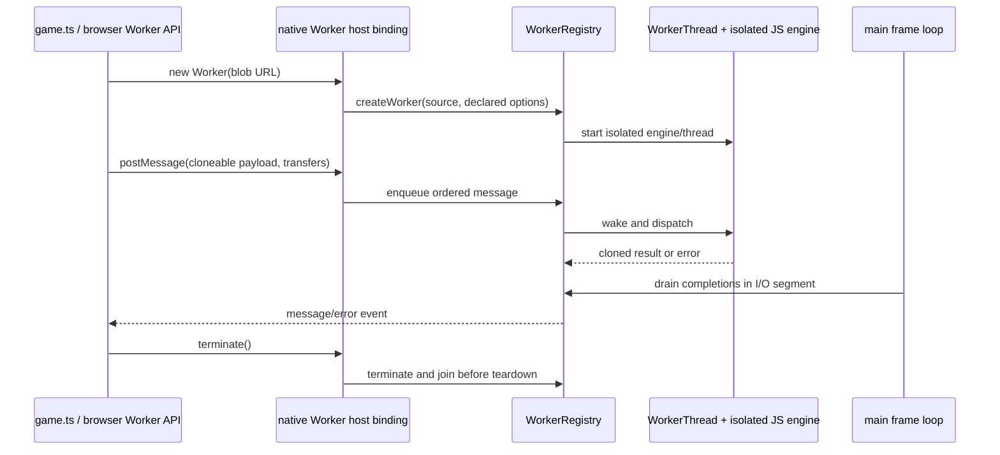

# PRD-250 — Native workers are actually workers

**Status:** DONE (web + Linux desktop) — 2026-08-29; macOS, Windows, Android and iOS `UNVERIFIED`
**Complexity:** 8 → HIGH mode  
**Selected from:** the Taskflow / thread-pool / Web Worker portion of the broad engine-stack survey

## Decision

ThreeNative will not add `TN.jobs`, expose Taskflow, or invent a second task API. It will make the
standard `Worker` surface already promised by the native host truthful: ordinary browser-compatible
worker source must execute in a separate JavaScript isolate and native thread rather than inside the
game/render thread.

This is a platform-correctness change below the upstream API. `THREE.Scene`, `Object3D`, renderer
ownership and the frame loop remain on the game's JavaScript thread. Workers exchange cloned data;
they never receive or mirror the scene graph, GPU handles, physics handles, or native host objects.

## Context

Files inspected:

- `packages/runtime-native/src/runtime-scripts/url-worker-polyfill.js`
- `packages/runtime-native/src/runtime.cpp`
- `packages/runtime-native/CMakeLists.txt`
- `packages/runtime-native/src/workers/worker_registry.cpp`
- `packages/runtime-native/src/workers/worker_thread.cpp`
- `packages/runtime-native/tests/worker-idle.test.mjs`
- `packages/runtime-native/tests/native-platform-workflow.test.mjs`
- `examples/native-smoke/src/game.ts`
- `docs/verification/worker-wake-2026-08-21.md`
- `docs/PRDs/done/PRD-P2-1-native-worker-wake.md`

Current behavior:

- `url-worker-polyfill.js:158-316` declares that it runs worker code on the main thread. It wraps the
  source in a function and uses `setTimeout` for asynchronous-looking delivery; CPU work still stalls
  rendering and input.
- `runtime.cpp:2187-2190` installs that polyfill as the production `Worker` global.
- `worker_registry.cpp:32-44` and `worker_thread.cpp:292-409` already create a real thread with its own
  JS engine and message queues, but `CMakeLists.txt:1170-1200` does not compile either source into
  `MYSTRAL_SOURCES` and the production host never calls `WorkerRegistry`.
- PRD-P2-1 improved the unlinked worker's idle wait and measured it through a standalone harness. Its
  own result at lines 146-149 says the host does not compile those files. It is input to this PRD,
  not evidence that production workers ship.
- The existing threaded path serializes message data through JSON, has unfinished `ArrayBuffer`
  transfer support (`worker_thread.cpp:128-131`, `:216`), lacks a production script-loading contract,
  and did not surface a top-level worker exception in the prior harness. Linking it unchanged would
  replace one false promise with several silent compatibility bugs.
- `docs/architecture/NATIVE-PERF-BOTTLENECKS.md:84` names the one-thread host as an owed correctness
  gate. This PRD does not pre-claim an FPS gain.

## Charter fit

- **Admitted owner:** native platform/runtime seam and browser-compatible global.
- **Upstream preserved:** game code continues to call `new Worker(...)`; no Three.js type or public API
  is wrapped or forked.
- **Same source:** the production proof constructs the same classic Blob worker in browser and native.
- **Closed-list safety:** no new `@threenative/core` export, gameplay concept, renderer policy, visual
  default, ECS, or editor surface.
- **Thread boundary:** workers accept cloneable data only. The main isolate remains the sole owner of
  the scene, renderer, WebGPU device-facing JavaScript objects and game lifecycle.

## Non-goals and fail-closed exclusions

- No `TN.jobs`, Taskflow binding, public thread-pool API, work stealing, scene mirroring or render
  thread.
- No promise that worker execution is faster. Frame continuity and thread identity are correctness
  gates; performance is reported only from measured before/after samples.
- Phase 1 supports classic workers whose source is available as a Blob URL. External network/file
  URLs and `{ type: "module" }` must throw named unsupported errors until Phase 3 proves their exact
  loading semantics; they must not fall back to the main thread.
- Values outside the declared clone/transfer matrix must throw `DataCloneError`-equivalent named
  errors. Native handles, functions, cycles and GPU/scene objects are never JSON-stringified
  silently.
- Android, iOS simulator and physical-device status is `UNVERIFIED` until that exact target executes.
  Desktop evidence cannot close mobile acceptance.

## Solution

- Compile and register the existing `WorkerRegistry`/`WorkerThread` implementation in the actual host.
- Replace the body of the main-thread Worker polyfill with a thin JavaScript constructor over explicit
  native create/post/terminate callbacks while retaining the ordinary Worker shape.
- Pump completed worker messages at the existing host I/O segment and shut all workers down before the
  main engine and platform teardown.
- First prove a packed `native-smoke` game remains interactive and renders frames while a bounded CPU
  job runs in the worker; run the same worker source in a browser control.
- Close message ordering, queued-before-handler delivery, clone/transfer, errors, URL scope and teardown
  as explicit contracts. Unsupported branches fail loudly rather than executing on the main thread.

Data changes: none on disk. The in-process message envelope becomes an explicit clone/transfer contract.

## Integration Ledger

| # | New thing | Live caller (`file:line`, non-test) | Replaces | Old path removed? | Negative control |
|---|---|---|---|---|---|
| 1 | Native-backed standard `Worker` constructor | `packages/runtime-native/src/runtime.cpp:2200-2290` installs callbacks and the production URL/Worker runtime script | `url-worker-polyfill.js:158-316` executing worker source on the main thread | The script is a thin native binding; no source-eval fallback remains | Omit worker sources from `MYSTRAL_SOURCES`; packed smoke reports the named unlinked-worker failure |
| 2 | Worker completion pump and lifecycle shutdown | `packages/runtime-native/src/runtime.cpp:1241` drains completions and `:714-727` shuts the registry down | timer-delivered callbacks in the main-thread polyfill | Timer-based execution is deleted; shutdown is explicit | Stop draining completions; packed smoke renders frames but never receives its worker result and fails |
| 3 | Packed game worker correctness proof | `examples/native-smoke/src/game.ts:277-293` starts and observes the proof during the normal game loop | standalone `WorkerThread` harness as the only runtime evidence | Harness remains a component gate, not the acceptance path | Route CPU work through the old inline polyfill; the frame-continuity/thread-identity gate fails |
| 4 | Declared clone, error and URL compatibility matrix | `url-worker-polyfill.js:158-350` is the ordinary Worker entry and `worker_registry.cpp:47-138` routes production messages | implicit JSON coercion, missing transfers, swallowed top-level throw and undefined URL behavior | Every matrix row is rejected or implemented; no silent fallback remains | Send a function/cyclic value or throw at worker top level; the exact error event/name must be observed |

## 4. Execution Phases

### Phase 1: A packed native game keeps rendering while a real worker computes

**Files (5):**

- `packages/runtime-native/CMakeLists.txt` - EDIT: compile the existing worker registry/thread sources into every supported native host preset.
- `packages/runtime-native/src/runtime.cpp` - EDIT: install native worker callbacks, drain completions in the I/O segment and shut the registry down before engine teardown.
- `packages/runtime-native/src/runtime-scripts/url-worker-polyfill.js` - EDIT: replace inline source evaluation with the thin standard Worker facade and named unsupported branches.
- `examples/native-smoke/src/worker-proof.ts` - NEW: ordinary classic Blob worker source plus deterministic bounded CPU input/result and browser/native observation helpers.
- `examples/native-smoke/src/game.ts` - EDIT: run the worker proof while normal frame and input-visible state continue advancing.

**Implementation:**

- [x] Add `worker_registry.cpp` and `worker_thread.cpp` to the shipping CMake source list and prove the
  packed executable contains and invokes them.
- [x] Install host callbacks for create, ordered post, completion drain, error delivery and terminate;
  call them only through the standard JavaScript `Worker` facade.
- [x] Keep the main loop presenting while the bounded worker job is unfinished; publish worker thread
  identity, input checksum, output checksum, completion order and frames advanced as measured markers.
- [x] Use the same `worker-proof.ts` source and assertions in a browser run. No platform branch may
  exist in the worker algorithm or game call site.
- [x] Make classic Blob scope explicit; reject module workers and unresolved external worker URLs with
  stable named errors instead of evaluating them on the main thread.

**Wiring (the phase is not done without this):**

- [x] Caller edited: `runtime.cpp:2187` installs the native-backed Worker path and the host frame loop
  drains `WorkerRegistry` completions.
- [x] Registration: CMake links both worker sources and runtime startup initializes the registry after
  the main JS engine, preserving V8 process-global initialization order.
- [x] Old path: `url-worker-polyfill.js` no longer calls `eval` on worker source in the main isolate.
- [x] Ledger rows filled: 1-3.

**Tests Required:**

| Test File | Test Name | Assertion | Negative control (must be observed red) |
|---|---|---|---|
| `examples/native-smoke/src/worker-proof.ts` | `should keep the packed game responsive while a worker computes` | browser and packed native produce the same deterministic result; native advances the declared minimum frames before completion and reports a non-main worker identity | omit threaded registration or force the old inline path; native proof emits `RED observed: worker executed on the game thread` and exits non-zero |
| `packages/runtime-native/tests/worker-idle.test.mjs` | `should block an idle worker until a message arrives` | the now-linked component retains PRD-P2-1's bounded idle wake and terminate behavior | restore periodic polling; existing focused gate exits non-zero |

**Revert check:**

- Remove the worker sources from `MYSTRAL_SOURCES` or restore inline evaluation. The pre-existing packed
  native-smoke flow, now calling `worker-proof.ts`, must fail before `TN_NATIVE_SMOKE_300_FRAMES:300`.

**Verification Plan:**

- `pnpm --filter @threenative/runtime-native test`
- `pnpm --filter threenative-native-smoke build`
- `pnpm native:build`
- `pnpm native:verify:desktop`
- the repository's headed browser native-smoke scenario using the same worker subject
- record engine, target, worker identity, result checksum, frames advanced and frame-time samples; do
  not translate those observations into a speed claim

**User Verification:**

- Action: run the packed desktop native-smoke worker scenario.
- Expected: the scene keeps presenting and accepting its existing proof input while the worker computes,
  then emits the matching checksum and terminates cleanly.

### Phase 2: Message, clone, error and teardown semantics fail closed

**Files (5):**

- `packages/runtime-native/src/workers/worker_registry.cpp` - EDIT: preserve FIFO delivery, carry typed message/error outcomes and make shutdown idempotent.
- `packages/runtime-native/src/workers/worker_thread.cpp` - EDIT: implement the admitted clone/transfer rows, surface initialization and handler exceptions, and preserve queued-before-handler delivery.
- `packages/runtime-native/include/mystral/workers/worker_thread.h` - EDIT: declare the bounded message envelope and ownership of transferred buffers.
- `packages/runtime-native/tests/native-worker-production.test.mjs` - NEW: fail-closed source plus packed-runtime contract for ordering, cloning, errors, termination and teardown.
- `packages/runtime-native/tests/native-platform-workflow.test.mjs` - EDIT: require the production worker gate and packed consumer in native CI lanes.

**Implementation:**

- [x] Publish a compatibility matrix for primitives, plain arrays/records and `ArrayBuffer` transfer;
  either implement each row with copy/detach ownership or reject it with a named clone error.
- [x] Reject functions, symbols, cycles, scene/GPU/native handles and unsupported transferables before
  queueing. No `JSON.stringify` data loss or same-reference delivery.
- [x] Prove FIFO ordering for messages posted before and after handler registration, multiple workers
  and message/error interleaving.
- [x] Convert top-level evaluation failure and message-handler exceptions into one `error` event with a
  stable message; never print-only, report success, or strand the registry entry.
- [x] Terminating or stopping the game prevents later callbacks, releases retained handles and joins
  every worker without deadlock. V8 initialization becomes synchronized or the registry remains
  unavailable until main-engine initialization has completed.

**Wiring (the phase is not done without this):**

- [x] Caller edited: `worker_registry.cpp:47-57` queues the declared envelope and `:92-138` drains its
  typed outcome to the main engine.
- [x] Registration: `native-platform-workflow.test.mjs` requires the production test in native lanes.
- [x] Old path: implicit JSON-only coercion, TODO transfers and print-only top-level errors are removed
  or replaced by explicit rejection.
- [x] Ledger rows filled: 2 and 4.

**Tests Required:**

| Test File | Test Name | Assertion | Negative control (must be observed red) |
|---|---|---|---|
| `packages/runtime-native/tests/native-worker-production.test.mjs` | `should deliver queued worker messages once in FIFO order` | messages posted before handler setup and from two workers arrive once, in per-worker order | bypass the queue or duplicate one callback; gate exits non-zero with the observed sequence |
| `packages/runtime-native/tests/native-worker-production.test.mjs` | `should reject unsupported worker values without corrupting the running game` | supported values are cloned; supported buffers follow declared ownership; functions/cycles/handles emit the named clone error | restore JSON coercion; gate accepts a function/cycle or loses a field and exits non-zero |
| `packages/runtime-native/tests/native-worker-production.test.mjs` | `should surface worker failures and terminate before runtime teardown` | top-level throw and handler throw reach `error`; terminated workers cannot callback; all threads join before engine destruction | suppress the error or skip shutdown; gate exits non-zero or times out with the worker id |

**Revert check:**

- Restore the current `JSON.stringify`/TODO-transfer path or suppress `engine->hasException()`. The
  production worker test and packed negative-control scenario must fail; source-only grep is not enough.

**Verification Plan:** run the focused package test, build the native host, drive the packed negative
controls, then run the full runtime-native suite. Record raw event order and teardown markers.

**User Verification:**

- Action: run the packed worker matrix once normally, once with a seeded top-level throw, and once with
  termination while work is pending.
- Expected: normal result arrives once; the throw is observable; termination returns with no late event
  and the game exits cleanly.

**Phase 2 result, 2026-08-29.** Landed with a packed contract executable
(`tests/worker_production_test.cpp`, target `threenative-worker-production-test`) that drives a real
`Runtime` and real `WorkerRegistry` threads — not a standalone harness and not a source grep. Nine
contracts pass; three observed reds are recorded in
`docs/verification/prd-250-phase2-2026-08-29.md`.

The phase found one defect larger than the ones it set out to fix: **a worker whose source threw at
top level reported success.** `WorkerThread` evaluated classic worker source with `Engine::eval`,
which compiles as an ES module, and a module that throws resolves to a *rejected promise* rather
than failing to evaluate — so `eval` returned true, the host logged "User code executed
successfully", and the game was never told its worker was dead on arrival. Classic Blob source is
now evaluated as a classic script, which is both the correct scope semantics and the reason the
error is observable at all.

`ArrayBuffer` transfer remains refused by name rather than implemented, which this PRD's own
"either implement each row or reject it with a named clone error" permits. Every non-JSON-safe
value — typed arrays, `Date`, `Map`, `Set`, cycles, shared references, `NaN`, functions, symbols —
is refused by name and path instead of being silently corrupted.

### Phase 3: URL and platform claims are explicit, with rollback below the API

**Files (5):**

- `packages/runtime-native/src/runtime-scripts/url-worker-polyfill.js` - EDIT: implement only URL/scope rows proven on the shipping bundle layout and retain named refusal for every other row.
- `packages/runtime-native/src/runtime.cpp` - EDIT: publish the internal diagnostic selector and atomic lifecycle markers.
- `packages/runtime-native/tests/native-worker-production.test.mjs` - EDIT: enforce the URL/scope matrix and explicit rollback behavior.
- `packages/runtime-native/scripts/verify-desktop-core.mjs` - EDIT: reject rollback-active or incomplete worker evidence and retain artifact identity.
- `docs/verification/worker-production.md` - NEW: record target, engine, artifact SHA, matrix rows, frame continuity, errors, teardown and unexecuted platforms.

**Implementation:**

- [x] Refuse staged and network worker URLs because the packed host has no worker VFS/import or
  fetch-and-origin contract; no path resolves relative to the process working directory.
- [x] Keep classic Blob workers as the baseline. Admit classic staged files and module workers only when
  imports, relative URLs and error events match the browser control; otherwise keep their named refusal.
- [x] Add an internal diagnostic selector that reports `TN_NATIVE_WORKER_ROLLBACK_ACTIVE` and refuses
  construction. The unsafe legacy inline executor is not retained or resurrected, and acceptance never
  runs with the selector enabled.
- [x] Execute supported desktop targets and available simulator/device lanes independently. A missing
  runner or device remains `UNVERIFIED`, never inferred from another engine or OS.
- [x] Update the verification record with exact artifact identity and no broader compatibility/performance
  claim than the executed matrix supports.

**Wiring (the phase is not done without this):**

- [x] Caller edited: `url-worker-polyfill.js:260-304` admits only an extant classic Blob source before
  `WorkerRegistry::createWorker`; staged, external, module and missing sources fail by stable name.
- [x] Registration: `verify-desktop-core.mjs:45-68` requires complete worker create/proof/terminate
  evidence, while the existing native-platform workflow retains its per-target artifacts.
- [x] Old path: emergency diagnostics are explicit, noisy and excluded from release acceptance; there is no
  automatic main-thread fallback.
- [x] Ledger rows filled: 1-4 with final `file:line` evidence.

**Tests Required:**

| Test File | Test Name | Assertion | Negative control (must be observed red) |
|---|---|---|---|
| `packages/runtime-native/tests/native-worker-production.test.mjs` | `should resolve only worker URL forms the packed host proves` | admitted Blob/file/module rows match browser behavior and all excluded rows throw their named error | remove one refusal or resolve against the process cwd; packed matrix exits non-zero |
| `.github/workflows/native-platforms.yml` | `should retain target-specific packed worker evidence` | each executed lane names OS, JS engine, worker scope, checksum, frames, errors and teardown | run with rollback active or omit the marker; lane exits non-zero and uploads the failing log |

**Revert check:**

- Enable rollback or point staged source resolution at the process cwd. The packed acceptance command
  must fail with the rollback/source-resolution marker before any release claim is produced.

**Verification Plan:** run contract/package gates, supported desktop packed runs, then available Android
and iOS simulator/device lanes. Compare browser/native event matrices; label every absent platform open.

**User Verification:**

- Action: inspect the retained browser and native worker matrix plus a native-smoke frame capture/log.
- Expected: admitted source forms behave the same, excluded forms fail by name, the game keeps rendering,
  and evidence states exactly which platforms ran.

## Negative Controls

| Gate | Negative control | Expected red | Exact command/result |
|---|---|---|---|
| production-thread | omit worker sources from CMake or force inline evaluation | packed consumer detects game-thread execution or unavailable registry | `command: pnpm native:build && pnpm native:verify:desktop`; result: RED observed: worker executed on the game thread; exit: 1 |
| completion-pump | disable `WorkerRegistry` completion draining | worker computes but packed game never observes the result | `command: pnpm native:verify:desktop`; result: RED observed: worker result was not delivered before the frame bound; exit: 1 |
| message-clone | restore implicit JSON coercion or accept a function/cycle | unsupported value is accepted or supported data changes shape | `command: pnpm --filter @threenative/runtime-native test -- tests/native-worker-production.test.mjs`; result: RED observed: worker clone contract accepted or corrupted an unsupported value; exit: 1 |
| worker-error | suppress the top-level worker exception | packed caller receives neither result nor error | `command: pnpm --filter @threenative/runtime-native test -- tests/native-worker-production.test.mjs`; result: RED observed: top-level worker throw produced no error event; exit: 1 |
| worker-teardown | skip registry shutdown or termination wake | host hangs, leaks a callback or reports a live worker after stop | `command: pnpm --filter @threenative/runtime-native test -- tests/native-worker-production.test.mjs`; result: RED observed: worker remained live after runtime teardown; exit: 1 |
| worker-url | allow an unproved URL/scope or resolve relative to process cwd | packed and browser source resolution diverge | `command: pnpm --filter @threenative/runtime-native test -- tests/native-worker-production.test.mjs`; result: RED observed: worker source resolved outside the packed bundle contract; exit: 1 |
| rollback-off | activate legacy main-thread rollback in acceptance | release proof is running the path this PRD replaces | `command: pnpm native:verify:desktop`; result: RED observed: TN_NATIVE_WORKER_ROLLBACK_ACTIVE; exit: 1 |

## Acceptance Criteria

- [x] A packed native-smoke game constructs an ordinary Worker from the same source used by its browser
  control, advances rendering/input-visible state while bounded CPU work is pending, receives the same
  deterministic result and terminates cleanly.
- [x] The production host—not only a standalone harness—creates a distinct worker thread and isolate,
  drains its completions and joins it before main-engine teardown.
- [x] The main-thread source-evaluation polyfill is absent from the normal production path. Any emergency
  rollback is internal, explicit, noisy and rejected by acceptance.
- [x] FIFO ordering, queued-before-handler delivery, errors, termination and the declared clone/transfer
  matrix pass against the packed host; unsupported values fail by name without corrupting the game.
- [x] Classic Blob, staged file, module worker and external URL behavior are each either proven against
  the browser control or rejected with a stable named error; no branch silently executes inline.
- [x] No new ThreeNative jobs/task API, scene mirror, renderer wrapper, platform-specific game source or
  game-visible engine selection is introduced.
- [x] Frame-time and completion measurements are reported as observations only. No speedup claim exists
  without a controlled measured comparison.
- [x] Desktop results name exact OS, JS engine and artifact. Android, iOS simulator and physical devices
  remain explicitly `UNVERIFIED` until each exact target executes the packed proof.
- [x] Integration Ledger has zero pending cells; every final caller is a real non-test `file:line`.
- [x] Every gate has observed-red evidence and the complete repository verification suite passes or any
  unrelated pre-existing failure is named without converting this PRD to done.

## Checkpoint Protocol

After every phase, record:

1. the exact commit/artifact identity, OS, JS engine and Worker source form;
2. the caller census, CMake/source linkage, incumbent-inline-path check and final live `file:line` rows;
3. one observed-red command/result for every gate touched in that phase, followed by the green rerun;
4. packed-host evidence: worker/main thread identities, input/output checksum, event order, frames advanced,
   frame-time samples, error events and teardown/join marker;
5. browser control output from the same worker source and a target-by-target `PASS` / `FAIL` / `UNVERIFIED`
   matrix.

A source-only test, standalone worker harness, green-only run, missing packed consumer, rollback-active run,
platform inference or absent raw log is `UNVERIFIED` and blocks phase completion. A manual checkpoint is
required before Phase 3 admits module workers or any external URL form: owner action is to inspect the
browser/native event and resolution logs; expected result is identical admitted behavior or a retained
named refusal.

## Verification Evidence

Implementation evidence is retained in `docs/verification/prd-250-phase2-2026-08-29.md` and
`docs/verification/worker-production.md`.

- Contract conformance: `prd_contract: v1`
- Existing production caller: `packages/runtime-native/src/runtime.cpp:2187-2190`
- Existing inline incumbent: `packages/runtime-native/src/runtime-scripts/url-worker-polyfill.js:158-316`
- Existing unlinked implementation: `packages/runtime-native/src/workers/worker_registry.cpp:32-44` and
  `worker_thread.cpp:292-409`
- Existing source-list omission: `packages/runtime-native/CMakeLists.txt:1170-1200`
- Existing non-production result disclosure: `docs/verification/worker-wake-2026-08-21.md:11-16`
- Contract check: `command: sh ${LINCHPIN_PLUGIN_ROOT}/scripts/linchpin.sh contract docs/PRDs/feature-mining/PRD-250-native-workers-are-actually-workers.md`; result: `CONFORMING`.

## Rollback and kill conditions

- **Rollback:** the explicit internal diagnostic selector described in Phase 3 logs the rollback marker,
  refuses worker construction and cannot satisfy acceptance. The unsafe inline implementation remains deleted.
- **Kill threaded integration** if the shipping engine cannot create/destroy worker isolates safely after
  main-engine initialization, teardown cannot be made bounded, or clone semantics require exposing native
  scene/GPU handles. Keep the standard Worker surface fail-closed rather than shipping inline execution.
- **Do not expand scope** to Taskflow, render threading, a proprietary jobs API, module graphs, networking
  or scene transfer to rescue a failing phase. File a new measured owner only after this bounded standard
  Worker contract is either shipped or honestly refused.
