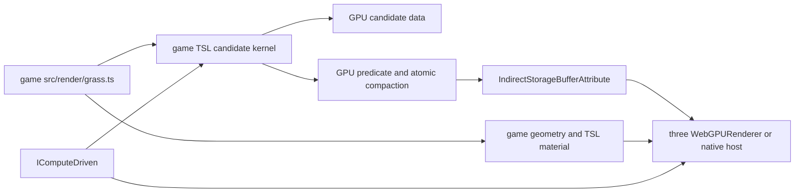

# PRD-255 — A million grass candidates are game source

**Status: DONE, 2026-08-29 — web only, with the conditional phase DECLINED.** A game-owned field of
exactly 1,048,576 candidates, GPU-culled and compacted by an atomic counter into an indirect draw
whose instance count the CPU never sets, is proven by a real consumer built outside this repository:
[`sandbox/last-harvest`](https://github.com/ThreeNativeHQ/examples/tree/main/last-harvest), whose win
condition is a number only the GPU knows. The framework's whole share is the indirect-geometry
projection guard — `packages/core` gained no grass, blade, species, biome, density or foliage
vocabulary. Evidence:
[docs/verification/PRD-246-255-spectral-ocean-and-gpu-candidate-field.md](../../verification/PRD-246-255-spectral-ocean-and-gpu-candidate-field.md).

**Phase 4 is `DECLINED`, which this PRD names as a successful outcome:** `GPUInstanceField` was not
created, because the extraction gate needs two independent consumers and there is one.

**Still `UNVERIFIED`, and not claimed:** native desktop conformance — the
`77-gpu-driven-indirect-instances` registry row was not added; Android and iOS; `pnpm budgets`,
`pnpm quality` and `count-loc`; and every frame meter Phase 5 asks for, so no paired web/native
measurement of `render.p50`, `render.p95`, hitch maximum or buffer bytes exists. The baseline tree
named below (`ba7ea6d3`) is the one this lane was filed against; the work landed on `8ff06738`.

Source: [`momentchan/false-earth`](https://github.com/momentchan/false-earth), MIT, pinned to
`468a0cfd71698400103198a8eb91d5176fe4f59e`, cloned and read on 2026-08-28. The source is a
reference, not a dependency; no source is copied. The scale claim is independently described by
[`Grasslands: 8.8 million blades of grass in a browser tab`](https://threenames.dev/posts/grasslands),
published 2026-06-16.

Parent batch: [feature-mining](../feature-mining/README.md).

**Complexity:** +2 GPU storage, atomic compaction and indirect draw state, +2 compute lifecycle and
projection interaction across frames, +2 browser/native conformance, +1 public surface if the
generic extraction survives its kill gate, +1 new example and playtest = **8 → HIGH mode**.

## 1. Decision

ThreeNative should prove a million-candidate grass field, but it must not ship a `Grass3D`,
`Vegetation`, `Biome`, `BladeMaterial` or species system. The game owns the candidate source and
every appearance decision. The framework may ship only the generic mechanism that is difficult to
repeat safely: reset a GPU survivor counter, run a game-supplied candidate kernel, compact survivors
into an indirect draw, participate in `IComputeDriven`, and avoid corrupting that draw when the
render projection is active.

The first implementation is deliberately a plain-Three.js game-owned baseline. It uses the
existing `IComputeDriven` contract, TSL storage nodes, `BufferGeometry.setIndirect()` and
`IndirectStorageBufferAttribute` directly. Only after that baseline is measured against a second
consumer may the repeated mechanism become a generic `GPUInstanceField` export. If the extraction
does not reduce code or improve correctness, the generic export is not created; the game-owned
baseline is the result.

The reference scale is **1,048,576 candidates** (`1024 × 1024`), not a promise that all candidates
are visible. A compute pass derives candidate data, rejects candidates using a game-supplied
predicate, atomically appends survivors, and writes the survivor count into an indirect draw
buffer. The CPU may update camera/tile inputs and collect throttled diagnostics; it must not write
or read one million candidate records in the render loop.

## 2. What the reference actually proves

The pinned repository is useful because it separates a real GPU-driven mechanism from the look it
renders, even though its application-level files are intentionally coupled. The relevant census is:

| Reference evidence | What it proves | Ownership in this PRD |
| --- | --- | --- |
| `src/components/grass/core/config.ts:8-12` | A 1024-by-1024 grid is 1,048,576 candidate blades; area and spacing are inputs. | Game source; no density default in a package. |
| `src/components/grass/core/grassCompute.ts:40-131` | TSL can compact accepted candidates into LOD-specific index/counter buffers. | Generic mechanism only; candidate math and acceptance stay game source. |
| `src/components/grass/core/grassCompute.ts:133-290` | Position hashing, terrain sampling, clumps, width, height, bend, type, wind and push are all authored choices. | Game `src/render/`; never an engine grass API. |
| `src/components/grass/core/grassCompute.ts:298-310` | Resetting the indirect draw fields and the atomic counter is a separate one-thread pass. | Candidate-field mechanism, if extraction earns it. |
| `src/components/grass/core/grassGeometry.ts:8-29` | A small blade geometry and storage-backed instance data are enough for the render graph. | Geometry and packed record layout are game source. |
| `src/components/grass/core/grassMaterial.ts:1-69`, `:103-126`, `:152-375` | The material maps compact instance indices back to source data, bends Bezier blades, applies wind/push, and chooses colour/roughness/emissive. | Game `src/render/`; all appearance is refused in core. |
| `src/components/grass/core/GrassLOD.tsx:27-60` | Each LOD draw binds its own indirect buffer and mesh count. | Game composition; a generic helper may remove only repeated binding/lifetime code. |
| `src/components/grass/GrassWebGPU.tsx:12-69` | Grid snapping, tile offset and character position are application state. | Game source; no world, biome or tile policy in core. |

The independent scale reference describes 8,856,576 candidates on a 2,976-by-2,976 grid, compute
culling and one indirect draw. It also reports that the CPU does not read or touch individual blade
data during rendering. Those are algorithm and measurement targets, not permission to copy its
terrain, colour, wind or camera choices.

## 3. Current ThreeNative surface and the gap

The incumbent is already close enough that this PRD must not invent a second compute lifetime:

| Existing surface | Evidence at baseline | Consequence |
| --- | --- | --- |
| `IComputeDriven` | `packages/core/src/compute-driven.ts:11-24` | The game-owned field can declare warmup nodes, attach the active renderer, process in fixed or render cadence, and release buffers. |
| Ordered registry | `packages/core/src/compute-driven.ts:41-80` | `ctx.add()` already registers and dispatches compute-driven objects in scene-add order. |
| Renderer seam | `packages/core/src/renderer.ts:104`, `:267-271` | Compute is exposed through the existing WebGPU guard; no raw renderer wrapper is needed. |
| Startup warmup | `packages/core/src/game.ts:700-704` | Candidate and reset kernels can join the startup compile window. The game must not await a private warmup path. |
| Render/fixed dispatch | `packages/core/src/game.ts:854-857`, `:918-920` | A field declares its cadence and is dispatched by the normal loop. |
| Three.js indirect API | installed `three@0.185.1` exposes `BufferGeometry.setIndirect()` and `IndirectStorageBufferAttribute` | The public mechanism can remain ordinary Three.js and TSL. |
| Native indirect opcodes | `packages/runtime-native/src/runtime-scripts/frame-op-stream.js:229-243`; `packages/runtime-native/src/webgpu/bindings.cpp:4123-4128`, `:4389-4440` | Native already transports indirect draw calls, but no conformance case proves a compute-written instance count reaches a real draw. |
| Render projection | `packages/core/src/projection-plan.ts:703-710`; `packages/core/src/projection-apply.ts:157-205` | The current projection can clone an `InstancedMesh` without preserving its indirect state. An indirect field must be declined or preserved explicitly before it enters a mixed scene. |

The current projection's `COMPACT_INSTANCED_BATCHES = false` decision is not this feature. Its CPU
instance compaction is a separate optimisation and must not be reused for a GPU-owned candidate
buffer. The field's one `Object3D` is not one million CPU instances.

## 4. Charter split and scope

### The two questions

**(a) Could a game write it portably?** Yes for the grass content and, with today's Three.js APIs,
yes for the first direct implementation. `false-earth` proves the browser-side TSL shape. The
framework case is narrower: a generic reset/compaction/indirect/lifecycle wrapper may be admitted
only when two independent consumers demonstrate repeated, error-prone plumbing and the wrapper is
smaller than the repeated game code.

**(b) Does it decide how anything looks?** The grass reference does, so its look is refused. A
generic field is admissible only if the game supplies the geometry, material, packed data layout,
candidate kernel, acceptance predicate, LOD split, colour, texture, bend curve, wind and timing.
Any framework option that names a species, blade shape, palette, biome, density preset or wind
feel fails this test.

| Responsibility | Owner | Required contract |
| --- | --- | --- |
| Candidate count, grid/tiling, seed, hash/noise, terrain sample and density | Game | Explicit values in `src/render/grass.ts`; no package default that makes a grass look. |
| Candidate record layout and fields | Game | The material and compute nodes agree on a game-owned storage layout. |
| Frustum/distance/terrain acceptance predicate | Game, using generic inputs | The framework provides no culling policy or distance thresholds. |
| Reset, survivor counter, compacted index buffer and indirect draw metadata | Generic mechanism, only if the A/B gate opens | All counters are reset before the candidate pass; draw count comes from the GPU. |
| Warmup, ordered dispatch, scene removal and buffer release | Existing `IComputeDriven` registry | No second lifecycle, private loop, or hidden global registry. |
| Blade geometry, vertex deformation, LOD geometry and TSL material | Game `src/render/` | No `Material`, `Color`, texture, curve, light or camera in `packages/core`. |
| Projection interaction | Core projection safety guard | An indirect field is never silently cloned without its indirect state. |
| Native transport and proof | `packages/runtime-native` conformance | Browser and native desktop execute the same game source; mobile is unclaimed until run. |

### In scope

- A game-owned 1,048,576-candidate WebGPU/TSL proof with a real playtest.
- GPU-side survivor compaction and an indirect indexed draw, with no per-candidate CPU matrix or
  visibility loop.
- Reuse of `IComputeDriven` warmup, cadence, dispatch and release.
- A conservative projection rule that keeps GPU-owned indirect geometry on the authored path unless
  the projection can preserve its semantics exactly.
- A conditional, appearance-neutral `GPUInstanceField` extraction, measured against the direct
  game-owned implementation and a second independent consumer.
- Native desktop conformance and explicit reporting of unsupported/unrun Android and iOS lanes.

### Permanent non-goals

- `Grass3D`, `Vegetation`, `Biome`, species, density, orientation, terrain, foliage, wind or
  interaction APIs.
- Grass geometry, material, colour, texture, Bezier curve, blade dimensions, LOD distances or
  quality presets in a package or template.
- CPU-side per-candidate culling, matrix uploads, visibility lists or synchronous GPU readback in
  the render loop. A throttled count readback is diagnostics only and must never control drawing.
- A second renderer, raw-WGSL-only contract, GPU ECS, scene format, editor, worker vocabulary or
  native rendering fork.
- Claiming that one million candidates means one million visible blades or a fixed FPS on every
  adapter. The report records candidate count, survivor count where observable, draw submissions,
  frame meters, adapter and target.

## Integration Ledger

| # | New thing | Live caller (`file:line`, non-test) | Replaces | Old path removed? | Negative control |
| --- | --- | --- | --- | --- | --- |
| 1 | Game-owned million-candidate field | `examples/prd255-grass/src/game.ts` | Nothing; this is the direct baseline | n/a | remove the field's `ctx.add()` call → compute dispatch and the visible field assertion fail |
| 2 | `GPUInstanceField`, generic extraction only if the A/B gate opens | `optional/unbuilt: no independent non-grass caller exists at filing` | Repeated game-owned reset/compaction/indirect/lifecycle plumbing | No; do not add it without the second-consumer and LOC gates | force the helper arm to use CPU candidate writes → the CPU-touch and frame-budget assertions fail |
| 3 | Indirect-geometry projection safety rule | `packages/core/src/projection-plan.ts` | Silent projection of an indirect `InstancedMesh` through a proxy that may lose indirect state | yes — indirect fields stay on the authored path until preservation is proven | remove the guard in a 300-mesh mixed scene → the projection test observes an indirect field on the mirror and fails |
| 4 | Native compute-written indirect-instance conformance row | `packages/runtime-native/conformance/registry.json` | Existing storage/compute smoke rows, which do not exercise indirect draw count | n/a | replace the GPU-written count with a fixed CPU count → density toggle and native visual assertions fail |

## 4. Execution Phases

### Phase 1 — The direct baseline: grass source stays in the game

**Files (5):**

- `examples/prd255-grass/package.json` - NEW: a private WebGPU/native proof project with the existing workspace `three` and `@threenative/core` dependencies.
- `examples/prd255-grass/index.html` - NEW: the browser entry and diagnostic surface for the proof.
- `examples/prd255-grass/src/game.ts` - NEW: the game scene, camera/input state, `ctx.add()` wiring and consumer observations.
- `examples/prd255-grass/src/render/grass.ts` - NEW: the game-owned candidate kernel, packed data, blade geometry, indirect buffers, LOD composition and TSL material.
- `docs/PRDs/feature-mining/README.md` - EDIT: register PRD-255 in the feature-mining filing table after the artifact is accepted.

The direct baseline deliberately does not import a future `GPUInstanceField`. It must:

- Construct exactly 1,048,576 candidates from an explicit game-owned grid and seed.
- Use `instancedArray`, `instanceIndex`, a reset compute node, an acceptance/compaction compute node,
  `IndirectStorageBufferAttribute` and `geometry.setIndirect()` through ordinary `three/webgpu` and
  `three/tsl` imports.
- Put every blade record field and every visual choice in `src/render/grass.ts`. The package sees an
  `Object3D` implementing `IComputeDriven`, not grass vocabulary.
- Set the draw's CPU-side instance bound and frustum policy deliberately, with a comment explaining
  why a full candidate field cannot use a single CPU bounding sphere for per-instance culling.
- Publish game-owned observations: candidate count, attach count, reset dispatches, candidate
  dispatches, CPU candidate writes, indirect binding present, and whether the field rendered after
  startup. These are diagnostics, not a second engine contract.

**Tests and red-green evidence:** the build must compile the direct path before extraction. A later
phase drives it with a playtest; no screenshot alone closes this phase. The first red mutation is to
replace the game-owned indirect count with a constant CPU `instanceCount`; the density toggle in
Phase 2 must then render the same field and fail, proving the baseline is exercising the GPU count.

### Phase 2 — A browser playtest and a projection guard

**Files (5):**

- `examples/prd255-grass/playtests/million-candidates.playtest.json` - NEW: a real browser scenario that waits for startup, drives the density/camera toggle, and asserts state plus rendered change.
- `examples/prd255-grass/src/game.ts` - EDIT: expose fail-closed observations and the input-driven comparison frames consumed by the scenario.
- `examples/prd255-grass/src/render/grass.ts` - EDIT: make the candidate acceptance toggle and diagnostic counters deterministic for the scenario without moving appearance decisions into core.
- `packages/core/src/projection-plan.ts` - EDIT: decline projection for an indirect geometry that the mirror cannot preserve, naming the reason in the existing projection report.
- `packages/core/__tests__/renderProjection.spec.ts` - EDIT: cover a mixed scene with an indirect `InstancedMesh` and enough ordinary meshes to engage projection.

The playtest must prove all of the following:

- Startup completes with `candidateCount === 1_048_576`, one attachment, reset-before-candidate
  ordering, no CPU candidate writes and a nonzero candidate dispatch count.
- The input-driven density/toggle frame changes the rendered result while keeping the candidate
  count fixed. A static field with a plausible screenshot is insufficient.
- Draw metrics show one indirect field submission (plus the known presentation/world draws), and
  the field remains visible after the normal startup warmup.
- The projection unit test proves the safe failure mode: if a mixed scene would lose indirect
  semantics, the authored scene is rendered and the report names `unsupportedObject` rather than
  silently drawing a proxy with the wrong count.

The phase's focused automated checks are `pnpm exec vitest run packages/core/__tests__/renderProjection.spec.ts`
and the project playtest with `--browser-recipe webgpu`. The playtest is the integration proof; the
unit test only proves the projection guard.

### Phase 3 — Same game source on native desktop

**Files (4):**

- `examples/prd255-grass/src/conformance.js` - NEW: the native visual-parity entry that imports the same game-owned grass builder and checks compute-written indirect count, density change and non-blank output.
- `examples/prd255-grass/src/render/grass.ts` - EDIT: export the same field factory to the conformance entry without adding a native branch to the candidate or material source.
- `packages/runtime-native/conformance/registry.json` - EDIT: add `77-gpu-driven-indirect-instances` with the same web reference, desktop gate and explicit target status.
- `examples/prd255-grass/package.json` - EDIT: add the existing native bundle/build commands used by the conformance runner.

The conformance case must use the existing `startVisualScene`/registry shape and a real
`renderer.computeAsync` warmup where the native lane supports it. It must wait for submitted work
before checking the visual and must return named details: candidate count, reset/candidate pass
counts, indirect attribute identity, density-toggle difference, draw submissions and target.

The required parity pair is headed browser WebGPU with a named adapter and native desktop using the
same source. `three/webgpu`, TSL and the native host remain untouched. Android emulator, physical
Android and iOS are separate target observations; an unrun target is `UNVERIFIED`, never a pass
inferred from desktop.

### Phase 4 — Extract only the repeated mechanism, if the kill gate opens

This phase is conditional. It is skipped when there is only the one grass consumer or when the
direct baseline is smaller/equally clear. Skipping it is a successful game-source outcome, not an
unfinished implementation.

**Files (5):**

- `packages/core/src/gpu-instance-field.ts` - NEW: a provisional appearance-neutral `GPUInstanceField` wrapper for candidate storage, reset/compaction/indirect metadata and `IComputeDriven` lifecycle.
- `packages/core/src/index.ts` - EDIT: expose the generic helper only if its public contract stays free of grass and appearance vocabulary.
- `packages/create-threenative/capabilities.json` - EDIT: regenerate the situation/constraint entry through `pnpm build`; do not hand-edit the manifest.
- `packages/core/__tests__/gpu-instance-field.spec.ts` - NEW: lifecycle, reset ordering, invalid-input and release coverage against an `IRendererLike` test double.
- `examples/prd255-grass/src/render/grass.ts` - EDIT: replace only the proven repeated plumbing with the helper while retaining the candidate kernel, record layout, geometry, LOD, material and all visual parameters.

The provisional helper contract is intentionally small:

- Inputs are an explicit candidate count, game-owned geometry/material and game-created TSL pass
  nodes or builder callback. Missing or invalid counts throw; no default density is invented.
- Outputs are the indirect buffer, visible-index storage and any node handles the game must wire into
  its own material. The helper does not know what a candidate means.
- Behavior is reset → candidate pass → indirect draw binding, attached/detached through
  `IComputeDriven`, with no synchronous readback and no per-frame CPU candidate loop.
- The helper marks or otherwise exposes its indirect geometry so the projection guard cannot clone it
  incorrectly. It must not add a second registry or loop.

The A/B gate compares the captured direct baseline, the helper arm and a second independent
non-grass consumer. The helper ships only if it is materially shorter across both repetitions,
preserves the same rendered behavior and does not add a measurable steady-state frame cost. If the
second consumer does not exist, or if plain Three.js is clearer, the new file and export are not
created.

### Phase 5 — Target measurements, boundary audit and handoff

**Files (5):**

- `docs/verification/PRD-255-million-grass.md` - NEW: the run record with commit, adapter/device, target, candidate/survivor counts, draw metrics, frame p50/p95, peak frame, startup warmup and every red-green control.
- `docs/PRDs/feature-mining/README.md` - EDIT: record the measured outcome, including whether the conditional helper was shipped or declined.
- `examples/prd255-grass/playtests/million-candidates.playtest.json` - EDIT: lock the final consumer assertions and fail-closed visual/state observations.
- `examples/prd255-grass/src/game.ts` - EDIT: remove temporary probes while retaining the consumer-facing diagnostics required by the scenario.
- `examples/prd255-grass/src/render/grass.ts` - EDIT: remove temporary A/B toggles while retaining game-owned candidate and appearance source.

Record three paired captures on one browser display lane and three native desktop runs after warmup.
Use `render.p50`, `render.p95`, hitch maximum, draw submissions, candidate count, survivor count
when the diagnostic readback is available, GPU/CPU buffer bytes and adapter information. Do not
translate Xvfb present cadence into FPS. If a mobile target is run, record the physical/emulator
identity and thermal state; if it is not run, state that explicitly.

The final boundary audit must show that `packages/core` contains no grass/blade/species/biome
vocabulary, no colour/palette/texture/curve/wind/LOD default, and no per-candidate CPU loop. The
game source must be able to change its material and its packed record layout without a package edit.

## Negative Controls

Every row below is an intentional mutation of the phase under test. The command is run after the
mutation and before the mutation is reverted; a green-only run does not satisfy the row.

| Gate | Negative control | Expected red | Exact command/result |
|---|---|---|---|
| P1-build | Replace the game-owned indirect count with a fixed CPU `instanceCount`. | The later density toggle no longer changes the rendered survivor set. | `command: pnpm --filter prd255-grass build`; result: RED observed: direct baseline no longer exercises GPU-written indirect count; exit: 1 |
| P2-web | Remove the reset pass or make the density predicate a no-op. | The playtest observes stale/all survivors instead of the input-driven rendered difference. | `command: node packages/playtest/dist/runner/cli.js examples/prd255-grass/playtests/million-candidates.playtest.json --url http://127.0.0.1:5181 --server-command "pnpm --filter prd255-grass dev --host 127.0.0.1 --port 5181 --strictPort" --browser-recipe webgpu --headed`; result: RED observed: density toggle did not change the rendered field or reset ordering; exit: 1 |
| P2-lifecycle | Remove the `ctx.add()` call that attaches the field to the scene and compute registry. | Attachment or dispatch observation stays zero and the field does not render. | `command: node packages/playtest/dist/runner/cli.js examples/prd255-grass/playtests/million-candidates.playtest.json --url http://127.0.0.1:5181 --server-command "pnpm --filter prd255-grass dev --host 127.0.0.1 --port 5181 --strictPort" --browser-recipe webgpu --headed`; result: RED observed: compute-driven field was not attached and no candidate dispatch was observed; exit: 1 |
| P2-projection | Remove the indirect-geometry guard from `projection-plan.ts`. | A mixed scene projects the field through a proxy that lacks the source indirect state. | `command: pnpm exec vitest run packages/core/__tests__/renderProjection.spec.ts`; result: RED observed: projection report did not decline the indirect field and the mirror lost its indirect draw semantics; exit: 1 |
| P3-native | Replace the compute-written survivor count with a fixed CPU count in the conformance bundle. | Native density toggle produces the same capture or wrong draw details. | `command: sh scripts/xvfb.sh node packages/runtime-native/conformance/run-conformance.mjs --target desktop --only-tests 77-gpu-driven-indirect-instances --reference artifacts/conformance-prd255-web --out artifacts/conformance-prd255-desktop`; result: RED observed: native indirect-instance conformance did not preserve the GPU-written survivor count; exit: 1 |
| P4-helper | Make the helper arm add a grass-specific option or exceed the recorded direct implementation across the second consumer. | The extraction gate rejects the public helper and leaves the direct game path as the result. | `command: pnpm tsx scripts/count-loc.ts`; result: RED observed: generic helper is not smaller and appearance-neutral across both consumers; exit: 1 |
| P5-boundary | Add a grass material, palette, blade constant or wind default to `packages/core/src/gpu-instance-field.ts`. | The ownership audit finds framework-owned appearance vocabulary. | `command: if rg -ni -e grass -e blade -e species -e biome -e palette -e colour -e color -e texture -e wind -e bezier -e lod packages/core/src/gpu-instance-field.ts; then exit 1; else exit 0; fi`; result: RED observed: core helper contains game appearance vocabulary; exit: 1 |
| P5-release | Remove the field from the scene without calling its detach/release path. | The next-scene run reports live buffers or a growing attachment/resource count. | `command: pnpm typecheck && pnpm lint && pnpm test`; result: RED observed: lifecycle or release regression remained after the field was removed; exit: 1 |

## Acceptance Criteria

- [ ] A game-owned `src/render/grass.ts` creates exactly 1,048,576 candidates with explicit density,
      seed, candidate record layout, geometry, LOD and material choices, without editing a package
      file to change its appearance.
- [ ] The browser playtest drives a real input/state toggle and proves a rendered difference while
      candidate count stays fixed, reset precedes candidate dispatch, and CPU candidate writes stay
      zero.
- [ ] The field is drawn from a GPU-written indirect survivor count; the proof reports one field
      indirect submission and does not synchronously read the candidate array to decide drawing.
- [ ] The same game source passes the new native desktop conformance row against a headed browser
      WebGPU reference, with adapter, target, draw and diagnostic details recorded. Android and iOS
      are listed as `UNVERIFIED` unless their exact lanes execute.
- [ ] A mixed scene cannot silently send an indirect field through the current projection mirror. It
      either preserves all indirect semantics exactly or declines projection with a named report.
- [ ] If `GPUInstanceField` is shipped, two independent consumers demonstrate that it is smaller,
      appearance-neutral and no slower at steady state than their direct game-owned mechanisms. If
      that gate does not open, no generic helper/export is present and the verification record says
      why.
- [ ] `packages/core` contains no grass-specific vocabulary or appearance default, and a game can
      replace the blade material and packed record layout without a package edit.
- [ ] A game that never constructs the optional helper is unchanged in draw behavior and pays no
      new per-frame scan or readback.
- [ ] The verification record contains paired web/native measurements for candidate count, draw
      submissions, `render.p50`, `render.p95`, hitch maximum, warmup and buffer bytes; no unrun
      target is described as passing.
- [ ] `pnpm typecheck && pnpm lint && pnpm test`, `pnpm budgets` and `pnpm quality` are pasted with
      the red mutations and their nonzero exits, not reported from a green-only run.

## Checkpoint Protocol

After every phase, the owner records a checkpoint before beginning the next phase. Each checkpoint
must contain the commit SHA, worktree path, exact command, stdout/stderr excerpt, exit code, changed
file list and the corresponding negative-control mutation with its observed nonzero exit. A green
gate without its red companion is `UNVERIFIED` and blocks delivery.

1. Phase 1 records the direct baseline build/typecheck, the exact 1,048,576 candidate observation,
   and the source-boundary grep. It does not call the generic helper.
2. Phase 2 records the headed browser playtest capture, state observations, render metrics and the
   focused projection test. The density-toggle red is pasted beside the green run.
3. Phase 3 records the browser reference and native desktop parity report from
   `run-conformance.mjs --only-tests 77-gpu-driven-indirect-instances`, including adapter and target
   provenance. A desktop result cannot close an Android or iOS criterion.
4. Phase 4 records the direct/helper A/B LOC report and the second consumer. If either consumer,
   appearance boundary or steady-state comparison is missing, the helper branch is not merged and
   the checkpoint records `DECLINED` with the reason.
5. Phase 5 records the final verification document and runs `pnpm typecheck && pnpm lint && pnpm test`,
   `pnpm budgets`, `pnpm quality`, the browser playtest, and the native desktop conformance. Delivery
   is blocked by any blank capture, missing observation, stale indirect count, CPU candidate write,
   appearance token in core, unrecorded target, or absent red evidence.
