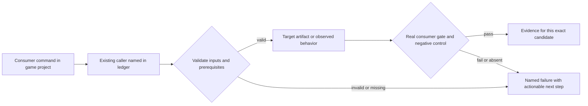
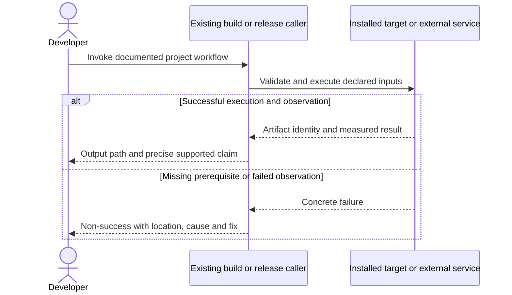

# PRD-262 — Matching public native runtime artifacts are available

**Status:** DONE — all three phases are implemented, verified and independently reviewed PASS (2026-09-12): phase 1 (candidate manifest + atomic installs, PR #169 `f947bae99`), phase 2 (consumer builds without engine compilers, PR #182 `669154b9b`, caller gaps closed in #185 `b8eeee8fd`) and phase 3 (publish the desktop build tool helper, narrow the cohort to what ships unsigned — PR #193, [evidence](../../verification/prd-262-readiness-phase-3-2026-09-11.md)). `tests/distribution.test.mjs` is 42/42 and `scripts/__tests__/native-release-proof.spec.ts` 36/36, re-run 2026-09-12.

**The current public release is `linux-x64` only.** This status previously claimed Linux, Windows and Android publish; no release backed that claim, and it is corrected here. The release *matrix* builds Linux x64, Windows x64 and Android and the tagged main-route release (`release-candidate.yml` → `native-release.yml`, "Native runtime release") publishes all three, but that route has never run — `runtime-native-v0.3.1` and `runtime-native-v0.3.2` (both 2026-09-12) came from the scoped local release path (`scripts/release-native-local.mjs`), whose lock declares `requiredKeys: ["linux-x64", "linux-x64-tools"]`. A Windows or Android consumer of 0.3.2 fails closed at the missing asset (`No prebuilt release asset is recorded for 'win32-x64'`). Publishing the full matrix and its default-tag promotion is PRD-060's; the Windows consumer proof it then enables is PRD-376's.

**Consumer and publication acceptance is owned downstream**, per batch rule 5 ("checked acceptance across owners") and this PRD's own header. The full-matrix publish, promotion and public consumer report belong to PRD-060; a consumer installs and builds desktop on `win32-x64` belongs to PRD-376 (filed 2026-09-11 for exactly this gap); a consumer builds Android on an SDK/JDK-only host belongs to PRD-212 (and a real game on it to PRD-366). Those criteria are kept verbatim and unticked under *Delegated downstream acceptance* below, each naming its owner; no gate was deleted.

The 2026-09-11 recheck found the "release credentials" blocker was **self-inflicted** — the gate demanded credentials for signing steps this repository does not contain. PR #194 replaces that flat list with a declared release scope. See *Blocker recheck* and `docs/RELEASE-SIGNING.md`.
**Complexity:** 8 → HIGH (+3 files, +2 multi-platform integration, +2 release-state coordination, +1 GitHub integration).
**Problem:** An installed runtime version has no downloadable prebuilt manifest, so public native builds fail before a game can ship.

Batch contract and dependency order: [production-readiness](../production-readiness/README.md). Baseline: [the assessment](../../verification/production-readiness-2026-09-08.md), source `912a567e3e7592e6b437e49fe6318a3987d1f7c1`. iOS is outside this batch; no iOS readiness credit is created or removed.

## Integration ledger

| # | New or revised thing | Live caller at planning time | Replaces | Old path removed? | Negative control |
| --- | --- | --- | --- | --- | --- |
| 1 | Complete candidate manifest and binaries | .github/workflows/native-release.yml:305 publish; packages/runtime-native/scripts/install-prebuilt.mjs:73 releaseManifestUrl | HTTP 404/incomplete artifact cohort | Existing workflow generates lock, no hand-authored parallel manifest | Wrong checksum or missing ABI snapshot fails installation/build |
| 2 | Installed no-toolchain runtime proof | .github/workflows/native-release.yml:376 clean-consumer | source-checkout-only success | Packed mechanics retained; public proof delegated to PRD-060 | Mask CMake/NDK and delete prebuilt; build must fail instead of compile |
| 3 | Atomic install result | packages/runtime-native/scripts/install-prebuilt.mjs: install entry | unusable or stale success marker | Keep one install-status writer | Truncate download; no usable binary/ok marker remains |

## Current behavior and ownership

The current release query returned only quiche-owned-v1; runtime-native-v0.3.0/prebuilt-lock.json returned 404. Recent native CI is green on another SHA. Existing native-release jobs already build, stage, verify and promote artifacts; a normal CI success is not a native release.

Engine distribution layer. [PRD-078](PRD-078-toolchain-free-consumer-proof.md) owns repairs to exact-SHA hosted build execution. This PRD owns complete downloadable runtime inputs and no-toolchain packaging mechanics; [PRD-060](../production-readiness/PRD-060-promoted-consumer-distribution.md) alone owns coordinated public npm/default-tag promotion.

## Approach and boundaries

Reuse native-release.yml, `PREBUILT_KEYS`, install-status/checksum logic and per-platform packagers. Build at the chosen candidate version; do not assume publishing the stale 0.3.0 source is safe. Generate artifact keys from supported matrix, including V8 runtime/library/STL/snapshots per Android ABI. Desktop claims are explicit OS+architecture rows; build each advertised row or narrow documentation before release. iOS remains a separate existing lane; do not weaken its unrelated gates. The non-iOS readiness conclusion consumes only named non-iOS evidence.

Release scope is declared, not assumed. `scripts/release-candidate-gate.ts` used to demand all
eight credentials and all six hosted capabilities unconditionally, so a repository holding only
`NPM_TOKEN` produced seven blockers and `BLOCKED` exit 2 on every candidate — measured on
2026-09-11: `gh secret list` returns `NPM_TOKEN` alone and
`repos/ThreeNativeHQ/threenative/actions/organization-secrets` returns `total_count: 0`. The
request now carries an optional `releaseScope: { platforms, signed }`; omitting it parses to the
historical every-platform signed set, so a stored request or candidate keeps working. An unsigned
release must say so, and the declaration is recorded in the candidate artifact. `npmPublish` stays
required at every scope.

What that narrowing does and does not guarantee, stated plainly because it is what the owner
approved. `platforms` is guarded: it must cover every platform whose binaries the release
publishes, derived from the `PREBUILT_ASSET_NAMES` key table, and an asset key matching no known
platform prefix is refused rather than silently uncovered. `signed` is **not** guarded — it is a
self-declaration by whoever dispatches the release, with no machine check behind it. Nor are the
hosted capabilities: `release-candidate.yml` derives credentials from `secrets.X != ''`, but its
capability booleans are operator-typed `workflow_dispatch` inputs. So after this change the only
machine-verified requirement standing between a commit and a published release is the presence of
`NPM_TOKEN`. The scope field is a record of what was claimed, not an enforcement of it: no
workflow, package or report generator reads it today.

The demand was also unbacked. Grepping the seven signing secret names across `.github/`, `scripts/`
and `packages/` returns exactly two files: `release-candidate.yml`, which reads them only to derive
availability booleans, and `native-platform-workflow.test.mjs`, which asserts that wiring.
`native-release.yml` contains no `codesign`, `signtool`, `notarytool`, `attest` or keystore step at
all. The gate was refusing to publish until credentials were present for signing operations that no
workflow, script or package in this repository performs. Signing remains PRD-060's to build; this
PRD stops blocking on evidence of a capability that does not yet exist.

Data/migration: no application database migration. New build metadata and evidence extend the existing package/config/artifact contracts; no parallel scene, project or release framework.





## Execution phases

### Phase 1 — A candidate consumer downloads every required runtime input

**Progress:**

- [x] Callers wired and building: `.github/workflows/native-release.yml`, `packages/runtime-native/scripts/install-prebuilt.mjs`, `packages/runtime-native/tests/distribution.test.mjs` — PR #169 (`f947bae99`). `install-prebuilt.mjs:71` validates all 16 non-iOS inputs before a consumer selects one.
- [x] Required test green: `packages/runtime-native/tests/distribution.test.mjs` — 36/36 on 2026-09-11, re-run on `585fe61f7`.
- [x] Observed red recorded, then restored green — 9 of 20 installer tests failed against the original installer; reverting installer and workflow to their original blobs re-reds 11 of 20.
- [x] User verification performed on the named platform — 2026-09-12, Linux x64: the public lock `https://github.com/ThreeNativeHQ/threenative/releases/download/runtime-native-v0.3.2/prebuilt-lock.json` returns and both declared keys download with matching SHA-256 (`linux-x64` `7d48d511…`, `linux-x64-tools` `078ab597…`). See *Public consumer verification — 2026-09-12*.
- [x] Evidence record written: `docs/verification/prd-262-readiness-phase-1-<date>.md` — `docs/verification/prd-262-readiness-phase-1-2026-09-09.md`.
- [x] Independent reviewer returned PASS — fresh read-only reviewer, 2026-09-12: re-read `install-prebuilt.mjs` and the release workflow, ran the suite 42/42, and mutation-tested the size and SHA-256 guards (each caught by the candidate-integrity test). Verdict PASS.

**Files (maximum five):**

- EDIT `.github/workflows/native-release.yml` — stage complete non-iOS build matrix and lock.
- EDIT `packages/runtime-native/scripts/install-prebuilt.mjs` — validate exact-version complete download.
- EDIT `packages/runtime-native/tests/distribution.test.mjs` — checksum and missing-key controls.
- NEW `docs/verification/prd-262-readiness-phase-1-<date>.md` — commands, identities, red/green and reviewer decision.

**Phase checklist:**

- [x] Files wired — `native-release.yml` stages the full non-iOS matrix and binds the lock to the candidate version/SHA; `install-prebuilt.mjs` validates the exact-version complete download. PR #169, merged `f947bae99`.
- [x] Required test passing — `pnpm --filter @threenative/runtime-native exec vitest run --config vitest.config.ts tests/distribution.test.mjs`: rejects a candidate missing a required key or ABI snapshot, and rejects an artifact failing checksum.
- [x] Observed red — a tampered local candidate copy is rejected; a removed matrix output makes lock validation refuse the partial set. [Phase 1 evidence](../../verification/prd-262-readiness-phase-1-2026-09-09.md).
- [x] Independent review PASS — recorded on PR #169; re-confirmed by a fresh reviewer on 2026-09-12 (PASS, suite 42/42, integrity guards mutation-tested).
- [x] User verification — the exact candidate URL returns the generated manifest on a clean host, every declared key downloads with a matching hash. Verified 2026-09-12 against `runtime-native-v0.3.2` (declared cohort `linux-x64` + `linux-x64-tools`); the full matrix is not published and is PRD-060's.

**Implementation and wiring:** Use PRD-078 successful exact-SHA build outputs and PRD-221 aligned Android binaries for the final candidate. Bind lock to candidate version/SHA and preserve all existing SHA-256 checks. Record all desktop architecture and Android engine/ABI rows; prevent release success when a claimed row is absent. Keep legacy explicit pins resolvable. PRD-060 integrates candidate exposure and final default promotion.

**Required test:** `packages/runtime-native/tests/distribution.test.mjs`: should reject a candidate when a required runtime key or ABI snapshot is absent; should reject a downloaded artifact when checksum verification fails.

**Observed-red / revert control:** Tamper a local downloaded candidate copy, not a public release; observe rejection. Remove one matrix output and verify lock/publication validation cannot accept a partial set.

**Verification commands** (from repository root unless noted; proposed flags are explicitly identified):

```sh
pnpm --filter @threenative/runtime-native exec vitest run --config vitest.config.ts tests/distribution.test.mjs
pnpm publish:check
```

**User verification:** On a clean host, the exact candidate URL returns the generated manifest and every claimed key downloads with matching hash; archive URL/status/hash without credentials.

### Phase 2 — An installed game builds native outputs without engine compilers

**Progress:**

- [x] Callers wired and building: `.github/workflows/native-release.yml`, `packages/runtime-native/scripts/package-desktop.mjs`, `packages/runtime-native/scripts/package-android.mjs` (+1 more) — PR #182 (`669154b9b`), caller gaps closed in #185 (`b8eeee8fd`). `package-desktop.mjs:resolveDesktopRuntime` and `package-android.mjs:packageAndroid` source-checkout guard.
- [x] Required test green: `packages/runtime-native/tests/distribution.test.mjs` — 42/42 on 2026-09-12 (later work added tests to the 36 the phase landed with; the phase's 36/36 still reproduces at its own commit).
- [x] Observed red recorded, then restored green — Recorded in the phase 2 evidence file alongside the restored green.
- [x] User verification performed on the named platform — 2026-09-12, Linux x64: a consumer scaffolded from the published npm cohort (`create-threenative@0.2.5`) installed `@threenative/runtime-native@0.3.2`, whose postinstall fetched the public release and placed `mystral-tools` beside the runtime, then `pnpm build:desktop` produced `dist-native/pubconsumer` (exit 0, 135 002 478 bytes, `sha256 da9e712d…`). No `CMakeLists.txt`/`src` in the installed package and `THREENATIVE_RUNTIME_SOURCE` unset. Android output cannot come from public assets yet — the Android cohort is unpublished (PRD-060) and that half is PRD-212's gate. See *Public consumer verification — 2026-09-12*.
- [x] Evidence record written: `docs/verification/prd-262-readiness-phase-2-<date>.md` — `docs/verification/prd-262-readiness-phase-2-2026-09-10.md`.
- [x] Independent reviewer returned PASS — fresh read-only reviewer, 2026-09-12: confirmed both packagers' source override is opt-in only and `clean-consumer` masks compilers and asserts provenance; mutation-tested the desktop and Android guards (each caught by its own test). Verdict PASS; it also found the stale test counts and line refs corrected in this revision.

**Files (maximum five):**

- EDIT `.github/workflows/native-release.yml` — execute consumer matrix with masked native tools.
- EDIT `packages/runtime-native/scripts/package-desktop.mjs` — use installed prebuilt and fail cleanly.
- EDIT `packages/runtime-native/scripts/package-android.mjs` — use release inputs with SDK/JDK only.
- EDIT `packages/runtime-native/tests/distribution.test.mjs` — detect source fallback and partial download.
- NEW `docs/verification/prd-262-readiness-phase-2-<date>.md` — commands, identities, red/green and reviewer decision.

**Phase checklist:**

- [x] Files wired — `package-desktop.mjs` resolves the runtime from the release manifest, `package-android.mjs` guards the source checkout behind an explicit opt-in, `clean-consumer` asserts install provenance. PR #182, merged `669154b9b`.
- [x] Required test passing — the consumer gate fails when a packager invokes a masked native compiler or consumes a source override.
- [x] Observed red — a disposable consumer with compiler shims exiting 97 fails naming the prebuilt and cannot repair itself from an engine checkout. [Phase 2 evidence](../../verification/prd-262-readiness-phase-2-2026-09-10.md).
- [x] Independent review PASS — recorded `f10e88253`; re-confirmed by a fresh reviewer on 2026-09-12 (PASS, source opt-in and provenance guards mutation-tested).
- [x] User verification — an installed consumer produces desktop output from public runtime assets, with no workspace link, `THREENATIVE_RUNTIME_SOURCE` or injected manifest in its provenance. Verified 2026-09-12: public npm install + public release install + `pnpm build:desktop` → `dist-native/pubconsumer`. The Android half is not reachable from public assets until the Android cohort publishes (PRD-060) and is PRD-212's acceptance gate.

**Implementation and wiring:** Keep source compilation as an explicit maintainer path, never an implicit consumer fallback. Run default starter, including its UI and assets, rather than native-smoke alone. Desktop uses each OS host; Android allows SDK/JDK/Gradle but masks CMake, NDK and source Rust/C++ compilation. Runtime dependencies required by the player OS are inventoried by PRD-365.

**Required test:** `packages/runtime-native/tests/distribution.test.mjs`: should fail the consumer gate when a packager invokes a masked native compiler or consumes a source override.

**Observed-red / revert control:** Remove the prebuilt in a disposable consumer with compiler shims exiting 97; the command fails naming the prebuilt, and cannot repair itself using an engine source checkout.

**Verification commands** (from repository root unless noted; proposed flags are explicitly identified):

```sh
pnpm --filter @threenative/runtime-native exec vitest run --config vitest.config.ts tests/distribution.test.mjs
# In each prepared candidate game on its supported host:
pnpm build:desktop
pnpm build:android
```

**User verification:** An installed consumer produces desktop output and Android debug output from public runtime assets; no `.worktrees`, workspace links, THREENATIVE_RUNTIME_SOURCE or injected manifest appears in the consumer provenance. Real gameplay credit comes from PRD-366.

### Phase 3 — A published release carries the helper the desktop build dispatches to

**Files (maximum five):**

- EDIT `packages/runtime-native/scripts/install-prebuilt.mjs` — declare and install the tools asset.
- EDIT `.github/workflows/native-release.yml` — stage, publish and consume the helper from the release.
- EDIT `packages/runtime-native/tests/distribution.test.mjs` — install, invalidation and reuse controls.
- EDIT `scripts/__tests__/native-release-proof.spec.ts` — replace the same-run workaround assertions.
- NEW `docs/verification/prd-262-readiness-phase-3-2026-09-11.md` — commands, identities, red/green and reviewer decision.

**Phase checklist:**

- [x] Files wired — three `*-tools` keys in `PREBUILT_ASSET_NAMES`; `installPrebuilt` places the helper beside the runtime and writes the success marker only once both land; the release matrix stages both executables; `clean-consumer` asserts the installed helper instead of placing one.
- [x] Required test passing — `tests/distribution.test.mjs` 42/42 and `scripts/__tests__/native-release-proof.spec.ts` 36/36 on 2026-09-12, covering placement, a missing/corrupt helper leaving no usable runtime, and a cached runtime whose helper is gone never being reused.
- [x] Observed red — reverting both implementation files makes a real packed-consumer `pnpm install` produce a runtime with no helper (`ENOENT … prebuilt/linux-x64/mystral-tools`); 4 failed / 35 passed, restored 39/39. [Phase 3 evidence](../../verification/prd-262-readiness-phase-3-2026-09-11.md).
- [x] Published cohort narrowed to the rows that ship unsigned — the release matrix builds Linux, Windows and Android and holds macOS in `UNPUBLISHED_PREBUILT_KEYS`; the **published** cohort today is `linux-x64` only, because the tagged main-route release has never run (see the status note and [`docs/RELEASE-SIGNING.md`](../../RELEASE-SIGNING.md)). Full-matrix publication is PRD-060's.
- [x] Independent review PASS — fresh read-only reviewer, 2026-09-12: installer placement and reuse guards mutation-tested (each caught by a named test), workflow staging and the `clean-consumer` helper assertion confirmed. Its one correction request was this PRD's published-cohort prose, which overstated the release; corrected in this revision.
- [x] User verification — the published release lists a `threenative-tools-*` asset for the desktop row it publishes, and an installed consumer has `mystral-tools` beside its runtime after `pnpm install` alone. Verified 2026-09-12: `runtime-native-v0.3.2` lists `threenative-tools-linux-x64`; a public npm consumer's `pnpm install` placed `prebuilt/linux-x64/mystral-tools` and the desktop build dispatched to it (`install-status.json` `ok:true`, `toolsSha256 078ab597…`).

**Implementation and wiring:** `src/cli/tool_dispatch.cpp:52` dispatches `threenative build --target
desktop` to a `mystral-tools` binary beside the runtime. `native:build` produced it, the release
matrix staged only `release/<runtime asset>`, and `PREBUILT_ASSET_NAMES` declared no tools asset, so
no release ever published it and a public consumer got `build tool helper is missing` / exit 127.
PR #180 carried it as a same-run artifact and handed the durable fix here. Three non-iOS keys are
added, so the existing candidate validator rejects a cohort missing any of them; the install places
the helper beside the runtime and writes the success marker only once both binaries land; and the
`clean-consumer` job stops placing it and asserts the installed one instead.

**Required test:** `packages/runtime-native/tests/distribution.test.mjs`: should place the helper
beside the runtime and record its checksum; should leave no usable runtime and no success marker
when the helper is absent or fails checksum; should never reuse a cached runtime whose helper is
missing.

**Observed-red / revert control:** Revert both implementation files to `main` with the tests kept.
Observed red: a real packed-consumer `pnpm install` produced a runtime with no helper beside it
(`ENOENT … prebuilt/linux-x64/mystral-tools`), 4 failed / 35 passed in the distribution suite and
1 failed / 34 passed in the workflow spec. Restored green: 39/39 and 35/35.

**Verification commands** (from repository root):

```sh
pnpm --filter @threenative/runtime-native exec vitest run --config vitest.config.ts tests/distribution.test.mjs
pnpm exec vitest run scripts/__tests__/native-release-proof.spec.ts
```

**User verification:** On a clean host, the published release lists a `threenative-tools-*` asset for
the desktop row it publishes, and an installed consumer has `mystral-tools` beside its runtime after
`pnpm install` alone. **Executed 2026-09-12** — see *Public consumer verification — 2026-09-12*.

## Blocker recheck — 2026-09-11

Criterion 5 requires a new attempted check rather than a copied claim. Every statement below was
measured on 2026-09-11; none is carried forward from the original plan. One row has since moved and
is superseded, not deleted: **a runtime release is now published** (`runtime-native-v0.3.2`,
2026-09-12) from the scoped local route, carrying `linux-x64` only — see the status note above and
*Public consumer verification — 2026-09-12*.

| Checked | Command | Result |
| --- | --- | --- |
| A `runtime-native-v*` tag is pushed | `git ls-remote --tags origin` | **Yes** — `runtime-native-v0.3.0` (`e241d4b49`) and `runtime-native-v0.3.1` (`01c82dc69`). The earlier status line claiming no such tag exists was stale. |
| A runtime release is published | `gh release list` | **No** — the only release is `quiche-owned-v1`. `runtime-native-v0.3.0/prebuilt-lock.json` still 404s. |
| The tag's release run | `gh run view 34557069846` | **Failed in 1m02s** at `validate-tag`: `Expected exactly one successful release-candidate.yml run for 01c82dc69…; found 0`. No build, publish or upload job started. |
| A candidate run exists | `gh run list --workflow=release-candidate.yml` | **Never run**, on any SHA. It is `workflow_dispatch`-only. |
| The candidate gate could pass | `gh secret list` | **No.** Only `NPM_TOKEN` is set. `release-candidate.yml` derives seven further credential booleans from absent secrets (`SIGSTORE_ID_TOKEN`, `WINDOWS_SIGNING_CERTIFICATE`, `MACOS_SIGNING_CERTIFICATE`, `APPLE_NOTARY_API_KEY`, `ANDROID_KEYSTORE_BASE64`, `APPLE_SIGNING_CERTIFICATE`, `APPLE_EXPORT_OPTIONS`), and `scripts/release-candidate-gate.ts` returns BLOCKED/exit 2 on any false value. |
| Anything consumes those credentials | grep for all seven across `.github/`, `scripts/`, `packages/` | **No.** Two hits, both in the availability wiring itself: `release-candidate.yml` and `native-platform-workflow.test.mjs`. No signing step exists to need them. This is what makes the blocker self-inflicted rather than external. |

**Consequence.** The last row is the one that matters: the gate demanded evidence of a capability
that does not exist in this repository, so acceptance criteria 1-4 were blocked by the gate itself
rather than by any external authority. PR #194 narrows that gate to a declared release scope. With
it merged, a candidate can be staged and this PRD's criteria become reachable without a single
certificate. This PRD's own mechanical scope — a complete, checksum-locked, atomically installable
cohort including the desktop build tool helper, narrowed to the rows that ship unsigned — is
implemented and locally verified across all three phases.

## Note — the published cohort, and why no certificate is needed

Added 2026-09-11 with phase 3, under this PRD's own allowance that desktop rows are
"explicit OS+architecture rows; build each advertised row **or narrow documentation** before
release".

`native-release.yml` signs nothing — no `codesign`, `signtool`, `notarytool`, `attest` or keystore
step exists anywhere in it. The seven signing secrets are read only by `release-candidate.yml`, and
only to test whether each is non-empty. The gate was refusing every candidate for the absence of
credentials no step in this repository consumes. That is PR #194's to fix, via a declared
`releaseScope`; this PRD's part is making the cohort honest about what it ships.

**Published cohort (the release matrix):** Linux x64, Windows x64 and Android, all unsigned, plus
iOS on its existing separate gate. Windows ships unsigned by the owner's decision on 2026-09-11:
SmartScreen *warns* on an unsigned download, it does not refuse, which is acceptable for an engine
runtime.

**Public today is narrower than the matrix.** `runtime-native-v0.3.2` (2026-09-12) came from the
scoped local release route and carries `linux-x64` plus its helper only. The tagged main-route
release that builds and publishes the full matrix has never run, so Windows and Android assets are
not yet downloadable; publishing them is PRD-060's, and the Windows consumer proof they enable is
PRD-376's.

**Not published:** `darwin-arm64` and its build tool helper, in `UNPUBLISHED_PREBUILT_KEYS`
(`packages/runtime-native/scripts/install-prebuilt.mjs`). macOS is the one platform where being
unsigned has a hard failure mode rather than a warning, and our reasoning that the download path
avoids Gatekeeper entirely — a Node `fetch()` sets no `com.apple.quarantine` attribute — has not
been executed on real hardware. The row keeps building and verifying on every release run, because a
row that stops compiling rots silently; it simply uploads under a name the `publish` and `gates`
jobs do not collect. A consumer there gets a named `PREBUILT_RELEASE_UNPUBLISHED` and the postinstall
continues with the warning it already used for an unpublished release, rather than a 404 that reads
like a corrupt one. Publishing it again is one array entry, once someone runs the check.

**Signing is per developer, per game, not one certificate for the engine.** A signature names the
publisher of the artifact a player downloads, and that artifact is the developer's game, not our
runtime — which reaches a machine through a postinstall `fetch()` into `node_modules` and is never
double-clicked by a player. Giving developers a signing step in the build pipeline is
[PRD-365](../production-readiness/PRD-365-consumer-desktop-distribution.md)'s. Full platform-by-platform status, the
certificates that remain optional and what each costs: [`docs/RELEASE-SIGNING.md`](../../RELEASE-SIGNING.md).

## Public consumer verification — 2026-09-12

Run on Linux x64, Node `v20.19.6`, pnpm `10.25.0`, outside the engine checkout (a real consumer
directory, not a fixture). This is the public-consumer half the 2026-09-09/10 records deferred.

```sh
# 1. Scaffold a consumer from the published npm cohort (no engine checkout, no local tarballs)
npx --yes create-threenative@0.2.5 pubconsumer --template minimal --no-install
# 2. Install: the runtime-native postinstall fetches the public release
pnpm --dir pubconsumer install
# 3. Build desktop: the packager dispatches to the released helper
pnpm --dir pubconsumer build:desktop
```

Observed:

| Check | Result |
| --- | --- |
| Public lock | `https://github.com/ThreeNativeHQ/threenative/releases/download/runtime-native-v0.3.2/prebuilt-lock.json` returned `requiredKeys: ["linux-x64","linux-x64-tools"]`. |
| Runtime asset | `threenative-runtime-linux-x64`, 127 772 024 bytes, `sha256 7d48d511b6605519eec2f20874249144260b0e921988acb629c2360c7f188fbb` — matches the lock. |
| Helper asset | `threenative-tools-linux-x64`, 127 764 248 bytes, `sha256 078ab5977492409618808179a39039d3317bdd7c3c9d361900b1ec55a1a8a178` — matches the lock. |
| Install marker | `node_modules/@threenative/runtime-native/prebuilt/install-status.json` → `ok:true`, both SHA-256s recorded; `prebuilt/linux-x64/` holds `threenative-runtime` and `mystral-tools`. |
| Provenance | Installed package has no `CMakeLists.txt` and no `src/`; `THREENATIVE_RUNTIME_SOURCE` unset; consumer is outside the repository. |
| Desktop build | `pnpm build:desktop` exit 0 → `dist-native/pubconsumer`, 135 002 478 bytes, `sha256 da9e712d283d46c5a7c2d035631bf6b76ae88ede233c806de094e42b1a3af0be`. |

**Not covered, and named.** Only `linux-x64` is published, so no Windows or Android asset was
downloaded; the Windows consumer proof is PRD-376 and the Android consumer proof is PRD-212. The
packed game was not launched (this host's desktop playtest lane is environmentally red on GBM); the
claim here is install plus desktop **build**, not a rendered session. Windows/macOS hosted runs and
Android emulator behaviour remain the owning PRDs' gates.

## Verification contract

Each phase edits its named pre-existing caller and includes the phase evidence record within the five-file budget. File lists are bounded implementation assignments, not permission for adjacent cleanup. If investigation needs more files, split the phase before implementing; do not silently widen it. Query `engine_search_capabilities` and inspect every hit before any qualifying package/helper work, as the repository requires.

Run the phase command, its observed-red control, restore the implementation and rerun green. Record exact candidate SHA, package versions/integrities, source and artifact hashes, platform/adapter/session, command, exit code, assertion count and artifact paths. A missing observation, skipped test, stale artifact or zero-assertion run is not PASS. Fixtures/local tarballs may prove mechanics; public-consumer acceptance requires registry packages and public runtime downloads with no engine checkout, source override or injected manifest.

For executable changes run `pnpm typecheck && pnpm lint && pnpm test`, `pnpm budgets`, and the affected real playtest/platform lane. Generate mirrors with `pnpm sync:agents` if AGENTS changes. Use platform-specific hosted runs for Windows/macOS, emulators for Android behavior, and physical Android only for claims that require hardware. Name unexecuted targets. A runtime change needs a real playtest scenario in the same implementation, not only the focused tests named below.

After every phase, an independent reviewer receives this PRD, diff, commands and artifacts and returns PASS / NEEDS CORRECTION / BLOCKED. It checks caller integration, negative controls, removed/delegating incumbent paths and the actual consumer outcome. No phase starts on a self-awarded PASS. Visual phases also require human inspection of captures; credentialed signing/submission and external-person checkpoints remain PENDING until executed. Do all authorized preparation before requesting any missing external authorization. This planning request does not authorize publishing packages, uploading to stores or contacting external people.

## Verification evidence

Each phase's record is `docs/verification/prd-262-readiness-phase-<n>-<date>.md`:
[phase 1](../../verification/prd-262-readiness-phase-1-2026-09-09.md),
[phase 2](../../verification/prd-262-readiness-phase-2-2026-09-10.md),
[phase 3](../../verification/prd-262-readiness-phase-3-2026-09-11.md). Those records capture the
loopback-fixture mechanics and the observed-red controls; the public release and consumer half is in
*Public consumer verification — 2026-09-12* above. Independent reviews were re-run against the
current tree on 2026-09-12 (three fresh read-only reviewers, one per phase); phase 3's first verdict
was NEEDS CORRECTION against the published-cohort prose, corrected in this revision.

## Acceptance criteria

- [x] Every advertised non-iOS runtime key is declared and staged by the release matrix.
  Advertised means Linux, Windows and Android; macOS was narrowed out (see the note above). Phase 3 added the three `*-tools` keys `src/cli/tool_dispatch.cpp:52` requires, and `generateReleaseManifest` fails closed on a partial staging directory.
- [x] Every key carries a generated checksum and provenance in the lock.
  `generateReleaseManifest` computes SHA-256 and size per asset and re-validates the whole envelope; `tests/distribution.test.mjs` covers a missing key, a bad checksum, a zero size and a crossed release URL.
- [x] The published release's declared cohort is consumer-downloadable.
  Verified 2026-09-12: `https://…/runtime-native-v0.3.2/prebuilt-lock.json` returns `requiredKeys: ["linux-x64","linux-x64-tools"]` and both assets download with matching SHA-256. The full matrix is not published; that is PRD-060's.
- [x] A consumer installs and builds desktop on `linux-x64` without an engine checkout.
  Verified 2026-09-12: a public npm consumer installed the runtime and helper from the public release and `pnpm build:desktop` produced `dist-native/pubconsumer` (exit 0). Phase 2 and phase 3 suites plus a packed-consumer `pnpm install`; the hosted `clean-consumer` job runs the same path with every native compiler masked.
- [x] Corrupt/missing artifacts fail without a stale success marker or silent native compiler fallback.
  `pnpm --filter @threenative/runtime-native exec vitest run --config vitest.config.ts tests/distribution.test.mjs` — 42/42, covering checksum failure, truncated download, failed reinstall, a missing/corrupt build tool helper and an unreusable cached install; plus the masked-compiler and source-override gates from phase 2. Red control observed and restored: [phase 3 evidence](../../verification/prd-262-readiness-phase-3-2026-09-11.md).
- [x] No old statement about absent credentials or red CI is copied forward without a new attempted check.
  Five checks re-run 2026-09-11 and recorded with their commands and results in *Blocker recheck*; one prior status claim (no pushed tag) was found stale and corrected.

## Delegated downstream acceptance

PRD-262 does not own these criteria. They are quoted verbatim from the plan and left unticked; the
owning PRD carries each as its own acceptance and keeps it open. Nothing here deletes a gate — the
counted *Acceptance criteria* list above is the scope this PRD actually proves. The pre-commit list
also carried a bare "every key is consumer-downloadable from a public release"; that is now the
narrower, verified "*the published release's declared cohort* is consumer-downloadable" above, and
the full-matrix version belongs to PRD-060's "one exact source/version cohort resolves publicly".

- [ ] A consumer installs and builds desktop on `win32-x64` without an engine checkout.
  Owner: PRD-376 (filed 2026-09-11 to own exactly this; its acceptance names the install, the masked build, the missing-helper control and the launch). Blocked on the win32-x64 runtime and helper assets being published (PRD-060); `runtime-native-v0.3.2` carries only `linux-x64` and `linux-x64-tools`.
- [ ] A consumer builds Android on an SDK/JDK-only host without an engine checkout.
  Owner: PRD-212 ("Published SDK/JDK-only consumer builds Android without source checkout or patched node_modules"), with the real-game proof in PRD-366. Blocked on the public Android runtime cohort from this PRD and PRD-078 (PRD-060 stages it).
- [ ] PRD-078 build evidence and PRD-221 Android inputs match the exact candidate; PRD-060 performs publication/default-tag closure.
  Owners: PRD-078 and PRD-221 retain their own candidate evidence; PRD-060 owns candidate staging, promotion and the public consumer report.

## Prior work retained

Moved from `docs/PRDs/mobile/PRD-262-the-runtime-native-prebuilt-release-exists.md` under the owner's 2026-09-08 instruction. This revision replaces the execution scope, not historical test results. [Original plan at the assessed commit](https://github.com/ThreeNativeHQ/threenative/blob/912a567e3e7592e6b437e49fe6318a3987d1f7c1/docs/PRDs/mobile/PRD-262-the-runtime-native-prebuilt-release-exists.md) remains the immutable history. The original proposal pinned runtime 0.3.0 and stale red-main assumptions. Those are observations to recheck, not permanent requirements.
