# PRD-295 — A Fab listing becomes runtime-ready ThreeNative GLBs in one agent flow

**Status: IMPLEMENTED 2026-08-31, two gates not green.** Evidence:
`docs/verification/PRD-295.md`. Shipped as `threenative-asset-mcp` 0.6.0 (published) and pinned in
`packages/core`. Not archived to `done/` because `pnpm lint` is red in ~20 files this change does
not touch (pre-existing `noExcessiveCognitiveComplexity`), and `pnpm test` was not run whole — this
shared checkout carries another lane's uncommitted work in `template-runtime-cost.spec.ts`. The
three suites this change affects pass.

Two owner decisions overrode the plan below and are recorded in the verification file: the external
executables **do** auto-install (`THREENATIVE_TOOLCHAIN_AUTOINSTALL=0` opts out), and a licence gate
was added that admits only Fab Standard and CC-BY and fails closed on anything it cannot read.
A third tool, `fab_list_owned`, was added beyond the two this PRD names, because a free search
structurally cannot surface a listing the account already paid for.

**Complexity: 10 → HIGH mode.** More than 10 files (+3), a new import pipeline (+2), process and
artifact orchestration (+2), changes across the external asset MCP and this workspace (+2), and an
external Fab integration (+1). Every phase requires an automated checkpoint; phases touching the
live Fab account or rendered output also require a manual checkpoint.

---

## 1. Context

**Problem.** A ThreeNative agent can discover a Fab listing, but an owned Unreal-only asset stops
before it becomes a `.glb` in the game's `assets/` directory. Today the user must authenticate,
download, decode `.uasset`, reconstruct materials, package glTF, and place the result by hand.

**Files and systems analyzed.**

- `AGENTS.md` and `packages/create-threenative/AGENTS.md` — package, CLI, authoring, and proof rules
- `packages/assets/{README.md,src/compile.ts,src/passes/model.ts}` — the existing GLB/KTX2/model
  compiler; this PRD feeds it and does not replace it
- `packages/create-threenative/src/{index.ts,build.ts,inspect.ts,doctor.ts}` — scaffold, build,
  inspection, MCP health, and the deliberately bounded CLI surface
- `packages/core/mcp/{assets.mjs,servers.mjs,install.mjs}` and `packages/core/package.json` — the
  live shim and pinned external asset-MCP version
- `packages/create-threenative/asset-mcp-tools.json` and
  `packages/create-threenative/agent-docs/{asset-mcp-loop.md,references/finding-assets.md}` — the
  recorded agent-visible tool surface and its canonical instructions
- `/home/joao/projects/threenative-asset-mcp/src/{server.ts,index.ts,config.ts}`,
  `src/tools/download-free-asset.ts`, and `src/fab/{client.ts,download-store.ts}` — the actual
  external MCP source and incumbent anonymous Fab downloader
- `zirklerite/FabCLI` v0.1.0 and `gildor2/UEViewer` current source — authenticated library
  download and Unreal 1–4 export capabilities

**Current behavior.**

1. `fab_download_free_asset` uses Fab's anonymous JSON contract, then a guarded Playwright browser
   fallback. It accepts direct free `blender|fbx|glb|gltf|maya|obj|unity` files only; it cannot use
   the user's owned library or download Unreal-only artifacts.
2. `fabcli download <listing-uid> --engine <version>` can download an entitled Unreal pack, but it
   is a separate, unofficial GPLv3 executable and is not called by the asset MCP.
3. The tested subject, Fab listing `3262ab8f-f64a-4124-8efd-82cb19df6249` (Open World Demo
   Collection), downloads as 272 `.uasset` files and 2 `.umap` files: 274 files / 6,804,916,227
   bytes. No source `.glb` exists.
4. UE Viewer can export UE 4.21 static meshes directly to glTF with correct metre scale, Y-up
   conversion, UVs, normals, tangents, sections, vertex colours, and LODs. Its glTF exporter writes
   debug-colour materials only. Its separate `.mat`/PNG export exposes Diffuse, Normal, Specular,
   SpecPower, Opacity, Emissive, Cube, Mask, parent materials, and other referenced textures.
5. ThreeNative already compiles source `.glb` files from a game's `assets/` directory into
   content-addressed, KTX2-capable runtime assets and a manifest. The framework repository is not
   a game and must not absorb this 6.49 GiB marketplace pack.

**Incumbent census.** `fab_download_free_asset` remains live for anonymous, directly available
free files. It is not an owned-library downloader and is not deleted. No Unreal importer, FabCLI
adapter, `.uasset` parser, material reconstruction pass, or end-to-end Fab → ThreeNative flow
exists in either repository.

---

## 2. Decision and solution

### Product decision

Do **not** create `packages/tools` and do **not** add a third command to the `threenative` CLI.

- A generic `tools` package has no single dependency boundary and duplicates the external
  `threenative-asset-mcp`, which already owns authoring-time discovery/download dependencies.
- `packages/create-threenative/AGENTS.md` fixes the `threenative` command surface at `build` and
  `doctor`; a third command requires a separate owner decision and recreates vocabulary the MCP
  already exposes to agents.
- The external asset MCP is the correct owner: it already carries Playwright, glTF Transform,
  provider safety policy, download directories, MCP schemas, and the live agent entry point.

### New surfaces

1. **`asset_import_unreal` MCP tool** — converts a local Unreal asset directory into individual
   source GLBs under the configured game asset source directory. It is provider-independent and
   makes an already downloaded pack recoverable/re-runnable.
2. **`fab_import_asset` MCP tool** — accepts a Fab listing URL/UID, verifies the user's existing
   FabCLI session, downloads the selected entitled artifact into a private staging/cache directory,
   then delegates to the same Unreal importer. It never logs in, claims, purchases, or accepts a
   marketplace agreement for the user.
3. **`threenative-asset-mcp import <Fab URL|directory>`** — a thin human/CI adapter over the same
   handlers. No arguments still start the stdio MCP server, preserving the current bin contract.

### Data flow

```mermaid
flowchart LR
  U["Agent or human: Fab URL/UID"] --> M["fab_import_asset / import CLI"]
  M --> F["fabcli: auth status, formats, download"]
  F --> C["private staging cache"]
  C --> V["UE Viewer: glTF + .mat + PNG"]
  V --> R["material reconstruction + GLB packaging"]
  R --> S["game assets/fab/<listing-id>/"]
  S --> A["existing @threenative/assets watcher/build"]
  A --> P["public/ hashed GLB + KTX2 + manifest"]
  P --> G["ctx.assets.model() on web and desktop native"]
```



### Toolchain boundaries

- **FabCLI is invoked as a separate executable**, resolved from `THREENATIVE_FABCLI_PATH` or
  `PATH`. It is not bundled, linked, imported, or auto-installed. This preserves the GPLv3
  process boundary and makes use of the unofficial API an explicit user choice.
- The tool calls only `fabcli --version`, `auth status`, `formats`, and `download`. Authentication
  remains `fabcli auth login` in the user's terminal. An unavailable/expired session returns an
  actionable error and performs no download.
- **UE Viewer (`umodel`) is also a separate executable**, resolved from
  `THREENATIVE_UMODEL_PATH` or `PATH`. Phase 1 must settle a pinned, reproducible Linux/Windows
  installation story without compiling C++ during `npm install`. macOS support remains
  unclaimed until run there.
- The MCP owns orchestration, safety, schemas, material reconstruction, GLB packaging, provenance,
  and reporting. `@threenative/assets` continues to own optimization, KTX2, simplification,
  virtual geometry, output hashes, and the runtime manifest.

### Conversion contract

- One source `.glb` per exported static mesh and LOD0 by default; folder and mesh names are
  preserved. `.umap`, Blueprint, Niagara, landscape, foliage placement, collision authored outside
  the mesh, and Unreal shader graphs are reported as unsupported rather than silently dropped.
- UE Viewer `.mat` files are the authority for material-to-texture references. Diffuse, Normal,
  Emissive, Opacity, and Mask map to standard glTF PBR slots. Parent material fallback is followed
  with a cycle guard.
- Packed or non-isomorphic Unreal channels (for example `_D_R` diffuse RGB + roughness alpha,
  SpecPower, and provider-specific masks) use named, tested transforms. Unknown mappings remain in
  the import report and get an explicit neutral fallback; the tool never labels debug colours as
  a successful textured import.
- PNGs and buffers are embedded into each GLB. The downstream ThreeNative compiler is then able to
  cap and transcode those images normally.
- Output is staged and atomically promoted. Existing output is reused only when source hash,
  listing UID, engine selection, FabCLI version, UE Viewer version/commit, and importer version all
  match. Otherwise a collision fails unless the user explicitly selects a new directory; there is
  no overwrite flag in v1.
- `import-report.json` records source provenance, entitlement-only status (never credentials),
  hashes, selected engine/artifact, exported/skipped/failed objects, material coverage, texture
  transforms, warnings, and final relative GLB paths. Tokens, cookies, authorization codes, and
  FabCLI token paths are never read or emitted.

### Sequence flow

```mermaid
sequenceDiagram
  participant User
  participant MCP as threenative-asset-mcp
  participant Fab as fabcli
  participant UModel as UE Viewer
  participant Assets as @threenative/assets
  participant Game
  User->>MCP: fab_import_asset(listing, engine?)
  MCP->>Fab: auth status
  alt missing or expired session
    Fab-->>MCP: exit 2 / authenticated false
    MCP-->>User: run fabcli auth login; no files changed
  else authenticated
    MCP->>Fab: formats + download into staging
    Fab-->>MCP: Unreal asset directory
    MCP->>UModel: export glTF, .mat and PNG
    UModel-->>MCP: meshes + material metadata
    MCP->>MCP: reconstruct PBR, embed, validate, write report
    MCP-->>User: assets/fab/<uid>/...glb
    Assets->>Assets: existing watch/build compile
    Game->>Assets: ctx.assets.model(logical path)
    Assets-->>Game: manifest-resolved runtime model
  end
```

### Explicitly rejected

| Option | Why rejected |
|---|---|
| `packages/tools` workspace package | Vague ownership, a ninth concern, duplicates the external authoring server, and has no runtime consumer |
| Add `threenative import-fab` | The public CLI is intentionally two commands; MCP already owns the agent flow |
| Replace `fab_download_free_asset` | Anonymous direct free downloads are safer and require no account; the new path is only for owned/library artifacts and Unreal conversion |
| Reimplement Fab's undocumented authenticated API | Duplicates FabCLI and doubles account/API breakage risk |
| Bundle or auto-install FabCLI | GPL/distribution and account-risk boundary must stay explicit |
| Install the full Unreal Editor | Multi-dozen-gigabyte dependency for an authoring conversion that UE Viewer can perform |
| Call UE Viewer's glTF output “done” | Its exporter writes debug-colour materials and no textures; geometry-only success is false success |
| Commit the Open World Demo Collection to this repository | Marketplace redistribution risk and 6.49 GiB of user content in a framework repository |

**Data changes.** New local source assets and `import-report.json` in generated/user projects only;
no database or framework runtime schema change.

---

## 3. Integration Ledger

| # | New thing | Live caller (planned non-test path) | Replaces | Old path removed? | Negative control |
|---|---|---|---|---|---|
| 1 | Unreal importer in external asset MCP | `src/tools/import-unreal.ts`, called by both registered MCP tool and CLI dispatch | nothing | n/a | disable UE Viewer invocation → full-pack import returns no success and no promoted output |
| 2 | `asset_import_unreal` | `src/server.ts` registration, invoked by a generated project's MCP host | nothing | n/a | remove registration → recorded `tools/list` set-equality gate fails |
| 3 | FabCLI adapter | `fab_import_asset` handler before the importer | hand-run `fabcli download` followed by ad hoc conversion | no product path existed; manual recipe disappears from generated docs | fake `auth status` unauthenticated → zero download/converter calls and actionable error |
| 4 | `fab_import_asset` | `src/server.ts` registration, invoked from generated `.mcp.json` through core's existing shim | no owned-library MCP flow | `fab_download_free_asset` remains for its distinct anonymous contract | remove FabCLI delegation → real listing never reaches `assets/fab/` and sandbox playtest fails |
| 5 | `threenative-asset-mcp import` CLI dispatch | external package `src/index.ts` argument branch | shell choreography | documented manual choreography deleted | point CLI at the full local pack with MCP disabled → same output hashes as local MCP import |
| 6 | asset MCP version/tool-surface bump | `packages/core/mcp/assets.mjs` → `MCP_PACKAGES.assets`; generated project's MCP host | pinned v0.4.0 surface | old pin removed atomically | revert core pin → `asset-mcp-tools.json` live surface mismatch fails golden-path gate |
| 7 | generated agent instruction | canonical asset-MCP agent docs copied by `createProject` | dead end after Fab discovery | old “download only” wording replaced | remove the new tool names → instruction/tool-surface test fails |
| 8 | runtime proof assets in an external sandbox | existing `watchAssets`/`compileAssets` and `ctx.assets.model()` | no runnable consumer | n/a | remove imported source GLB → playtest fails to load/render the named tree/rock |

**Reachability.** The user opens a generated ThreeNative project with its existing `.mcp.json`,
asks the agent to use a Fab URL, and the already-installed `@threenative/core/mcp/assets.mjs` shim
launches the pinned external server. `fab_import_asset` writes source GLBs under that project's
`assets/`; the pre-existing Vite watcher or `threenative build` compiles them; the game loads the
logical path through `ctx.assets.model()`. No new framework runtime API is introduced.

---

## 4. Execution phases

### Phase 1 — Prove the actual Unreal pack can become valid geometry GLBs

**Outcome.** The entire downloaded Open World Demo Collection is processed on Linux; every static
mesh is either a valid metre-scale GLB or a named failure, and unsupported `.umap` content is
reported. Geometry-only output is explicitly marked `materials: degraded`, not success-complete.

**External repository files (max 5):**

- `src/unreal/toolchain.ts` — NEW: executable discovery, version capture, bounded process runner
- `src/unreal/importer.ts` — NEW: safe staging, UE version selection, UE Viewer invocation, report
- `src/cli.ts` — NEW: shared `import <directory>` adapter
- `src/index.ts` — EDIT: no args still starts MCP; `import` delegates to `src/cli.ts`
- `tests/unreal-import.integration.test.ts` — NEW: fake-tool controls plus opt-in real-pack test

**Required proof.** Run against all 272 `.uasset` files, not a toy fixture. Record exported,
skipped, and failed counts; validate every emitted glTF/GLB; inspect bounds/units; open at least the
largest tree, a rock, and vegetation debris through the existing `create-threenative inspect`
implementation. A small fixture may test errors, but cannot satisfy the phase gate.

**Negative controls.** Wrong UE version, missing `umodel`, a traversal-shaped output name, a
nonzero UE Viewer exit, an empty exporter result, and a deliberately corrupted buffer each fail
without promoted output. Rename the importer call in CLI dispatch and observe the CLI integration
test fail.

### Phase 2 — Reconstruct materials and package self-contained source GLBs

**Outcome.** The same full pack produces self-contained GLBs whose supported material sections use
their extracted textures; the report measures coverage and names every degraded section.

**External repository files (max 5):**

- `src/unreal/materials.ts` — NEW: `.mat` parsing, parent fallback, slot/channel mapping
- `src/unreal/importer.ts` — EDIT: material export, GLB embedding, report coverage
- `tests/unreal-import.integration.test.ts` — EDIT: full-pack coverage and GLB assertions
- `package.json` — EDIT: add only the image codec proven necessary by the packed-channel tests
- `package-lock.json` — EDIT: lock that exact dependency graph

**Required proof.** No emitted GLB contains UE Viewer's `dummy_material_*` name or unreported
debug-colour fallback. Each bound texture exists inside the GLB. Normal maps use linear colour
handling; colour maps use sRGB semantics at runtime; alpha/mask behavior is visible on foliage.
The report distinguishes exact, heuristic, and unsupported mappings.

**Rendered negative control.** Remove the diffuse binding from the Scots pine and the normal
binding from a rock; the captured result and report must both change. A report literal without
reading the written GLB fails the phase.

### Phase 3 — One Fab URL drives authenticated download and conversion

**Outcome.** `fab_import_asset` and `threenative-asset-mcp import <Fab URL>` use the authenticated
FabCLI session to download the actual listing and delegate to Phase 2 without reading credentials.

**External repository files (max 5):**

- `src/fab/fabcli.ts` — NEW: version/auth/formats/download adapter with structured errors
- `src/tools/import-unreal.ts` — NEW: schemas/handlers for local and Fab composed flows
- `src/server.ts` — EDIT: register `asset_import_unreal` and `fab_import_asset`
- `src/cli.ts` — EDIT: URL input delegates to the same Fab handler
- `tests/fab-import.integration.test.ts` — NEW: fake executable plus opt-in live listing lane

**Safety requirements.** No `auth login`, `claim`, `claim-batch`, purchase, or arbitrary FabCLI
subcommand. Arguments use `spawn`/`execFile`, never a shell. Logs redact environment and command
output fields not in the explicit schema. Staging remains outside the game; only validated GLBs and
the provenance report enter `assets/fab/<listing-id>/`.

**Negative controls.** Expired auth, listing not owned, engine ambiguity, FabCLI v0 incompatible,
download partial failure, symlinked staging, and output collision each return an error and leave
the prior game assets byte-identical. The live gate uses the already-owned Open World Demo
Collection and records that no acquisition endpoint was called.

### Phase 4 — A freshly scaffolded project receives the two tools

**Outcome.** The released external package is pinned through core's existing shim; a registry-like
fresh scaffold lists both tools and `doctor` reports the asset server healthy.

**ThreeNative repository files (max 5):**

- `packages/core/package.json` — EDIT: bump the exact external asset-MCP version
- `packages/core/mcp/servers.mjs` — EDIT: bump `MCP_PACKAGES.assets`
- `packages/create-threenative/asset-mcp-tools.json` — EDIT from live `tools/list`, never docs
- `packages/core/__tests__/mcp-install.spec.ts` — EDIT: exact pin and unchanged shim contract
- `packages/create-threenative/__tests__/scaffold.spec.ts` — EDIT: exact installed 34-tool surface

**Release order.** External MCP typecheck/tests/live full-pack proof → publish exact version →
`npm view` verifies it → engine pin changes. Never point the engine at an unpublished version or a
local path in committed templates.

**Negative controls.** Revert either core version, delete one server registration upstream, or
record tool names from documentation instead of live stdio; scaffold/golden-path verification must
fail. `pnpm budgets` must report the same workspace package count—adding `packages/tools` is a red
control.

### Phase 5 — Agents discover the end-to-end route and a real game renders it

**Outcome.** A cold agent given only the Fab URL uses the new tool, names the produced logical GLB
path in game source, and the same game renders the imported mesh on web and desktop native.

**ThreeNative repository files (max 5 logical owners):**

- `packages/create-threenative/agent-docs/asset-mcp-loop.md` — EDIT: owned Fab import route
- `packages/create-threenative/agent-docs/references/finding-assets.md` — EDIT: format and license
  decision tree; canonical source for generated template references
- `packages/create-threenative/__tests__/template.spec.ts` — EDIT: instruction names live tools
- `scripts/verify-golden-path.ts` — EDIT: full flow requires source GLB → compiler → manifest
- `docs/verification/PRD-295.md` — NEW: commands, versions, hashes, reports, captures, negative reds

If the instruction budget cannot absorb the route, keep only the decision in the short loop and
place the steps in the existing reference page.

**Real consumer.** Create a sandbox outside this repository from packed local ThreeNative
packages. Import the owned listing into its `assets/fab/`, use one Scots pine, one rock, and one
masked vegetation mesh in the scene, then prove web and desktop native. Do not add marketplace
bytes to this repository or its git history.

**Negative controls.** Remove the source GLB, remove the compiled manifest entry, replace the
material with UE Viewer's debug colour, and unregister `fab_import_asset` one at a time. Each must
fail a different observable gate. A test that merely sees files on disk is insufficient.

---

## 5. Verification strategy

1. **External unit/integration:** argument construction, auth parsing, path containment, atomic
   promotion, `.mat` parsing, parent cycles, packed channels, GLB embedding, idempotent cache, and
   every failure above. Each test is first collected with a deliberate failing assertion.
2. **Full production subject:** all 274 files / 6,804,916,227 downloaded bytes; record input tree
   hash, tool versions, counts, output hashes, duration, peak disk, and material coverage. A single
   cube or isolated `.uasset` never substitutes for this gate.
3. **Live MCP/CLI parity:** the local MCP tool and CLI against the same downloaded directory emit
   byte-identical GLBs and report after timestamps are normalized. Fake FabCLI proves no forbidden
   subcommands; the live account lane proves entitlement download.
4. **Engine gates:** live `tools/list`, `pnpm typecheck`, `pnpm lint`, `pnpm test`, `pnpm budgets`,
   packed fresh scaffold, `npx threenative doctor --text`, and existing asset compiler tests.
5. **Consumer proof:** browser WebGPU and desktop-native playtests load the manifest-resolved GLBs;
   captures show textured tree/rock/foliage, correct metre scale and orientation, and nonblank
   geometry. Claims stop at the platforms actually run.

Checkpoint review after every phase must audit the Integration Ledger, live callers, unchanged
incumbents, negative controls, and the exact real subject. HIGH-mode manual approval is required
after Phases 2, 3, and 5.

---

## 6. Acceptance criteria

- [ ] From a freshly scaffolded game, an agent given only the Open World Demo Collection Fab URL
      invokes `fab_import_asset` and receives relative source GLB paths under that game's
      `assets/fab/` without manual file choreography.
- [ ] The flow uses the user's already-authenticated FabCLI entitlement and never authenticates,
      claims, purchases, or exposes credentials through MCP output, logs, report, or process args.
- [ ] Every static mesh in the full pack is exported or named with a concrete failure; `.umap` and
      other unsupported Unreal-only semantics are explicitly reported.
- [ ] Supported materials are textured in the written GLB; exact/heuristic/unsupported section
      counts come from re-reading the final artifact, and no debug-colour material is reported as
      complete.
- [ ] The existing ThreeNative asset compiler consumes the imported GLBs and emits its normal
      content-addressed outputs/KTX2/manifest without a new runtime format or loader.
- [ ] A sandbox game visibly renders representative tree, rock, and masked foliage assets through
      `ctx.assets.model()` on browser WebGPU and desktop native at correct orientation and scale.
- [ ] `fab_download_free_asset` still passes its existing anonymous direct-file contract; the new
      authenticated flow has not become its hidden replacement.
- [ ] The `threenative` CLI still advertises exactly `build` and `doctor`; no `packages/tools`
      workspace exists; `pnpm budgets` reports the pre-PRD package count.
- [ ] CLI and MCP local-directory imports emit byte-identical validated artifacts for identical
      toolchain versions and source hashes.
- [ ] Integration Ledger contains real `file:line` callers, every gate has an observed red, the
      external package is published before the engine pin changes, and the full repository gates
      pass.

---

## 7. Risks and kill switches

| Risk | Mitigation / kill switch |
|---|---|
| FabCLI is unofficial and Fab/Epic may change or restrict its APIs | Explicit opt-in executable; pin/test supported versions; structured incompatibility error; remove only `fab_import_asset` while retaining local import and anonymous downloader |
| Account or terms risk | Never claim/purchase/login; show FabCLI's own warning in docs; user runs authentication; no automation fan-out |
| UE Viewer cannot recover a material graph exactly | Measure final material coverage; standard PBR subset only; never hide degraded sections; kill the “textured” claim if representative foliage/rock/tree fail |
| 6.49 GiB source creates disk pressure | Preflight source + staging + output requirement, private resumable cache, atomic output, cleanup command that names exact cache target and asks before destructive removal |
| Marketplace redistribution | External sandbox proof only; provenance/license report; no marketplace bytes in framework git, npm tarballs, fixtures, or CI artifacts |
| Platform-specific native tools | Claim only verified Linux/Windows hosts; explicit unsupported host error; no compile-on-install |
| Tool surface overwhelms agents | Add exactly two tools to the existing server; canonical instruction routes Fab URL directly to the composed tool |

**Kill switch.** If the full-pack Phase 2 proof cannot bind useful textures to the representative
tree, rock, and masked foliage without game-specific filename code, stop before publishing. Retain
the local geometry conversion as an explicitly degraded experimental CLI only; do not register the
MCP tools or change the engine pin.
