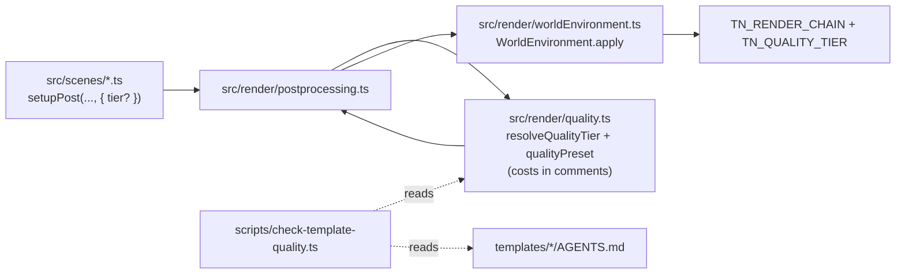
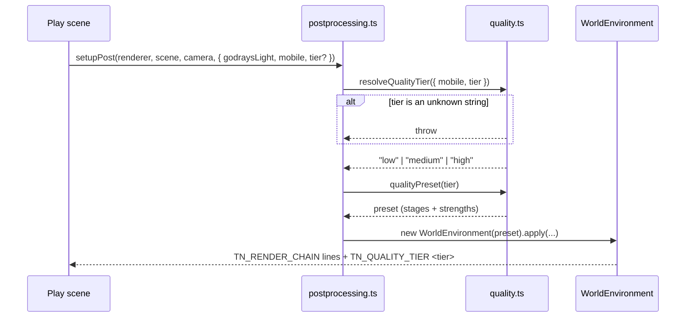

# PRD-304 — Every template ships a quality switch, with the cost of each effect written beside it

**Status:** DONE, 2026-09-01. Evidence:
[`template-quality-tiers-2026-08-31`](../../verification/template-quality-tiers-2026-08-31.md) (the
switch, the gate and its negative controls) and
[`mobile-look-was-black-2026-09-01`](../../verification/mobile-look-was-black-2026-09-01.md) (the
last criterion, and the defect that was blocking it).

**Every template ships the switch, and `low` now draws a picture.** The last open criterion — *a
game renders visibly cheaper at `tier: "low"` than at `tier: "high"`* — was blocked by a defect the
switch made visible rather than caused: `worldEnvironment.ts` asked the scene pass for `normal`,
`metalness` and `roughness` **unconditionally**, and asking is what creates the extra render target.
At `low` nothing needs one, so the pass carried a colour attachment no fragment shader writes,
WebGPU refused the pipeline, and the frame came out black while the chain reported every stage as
applied.

That made **the shipped mobile look of seven templates a black screen on real phones.** `sailing`,
the one template that never had those four lines because it runs no SSGI or SSR, is the one whose
mobile look was never black. The four nodes are now requested lazily; no preset, stage list or
strength moved.

```
desktop, same scaffold:   noise band 0.283/255   ·   high → low 2.903/255   (10x the band)
                          low: distinctColors 637 → 16,312, stdDev 0.0181 → 0.0710
Pixel 8, scaffolded:      TN_QUALITY_TIER low mobile=true source=platform, gpuMs 0.35,
                          full scene — where the same APK path had shown black and logged nothing
```

**Outcome:** a game scaffolded from any of the 8 templates has one generated file,
`src/render/quality.ts`, that names the quality tiers, says in a comment what each effect measured,
and is the single place `postprocessing.ts` reads its preset from. An agent asked to "make it run
on a phone" edits one file it can find, instead of re-deriving two hard-coded preset literals per
template from nothing.

**Depends on:** nothing. `WorldEnvironment` already accepts every option this file will set, and
`isMobile()` already reaches the templates as an argument.

**Task 1 of the Band 1 quick wins.** Slice of
[`FUTURE-ARCHITECTURE-DIRECTION.md`](../../architecture/FUTURE-ARCHITECTURE-DIRECTION.md) — see
[README](../architecture/README.md) for the tick-back rule.

**Complexity: 8 → HIGH mode.** +3 (10+ files: 8 templates × 2, plus a gate and template docs),
+2 (multi-package: `create-threenative` templates and `scripts/`), +2 (this is generated user
source under the framework's hardest rule — it decides how the game looks, so it may not move into
a package), +1 (the gate must prove the switch is *reached*, not merely present).

---

## 1. Context

**Problem:** every template already picks between a desktop and a mobile look, but the choice is
two `as const` literals inside `postprocessing.ts` with no name, no tier vocabulary, no recorded
cost, and no way for a game to ask for a cheaper look on a desktop that is struggling. The
framework's own architecture direction lists this as legal under the render-source rule today and
**absent from all 8 templates**.

**Files analysed:**

- `packages/create-threenative/templates/starter/src/render/postprocessing.ts:19-48` —
  `desktopPreset`, `mobilePreset`, `setupPost`
- the same file in all 8 templates: `action-rpg`, `defense`, `minimal`, `platformer`, `racing`,
  `sailing` (`:20-33`), `shooter`, `starter`
- `packages/create-threenative/templates/*/src/render/worldEnvironment.ts` — `WorldEnvironment`,
  `SsgiQuality`, `TonemapMode`, the `TN_RENDER_CHAIN` report
- callers, one per template: `racing/src/scenes/Race.ts:69`, `minimal/src/scenes/Play.ts:73`,
  `action-rpg/src/scenes/Play.ts:88`, `defense/src/scenes/Defense.ts:32`,
  `platformer/src/scenes/Level.ts:55`, `sailing/src/scenes/Sailing.ts:36`,
  `shooter/src/scenes/Play.ts:114`, `starter/src/scenes/Play.ts:109`
- `packages/core/src/index.ts:541` — `getPlatform`, `isMobile`, `isNative`, `isWeb`
- `packages/create-threenative/templates/*/AGENTS.md` — 8 files; none names a quality tier
- `packages/core/src/render/chain.ts:9` — `RENDER_CHAIN_MARKER = "TN_RENDER_CHAIN"`

**Current behaviour:**

- Two anonymous literals per template. `mobile: isMobile()` selects between them at the call site.
- Nothing in the generated source records what any effect costs, so "make this cheaper" is a
  guess against a five-stage chain whose most expensive member is not the obvious one.
- A game that wants the cheap look on desktop (a laptop iGPU, a Steam Deck) has no switch: the only
  input is `isMobile()`.
- The templates' `AGENTS.md` files do not mention tiers, so by this repository's own rule the
  convention does not exist.

---

## 2. Solution

**Approach:**

- One new generated file per template, `src/render/quality.ts`. It exports `QualityTier`
  (`"low" | "medium" | "high"`), the three preset objects, `resolveQualityTier(platform)` and
  `qualityPreset(tier)`. It imports nothing from any framework package — same rule the rest of
  `src/render/` obeys — and takes the platform as an argument.
- Every effect it sets carries **the measured cost in a comment on its own line**, with the run it
  came from named. Numbers this repository has: `scene.environment` ≈ 6.3 ms, town materials ≈
  3.3 ms, sky and soldiers ≈ 6.9 ms of an 18–19 ms Pixel 8 frame; the browser five-stage post chain
  12.5 ms of 14.7 on an RTX 2080; the sun's shadow **free**. Anything unmeasured says `unmeasured`.
- `postprocessing.ts` is **edited, not replaced**: its two literals are deleted and it reads
  `qualityPreset(resolveQualityTier(...))`. The scenes keep calling `setupPost` exactly as they do
  now, so no scene file changes shape — `mobile` widens to an optional `tier` override.
- The tier is overridable by name (`setupPost(..., { tier: "low" })`) and the resolved tier is
  printed once beside `TN_RENDER_CHAIN`, so a capture can say which tier produced it. Overriding
  does not turn the report off.
- A repo gate, `scripts/check-template-quality.ts`, fails when any template lacks the file, when
  `postprocessing.ts` still holds a preset literal, when a cost comment is missing for an enabled
  effect, or when the template's `AGENTS.md` does not document the switch.

**Architecture:**



**Key decisions:**

- [ ] No new package export, no new framework symbol. This is generated source under the rule that
      anything deciding how the game looks ships in `src/render/`, at any size. A shared
      `qualityPreset` in `@threenative/core` would be the framework owning the look and is refused.
- [ ] Three tiers, not two. `isMobile()` maps to `low`, everything else to `high`; `medium` exists
      so a struggling desktop has somewhere to go and so the adaptive path in a later PRD has a rung.
- [ ] Fail closed: `qualityPreset` throws on an unknown tier. It does not fall back to `high`.
- [ ] The eight files are near-identical by design; each keeps its own template's stage set
      (`sailing` has no SSGI/SSR at any tier, `minimal` keeps its atmosphere argument).

**Data changes:** none. No schema, no manifest, no shipped artifact.

---

## 3. Sequence flow



---

## 4. Integration Ledger

| # | New thing | Live caller (`file:line`, non-test) | Replaces | Old path removed? | Negative control |
|---|---|---|---|---|---|
| 1 | `starter/src/render/quality.ts` | `starter/src/render/postprocessing.ts:~19` after edit — TBD | `desktopPreset`/`mobilePreset` literals at `postprocessing.ts:19-38` | deleted in Phase 1 | `tier: "low"` on desktop must change the captured frame and the `TN_RENDER_CHAIN` refusal lines |
| 2 | `quality.ts` in the other 7 templates | each template's `postprocessing.ts` — TBD per template | that template's two literals | deleted in Phase 2 | same, per template, in the template playtest |
| 3 | `TN_QUALITY_TIER` report line | `postprocessing.ts` after resolving — TBD | nothing | n/a | a capture whose tier line is absent fails the gate |
| 4 | `scripts/check-template-quality.ts` | `package.json` `budgets` chain (line 16) — TBD | nothing | n/a | delete one template's `quality.ts` → gate red naming that template |
| 5 | quality section in `templates/*/AGENTS.md` | read by authoring agents; asserted by row 4 | nothing | n/a | remove the section from one template → gate red |

### Reachability

**How is this reached?** Frame path. Every template's scene calls `setupPost` in `enter()`; that
call now resolves a tier and the resolved preset decides which post stages are built.

**Pre-existing files edited to call it:** all 8 `src/render/postprocessing.ts`, plus `package.json`
for the gate, plus 8 `AGENTS.md`.

**Is this user-facing?** Yes — it changes what the game looks like on a phone and gives the game a
named switch. No HUD or menu is required; the switch is source, which is the point.

**Full flow:** scaffold a template → `enter()` calls `setupPost` → `resolveQualityTier` reads the
platform → `qualityPreset` returns the tier's stages → `WorldEnvironment.apply` builds them →
`TN_RENDER_CHAIN` and `TN_QUALITY_TIER` name what ran → a playtest capture of tier `low` differs
from tier `high`.

**What does this replace?** The two anonymous preset literals in each `postprocessing.ts`. They are
deleted in the same phase that adds the file — two live sources for one look is the additive
migration this repository has already paid for.

---

## 5. Execution phases

#### Phase 1: The starter template gets the switch, and it is visible in a capture

**Files (5):**

- `packages/create-threenative/templates/starter/src/render/quality.ts` — NEW: tiers, presets,
  `resolveQualityTier`, `qualityPreset`, cost comments
- `packages/create-threenative/templates/starter/src/render/postprocessing.ts` — EDIT: literals
  deleted, reads `quality.ts`, prints `TN_QUALITY_TIER`
- `packages/create-threenative/templates/starter/AGENTS.md` — EDIT: the convention and its override
- `packages/create-threenative/templates/starter/src/scenes/Play.ts` — EDIT (`:109`): passes the
  optional `tier` through, still defaulting from `isMobile()`
- `packages/create-threenative/__tests__/template-quality.spec.ts` — NEW: unit tests over the
  starter's `quality.ts`

**Implementation:**

- [ ] `resolveQualityTier({ mobile, tier })`: an explicit `tier` wins; otherwise `mobile → "low"`,
      else `"high"`. Unknown string throws with the received value in the message.
- [ ] Each enabled effect carries its measured cost on the line above it, naming the run
      (`// SSR ≈ 6.3 ms of an 18–19 ms Pixel 8 frame — runtime-perf-state, Bayview 720p ablation`).
      An effect with no measurement here says `// unmeasured`.
- [ ] `TN_QUALITY_TIER <tier> platform=<web|native> mobile=<true|false>` printed once per `apply`,
      beside the existing chain report. Overriding the tier does not suppress it — turning a
      convention off must not turn its measurement off.
- [ ] Delete `desktopPreset` and `mobilePreset` in the same commit.

**Wiring:**

- [ ] Caller edited: `starter/src/render/postprocessing.ts` imports and calls `quality.ts`
- [ ] Registration: none needed — the scene's existing `setupPost` call is the entry point
- [ ] Old path: the two literals are deleted, not left beside the new file
- [ ] Ledger rows filled: #1, #3

**Tests required:**

| Test file | Test name | Assertion | Negative control (must be observed red) |
|---|---|---|---|
| `packages/create-threenative/__tests__/template-quality.spec.ts` | `should throw when the tier is not a known name` | throws naming the value | delete the guard → test fails |
| same | `should resolve low when the platform is mobile and no tier is given` | `=== "low"` | invert the mapping → red |
| same | `should let an explicit tier override the platform` | `resolve({mobile:true,tier:"high"}) === "high"` | drop the override branch → red |
| same | `should differ between low and high in at least one enabled stage` | preset objects not deep-equal | make the tiers identical → red; this is what stops three names for one look |
| same | `should carry a cost comment for every stage the high tier enables` | source scan | strip one comment → red |

**Revert check:** delete `starter/src/render/quality.ts` → the starter fails `pnpm typecheck` and
its scaffold smoke build fails to compile. Paste both.

**User verification:**

- Action: scaffold the starter, run its playtest twice — once default, once with `tier: "low"`
- Expected: two different captures, and two different `TN_RENDER_CHAIN` refusal sets, with
  `TN_QUALITY_TIER` naming each. Paste both lines.

---

#### Phase 2: The other seven templates, same switch, each keeping its own stage set

**Files (5 per pass; run as 4 passes of 2 templates, or split the phase):**

- `templates/{action-rpg,defense,minimal,platformer,racing,sailing,shooter}/src/render/quality.ts` — NEW
- the matching `src/render/postprocessing.ts` — EDIT: literals deleted
- the matching `AGENTS.md` — EDIT
- the matching scene file (`Play.ts:88`, `Defense.ts:32`, `Play.ts:73`, `Level.ts:55`, `Race.ts:69`,
  `Sailing.ts:36`, `Play.ts:114`) — EDIT where the `tier` argument is threaded

**Implementation:**

- [ ] Per template, the tier set keeps that template's stages. `sailing` ships SSGI and SSR off at
      **every** tier (its `postprocessing.ts:20-22` already refuses them) — the file records that as
      a template decision with the reason, not as an accidental omission.
- [ ] `minimal` keeps its `atmosphere` argument; the tier decides stages, never colour.
- [ ] No template gains a stage it does not have today. This PRD changes where the choice lives and
      what is written next to it, not the default look. **The visuals baseline must not move at the
      default tier** — that is Phase 3's gate.

**Wiring:**

- [ ] Callers edited: all 7 `postprocessing.ts`
- [ ] Old path: all 14 remaining literals deleted
- [ ] Ledger rows filled: #2

**Tests required:**

| Test file | Test name | Assertion | Negative control |
|---|---|---|---|
| `packages/create-threenative/__tests__/template-quality.spec.ts` | `should ship a quality module in every template` | all 8 paths exist | delete one → red naming it |
| same | `should leave no preset literal behind in any postprocessing module` | no `Preset =` in the 8 files | restore one literal → red |
| same | `should keep sailing's SSR off at every tier` | every tier has `ssrEnabled: false` | flip one → red |

**Revert check:** restore one template's literals and delete its `quality.ts` → the gate from
Phase 3 goes red naming that template.

**User verification:** `pnpm test:templates` — all 8 scaffold, build and pass their scenarios.

---

#### Phase 3: The gate, the docs, and proof the default look did not move

**Files (4):**

- `scripts/check-template-quality.ts` — NEW: presence, no-leftover-literal, cost-comment and
  `AGENTS.md` checks over all 8 templates
- `package.json` — EDIT: insert into the `budgets` chain (line 16)
- `scripts/__tests__/check-template-quality.spec.ts` — NEW
- `docs/verification/template-quality-tiers-<date>.md` — NEW: the two captures per template and the
  visuals-baseline comparison

**Implementation:**

- [ ] The gate resolves each template directory from disk; a template added later with no
      `quality.ts` fails it. An empty template list **throws** rather than reporting green — the v1
      failure this repository already paid for.
- [ ] The `AGENTS.md` check asserts the section names the tiers **and** the override, because a
      convention missing from the templates' `AGENTS.md` does not exist.
- [ ] Run `pnpm visuals` and confirm the default-tier baselines are unchanged; a moved baseline is a
      Phase 2 defect, not a new baseline to accept.

**Wiring:**

- [ ] Caller edited: `package.json:16` `budgets` chain
- [ ] Ledger rows filled: #4, #5

**Tests required:**

| Test file | Test name | Assertion | Negative control |
|---|---|---|---|
| `scripts/__tests__/check-template-quality.spec.ts` | `should fail when a template has no quality module` | exit 1 naming the template | run against the full tree: must pass |
| same | `should fail when a template's AGENTS.md does not document the tier switch` | exit 1 | strip the section from a fixture → red |
| same | `should throw when it finds no templates at all` | throws | point it at an empty dir → observed red, not a green "0 of 0 passed" |

**Revert check:** `git stash -- scripts/check-template-quality.ts && pnpm budgets` → the chain
fails to complete. Paste it.

**User verification:**

- Action: `pnpm build && pnpm budgets && pnpm visuals && pnpm test:templates`
- Expected: green, and the visuals baselines unchanged at the default tier.

---

## 6. Verification plan

1. **Unit:** `packages/create-threenative/__tests__/template-quality.spec.ts` and
   `scripts/__tests__/check-template-quality.spec.ts`, vitest node env.
2. **Playtest (the gate that matters):** `pnpm test:templates`, plus per-template captures at
   `low` and `high`. Note the known capture-lane red recorded for the shooter template
   (`TN_CAPTURE_BLANK`) — if it appears, it is that pre-existing lane defect, and the run says so
   rather than attributing it here.
3. **Integration proof:**

```sh
# 1. Caller census — the switch is read, not merely present
grep -rn "quality.js" packages/create-threenative/templates/*/src/render/postprocessing.ts
# Expected: 8 hits, one per template

# 2. Incumbent check — no anonymous preset literal survives
grep -rn "desktopPreset\|mobilePreset" packages/create-threenative/templates/*/src/render/
# Expected: no output

# 3. Gate is wired
grep -n "check-template-quality" package.json
# Expected: a hit inside the "budgets" script value
```

4. **Negative controls, each recorded with its observed red:** deleted `quality.ts`; restored
   literal; stripped cost comment; stripped `AGENTS.md` section; empty template list; identical
   `low`/`high` presets.

---

## 7. Acceptance criteria

Consumer-scoped — every one is about what a scaffolded game does, not about a file existing.

- [ ] A game scaffolded from any of the 8 templates renders **visibly cheaper** at `tier: "low"`
      than at `tier: "high"` on the same machine, with both captures pasted.
- [ ] The default look of all 8 templates is unchanged: `pnpm visuals` baselines do not move.
- [ ] An agent reading only `src/render/quality.ts` can say what the most expensive enabled effect
      costs and where that number came from, without opening any file in `packages/`.
- [ ] Passing an unknown tier name fails loudly at the call site rather than silently rendering the
      default.
- [ ] `TN_QUALITY_TIER` names the tier in every capture, including captures where the game
      overrode it.
- [ ] Deleting any template's `quality.ts` fails `pnpm budgets` and names that template.

**Integration gates:**

- [ ] Integration Ledger has zero `TBD` cells
- [ ] Caller census pasted: 8 `postprocessing.ts` files import the module
- [ ] Revert check pasted: the starter fails to typecheck without it
- [ ] Every replaced literal is deleted — `grep` for `desktopPreset` returns nothing
- [ ] Every gate has an observed red, pasted
- [ ] Proved on all 8 templates, not on the starter alone
