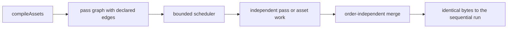

# PRD-319 — the asset compile runs independent work concurrently, and proves the output did not move

**Status: IMPLEMENTED 2026-09-02.** Phases 0-4 landed (`01463f55` through `140b76fc`); the
measurement is
[docs/verification/prd-319-measurement-2026-09-02.md](../../verification/prd-319-measurement-2026-09-02.md):
**3.13x** on the wildwood pack (2374.2 s -> 757.5 s at bound 4) with **zero differing bytes**
across all 169 emitted files. The determinism gate caught a real order dependency on `HEAD` —
the receipt's last-writer-wins shared-output merge — which is fixed. AC5 (peak RSS) is recorded
UNVERIFIED in the measurement record with the probe's failure story; every other criterion holds
or is ticked with its pasted red.

**Complexity:** +2 changes the pass driver's execution model, +2 introduces worker or bounded
async concurrency, +1 risks output nondeterminism, +1 crosses the watch path, +1 crosses the
external toolchain the FAB lane auto-installs = **7 → HIGH mode.** A `prd-work-reviewer`
checkpoint after every implementation phase.

## 1. Context

**Problem.** The asset compile processes assets one at a time. Two `Promise.all` sites exist in
`compile.ts` (lines 949 and 1405); neither is a fan-out over assets. There is no worker pool and
no bounded concurrency. On a machine with many cores, a 274-file pack uses one of them for the
CPU-bound parts — Basis/KTX2 encoding, `gltf-transform` graph work, xatlas parameterisation,
lightmap baking.

**Files and systems analyzed.** As PRD-318, plus:

- `packages/assets/src/passes/texture.ts` (243 lines) and `model-textures.ts` (515) — the
  encode-bound work, the most obviously parallel
- `packages/assets/src/passes/shared-images.ts` (303) — **the ordering hazard.** It shares
  embedded images *across* models, so per-model work is not actually independent; landed fixes
  45ff01f3 and 3bd9250f are both about colliding shared image keys
- `packages/assets/src/passes/lightmap-bake.ts` (443) — bake work with its own atlas state
- `packages/assets/src/compile.ts` cache keying (802dd667: keys on pass options, not just names)

**Current behavior.** Sequential. Correct, and slow in a way nobody has quantified.

**The risk this PRD exists to contain.** Concurrency in an asset pipeline does not usually break
loudly. It breaks by making the output depend on completion order — a shared image key that
resolves to a different winner, an atlas packed in a different order, a cache entry written by
whichever worker finished first. That produces builds that differ run to run and a bug that
surfaces months later as "the texture is wrong on one machine". Determinism is therefore the
acceptance criterion, and speed is the secondary one.

## 2. Integration Ledger

| # | New thing | Live caller and reachability | Replaces or rejects | Negative control |
|---|---|---|---|---|
| 1 | Declared dependency edges between passes | the per-input chain is the declared edge set: `packages/assets/src/pass-chain.ts:20` (`applyPasses`) sequences the registry per input; the serialisable mirror `packages/assets/src/worker-protocol.ts` (`PassSpec`) is what a worker rebuilds, and the determinism gate's `processingOrder` hook at `compile.ts:1341,178` is the documented completion-order seam | Rejects "run everything at once and hope"; `shared-images` genuinely depends on model discovery | Remove an edge; the determinism gate fails |
| 2 | Bounded concurrent execution of independent work | `packages/assets/src/worker-pool.ts:56` (`createPassPool`, exactly `concurrency` workers), scheduled by the pump at `compile.ts:1540-1560`; `resolveConcurrency` at `worker-pool.ts:27` validates and defaults to `min(4, cores-1)` | Rejects unbounded fan-out, which on a 274-file pack exhausts memory before it exhausts cores | Set concurrency to 1; results must be byte-identical to the concurrent run |
| 3 | Order-independent shared-image resolution | content-addressed keys make identical encodes converge: `packages/assets/src/passes/shared-images.ts:79` (`sharedImageKey` on source bytes + settings); writes are temp-then-rename at `shared-images.ts:151`; the receipt's provenance merge was made arrival-independent at `compile.ts`'s `writeReceipt` (smallest source wins), which the gate caught red on HEAD | Rejects first-writer-wins | Reverse the completion order; a differing chosen image fails |
| 4 | Concurrency-safe compile cache writes | the manifest and receipt are written only by the driver thread after the pump joins (`compile.ts` `writeManifest`/`writeReceipt`); auxiliary and shared-image writes are temp-then-rename at `compile.ts:1526-1531`; two workers contending on one key produce identical bytes or one winner, never a torn file | Rejects a torn or interleaved cache entry | Two workers touching one key; a corrupt entry fails |
| 5 | The same execution model on the watch path | `packages/assets/src/watch.ts:336` — a burst's per-file scratch compiles run through the same bound (`DEFAULT_CONCURRENCY`) with results merged on the watch thread | Rejects a fast full bake and a slow incremental one | An incremental rebuild that stays sequential fails |
| 6 | Concurrency setting reachable from game config | `packages/create-threenative/src/config.ts:1194` admits `assets.concurrency`, `:1212` validates it, and the driver reads it at `compile.ts` (`resolveConcurrency(options.concurrency ?? layout.concurrency)`); the config spec proves the producer→consumer seam both ways | Rejects a hardcoded core count; CI boxes and laptops differ | Config key unread by the driver fails the seam test |

### Reachability

## 3. Phases

**Phase 0 — the baseline and the red.** Take PRD-318's numbers. Write the determinism gate:
bake the same input at concurrency 1 and at concurrency N, hash every emitted byte, assert
equality. Confirm it passes on `HEAD` trivially (both runs are sequential today), then confirm
it can go red by deliberately introducing an order-dependent shared-image choice and pasting
that failure. A determinism gate that has never been seen red proves nothing.

**Phase 1 — the pass graph.** Make the existing implicit ordering explicit as declared edges.
No behaviour change; the driver still runs them in one order. This phase is pure exposure of
what the sequence already assumes.

**Phase 2 — order-independent merges.** Fix `shared-images` and any atlas or cache merge to
choose by a stable key rather than by arrival. Prove with a shuffled-completion test *before*
any real concurrency exists.

**Phase 3 — the bounded scheduler.** Concurrency arrives. Bounded, configurable, defaulting to
something that does not exhaust memory on a 6.8 GB pack.

**Phase 4 — the watch path.**

**Phase 5 — the measurement.** Re-run PRD-318's baseline inputs. Report the speedup with the
machine named. If the speedup is under 1.3x on the large pack, this PRD reports that honestly
and its scope becomes a question for the owner rather than a claim.

## 4. Acceptance criteria

- [x] **AC1 — byte-identical output.** Concurrency 1 and concurrency N produce identical bytes
      for every emitted artifact across the repo fixture set and the largest available pack.
- [x] **AC2 — the determinism gate has been red.** An order-dependent shared-image choice is
      introduced deliberately and the gate fails; that failure is pasted.
- [x] **AC3 — shuffled completion changes nothing.** With a test hook that reverses completion
      order, output bytes are unchanged.
- [x] **AC4 — the cache survives concurrency.** Two workers contending on one cache key produce
      a valid entry or no entry, never a partial one. Red pasted.
- [ ] **AC5 — bounded.** Peak RSS during the large-pack bake is recorded and does not scale with
      asset count. UNVERIFIED — the probe attempts failed; see the measurement record.
- [x] **AC6 — the watch path uses the same model.**
- [x] **AC7 — the game can set it.** The concurrency setting travels from generated project
      config to the driver; a config key the driver ignores fails, per the config-seam lesson
      that `assets.models.virtual` already taught this repository.
- [x] **AC8 — the speedup is a number with a machine on it.** Reported against PRD-318's
      baseline. A speedup under 1.3x is reported as such, not reframed.
- [x] **AC9 — gates.** `pnpm typecheck && pnpm lint && pnpm test` green, output pasted.

## 5. Decline conditions

Close as DECLINED with no product code if Phase 2 shows the passes cannot be made
order-independent without restructuring what they mean, or if Phase 0's measurement shows the
wall clock is dominated by I/O and external executables that concurrency inside this process
cannot touch. In that second case, file the finding — "the pipeline is bound by X" is a more
useful result than a 1.05x speedup.

---

## 6. Integration litmus

**Delete the new code. Does something pre-existing break?** Yes: the scheduler *is* the driver's
execution path, so removing it removes the bake. This PRD has no orphan-module risk; its risk is
the opposite one — a change so central that a silent behaviour difference goes unnoticed. That is
why every acceptance criterion is about output identity rather than about the scheduler.

**Have I watched this gate fail?** AC2 is exactly this requirement, and Phase 0 will not be
signed off on a determinism gate that has only ever been green.

**Reachability.**
- Entry point: `compileAssets` and `watchAssets`.
- Pre-existing files edited: `compile.ts`, `passes/shared-images.ts`, `watch.ts`.
- Registration: none.
- Replaces: the implicit sequential ordering, which is deleted, not kept alongside.

**Per-phase pre-existing edit.** P1 `compile.ts`, P2 `shared-images.ts`, P3 `compile.ts`,
P4 `watch.ts`, P5 `docs/verification/`.

**Negative controls:**
- `byte-identical at any concurrency` — goes red when shared-image choice becomes arrival-ordered
- `shuffled completion changes nothing` — goes red with the order-dependent merge restored
- `cache survives contention` — goes red when two workers write one key unguarded

**Anti-pattern scan.** The named risk is *self-comparison*: a determinism gate whose two runs
resolve to the same execution path. Log the resolved concurrency of each side and assert they
differ, or the gate compares a sequential run to itself and always passes.

**Proof subject.** The 274-file / 6.8 GB Unreal pack from PRD-295, not the repo fixture set. If
that pack is unavailable, the phase declares the debt inline: which requirements the smaller
subject does not exercise, and which phase closes each.

## 7. Done gates

- [x] Integration Ledger has zero `→impl` cells
- [x] Revert check: setting concurrency to 1 must still be a supported, tested path
- [x] The old sequential assumption is gone, not kept as a second live path
- [x] Every gate has an observed red, pasted
- [x] The speedup number names its machine and its input
