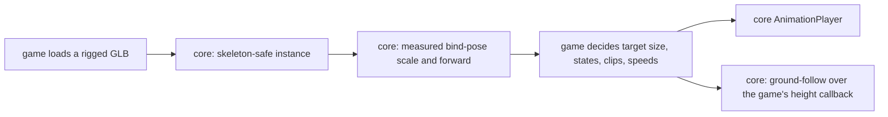

# PRD-321 — the animal state machine is mechanism; the animals stay the game's

**Status: DECLINED, 2026-09-02 (Phase 0, no product code).** Mined from `sandbox/wildwood` at `92a343b`.

**Decline record.** §6's first condition holds: no second consumer exists that needs the same four pieces. Search at decline time: the templates (`action-rpg`, `shooter`) use `attachToBone` for the weapon-in-hand convention and no animal rig; `examples/prd140-picking` builds a hand-made `SkinnedMesh` for raycast tests; `examples/prd314-clip-audit` is a diagnostic fixture rig; no template or example imports a rigged GLB, clones a skeleton, normalises a bind pose, measures anatomical forward, or follows ground with an animal entity. Wildwood is the only consumer, and the kill switch says one consumer is not an abstraction. The pose defect that motivated this batch was found and fixed independently in PRD-324 (`docs/verification/PRD-324-phase1-phase2.md`); its instrument (`boneLengths`, `boneLengthDeviations`) and the loader repair (`reconcileMirroredClips`) are the pieces that were real. If a second game ever needs the four pieces, re-file with that consumer named.

**Complexity:** +2 proposes a new core export, +2 must hold the rule-3 look boundary under
pressure, +1 needs a second consumer to justify itself, +1 crosses core and the templates,
+1 needs web and native proof = **7 → HIGH mode.** A `prd-work-reviewer` checkpoint after every
phase, and the Phase 0 decline check is not optional.

## 1. Context

**Problem.** Building Wildwood produced roughly 900 lines of animal code
(`src/entities/animals/Animal.ts` 462, `animalSpecs.ts` 195, `spawnWildwoodAnimals.ts` 115,
`src/dev/animals.ts` 427 of harness). Most of it is Wildwood's, and should stay Wildwood's. A
minority of it is not about foxes at all, and every game that puts a rigged creature on a
terrain will rewrite it:

1. **The skeleton-safe clone.** `Animal.ts` uses `SkeletonUtils.clone` because a plain
   `.clone(true)` of a skinned model "renders as a giant broken copy". Every agent that has not
   hit this bug writes the plain clone first. That is a trap with a known fix, which is the
   definition of plumbing every game repeats.
2. **Bind-pose normalisation.** The source's pre-clone bind-pose bounds are what turn a
   six-unit authoring scale into a 0.7 m fox. One metre is one metre is a stated framework
   convention; a rig arriving at authoring scale silently violates it.
3. **Anatomical forward measurement.** Commit 8fa064b ("measure animal anatomical forward") and
   PRD-315's phase 4 evidence — "every animal rig faces +Z in bind pose; yawOffset 0 is
   measured" — encode a real, non-obvious measurement. PRD-314 already exists on the neighbouring
   problem ("a broken retarget is a number, not a screenshot").
4. **Ground-following against a height source.** `AnimalGround = (x, z) => number` is the seam.

**What is emphatically not mechanism.** The state names, the clip names, `FADE = 0.25`,
`FLEE_MAX_SECONDS = 5`, `FLEE_CALM_FACTOR = 1.6`, `TURN_RATE = 3.2`, the `LOOPED` set, the
species, the spawn density and every appearance parameter. Those are Wildwood's game design.
A framework that ships "graze" as a state name has invented vocabulary, which rule 4 forbids.

**Files and systems analyzed.**

- `sandbox/wildwood/src/entities/animals/{Animal.ts,animalSpecs.ts,spawnWildwoodAnimals.ts}`
- `sandbox/wildwood/src/entities/Wanderer.ts` (247 lines) — the first-person controller; read for
  the ground-contact and facing patterns, not proposed for extraction here
- `packages/core/src/animation.ts` — the existing `AnimationPlayer` and `clipTrackBindings`, which
  Wildwood already uses; this PRD extends that neighbourhood rather than opening a new one
- `docs/PRDs/done/PRD-314-a-broken-retarget-is-a-number-not-a-screenshot.md` — adjacent, and
  must not be duplicated
- `packages/create-threenative/capabilities.json` — where any new export must become findable

## 2. The rule-3 test, applied before anything is written

> Can the game change the appearance completely without editing package code?

For each candidate:

| Candidate | Decides how anything looks? | Verdict |
|---|---|---|
| Skeleton-safe clone of a skinned source | No — the same pixels, correctly | **Mechanism** |
| Bind-pose bounds → metres normalisation | No — it reports a measured scale; the game chooses the target size | **Mechanism** |
| Anatomical forward measurement (yaw offset) | No — it returns a number | **Mechanism** |
| Ground-follow against a height callback | No — the game owns the height field | **Mechanism** |
| State machine transitions and thresholds | Yes, and worse: it invents vocabulary | **Stays in the game** |
| Clip name semantics, `LOOPED` set, fade times | Yes | **Stays in the game** |
| Species, spawn placement, densities | Yes | **Stays in the game** |

## 3. Integration Ledger

| # | New thing | Live caller and reachability | Replaces or rejects | Negative control |
|---|---|---|---|---|
| 1 | Skeleton-safe instance creation in core | `packages/core/src/→impl`; Wildwood's `Animal.ts:→impl` and a second consumer call it | Replaces Wildwood's inline `cloneSkeleton` usage; rejects re-exporting `SkeletonUtils` verbatim, which adds nothing | Swap to plain `.clone(true)`; the skinned-bounds assertion fails |
| 2 | Measured bind-pose scale, returned not applied | `→impl` | Rejects auto-scaling to a framework-chosen size | Feed a six-unit rig; a reported scale of 1 fails |
| 3 | Measured anatomical forward / yaw offset | `→impl`; consumed by the game's facing code | Rejects a screenshot-graded facing check, per PRD-314 | Rotate a rig 180° in bind pose; the measured offset must change by π |
| 4 | Ground-follow helper over a height callback | `→impl` | Rejects owning a terrain, a height field, or a navmesh — physics already owns navigation | Return a constant height; feet must sit on that constant |
| 5 | Wildwood rewritten onto the core surface | `sandbox/wildwood/src/entities/animals/Animal.ts:→impl` | Rejects two live implementations | Delete the core export; Wildwood fails to build |
| 6 | A second, unrelated consumer | a template or example `→impl` | Rejects a one-consumer abstraction, which the kill switch scores out | Only one caller at final review fails the PRD |
| 7 | Capability manifest entries | `capabilities.json` regenerated by `pnpm build` | Rejects an export no plain-words search finds | Search "put a rigged animal on the ground"; a miss fails |

### Reachability

## 4. Phases

**Phase 0 — the decline check, and the second consumer.** Before a line of package code: name
the second consumer and confirm it needs the same four pieces. Run `pnpm tsx
scripts/count-loc.ts` on the proposed surface against the plain-Three.js alternative at both
call sites. If the framework version is not smaller across two real consumers, this PRD closes
as DECLINED. Paste the score either way.

**Phase 1 — the measurements, red first.** Write the bind-pose scale and anatomical-forward
assertions against fixture rigs; paste them red. The 180°-rotated-rig control from PRD-315's
phase 5 is the model to follow.

**Phase 2 — the core surface.** Smallest thing that satisfies Phase 1. It returns numbers and
instances; it decides nothing.

**Phase 3 — Wildwood moves over, and its copy is deleted.** Not both.

**Phase 4 — the second consumer moves over.**

**Phase 5 — manifest and docs.** The capability is findable by situation, and the templates'
`AGENTS.md` names it, because a convention missing from the templates' `AGENTS.md` does not
exist.

**Phase 6 — web and native.** A `--target` playtest or a conformance row. A helper admitted for
being unportable ships native proof in the same commit.

## 5. Acceptance criteria

- [ ] **AC1 — two real consumers.** At final review the core surface has two non-test callers in
      different projects, and `count-loc.ts` scores it smaller than plain Three.js across both.
      One consumer fails this PRD.
- [ ] **AC2 — the plain-clone trap is caught.** Substituting `.clone(true)` fails a bounds
      assertion, and that red is pasted.
- [ ] **AC3 — scale is measured, not imposed.** A six-unit rig reports its real scale; the core
      applies no size of its own. A core-chosen default size fails review.
- [ ] **AC4 — facing is a number.** A 180°-rotated bind pose changes the measured offset by π.
      Red pasted. No screenshot grades this.
- [ ] **AC5 — the ground seam is a callback.** Core imports no terrain, no height field and no
      navmesh; a constant callback puts feet on that constant.
- [ ] **AC6 — no vocabulary was invented.** No state name, clip semantic, timing constant or
      species crosses into `packages/`. A grep for `graze`, `flee`, `LOOPED` and every Wildwood
      constant in `packages/` returns nothing.
- [ ] **AC7 — the incumbent is gone.** Wildwood's inline versions are deleted; there are not two
      implementations.
- [ ] **AC8 — findable.** A plain-words capability search reaches it.
- [ ] **AC9 — web and native.** Both executed and named. A platform not executed is `UNVERIFIED`.
- [ ] **AC10 — gates.** `pnpm typecheck && pnpm lint && pnpm test` and a playtest scenario,
      output pasted.

## 6. Decline conditions

Close as DECLINED with no product code if any is true:

- no second consumer exists that needs the same pieces;
- `count-loc.ts` does not favour the framework version across both consumers;
- the surface cannot be built without a state name, a clip semantic or a timing constant crossing
  into `packages/`; or
- the measurement pieces turn out to be already covered by PRD-314's work.

A DECLINE here is a good outcome. Wildwood keeping its own animal code is the correct answer
unless the framework version is measurably smaller at two call sites.

---

## 7. Integration litmus

**Delete the new code. Does something pre-existing break?** Yes, by construction: Phase 3 deletes
Wildwood's inline implementations and Phase 4 does the same for the second consumer. After those
phases, removing the core surface fails two real builds. Before those phases the PRD is not done —
this is the *additive migration* anti-pattern, and it is the single most likely way this
particular PRD ships green and useless.

**Have I watched this gate fail?** AC2 (plain clone), AC4 (180° bind pose), AC5 (constant ground).

**Reachability.**
- Entry point: a game's own entity update, reached from the frame loop.
- Pre-existing files edited: `sandbox/wildwood/src/entities/animals/Animal.ts`, the second
  consumer's equivalent, `packages/core/src/index.ts`, `capabilities.json` (generated).
- Registration: export from `packages/core/src/index.ts` plus a manifest entry — both are
  required, because an export no capability search reaches is *registered but unspawned* for an
  agent-first framework.
- User-facing: no UI; the trigger is the frame loop.
- Replaces: Wildwood's inline `cloneSkeleton` usage, its bind-pose normalisation and its facing
  measurement — deleted in Phase 3.

**Per-phase pre-existing edit.** P0 none (audit only — it produces a score, not code, and is the
one phase exempt because it may end in DECLINE), P1 fixture rig test setup, P2
`packages/core/src/index.ts`, P3 Wildwood's `Animal.ts`, P4 the second consumer, P5 templates'
`AGENTS.md`, P6 the conformance registry or a scenario.

**Negative controls:**
- `skinned instance` — goes red when swapped to `.clone(true)`
- `measured scale` — goes red when a six-unit rig reports 1
- `measured forward` — goes red when a 180°-rotated bind pose reports an unchanged offset
- `ground seam` — goes red when a constant callback does not put the feet on that constant

**Anti-pattern scan.** Named risks: *orphan module* (one consumer only — AC1 forbids it),
*twin constants* (a timing or radius literal copied into core alongside the mechanism — AC6's
grep forbids it), and *toy proof* (proving on a single fixture rig rather than on the real animal
pack PRD-315 already validated).

**Proof subject.** The real Wildwood animal pack, whose rigs PRD-315 phase 4 already measured as
"+Z in bind pose, yawOffset 0 measured" — not a purpose-built cube with a bone.

## 8. Done gates

- [ ] Integration Ledger has zero `→impl` cells
- [ ] Two non-test consumers in different projects, caller census pasted
- [ ] Both incumbents deleted; no behaviour has two live implementations
- [ ] `count-loc.ts` score pasted, favouring the framework across both consumers
- [ ] Every gate has an observed red, pasted
- [ ] Web and native both executed, or the unexecuted target named `UNVERIFIED`
