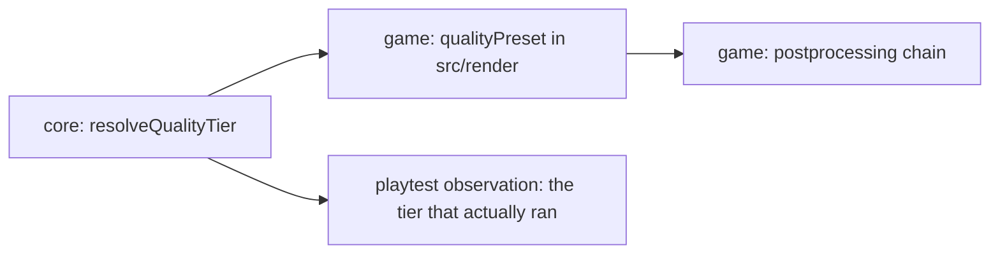

# PRD-322 — which tier a machine gets is a platform seam; what a tier means stays the game's

**Status: DECLINED in Phase 0, 2026-09-04.** No product code was written, which is this PRD's
stated success condition for a Phase 0 that cannot hold the rule-1(b) line. Full audit:
[`docs/verification/PRD-322-phase0-boundary-audit.md`](../../verification/PRD-322-phase0-boundary-audit.md).

Both §6 decline conditions fire, and the PRD's premise turned out to be stale. `resolveQualityTier`
reads **no platform source at all** — no `navigator`, no `window`, no `__THREENATIVE_NATIVE__`, no
URL parameter — in any of the eleven byte-identical copies (ten templates plus Wildwood at
`d535f51`). It takes a `mobile: boolean` its caller supplies. The seam this PRD proposed to build
already ships as `getPlatform`/`isWeb`/`isMobile` in `packages/core/src/platform.ts:191-204`,
handles web and native, and is already called at the boot path by all ten templates and by Wildwood
(`Valley.ts:555`) — whose one browser global is already guarded by core's `isWeb()`. The claim that
every game "gets the native branch wrong" is disproven: no game has a native branch, because core
owns it.

What remains is a 15-line string narrower over three names the game itself declares, plus one line
— `request.mobile === true ? "low" : "high"` — that maps a platform fact to a tier. That line is a
**look** decision ("a phone gets this game's cheap look"), so rule 1(b) vetoes it into core, and
without it there is no platform half for rule 1(a) to reach. Ledger row 5 was already shipped:
`TN_QUALITY_TIER` is printed at each template's `src/render/postprocessing.ts:31`.

Left standing and explicitly not fixed here: the eleven-way duplication is real, but its
justification would be scaffold-generation drift, not a platform seam. That is a different PRD.

**Original status: PROPOSED, 2026-09-01.** Mined from `sandbox/wildwood/src/render/quality.ts` at
`92a343b`.

**Complexity:** +2 proposes a core export, +2 sits directly on the rule-3 boundary, +1 crosses
core and every template, +1 needs device and desktop proof = **6 → HIGH mode.**

## 1. Context

**Problem.** `sandbox/wildwood/src/render/quality.ts` (159 lines) does two different jobs in one
file, and only one of them belongs to the game.

**Job A — deciding which tier this machine gets.** `resolveQualityTier` reads an explicit
override (a URL parameter, a saved setting) and otherwise asks the platform. That is a question a
portable game structurally cannot answer: the browser answer, the Android answer and the desktop
answer come from three different places, and one of them is a browser global. Rule 1(a) is
explicit — if it needs a browser global or a platform seam, the framework owns it, **at any
size**. Today every game writes its own, gets the web branch right and the native branch wrong,
and nobody notices because the native branch is the one nobody runs.

**Job B — deciding what `low`, `medium` and `high` mean.** Wildwood's file says it best in its own
header: "This is the one place this game decides how expensive it looks." Every millisecond in it
is cited from `docs/verification/runtime-perf-state.md` for a specific scene on a specific GPU.
That is a look decision and rule 1(b) vetoes moving it, at any size.

The two are currently welded together, and the weld is why the platform half gets copied by hand
into every game.

**Files and systems analyzed.**

- `sandbox/wildwood/src/render/quality.ts` — `QualityTier`, `isQualityTier`,
  `resolveQualityTier`, `qualityPreset`
- `sandbox/wildwood/src/render/postprocessing.ts` (34 lines) — reads
  `qualityPreset(resolveQualityTier(...))` and nothing else; the single consumer, which is what
  makes the split clean
- `packages/core/src/index.ts` — `isWeb` already exists, which is the same class of seam and the
  precedent for this one
- `docs/PRDs/useful-defaults/PRD-266-the-render-chain-names-the-tier-it-actually-ran.md` and
  `PRD-287-the-default-look-holds-the-phones-budget.md` — adjacent; this PRD must not duplicate
  or contradict either
- `docs/verification/runtime-perf-state.md` — where the cited costs live

**The prior art in this repository.** `isWeb` is exported from core for exactly this reason. A
tier resolver is `isWeb` with more branches and a documented override order.

## 2. The split, stated as a rule

| Piece | Owner | Why |
|---|---|---|
| The tier *names* — `"low" \| "medium" \| "high"` | **Core** | A vocabulary shared across templates so tooling and the playtest reporter can name what ran |
| Explicit override order (URL param, stored setting, env) | **Core** | Platform-specific lookups; a browser global on one target |
| Platform default when nothing is explicit | **Core** | Web, Android and desktop answer differently |
| Narrowing an arbitrary string, failing closed on an unknown | **Core** | Fail closed everywhere |
| What each tier turns on and off | **Game**, in generated `src/render/quality.ts` | Rule 1(b), a veto |
| Every millisecond, resolution scale and stage toggle | **Game** | Rule 1(b) |
| Whether a game has three tiers at all | **Game** | A game may ship one |

If the resolver ever gains a parameter that changes an appearance, it has crossed the line and
must be reverted.

## 3. Integration Ledger

| # | New thing | Live caller and reachability | Replaces or rejects | Negative control |
|---|---|---|---|---|
| 1 | `QualityTier` type and a fail-closed narrower in core | `packages/core/src/→impl` | Replaces per-game copies; rejects exporting a preset alongside it | Pass `"ultra"`; it must throw, not fall back |
| 2 | Platform tier resolution with a documented override order | `packages/core/src/→impl` | Replaces the game's platform branch; rejects a heuristic on GPU name strings | Force each platform branch; a wrong branch on native fails |
| 3 | Wildwood's `quality.ts` keeps its presets, loses its resolver | `sandbox/wildwood/src/render/quality.ts:→impl` | Rejects keeping both | Delete the core export; Wildwood fails to build |
| 4 | Every template does the same | `templates/*/src/render/quality.ts:→impl` | Rejects one template migrating and the rest drifting, which PRD-203 already names as a pattern here | A template still carrying its own resolver fails the drift test |
| 5 | The resolved tier is observable to the playtest reporter | `→impl` | Rejects a tier nobody can assert on | A scenario asserting the tier finds nothing; fails |
| 6 | Capability manifest entry | `capabilities.json` | Rejects an invisible export | Search "make it run on a phone"; a miss fails |

### Reachability

## 4. Phases

**Phase 0 — the boundary audit.** Read every template's quality file and Wildwood's. List every
line that is platform and every line that is look. If the platform half is under about 15 lines
per game, run `count-loc.ts` before proceeding — rule 1(a) says the framework owns a seam at any
size, but a seam that is one `isWeb` call already has its export.

**Phase 1 — the core surface, red first.** The narrower and the resolver, with a forced-platform
test hook. Paste the unknown-tier throw red first.

**Phase 2 — Wildwood migrates, its resolver is deleted.**

**Phase 3 — every template migrates in one change.** Not one template at a time.

**Phase 4 — the tier becomes observable.** The playtest reporter can name the tier that ran, which
is what makes PRD-266's "names the tier it actually ran" assertable rather than narrated.

**Phase 5 — device and desktop proof.** The Android branch and the desktop branch are executed,
not reasoned about. Per `docs/PRDs/AGENTS.md`, a branch not executed is `UNVERIFIED`.

## 5. Acceptance criteria

- [ ] **AC1 — fail closed.** An unknown tier name throws. Red pasted.
- [ ] **AC2 — every platform branch is executed.** Web, Android and desktop each produce their
      default under a forced-platform hook, and each is executed on the real target at least
      once. A branch not executed is named `UNVERIFIED` rather than claimed.
- [ ] **AC3 — the override order is documented and tested.** Explicit beats stored beats
      platform default, in that order, with a test per rung.
- [ ] **AC4 — no look crossed the line.** `packages/` contains no resolution scale, no stage
      toggle, no millisecond and no preset. A grep proves it.
- [ ] **AC5 — one implementation.** No template and not Wildwood keeps a private resolver.
- [ ] **AC6 — the tier is assertable.** A playtest scenario asserts the tier that ran, and fails
      when forced to the wrong one.
- [ ] **AC7 — smaller.** `count-loc.ts` favours the framework version summed across the
      templates plus Wildwood.
- [ ] **AC8 — findable.** A plain-words capability search reaches it.
- [ ] **AC9 — gates.** `pnpm typecheck && pnpm lint && pnpm test && pnpm test:templates`, output
      pasted.

## 6. Decline conditions

Close as DECLINED if the platform half cannot be separated without a preset or an appearance
parameter following it into core, or if `isWeb` plus five lines per game already covers it and
`count-loc.ts` says so.

---

## 7. Integration litmus

**Delete the new code. Does something pre-existing break?** Yes after Phases 2 and 3: Wildwood
and every template import the resolver, and their private copies are gone. Until then the PRD is
in the *additive migration* state and is not done.

**Have I watched this gate fail?** AC1 (unknown tier throws), AC6 (a scenario forced to the wrong
tier).

**Reachability.**
- Entry point: the game's boot path, before the render chain is built.
- Pre-existing files edited: `packages/core/src/index.ts`,
  `sandbox/wildwood/src/render/quality.ts`, `templates/*/src/render/quality.ts`, the playtest
  observation registry.
- Registration: core export plus a capability-manifest entry.
- Replaces: the per-game platform branch in every quality file — deleted in Phases 2 and 3.

**Per-phase pre-existing edit.** P0 none (audit, may DECLINE), P1 `packages/core/src/index.ts`,
P2 Wildwood's `quality.ts`, P3 every template's `quality.ts`, P4 the playtest reporter, P5 the
device lane's evidence file.

**Negative controls:**
- `fail closed` — goes red when `"ultra"` falls back instead of throwing
- `override order` — one red per rung, each with the rung above removed
- `no look crossed` — goes red when a preset value is moved into `packages/`
- `tier is assertable` — goes red when a scenario is forced to the wrong tier

**Anti-pattern scan.** The dominant risk here is scope creep across the rule-1(b) line: a
resolver that grows "just the resolution scale" is no longer a seam. AC4's grep is mechanical for
that reason. Secondary risk is *twin constants* — the tier names existing both in core and in
each game's preset map with nothing tying them; the core type must be the single owner.

**Proof subject.** All shipped templates plus Wildwood in one change, on the real Android device
and the real desktop build — not a forced-platform hook alone. A forced hook proves the branch
selects; only the device proves the branch is right.

## 8. Done gates

- [ ] Integration Ledger has zero `→impl` cells
- [ ] No template and not Wildwood keeps a private resolver — caller census pasted
- [ ] `count-loc.ts` score pasted, summed across templates plus Wildwood
- [ ] Every gate has an observed red, pasted
- [ ] Each platform branch executed on its real target, or named `UNVERIFIED`
