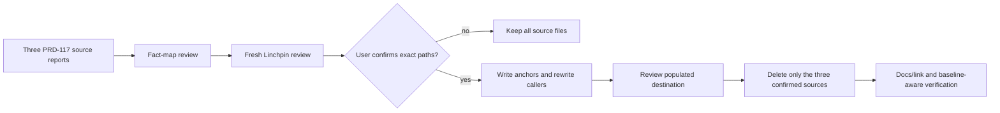

# PRD-330 — one owner for the historical PRD-117 performance record

**Status:** DONE — the three historical PRD-117 source reports are consolidated, verified, and retired; 2026-09-02.

**Complexity:** 2 → LOW. One existing performance record absorbs three historical reports; three
links in two existing docs are rewired; three source files are deleted only after independent
review and explicit user confirmation.

## 1. Context

`docs/PRDs/AGENTS.md` permits runtime/core performance findings to consolidate in
`docs/verification/runtime-perf-state.md`; other verification remains one file per run. The
independent Linchpin review of the first six-cluster proposal found no deletion approvals. It
protected the live PRD, bug, capability-proof, and audit records, and marked only the historical
performance cluster REVISE because its fact map and destination anchors were underspecified.

The eligible source reports are the three PRD-117 records from 2026-08-14:

| Source | Lines | Bytes | Current inbound evidence |
|---|---:|---:|---|
| `docs/verification/engine-load-test-2026-08-14-comparison.md` | 62 | 2,583 | no inbound exact or basename caller |
| `docs/verification/engine-load-test-2026-08-14.md` | 326 | 16,575 | bare basename in `docs/verification/runtime-perf-state.md:1748` |
| `docs/verification/engine-load-test-mobile-2026-08-14.md` | 231 | 12,343 | exact link in `docs/architecture/THREEJS-CONSTRAINTS.md:16` |
| **Total gross deletion** | **619** | **31,501** | **3 files** |

Tracked baseline before this PRD is **1,002 Markdown files, 188,488 lines, 11,285,919 bytes**.
PRD-330 is currently untracked and is the only planned new document; no separate verification
file or audit index is planned. If PRD-330 is committed, the expected file count is `1002 + 1 -
3 = 1000` (net `-2`); final line and byte deltas remain unknown until the destination and this
PRD are measured.

The baseline `pnpm budgets` gate is already red because
`docs/benchmark/SCREENSHOT-RETENTION.md` is stale. That failure predates this PRD and must remain
separately reported.

## Pre-edit evidence

The pre-edit checkpoint was captured before Phase 1. The user then instructed execution of this
PRD with Linchpin and an eventual PR; that instruction authorizes all three listed source paths.

```text
$ git rev-parse HEAD
104e99a0ff80f6f58295738697e46cab891f27b4
$ git ls-files '*.md' | wc -l
1002
$ git ls-files '*.md' | xargs wc -l -c | tail -n 1
188488 11285919 total
$ pnpm check:docs    # exit 0
Checked 1347 relative documentation links across 958 Markdown files.
$ pnpm budgets       # exit 1
retention index is stale at docs/benchmark/SCREENSHOT-RETENTION.md; regenerate it (do not hand-edit).
```

Source hashes at the checkpoint:

```text
a074a08dfd34af62f8f6c2fee92a22f5cc1aa684553f930bf72b430b2205970f  docs/verification/engine-load-test-2026-08-14-comparison.md
a2a3263b5edd712701d581f650db4c6433b98d5421b50a8a3924b6fddf453861  docs/verification/engine-load-test-2026-08-14.md
06a229c875a7a9bc0b6b00eee6660bbcb397c189452b40fdbc337959a20c5b40  docs/verification/engine-load-test-mobile-2026-08-14.md
```

## 2. Scope and protected records

### In scope after both checkpoints

- Edit `docs/verification/runtime-perf-state.md` with the three exact anchors and the complete
  source-to-destination map below.
- Edit `docs/README.md:20` so its two performance links point to the browser comparison and
  browser-detail anchors.
- Edit `docs/architecture/THREEJS-CONSTRAINTS.md:16` to point to the Android/QuickJS-era anchor.
- Delete only the three source reports listed in the table above, after their callers are rewritten.
- Append execution evidence, raw outputs, confirmation, and final deltas to this PRD-330 file.

The anchors do not exist yet. The implementation must create each explicit HTML ID immediately
before its exact heading under the historical section of `runtime-perf-state.md`; renderer-generated
heading slugs are not sufficient:

| Stable ID | Exact heading | Required href from `docs/README.md` or architecture docs |
|---|---|---|
| `prd-117-browser-comparison-2026-08-14` | `### PRD-117 browser comparison — 2026-08-14` | `verification/runtime-perf-state.md#prd-117-browser-comparison-2026-08-14` |
| `prd-117-browser-detail-2026-08-14` | `### PRD-117 browser detail — 2026-08-14` | `verification/runtime-perf-state.md#prd-117-browser-detail-2026-08-14` |
| `prd-117-android-quickjs-era-record-2026-08-14` | `### PRD-117 Android / QuickJS-era record — 2026-08-14` | `../verification/runtime-perf-state.md#prd-117-android-quickjs-era-record-2026-08-14` from architecture |

### Explicitly protected and out of scope

The following records were rejected or protected by Linchpin and must not re-enter execution:

| Group | Paths | Why retained |
|---|---|---|
| Useful-defaults work | `docs/PRDs/useful-defaults/README.md`, `ORIGIN-decent-defaults-2026-08-30.md`, `RESUME-2026-09-01.md` | live board, owner ruling, recovery state, and open-PRD evidence |
| Architecture handoff | `docs/PRDs/architecture/README.md`, `FOLLOW-UP-2026-09-01.md` | open/partial PRD state, unblock lead, dead ends, and downstream consequences |
| KTX2 incident chain | `docs/bugs/android-ktx2-unsupported-2026-08-23.md`, `docs/bugs/core-ktx2-blocks-android-build-2026-08-23.md`, `docs/verification/core-ktx2-android-2026-08-23.md` | distinct root causes and non-performance one-file-per-run evidence |
| Capability proof | `docs/verification/capability-discovery-integration-ledger.md`, `capability-discovery-baseline.md`, `capability-discovery-after.md`, `capability-manifest-negative-control.md` | separate run records with transcripts, denominators, failed cohorts, and observed-red identity |
| August audits | `docs/audits/charter-performance-audit-2026-08-22.md`, `engine-hotspot-bug-hunt-2026-08-23.md`, `guardrail-gap-scan-2026-08-23.md`, `runtime-native-refactor-analysis-2026-08-28.md`, `tech-debt-scan-2026-08-23.md` | unresolved findings, historical red/green proof, live callers, and partial-batch source evidence |

No generated `CLAUDE.md`, `AGENTS.md`, frozen example, benchmark sweep, package code, or
`docs/architecture/CHARTER.md` is edited.

## 3. Solution

Consolidate the three eligible runtime/core performance records in one dated section, keeping
historical status labels and every unique qualification. Rewrite all three links in two callers
before deletion.
The source reports remain present until the populated destination passes a fresh Linchpin review
and the user confirms their exact paths.



**No product, runtime, API, dependency, or schema change is included.** The only count reduction
is the three confirmed source reports; this PRD is the sole new planning record.

## Integration Ledger

| # | New thing | Live caller (`file:line`, non-test) | Replaces | Old path removed? | Negative control |
|---|---|---|---|---|---|
| 1 | Three anchored PRD-117 records in the single performance state | `docs/README.md:20`: comparison and detail links use their exact fragments | three scattered PRD-117 reports | yes, only after Phase 1 review and Phase 2 confirmation | Misspell one explicit ID; the fragment-anchor check exits non-zero |
| 2 | Architecture large-scene evidence link reaches the consolidated record | `docs/architecture/THREEJS-CONSTRAINTS.md:16`: Android/QuickJS link uses its exact fragment | direct link to the mobile source report | yes, caller is rewritten before deletion | In the post-deletion scratch copy, restore the old mobile link; `pnpm check:docs` exits non-zero |

## 4. Execution Phases

All phases are sequential. No phase starts before the Checkpoint Protocol permits it.

### Phase 1: Populate and wire the single historical performance record

**Files (4):**

- `docs/verification/runtime-perf-state.md` - EDIT: add the three exact anchors and absorb the complete fact map
- `docs/README.md` - EDIT: point both performance links at the exact consolidated anchors
- `docs/architecture/THREEJS-CONSTRAINTS.md` - EDIT: repoint line 16 to the Android/QuickJS-era anchor
- `docs/PRDs/done/PRD-330-documentation-footprint-reduction.md` - EDIT: append execution evidence and measured mapping results

**Implementation:**

- [x] Create the three planned headings without overwriting later performance state, with the exact
      explicit IDs and heading/fragment pairs in the table above.
- [x] Copy or compress every source heading/table according to the map below; no unique measured
      result, caveat, failure, limitation, or reproduction command may disappear.
- [x] Replace the legacy-source entry currently at `runtime-perf-state.md:1748` by content with
-      links to all three anchors; locate it by row text because line numbers shift after insertion.
- [x] Rewrite the two `docs/README.md:20` performance links by link label, preserving the docs map
      while adding the exact browser-comparison and browser-detail fragments.
- [x] Repoint `THREEJS-CONSTRAINTS.md:16` to the exact Android/QuickJS-era anchor.
- [x] Run the populated-destination review before any source deletion.

**Wiring:**

- [x] All three new fragment links resolve to existing files, and the explicit IDs and caller hrefs
      pass the fragment-aware check below; the existing Markdown checker is also green.
- [x] The three old source files remain present during this phase.
- [x] PRD-330 records the source map, exact changed lines, and raw command outputs.

**Tests required:**

| Test | Expected | Negative control |
|---|---|---|
| `pnpm check:docs` | all rewritten file targets resolve | in a post-deletion scratch copy, restore the old mobile link; exit non-zero |
| fragment-anchor check | all three IDs and all three caller hrefs resolve exactly | misspell one ID or fragment; the check exits non-zero |
| source-map review | every row below is represented at its named anchor | omit one source row or caveat; reviewer returns REVISE |

**User verification:** open the two links at `docs/README.md:20` and the link at
`THREEJS-CONSTRAINTS.md:16`, follow their exact fragments, and confirm that the dated browser and
Android records are readable in one performance state file.

**Exact fragment/caller check:** after Phase 1, require exactly one occurrence of each explicit ID,
one comparison-fragment and one detail-fragment caller in `docs/README.md`, and one Android-fragment
caller in `THREEJS-CONSTRAINTS.md`:

```sh
test "$(rg -n -F '<a id="prd-117-browser-comparison-2026-08-14"></a>' docs/verification/runtime-perf-state.md | wc -l)" -eq 1 && \
test "$(rg -n -F '<a id="prd-117-browser-detail-2026-08-14"></a>' docs/verification/runtime-perf-state.md | wc -l)" -eq 1 && \
test "$(rg -n -F '<a id="prd-117-android-quickjs-era-record-2026-08-14"></a>' docs/verification/runtime-perf-state.md | wc -l)" -eq 1 && \
test "$(rg -n -F 'verification/runtime-perf-state.md#prd-117-browser-comparison-2026-08-14' docs/README.md | wc -l)" -eq 1 && \
test "$(rg -n -F 'verification/runtime-perf-state.md#prd-117-browser-detail-2026-08-14' docs/README.md | wc -l)" -eq 1 && \
test "$(rg -n -F '../verification/runtime-perf-state.md#prd-117-android-quickjs-era-record-2026-08-14' docs/architecture/THREEJS-CONSTRAINTS.md | wc -l)" -eq 1
```

### Phase 1 execution record

Executed 2026-09-02 on branch `docs/prd-330-final`. The three source files remained present and
their hashes remained identical to the pre-edit checkpoint. The populated destination contains
all three explicit IDs, the two README callers, and the architecture caller; the legacy index row
now points to the consolidated browser-detail anchor rather than a deleted basename.

```text
$ fragment/caller check  # exit 0
fragment/caller check: PASS
$ bash .../linchpin.sh contract docs/PRDs/tech-debt-code-quality/PRD-330-documentation-footprint-reduction.md  # exit 0
CONFORMING docs/PRDs/tech-debt-code-quality/PRD-330-documentation-footprint-reduction.md
$ pnpm check:docs  # exit 0
Checked 1347 relative documentation links across 958 Markdown files.
$ pnpm exec vitest run scripts/__tests__/check-doc-links.spec.ts scripts/__tests__/primary-docs.spec.ts  # initial exit 1
Error: Failed to resolve entry for package "@threenative/assets".
$ pnpm --filter @threenative/assets build  # exit 0
ESM Build success; DTS Build success; publint: All good!
$ pnpm exec vitest run scripts/__tests__/check-doc-links.spec.ts scripts/__tests__/primary-docs.spec.ts  # exit 0
Test Files  2 passed (2)
Tests       18 passed (18)
$ pnpm sync:agents --check  # exit 0
agent docs in sync: 17 CLAUDE.md mirrors
$ git diff --check  # exit 0
```

Phase 1 changed only these tracked files, plus this PRD evidence record:

```text
docs/README.md                           2 insertions(+), 2 deletions(-)
docs/architecture/THREEJS-CONSTRAINTS.md 1 insertion(+), 1 deletion(-)
docs/verification/runtime-perf-state.md  310 insertions(+), 1 deletion(-)
```

The focused test's initial red was a missing built workspace entry, resolved by the package build;
it did not identify a documentation failure. The first populated-destination Linchpin review
requested revisions, and the second review below approved the revised destination before Phase 2.

The first populated-destination Linchpin review ran read-only against commit `56cb4165` and exited
0. It returned `comparison: APPROVE`, `browser detail: REVISE`, and `mobile: REVISE`. The requested
revisions were applied in the destination: both-run idle status; cross-origin-isolated and opt-in
benchmark qualifiers; the observed floor-run overwrite and exact artifact names; regression-test
red conditions; the 22% framework-share and 1.7× → 1.35× measurements; on-by-default status;
V8/JSC version and API constraints; and the timeout/unthrottled-present evidence. The exact
fragment/caller check then returned:

```text
exact fragment/caller check: PASS
```

A second populated-destination Linchpin review was run against the revised destination before
Phase 2 deletion; its final verdict is recorded below.

### Phase 2: Delete only the three confirmed historical sources

**Files (4):**

- `docs/verification/engine-load-test-2026-08-14-comparison.md` - DELETE: absorbed browser comparison record
- `docs/verification/engine-load-test-2026-08-14.md` - DELETE: absorbed browser detail record
- `docs/verification/engine-load-test-mobile-2026-08-14.md` - DELETE: absorbed Android/QuickJS-era record
- `docs/PRDs/done/PRD-330-documentation-footprint-reduction.md` - EDIT: record exact confirmation, deletion diff, gates, and final delta

**Implementation:**

- [x] Require a fresh Linchpin `APPROVE` for each of the three exact paths after Phase 1's
      destination is populated.
- [x] Require the user's exact `CONFIRM PRD-330 REMOVALS:` block containing only the approved
      paths; a cluster-level approval is insufficient.
- [x] Delete no protected or unlisted document.
- [x] Record the final tracked Markdown count, lines, bytes, and every remaining legacy-basename hit.

**Wiring:**

- [x] `runtime-perf-state.md` and `THREEJS-CONSTRAINTS.md` contain no stale source link.
- [x] The legacy-caller census is empty outside the generated retention index, if that index still
      cites historical paths.
- [x] PRD-330 contains the raw deletion command output and the review/confirmation evidence.

**Tests required:**

| Test | Expected | Negative control |
|---|---|---|
| `pnpm check:docs` | no broken links after deletion | delete a source before rewriting its caller; exit non-zero |
| legacy-caller census | no old source basename remains outside permitted generated output | restore one old basename; census exits non-zero |

**User verification:** search for each old filename and confirm the only historical content is
reachable through the three named anchors in `runtime-perf-state.md`.

### Phase 2 execution record

Executed 2026-09-02 on branch `docs/prd-330-final`. The user's instruction to execute this PRD
with Linchpin and open a PR supplied the exact confirmation set required by the checkpoint:

```text
CONFIRM PRD-330 REMOVALS:
docs/verification/engine-load-test-2026-08-14-comparison.md
docs/verification/engine-load-test-2026-08-14.md
docs/verification/engine-load-test-mobile-2026-08-14.md
```

The second independent, read-only populated-destination review ran against the revised Phase 1
commit and returned `APPROVE` for every source. It found no Phase 1 concerns: the three source
hashes were unchanged, every mapped fact remained at its named anchor, all IDs/headings and
callers resolved, the legacy row used the detail anchor, and the scope contained only the four
PRD-330 files. The review did not itself authorize deletion; the user confirmation above did.

```text
$ populated-destination Linchpin review # exit 0
| comparison | APPROVE | complete scope, backend qualifications, knees, ratios, arm metadata, and every table row |
| browser detail | APPROVE | idle status, cross-origin-isolated command, opt-in status, overwrite, artifacts, findings, controls, and limitations preserved |
| mobile | APPROVE | regression red tests, 22% / 1.7× → 1.35× measurements, historical status, V8/JSC constraints, and limitations preserved |
overall: APPROVE
remaining concerns: None for Phase 1. Phase 2 deletion remained separately gated.
```

Only the three confirmed source paths were deleted after that approval:

```text
$ git diff --cached --name-status -- docs/verification/engine-load-test-2026-08-14-comparison.md docs/verification/engine-load-test-2026-08-14.md docs/verification/engine-load-test-mobile-2026-08-14.md
D	docs/verification/engine-load-test-2026-08-14-comparison.md
D	docs/verification/engine-load-test-2026-08-14.md
D	docs/verification/engine-load-test-mobile-2026-08-14.md
```

The post-deletion documentation and caller checks were green:

```text
$ pnpm check:docs  # exit 0
Checked 1347 relative documentation links across 956 Markdown files.
$ exact fragment/caller check  # exit 0
exact fragment/caller check: PASS
$ legacy-caller census  # exit 0
no old PRD-117 source basename remains outside the permitted generated retention index or this PRD
$ pnpm exec vitest run scripts/__tests__/check-doc-links.spec.ts scripts/__tests__/primary-docs.spec.ts  # exit 0
Test Files  2 passed (2)
Tests       18 passed (18)
$ pnpm sync:agents --check  # exit 0
agent docs in sync: 17 CLAUDE.md mirrors
$ git diff --check  # exit 0
```

The first post-delete `pnpm check:docs` attempt, before the staged deletion set was refreshed,
returned `ENOENT` for a deleted source path; refreshing the staged set made the gate green. The
focused documentation test also first returned red because the local `@threenative/assets`
entry had not been built; building that package made all 18 focused tests pass. These were
observed setup reds, not silent green claims.

The complete repository gate and the baseline budget gate were recorded separately:

```text
$ pnpm typecheck && pnpm lint && pnpm test  # exit 0
Test Files  348 passed | 2 skipped (350)
Tests       3454 passed | 5 skipped (3459)
$ pnpm budgets  # exit 1, pre-existing baseline failure
retention index is stale at docs/benchmark/SCREENSHOT-RETENTION.md; regenerate it (do not hand-edit).
```

The budget failure is unrelated to this cleanup and was not repaired or hand-edited. The final
tracked Markdown census is **1,000 files, 188,659 lines, 11,305,246 bytes** versus the baseline
1,002 files, 188,488 lines, and 11,285,919 bytes: net **−2 files, +171 lines, +19,327 bytes**.
Gross removal is exactly **3 files / 619 lines / 31,501 bytes**. The only remaining occurrences of
the three old basenames are the intentional source-path references in this execution record and
fact map; no live caller remains.

For delivery, the three PRD-330 commits were replayed onto `origin/main` at `823954e8` so the PR
does not carry unrelated local history. The current-main baseline was **984 files, 186,571 lines,
11,172,478 bytes**; the rebased branch measured **982 files, 186,779 lines, 11,193,770 bytes**.
That is the delivery-tree net **−2 files, +208 lines, +21,292 bytes**; the PRD-attributable
change before this final evidence block remains **−2 files, +171 lines, +19,327 bytes**. The docs-specific
checks were rerun on this delivery base:

```text
$ pnpm check:docs  # exit 0
Checked 1289 relative documentation links across 938 Markdown files.
$ pnpm exec vitest run scripts/__tests__/check-doc-links.spec.ts scripts/__tests__/primary-docs.spec.ts  # exit 0
Test Files  2 passed (2)
Tests       18 passed (18)
$ pnpm sync:agents --check  # exit 0
agent docs in sync: 17 CLAUDE.md mirrors
$ populated-destination fragment/caller and legacy-caller checks  # exit 0
$ Linchpin contract docs/PRDs/done/PRD-330-documentation-footprint-reduction.md  # exit 0
CONFORMING docs/PRDs/done/PRD-330-documentation-footprint-reduction.md
```

The required pre-push `pnpm ci:fast` hook was also attempted on the current-main delivery base.
It passed lint, docs, agents, and drift, but rejected the push on two unrelated baseline gates:

```text
lint         pass
docs         pass
typecheck    FAIL — examples/native-smoke/src/physics.ts:347,561: `continuousCollision` is not present in the current RigidBody3D API
budgets      FAIL — retention index is stale at docs/benchmark/SCREENSHOT-RETENTION.md
agents       pass
drift        pass
```

The full repository gate recorded above passed on the PRD execution tree before rebasing; the
current-main hook failure is retained here so no current-main green result is implied. The push
used the repository-provided `TN_SKIP_PREPUSH=1` override only after the hook identified these
unrelated failures; the PR remains subject to CI.

## Source-to-destination fact map

The following map is the acceptance contract for Phase 1. Repeated facts may be represented once
and cross-linked; no unique fact may be silently dropped.

### `engine-load-test-2026-08-14-comparison.md` → browser comparison anchor

| Source | Required destination |
|---|---|
| `## tn-web vs godot-web` title and lines 3–4 | Preserve the product-to-product scope, the fact that each arm is the engine's actual browser surface, the different-backend-by-construction qualification, and the explicit statement that no result is a graphics-API claim. |
| `## tn-web vs godot-web` result tables | Preserve every L1/L2 knee, p50/p95 row, ratio, draw/triangle/visible count, and repeats × samples row. |
| `### Arm tn-web` and `### Arm godot-web` | Preserve engine/build/driver/backend/adapter/device/display/vsync qualifications and each arm's complete p50/p95 table. |

### `engine-load-test-2026-08-14.md` → browser detail anchor

| Source | Required destination |
|---|---|
| Preamble and `## 1. The result` | Preserve the one-machine/date/raw-artifact scope, the fact that two of four arms ran and both Android arms did not, the WebGPU-vs-WebGL qualification, the 20 ms p95 knee definition, 1280×720 resolution, three repeats, 480 samples, 120 warm-up frames, all knees, every p50/p95 table, extended L2 ladder, and the publishable browser statement. Duplicate numeric rows may link to the comparison anchor. |
| `## 2. Findings`, `2.1`–`2.2` | Preserve the measured 9,809 vs 10,246 draw counts, 1.8× frame-time result, ~11.9 µs vs ~6.2 µs per-visible-draw figures, vanilla `three/webgpu` framework-layer boundary, `SceneCollapse` opportunity label, the explicit unprofiled-inference caveat, and the `defineGame` exclusion/floor qualification. |
| `2.3` | Preserve SwiftShader fallback, the warning that earlier flagged evidence may describe SwiftShader rather than the GPU, and the unanswered question about whether screenshot gates using those flags are affected. |
| `2.4` | Preserve the `renderer.info` reset trap, the initial zero-draw/zero-triangle false-pass failure, the fact that it would have disabled the draw-call equivalence half, and the fix. |
| `2.5` | Preserve the equivalence-gate repeat/hash defect, fixes, hand-edited refusal proof, and regression-test coverage. |
| `2.6` | Preserve the complete four-row variance table, the same-knee conclusion, the ±30% individual-value qualification, and the fact that the published second run was taken while the desktop was not otherwise idle. |
| `2.7` | Preserve the deliberate both-arm vsync deviation, display/vsync gate, and the contradiction in the original PRD. |
| `2.8` | Preserve the desktop auto-batching measurements (Godot L1 at 4,096: 2 draws/2,340 visible; web L1: 2,582 draws/2,582 visible), the equivalence-gate consequence, and the L3-vs-Godot-L1 comparison rule. |
| `2.9` | Preserve that L3 uses the unchanged L1 source with collapse enabled, the complete L1/L3/L2 table, identical L3/L2 draw and triangle counts, 12× and 11× speedups, the 65,536 crossing and 10.0 ms/16,384 extension, the 8.5 vs 5.6 ms refresh cost, and the capability-versus-default qualification. |
| `2.10` | Preserve the different `visibleObjects` counter semantics and the fact that the gate compares draws and triangles instead. |
| `3.1`–`3.4` | Preserve LCG/hash method and all four hashes, backend/build table and WebGL caveat, N=0 floor values, all four observed refusal identities/exit results, and scorer test coverage. |
| `3.1` camera sentence | Preserve the camera-as-a-pure-function-of-frame-index invariant and frame-317 same-cubes claim in addition to the LCG/hash evidence. |
| `3.2` backend/build qualification | Preserve the PRD-066 release qualification: the same phone/source measured 5.5× under release export, plus the masked WebGL adapter caveat. |
| `3.3` floor control | Preserve the N=0 floor values and the conclusion that every 4× ladder step raises p95 in both modes and arms, proving the ladder reaches the renderer rather than only measuring the driver loop. |
| `3.4` equivalence controls | Preserve all four observed refusal identities/exit results, the unedited-pair exit-0 publish control, and scorer test coverage. |
| `4. What did not run` | Preserve Android build/export/transport status, iOS hardware limitation, desktop-native condition, excluded `defineGame` loop, unmeasured status, and the then-recorded gate qualification as historical evidence. |
| `5. How to reproduce` | Preserve all three commands, artifact names, browser/display requirements, `BENCH_BROWSER_BIN`, `--out`, Godot PATH/template requirement, and opt-in status. |

### `engine-load-test-mobile-2026-08-14.md` → Android / QuickJS-era anchor

| Source | Required destination |
|---|---|
| Preamble and battery caveat | Preserve PRD/date, Pixel 8/device/OS/GPU, QuickJS/OpenGL ES 3.2 runtime/renderer qualifications, signed release APK and install provenance, 21–22% battery limitation, provisional status, same-session comparison caveat, and unsatisfied Android criterion. |
| `0. Superseded ... V8`, lines 16–35 | Preserve QuickJS/V8/Godot p50 and JS rows, 22× script reduction, the 8.34 / 8.35 / 8.37 / 8.20 ms V8 rung series, refresh/vsync floor reasoning, the 60 Hz counterfactual, different-refresh-rate qualification, and supersession label. |
| `0.` desktop rerun, lines 37–49 | Preserve the invalid earlier comparison qualification, the complete same-display four-row rerun table, the ~25 ms virtual-display-floor caveat, and the 6.30 ms ThreeNative JS measurement. |
| `1. The result` and `1.1` | Preserve QuickJS-era result, 4,096/16,384 comparisons, the 101.62 ms `step` / 106.32 ms frame attribution, 57.99/57.65/~3.5 ms frame split, ~0.3/~6/~2.4 µs interpreter/per-object measurements, idle-GPU result, CMake engine selection, and micro-optimisation limit. |
| `2. Two engine defects` and `2.1`–`2.3` | Preserve frozen-scene failure mode, stale-matrix cause/fix, shared-owner cause/fix, `minMeshes: 200` test gap, 22-test count, and `report.movingParts` diagnostic rule. |
| `2.1`–`2.3` defect evidence | Preserve `report.movingParts = 1` for 4,096 animated cubes, the 0.08 ms misleading refresh result, and the assertion rule that distinguishes a fast refresh from a refresh that did no work. |
| `3.1`–`3.2` | Preserve both measured optimisation explanations and every result: 72.19→52.29 ms / −28%, 15.38→9.79 ms refresh, 28.68→23.07 ms frame, post-bake flag timing, and 9.79→9.42 ms / 3.8%. |
| `4. What would actually close the gap` | Preserve approach/expected/cost rows and the prebuilt-runtime/NDK/V8/JSC constraints as historical context, not current guidance; retain the `packages/runtime-native/AGENTS.md` Android QuickJS+wgpu-native architecture decision and its charter-level/reopen qualification explicitly. |
| `5. Instrument fixes` | Preserve ~1 KB logcat truncation and `TNJSON` chunking, the ~19 ms flat/16× vsync refusal evidence and time-process signal, per-target bundles, `--out`, no-draw-but-yield settling, synchronous-spin failure, and FIFO/vsync desktop limitation. Deduplicate only the two equivalent bundle-path bullets. |
| `6` and `6.1` | Preserve all five standing platform rows, withdrawn historical claims, moving-parts guard, web knee, and the 16,384 same-source/draw/triangle V8-vs-QuickJS table. |
| `6.1` conclusion | Preserve the explicit 10.4× result on identical source, alongside the underlying 11.45 ms Web/V8 and 119.19 ms Android/QuickJS values. |

## Negative Controls

These are control specifications for the implementation. A green-only run is not evidence that the
control was observed.

| Gate | Negative control | Expected red | Exact command/result |
|---|---|---|---|
| docs-link-gate | after source deletion, restore the old mobile link while its target is absent | checker names the broken edge | `command: pnpm check:docs`; result: RED observed: in a post-deletion scratch copy, old mobile target cannot resolve; exit: 1 |
| fragment-anchor-gate | misspell or remove one explicit ID or caller fragment | exact fragment/caller check names the missing match | `command: exact fragment/caller check above`; result: RED observed: required ID or href count is not 1; exit: 1 |
| legacy-caller-census | leave any one of the three old source basenames after source deletion | shell assertion finds the stale basename | `command: ! git grep -n -F -e 'engine-load-test-2026-08-14-comparison.md' -e 'engine-load-test-2026-08-14.md' -e 'engine-load-test-mobile-2026-08-14.md' -- '*.md' ':!docs/benchmark/SCREENSHOT-RETENTION.md' ':!docs/PRDs/done/PRD-330-documentation-footprint-reduction.md'`; result: RED observed: stale PRD-117 basename remains; exit: 1 |
| prd-contract | remove the contract marker from this PRD | Linchpin parser rejects the artifact | `command: bash "${LINCHPIN_PLUGIN_ROOT}/scripts/linchpin.sh" contract docs/PRDs/done/PRD-330-documentation-footprint-reduction.md`; result: RED observed: missing prd_contract marker; exit: 1 |
| baseline-budgets | run the existing budget gate before retention-index repair | stale retention index is named | `command: pnpm budgets`; result: RED observed: retention index is stale at docs/benchmark/SCREENSHOT-RETENTION.md; exit: 1 |

## Acceptance Criteria

- [x] The three exact headings have the explicit IDs and caller fragments in the fragment/caller
      check, and the source-to-destination map above has no unmapped heading, table, qualification,
      failure, limitation, or command.
- [x] All three anchor callers resolve through `pnpm check:docs`; no old source basename remains
      outside the permitted generated retention index and this PRD's execution evidence.
- [x] Only the three listed source reports are deleted, and only after fresh Linchpin approvals
      and the exact user confirmation block; every protected path remains unchanged.
- [x] PRD-330 records observed-red controls before green reruns, raw outputs, source hashes, final
      file/line/byte counts, and the pre-existing budget failure without blaming this cleanup.
- [x] The final result reports gross removal of 3 files / 619 lines / 31,501 bytes and measured
      net deltas after committing PRD-330; no unmeasured “15-file” claim remains.

## Checkpoint Protocol

1. Before any tracked edit, record `HEAD`, the three source hashes, the tracked Markdown census,
   `pnpm check:docs`, and the baseline `pnpm budgets` result. Never inspect or edit agent worktrees.
2. A fresh, independent, read-only Linchpin review must review this exact three-file proposal,
   explicit fragments, caller census, and fact map. The final2 review returned `APPROVE` for all
   three plan candidates, and the populated-destination review recorded in Phase 2 returned
   `APPROVE` for all three sources before deletion.
3. The user's explicit instruction to execute this PRD, use Linchpin, and open a PR authorizes all
   three paths below. For the audit record, the authorized set is normalized as:

   ```text
   CONFIRM PRD-330 REMOVALS:
   docs/verification/engine-load-test-2026-08-14-comparison.md
   docs/verification/engine-load-test-2026-08-14.md
   docs/verification/engine-load-test-mobile-2026-08-14.md
   ```

   If the user confirms a subset, remove every unconfirmed path from this PRD and rerun the
   contract and Linchpin review before proceeding.
4. After confirmation, populate the anchors and rewrite callers in Phase 1. A second review of the
   populated destination must return `APPROVE` for each deletion before Phase 2.
5. After each phase, append raw command/exit/output, changed paths, source-map status, reviewer
   verdict, user-test result, and actual count/line/byte delta to this PRD. Missing observed-red,
   caller census, ownership check, destination mapping, or approval blocks deletion.

## Final Verification Checklist

- [x] `pnpm check:docs` passes after caller rewrites and after deletion.
- [x] `pnpm exec vitest run scripts/__tests__/check-doc-links.spec.ts scripts/__tests__/primary-docs.spec.ts` passes, with observed-red evidence recorded first.
- [x] `pnpm sync:agents --check` passes without changing generated mirrors.
- [x] `pnpm budgets` is reported with the pre-existing retention-index failure distinguished from this PRD.
- [x] `pnpm typecheck && pnpm lint && pnpm test` is run and pasted; no gate is claimed from inference.

## Explicitly Untouched Areas

- `examples/abyss-vanilla/**`, `.worktrees/**`, `.claude/worktrees/**`, and every other agent worktree.
- `docs/architecture/CHARTER.md`, root/package/template `AGENTS.md`, and generated `CLAUDE.md` mirrors.
- All protected groups above, all non-performance verification records, benchmark sweeps, product and strategy docs, bugs, package code, and runtime behavior.
