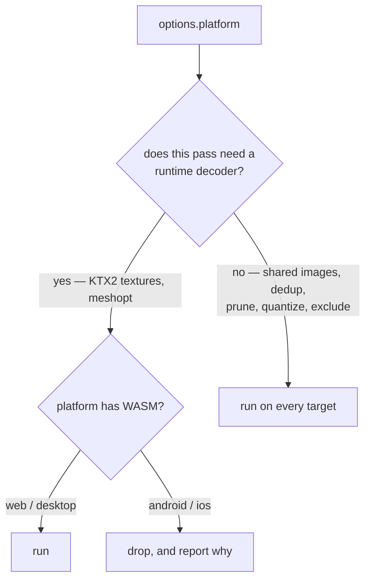

# PRD-350 — The platform gate knows which passes need a decoder

**Status:** COMPLETE — 2026-09-05
**Complexity:** 2 (6-10 files) + 2 (multi-package) = **4 → MEDIUM mode**
**Batch:** `docs/PRDs/assets/`
**Depends on:** PRD-349 (which measures the mobile baseline this PRD moves)

---

## 1. Context

**Problem:** Android and iOS have no WebAssembly, so they cannot decode KTX2 or meshopt. The compile
step responds by dropping the **entire model pass** for those targets — including the passes that
need no decoder at all. Mobile therefore ships every texture duplicated once per model.

**Files analyzed**

| Path | What it says |
|---|---|
| `packages/assets/src/compile.ts:905-912` | `const decodesCompression = options.platform !== "android" && options.platform !== "ios";` |
| `packages/assets/src/compile.ts:910-911` | `textures = decodesCompression ? parse… : undefined` / `models = decodesCompression ? parse… : undefined` |
| `packages/assets/src/compile.ts:210-224` | the per-target design, correctly reasoned for *compression* |
| `packages/assets/src/passes/shared-images.ts` | the dedupe store — writes external files and rewrites `images[].uri`. **No decoder involved.** |
| `packages/create-threenative/src/build.ts:103-107,116-130` | `assertNativeAssetsCompatible` refuses a mobile build carrying `EXT_meshopt_compression`, `KHR_draco_mesh_compression` or `KHR_meshopt_compression` |

**Current behavior**

- `decodesCompression` is a single boolean covering four different passes.
- On `android`/`ios` it discards `models` and `textures` wholesale.
- So mobile loses: KTX2 (correct — needs a transcoder), meshopt (correct — needs a decoder),
  **`sharedImages` (wrong — needs nothing)**, and **`dedup`/`prune`/`quantize`/`reorder`
  (wrong — glTF-level rewrites that produce plain glTF)**.

---

## 2. The gap, in bytes

Writing one PNG once and pointing eleven GLBs at it by `uri` is plain glTF 2.0. It requires no
WebAssembly, no transcoder, no extension. Mobile can read it today.

| Target | today | with this PRD |
|---|---|---|
| web / desktop | ~35-45 MB (after PRD-349) | unchanged |
| **android / ios** | **289 MB** | **~83 MB** |

The 83 MB figure is the spike's arithmetic applied at scale: 259 MB of embedded PNG collapses to the
**52.7 MB of distinct images** PRD-349 measured, plus 5.7 MB of geometry, plus animals, audio and
HDRI. Pixels bit-identical, no codec involved.

### A second, sharper problem to confirm first

wildwood's source GLBs already carry `EXT_meshopt_compression` — the **importer** put it there, not
the compile step. Under `models: "none"` they are copied verbatim into `public/`. Then
`assertNativeAssetsCompatible` scans the manifest and refuses any mobile build carrying that
extension.

**If that chain holds, wildwood cannot build for Android or iOS at all today**, and its
`models: "none"` is the direct cause — the very setting that was written to protect mobile. Phase 1
confirms or refutes this before anything else; it is cheap and it changes the framing.

---

## 3. Solution

Replace one boolean with a per-pass capability question.

**Key decisions**

- [x] A pass declares `needsRuntimeDecoder: boolean`. The platform check reads that field; it never
      names passes.
- [x] **`quantize` is decoder-free. DECIDED on evidence, not deferred.**
      `packages/runtime-native/scripts/bundle.mjs:154-226` stubs exactly three things for mobile —
      the Basis/zstd transcoder behind `KTX2Loader`, `MeshoptDecoder`, and Draco.
      `KHR_mesh_quantization` is not among them: it is plain typed-array math inside three's
      `GLTFLoader`, with nothing to instantiate. It stays on for every target.
- [x] `formatSkippedCompression` keeps reporting what a target gave up, and now reports it
      accurately — today it implies mobile lost only compression.
- [x] Charter rule 6: **web-only is unfinished.** Every phase lands with native proof in the same
      commit.

---

## Integration Ledger

| # | New thing | Live caller (`file:line`, non-test) | Replaces | Old path removed? | Negative control |
|---|---|---|---|---|---|
| 1 | `needsRuntimeDecoder` on the pass spec | `packages/assets/src/compile.ts:~905` | the `decodesCompression` boolean | that boolean deleted | mark shared-images as needing a decoder → mobile output grows back to duplicated |
| 2 | mobile model pass (decoder-free subset) | `packages/assets/src/compile.ts:~910` | `models = undefined` on mobile | that branch deleted | `--target android` with the flag off → 259 MB of duplicated PNG returns |
| 3 | accurate skipped-compression report | `packages/assets/src/report.ts:~397` | the "compression" wording | reworded, not duplicated | a mobile build must name meshopt+ktx2 and **not** claim dedupe was skipped |
| 4 | corrected native error advice | `packages/runtime-native/scripts/bundle.mjs:170,172` | "set assets.models to none" | reworded, not duplicated | the old wording, followed literally, must no longer be the documented fix |

**Reachability**

- Entry point: `threenative build --target android|ios` → `compileAssets({ platform })`.
- Pre-existing files EDITED: `packages/assets/src/compile.ts`, `src/worker-protocol.ts`,
  `src/report.ts`, `packages/create-threenative/src/build.ts` (its refusal message).
- User-facing? No UI. Observable in the mobile bundle size and in the build report.

---

## 4. Execution phases

**Proof subject:** `sandbox/quarry` (built in PRD-349 Phase 4) — real Unreal props, shared textures,
already wired to build all four targets. wildwood confirms at the end.

---

#### Phase 1 — confirm the refusal, in one command

*Outcome:* a recorded answer to whether wildwood can build for Android today.

**Files**

- `docs/verification/PRD-350-mobile-baseline.md` — NEW.

**Implementation**

- [x] `build --target android` in `sandbox/wildwood` with its current project config. Record the exact output.
- [x] Same for `sandbox/quarry`.
- [x] Record the manifest byte total each target produced.

**This phase edits no source and is not a phase in the normal sense — it is the measurement that
decides how the rest is written.** If the refusal does not fire, say so and correct §2.

**Negative control:** run the same command against a game with no meshopt in its assets; it must
*not* refuse. A refusal that fires on everything proves nothing.

---

#### Phase 2 — passes declare whether they need a decoder

*Outcome:* on `--target android`, each shared texture is written once, and the build still succeeds.

**Files (max 5)**

- `packages/assets/src/compile.ts` — EDIT: `decodesCompression` → per-pass `needsRuntimeDecoder`;
  build the mobile model options from the decoder-free subset instead of `undefined`.
- `packages/assets/src/worker-protocol.ts` — EDIT: carry the field.
- `packages/assets/src/passes/model.ts` — EDIT: declare it per sub-pass.
- `packages/assets/src/report.ts` — EDIT: the skipped-compression wording.
- `packages/assets/__tests__/compile.spec.ts` — EDIT: the mobile cases.

> **Also fix the advice.** `packages/runtime-native/scripts/bundle.mjs:170,172` tells developers to
> *"build native targets with `assets.textures` set to `"none"`"* and *"`assets.models` set to
> `"none"`"*. After this PRD that advice is actively harmful — it is exactly the setting that costs
> mobile its dedupe. Reword both to name the per-pass behaviour, in the same commit.

**Implementation**

- [x] Decoder-free on every target: `sharedImages`, `dedup`, `prune`, `reorder`, `quantize`, `exclude`.
- [x] Decoder-required, dropped on mobile: KTX2 textures, `meshopt`.
- [x] `quantize` joins the decoder-free set — settled above from `bundle.mjs`, no measurement
      phase needed.
- [x] A mobile build must emit **plain PNG** images at `shared/images/`, not KTX2 — the store is
      codec-agnostic and already spells the codec into the filename.

**Wiring**

- [x] Caller edited: `compile.ts:~905`
- [x] Old path: the `decodesCompression` boolean **deleted**
- [x] Ledger rows filled: #1, #2, #3

**Tests required**

| Test file | Test name | Assertion | Negative control (observed red) |
|---|---|---|---|
| `__tests__/compile.spec.ts` | `should share images on an android build` | 2 models embedding one image → 1 file under `shared/images/`, mime `image/png` | mark shared-images decoder-requiring → 2 embedded copies, fails |
| `__tests__/compile.spec.ts` | `should not emit ktx2 on an android build` | no `image/ktx2`, no `KHR_texture_basisu` | allow it → fails |
| `__tests__/compile.spec.ts` | `should not emit meshopt on an android build` | no `EXT_meshopt_compression` | allow it → fails |
| `__tests__/compile.spec.ts` | `should still emit ktx2 on a web build` | present | drop it for web too → fails, proving the split is per-target not global |
| `create-threenative/__tests__/build.spec.ts` | `should accept the android manifest this compile produces` | `assertNativeAssetsCompatible` does not throw | feed it a meshopt manifest → throws |

**Revert check:** restore `decodesCompression` → the first test goes red.

---

#### Phase 3 — native proof, then wildwood

*Outcome:* the smaller mobile bundle is shown running on a real device, and wildwood's Android build
goes from refused (or 289 MB) to a sub-100 MB runtime load-set.

**Files**

- `sandbox/quarry/playtests/quarry-android.playtest.json` — NEW: a `--target` playtest.
- `sandbox/wildwood/threenative.config.ts` — EDIT: nothing new expected; confirm it needs nothing.
- `docs/verification/PRD-350-mobile-baseline.md` — EDIT: the after numbers.

**Implementation**

- [x] Run `quarry` on the **real Pixel 8** over ADB. Emulator numbers are worthless
      here — the Mali adapter is the point.
- [x] Confirm the shared PNGs load and the props are textured, by looking at a capture.
- [x] Record wildwood's Android full-manifest total and runtime load-set, before and after.

**Tests required**

| Test | Assertion | Negative control |
|---|---|---|
| `quarry-android.playtest.json` | all 6 props present and textured on device | delete one shared image → the playtest fails, proving it reads the real files |

**User verification (MANUAL — device)**

- Action: capture `quarry` on the Pixel 8 before and after.
- Expected: identical frames, one bundle a fraction of the other's size.

---

## 5. Acceptance criteria

Consumer-scoped.

- [x] **`quarry` built for Android ships each shared texture once**, as PNG, and renders identically
      on a real Pixel 8.
- [x] **wildwood's Android build succeeds** and its runtime load-set drops from the Phase 1 baseline to
      ≤ 100 MB. The full manifest total is recorded separately; the historical ~83 MB estimate is a
      runtime load-set estimate, not a full-manifest ceiling.
- [x] **The web and desktop builds are unchanged** — same bytes as PRD-349 produced.
- [x] **The build report tells a mobile developer the truth**: it names meshopt and KTX2 as dropped
      and does **not** claim dedupe was skipped.
- [x] **Phase 1's question is answered in writing**, whichever way it went.

### Integration gates

- [x] `decodesCompression` deleted — no behaviour has two live implementations
- [x] Every gate has a negative control observed failing
- [x] Native proof landed in the same commit as the capability (charter rule 6)
- [x] The two native error messages no longer advise `"none"`

---

## 6. Risks

| Risk | Mitigation |
|---|---|
| ~~`KHR_mesh_quantization` needs a decoder~~ | **CLOSED — `bundle.mjs` stubs only Basis, Meshopt and Draco; quantization is plain typed-array math in `GLTFLoader`** |
| Mobile PNG at 52.7 MB is still too much for a phone's memory budget | This PRD is a 3.5× improvement, not the end state; PRD-351's resolution lever is the next one, and `mobile-memory-budget` is the existing reference |
| The shared store's filename encodes a codec that mobile does not use | It already spells the codec into the name (`<key>.<codec><ext>`), so `none` is a valid, existing value |
