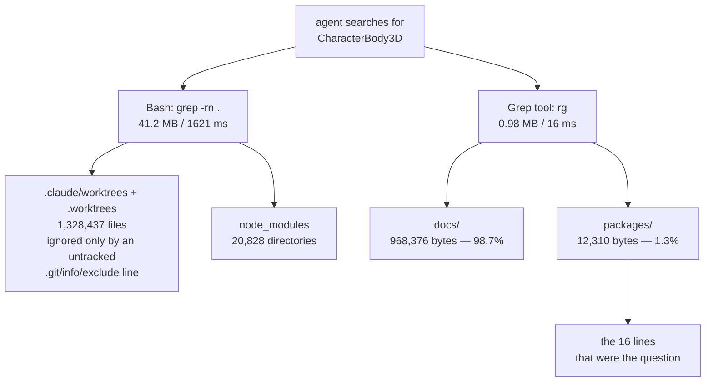

# PRD-357 — The search path is mostly noise

**Status:** COMPLETE — C1–C4 implemented; A1–A6 evidence in [the verification record](../../verification/prd-357-search-noise.md).
**Complexity:** 2 (ignore rules + one gate) + 2 (untracking with a spec-safety check) + 3 (103 MB of
tracked duplicates) = **7 → HIGH mode**
**Batch:** `docs/PRDs/agent-leverage/`
**Siblings:** PRD-313 (the office is the agent load), PRD-124 (agent evidence and repair benchmark)

---

## 1. Context

**Problem:** the repository's search path is 42× larger than the repository. A cold agent that runs
one ordinary `grep -rn` for a symbol receives **41.2 MB of output** — roughly ten million tokens,
ten times a 1M context — and 98.7% of what survives ripgrep is documentation about the symbol
rather than the symbol.

**The one-sentence fix:** make the default search path be the code, and stop tracking three classes
of file that exist only to be crossed.

None of this is a proposal to write less. Every finding below is a file that is already redundant
with another file in the same repository, or a directory that a rule already says not to read but
no tool enforces.

### Where a search actually goes



**Measurements taken** (all on `main` at `8df60c0c`, 2026-09-04)

| Command | Result |
|---|---|
| `grep -rn "CharacterBody3D" .` | 41,171,218 bytes, 1,621 ms |
| `rg -n "CharacterBody3D"` | 982,814 bytes, 16 ms |
| `rg -n "CharacterBody3D" docs` vs `packages` | 968,376 B vs 12,310 B — **98.7% docs** |
| `rg -n "playtest" docs` vs `packages` | 3,654,170 B vs 256,498 B — **93.5% docs** |
| `find .claude/worktrees -type f \| wc -l` | 629,652 |
| `find .worktrees -type f \| wc -l` | 698,785 |
| `git check-ignore -v .claude/worktrees` | `.git/info/exclude:12` — **untracked, machine-local** |
| `grep -n claude .gitignore` | no match |
| exact-duplicate tracked images | **103.8 MB** across 207 groups (369 redundant files) |
| tracked images total | 249.0 MB across 820 files — duplicates are **42%** |
| `docs/PRDs/done/` | 3.74 MB across 260 files, all finished |
| tracked sweep `AGENTS.md`/`CLAUDE.md` | 26 files, 408,760 bytes |
| tracked `CLAUDE.md` mirrors | 32 files, 352,574 bytes, each differing from its `AGENTS.md` by a 2-line header |

---

## 2. The five findings, ranked by measured burn

### F1 — `.claude/worktrees/` is ignored by a file that is not in the repository

629,652 files. The only thing keeping ripgrep out of them is line 12 of `.git/info/exclude`, which
is per-clone, untracked, and was written by hand on this machine. `.gitignore` has no `.claude`
entry at all. On a fresh clone — CI, a new machine, a sandbox, any agent who is not this one — the
Grep tool crosses all 629,652 files, and `rg` stops being the fast path.

The rule exists in prose and nowhere else: `/AGENTS.md` says *"`.worktrees/` holds other agents'
lanes — never search it"* and names only `.worktrees/`, the directory that **is** in `.gitignore`.
The directory the global worktree convention actually mandates — `<repo-root>/.claude/worktrees/` —
is not named in that sentence and not in `.gitignore`.

**Value delivered by the current state: none.** This is a one-line omission.

### F2 — documentation drowns code search, and 3.74 MB of it is finished work

Under ripgrep, `docs/` supplies 93–99% of the bytes for an ordinary symbol query. 836 tracked
markdown files, 10.6 MB. The single largest reducible slice is `docs/PRDs/done/`: **260 archived
PRDs, 3.74 MB**, which by the filing rule are complete and by construction describe code as it was
when the work closed. They are in the default search path of every agent that greps for a symbol,
and their descriptions of the old shape compete with the current shape for the agent's attention.

The evidence trees behave the same way: `docs/verification/` is 665 files and 3.08 MB of markdown,
one file per run, correctly retained by the citation rule and equally correctly irrelevant to
"where is `CharacterBody3D` implemented".

**This is not a proposal to delete either tree.** The retention rules stay exactly as written and
`pnpm budgets` keeps enforcing them. The proposal is that finished records should be opt-in to
search rather than opt-out.

### F3 — 26 tracked `AGENTS.md`/`CLAUDE.md` files inside the benchmark sweeps

408,760 bytes. These are the scaffolded-game instruction files that shipped with each sweep arm —
`# AGENTS.md — fps-framework`, 450 lines, repeated across 13 arm directories with 19–47 differing
lines between copies. They are stale template output, they instruct an agent about a game that no
longer exists, and a "closest `AGENTS.md`" walk that lands in a sweep directory reads one as if it
were binding.

`docs/benchmark/sweeps/`'s generated arm `.ts` sources were untracked for exactly this reason — the
2026-09-04 note in `scripts/check-evidence-budget.ts` records the file count falling from 5,362 to
1,849. The `AGENTS.md` and `CLAUDE.md` beside those sources are generated by the same scaffold and
survived the sweep. The measurements — `proof.json`, `proof-artifacts/`, captures — stay tracked,
as they are today.

### F4 — 103.8 MB of byte-identical tracked images, and caps that license it

207 groups of exact duplicates, 369 redundant files, **103.8 MB — 42% of the entire 249 MB image
record.** One blob is tracked 17 times. `reference.png` for `physics-puzzle` is stored 11 times at
1.68 MB each; `platformer`'s is stored 4 times at 2.02 MB.

The evidence budget does not catch this because it counts bytes and files, not distinct content,
and both caps sit just above current usage: `docs/verification` 72 MB cap against 65.9 MB actual,
`docs/benchmark` 200 MB cap against 180.9 MB actual. `pnpm budgets` prints `evidence budget: ok`
today. A cap that is satisfied while 42% of the tree is the same bytes stored again is measuring
the wrong thing.

This costs no tokens directly — an agent does not read a PNG by accident. It costs clone time,
CI checkout time, and the honesty of the gate that is supposed to be stopping exactly this.

### F5 — every `CLAUDE.md` doubles its `AGENTS.md` in every search result

32 pairs, 352,574 bytes of mirror. The mirrors differ from their sources by two lines
(`<!-- Generated mirror of AGENTS.md. Do not edit; edit AGENTS.md. -->` and a blank). They must
keep existing — Claude Code reads `CLAUDE.md` — but every doc-level search returns each instruction
hit twice, and an agent that opens both reads the same file twice.

---

## 3. What changes

### C1 — commit the worktree ignore rules (F1)

Add to `.gitignore`, beside the existing `.worktrees` entry:

```
.claude/worktrees/
```

Amend the `/AGENTS.md` never-search sentence to name both directories rather than one, and run
`pnpm sync:agents`.

### C2 — a tracked `.ignore` that keeps finished records out of the default search (F2, F5)

Create a repository-root `.ignore` — read by ripgrep, invisible to git, invisible to `fs`, and
therefore invisible to every gate, spec and retention scan in this repository:

```
# Finished records and generated mirrors: still tracked, still cited, still budgeted.
# `rg --no-ignore <pattern>` or `rg <pattern> docs/PRDs/done` reaches them on purpose.
docs/PRDs/done/
CLAUDE.md
```

Two safety facts, both checked: nothing in `scripts/` or `packages/*/` shells out to `rg` with a
directory argument — the two `rg` call sites (`packages/playtest/__tests__/orphan-cleanup.sh:150`
and a string literal in `scripts/__tests__/sweep-delta.spec.ts:193`) pass a file path or are inert
text. And `scripts/sync-agent-docs.ts`, `scripts/instruction-budget.ts`,
`scripts/generate-retention-index.ts` and the `create-threenative` specs reach `CLAUDE.md` through
`fs`, which `.ignore` does not touch.

Say so in `/AGENTS.md` in one clause: finished PRDs and the `CLAUDE.md` mirrors are out of the
default search path; name the flag that reaches them.

### C3 — untrack the sweep instruction files (F3)

`git rm --cached` the 26 `docs/benchmark/sweeps/*/AGENTS.md` and `*/CLAUDE.md`, add the pattern to
`.gitignore` beside the existing arm-source rule, and extend the sweep note in
`scripts/check-evidence-budget.ts` to record the second untracking with its file count.

**Before removing anything, run the suite inside `git archive HEAD`** with an `origin/main` control
— `git ls-files` does not say what a spec reads, and `sweep-delta.spec.ts` and the two other suites
that read the sweep record by path have to be proven indifferent to these files first.

### C4 — the evidence budget counts distinct content (F4)

Add a third cap to `scripts/check-evidence-budget.ts`: **duplicate tracked bytes per tree**, failing
closed above a threshold set at the post-cleanup number. Then de-duplicate the 207 groups. The
mechanism is the owner's call and this PRD does not pick it — the options are one canonical copy
plus a manifest that names the arms citing it, or leaving each arm's copy and lowering the byte cap
to force the question at the next commit. Deleting tracked evidence needs the owner's checkpoint and
`pnpm round:next`, `pnpm round:deletions` and `pnpm alpha:bar` must print byte-identical output
either side of it.

---

## 4. Acceptance criteria

Each states the mutation that makes it red.

**A1 (F1).** A new spec in `scripts/__tests__/` asserts `git check-ignore .claude/worktrees` resolves
against `.gitignore`, not `.git/info/exclude`.
*Red:* the spec fails on `main` today, before the `.gitignore` line is added. Paste that failure.

**A2 (F1).** A spec asserts `/AGENTS.md`'s never-search clause names `.claude/worktrees`.
*Red:* delete `.claude/worktrees` from the amended sentence; the spec fails.

**A3 (F2/F5).** A spec asserts the tracked `.ignore` exists and lists `docs/PRDs/done/` and
`CLAUDE.md`, **and** that `pnpm sync:agents --check`, `pnpm budgets`, `pnpm quality` and
`scripts/__tests__/primary-docs.spec.ts` are all green with it present.
*Red:* remove the `.ignore` file; the first assertion fails. The green half is the point — the
mirrors and archives must stay reachable to every gate.

**A4 (F3).** `pnpm test` runs green inside `git archive HEAD` after the untracking, with the
pre-untracking `origin/main` archive as the control.
*Red:* re-add one sweep `AGENTS.md` to the index; the new tracked-file assertion in the sweep
budget note fails. Paste both archive runs.

**A5 (F4).** `pnpm tsx scripts/check-evidence-budget.ts` reports duplicate bytes per tree and fails
above the new cap.
*Red:* re-add one deleted duplicate blob; the check fails naming that blob's group. Paste it.

**A6 (whole PRD).** Re-run the two headline measurements and paste both:
`grep -rn "CharacterBody3D" . | wc -c` and `rg -n "CharacterBody3D" docs packages | wc -c`, with the
before numbers from §1 beside them.

---

## 5. Sequencing and cost

| # | Change | Depends on | Estimate |
|---|---|---|---|
| 1 | C1 — `.gitignore` + `/AGENTS.md` + `pnpm sync:agents` | — | 15 min |
| 2 | C2 — tracked `.ignore` + one clause + A3 spec | — | 30 min |
| 3 | C3 — sweep untracking, behind the `git archive` control | archive control run | 1 h |
| 4 | C4 — duplicate-bytes cap, then the de-duplication itself | owner checkpoint | half a day |

Changes 1 and 2 are independent of everything else and recover the two largest measured burns.
Change 4 recovers no tokens and is the only one that touches tracked evidence; it is last, and
gated on the owner's checkpoint.

---

## 6. Explicitly out of scope

- **Writing fewer PRDs or less verification.** The retention lifecycle, the citation rule and the
  1,000-line cap all stay exactly as written.
- **`packages/create-threenative/capabilities.json` mirrored into `packages/core/`.** 228,566 bytes
  tracked twice with 70 commits of churn, but the mirror is deliberate — `build-capability-manifest.ts`
  writes it and `engine-mcp` resolves against it. Agents reach the manifest through the MCP server,
  not by reading the file, so it costs no session tokens. Left alone.
- **The root `AGENTS.md` itself.** 14,201 bytes loaded into every session is the one instruction cost
  that buys its keep, and `scripts/instruction-budget.ts` already caps it.
- **Per-template `AGENTS.md` files.** Checked: they differ by 75–104 lines out of ~90. They are
  genuinely per-template, not duplication.

---

## 7. Files analyzed

| Path | What it told us |
|---|---|
| `.gitignore:125` | `.worktrees` ignored; **no `.claude` entry anywhere in the file** |
| `.git/info/exclude:12` | `**/.claude/worktrees/` — the only thing hiding 629,652 files, and untracked |
| `/AGENTS.md` (never-search clause) | names `.worktrees/` only |
| `scripts/check-evidence-budget.ts:17-26` | caps at 72 MB/700 and 200 MB/1950 against 65.9 MB/665 and 180.9 MB/1849 actual |
| `scripts/check-evidence-budget.ts:38-60` | `EVIDENCE_LINE_CAP` and its two documented exemptions — both still correct |
| `docs/benchmark/sweeps/fps-2026-08-17/AGENTS.md:1` | `# AGENTS.md — fps-framework` — scaffold output, not a repo instruction file |
| `packages/playtest/__tests__/orphan-cleanup.sh:150` | the only live `rg` call site; takes a file path, unaffected by `.ignore` |
| `scripts/sync-agent-docs.ts`, `scripts/instruction-budget.ts` | reach `CLAUDE.md` through `fs`, unaffected by `.ignore` |
