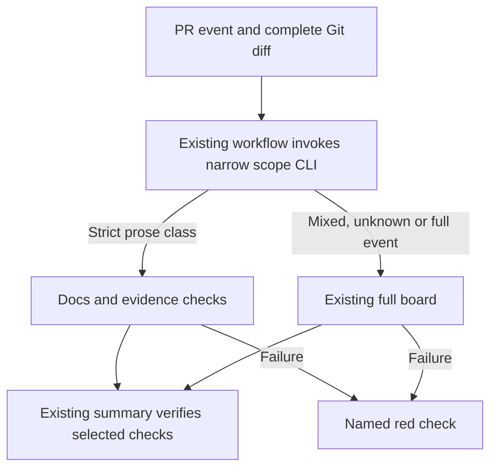

# PRD-364 — Remove repeated verification and bookkeeping from the development loop

**Status:** COMPLETE. Implemented in PR #129 and completed with the CI-summary repair in PR #131.
**Date:** 2026-09-07 (America/Vancouver). **Inspected implementation checkout:** `e430dfc0` (origin/main after PR #131).
**Layer:** repository tooling and contributor policy, not engine or game behavior.
**Complexity: 5 → MEDIUM mode:** more than ten implementation files (+3), multi-package verification (+2).

A developer should be able to change prose or fix one defect without rebuilding the framework repeatedly or repairing unrelated evidence accounting before pushing.

## Decision

The implementation removes redundant executions and arbitrary accounting blockers, then exempts a deliberately narrow class of prose-only PRs from compilation and game matrices. Complete verification remains in place for every executable change, main, nightly and release. No new package, dependency graph framework, performance budget, dashboard, or persistent verification cache was added.

This implementation updates the blanket local gates in root AGENTS.md and the every-PR policy documented in CI. It preserves PRD-303's full template and platform coverage for executable changes, main and nightly, and keeps native parity label conditions independent of the prose exemption.

## Integration ledger

Rows record the completed integration. Line references point to the inspected baseline; the implementation and hosted records below provide the replacement callers and observed controls.

| ID | Changed/new thing | Existing live caller | Replaces | Removal phase | Negative control |
|---|---|---|---|---|---|
| L1 | Evidence report without file/line/duplicate-count rejection | package.json `budgets` → scripts/check-evidence-budget.ts:289 | Small-file and narrative-length blocking thresholds | 1 | Large bytes and tracked generated agent instructions still exit nonzero |
| L2 | Census drift becomes advisory; single manifest freshness call | scripts/check-budgets.ts:462; package.json `budgets` | Census tolerance failure and repeated manifest command | 2 | Stale capability manifest still fails the live budgets command |
| L3 | Bounded pre-push checks | githooks/pre-push → scripts/ci-fast.sh:20 | Whole-workspace typecheck and budget chain on every push | 3 | Deliberate lint error still blocks the hook |
| L4 | Reuse the current invocation's completed build locally | scripts/ci-local.sh:25 → scripts/run-test-suite.sh | Extra test-phase build and build-backed package test scripts | 4 | Remove required dist output and prebuilt execution fails |
| L5 | NEW scripts/ci-change-scope.mjs, internal CLI only | .github/workflows/ci.yml `scope` output → expensive jobs | Unconditional heavyweight jobs for prose-only PRs | 5 | Mixed prose/core change selects full verification |
| L6 | Same narrow scope for native workflow | .github/workflows/native-platforms.yml event → jobs | Native builds for prose-only PRs | 6 | Shared TypeScript or unknown path selects existing native behavior |

## Findings and evidence

### 1. The expensive part is broad execution, not just the budgets job

Read-only `gh run list --workflow ci.yml --limit 8 --json databaseId,conclusion,createdAt,updatedAt,headSha,event` returned eight PR runs. Seven succeeded, one failed. Created-to-updated elapsed time ranges from **6m36s to 12m06s**, median **8m08s** across the eight; these timestamps include orchestration and are not pure execution time. This small sample is not a percentile estimate.

Latest green [run 34068539162](https://github.com/ThreeNativeHQ/threenative/actions/runs/34068539162), head `7b0f0ea7ed1b242c028f7f422df6f9999e070dd9`, was created at 2026-09-07T00:02:19Z and updated at 00:09:48Z (7m29s). `gh run view 34068539162 --json jobs` returned 32 jobs:

| Observed job | Started → completed, UTC | Elapsed |
|---|---|---|
| build | 00:02:23 → 00:03:00 | 37s |
| budgets | 00:03:03 → 00:04:00 | 57s |
| test-native | 00:02:23 → 00:06:41 | 4m18s |
| template-nonvisual (puzzle, 2/2) | 00:05:27 → 00:09:18 | 3m51s |
| run-summary | 00:09:21 → 00:09:47 | 26s |

The late template start is observed; account concurrency as its cause is an inference, not proven by the job API. Removing budgets alone cannot eliminate this critical path. Failed run `34068103200` failed `test-unit (2/3)`; its cause was not investigated and is not classified as bloat.

### 2. The hook repeats mandatory work regardless of changed paths

`githooks/pre-push` invokes `ci-fast.sh`, which serially runs lint, docs, whole-workspace typecheck, the entire budgets chain, agent sync checking and selected scaffold/drift tests. Root instructions independently require typecheck/lint/test before completion. A push repeats checks without knowing whether source changed. Keep the inexpensive drift protection; remove heavyweight mandatory hook execution. Developers retain explicit complete commands, and CI remains authoritative.

### 3. Accounting has become a product-change dependency

`scripts/check-evidence-budget.ts` rejects evidence tree file counts, Markdown length over 1,000 lines and duplicate bytes, alongside useful total-byte limits and detection of generated sweep instructions. `docs/PRDs/AGENTS.md` requires a separate justification commit to raise caps and owner approval for deletion. This can turn adding proof into consolidation work. Retain byte limits (72 MiB verification, 200 MiB benchmark) and generated-instruction protection. Remove file-count, per-file-line and duplicate-byte thresholds as blockers; retain measurements and duplicate inspection tools. Do not delete any evidence as part of this PRD.

`check-budgets.ts:462–478` also fails when the dated native LOC census drifts by more than five lines. Make numeric drift advisory; retain malformed/missing required record checks and native coverage. Framework/native LOC triggers already warn: removing those would not unblock CI.

Historical corroboration, not a current failure claim: [PRD-330](PRD-330-documentation-footprint-reduction.md) records a stale retention-index budget failure and an unrelated pre-push budget failure during documentation cleanup. Retention integrity stays enforced; it needs separate consumer analysis before removal.

### 4. Build and manifest work is repeated through live callers

`ci-local.sh` builds packages before `pnpm test`; `run-test-suite.sh` defaults to `docs,build,package-test,unit`, so it builds again. Standalone package tests for assets, ueformat, raw-unreal and site rebuild; the runner already has `TN_SUITE_PREBUILT=1` and pure-check replacements. Reuse those within one invocation, with a complete root build first. Never trust an arbitrary old dist tree.

`package.json` runs `capabilities:check` in budgets, and `enforceBudgets` calls `capabilityManifestErrors` again. Remove the duplicate root-chain invocation, preserve the standalone command and the enforcement call. Workspace caching, native build caching, unit sharding and template scenario sharding already exist; do not reimplement them.

### 5. Workflow topology is narrow for inert prose and broad for runtime changes

Both workflows trigger for all PRs to main. Native desktop/starter/iOS lanes remain broad; web-reference and parity legs already have PR-label conditions. A core or playtest edit can break native, so a native-directory-only filter is rejected. The implemented exemption covers only Markdown under `docs/PRDs/` and `docs/verification/`, with explicit exclusions below. All other changes run today's board. This targets planning/evidence prose without treating ordinary README/template instructions as inert.

## Scope and success criteria

| Change class | Implemented local completion / PR behavior |
|---|---|
| Strict prose-only class | Docs links, agent mirrors, evidence integrity, relevant docs/evidence contract tests; no build, typecheck, native compilation or game matrix |
| Any executable, config, generated contract, unknown path or uncertain diff | Complete current verification; full local gate before completion |
| main, nightly, release, manual full invocation | Complete existing board; no prose exemption |

Prose classification uses the merge-base diff, including both names of renames and deleted files. Exclude all AGENTS.md/CLAUDE.md, generated retention indices, native census/coverage records and any Markdown read by executable fixtures, parsers or gate inputs. The implementation enumerates those consumers and reuses evidence-citations.ts knowledge; directory citation alone does not prove semantic harmlessness. Unknown consumer classification falls back to full. Empty diff, missing merge base, Git error and malformed inputs select full or fail; never claim an empty run passed.

The one-time acceptance checks were measured, not added as CI timing gates: the final probe runs executed 5 of 17 CI job records and 1 of 8 native job records, with all expensive jobs skipped; the implementation removed the second root build from the full local invocation; and the evidence controls accept above-line/file counts while retaining byte, integrity and generated-input failures. The three hosted probe timings and runner conditions are recorded in [the final hosted proof](../../verification/prd-364-prose-scope-proof-2026-09-07.md). These measurements describe orchestration time and do not promise runtime PR speedups from prose scoping.

No database, API, user-facing UI or data migration. Internal CLI/workflow output is the user interface: print the selected scope, reason, commands run and checks explicitly not applicable.

## Architecture and sequence



```mermaid
sequenceDiagram
    participant Dev as Developer
    participant Hook as Pre-push hook
    participant CI as Existing workflows
    participant Scope as Scope CLI
    Dev->>Hook: Push
    Hook->>Hook: Bounded lint/docs/drift checks
    alt Check fails
        Hook-->>Dev: Exact failing check and log
    else Checks pass
        Hook->>CI: Existing PR event
        CI->>Scope: Event and merge-base diff
        Scope-->>CI: Prose or full with reason
        CI->>CI: Execute selected gates
        CI-->>Dev: Results; unexpected skips fail
    end
```

## Implementation phases

The six phases were implemented in an isolated in-repository worktree, with targeted tests, live-caller checks and independent review recorded in the implementation PR. The final hosted proof below closes the scheduling phases after the CI-summary repair.

### Phase 1 — Adding proof does not require file-count or line-count repairs

**Files:** EDIT scripts/check-evidence-budget.ts (keep hard integrity/bytes, report other measurements), scripts/__tests__/evidence-budget.spec.ts (behavior controls), docs/PRDs/AGENTS.md (remove retired threshold policy), docs/PRDs/CLAUDE.md (generated mirror).

L1 implemented: remove file and duplicate threshold rejection, line-cap enforcement and its exception inventory. Keep exported measurement helpers only where real consumers require them; remove tests solely pinning retired constants. Keep total-byte errors, Git/read failures, generated sweep instruction rejection and canonical duplicate tooling. Existing `pnpm budgets` is the caller; no new command.

Tests covered: `should accept long evidence when total bytes remain within the cap`; `should accept many small files when total bytes remain within the cap`; `should reject evidence when tracked bytes exceed the cap`; `should reject generated sweep instructions when tracked`. Drive the existing CLI against real scratch Git repositories, not just mocked findings.

Observed red/green controls: current code rejects long/many-file fixtures; restoring threshold rejection must reproduce that failure after the change. Oversized and generated-instruction fixtures must still fail after it. Result: stage a qualifying long evidence record and run the evidence checker; see exit 0 with factual measurements.

Evidence: `pnpm exec vitest run scripts/__tests__/evidence-budget.spec.ts`; `pnpm sync:agents`; `pnpm sync:agents --check`; shared full verification below. No evidence deletion and no byte-cap increase.

### Phase 2 — A native edit does not require a LOC census refresh

**Files:** EDIT scripts/check-budgets.ts, scripts/__tests__/budgets.spec.ts, package.json.

L2 implemented: remove nativeCensusDrift from enforceBudgets errors; retain the existing CLI advisory report. Keep nativeCensusErrors and native coverage hard failures. Remove only the redundant `pnpm capabilities:check` entry from the root budgets chain; keep its standalone script and capabilityManifestErrors in enforceBudgets.

Tests covered: `should report census drift without failure when native source line counts change`; `should reject stale capabilities when budgets run`; `should check the capability manifest once when the root budget chain runs`. Record CLI execution/call counts with distinct fixtures rather than comparing strings alone.

Observed red/green controls: current numeric drift fixture fails; restoring enforcement fails it again. Corrupt a public capability entry and observe budgets fail after removing the duplicate command. Result: run `pnpm budgets` after a harmless source-line change; see drift advisory rather than failure solely from line counts.

Evidence: `pnpm exec vitest run scripts/__tests__/budgets.spec.ts`; `pnpm budgets`; `pnpm capabilities:check`; shared full verification.

### Phase 3 — A push stops repeating whole-workspace validation

**Files:** EDIT scripts/ci-fast.sh, githooks/pre-push, AGENTS.md, CLAUDE.md (generated); NEW scripts/__tests__/ci-fast.spec.ts.

L3 implemented: remove typecheck and budgets from the mandatory fast runner; retain lint, docs, agent mirrors and current selected drift tests. Keep truthful hook help and explicit full verification instructions. The root policy documents the narrow prose completion lane alongside the full executable-change gates. Passing the hook alone never proves runtime correctness. No successful-result cache or skip-by-HEAD marker.

Tests covered: `should run bounded checks when the pre-push hook executes`; `should fail the hook when lint fails`; `should not invoke build typecheck or budgets when fast checks run`. Invoke the real hook with a PATH command recorder and failure injection; also execute `pnpm ci:fast` normally.

Observed red/green controls: old runner records typecheck/budgets calls; reintroducing either fails the bounded-execution assertion. Result: `pnpm ci:fast`; see the smaller board and time per check.

Evidence: `pnpm exec vitest run scripts/__tests__/ci-fast.spec.ts`; `pnpm sync:agents`; `pnpm ci:fast`; shared full verification.

### Phase 4 — Full local verification builds once per invocation

**Files:** EDIT scripts/ci-local.sh, scripts/run-test-suite.sh only if existing prebuilt support needs adjustment; NEW scripts/__tests__/ci-local.spec.ts.

L4 implemented: make full ci:local start with `pnpm build` (includes generated files, examples and site), then run the suite with `TN_SUITE_PREBUILT=1 TN_SUITE_PHASES=docs,package-test,unit`. Preserve the explicit core boundary gate. Build failure prevents dependent test execution and produces nonzero exit. `ci:local test` retains standalone building behavior; never select prebuilt solely because a dist folder exists. Unknown local job selection must fail rather than exit 0 without work.

Tests covered: `should build once when the full local board runs`; `should build prerequisites when only test is selected`; `should fail when the prerequisite build fails`; `should reject prebuilt execution when required outputs are missing`. Use a command trace of the real shell runner, then drive the real full local board.

Observed red/green controls: original full board records both its own build and the suite build. Remove a required output after the completed build in an isolated negative run; test must fail loudly. Result: `pnpm ci:local` recorded one preparation build; build, site, typecheck, lint, budgets, benchmark, browser and playtest checks passed, while the local native contract executables were unavailable or stale. Hosted PR #129 native evidence closed that local limitation.

Evidence: `pnpm exec vitest run scripts/__tests__/ci-local.spec.ts`; `pnpm ci:local`; shared full verification. If browser/golden-path steps internally rebuild, record separately; removing those is outside this bounded slice.

### Phase 5 — A prose-only PR skips the game board safely

**Files:** NEW scripts/ci-change-scope.mjs; EDIT .github/workflows/ci.yml, scripts/__tests__/ci-structure.spec.ts, scripts/ci-workflow.ts, scripts/__tests__/ci-needs.spec.ts.

L5 implemented: add a small native-Node scope job (no workspace install), expose its decision as job output and wire the existing expensive jobs to it. Extend the existing graph guard to recognize that exact scheduling prerequisite; do not generally permit coverage jobs to gate other coverage jobs. Run prose docs/evidence assertions in an existing job, with explicit Vitest file selection from the inspected contract consumers. Validate that these commands do not build or launch browsers before calling the lane lightweight. Reuse existing summary/golden-path aggregation and teach their inline decisions to accept only deliberate not-applicable results, never unexpected skipped/failed/cancelled selected jobs. Preserve check names; inspect actual branch protection requirements before changing aggregation behavior.

Tests covered in existing CI suites: `should choose full when shared core changes`; `should choose full when a consumed Markdown record changes`; `should choose full when diff discovery is incomplete`; `should choose prose when only inert PRD text changes`; `should reject unexpected skipped jobs when full scope is selected`. Invoke the actual scope CLI on scratch Git histories, including renames, deletions and mixed changes. Collect the production repository's Markdown reader census before freezing the conservative exclusions.

Observed red/green controls: baseline workflow runs build for a real PRD-only diff. Removing scope conditions restores that behavior and fails the workflow contract. Replacing a valid prose file with a core change selects full. Result: the hosted implementation proof reports docs results, explicit scope reasons and zero expensive jobs executed; the job API records are in the final hosted proof.

Evidence: `pnpm exec vitest run scripts/__tests__/ci-structure.spec.ts scripts/__tests__/ci-needs.spec.ts`; `pnpm check:docs`; `gh run view <actual-prose-run-id> --json jobs`; repeat on mixed/core and main/full events. Shared full verification. Required-check settings and semantic Markdown consumers were verified; unknown or unresolved inputs still select full.

### Phase 6 — Native scheduling shares the proven prose exemption

**Files:** EDIT .github/workflows/native-platforms.yml, scripts/__tests__/ci-structure.spec.ts, docs/PRDs/CI/PRD-303.md (explicit reconciliation of scope policy).

L6 implemented: invoke the same scope CLI and apply its output to currently broad native jobs, composed with existing label/input conditions. Do not widen or remove parity label conditions. Preserve workflow_call, workflow_dispatch (including ios_only), main and scheduled behavior. No separate native-only source classifier. Update PRD-303 to point at this later policy decision without marking its unfinished coverage work complete.

Tests: `should preserve full native scheduling when shared TypeScript changes`; `should omit native compilation when a proven prose-only PR changes`; `should preserve caller and manual input behavior when invoked outside a PR`. Assert all current platform legs and both parity conditions remain represented.

Observed red/green controls: baseline starts broad native jobs on qualifying prose PRs; restoring unconditional scheduling fails the exemption contract. Core/config/unknown-path mutations select full. Result: inspect the same hosted prose PR across both workflows; no native compilation executes. Observe a full-scope run retaining current platform execution/label semantics.

Evidence: `pnpm exec vitest run scripts/__tests__/ci-structure.spec.ts scripts/__tests__/ci-needs.spec.ts`; `gh run view <actual-native-run-id> --json jobs`; shared full verification and independent review. Timing comparison is manual inspection of actual run data, not a new pass/fail service.

## Verification evidence and completion

The implementation ran the prescribed full checks and targeted controls. Local final evidence included the affected suites, strict prose suite (6 files, 123 tests), `pnpm ci:fast` (lint, docs, agents and drift passed), and the full CI run for PR #129. The local native contract limitation is recorded above; hosted native evidence passed all required PR #129 jobs. Hosted evidence also includes the complete job APIs for three final prose probes and their native workflow APIs. Existing gate status/doctor commands remain available; no new evidence framework was added.

| Phase | Required evidence | Current result |
|---|---|---|
| 1–2 | Real budget CLI red/green, retained hard failures, manifest call count | PASS — PR #129 targeted budget/evidence tests and full budgets gate passed |
| 3 | Hook command trace, injected failure, actual fast run | PASS — PR #129 targeted hook tests and local `pnpm ci:fast` passed |
| 4 | Full local command trace, missing-output failure, actual full board | PASS — PR #129 targeted local-runner tests and full hosted board passed |
| 5–6 | Scratch Git classifier controls, hosted prose/full job lists, timing comparisons | PASS — PR #129/131 tests plus three final hosted prose probes passed |
| All | Full prescribed gates and independent phase review | PASS — PR #129 merged after required CI; PR #131 merged after required CI; final proof recorded below |

Implementation evidence: PR #129 merged at [de93a0d9](https://github.com/ThreeNativeHQ/threenative/commit/de93a0d93534d0ddb7dad7958f75e099fa4f78c9) after required CI run [34087093160](https://github.com/ThreeNativeHQ/threenative/actions/runs/34087093160) passed 34/34 jobs; its native evidence run [34087093170](https://github.com/ThreeNativeHQ/threenative/actions/runs/34087093170) passed all 9 jobs. PR #131 repaired the prose performance summary and merged at [e430dfc0](https://github.com/ThreeNativeHQ/threenative/commit/e430dfc0aeea5b21c3177564172637c4e87948fe) after full CI passed. The final three-probe record is [prd-364-prose-scope-proof-2026-09-07.md](../../verification/prd-364-prose-scope-proof-2026-09-07.md).

## Acceptance checklist

- [x] Evidence file/line/duplicate-count and census drift cannot block a change; byte/integrity/capability/native coverage failures still do.
- [x] Pre-push stops invoking full typecheck/budgets; full local verification prepares its root build once and standalone commands still work.
- [x] Proven prose PRs run at least 75% fewer executed CI jobs with zero compile/browser/native calls; executable/unknown changes retain complete applicable coverage.
- [x] Every phase has observed controls, full verification, live wiring and independent review; timing observations identify cache/runner conditions.
- [x] Existing policy and PRD-303 agree with the implemented behavior; no evidence deletion, new timing gate, new dependency or competing verification framework was introduced.
