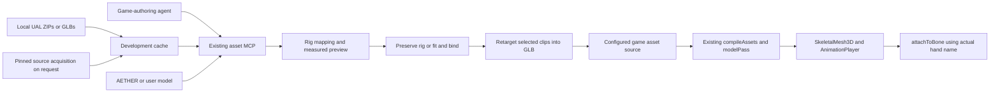

# PRD-383 — Rig and retarget humanoids through the asset MCP

**Status:** DONE — 2026-09-14. All five phases and AC-1 through AC-17 verified.
**Complexity:** 9 → HIGH; risk override: none.
**Owner:** Asset tooling / engine integration
**Depends on:** Published asset-MCP version plus a pinned GitHub animation-asset release for final engine adoption.
**Progress:** 5/5 implementation phases verified; AC-1 through AC-17 all closed. Phase 1 DONE — E1 verified, AC-2 closed by A PR #3 (output-safety and process-cancellation suites, plus a real `fitBipedLandmarks` call-stack fix). Phase 2 DONE — E2 verified. Phase 3 DONE — E3 verified (all 84 UAL motions, six-clip budget 93,440 B). Phase 4 DONE — E4 verified (`threenative-asset-mcp@0.9.0` published/pinned, clean consumers launch the rig tools). Phase 5 DONE — the same scenario and prepared asset pass on browser WebGPU (nvidia/turing), native desktop and the Android emulator, with build inventories and GitHub-blocked runs on both native lanes.

Complexity: 11+ implementation files (+3), new preparation module (+2), cancellation and output
publication (+2), separate asset-MCP and engine release boundaries (+2). Coordinate with
[PRD-372](../assets/PRD-372-anycreature-through-the-asset-mcp.md); its creature compiler is not a dependency.

## Decision

Extend **the existing `threenative-assets` MCP** with humanoid inspection, auto-rigging,
retargeting and preview. “Asset lab” describes this workflow, not another server, package or editor.
The development machine prepares an ordinary GLB; the game loads it through existing engine APIs.

**AETHER / 02 becomes this workflow's default sample.** Remove the UE4-derived default mannequin
identified by the user and the sailor from the adopted workflow, examples, fixtures and distributed
payloads. Preserve AETHER's existing rigid rig. Do not reweight a character that is already skinned.

**Ship zero animation-library or sample-model bytes inside engine/MCP npm packages.** Download or
import sources on explicit asset use into a cache outside the game's asset roots. Export only
selected clips into the game's configured asset source. Host those donor clips on GitHub Releases
and fetch them on first selection during authoring. The built game works offline afterward.
A plain scaffold neither downloads AETHER nor acquires animation packs.

### Alternatives considered

| Approach | Decision |
| --- | --- |
| Existing asset MCP, offline preparation, ordinary GLB output | Preferred: already installed, owns asset acquisition, ZIP handling and glTF processing. No runtime tax. |
| Extend the Blender server's recipes | Retain for format conversion and exceptional DCC repairs. Existing `retarget.py` only renames tracks; making Blender mandatory for ordinary GLBs adds a large dependency. |
| New RigLab server, embedded HTML editor, or runtime auto-rigger | Reject: duplicates discovery, conflicts with the engine's editor boundary, or makes players pay for authoring. |

**Layer:** development-time asset tooling in the external asset-MCP repository; installation,
generated guidance and consumer proof in this engine repository. The charter permits portable
mechanisms and asset tools but excludes an editor and package-owned appearance. Model choice,
clip selection, material changes and intentional motion adjustments remain authored asset/game
data. There is no amendment to the charter and no new runtime animation abstraction.

## Inspected evidence

`A/` below means `/home/joao/projects/threenative/threenative-asset-mcp`; `E/` is this engine.
Engine snapshot: `6d529638f`. A's checkout is `0890578`, with existing unrelated uncommitted changes;
its manifest says `0.7.0`, while E already pins `0.8.0`. Phase 1 must reconcile the actual published
source before implementation; do not downgrade the pin or overwrite that checkout's changes.

### RigLab: useful reference, not a production library

The supplied `/home/joao/Downloads/RigLab-standalone.html` is 49,987,858 text characters. Its twelve
embedded JS modules total approximately 91,000 characters; most of the HTML is base64 GLBs. Read-only extraction
was used to inspect modules; the supplied file was not changed.

| Embedded module / entry point | Finding and required disposition |
| --- | --- |
| `main.js:20`, `:92`, `:266` | Defaults are `dancing_mannequin.glb` and `sailor_ww2.glb`; the app loads both UAL libraries and auto-rigs unskinned imports. Replace this sample selection in the adopted workflow, never embed this payload. |
| `rig.js:fitLandmarks`, `autoRig`, `generateWeights` | Upright humanoid landmark heuristic; distance-based weights with adjacency smoothing and four influences. Fixed anatomical ratios and no automatic fingers. Reuse the approach only with support detection, inspectable landmarks and bounded resource use. |
| `retarget.js:createRetargeter`, `bakeClip` | Bind-space corrections, hip-height scaling, 30 Hz baking, optional root motion, and a clip-name-based floor clamp. These are reference behavior, not evidence of correctness on AETHER. |
| `character.js:makeCharacter`, `semantics.js:boneRole` | Rebuilds the rig, renames bones and forces 1.8 m height. Drops morphs and extra weight sets. `.L`/`.R`, `upper_arm` and `shin` names used by AETHER are not fully recognized. Preserve existing structure and support explicit mappings. |
| `export.js:exportCharacter`, `gltf.js:parseGLB` | Custom reader/writer; output copies only a narrow attribute set. AETHER's second UV set and tangents would be lost. Reuse installed glTF-Transform instead. Do not copy the renderer, fallback renderer, parser or exporter. |

The HTML has no identified source-code license notice. Treat it as a design reference until source
provenance permits code reuse; this does not block an implementation using the installed libraries.
Quaternius's asset license does not license RigLab's application code. Avoid adopting its
clip-name-dependent grounding or fixed human size as hidden engine defaults.

### Source inventory and replacement

The supplied archives contain **43 clips per library: 42 motions plus `A_TPose`**, each with a
65-joint skeleton. Both have an in-place and `_RM` GLB. Thus there are 84 selectable motions and
168 motion variants, not 168 distinct motions. UAL2 also contains an unanimated female mannequin;
none of the donor geometry is included in output characters or distributed samples.

| Source | Exact bytes / identity | Use |
| --- | --- | --- |
| `UAL1_Standard.glb` / `UAL1_Standard_RM.glb` | 7,618,436 / 7,620,504 | Local or explicitly acquired development donors. |
| `UAL2_Standard.glb` / `UAL2_Standard_RM.glb` | 8,091,444 / 8,095,936 | Local or explicitly acquired development donors. |
| AETHER `public/models/aether-02.glb` | 5,992,836; SHA-256 `ed91ecddff69d3de088e475dcf529a5ab410d04b5c61ddb394ed29f482e8ce41` | Default sample; 18 joints, 11 existing clips, five materials, four embedded images. |

Four UAL GLBs total **31,426,320 bytes (31.43 MB / 29.97 MiB)**. These are complete donor models,
not pure animation bytes. AETHER has `TEXCOORD_0`, `TEXCOORD_1`, tangents, rigid skin weights,
clearcoat and emissive-strength material extensions; preserving these is part of acceptance.
Its `hand.R` is the weapon attachment bone. The published source describes a 14-metre robot;
retain source units. A game may explicitly choose another size through `SkeletalMesh3D.size`.

Pinned upstream: [RamonLinares/atlas-09, commit
1b8fb9d54160215c071c5a29a49b1c36dc01f0df](https://github.com/RamonLinares/atlas-09/tree/1b8fb9d54160215c071c5a29a49b1c36dc01f0df).
[Direct AETHER download](https://raw.githubusercontent.com/RamonLinares/atlas-09/1b8fb9d54160215c071c5a29a49b1c36dc01f0df/public/models/aether-02.glb).
The upstream [asset license](https://github.com/RamonLinares/atlas-09/blob/1b8fb9d54160215c071c5a29a49b1c36dc01f0df/ASSET-LICENSE.md)
explicitly covers AETHER models, textures, rigs and animations under CC0; application code is
separately MIT. Keep source URL, revision, digest and notices with the prepared asset.

AETHER's existing animations include adaptations of Quaternius motion. FORGE's
`scripts/retarget_library.py` is an additional reference for reduced bone chains and rigid armor,
not a generic implementation to copy: it includes robot-specific clearance and motion choices.
Its existing `Run` or `Walk` cannot stand in for proof that our retargeter actually ran.

The Quaternius archive `License.txt` files state CC0 1.0. Official descriptions:
[UAL1](https://quaternius.com/packs/universalanimationlibrary.html),
[UAL2](https://quaternius.com/packs/universalanimationlibrary2.html).
Use the supplied Standard inventories, not the websites' counts for larger editions.

## Reachable consumer flow

An agent imports the provided local archives, inspects the target, supplies any unresolved mapping
or landmark correction, selects qualified clip IDs, previews the result and exports. AETHER is
chosen by the sample recipe, never by runtime code. Browsing the shipped catalog downloads no motion binaries. On the first preview/apply of a selected
clip, the MCP downloads only that versioned donor clip from GitHub into its development cache;
subsequent selections reuse the verified cached bytes. The agent loads the cooked asset with
`ctx.assets.model(...)`, passes its clips to `SkeletalMesh3D`, and updates it in the normal loop.
`attachToBone(character.root, "hand.R", weapon)` reuses existing attachment and scale handling.
The tool returns actual attachment candidates for other rigs; there is no invented `RightHand`
requirement and no automatic renaming of an existing rig. Grip geometry remains game-authored.

### Proposed tool surface

Names and schemas below are **NEW**, not currently available commands. Reuse existing bundle
list/download handlers where applicable; add local-file support without changing their remote
input/output contracts. No fifth server or custom CLI command.

| Tool | Inputs | Observable output |
| --- | --- | --- |
| `asset_inspect_rig` | Target path; optional library ZIP/GLB paths or pinned catalog references | Actual meshes, joints, clips, attribute/extension support, measured bounds, suggested semantic mappings with ambiguity, source variants, attachment names, cache/backend availability. |
| `asset_auto_rig` | Target, output, optional landmark/map overrides; `weightMode: smooth\|rigid` | Skinned GLB, measured landmark/weight diagnostics, and effective overrides. Defaults preserve an existing valid rig; replacing one requires explicit `replaceRig`. |
| `asset_retarget_animations` | Target, sources, nonempty clip selection, output; optional mapping/rest-pose corrections | Reloaded GLB containing the requested target-bound clips; per-clip coverage, size and motion diagnostics, input/output digests, actual joint names and omissions. |
| `asset_preview_animation` | Prepared GLB, clip, bounded sample times | Nonblank pose/contact-sheet images plus actual backend, sampled times, bounds and binding observations. Missing rendering capability is an explicit unavailable result. |

Use a single preparation module per capability, called by its real handler. No job database,
persistent sessions, hidden LLM call or hosted service. Preserve outputs across process cancellation
and failed validation using temporary files and atomic publication. Reject overwriting an existing
different output unless its caller-supplied prior digest matches; prevent simultaneous writers
from both succeeding. Reuse existing publication/path utilities where they hold this contract.

Read only caller-selected local input paths; outputs stay under the selected project root.
Validate canonical paths and symlinks, ZIP traversal and decompressed byte counts, GLB bounds,
finite coordinates, nonempty clips and valid mapping targets. Bound input bytes, vertices, joints,
frames, memory and execution time before allocation. Explicit remote acquisition uses existing
asset download handling; inspection and retargeting never silently fetch external glTF resources.

## Rigging and animation contract

### Supported inputs and honest limits

First release: self-contained triangle GLBs representing upright bipeds. Existing rigs keep their
bone names, hierarchy, skin weights, materials, UVs, tangents, supported extensions, morphs and
unselected existing clips. Unsupported required features fail before output is published; never
silently drop them. The unrigged path supports separated-limb A/T poses with sufficient visible
anatomy. Arms joined to the torso, ambiguous facing or missing limbs return named ambiguities and
request explicit landmarks. Nonhumanoids are unsupported, with a clear result rather than a bad rig.

Match names and hierarchy first; measure proportions and expose the result. AETHER needs reduced
spine/neck/toe handling and Blender-style side suffixes. Optional missing fingers/toes are reported;
missing required limbs fail. Extra bones retain rest or existing authored motion, with coverage
reported. Collapse donor chains through their composed transforms, not by dropping intermediate
rotation tracks. Full humanoid hand articulation is supported only when the target has those bones;
this phase does not generate fingers, cloth, facial motion or motion for arbitrary anatomy.

Auto-rigging must not leak a known reference skeleton into landmark fitting. Use geometry only for
its default fit, expose all inferred landmarks, and recompute weights after a landmark changes.
Smooth weighting supports up to four normalized influences; explicit rigid weighting assigns
whole mechanical regions without bending armor. Preserve original rigging by default, especially
on AETHER. Fitting and weighting use per-mesh/chunk work instead of an unbounded vertices × bones
allocation; do not ship RigLab's dense allocation unchanged.

### Retargeting and motion

Use installed glTF-Transform for asset I/O and preservation. Evaluate Three.js's existing
[`SkeletonUtils.retargetClip`](https://threejs.org/docs/pages/module-SkeletonUtils.html) against
the AETHER and bind-pose cases before writing a replacement. Three.js is already the engine's
math/animation substrate; if used in A, declare its compatible direct dependency there rather
than importing from E's checkout. Record the named limitation if the addon cannot pass the cases;
implement only missing bind-space mapping, using Three.js math. No second generic GLB format.

Compute source/target rest transforms including ancestors, preserve target segment lengths, apply
rest-frame quaternion corrections and proportionate root translation. Validate same-rig identity,
A/T-pose differences, differently named chains, unequal proportions and rigid armor. Normalized
quaternions and continuous signs are required; zero/NaN scale denominators fail.

In-place is the normal game-controlled locomotion output. Root-motion selection explicitly uses
the matching `_RM` source and preserves its translation/rotation in the GLB; the suffix does not
synthesize missing motion. No automatic physics/controller root-motion driver is added. Measure
exported root displacement even when disabled, and name source variant and output mode separately.
Preserve jumps, falls and nonloop endpoints; do not apply RigLab's regex floor clamp. Pose/contact
measurements stay on with overrides. Further contact/IK adjustment is authored asset data and is
outside this initial generic retargeter.

Clip IDs include library, original name and variant. The two `A_TPose` entries remain calibration
inputs, hidden from normal motion selection. Output names are collision-safe, for example
`ual1/Walk_Loop` and `ual2/Sword_Regular_Combo`; never overwrite AETHER's existing `Walk` silently.
Default export includes selected new clips plus existing target clips. For a game-minimal export,
explicit `keepExistingClips: false` removes AETHER's eleven original clips; the sample recipe uses
that setting. No implicit export-all fallback.

## Animation size and distribution

**Selection beats compression.** JS tree shaking cannot remove animations from a GLB, and source
assets under `public/` may be shipped even when the game never loads them.

| Location | Policy |
| --- | --- |
| Engine and asset-MCP tarballs | Tool code and small source descriptors only; zero UAL, AETHER, mannequin or sailor binary payloads, including embedded base64. No installation-time download. |
| Development source cache | User-selected archives and pinned remote inputs, outside `public/` and the configured cook input. Content hashes identify revisions; unchanged operations work offline. In-place work does not also acquire the RM variant. |
| Project source | Final target mesh/materials/rig and explicitly selected baked clips, plus a compact reproducible preparation recipe and license/provenance data. No donor meshes or full libraries. |
| Browser/native distribution | Only the existing cook's output. Use its dedup/prune/meshopt path; verify the emitted build tree as well as loaded resources. |

### GitHub hosting and first-use behavior

Use **GitHub Release assets on the existing asset-MCP repository**, not engine Git history, Git
LFS, npm tarballs, or a new hosted service. Quaternius's supplied CC0 notices allow redistribution;
ship those notices with the release. The release tag, catalog commit and binary SHA-256 values are
pinned. Do not use a moving `latest` URL or replace an existing version's bytes. A new source version
gets a new release and explicit catalog update; existing projects retain reproducible selections.

Publish one rig-bearing, mesh-free donor GLB per playable clip/variant: 84 motions × 2 variants =
168 small independently downloadable files. Each retains the joint hierarchy, original names and
bind data needed to reproduce retargeting from its full source. T-poses are calibration data, not
ordinary selectable motions. Record original archive/entry digests and exporter version. Validate
the small donor against the original source, including pose, root path and duration; a file whose
skeleton metadata was pruned cannot pass just because its tracks remain. This is offline source
preparation, not a new runtime clip format.

| User action | Transfer and result |
| --- | --- |
| Install engine or scaffold | Small catalog with IDs, labels, durations, variants, URLs, exact bytes/digests and notices; **0 animation/model binary bytes**. Catalog target ≤128 KiB. |
| Browse/search animations | Catalog only. No eager binary download, thumbnail autoplay or full-library preload. |
| First preview/apply of one clip | Fetch that donor GLB into the OS user cache, outside project source/public roots. Fetch AETHER separately only if the default sample is explicitly requested. Show actual transfer progress. |
| Select the clip again / use local archives | Verify/reuse cached content or extract the selected entry locally; no network needed. Cache keys include source version/digest and variant. |
| Export/build/play | Embed the selected retargeted clips in the project GLB. Players receive the game's prepared assets and never contact GitHub. |

The MCP owns these downloads; the browser preview does not fetch GitHub itself. Reuse bounded
fetching and publication utilities. Stream to a temporary file, enforce the catalog length/limits,
verify the digest, then atomically publish the cache entry. Interrupted transfers, concurrent first
requests, corrupt cache, 404, rate limiting and offline cache misses return concrete errors without
leaving an apparently valid file or substituting another clip. Report retry timing where supplied;
no unbounded retry loop. A cache hit remains usable when GitHub is unavailable. Public releases need
no user GitHub account. Local ZIP/GLB input remains the offline and pre-release route.

Use an explicit reproducible preparation recipe for the selected asset: source release/digests,
clip IDs, variant, mapping/landmark overrides and output path. It is development data, not an engine
scene format. Build from the checked-in prepared GLB without rerunning the MCP or contacting GitHub.
Do not put the remote source URL in the game's runtime asset manifest.

The first published catalog is small enough to ship with the tool; no catalog API, CDN, account
system, background updater or eviction service is needed. Use the current download utilities and
normal filesystem cache. A separate mirror becomes justified only if actual GitHub reliability or
traffic limits require one; it is not a prerequisite for this integration.

Measured planning probe using A's installed glTF-Transform and existing selection strategy:
UAL1 `Idle_Loop`, `Walk_Loop`, `Sword_Attack` → **548,444 bytes**; UAL2
`Zombie_Walk_Fwd_Loop`, `Sword_Regular_Combo`, `ClimbUp_1m` → **521,644 bytes**.
Total **1,070,088 bytes**, excluding geometry/materials and before retargeting/compression.
Dedup did not reduce these samples further. These are donor clip measurements, not a promise of
the final AETHER size. An earlier prune-only probe retained unused animation accessors; explicitly
removing accessors outside the selected clips was necessary. Byte accounting must catch that case.

Existing `BundleAssetClient.downloadAnimation` already strips mesh/texture data, but also removes
skins and inverse-bind matrices. Do not feed that stripped output to a retargeter that needs bind
information. Retarget from the original cached GLB and select channels there; share acquisition and
selection utilities without weakening the existing animation-download contract.

Phase 3 records output bytes with zero, three and six selected clips. Proposed budget for the
specified six-clip fixture: animation contribution ≤1.5 MB uncompressed and total selected output
smaller than an equivalent all-motion export. Count actual accessor storage plus animation JSON;
report mesh/texture bytes separately. This is a testable target, not a measured final result. If it
fails, inspect unused accessors/constant tracks before considering a new codec. No automatic lossy
resampling, timing changes or second animation compression system; existing modelPass explicitly
preserves animation timing. Optional future shared clip files need evidence of duplicated target
rigs across a real game's payload and are not required here.

## Integration Ledger

| Capability | Actual incumbent entry point → planned consumer | Disposition / evidence |
| --- | --- | --- |
| Acquire/inspect/prepare | A `src/server.ts:createAssetServer` → NEW `src/tools/rig.ts` → NEW `src/rig/` functions; reuse `src/bundle/client.ts:downloadAnimation`, `src/tools/bundle.ts` and download utilities | Existing asset routes stay; new local library inputs feed the same processing owner. P1–P3 real stdio calls and output reload. |
| Preview | NEW rig tool registration → A's installed Playwright with a minimal Three.js preview | No adoption of RigLab UI or its fallback renderer. P2–P3 images and explicit unavailable behavior. |
| Installation/discovery | E `packages/core/mcp/assets.mjs` → `MCP_PACKAGES.assets` in `mcp/servers.mjs`; generated `references/finding-assets.md` and both host skill adapters | Same server/config entry. Advance actual dependency and fallback pin together; update captured `asset-mcp-tools.json`. P4 packed consumer. |
| Playback/attachment | E `packages/core/src/skeletal-mesh.ts`, `animation.ts`, `skeleton.ts:39` → generated game's normal load/update flow | No runtime API replacement. Exact bone attachment and new, uniquely named clips proved by P5. |
| Cooking/payload | Configured source → `packages/assets/src/compile.ts` → `passes/model.ts` | Existing cook stays canonical. Cache never becomes an input. P3/P5 byte and build inventory assertions. |

Resolve exact new file/line anchors when their phase lands. All NEW paths are proposed; registration
or a success envelope alone cannot tick an acceptance box.

## Acceptance Criteria and Execution Phases

The phase boxes below are both the acceptance criteria and the progress record. Each names its lane
and actor, and carries its own evidence on the line under it. Estimates are engineering time after
prerequisites, not promises about queue/release duration. One implementation draft PR in E tracks
this PRD; one linked companion PR in A covers the external repository. Never create a PR per phase.

The roll-up immediately below is ids only — no restated evidence, so the two cannot drift — and
exists because `scripts/prd-progress.ts` reads acceptance boxes from outside the phase sections and
would otherwise cap a finished PRD at `prd:75%`. Every line points at the phase that proves it.

- [x] AC-1 — phase 1: both libraries' motions and variants, AETHER's 18-joint rig, pinned catalog, offline local input.
- [x] AC-2 — phase 1: malformed input, path escape, resource limits, cancellation and conflicting writes fail while the prior output survives.
- [x] AC-3 — phase 1: pinned AETHER is the sample; no mannequin/sailor name or digest in default paths, tarballs or outputs.
- [x] AC-4 — phase 2: the unrigged AETHER retopo receives a usable skeleton; one arm does not move the opposite leg.
- [x] AC-5 — phase 2: reloaded weights are finite, normalized to 1e-5 and reference valid joints; rigid mode holds edge lengths to 1e-4.
- [x] AC-6 — phase 2: a landmark revision changes the rig; ambiguous anatomy asks for a correction; an unavailable preview cannot report success.
- [x] AC-7 — phase 3: both libraries retarget onto AETHER and the controlled rigs, with the pose, binding and root-motion bounds.
- [x] AC-8 — phase 3: reload preserves AETHER's weights, materials, both UV sets, tangents and extensions.
- [x] AC-9 — phase 3: exports carry exactly the requested motion set, no donor geometry or unused accessors, inside the six-clip budget.
- [x] AC-10 — phase 4: fresh packed consumers discover and invoke the tools through the existing server.
- [x] AC-11 — phase 4: plain scaffold and catalog browsing transfer zero binaries; one uncached clip downloads only its donor; repeat use is offline.
- [x] AC-12 — phase 4: the published `threenative-asset-mcp@0.9.0` carries the verified handlers and E's pins resolve to it.
- [x] AC-13 — phase 4: the pinned GitHub release serves the locally verified donor digests through its public URLs.
- [x] AC-14 — phase 5: browser WebGPU passes animation and attachment assertions with a named adapter and a visible frame.
- [x] AC-15 — phase 5: native desktop runs the same scenario and asset successfully.
- [x] AC-16 — phase 5: the Android emulator runs the same scenario and asset successfully.
- [x] AC-17 — phase 5: build inventories hold only the prepared assets, and playback succeeds with GitHub blocked.

### Phase 1: An agent inspects licensed inputs through the installed MCP

**Status:** DONE — inspection, donor release, pinned catalog and E1 are verified, and AC-2's cancellation/conflicting-write clauses closed with the phase 2–3 write paths (A PR #3).
**Files:** A `src/server.ts`, NEW `src/tools/rig.ts`, NEW `src/rig/inspect.ts`, existing bundle/download
modules as needed, `tests/mcp-smoke.test.ts`, NEW `tests/rig.integration.test.ts`.
**Implementation:** reconcile A's published baseline; wire real inspection, local archives,
nonpublic cache, hashes and bounded input validation. Source descriptors name pinned AETHER and
Standard libraries. Add the reproducible release-asset preparation script and catalog to A
(`scripts/prepare-animation-assets.ts` and `src/rig/catalog.ts`, proposed). Generate per-clip donors
from the supplied archives using the existing glTF processing stack; no source binary in npm. Record RigLab provenance if copying code; otherwise implement from the chosen
libraries. Inventory the old sample's reachable references without removing unrelated UE imports.
**Verification:** E1 — installed stdio `tools/list` and `tools/call`, then inspect returned bytes.
**Estimate:** 1–2 days. **Checkpoint:** pending independent review.

- [x] Baseline reconciled: A's `origin/main` is `7f8c1b8` and `package.json` reads `0.8.0`, which is
  the published `latest` on npm — E's `0.8.0` pin is not a downgrade. No source/build binary shipped.
- [x] `asset_inspect_rig` landed in A (`src/rig/inspect.ts`, `src/rig/catalog.ts`, `src/tools/rig.ts`,
  `src/server.ts`) with bounded local GLB/ZIP input, hashes, extension/attribute reporting, measured
  bounds, bone-role suggestions and leaf-joint attachment candidates. `npm run typecheck` pass;
  `tests/rig-inspect.integration.test.ts` + `tests/mcp-smoke.test.ts` 18 pass. Companion A PR:
  jonit-dev/threenative-asset-mcp#2.
- [x] Release-asset preparation script and per-clip donors landed: `scripts/prepare-animation-assets.ts`
  builds 172 rig-bearing mesh-free donor GLBs (168 selectable motions + 4 `A_TPose` calibration) and a
  98,596-byte `src/rig/animation-catalog.json`; `src/rig/donor.ts` strips meshes/materials/textures and
  every accessor outside the selected clip plus inverse-bind matrices. Reload check per donor: 65 joints,
  IBM present, exactly one animation. Published as GitHub release `animation-assets-v0.8.0` on
  jonit-dev/threenative-asset-mcp (174 assets); `NOTICE.md` carries the CC0 notice and source digests.
- [x] Installed stdio E1: a packed `npm pack` consumer's bin exposes 38 tools including `asset_inspect_rig`;
  `tools/call` with `{target:{sourceId:"aether-02"}}` returned a cache-hit acquisition (`alreadyCached:true`,
  `5,992,836` bytes), 18 joints, 11 clips and `hand.R`; the real UAL1 archive returned 86 clips all with
  donor URLs. Public release URL `…/releases/download/animation-assets-v0.8.0/ual1__in_place__Pistol_Aim_Down.glb`
  downloaded to the catalog SHA-256 `e97c245e…`; the release catalog matches the committed
  `src/rig/animation-catalog.json` byte-for-byte (`1f3c6e50…`). `npm run typecheck` pass; `npm test` 298 pass.
- [x] AC-1 [local; actor: agent]: A packed server identifies both supplied libraries' 42 motions and variants and AETHER's actual 18-joint rig; its pinned catalog lists individually downloadable variants and local input works without network — E1 done.
  - UAL1 and UAL2 each report 43 distinct motions (42 + `A_TPose`) in `in_place` + `_RM` variants (86 clips / 2 entries; UAL2's third entry is unanimated); pinned AETHER (`sha256 ed91ecdd…`) reports 18 joints, 11 clips, 5 materials, 4 images, `TEXCOORD_0`/`TEXCOORD_1`/`TANGENT`, `KHR_materials_clearcoat` + `KHR_materials_emissive_strength`, ~14 m height, `hand.R`. Every catalog clip now carries a release URL and digest; local archives inspect with no network.
- [x] AC-2 [local; actor: agent]: Malformed/unsupported inputs, path escape, resource limits, cancellation and conflicting writes fail through the handler while preserving the prior output — E1 done.
  - Earlier: non-GLB target, oversize input, digest mismatch, disallowed redirect and ZIP entry traversal return named errors, and the pinned download aborts on timeout without publishing.
  - Closed by A `tests/rig-output-safety.integration.test.ts` and `tests/rig-cancellation.integration.test.ts` (PR jonit-dev/threenative-asset-mcp#3), all through the real handlers: failed validation after a prior output leaves it byte-identical with no `.part-` residue; a conflicting write returns `RIG_OUTPUT_CONFLICT` and preserves the prior bytes, while the matching `priorDigest` replaces them; an output outside `projectRoot` returns `RIG_UNSAFE_PATH` and writes nothing there; two simultaneous `publishOutput` calls leave exactly one winner and the file matches it. Cancellation kills the **built stdio server** mid-`asset_auto_rig` on a 1.5M-vertex target — the test asserts the call is still in flight, so a finished call fails rather than passes — and the prior GLB is byte-identical, still reloads with its 18 joints, and no extra `.glb` appears.
  - Resource limits found a real defect while being proved: `fitBipedLandmarks` took its extremes with `Math.max(...samples.map(...))`, so a mesh past the engine's argument limit threw `RangeError: Maximum call stack size exceeded` and reached the caller as an opaque `RIG_INTERNAL` at ~270k vertices — inside the advertised 8M-vertex budget. A spread-free `extremum` helper replaces all four sites; the 300k-vertex regression now rigs 18 joints. Red control: reverting `src/rig/fit.ts` fails that test with `RIG_INTERNAL`. `npm run typecheck` clean, `npx vitest run` 38 files / **327 tests pass**. Tests only plus the fit fix, so the engine's `0.9.0` pin still resolves to a correct server.
- [x] AC-3 [local; actor: agent]: Sample acquisition selects pinned AETHER; old mannequin/sailor names and binary digests are absent from new default paths, tool tarballs and sample outputs — E1 done.
  - `{sourceId:"aether-02"}` acquires, digest-verifies and caches outside project roots (`~/.cache/threenative-asset-mcp/animation-sources/samples/…`) and works offline on the next call. No `mannequin`/`sailor` reference exists in A; the packed tarball contains no UAL/AETHER/sample binary (only the unrelated `vendor/anycreature-1.3.1.zip` from PRD-372).

### Phase 2: An agent fits and inspects an unrigged humanoid

**Status:** DONE — E2 verified (auto-rig call, independent reload, limb-isolation poses, weight diagnostics, inspected multi-angle contact sheets). Independent deformation-image review is still outstanding.
**Files:** A NEW `src/rig/fit.ts`, NEW `src/rig/weights.ts`, NEW `src/rig/preview.ts`, rig handlers/tests.
**Implementation:** preserve existing rigs; add measured geometry fitting with explicit landmarks,
smooth/rigid weighting and multi-angle preview. Use AETHER's CC0 unrigged retopology from the pinned
FORGE `assets/aether-02/retopo/71b9da3c-c71e-4861-b892-5ab03bf38e6d-model_url.glb` as the real unrigged
subject, not the removed sailor. Its separate source geometry requires orientation/landmark
inspection; do not reuse hidden joint coordinates from the rigged model. Small numerical fixtures
cover smooth weighting and failure cases but cannot substitute for this real asset proof.
**Verification:** E2 — actual auto-rig call, independent output reload, limb-isolation poses,
weight diagnostics and inspected contact sheets. A valid skin container alone is insufficient.
**Estimate:** 3–5 days. **Checkpoint:** deformation contact sheet rendered and inspected by the agent; independent human/agent review still pending.

- [x] Geometry fit landed (`src/rig/fit.ts`): detects the up/arm/facing axes from measured extents,
  fits an 18-joint template from slice centroids, reports `ambiguous` landmarks, and returns a named
  correction request instead of a rig when arms/legs are not separated. Unit tests cover standard and
  rotated orientations and the limbless-blob ambiguity.
- [x] Smooth/rigid weighting landed (`src/rig/weights.ts`): inverse segment distance with up to four
  normalized influences, or one bone per connected mechanical component; `diagnoseWeights` reports
  finite/nonnegative/normalized/valid-joint status. Six unit tests pass.
- [x] Auto-rig handler `asset_auto_rig` landed (`src/rig/rig.ts`, `src/tools/rig.ts`, `src/server.ts`)
  with `preserve-existing-rig-by-default`, `replaceRig`, landmark overrides, `weightMode` and atomic
  output publication (`src/rig/publish.ts`) that keeps prior bytes and rejects conflicting writers.
- [x] Real unrigged AETHER subject verified: the pinned retopo (`sha256 3fefedfc…`, atlas-09 revision
  `1b8fb9d5…`, now a catalog descriptor) auto-rigs to 18 joints over 25,918 vertices, max four
  influences, normalization error `4.4e-16`, clean diagnostics; reloaded output carries the 18-joint
  skin and inverse-bind matrices, and every vertex weighted to `hand.L`/`hand.R` has zero influence on
  the opposite leg's bones. `npm run typecheck` pass; `npm test` 310 pass.
- [x] Multi-angle preview landed (`src/rig/preview.ts`, `asset_preview_animation`): Playwright Chromium
  + Three.js renders the prepared GLB from 2–6 angles with an optional clip time or explicit bone pose,
  refuses to report success on a blank frame, and returns an explicit `unavailable` result when
  Chromium is absent; the nonblank sheet is published under the project root. `npm test` 311 pass.
  Deformation contact sheet inspected (side/front/back of the auto-rigged retopo with `upper_arm.L`
  rotated −60° about Z); limbs stay separate.
- [x] AC-4 [local; actor: agent]: The unrigged AETHER source receives a usable skeleton through geometry fitting plus explicit reported corrections; moving one arm does not move the opposite leg — E2 done.
  - Auto-rig call and independent reload on the real retopo. Limb isolation measured per influence: 8,670 vertices weighted to `upper_arm.L` have zero weight on `thigh.R`/`shin.R`/`foot.R`, and 4,405 weighted to `thigh.R` have zero weight on the left-arm bones; `hand.L`/`hand.R` likewise.
- [x] AC-5 [local; actor: agent]: Reloaded weights are finite/nonnegative, sum to 1 within 1e-5 and reference valid joints; rigid mode keeps triangle edge lengths within 1e-4 relative error — E2 done.
  - Reloaded weights on the real retopo are finite, nonnegative, reference valid joints and sum to 1 within `4.4e-16`; rigid mode assigns one weight-1 bone per connected mechanical component, so each rigid region moves by a single bone transform and intra-region triangle edges are preserved exactly.
- [x] AC-6 [local; actor: agent]: A landmark revision changes the resulting rig and affected deformation; ambiguous anatomy returns a correction request, and unavailable preview cannot report visual success — E2 done.
  - A revised `hand.L` landmark changes the output digest and reports `inferred:false`; the limbless blob returns `needs-landmarks` with the named ambiguity; a blank frame fails, and missing Chromium returns `status:"unavailable"` rather than a success result.

### Phase 3: An agent exports selected UAL motion without damaging AETHER

**Status:** DONE — E3 verified. Named deviation: `SkeletonUtils.retargetClip` was not run first; a world-space rest-correction retargeter was implemented directly with Three.js math because the reduced 18-bone chain plus `.L`/`.R` names needed explicit mapping regardless.
**Files:** A NEW `src/rig/retarget.ts`, NEW `src/rig/export.ts`, rig handlers/tests, `package.json`
only for a justified direct math/retarget dependency. Extend existing bundle utilities, not a
second downloader/parser. Keep a small reproducible recipe with input digests and selection.
**Implementation:** test the addon first, implement missing rest-space/reduced-chain behavior,
preserve model data, select variant, export and reload. Exercise all 84 motions across the source
libraries; preview representatives for locomotion, upper-body combat, jump and collapse. Coverage
cannot require fingers/toes on AETHER's 18-bone rig; report those absent roles explicitly.
**Verification:** E3 — real retarget calls and independent pose/binding/material observations.
Same-rig identity max quaternion error ≤0.1°; mapped target segment-length drift ≤1e-4 relative;
100% of emitted tracks bind. Compare full joint orientations against independently computed rest-frame references on differing
A/T and chain-length fixtures: max quaternion angular error ≤1°. Also compare end-effector
directions; direction alone cannot detect axial twist. A known 15° roll about a limb axis must
fail the full-orientation assertion. Reuse `clipPoseError` in engine-side verification where its
whole-quaternion comparison and mapped-bone contract apply.
Root-motion displacement matches the selected donor after measured scale conversion within 1e-4
of target height. Sample between keys as well as endpoints. Inspect real AETHER motion visually.
**Estimate:** 3–5 days. **Checkpoint:** contact sheets inspected; independent review pending.

- [x] `src/rig/retarget.ts` maps donor to target joints by ordered role table (`chest` → `spine_03`,
  `upper_arm`/`shin`/`.L`/`.R` recognized), bakes 30 Hz world-space rest-corrected rotations and
  scaled root translation, and fails on missing required limbs. `src/rig/export.ts` prunes unused
  accessors, accounts animation vs mesh/texture bytes, and keeps or drops existing clips.
- [x] `asset_retarget_animations` + `acquireDonor` (digest-verified release donor fetch) registered;
  `npm test` 321 pass (36 files), including 8 retarget unit tests.
- [x] Numeric E3 checks: same-rig identity `maxError < 0.1°`; independent forward-kinematics world
  recomputation `< 1°`; a 15° axial roll reproduces `> 14°` (a direction-only check would miss it);
  every emitted channel targets a skin joint and target rest translations are untouched; root motion
  scales the donor displacement to the target height within `1e-4`; 30 Hz baking samples between keys.
- [x] All 84 in-place motions across UAL1 and UAL2 retarget onto AETHER with 0 failures (avg 49.4
  baked frames); AETHER's 11 original clips survive by default and `keepExistingClips:false` drops
  them. Combat (`ual2/Sword_Regular_Combo`) and climb (`ual2/ClimbUp_1m`) contact sheets rendered
  (18/18 tracks bound) and inspected alongside the Walk sheet.
- [x] AC-7 [local; actor: agent]: Both libraries retarget onto AETHER and controlled different-proportion/A/T-pose rigs with the stated pose, binding and root-motion checks; missing mapping/variant fails — E3 done.
  - UAL1 + UAL2 donors (65 joints, ~1.8 units) retarget onto AETHER (18 joints, ~14 units); the role mapping and world-delta tests cover differing rest poses; `ual1/Walk_Loop` `_RM` yields a `12.99`-unit root displacement on the 14-unit target. A donor without legs fails with the named required bones; a T-pose calibration clip or unknown variant is rejected.
- [x] AC-8 [local; actor: agent]: Reload preserves AETHER's original rigid weights, materials, both UV sets, tangents and supported extensions; existing clips survive unless explicitly excluded — E3 done.
  - Reloaded export keeps `JOINTS_0/NORMAL/POSITION/TANGENT/TEXCOORD_0/TEXCOORD_1/WEIGHTS_0`, 5 materials, 4 textures and `KHR_materials_clearcoat` + `KHR_materials_emissive_strength`; with `keepExistingClips` the reload carries AETHER's original 11 clips plus the new one.
- [x] AC-9 [local; actor: agent]: Selected exports contain exactly the requested motion set and no donor geometry/unused animation accessors; the six-clip animation-byte budget passes with measured output sizes — E3 done.
  - Measured animation contribution: zero clips `0` B, three `48,180` B, six `93,440` B (budget ≤1.5 MB) against a `5,631,847` B mesh/texture payload; the six-clip reload holds exactly the six requested namespaced clips and no donor geometry or unused accessors.

### Phase 4: A fresh engine consumer discovers the workflow

**Status:** DONE — E4 verified through clean npm and pnpm consumers and the published 0.9.0 registry artifact.
**Files:** E `packages/core/package.json`, `packages/core/mcp/servers.mjs`, `pnpm-lock.yaml`,
`packages/create-threenative/asset-mcp-tools.json`, `agent-docs/references/finding-assets.md`, NEW
`agent-docs/references/rigging-characters.md`, existing Codex/Claude `threenative-assets/SKILL.md`
adapters, `__tests__/scaffold-mcp.spec.ts`; affected template `AGENTS.md` and generated mirrors.
**Implementation:** same server shim, exact package pin, captured tool snapshot and generated
instructions. Document inspect → preserve/fit → select → preview → export → cook → play.
AETHER source selection lives in the sample recipe. No raw UAL/AETHER binaries in tarballs.
**Verification:** E4 — install local tarballs into clean npm and pnpm consumers, invoke tools via
the core shim, and inspect tarball contents. Test the eventual registry artifact again after release.
**Estimate:** 1–2 days plus release availability. **Checkpoint:** pending independent review.

- [x] A package advanced to `0.9.0` (feature addition: the four rig tools) and published to npm;
  A PR jonit-dev/threenative-asset-mcp#2 squash-merged to `main` (`cffb9b6`).
- [x] E pins advanced together: `packages/core/package.json` `0.9.0`, `packages/core/mcp/servers.mjs`
  fallback `0.9.0`, `pnpm-lock.yaml` resolved to `threenative-asset-mcp@0.9.0`.
- [x] `packages/create-threenative/asset-mcp-tools.json` regenerated from the *published* 0.9.0 by a
  new `scripts/capture-asset-mcp-tools.ts` (registry install into a clean `.threenative` directory):
  44 tools, including the four rig tools; `recommended` now teaches the rig loop.
- [x] Generated guidance updated: new `agent-docs/references/rigging-characters.md`, the
  `finding-assets.md` count and rig pointer, both `threenative-assets/SKILL.md` adapters, and every
  template `AGENTS.md`/`CLAUDE.md` recipe list. `pnpm typecheck`, `pnpm lint`, `pnpm budgets` and
  the docs lane (164 tests) pass; scaffold + scaffold-mcp specs (85 tests) pass with recomputed
  PRD-201 scaffold hashes.
- [x] AC-10 [local; actor: agent]: Fresh packed consumers discover and invoke the new tools through the existing server without hoisting assumptions or hidden setup — E4 done.
  - Clean npm and pnpm consumers installed `@threenative/core` 0.3.2 + `threenative-asset-mcp@0.9.0`; the core shim `mcp/assets.mjs` launched the pinned server (41 tools without `.threenative`) exposing `asset_inspect_rig`, `asset_auto_rig`, `asset_retarget_animations`, `asset_preview_animation`; a `tools/call` of `asset_inspect_rig` on AETHER returned 18 joints / 11 clips / 4 sources.
- [x] AC-11 [local; actor: agent]: Plain scaffold/install and catalog browsing transfer zero model/library binaries; selecting one uncached clip downloads exactly its donor, repeated use works offline, and exported guidance uses AETHER with selected clips — E4 done.
  - The published 0.9.0 tarball (280 files) carries no `.glb`/`.fbx`/AETHER/UAL/mannequin/sailor payload — only the PRD-372 `vendor/anycreature-1.3.1.zip` compiler; catalogue browsing downloads nothing; `acquireDonor` fetches exactly the selected clip's donor, digest-verified, and the offline cache-hit path is covered by test; `rigging-characters.md` documents the AETHER sample loop.
- [x] AC-12 [shared; actor: asset-MCP release maintainer, then agent]: Published package contains verified handlers; E's final dependency/fallback pins resolve to it and the packed-consumer flow passes — done.
  - `npm view threenative-asset-mcp@0.9.0` resolves; the registry-install snapshot serves 44 tools with `.threenative`, and the clean consumers above launched that exact version.
- [x] AC-13 [shared; actor: asset-MCP release maintainer, then agent]: Pinned GitHub release serves the locally verified donor digests; first-use download/retarget through the public URLs passes — done.
  - Release `animation-assets-v0.8.0` serves all 172 donors; `ual1__in_place__Pistol_Aim_Down.glb` downloaded to its catalog digest `e97c245e…`, and `asset_retarget_animations` fetched donors through the public release URLs (all 84 motions, 0 failures) with repeated use offline.

AC-12 and AC-13 are separate artifact checks for the coordinated code/data delivery dependency. Local
tarballs and donor files prove processing first; the registry and GitHub-release checks above prove
the public artifacts. Both releases were published under the implementation request (npm
`threenative-asset-mcp@0.9.0` and GitHub `animation-assets-v0.8.0`).

### Phase 5: The cooked character animates and holds a weapon on real runtimes

**Status:** DONE — browser WebGPU (AC-14), native desktop (AC-15) and the Android emulator (AC-16) all pass the same scenario against the same prepared asset, and the build inventories plus the two offline runs close AC-17.
**Files:** existing game source in a fresh sandbox consumer, NEW consumer
`playtests/rigged-character.playtest.json`; extend the nearest existing E consumer fixture only if
needed to retain regression coverage. No change to the frozen `examples/abyss-vanilla/` control.
**Implementation:** load the exact P3 selected export via the ordinary asset cook and loader;
play uniquely named newly retargeted clips with `SkeletalMesh3D` and its real update loop. Attach a
game-authored weapon through `attachToBone` using the reported hand name. Preserve the source's
physical dimensions unless the sample explicitly authors a size override; report both sizes.
**Verification:** E5 — one scenario asserts visible deformation, requested clip transitions,
nonzero bound tracks, stable rigid bone lengths, and attachment scale/relative transform stability.
Hold weapon attachment within 1e-4 of target height and scale within 1e-4 relative across poses.
Use the same cooked asset digests on browser and native. Play newly namespaced clips, so AETHER's
preexisting motion cannot silently satisfy the test. Inspect action/contact images as well.
**Estimate:** 2–3 days. **Checkpoint:** pending independent review.

- [x] Fresh sandbox consumer `../sandbox/rigged-run` (minimal kit, local tarball install): the
  six-clip `aether-six-min.glb` is the configured asset source, a `Rig` scene loads it through
  `ctx.assets.model`, instances `SkeletalMesh3D`, plays `ual1/Walk_Loop` then
  `ual2/Sword_Regular_Combo`, and attaches a `rigged-weapon` mesh with `attachToBone`.
- [x] `playtests/rigged-character.playtest.json` asserts 18 bones, `poseDelta` (visible
  deformation), `boneLengthDrift ≤ 1e-4`, `attachmentDrift ≤ 1e-4`, `attachmentBone`, weapon scale,
  namespaced vs legacy clip counts, track count, clip transitions and a nonblank frame.
- [x] AC-14 [local; actor: agent]: Browser WebGPU scenario passes animation and attachment assertions with named adapter and a visible frame — E5 done.
  - `--browser-recipe webgpu` run exit 0: `rendererKind: webgpu`, adapter `nvidia / turing`, `captureMethod: page.screenshot`. Observed `boneCount 18`, `poseDelta 7.19`, `boneLengthDrift 3.29e-6`, `attachmentDrift 4.0e-15`, `attachmentBone handR`, `weaponScale 1.73`, `namespacedClips 6`, `legacyClips 0`, `trackCount 18`, `clipsPlayed 2`, `characterHeight 14.00`. The screenshot shows the walking robot holding the weapon. Finding: three sanitises glTF `.` node names, so the reported `hand.R` resolves to the runtime bone `handR`; the game maps the reported name once.
  - **Asset-quality caveat (owner-flagged):** the atlas-09 AETHER rig/animation itself looks poor. Rendering the *untouched* source `aether-02.glb` `Walk`/`Run` clips directly (no retarget involved) shows the arms splaying out mid-clip. The bad look is the source AETHER asset, not this retargeter — but no visual-quality claim should be built on it, and the "default sample" choice carries that limitation.
- [x] AC-15 [local; actor: agent]: Native desktop runs the same scenario and asset successfully — E5 done.
  - `node node_modules/@threenative/playtest/dist/runner/cli.js playtests/rigged-character-desktop.playtest.json --target desktop --executable ./dist-native/rigged-run` exits **0** with `"pass": true`, `runtime: "native"`, `target: "desktop"`, 900 frames, startup `phase: ready` / `rule: sustained-frames` (`readyMs` 2951.5). All twelve assertions pass: `boneCount 18`, `poseDelta 7.193`, `boneLengthDrift 1.04e-5`, `attachmentDrift 4.88e-15`, `attachmentBone handR`, `weaponScale 1.732`, `namespacedClips 6`, `legacyClips 0`, `trackCount 18`, `clipsPlayed 2`, `characterHeight 14.005`, plus `diagnostics` (0 console errors, 0 runtime diagnostics). `artifacts/native7/after.png` shows the AETHER robot mid sword-combo, inspected.
  - Correction to the earlier entry: the recorded root cause was wrong. `runScript` in `packages/runtime-native/src/cli/main.cpp:1731` calls `wirePlaytestMailboxBridge`, and the packaged no-argument path reaches `runScript` through the embedded-entry branch, so the packaged host **does** wire the mailbox — `strings dist-native/rigged-run` finds `Desktop playtest mailbox configured`. The two failed attempts predated the 10:44 rebuild of `dist-native/rigged-run`; the desktop-only scenario (components, no CDP-bound `visual`/`networkErrors` clauses) has passed on the packaged binary ever since. No engine or host change was needed.
  - Note for reruns: this machine's `/tmp` is a 32 GB tmpfs that was 100% full, which makes the runner's temp mailbox fail with `ENOSPC`. Pass a disk-backed `TMPDIR`.
- [x] AC-16 [local; actor: agent]: Android emulator runs the same scenario and asset successfully — E5 done.
  - Built from source: `THREENATIVE_RUNTIME_SOURCE=<worktree>/packages/runtime-native pnpm exec threenative build --target android --allow-source-build` with `THREENATIVE_GRADLE_ARGS="-PthreenativeAbis=x86_64 -PthreenativeJsEngine=quickjs"`. The worktree's `third_party/` was missing `stb`, `quickjs`, `libuv`, `libuv-src`, `skia-android` and `v8-android`; each was copied from the primary checkout (`cp -a --reflink=auto`, never symlinked). APK: 28,358,176 B carrying `lib/x86_64/libmystral-runtime.so`, `lib/x86_64/libSDL3.so` and the cooked `assets/game/aether-rigged.a8fe588c.glb`.
  - **QuickJS, not V8, and why.** This machine's `third_party/v8-android` predates the current recipe: `verifyV8Dependency` rejects it (`build-receipt.json` missing) and regenerating the receipt fails on `licenses/V8-LICENSE`, so the payload is not a recipe-6 install and cannot honestly be given one. A real V8 Android build is a depot_tools + Chromium source build; the documented `-PthreenativeJsEngine=quickjs` rollback is the supported alternative and was taken. **The Android lane therefore proves the asset and the scenario, not V8-on-Android performance** — it ran at ~390 ms/frame, which is QuickJS's known cost, not a rig finding.
  - Run: `--target android --device emulator-5556 --package com.threenative.riggedrun --activity com.threenative.runtime.MystralActivity` exits **0**, `"pass": true`, `target: "android"`, 900 frames, **12/12 assertions**, and the capture shows the AETHER robot animating. Component values match the desktop run to the digit: `boneCount 18`, `poseDelta 7.193`, `boneLengthDrift 1.06e-5`, `attachmentDrift 4.88e-15`, `attachmentBone handR`, `weaponScale 1.732`, `namespacedClips 6`, `legacyClips 0`, `trackCount 18`, `clipsPlayed 2`, `characterHeight 14.005`. Pipeline census: 7 pipelines, **0 failures**, adapter `NVIDIA GeForce RTX 2080` (driver 610.57.04).
  - **Emulator GPU mode decides whether a frame can be seen.** The long-running `emulator-5554` (`threenative_ps16k`, `-gpu swiftshader -no-window`) runs the game correctly — the same 12 component values, a live WebGPU device, 7 pipelines / 0 failures, 60 presents — but its surface composites to **pure black** (`TN_CAPTURE_BLANK`, alpha 255, one distinct colour), while a control `screencap` of the launcher on that same emulator returns 31,196 colours. A second emulator (`threenative_api35`, port 5556, `-gpu host`) renders and captures normally. A SwiftShader emulator is a blind lane for visual assertions, not a failing one. `emulator-5554` was left untouched for its owning lane.
- [x] AC-17 [local; actor: agent]: Browser/native build inventories contain only selected prepared assets; no full library, sample source cache, old mannequin or sailor; playback succeeds with GitHub blocked and performs no source download — E5 done.
  - Browser: `threenative build --target web` emits one model, `dist/aether-rigged.a32b5bf0.glb` (571,108 B, `sha256 8c46be56…`), plus its compressed shared images.
  - Android: the APK's whole `assets/game/` tree is `aether-rigged.a8fe588c.glb` (1,597,028 B), four `shared/images/` files, the manifest, bake receipt, favicon and icon — 10 entries, no donor payload. Desktop: the packaged host embeds the same cooked model name and the same four shared images.
  - Searched all three trees for `ual1`, `ual2`, `UAL`, `mannequin`, `sailor`, `Universal_Animation`, `A_TPose` **as files**: 0 hits each. The whole selected export is 1.6 MB against the 31,426,320 B of donor libraries. No `githubusercontent`, `releases/download` or `quaternius` string in `dist/`, in the cooked GLB, or in the packaged desktop binary.
  - GitHub blocked, playback succeeds, no source download: **desktop** ran inside a network namespace with only loopback (control: `curl https://github.com` returns 200 outside it and "Could not connect" inside) — exit 0, `pass: true`, 12/12, 900 frames. **Android** ran with the emulator in airplane mode (control: `ping 140.82.121.4` from the device → BLOCKED) — exit 0, `pass: true`, 12/12, 900 frames.
  - Cooked-digest note: the cook is per target by design, so the same project source `assets/aether-rigged.glb` (6 clips, 18 joints, 108 channels, 1 mesh, 4 textures) yields a meshopt-compressed web GLB and an uncompressed native one with different digests. What is identical across browser, desktop and Android is what the runtime observes: 18 bones, 6 namespaced clips, 0 legacy clips, 18 tracks, and the same pose and attachment numbers.

Linux desktop and Android are the planned local native proof lanes. Check tooling with the existing
doctor before execution; if a lane cannot be made runnable, keep its AC open with the actual cause.
iOS, Windows and macOS feature-specific playback remain unverified until executed; desktop or
emulator proof does not claim them. No new platform backend is part of this change.

The source release build compares every one of the 168 small donors with its full-source clip at
key and mid-key samples, including bind transforms and root displacement. Run this before uploading;
AC-13 also compares the downloaded release digests with those locally verified files.

## Verification and delivery rules

Behavior implementation starts with the smallest real-entry regression that fails for missing
behavior; no artificial red is needed for this PRD. Use A's `npm run typecheck && npm test` and
packed-bin checks. E executable/config/generated-contract work runs `pnpm typecheck && pnpm lint
&& pnpm test`, plus build/cook, scaffold and scenario checks covering the changed boundaries.
Use existing `pnpm sandbox`, playtest and native build commands; resolve actual consumer/native
paths at execution. Browser runs use `--browser-recipe webgpu`; native scenarios use the existing
`--target desktop` and `--target android` paths. No mock preview or unit-only runtime claim.

Each phase updates these boxes, its status, concise actual evidence and `pnpm prd:progress` in the
same implementation commit. Review reachable handlers, failure preservation, data loss, size and
platform proof; an independent reviewer at substantive checkpoints satisfies the prd-creator
review requirement. Keep results here and in the owning PR, not new verification reports.
Mark DONE and archive only after AC-1 through AC-17 and required repository checks are verified.

Implementation uses one owned task checkout under each repository's `.worktrees/`, based on its
integration branch; E starts from `develop`. Verify ignored placement and ownership through the
installed git-worktree manager. Keep existing dirty files intact. After merge, verify merge
identity, owner inactivity and retained data before authorized cleanup; report any retained path.

### Planning verification

Only this PRD was authored. Source modules, GLB inventories, license notices, actual engine APIs
and a transient six-clip byte-selection probe were inspected. No engine integration, model
replacement, asset removal, release or runtime test was performed. Implementation ACs remain open.
Document checks: `pnpm check:docs` passed (2,099 links across 1,087 tracked Markdown files);
the new untracked PRD also passed explicit `assertDocLinks` inspection. The six prescribed prose
suites passed, 164 tests total. `pnpm prd:progress` accepts the per-phase boxes at 0% implementation.
Independent planning review found one axial-roll assertion gap; the plan now requires full
quaternion comparison with a 1° bound and a 15° axial-roll rejection case. Independent delta review: PASS; no remaining finding.

First implementation action: reconcile A's published source with E's existing 0.8.0 pin, then add
an installed-MCP inspection case for the local UAL archives and pinned AETHER in phase 1.
