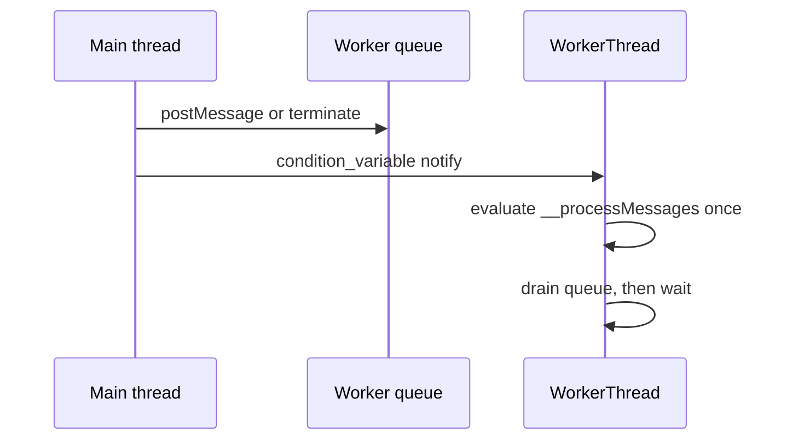

# P2-1 — Wake native workers instead of polling JavaScript

Complexity: 7 → HIGH mode

## Context

`packages/runtime-native/src/workers/worker_thread.cpp:366-380` evaluates
`__processMessages()` and sleeps for 1 ms even when the input queue is empty. The same file
already has `inCondition_`, and `postMessage()`/`terminate()` already notify it. This is a native
runtime problem: idle workers waste CPU and battery, and the fix must preserve prompt message
delivery and shutdown ordering for every JS engine.

## Solution

- Make the worker's idle transition block on the existing condition variable.
- Keep message draining in JavaScript so the Web Worker contract is unchanged.
- Wake on input, termination, and any future native async-work signal; never use a periodic poll as
  the correctness path.
- Measure idle wakeups and first-message latency for one and multiple workers without changing the
  public Web Worker API.

Data changes: none.

## Integration Ledger

| # | New thing | Live caller (`file:line`, non-test) | Replaces | Old path removed? | Negative control |
|---|---|---|---|---|---|
| 1 | Blocking idle wait for native workers | `packages/runtime-native/src/workers/worker_registry.cpp:37` creates `WorkerThread`; `worker_thread.cpp:366` runs it | 1 ms polling loop | polling sleep deleted | Restoring the 1 ms loop makes the idle-wakeup gate fail |
| 2 | Worker wake/latency evidence | `packages/runtime-native/src/workers/worker_registry.cpp:50` routes `postToWorker` | unmeasured idle behavior | new measurement is additive | Removing the wakeup assertion makes the latency gate fail |

## 4. Execution Phases

### Phase 1: Characterize the real worker lifecycle

**Files (4):**

- `packages/runtime-native/src/workers/worker_thread.cpp` - EDIT: add observable wait/wake instrumentation and characterize the real loop.
- `packages/runtime-native/include/mystral/workers/worker_thread.h` - EDIT: declare the minimal testable wait-state contract without exposing it to JS.
- `packages/runtime-native/tests/worker-idle.test.mjs` - NEW: source/build-level regression harness for idle wakeups, message delivery, and termination.
- `packages/runtime-native/tests/native-platform-workflow.test.mjs` - EDIT: include the worker test in the native workflow census.

**Implementation:**

- [x] Record the baseline idle wake count and first-message latency with one and multiple workers.
- [x] Add a fail-closed assertion that an idle worker is waiting, not repeatedly evaluating JS.
- [x] Verify termination wakes and joins a blocked worker.

**Wiring:**

- [x] Caller edited: `worker_registry.cpp:37` continues to create the instrumented worker.
- [x] Registration: the existing `WorkerRegistry` owns wake and termination notifications.
- [x] Old path: the periodic idle poll is removed in the next phase.
- [x] Ledger rows filled: 1–2.

**Tests Required:**

| Test File | Test Name | Assertion | Negative control (must be observed red) |
|---|---|---|---|
| `packages/runtime-native/tests/worker-idle.test.mjs` | `should block an idle worker until a message arrives` | idle wake count stays bounded and the message is delivered | Restore the 1 ms loop; `pnpm exec vitest run --config vitest.config.ts packages/runtime-native/tests/worker-idle.test.mjs` returns non-zero with `RED observed: idle wake bound exceeded` |

**Revert check:**

- Disable the wait path; the pre-existing worker workflow test must fail on the wakeup bound.

**Verification Plan:** run the focused worker suite, the runtime-native Vitest suite, the native
build, and a controlled one/many-worker latency report. Record CPU and wake counts, not only a
green assertion.

**User Verification:**

- Action: run a desktop bundle that creates an idle Worker, waits 500 ms, then posts one message.
- Expected: the worker responds promptly, idle CPU is near zero, and termination returns cleanly.

### Phase 2: Ship the blocking loop on every native engine

**Files (3):**

- `packages/runtime-native/src/workers/worker_thread.cpp` - EDIT: wait when queues and async work are empty and wake on every completion source.
- `packages/runtime-native/include/mystral/workers/worker_thread.h` - EDIT: keep synchronization ownership explicit and race-free.
- `packages/runtime-native/tests/worker-idle.test.mjs` - EDIT: assert message latency and shutdown for one and multiple workers.

**Implementation:**

- [x] Replace the unconditional 1 ms sleep with a predicate wait.
- [x] Preserve queue draining, error delivery, `close()`, and destructor join behavior.
- [x] Prove no lost wake occurs between the empty-queue check and wait.

**Wiring:**

- [x] Caller edited: `WorkerThread::threadMain()` is the production path used by `WorkerRegistry`.
- [x] Registration: `postMessage()` and `terminate()` notify the same condition variable.
- [x] Old path: no unconditional idle sleep remains.
- [x] Ledger rows filled: 1–2.

**Tests Required:**

| Test File | Test Name | Assertion | Negative control (must be observed red) |
|---|---|---|---|
| `packages/runtime-native/tests/worker-idle.test.mjs` | `should deliver and terminate multiple blocked workers` | all responses arrive and all joins finish within the bound | Remove the termination notify; command returns non-zero with `RED observed: worker join timeout` |

**Revert check:** restore the polling loop and run the same test; its idle-wakeup assertion fails.

**Verification Plan:** run `pnpm typecheck`, `pnpm lint`, `pnpm test`, `pnpm native:build`, the
focused worker suite, and the native desktop worker scenario. A platform not executed is reported
unverified.

**User Verification:**

- Action: run the same worker scenario on desktop and Android when the device lane is available.
- Expected: identical message and termination behavior with a lower idle wake count.

## Negative Controls

| Gate | Negative control | Expected red | Exact command/result |
|---|---|---|---|
| worker idle gate | restore the 1 ms polling loop | idle wake bound is exceeded | `command (cwd packages/runtime-native/): pnpm exec vitest run --config vitest.config.ts tests/worker-idle.test.mjs`; result: `Error: RED observed: idle wake bound exceeded — threadMain restored a periodic idle sleep`; exit: 1 |
| worker shutdown gate | remove termination notification | blocked worker does not join | `command (cwd packages/runtime-native/): pnpm exec vitest run --config vitest.config.ts tests/worker-idle.test.mjs`; result: `Error: RED observed: worker join timeout — terminate() does not notify the idle wait before joining`; exit: 1 |

## Results — 2026-08-21

Executed on **desktop Linux, V8 13.1.201.22** (the desktop host default engine). Android and
iOS were **not** executed; they remain unverified targets for this change.

Full record: `docs/verification/worker-wake-2026-08-21.md`. Summary:

- **Baseline (1 ms poll)**: 459–471 JS evaluations per worker in a 500 ms idle window
  (~940/s ≈ 1 kHz), first-message latency 147–968 µs, terminate→join ≤ 3 ms for 4 workers.
  **After (predicate wait)**: 0–2 evaluations per window, exactly one blocking wake per
  posted message, latency 89–893 µs, all four workers echo correctly and join in ≤ 1 ms;
  process CPU over a 2 s idle window dropped from ~32 ms user to ~9 ms.
- **Harness**: the worker sources are not compiled into the host binary (no CMake source
  list contains them), so measurements ran through a standalone binary built from the same
  sources with the host's exact Release compile flags and link inputs (`libmystral-runtime.a`
  + `libv8_monolith.a`, …). `pnpm native:build` passed but compiles none of these files.
- **Negative controls**: both mutations applied, observed red with the exact strings above,
  then restored; focused suite green again afterwards.
- **Gates**: focused suite PASS (source + runtime arms); runtime-native Vitest PASS (49
  files, 329 passed / 30 skipped); `pnpm native:build` PASS; `pnpm census` run (78,406 →
  78,618, diff left uncommitted). `pnpm typecheck`, `pnpm lint` and root `pnpm test` failed
  only in files under concurrent edit by other lanes (`packages/playtest/__tests__/scenario.spec.ts`,
  `packages/create-threenative/src/threenative.ts`, `scripts/__tests__/primary-docs.spec.ts`,
  and missing `@situation` tags on the playtest lane's new exports) — no failure originates
  from this PRD's files.
- **Pre-existing findings recorded, out of scope**: (1) V8 init is not thread-safe here —
  an unguarded `g_initialized` plus first-isolate-on-main-thread code-table reservation means
  a standalone `WorkerRegistry` starting workers before any main-thread engine segfaults;
  the host's boot ordering avoids it. (2) A top-level `throw` in worker code delivers no
  ERROR message because engine `eval()` reports success — identical at HEAD, so unchanged by
  this PRD.

## Acceptance Criteria

- [x] An idle native worker does not evaluate JavaScript at a 1 kHz cadence.
- [x] A posted message wakes the worker and reaches `onmessage` within the measured bound.
- [x] `terminate()` wakes and joins every blocked worker without a leak or deadlock.
- [x] One and multiple workers pass on the executed native target; unexecuted targets are named.
- [x] The public Web Worker contract and existing output-message behavior remain unchanged.
- [x] Integration Ledger has no pending caller, and both negative controls were observed red.

## Checkpoint Protocol

After each phase record the exact focused command, observed-red mutation, idle wake count, first
message latency, worker count, target, and clean-shutdown result. A green-only checkpoint or an
unmeasured target is UNVERIFIED and blocks delivery.
