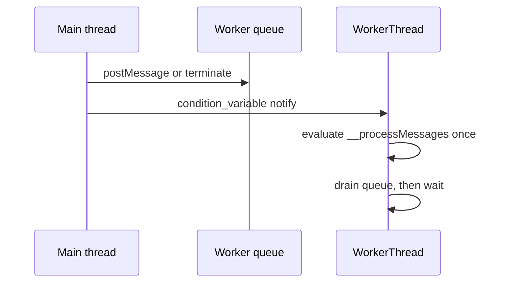

# P2-1 — Wake native workers instead of polling JavaScript

Complexity: 7 → HIGH mode

## Context

`packages/runtime-native/src/workers/worker_thread.cpp:366-380` evaluates
`__processMessages()` and sleeps for 1 ms even when the input queue is empty. The same file
already has `inCondition_`, and `postMessage()`/`terminate()` already notify it. This is a native
runtime problem: idle workers waste CPU and battery, and the fix must preserve prompt message
delivery and shutdown ordering for every JS engine.

## Solution

- Make the worker's idle transition block on the existing condition variable.
- Keep message draining in JavaScript so the Web Worker contract is unchanged.
- Wake on input, termination, and any future native async-work signal; never use a periodic poll as
  the correctness path.
- Measure idle wakeups and first-message latency for one and multiple workers without changing the
  public Web Worker API.

Data changes: none.

## Integration Ledger

| # | New thing | Live caller (`file:line`, non-test) | Replaces | Old path removed? | Negative control |
|---|---|---|---|---|---|
| 1 | Blocking idle wait for native workers | `packages/runtime-native/src/workers/worker_registry.cpp:37` creates `WorkerThread`; `worker_thread.cpp:366` runs it | 1 ms polling loop | polling sleep deleted | Restoring the 1 ms loop makes the idle-wakeup gate fail |
| 2 | Worker wake/latency evidence | `packages/runtime-native/src/workers/worker_registry.cpp:50` routes `postToWorker` | unmeasured idle behavior | new measurement is additive | Removing the wakeup assertion makes the latency gate fail |

## 4. Execution Phases

### Phase 1: Characterize the real worker lifecycle

**Files (4):**

- `packages/runtime-native/src/workers/worker_thread.cpp` - EDIT: add observable wait/wake instrumentation and characterize the real loop.
- `packages/runtime-native/include/mystral/workers/worker_thread.h` - EDIT: declare the minimal testable wait-state contract without exposing it to JS.
- `packages/runtime-native/tests/worker-idle.test.mjs` - NEW: source/build-level regression harness for idle wakeups, message delivery, and termination.
- `packages/runtime-native/tests/native-platform-workflow.test.mjs` - EDIT: include the worker test in the native workflow census.

**Implementation:**

- [ ] Record the baseline idle wake count and first-message latency with one and multiple workers.
- [ ] Add a fail-closed assertion that an idle worker is waiting, not repeatedly evaluating JS.
- [ ] Verify termination wakes and joins a blocked worker.

**Wiring:**

- [ ] Caller edited: `worker_registry.cpp:37` continues to create the instrumented worker.
- [ ] Registration: the existing `WorkerRegistry` owns wake and termination notifications.
- [ ] Old path: the periodic idle poll is removed in the next phase.
- [ ] Ledger rows filled: 1–2.

**Tests Required:**

| Test File | Test Name | Assertion | Negative control (must be observed red) |
|---|---|---|---|
| `packages/runtime-native/tests/worker-idle.test.mjs` | `should block an idle worker until a message arrives` | idle wake count stays bounded and the message is delivered | Restore the 1 ms loop; `pnpm exec vitest run --config vitest.config.ts packages/runtime-native/tests/worker-idle.test.mjs` returns non-zero with `RED observed: idle wake bound exceeded` |

**Revert check:**

- Disable the wait path; the pre-existing worker workflow test must fail on the wakeup bound.

**Verification Plan:** run the focused worker suite, the runtime-native Vitest suite, the native
build, and a controlled one/many-worker latency report. Record CPU and wake counts, not only a
green assertion.

**User Verification:**

- Action: run a desktop bundle that creates an idle Worker, waits 500 ms, then posts one message.
- Expected: the worker responds promptly, idle CPU is near zero, and termination returns cleanly.

### Phase 2: Ship the blocking loop on every native engine

**Files (3):**

- `packages/runtime-native/src/workers/worker_thread.cpp` - EDIT: wait when queues and async work are empty and wake on every completion source.
- `packages/runtime-native/include/mystral/workers/worker_thread.h` - EDIT: keep synchronization ownership explicit and race-free.
- `packages/runtime-native/tests/worker-idle.test.mjs` - EDIT: assert message latency and shutdown for one and multiple workers.

**Implementation:**

- [ ] Replace the unconditional 1 ms sleep with a predicate wait.
- [ ] Preserve queue draining, error delivery, `close()`, and destructor join behavior.
- [ ] Prove no lost wake occurs between the empty-queue check and wait.

**Wiring:**

- [ ] Caller edited: `WorkerThread::threadMain()` is the production path used by `WorkerRegistry`.
- [ ] Registration: `postMessage()` and `terminate()` notify the same condition variable.
- [ ] Old path: no unconditional idle sleep remains.
- [ ] Ledger rows filled: 1–2.

**Tests Required:**

| Test File | Test Name | Assertion | Negative control (must be observed red) |
|---|---|---|---|
| `packages/runtime-native/tests/worker-idle.test.mjs` | `should deliver and terminate multiple blocked workers` | all responses arrive and all joins finish within the bound | Remove the termination notify; command returns non-zero with `RED observed: worker join timeout` |

**Revert check:** restore the polling loop and run the same test; its idle-wakeup assertion fails.

**Verification Plan:** run `pnpm typecheck`, `pnpm lint`, `pnpm test`, `pnpm native:build`, the
focused worker suite, and the native desktop worker scenario. A platform not executed is reported
unverified.

**User Verification:**

- Action: run the same worker scenario on desktop and Android when the device lane is available.
- Expected: identical message and termination behavior with a lower idle wake count.

## Negative Controls

| Gate | Negative control | Expected red | Exact command/result |
|---|---|---|---|
| worker idle gate | restore the 1 ms polling loop | idle wake bound is exceeded | `command: pnpm exec vitest run --config vitest.config.ts packages/runtime-native/tests/worker-idle.test.mjs`; result: RED observed: idle wake bound exceeded; exit: 1 |
| worker shutdown gate | remove termination notification | blocked worker does not join | `command: pnpm exec vitest run --config vitest.config.ts packages/runtime-native/tests/worker-idle.test.mjs`; result: RED observed: worker join timeout; exit: 1 |

## Acceptance Criteria

- [ ] An idle native worker does not evaluate JavaScript at a 1 kHz cadence.
- [ ] A posted message wakes the worker and reaches `onmessage` within the measured bound.
- [ ] `terminate()` wakes and joins every blocked worker without a leak or deadlock.
- [ ] One and multiple workers pass on the executed native target; unexecuted targets are named.
- [ ] The public Web Worker contract and existing output-message behavior remain unchanged.
- [ ] Integration Ledger has no pending caller, and both negative controls were observed red.

## Checkpoint Protocol

After each phase record the exact focused command, observed-red mutation, idle wake count, first
message latency, worker count, target, and clean-shutdown result. A green-only checkpoint or an
unmeasured target is UNVERIFIED and blocks delivery.
