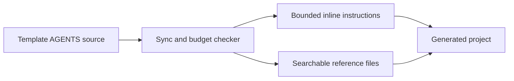

# P2-2 — Bound cold-agent instruction payloads

Complexity: 7 → HIGH mode

## Context

The seven generated template `AGENTS.md` files repeat a large shared block, then mirror it into
`CLAUDE.md`. `scripts/sync-agent-docs.ts:159-179` intentionally expands shared fragments into
each template, so every cold game agent pays the full payload before it can use the capability
manifest. The framework already has searchable capability discovery and `packages/create-threenative`
already owns the generated instructions.

## Solution

- Keep the mandatory first-use path, platform constraints, and fail-closed rules inline.
- Move long recipes and reference tables into searchable generated reference files with stable links.
- Add a measured word budget for every generated `AGENTS.md`, mirrored consistently into `CLAUDE.md`.
- Fail the scaffold gate when a template exceeds its budget or contains a broken reference.
- Preserve placeholder replacement and the generated-docs contract.

Data changes: none; generated reference Markdown is shipped with the template.

## Integration Ledger

| # | New thing | Live caller (`file:line`, non-test) | Replaces | Old path removed? | Negative control |
|---|---|---|---|---|---|
| 1 | Template instruction word-budget checker | `packages/create-threenative/src/index.ts:180` copies template instruction files | unbounded generated payload | old unbounded path becomes budgeted | Add a large fragment; the scaffold gate must fail |
| 2 | Searchable template reference bundle | `packages/create-threenative/src/index.ts:180` copies template files | duplicated long inline recipes | long recipes moved or reduced in the same phase | Remove a reference file; scaffold discovery check must fail |
| 3 | Budgeted generated mirror | `scripts/sync-agent-docs.ts:159` expands and mirrors `AGENTS.md` | unconstrained `CLAUDE.md` duplication | mirror remains, but is bounded | Change `AGENTS.md` without sync; `pnpm sync:agents --check` must fail |

## 4. Execution Phases

### Phase 1: Measure and define the payload contract

**Files (4):**

- `scripts/instruction-budget.ts` - NEW: count words, classify mandatory sections, and validate reference links.
- `scripts/__tests__/instruction-budget.spec.ts` - NEW: red/green tests for limits, links, and generated mirrors.
- `packages/create-threenative/__tests__/template.spec.ts` - EDIT: assert every shipped template is within budget.
- `packages/create-threenative/agent-docs/framework-blocks-you.md` - EDIT: mark the mandatory inline block and reference boundaries.

**Implementation:**

- [ ] Define one default maximum and explicit per-template overrides only when justified by measured content.
- [ ] Count rendered placeholder text, not source markers or comments.
- [ ] Reject missing reference targets and any template whose `AGENTS.md`/`CLAUDE.md` pair differs.

**Wiring:**

- [ ] Caller edited: `template.spec.ts` invokes the budget checker over the real template tree.
- [ ] Registration: root test and scaffold smoke consume the same checker.
- [ ] Old path: no template bypasses the checker.
- [ ] Ledger rows filled: 1 and 3.

**Tests Required:**

| Test File | Test Name | Assertion | Negative control (must be observed red) |
|---|---|---|---|
| `scripts/__tests__/instruction-budget.spec.ts` | `should reject a template above its word budget` | oversized inline text returns a diagnostic | Add 1,000 words to the fixture; `pnpm exec vitest run --config vitest.config.ts scripts/__tests__/instruction-budget.spec.ts` returns non-zero with `RED observed: template word budget exceeded` |
| `packages/create-threenative/__tests__/template.spec.ts` | `should keep every generated instruction pair bounded` | all seven real templates pass | Remove a referenced file; the same command returns non-zero with `RED observed: missing generated reference` |

**Revert check:** disable the checker; the pre-existing scaffold test must no longer detect an
oversized template, proving the gate is connected to real output.

**Verification Plan:** run the focused budget tests, scaffold generation, `pnpm sync:agents --check`,
and `pnpm test:templates`. Record word counts for each template and the reference paths copied.

**User Verification:**

- Action: scaffold a starter project and read its first instruction file.
- Expected: the first-use workflow is present, the file is within the declared word budget, and
  every long recipe points to a searchable file that exists in the generated project.

### Phase 2: Reduce and ship the real templates

**Files (5):**

- `packages/create-threenative/templates/starter/AGENTS.md` - EDIT: retain mandatory rules and link long references.
- `packages/create-threenative/templates/minimal/AGENTS.md` - EDIT: retain the minimal-project contract within budget.
- `packages/create-threenative/templates/shooter/AGENTS.md` - EDIT: retain input/playtest guidance within budget.
- `packages/create-threenative/agent-docs/` - NEW: generated reference pages for moved recipes.
- `packages/create-threenative/src/index.ts` - EDIT: copy and validate the reference bundle during scaffolding.

**Implementation:**

- [ ] Reduce all seven templates, not only the starter used by the first smoke test.
- [ ] Copy references with the same placeholder substitution and path safety as source templates.
- [ ] Keep `CLAUDE.md` generated; do not hand-edit mirrors.

**Wiring:**

- [ ] Caller edited: `renderTemplate` copies the bounded instruction and reference surfaces.
- [ ] Registration: the generated project's documented capability-search path reaches the references.
- [ ] Old path: repeated long inline recipes are deleted or reduced to links.
- [ ] Ledger rows filled: 1–3.

**Tests Required:**

| Test File | Test Name | Assertion | Negative control (must be observed red) |
|---|---|---|---|
| `packages/create-threenative/__tests__/scaffold.spec.ts` | `should copy bounded references with project placeholders` | generated project contains the links and substituted names | Omit reference copying; the generated-project check returns non-zero with `RED observed: referenced recipe missing` |

**Revert check:** restore one pre-change template payload; the word-budget gate fails on that real
template.

**Verification Plan:** run `pnpm sync:agents`, `pnpm sync:agents --check`, `pnpm test:templates`,
`pnpm typecheck`, and the full test suite. Compare before/after word counts in committed evidence.

**User Verification:**

- Action: start a cold agent in each generated template and ask it to find a capability by situation.
- Expected: mandatory rules are available immediately and the agent can reach the moved recipe by
  the documented search/reference path.

## Negative Controls

| Gate | Negative control | Expected red | Exact command/result |
|---|---|---|---|
| word budget | add text above the configured limit | checker rejects the template | `command: pnpm exec vitest run --config vitest.config.ts scripts/__tests__/instruction-budget.spec.ts`; result: RED observed: template word budget exceeded; exit: 1 |
| reference copy | omit a referenced generated file | scaffold reference check fails | `command: pnpm test:templates`; result: RED observed: referenced recipe missing; exit: 1 |
| mirror sync | edit an AGENTS source without regenerating CLAUDE | sync check fails closed | `command: pnpm sync:agents --check`; result: RED observed: agent docs out of sync; exit: 1 |

## Acceptance Criteria

- [ ] All seven generated template instruction payloads meet their declared word budgets.
- [ ] Mandatory rules and the first-use capability-search path remain inline.
- [ ] Moved references are copied, linked, placeholder-safe, and searchable from a generated project.
- [ ] AGENTS/CLAUDE mirrors remain generated and synchronized.
- [ ] Scaffold and template gates fail on budget, missing reference, and mirror drift mutations.
- [ ] Before/after counts and the cold-agent user verification are recorded.

## Checkpoint Protocol

After each phase record per-template word counts, copied reference paths, exact command output, and
one observed-red mutation per gate. A smaller file with a missing rule or unreachable reference is
not a pass; any unmeasured template blocks delivery.
