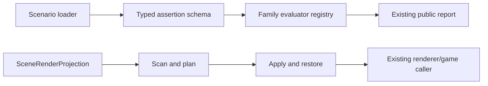

# P2-3 — Decompose verification and render-projection modules

Complexity: 11 → HIGH mode

## Context

`packages/playtest/src/assertions.ts` is 3,078 lines, `scenario.ts` is 1,799,
`runner/runner.ts` is 1,800, and `packages/core/src/renderProjection.ts` is 1,078. They mix
schema declaration, validation, evaluation, observation transport, reporting, render scanning,
projection planning, mutation, watching, and restoration. The current suite is broad and
fail-closed; this is a characterization-first refactor, not a behavior rewrite.

## Solution

- Freeze public exports and observable diagnostics before moving code.
- Split playtest schema/registry, assertion evaluators, and report assembly behind the existing
  public entry points.
- Split render-projection scan/plan construction from apply/restore state while keeping
  `SceneRenderProjection` as the live caller-facing class.
- Move one vertical family at a time and retain exact result IDs, ordering, triviality checks,
  and restoration semantics.

Data changes: none.

## Integration Ledger

| # | New thing | Live caller (`file:line`, non-test) | Replaces | Old path removed? | Negative control |
|---|---|---|---|---|---|
| 1 | Typed assertion family registry | `packages/playtest/src/scenario.ts:859` validates against the registry | monolithic registry/evaluator coupling | old exports delegate to the registry | Disable one family registration; its scenario gate must fail |
| 2 | Assertion family evaluators | `packages/playtest/src/runner/runner.ts:714` invokes `evaluateRichPlaytestAssertions` | one 858-line evaluator | facade delegates; duplicate evaluator deleted | Remove a family evaluator; its real scenario assertion must fail |
| 3 | Projection scan/plan seam | `packages/core/src/game.ts:449` constructs `SceneRenderProjection` | scan/apply logic in one class | class delegates to split internals | Disable plan application; pre-existing projection test must fail |
| 4 | Projection restoration seam | `packages/core/src/game.ts:449` updates the live projection | implicit mutation/restoration branches | old restoration code moved, not duplicated | Skip restore; scene-transition test must fail |

## 4. Execution Phases

### Phase 1: Characterize public behavior and invariants

**Files (4):**

- `packages/playtest/src/assertions.ts` - EDIT: expose characterization seams without changing public names.
- `packages/playtest/__tests__/scenario.spec.ts` - EDIT: pin result ordering, IDs, diagnostics, and family coverage.
- `packages/playtest/__tests__/evidence-required.spec.ts` - EDIT: pin fail-closed missing-observation behavior.
- `packages/core/__tests__/renderProjection.spec.ts` - EDIT: pin scan, apply, reconciliation, and restore behavior.

**Implementation:**

- [ ] Capture every public assertion family and its negative/missing-observation result.
- [ ] Capture projection reports, exact-lane decisions, and scene-transition restoration.
- [ ] Add a mutation statement for each characterization gate and observe its red result.

**Wiring:**

- [ ] Caller edited: existing runner and game callers remain the production entry points.
- [ ] Registration: existing assertion registry and `SceneRenderProjection` remain registered.
- [ ] Old path: no implementation removed before its behavior is characterized.
- [ ] Ledger rows filled: 1–4.

**Tests Required:**

| Test File | Test Name | Assertion | Negative control (must be observed red) |
|---|---|---|---|
| `packages/playtest/__tests__/scenario.spec.ts` | `should preserve every assertion family's result contract` | all families retain IDs, ordering, and severity | Disable one family branch; focused suite returns non-zero with `RED observed: assertion family result missing` |
| `packages/core/__tests__/renderProjection.spec.ts` | `should restore authored objects after projection changes` | authored scene and projection agree after reconciliation | Skip restoration; focused suite returns non-zero with `RED observed: authored object state leaked` |

**Revert check:** remove each characterization assertion in a temporary mutation; the relevant
pre-existing behavior becomes unobserved and the gate must reject the change.

**Verification Plan:** run focused playtest/core suites, then the full unit suite. Record raw report
objects for representative assertion families and projection transitions.

**User Verification:**

- Action: run an existing playtest scenario and a projection-heavy engine example.
- Expected: reports and rendered object ownership are indistinguishable from baseline.

### Phase 2: Split playtest verification behind the same public API

**Files (5):**

- `packages/playtest/src/assertion-schema.ts` - NEW: schema and registry declarations moved from the monolith.
- `packages/playtest/src/assertion-evaluators.ts` - NEW: typed family dispatch and evaluation helpers.
- `packages/playtest/src/assertion-report.ts` - NEW: result/diagnostic assembly and shared serializers.
- `packages/playtest/src/assertions.ts` - EDIT: compatibility facade and public exports only.
- `packages/playtest/src/index.ts` - EDIT: preserve the existing public entry and subpath exports.

**Implementation:**

- [ ] Move one assertion family at a time with no change to result IDs, diagnostics, or ordering.
- [ ] Keep scenario validation importing the schema registry, not private evaluator modules.
- [ ] Keep missing observations and unsupported-target errors fail-closed.

**Wiring:**

- [ ] Caller edited: runner continues calling `evaluateRichPlaytestAssertions` through the facade.
- [ ] Registration: every existing registry kind maps to exactly one evaluator.
- [ ] Old path: monolithic implementation is reduced to delegation; no twin evaluator remains.
- [ ] Ledger rows filled: 1–2.

**Tests Required:**

| Test File | Test Name | Assertion | Negative control (must be observed red) |
|---|---|---|---|
| `packages/playtest/__tests__/scenario.spec.ts` | `should evaluate all registered families through the public entry` | the real registry reaches the new dispatch | Remove a registry mapping; the test returns non-zero with `RED observed: registered family has no evaluator` |

**Revert check:** replace the facade call with a no-op; existing runner scenarios fail.

**Verification Plan:** focused playtest tests, `pnpm typecheck`, `pnpm test`, package build/publint,
and a caller census proving new modules have non-test consumers.

**User Verification:**

- Action: run the committed playtest suite against the generated fixture.
- Expected: the same scenario reports and diagnostics are produced by the split implementation.

### Phase 3: Split projection planning from mutation and restoration

**Files (4):**

- `packages/core/src/projection-plan.ts` - NEW: scan authored objects and construct an immutable plan/report.
- `packages/core/src/projection-apply.ts` - NEW: apply, reconcile, and restore plan-owned mutations.
- `packages/core/src/renderProjection.ts` - EDIT: preserve `SceneRenderProjection` API and delegate internals.
- `packages/core/__tests__/renderProjection.spec.ts` - EDIT: add plan/apply/restore integration assertions.

**Implementation:**

- [ ] Keep the same below-floor, exact-lane, unsupported-object, and settling decisions.
- [ ] Make restoration ownership explicit and idempotent across scene transitions.
- [ ] Keep reports observable through the existing `TN_RENDER_PROJECTION` diagnostics.

**Wiring:**

- [ ] Caller edited: `game.ts:449` still constructs the public class used in production.
- [ ] Registration: the class composes the scanner/plan and apply/restore seams.
- [ ] Old path: combined branches are removed or delegate; no second projection implementation runs.
- [ ] Ledger rows filled: 3–4.

**Tests Required:**

| Test File | Test Name | Assertion | Negative control (must be observed red) |
|---|---|---|---|
| `packages/core/__tests__/renderProjection.spec.ts` | `should keep projection and authored scene reversible` | apply/restore is idempotent through repeated reconciliation | Disable restore; test returns non-zero with `RED observed: projection mutation leaked across transition` |

**Revert check:** remove the apply/restore delegate; existing `game.spec.ts` scene-transition flow
must fail, proving the new code is live.

**Verification Plan:** focused projection tests, core game tests, full web unit suite, native build,
and bounded web/desktop conformance for a projection-using fixture. Record platform limits.

**User Verification:**

- Action: run a projection-heavy game through a scene transition and inspect the frame/report.
- Expected: the frame remains visually equivalent and the authored scene is restored afterward.

## Negative Controls

| Gate | Negative control | Expected red | Exact command/result |
|---|---|---|---|
| assertion characterization | remove one family dispatch | missing family result is observed | `command: pnpm exec vitest run --config vitest.config.ts packages/playtest/__tests__/scenario.spec.ts`; result: RED observed: registered family has no evaluator; exit: 1 |
| fail-closed observations | drop an observation field | missing evidence is rejected | `command: pnpm exec vitest run --config vitest.config.ts packages/playtest/__tests__/evidence-required.spec.ts`; result: RED observed: required observation was accepted; exit: 1 |
| projection restoration | skip apply or restore | scene-transition state leaks | `command: pnpm exec vitest run --config vitest.config.ts packages/core/__tests__/renderProjection.spec.ts`; result: RED observed: projection mutation leaked across transition; exit: 1 |

## Acceptance Criteria

- [ ] Public playtest and core exports remain source-compatible.
- [ ] Existing result IDs, ordering, diagnostics, triviality, and fail-closed behavior are unchanged.
- [ ] Every new module has a non-test production caller and no twin implementation remains.
- [ ] Projection apply/restore is reversible and idempotent across scene transitions.
- [ ] Focused, full, and executed web/native evidence is recorded; unexecuted targets are named.
- [ ] Every negative control was observed red and every ledger row has a real caller.

## Checkpoint Protocol

This high-risk PRD requires a checkpoint after every phase. Record focused raw reports, caller
census, revert mutation, incumbent-path search, and observed-red output. Any changed diagnostic or
unexecuted target blocks delivery until explained and tested.
