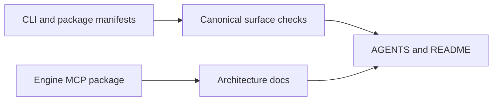

# P2-4 — Reconcile primary documentation with shipped surfaces

Complexity: 6 → MEDIUM mode

## Context

The primary docs disagree with the shipped product. `packages/create-threenative/AGENTS.md`
describes `dev`, `build`, `test`, `ship`, and `doctor`, while the CLI and tests define a narrower
canonical surface. The root README still names the removed private Studio package, and
`docs/architecture/AGENT-INTERFACE.md` says no engine MCP exists although `packages/engine-mcp`
ships one. Agents use these documents before they can discover the real code.

## Solution

- Choose the executable CLI and package manifests as the source of truth for commands.
- Remove stale private-product claims from public README/docs.
- Document the shipped engine MCP and its capability-search path in the architecture surface.
- Add semantic documentation tests for command inventory and package inventory, then regenerate
  CLAUDE mirrors.

Data changes: none.

## Integration Ledger

| # | New thing | Live caller (`file:line`, non-test) | Replaces | Old path removed? | Negative control |
|---|---|---|---|---|---|
| 1 | Canonical CLI inventory check | `packages/create-threenative/src/threenative.ts:5` dispatches commands | prose-only command list | stale list deleted | Add a nonexistent command to docs; check fails |
| 2 | Public package/MCP inventory check | `packages/engine-mcp/src/index.ts:1` ships the MCP server | “no engine MCP” claim | contradiction deleted | Remove the MCP entry from docs; check fails |
| 3 | Generated mirror reconciliation | `scripts/sync-agent-docs.ts:159` mirrors AGENTS | hand-maintained CLAUDE divergence | mirrors remain generated | Edit AGENTS without sync; sync check fails |

## 4. Execution Phases

### Phase 1: Make command and package claims executable

**Files (5):**

- `packages/create-threenative/AGENTS.md` - EDIT: state the canonical CLI commands and flags.
- `packages/create-threenative/__tests__/cli.spec.ts` - EDIT: derive documentation expectations from the executable surface.
- `README.md` - EDIT: remove the private Studio/hosting claim and link the public workflow.
- `docs/architecture/AGENT-INTERFACE.md` - EDIT: describe the shipped MCP capability path.
- `scripts/__tests__/primary-docs.spec.ts` - NEW: semantic checks for command/package contradictions.

**Implementation:**

- [ ] Verify current command behavior before editing prose.
- [ ] State commands that exist and explicitly omit commands that do not.
- [ ] Name engine MCP as shipped and point to capability discovery without inventing a second API.

**Wiring:**

- [ ] Caller edited: tests inspect the real CLI/package surfaces.
- [ ] Registration: root test includes the primary-docs check.
- [ ] Old path: stale command and private-package claims are removed.
- [ ] Ledger rows filled: 1–2.

**Tests Required:**

| Test File | Test Name | Assertion | Negative control (must be observed red) |
|---|---|---|---|
| `scripts/__tests__/primary-docs.spec.ts` | `should reject commands and packages absent from shipped surfaces` | docs contain only current commands/packages | Add `studio` or remove `engine-mcp`; focused test returns non-zero with `RED observed: stale primary-doc claim` |

**Revert check:** restore the stale sentence; the semantic documentation test fails.

**Verification Plan:** run the focused docs test, `pnpm check:docs`, root test, and inspect the
rendered Markdown links.

**User Verification:**

- Action: follow the README command path and ask a cold agent how to find an engine capability.
- Expected: every command and package named exists, and the MCP route is discoverable.

### Phase 2: Keep generated mirrors authoritative

**Files (3):**

- `AGENTS.md` - EDIT: add the canonical-doc rule and source-of-truth wording if needed.
- `CLAUDE.md` - EDIT: generated mirror produced by `pnpm sync:agents`.
- `scripts/__tests__/sync-agent-docs.spec.ts` - EDIT: cover the primary-doc source/mirror rule.

**Implementation:**

- [ ] Update AGENTS only, run `pnpm sync:agents`, and verify the mirror.
- [ ] Ensure docs checks skip evidence archives but not live product docs.
- [ ] Keep generated-banner behavior unchanged.

**Wiring:**

- [ ] Caller edited: `syncAgentDocs` remains the only mirror writer.
- [ ] Registration: root sync check runs in CI.
- [ ] Old path: no hand-maintained mirror survives.
- [ ] Ledger rows filled: 3.

**Tests Required:**

| Test File | Test Name | Assertion | Negative control (must be observed red) |
|---|---|---|---|
| `scripts/__tests__/sync-agent-docs.spec.ts` | `should fail when a primary instruction mirror drifts` | live mirrors are byte-equivalent | Change a mirror only; `pnpm sync:agents --check` returns non-zero with `RED observed: agent docs out of sync` |

**Revert check:** delete the sync-check assertion; mirror drift becomes invisible.

**Verification Plan:** run sync, sync check, doc-link check, typecheck, and full tests.

**User Verification:**

- Action: edit one live AGENTS source and run the documented sync command.
- Expected: the paired CLAUDE mirror updates and a direct check reports clean.

## Negative Controls

| Gate | Negative control | Expected red | Exact command/result |
|---|---|---|---|
| primary docs | add a nonexistent command/package claim | semantic docs test fails | `command: pnpm exec vitest run --config vitest.config.ts scripts/__tests__/primary-docs.spec.ts`; result: RED observed: stale primary-doc claim; exit: 1 |
| mirror sync | edit a generated mirror only | sync check fails | `command: pnpm sync:agents --check`; result: RED observed: agent docs out of sync; exit: 1 |

## Acceptance Criteria

- [ ] README, architecture docs, package AGENTS, and CLI tests agree on shipped commands/packages.
- [ ] The public docs no longer describe private Studio or a nonexistent MCP state.
- [ ] Documentation checks derive claims from executable surfaces where practical.
- [ ] All live AGENTS/CLAUDE mirrors are synchronized.
- [ ] Both negative controls were observed red before delivery.

## Checkpoint Protocol

Record the source command inventory, package inventory, exact changed docs, link-check output, and
observed-red mutations. A prose-only green result is insufficient.
