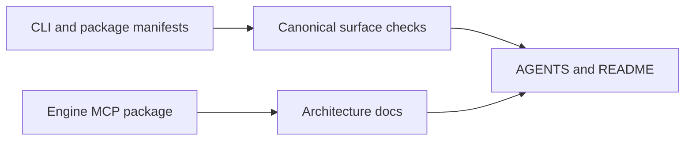

# P2-4 — Reconcile primary documentation with shipped surfaces

Complexity: 6 → MEDIUM mode

## Context

The primary docs disagree with the shipped product. `packages/create-threenative/AGENTS.md`
describes `dev`, `build`, `test`, `ship`, and `doctor`, while the CLI and tests define a narrower
canonical surface. The root README still names the removed private Studio package, and
`docs/architecture/AGENT-INTERFACE.md` says no engine MCP exists although `packages/engine-mcp`
ships one. Agents use these documents before they can discover the real code.

## Solution

- Choose the executable CLI and package manifests as the source of truth for commands.
- Remove stale private-product claims from public README/docs.
- Document the shipped engine MCP and its capability-search path in the architecture surface.
- Add semantic documentation tests for command inventory and package inventory, then regenerate
  CLAUDE mirrors.

Data changes: none.

## Integration Ledger

| # | New thing | Live caller (`file:line`, non-test) | Replaces | Old path removed? | Negative control |
|---|---|---|---|---|---|
| 1 | Canonical CLI inventory check | `packages/create-threenative/src/commands.ts:9` exports the inventory that `src/threenative.ts:25` renders and `scripts/__tests__/primary-docs.spec.ts` checks docs against | prose-only command list | stale `dev`/`test`/`ship` list deleted from `packages/create-threenative/AGENTS.md` | Add a nonexistent command to docs; check fails (observed 2026-08-21) |
| 2 | Public package/MCP inventory check | `packages/engine-mcp/src/index.ts:178` registers the tools; `scripts/__tests__/primary-docs.spec.ts:180` derives them into the doc check | “no engine MCP” claim | contradiction deleted from `docs/architecture/AGENT-INTERFACE.md`; studio row deleted from README | Remove the MCP entry from docs; check fails (observed 2026-08-21) |
| 3 | Generated mirror reconciliation | `scripts/sync-agent-docs.ts:159` mirrors AGENTS; primary pairs pinned by `scripts/__tests__/sync-agent-docs.spec.ts:128` | hand-maintained CLAUDE divergence | mirrors remain generated | Edit a mirror only; sync check fails (observed 2026-08-21) |

## 4. Execution Phases

### Phase 1: Make command and package claims executable

**Files (5):**

- `packages/create-threenative/AGENTS.md` - EDIT: state the canonical CLI commands and flags.
- `packages/create-threenative/__tests__/cli.spec.ts` - EDIT: derive documentation expectations from the executable surface.
- `README.md` - EDIT: remove the private Studio/hosting claim and link the public workflow.
- `docs/architecture/AGENT-INTERFACE.md` - EDIT: describe the shipped MCP capability path.
- `scripts/__tests__/primary-docs.spec.ts` - NEW: semantic checks for command/package contradictions.

**Implementation:**

- [x] Verify current command behavior before editing prose. (Executed both CLIs; inventory in
  `docs/verification/primary-docs-reconciliation-2026-08-21.md`.)
- [x] State commands that exist and explicitly omit commands that do not.
- [x] Name engine MCP as shipped and point to capability discovery without inventing a second API.

**Wiring:**

- [x] Caller edited: tests inspect the real CLI/package surfaces.
- [x] Registration: root test includes the primary-docs check. (Root `vitest.config.ts` already
  collects `scripts/**/*.spec.ts`; no config change needed.)
- [x] Old path: stale command and private-package claims are removed.
- [x] Ledger rows filled: 1–2.

**Tests Required:**

| Test File | Test Name | Assertion | Negative control (must be observed red) |
|---|---|---|---|
| `scripts/__tests__/primary-docs.spec.ts` | `should reject commands and packages absent from shipped surfaces` | docs contain only current commands/packages | Add `studio` or remove `engine-mcp`; focused test returns non-zero with `RED observed: stale primary-doc claim` |

**Revert check:** restore the stale sentence; the semantic documentation test fails.

**Verification Plan:** run the focused docs test, `pnpm check:docs`, root test, and inspect the
rendered Markdown links.

**User Verification:**

- Action: follow the README command path and ask a cold agent how to find an engine capability.
- Expected: every command and package named exists, and the MCP route is discoverable.

### Phase 2: Keep generated mirrors authoritative

**Files (3):**

- `AGENTS.md` - EDIT: add the canonical-doc rule and source-of-truth wording if needed.
- `CLAUDE.md` - EDIT: generated mirror produced by `pnpm sync:agents`.
- `scripts/__tests__/sync-agent-docs.spec.ts` - EDIT: cover the primary-doc source/mirror rule.

**Implementation:**

- [x] Update AGENTS only, run `pnpm sync:agents`, and verify the mirror.
- [x] Ensure docs checks skip evidence archives but not live product docs. (Existing skips kept:
  sync skips `docs/benchmark` sweep archives, link check skips `docs/benchmark/sweeps/`; the new
  spec scans exactly the four live primary docs.)
- [x] Keep generated-banner behavior unchanged.

**Wiring:**

- [x] Caller edited: `syncAgentDocs` remains the only mirror writer.
- [x] Registration: root sync check runs in CI.
- [x] Old path: no hand-maintained mirror survives.
- [x] Ledger rows filled: 3.

**Tests Required:**

| Test File | Test Name | Assertion | Negative control (must be observed red) |
|---|---|---|---|
| `scripts/__tests__/sync-agent-docs.spec.ts` | `should fail when a primary instruction mirror drifts` | live mirrors are byte-equivalent | Change a mirror only; `pnpm sync:agents --check` returns non-zero with `RED observed: agent docs out of sync` |

**Revert check:** delete the sync-check assertion; mirror drift becomes invisible.

**Verification Plan:** run sync, sync check, doc-link check, typecheck, and full tests.

**User Verification:**

- Action: edit one live AGENTS source and run the documented sync command.
- Expected: the paired CLAUDE mirror updates and a direct check reports clean.

## Negative Controls

| Gate | Negative control | Expected red | Exact command/result |
|---|---|---|---|
| primary docs | add a nonexistent command/package claim | semantic docs test fails | `pnpm exec vitest run scripts/__tests__/primary-docs.spec.ts` — observed 2026-08-21 three ways: initial stale tree (4 failed: `@threenative/studio`, missing `threenative-engine-mcp`, `threenative ship`, no engine MCP named); post-fix re-add of the studio row (`expected [ '@threenative/studio' ] to deeply equal []`, exit 1); post-fix rename of `threenative-engine-mcp` in AGENT-INTERFACE (phantom token + `never names the shipped engine MCP server`, exit 1). Restored to exit 0 each time |
| mirror sync | edit a generated mirror only | sync check fails | `pnpm sync:agents --check` after appending one line to root `CLAUDE.md`: "agent docs out of sync with shared fragments or AGENTS.md:\n  CLAUDE.md", exit 1; restored by `pnpm sync:agents` → "agent docs in sync: 16 CLAUDE.md mirrors", exit 0 |

## Acceptance Criteria

- [x] README, architecture docs, package AGENTS, and CLI tests agree on shipped commands/packages.
- [x] The public docs no longer describe private Studio or a nonexistent MCP state.
- [x] Documentation checks derive claims from executable surfaces where practical.
- [x] All live AGENTS/CLAUDE mirrors are synchronized.
- [x] Both negative controls were observed red before delivery.

## Checkpoint Protocol

Record the source command inventory, package inventory, exact changed docs, link-check output, and
observed-red mutations. A prose-only green result is insufficient.

## Results — 2026-08-21

Status: DONE for this lane's scope. Full evidence:
`docs/verification/primary-docs-reconciliation-2026-08-21.md`.

- Command inventory: `threenative` ships exactly `build` and `doctor`; the scaffolder takes a
  directory plus `inspect`, with `--template`/`--no-install`/`--*-package` flags; `dev`, `test`,
  `ship` do not exist and are now stated not to.
- Package inventory: seven published workspace packages incl. `threenative-engine-mcp` (see
  evidence file for the table); `@threenative/studio` removed from README.
- Gates: focused specs 15/15 exit 0; `pnpm sync:agents --check` exit 0 (16 mirrors);
  `pnpm check:docs` exit 0 (721 links / 495 files); `pnpm typecheck` exit 0; `pnpm lint` exit 0.
- Both negative controls observed red with pasted output, then restored green.
- One gate honestly out of scope: `pnpm test` / root `vitest run` fail on the concurrent P2-3
  lane's in-flight playtest exports missing `@situation` tags
  (`evaluateRichPlaytestAssertions`, `resolveDiagnosticsPolicy`) — 1536/1537 root vitest tests
  pass; the sole failure throws from `build-capability-manifest.ts:449`. Rerun the full gate
  once that lane lands.
