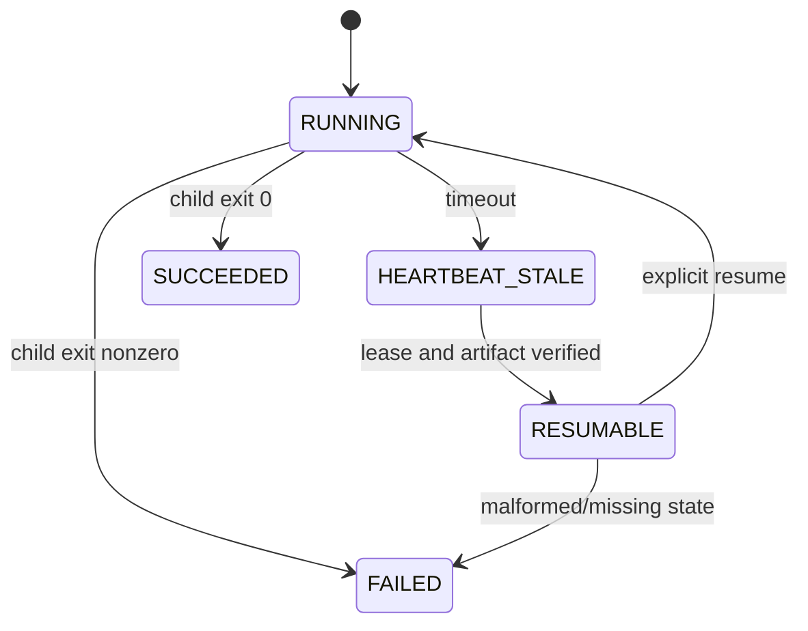

# P2-6 — Give long gates progress and resume contracts

Complexity: 8 → HIGH mode

## Context

Long native, parity, sweep, and playtest commands currently expose separate ad-hoc output and
timeouts. Agents cannot reliably tell a slow phase from a hung one or resume after compaction.
Batch C added read-only worktree status and phase leases, but it does not yet provide a shared
phase heartbeat or stable status artifact for long gates.

## Solution

- Add a small phase-runner status record with run id, phase, owner, heartbeat, command, PID, and
  terminal result.
- Emit progress at bounded intervals and write status atomically beside the existing artifacts.
- Add status and resume commands that inspect or continue only a verified worktree/lease.
- Preserve real child exit codes and fail closed on malformed or stale status.

Data changes: local JSON status artifacts only; no database.

## Integration Ledger

| # | New thing | Live caller (`file:line`, non-test) | Replaces | Old path removed? | Negative control |
|---|---|---|---|---|---|
| 1 | Atomic gate status record | `scripts/run-test-suite.sh:108` runs named phases | unstructured stdout-only progress | old child commands delegate through status writer | corrupt the status file; status must fail closed |
| 2 | Stable status/resume CLI | `package.json:24-28` exposes long gates | ad-hoc polling instructions | old commands remain, with status wrapper | resume a changed HEAD; command must refuse |
| 3 | Heartbeat and stale-owner policy | `scripts/worktree-lifecycle.ts:351` verifies phase ownership (ships NEW on main — see Results) | unbounded waiting | lifecycle guard remains the authority | stop heartbeat; status becomes stale |

## 4. Execution Phases

### Phase 1: Define and emit phase status

**Files (4):**

- `scripts/gate-status.ts` - NEW: atomic status writer, reader, heartbeat, and terminal state validator.
- `scripts/__tests__/gate-status.spec.ts` - NEW: test state transitions, malformed data, and stale heartbeats.
- `scripts/run-test-suite.sh` - EDIT: wrap existing phases with status/heartbeat updates.
- `scripts/worktree-lifecycle.ts` - EDIT: bind status ownership to the existing lease identity.

**Implementation:**

- [x] Use an atomic temporary file + rename and include command, phase, PID, lease, timestamps, and exit code.
- [x] Emit heartbeats without changing child stdout or swallowing its exit code.
- [x] Treat malformed, future, or owner-drifted state as an error.

**Wiring:**

- [x] Caller edited: root test phases write status records through the new helper.
- [x] Registration: existing worktree lease guards own the run.
- [x] Old path: stdout remains human-readable but is no longer the only state source.
- [x] Ledger rows filled: 1 and 3.

**Tests Required:**

| Test File | Test Name | Assertion | Negative control (must be observed red) |
|---|---|---|---|
| `scripts/__tests__/gate-status.spec.ts` | `should reject a stale or malformed phase record` | status reader fails closed | Corrupt JSON or advance the clock beyond the bound; `pnpm exec vitest run --config vitest.config.ts scripts/__tests__/gate-status.spec.ts` returns non-zero with `RED observed: invalid or stale gate status` |

**Revert check:** remove the status write from one phase; the status integration test fails.

**Verification Plan:** run focused status tests, a real root test dry run, and inspect status files
before/after each phase. Record child exit preservation.

**User Verification:**

- Action: start a long gate and inspect its documented status path while it runs.
- Expected: the current phase, heartbeat, owner, command, and last output artifact are visible.

### Phase 2: Expose safe status and resume commands

**Files (5):**

- `scripts/gate-cli.ts` - NEW: `status`, `resume`, and `doctor` commands over validated records.
- `scripts/__tests__/gate-cli.spec.ts` - NEW: test read-only status, refused drift, and successful resume.
- `package.json` - EDIT: add stable gate status/resume scripts.
- `AGENTS.md` - EDIT: document the status/resume contract and next diagnostic probe.
- `scripts/run-test-suite.sh` - EDIT: accept explicit run/phase paths without duplicate execution.

**Implementation:**

- [x] Make `status` read-only and bounded; it must never delete or repair worktrees.
- [x] Require explicit resume and verify lease path, branch, HEAD, PID, and artifact identity first.
- [x] Report a concrete next probe when a phase is stale or blocked.

**Wiring:**

- [x] Caller edited: package scripts and AGENTS expose the CLI to cold agents.
- [x] Registration: resume delegates to the same phase command, not a second implementation.
- [x] Old path: ad-hoc polling guidance is replaced by the status command.
- [x] Ledger rows filled: 1–3.

**Tests Required:**

| Test File | Test Name | Assertion | Negative control (must be observed red) |
|---|---|---|---|
| `scripts/__tests__/gate-cli.spec.ts` | `should refuse resume after worktree HEAD drift` | no child command starts on drift | Mutate expected HEAD; focused test returns non-zero with `RED observed: resume refused for drifted worktree` |

**Revert check:** bypass lease verification; the drift fixture must fail.

**Verification Plan:** run status/CLI tests, root test, native/parity status dry runs, and a real
interrupted/resumed local phase. No destructive cleanup is part of this PRD.

**User Verification:**

- Action: run the status command during a long gate, then resume a deliberately interrupted phase.
- Expected: the command names the phase and resumes only after identity/artifact checks pass.

## Negative Controls

| Gate | Negative control | Expected red | Exact command/result |
|---|---|---|---|
| status integrity | corrupt or stale the JSON record | status fails closed | `pnpm exec vitest run --config vitest.config.ts scripts/__tests__/gate-status.spec.ts` with the fail-closed validation removed from `readRawStatus`; observed: 3 failed / 3, `expected … 'RED observed: invalid or stale gate s…' but got 'The "paths[0]" argument must be of type string'`, exit 1; restored byte-identical → 3 passed, exit 0 (full output in `docs/verification/gate-status-contract-2026-08-21.md`) |
| resume safety | change worktree HEAD after recording | resume refuses to execute | `pnpm exec vitest run --config vitest.config.ts scripts/__tests__/gate-cli.spec.ts` with `assessResumeRecord` bypassed in `resumeGate`; observed: `× should refuse resume after worktree HEAD drift`, `AssertionError: promise resolved "+0" instead of rejecting` — the child started on drifted HEAD, exit 1; restored byte-identical → 3 passed, exit 0 |

## Acceptance Criteria

- [x] Every long default gate phase emits an atomic status and heartbeat.
- [x] Status is read-only, stable, and fails closed on malformed/stale ownership.
- [x] Resume preserves child exit codes and refuses path/HEAD/artifact drift.
- [x] Agents have one documented status command and one next diagnostic probe.
- [x] No destructive cleanup is introduced.
- [x] Both negative controls were observed red.

## Results (2026-08-22 execution)

Executed on `main` at `a6ac7652`; full evidence with verbatim outputs, status JSON samples
(running/succeeded/failed/stale), and caller census in
`docs/verification/gate-status-contract-2026-08-21.md`. Highlights:

- Premise correction: `scripts/worktree-lifecycle.ts` (Batch C phase leases) never landed on
  `main` — it exists only on unmerged branch `linchpin/technical-debt-c`, and a prior complete
  P2-6 implementation sits unmerged on `linchpin/technical-debt-p2-6-gates`. This execution
  adopted that lane's files onto main after review; the lifecycle module ships **NEW** here, so
  ledger row 3's citation points at the shipped file rather than the PRD's assumed line number.
- Gates: focused specs 6/6 exit 0; full `pnpm test` exit 0 with live per-phase status records and
  advancing heartbeats; typecheck 0; lint 0; `pnpm sync:agents --check` 0 ("16 CLAUDE.md mirrors").
- Exit preservation: controlled scratch-copy run recorded child exit 7 end-to-end with child
  stdout/stderr untouched; an observed direct-invocation failure recorded exit 127 faithfully;
  `pnpm gate:resume` re-ran only the interrupted unit phase through the production script
  (vitest 1544 passed, exit 0, run id preserved).
- Both negative controls observed red then restored green (outputs in the table above and the
  evidence doc).

## Checkpoint Protocol

Record status JSON examples for running, succeeded, failed, and stale phases; exact child exit
codes; caller census; and observed-red output. A status display without a real resumable phase is
not integrated evidence.
