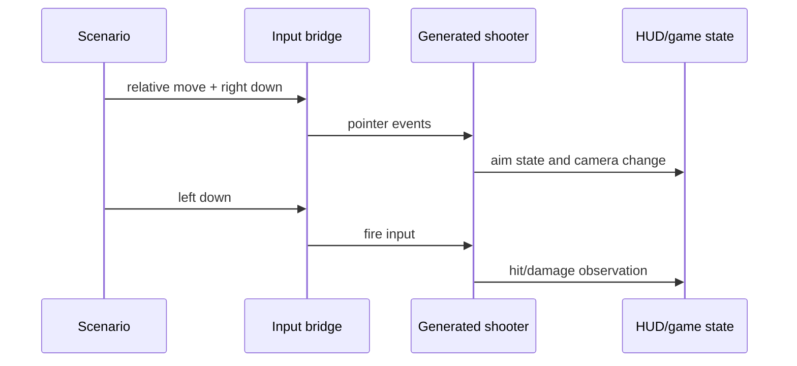

# P2-7 — Add generated-game mouse/input integration proof

Complexity: 8 → HIGH mode

## Context

The core input and relative-pointer unit tests are green, but the generated shooter template has
no committed scenario that drives relative pointer look, right-button aim, and left-button fire
together. Package units can therefore pass while the first-person game is not controllable. The
shooter template already contains `src/weapons/Hitscan.ts`, `src/game.ts`, and committed playtest
scenarios; the proof must exercise the generated game, not call helpers directly.

## Solution

- Add one committed shooter scenario that uses the real generated template and its input bridge.
- Drive relative pointer movement, right-button hold/release, and left-button fire in one sequence.
- Assert camera rotation, aim state, and a real damage/fire observation.
- Run the scenario on web and one native target when the device/desktop lane is available; report
  blocked targets explicitly.

Data changes: none.

## Integration Ledger

| # | New thing | Live caller (`file:line`, non-test) | Replaces | Old path removed? | Negative control |
|---|---|---|---|---|---|
| 1 | Generated shooter input scenario | `packages/create-threenative/templates/shooter/src/main.ts:1` boots the generated game | no integrated pointer/fire proof | additive scenario | remove one input step; scenario must fail |
| 2 | Shooter gameplay observation | `packages/create-threenative/templates/shooter/src/game.ts:1` runs the real game loop | package-only input assertions | additive bridge state | stop updating aim/fire state; assertion must fail |
| 3 | Web/native scenario target declaration | `packages/playtest/src/runner/runner.ts:164` executes standalone scenarios | unrecorded target coverage | old unit-only path remains but is insufficient | remove target declaration; scenario gate must reject |

## 4. Execution Phases

### Phase 1: Prove the web generated shooter path

**Files (5):**

- `packages/create-threenative/templates/shooter/playtests/input-control.playtest.json` - NEW: committed relative-pointer/aim/fire scenario.
- `packages/create-threenative/templates/shooter/src/game.ts` - EDIT: expose real camera/aim/fire observations through the existing bridge.
- `packages/create-threenative/templates/shooter/src/playtest-events.ts` - EDIT: publish deterministic gameplay proof events.
- `packages/create-threenative/__tests__/playtest.spec.ts` - EDIT: include the generated shooter scenario in scaffold proof.
- `packages/playtest/__tests__/generated-shooter-input.spec.ts` - NEW: run the real scaffolded project and assert the input sequence.

**Implementation:**

- [ ] Use the existing scenario input schema; do not add a template-only input protocol.
- [ ] Ensure right-button aim state and left-button fire are observable after the actual event path.
- [ ] Add a no-input/disabled control so the scenario cannot pass from initial state.

**Wiring:**

- [ ] Caller edited: generated `main.ts` boots the game that the scenario drives.
- [ ] Registration: template playtest discovery includes `input-control.playtest.json`.
- [ ] Old path: package-only tests remain unit evidence, while this scenario is the integration proof.
- [ ] Ledger rows filled: 1–2.

**Tests Required:**

| Test File | Test Name | Assertion | Negative control (must be observed red) |
|---|---|---|---|
| `packages/playtest/__tests__/generated-shooter-input.spec.ts` | `should turn, aim, and fire the generated shooter` | camera, aim, and damage observations change in sequence | Remove right-button or left-button delivery; `pnpm exec vitest run --config vitest.config.ts packages/playtest/__tests__/generated-shooter-input.spec.ts` returns non-zero with `RED observed: generated shooter input state unchanged` |

**Revert check:** remove one scenario step; the real generated run must fail, not merely a parser
unit test.

**Verification Plan:** run scaffold generation, the focused generated scenario under the repository
display wrapper, and the template smoke suite. Record raw observations and screenshot provenance.

**User Verification:**

- Action: launch the generated shooter, move the pointer, hold aim, and click fire.
- Expected: the camera turns, aim state changes, and the target records damage.

### Phase 2: Extend the same proof to a native target

**Files (4):**

- `packages/create-threenative/templates/shooter/playtests/input-control.playtest.json` - EDIT: declare the native target and parity expectations.
- `packages/playtest/src/runner/three/device.ts` - EDIT: preserve button/pointer ordering for native delivery.
- `packages/runtime-native/conformance/registry.json` - EDIT: register the scenario in the native conformance set.
- `packages/runtime-native/tests/generated-shooter-input.test.mjs` - NEW: assert native target execution and blocked-device reporting.

**Implementation:**

- [ ] Reuse the same scenario and observations; do not fork gameplay assertions by platform.
- [ ] Verify right-button and left-button ordering on the selected native target.
- [ ] If the target is unavailable, report BLOCKED with the exact device prerequisite rather than green.

**Wiring:**

- [ ] Caller edited: native conformance runner loads the same generated scenario.
- [ ] Registration: registry row points at the committed template scenario.
- [ ] Old path: web and native do not carry duplicate scenario definitions.
- [ ] Ledger rows filled: 1–3.

**Tests Required:**

| Test File | Test Name | Assertion | Negative control (must be observed red) |
|---|---|---|---|
| `packages/runtime-native/tests/generated-shooter-input.test.mjs` | `should preserve button order on the native target` | native report records the same input and gameplay sequence | Drop the right-button event; test returns non-zero with `RED observed: native aim transition missing` |

**Revert check:** remove the registry row; native conformance must report a missing scenario, not
pass an empty assertion set.

**Verification Plan:** run web proof, native desktop/Android target proof as available, and the
full template suite. Include adapter/target identity and blocked reasons.

**User Verification:**

- Action: repeat pointer look, aim, and fire on the executed native target.
- Expected: the same gameplay observations are reported; unavailable devices remain explicitly blocked.

## Negative Controls

| Gate | Negative control | Expected red | Exact command/result |
|---|---|---|---|
| generated web input | remove an input event | real shooter state does not change | `command: pnpm exec vitest run --config vitest.config.ts packages/playtest/__tests__/generated-shooter-input.spec.ts`; result: RED observed: generated shooter input state unchanged; exit: 1 |
| native registration | remove the conformance row | empty native proof is rejected | `command: pnpm exec vitest run --config vitest.config.ts packages/runtime-native/tests/generated-shooter-input.test.mjs`; result: RED observed: native scenario missing; exit: 1 |

## Acceptance Criteria

- [ ] One committed generated-shooter scenario drives relative look, right-button aim, and left-button fire.
- [ ] Assertions observe real camera, aim, and damage/fire state after the bridge path.
- [ ] The scenario cannot pass from initial state or with a missing input event.
- [ ] The same scenario is executed on web and one native target, or the native prerequisite is recorded as BLOCKED.
- [ ] No duplicate platform-specific gameplay scenario is introduced.
- [ ] Both negative controls were observed red.

## Checkpoint Protocol

Record the generated project identity, scenario path, event sequence, raw observations, target and
adapter identity, screenshot/provenance paths, and observed-red output. A unit-only or empty-target
green result is UNVERIFIED.
