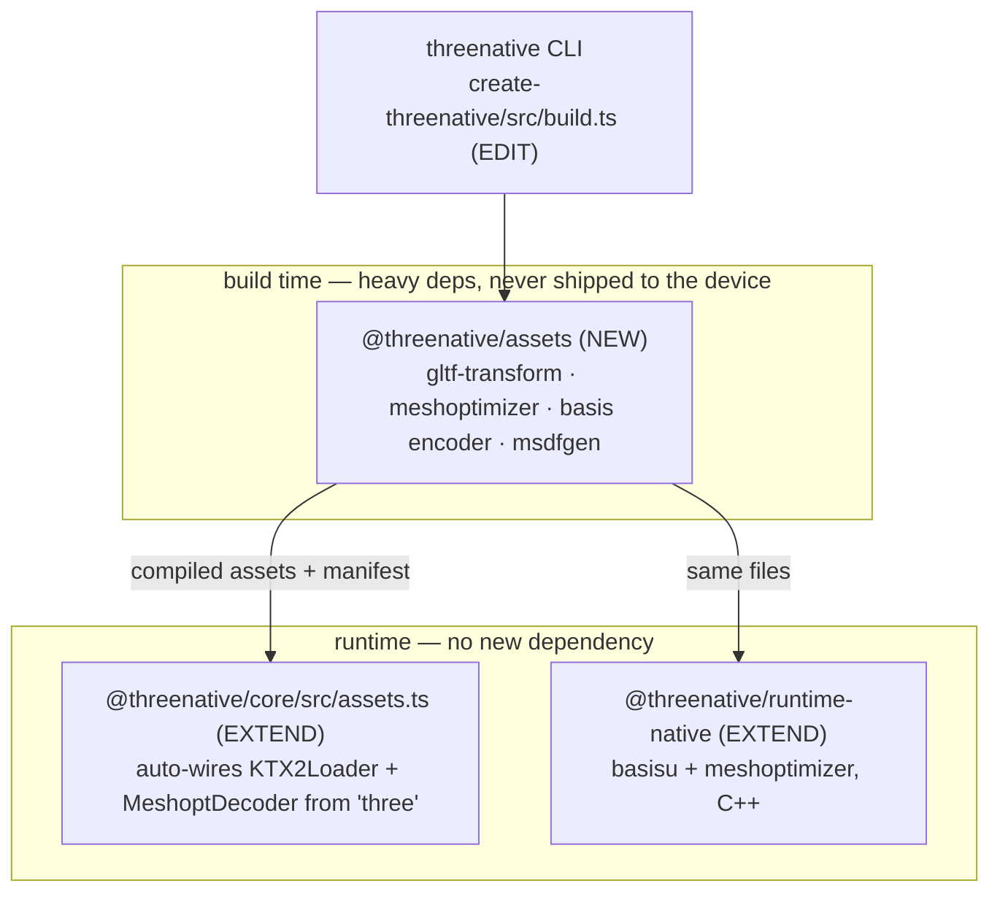

# The asset pipeline series

**Status: COMPLETE — executed 2026-08-22 on the product owner's order of that date.** The
deferral below was written honestly when it was true and was superseded by an explicit owner
instruction, not by either trigger having fired. Outcomes: 094/095/096/097 executed and gated;
098/099 declined under their own Phase 0 exits with census evidence. No platform readiness is
claimed beyond what each PRD's gates prove.

Six PRDs, PRD-094 through PRD-099. They exist because ThreeNative currently ships **no asset
optimisation at all** — `ctx.assets` loads raw `.glb` and `.png` through stock Three.js loaders,
`threenative build` copies `public/` verbatim into the native package, and the `assets/`
directory the scaffold creates in every template contains a single `.gitkeep`.

| PRD | What a user gets | Depends on |
|---|---|---|
| [094](../PRD-094-asset-compile-step.md) | `threenative build` compiles `assets/` into `public/` and the game loads the compiled result | — |
| [095](../PRD-095-texture-compression.md) | Textures ship as KTX2/Basis and reach the GPU in a native compressed format | 094 |
| [096](../PRD-096-mesh-optimization.md) | Models ship quantized and Meshopt-compressed | 094 |
| [097](../PRD-097-native-decode-path.md) | Desktop and Android decode both formats in C++, not WASM | 095, 096 |
| [098](../PRD-098-lod-and-instancing.md) **DECLINED** | Declined at Phase 0: no shipped scene is triangle-bound; see the census | 096, 097 |
| [099](../PRD-099-vector-textures.md) **DECLINED** | Declined at Phase 0: no shipped art qualifies; see the census | 095 |

094 through 097 are the series. 098 and 099 are optional and are written so they can be
declined without stranding anything.

---

## This series does not start work. It is what starting looks like when the trigger fires.

[`docs/product/ASSET-PIPELINE.md`](../../../product/ASSET-PIPELINE.md) defers the build-time
pipeline, last re-checked 2026-08-09, with a two-part trigger that **has not fired**:

1. the five-minute stranger test has closed — defined in
   [`STRANGER-TEST-PROTOCOL.md`](../../../product/STRANGER-TEST-PROTOCOL.md), open as
   [PRD-080](../../BLOCKED/requires-external-person/PRD-080-five-minute-stranger-test.md);
2. a reference game fails a device performance budget **for asset reasons**, measured.

**Both are still open, and nothing in this folder may be implemented until both are true.**
These PRDs exist so that the day the trigger fires the answer is a plan rather than a quarter of
design, and so the decision has a written shape to argue with in the meantime. Until then the
correct answer to "my textures are too big" remains `gltf-transform` on the command line.

Two things the deferral doc asks for and this series must honour:

- **The asset health report is the part with value on day one.** It is folded into
  [PRD-094](../PRD-094-asset-compile-step.md) Phase 2 as the compile step's report — triangles,
  materials, texture dimensions, missing colliders, license, each against a target — rather than
  left as a later idea.
- **`smithsonian_*` is what the pipeline unlocks.** Scan-resolution photogrammetry is currently
  off-limits to the discovery MCP because nothing here can decimate it. PRD-096's simplifier and
  PRD-098's LOD pass are the reason that restriction could be lifted, and lifting it is the
  concrete user-visible payoff to point at when the trigger is argued.

---

## The two questions the series answers up front

### Does this go in a new package, or an existing one?

**Both, split by which dependency it carries.** The framework's rule is that a package exists
only when it carries a dependency the others must not inherit — and here the dependencies split
cleanly along the build-time/runtime line.

- **New: `packages/assets`.** The encoders are large, they are Node-only, and no game should
  ever ship them to a device. Putting them in `core` would make every browser bundle inherit an
  encoder it never runs; putting them in `create-threenative` would make every scaffolded
  project install them on `npm create`. They carry a dependency the others must not inherit,
  which is the whole test.
- **Extended, not new: `packages/core/src/assets.ts`.** The runtime side adds **zero**
  dependencies — `KTX2Loader`, `MeshoptDecoder` and the Basis transcoder all already ship inside
  `three`. A separate runtime package for code with no dependency of its own would be a package
  invented to hold a concept, which the framework does not do.
- **Extended, not new: `packages/runtime-native`.** Native decode is C++ and belongs with the
  rest of the C++ host, next to the existing `src/gltf/` cgltf loader.

**Why a workspace package and not the external `asset-mcp` lane**, which the deferral doc
suggests reusing: `threenative-asset-mcp` is an external process with no runtime coupling — it
finds files and stops. The compiler is coupled in both directions. Its output format has to move
in lockstep with the `KTX2Loader` wiring in `core` and the C++ transcoder in `runtime-native`,
and PRD-097's parity gate asserts byte-identical artifacts across all three. Three
independently-versioned repositories cannot hold that invariant. The dependency-boundary rule is
still what admits the package; the release lane is a separate question and the answer here is
different from `asset-mcp`'s because the coupling is different.

**This crosses a reported budget and the series says so out loud.** `packages/assets/src` counts
toward the 15,000-line framework review trigger, and PRD-094 carries the justification rather
than routing around the number.

### Is any of this open source, and can we use it?

Yes, all of it, and that is the point of the series.

| Component | License | Role |
|---|---|---|
| Basis Universal / KTX2 (`basisu`, `toktx`) | Apache-2.0 | texture supercompression, transcodes to BC7/ASTC/ETC2 |
| meshoptimizer | MIT | vertex/index codecs, quantization, simplification, meshlets |
| gltf-transform | MIT | glTF read/write/transform in Node |
| msdfgen / msdf-atlas-gen | MIT | vector shapes → distance fields |
| cgltf | MIT | already vendored in `runtime-native/src/gltf/` |

**Rixels — the 4J Studios technique that prompted this — is not open source.** It is part of a
proprietary engine, a patent application is pending, and there is no public implementation.
PRD-099 deliberately does **not** clone it; it builds the MSDF path, which is a decade-old
open technique that reaches a similar place (compact parametric representation, GPU
reconstruction, crisp under magnification) by a route nobody has a claim on.

The repository itself has no `LICENSE` file yet. Choosing one is a separate decision and no PRD
here assumes an answer, but every dependency above is compatible with any permissive choice.

---

## The rule the whole series is built on

**The abstraction sits above open standards; it never replaces them.**

A ThreeNative asset is a plain `.ktx2` or a plain `.glb` with standard extensions
(`KHR_mesh_quantization`, `EXT_meshopt_compression`, `KHR_texture_basisu`). Any Three.js project
can load the output with a stock `GLTFLoader`. There is no `.tnmesh`, no `.tntex`, no bespoke
container, and no forked loader. What ThreeNative adds is that the compilation happens
automatically and the native side decodes it in C++ instead of pretending to be a browser.

A consequence worth stating: if the whole pipeline were deleted, every game would still run.
That is the fallback, and every PRD in the series keeps it working.

---

## What is deliberately not here

- **A Rixels clone.** See PRD-099.
- **Nanite.** PRD-098 stops at discrete LODs with a real geometric error metric. Meshlets and
  cluster hierarchies are named as a possible successor and nothing more; a continuous-LOD
  renderer is a renderer rewrite, not an asset pipeline.
- **Draco.** Meshopt is the default for the reason the series exists — it is built around
  GPU-ready layouts rather than the smallest possible file. Draco stays a supported input, never
  an output.
- **An asset database, importer UI, or `.meta` sidecar files.** The manifest in PRD-094 is one
  generated JSON file, and it is regenerated from scratch on every build.
