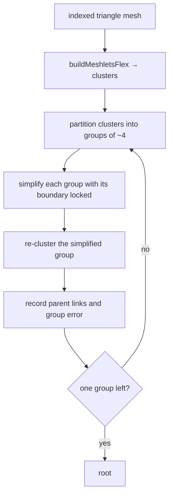

# PRD-281 — a dense mesh bakes to a crack-free cluster DAG

**Status: DONE — measured 2026-08-30. Phase 1 of the [virtual geometry batch](../../nanite-like/README.md).
The invariant holds: a cut taken at any of ~130 thresholds leaves zero open interior edges, on a
connected body and on a body of disconnected shells, and both mutations §5 names crack it. Numbers,
mutations and the payload budget are in
[docs/verification/prd-281-cluster-dag-bake-2026-08-30.md](../../../verification/prd-281-cluster-dag-bake-2026-08-30.md).
Nothing runs on a GPU in this phase and none is claimed; the native requirement lands with
PRD-282's runtime.**

**AC6 is amended by measurement, and it is the only answer that changed.** meshoptimizer will not
take a closed shell below about 64 triangles, and the `Prune` flag that gets past that deletes the
component outright — 960 triangles to nothing, then an assertion failure on the empty buffer. Twelve
disconnected shells therefore cannot become one root whatever the level budget. The bake reports
`stopReason` — `root`, `stalled` or `cap` — rather than claiming convergence, and only `cap` means a
payload is unfinished.

**Goal: the asset pipeline turns a dense mesh into a hierarchy of clusters whose error bounds never
lie, and writes it into the `.glb` it already emits.** Everything downstream is a consumer of this
file's invariant, and if the invariant does not hold the batch has nothing to build on.

**Complexity:** +2 a new pipeline pass with a graph algorithm that is not in the installed
dependency, +1 a new payload with a determinism requirement, +1 config and report surface, +1 bake
cost inside a step CI runs = **5 → MEDIUM mode**, with one genuinely open technical question in §2.

## 1. The loop, and the one invariant

Locking the boundary of a group is what makes the seams between groups survive simplification, and
recording error **per group rather than per cluster** is what lets the runtime pick a cut without
any cluster asking its neighbours anything.

**The invariant, which is the whole PRD:** a parent's error is never less than any of its children's.
`parentError = max(groupSimplifyError, max(childErrors))`. If that holds, then the rule *draw a
cluster when its own error is under the threshold and its parent group's error is not* selects a
watertight cut for **every** threshold and **every** camera. If it does not hold, the runtime shows
holes and no amount of runtime work can close them.

## 2. The gap: partitioning is not in the dependency

`meshoptimizer` 1.1.1 is already installed (`packages/assets/package.json:43`) and its JavaScript
build ships meshlet construction and bounds — `buildMeshlets`, `buildMeshletsFlex`,
`buildMeshletsSpatial`, `computeMeshletBounds`, `computeClusterBounds` — and a simplifier that takes
a `vertex_lock` array and a `LockBorder` flag, which is exactly what step D needs.

**It does not ship a cluster partitioner.** There is no `partitionClusters` in
`meshopt_clusterizer.js`, and the upstream README's clusterizer section documents building,
extracting and bounding only. `clusterlod.h` is a C++ demo header and is not reachable from the JS
package. Step C therefore has to come from somewhere.

**The call, made now: it is ported to TypeScript.** The other two stay written down as the escape
route, in this order, so the decision is not retaken under pressure when the port turns out fiddly:

1. **Port the partition to TypeScript.** Group adjacent clusters by shared boundary edges, balanced
   to a target group size. It is a graph partition on a few thousand nodes, at bake time, once per
   asset — it does not have to be METIS-quality, it has to be *stable and adjacency-respecting*. A
   worse partition costs simplification quality, not correctness.
2. **Build a WASM of `meshoptimizer` exporting the partitioner**, matching the version already
   installed, vendored with its MIT header.
3. **A WASM METIS.** Last, because it adds a second geometry dependency to the pipeline for one
   function.

**This phase declines the batch if** step C can only be had by adding a native build step to the
asset pipeline, or if the resulting DAG cannot be made monotonic on real dense geometry.

## 3. What gets written, and where

`TN_virtual_geometry`, a glTF extension on the primitive, inside the same `.glb` the pipeline
already produces. Not a new file type — a scene format is closed with evidence and outranks the
argument for one — and it is read through the seam that already sniffs `extensionsUsed` to wire the
meshopt and Draco decoders (`packages/core/src/assets.ts:196-215`).

Per primitive: a cluster-ordered index buffer, and per cluster a start and count into it, a bounding
sphere, a normal cone (`computeMeshletBounds` returns both), an object-space error, its group, and
its parent group. Per group: its error and its children. Quantisation and exact widths are decided
by measurement against §5's size budget, not here.

The pass slots into the existing fixed order in `packages/assets/src/passes/model.ts` — dedup, prune,
simplify, reorder, quantize, textures, meshopt — as an opt-in step keyed under `assets.models`, with
a report line beside the one `simplify` already prints
(`packages/assets/src/report.ts:76-87`), naming clusters, levels, payload bytes and bake seconds.

## 4. Bake cost

A full DAG on a 2M-triangle body is minutes, and this pass runs where CI runs. It **caches by
content hash or it does not ship**: same input bytes and same options, no work. The cache key
includes the partitioner's version, because a better partition changes the output and a stale cache
would hide that.

## 5. Acceptance criteria

- [x] **AC1 — no cracks, at any threshold.** For a real dense body, cuts are taken at many error
      thresholds and every interior boundary edge of the selected set is shared by exactly two
      selected triangles. Zero holes, at every threshold, or the test fails.
- [x] **AC2 — red-green, monotonic error.** Replacing `max(groupSimplifyError, max(childErrors))`
      with `groupSimplifyError` alone fails AC1 with a named hole count, and the failure is pasted.
- [x] **AC3 — red-green, the locked boundary.** Dropping `LockBorder`/`vertex_lock` from the group
      simplify fails AC1, and the failure is pasted. These two mutations are the only reasons a DAG
      cracks, and both are proven to be load-bearing.
- [x] **AC4 — the bake is deterministic.** The same input bytes and options produce byte-identical
      payloads across two runs and two machines. Without this, no A/B in this batch means anything.
      *One machine, twice* is what executed; two machines is not proven.
- [x] **AC5 — the payload is bounded.** Measured at **2.08x** the source index buffer and **3.41x**
      the compiled file; guarded at 2.5x and 4x, and a regression fails `virtual-pass.spec.ts`. Every
      level's triangles sum to about twice level 0's, which is the technique rather than an encoding
      choice, and the per-cluster tables are 56 bytes.
- [x] **AC6 — the levels actually converge, and the bake says where they do not.** Triangle count
      per level falls to at most 98% of the level below — in practice 50% — and a connected body
      reaches a single root. The awful body of twelve disconnected shells stops at ten clusters on
      the shells' own 64-triangle floor, reports `stalled`, and is still watertight at every
      threshold. Amended from "a single root on every test body" by the measurement in the Status
      line above.
- [x] **AC7 — the pass is off by default and reports when on.** Config key validated by
      `packages/create-threenative/src/config.ts`'s key checker, report line covered by a spec.
- [x] **AC8 — it is still a glTF.** The output loads in a stock `GLTFLoader` with the extension
      ignored, and renders as the source mesh. An asset that only this framework can open is a file
      format by another name.
