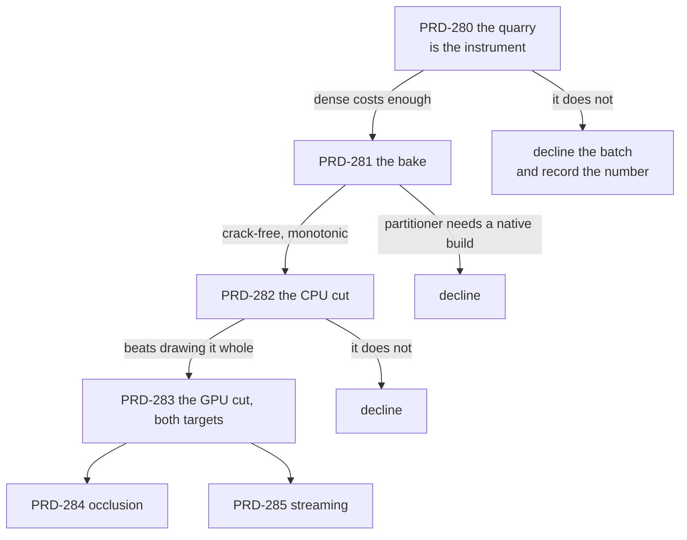

# Batch — virtual geometry ("nanite-like"), opened 2026-08-30

**Status: SHIPPED and ON BY DEFAULT, on browser, with a named native regression. Phases 0 through 2
are done and measured; phase 3 is half done; phases 4 and 5 decline on numbers. Closed 2026-08-30.**

**Closed and archived 2026-08-30.** Every PRD in the batch is done or declined with its number
recorded; PRD-283's last open criterion, the cold-agent install, closed against
[`sandbox/virtual-quarry`](../../../verification/prd-283-cold-agent-install-2026-08-30.md) — which
found `assets.models.virtual` never reaching the pipeline it configures, fixed in `7a44b18c`.

**A game does nothing and gets this.** Any primitive of 65,536 triangles or more bakes to a cluster
DAG, the loader returns a clustered mesh, and the engine cuts it every frame before it renders.
Ordinary props are untouched and compile byte-identically; `assets.models.virtual: "none"` opts out
of the payload entirely. The threshold, the four changes a default demanded, and the arrival hitch
it forced closed are in
[docs/verification/prd-286-virtual-geometry-ships-on-2026-08-30.md](../../../verification/prd-286-virtual-geometry-ships-on-2026-08-30.md).
Engine-driven on the quarry: **1.92 ms of GPU time against `dense`'s 6.97 and `decimated`'s 2.45**.

The pipeline bakes a cluster DAG into the `.glb`
it already emits, and the loader returns a mesh that submits only the clusters the camera can
resolve. On the quarry's route at 1080p on browser WebGPU the `virtual` arm costs **1.28 ms of GPU
time against `decimated`'s 2.45 and `dense`'s 6.97**, submits **7.1 million triangles against 19.7
and 104.5**, and sits closer to the `dense` reference than `decimated` does. It runs on the owned
native runtime from the same source.

**And on native at 720p the ordering inverts**: `virtual` costs 3.05 ms against `decimated`'s 1.64,
with a 649.6 ms `render.p95` on the frame that builds every distance group at once. That is the
open regression this batch leaves behind, and its cause is named: 89 draws instead of 10, and an
arrival that is not spread over frames. Neither is a selection problem, which is why PRD-283's
compute kernel declined rather than shipped.

| what | where |
| --- | --- |
| the instrument, and the price of the problem | [PRD-280's file](../../../verification/prd-280-the-quarry-is-the-instrument-2026-08-30.md) |
| the bake, the invariant, and both mutations | [PRD-281's file](../../../verification/prd-281-cluster-dag-bake-2026-08-30.md) |
| the CPU cut, its numbers, and four defects the run found | [PRD-282's file](../../../verification/prd-282-the-cpu-cut-2026-08-30.md) |
| native, and why the kernel did not ship | [PRD-283's file](../../../verification/prd-283-native-and-the-kernel-2026-08-30.md) |

**What it is.** A game imports a mesh far denser than the screen can resolve, and the frame submits
only the clusters that resolve — on web and on native, from the same source, **with the game's own
material still doing the shading**. The user-facing surface is one key in the asset config, set once
at bake time.

**What it is not.** Not a second renderer, not a scene format, not a preset, and not a visibility
buffer. The last one is the load-bearing decision and it is argued in full in
[PRD-279](./PRD-279-geometry-the-camera-cannot-resolve-is-never-submitted.md): every published
implementation this batch mines resolves materials in a full-screen pass, which means owning the
shading path, which this framework may not do. Dropping it costs performance and is the only reason
the feature is admissible here.

## The PRDs

| # | PRD | Phase | Status |
| --- | --- | --- | --- |
| 279 | [geometry the camera cannot resolve is never submitted](./PRD-279-geometry-the-camera-cannot-resolve-is-never-submitted.md) | the design, the charter argument, the verified state of this repository, the sources | **DONE — the design held** |
| 280 | [the quarry is the instrument](./PRD-280-the-quarry-is-the-instrument.md) | 0 — the game, and the price of the problem | **DONE — open, +13.9 ms** |
| 281 | [a dense mesh bakes to a crack-free cluster DAG](./PRD-281-a-dense-mesh-bakes-to-a-crack-free-cluster-dag.md) | 1 — the baker, offline | **DONE — watertight at every threshold** |
| 282 | [the cut is chosen on the CPU first](./PRD-282-the-cut-is-chosen-on-the-cpu-first.md) | 2 — selection and one indirect draw | **DONE on browser — 1.28 ms against 2.45 ms** |
| 283 | [the cut moves to the GPU and native runs it](./PRD-283-the-cut-moves-to-the-gpu-and-native-runs-it.md) | 3 — compute, and both targets | **DONE — native runs it, the kernel declined, the install proved** |
| 284 | [the frame does not draw what the frame already hid](./PRD-284-the-frame-does-not-draw-what-the-frame-already-hid.md) | 4 — two-pass occlusion | **DECLINED — 1.28 ms is the whole prize** |
| 285 | [clusters arrive when the camera asks for them](./PRD-285-clusters-arrive-when-the-camera-asks-for-them.md) | 5 — streaming | **DECLINED — no asset that does not fit** |

Read 279 first. It holds the charter argument, the table of what this repository already ships
(with file and line), the two facts that are actually blocking, and the licence rules for the
sources. The rest are execution.

## What actually shipped

Two classes in `packages/core` and one pass in `packages/assets`, all reachable from one config key:

| | |
| --- | --- |
| `assets.models.virtual` | **on by default** above 65,536 triangles a primitive; `"none"` opts out, `minSourceTriangles` moves the line. The compile cache keys on it and on `VIRTUAL_BAKE_VERSION` |
| `TN_virtual_geometry` | an optional glTF extension inside the `.glb` the pipeline already emits. A reader that has never heard of it gets the source mesh |
| `ClusteredMesh` | one over-detailed body. `update(camera, viewportHeight)` picks the cut and compacts it into one index range |
| `ClusteredBatch` | many copies of one over-detailed body, grouped by distance, one instanced draw per group |
| `updateClusteredMeshes(root, camera, height)` | what the engine calls itself, before every render. A game only needs it for a subtree the engine does not render |

Measured on the quarry, 3.5 million source triangles: the bake produces 57,041 clusters over 16
levels in 25 seconds, the payload is 2.08× the source index buffer, and the file grows 3.4×.

## What the batch got wrong, and what it cost

Every one of these was found by running the instrument, not by reading the code:

1. **`Uint32BufferAttribute` copies the array it is handed.** Both runtime classes wrote every
   frame's cut into a buffer the GPU never read. The mesh drew a range of zeros — no error anywhere,
   and a frame time that looked like a triumph.
2. **Replacing a geometry's index attribute leaks its GPU buffer**, because three frees
   `geometry.index` only on dispose. That, plus the copy above, leaked one buffer per geometry per
   frame until an 8 GB card reported `VK_ERROR_OUT_OF_DEVICE_MEMORY`.
3. **Disposing a geometry that shares attributes destroys the buffers its siblings draw from.**
   three's dispose handler deletes the *render object's* attributes.
4. **A bake run against a stale `dist` wrote two accessors as `undefined`**, which vanished from the
   glTF JSON and surfaced as a crash inside `GLTFLoader` — 51 MB of file, no canvas, and nothing in
   the playtest report but "could not identify the page renderer kind". Both sides now fail closed
   and name the field.
5. **A screen-space cut needs two spheres per cluster, not one.** Projecting a cluster's own error
   and its parent's through the same bounds cracks the mesh: two clusters that share a seam flip at
   different distances. Each side is projected through the sphere of the group it belongs to.

## Where this goes next, if it goes anywhere

In the order the numbers argue for, not the order the batch planned:

1. ~~**Spread group creation over frames.**~~ Done: bands build four per update, copies borrow the
   nearest built band until theirs arrives, and the batch got the hysteresis the mesh already had —
   without it the engine cutting every frame cost `render.p50` 0.9 ms → 13.45 ms.
2. **Get back to one draw.** 89 draws is what costs the native arm its win. One draw for a whole
   batch needs multi-draw indirect, which is a Chromium experiment with no native counterpart —
   so this is a native binding question, not a renderer question.
3. **Weight normals in the bake.** The cut is chosen on positional error and the shading is lit by
   normals, which is why `virtual` is only barely closer to `dense` than `decimated` is.
4. **A device.** Every number here is desktop. Android and iOS are UNVERIFIED throughout.
5. **A cold-agent install.** PRD-283's AC5 was not done: the `virtual` arm has never been built from
   packed tarballs on a clean machine.

## Decisions taken, so they are not re-argued

Each of these was a real fork. They are settled here; a PRD that wants to reopen one says so in its
Status and gives the measurement that changed the answer.

1. **No visibility buffer, in any phase.** Every source this batch mines resolves materials in a
   full-screen pass, which is the shading path. Taking it would mean the framework decides how a
   virtualized mesh is lit, and it may not. This costs most of the published speedups and buys the
   only thing that makes the feature admissible. Argued in full in PRD-279.
2. **The bake is a config key. There is no runtime flag.** Clustering is turned on under
   `assets.models` in `threenative.config.ts`, the pipeline writes the extension, and the loader
   returns a clustered mesh when it finds one. A game does not ask for this at run time, because a
   minutes-long bake cannot happen at run time and a second way to say the same thing is a second
   thing to get wrong.
3. **The partitioner is ported to TypeScript.** A WASM build of `meshoptimizer` exporting its own
   partitioner is the documented escape if simplification quality measurably suffers, and METIS is
   not on the table for one function. A worse partition costs quality, which is measured; it does
   not cost correctness, which is not negotiable.
4. **Native gets no indirect-dispatch binding.** The dispatch is a fixed size over the cluster table
   and only the *draw* count comes from the GPU. Adding `dispatchWorkgroupsIndirect` means one
   binding on two native paths, the five registrations a new native surface needs, and a census run
   — to save nothing measurable at this scale.
5. **Shadows use one coarse cut, fixed at load.** Selecting a cut per shadow camera doubles the
   selection cost for detail nobody resolves in a shadow, and telling the game to keep its own proxy
   pushes back exactly the work this batch promised to take. It is a known quality limit and the
   visual comparison measures it rather than assuming it away.
6. **The comparison is at equal quality, or it is not a comparison.** Decimating to 5% is cheaper
   *because* it looks worse, so a frame-time race against it is rigged. `dense` is the visual
   reference: `virtual` must beat `decimated` on `render.p50` **and** be closer to `dense` than
   `decimated` is, on the same route frames. Both, or the phase fails.
7. **The instrument is an in-repo example, cross-checked once in a sandbox.** CI and other agents
   have to be able to re-run the number, which a sandbox game outside this repository cannot give.
   But the framework's customer is a cold agent installing tarballs on a clean machine, so the
   `virtual` arm is built once that way before Phase 3 closes.
8. **The opening threshold is 2.0 ms of `render.p50` at 1080p, and it is a floor on the batch, not
   on the phase.** A 60 fps frame is 16.7 ms; 2 ms is 12% of it. A subsystem this size that cannot
   find 12% of a frame on a scene built to flatter it will not find it in a real game.

Left open on purpose, because the answer is not knowable yet: how much of three.js's render pipeline
a depth pyramid can reach without a fork (PRD-284), and whether any game here will ever hold an
asset that does not fit in memory (PRD-285).

## The rules this batch is held to

1. **The game's material draws the clusters.** No framework shader participates. If a phase can only
   be made to work by shading it ourselves, that phase declines.
2. **No new package.** The baker lands in `packages/assets`, which already carries `meshoptimizer`;
   the runtime lands in `packages/core` and imports nothing but `three`. A runtime dependency on
   `meshoptimizer` is a signal to stop and re-scope.
3. **No new file type.** The payload rides inside the `.glb` the pipeline already emits, as the
   `TN_virtual_geometry` glTF extension, read through the seam that already detects meshopt and
   Draco off `extensionsUsed`.
4. **Every phase runs on native in its own commit**, or says `UNVERIFIED` in its Status and means it.
5. **Unity's `com.unity.virtualmesh` is read-only.** Unity Companion License: architecture may be
   read, no code, shader, constant or structure copied. Anyone who opens it says so in the commit
   message. Every other source is MIT and keeps its copyright header when vendored.
6. **A number, or it did not happen.** Each phase writes one file in `docs/verification/` naming
   what executed and what did not.
