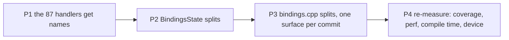

# PRD-230 — the WebGPU bindings move, one surface at a time

**Status:** IMPLEMENTATION COMPLETE — execution began 2026-08-29 after
[PRD-229](./PRD-229-the-native-host-is-provable-before-it-is-moved.md) reached EXECUTED with its
Phase 5 source-text gate at zero files. The pre-move desktop performance and compile baseline is
recorded; Phases 1–3 and Phase 4 are complete, including the physical Pixel 8 lane. The clean-ASan
acceptance row remains open on its two proven inherited failures; no new sanitizer failure appeared.

Second PRD of [the runtime-native refactor batch](./README.md).

**Goal: `src/webgpu/bindings.cpp` stops being one 7,768-line file with 87 anonymous handlers and a
~100-field state struct — with no behaviour change and no performance regression, proved rather
than asserted.**

**Complexity:** +3 (10+ files) +2 (per-frame state, struct layout, cache behaviour) +2 (touches
the file the active perf lane edits weekly) = **7 → HIGH mode.**

## The problem, measured

At `7b729e2d`, from
[the refactor analysis](../../../audits/runtime-native-refactor-analysis-2026-08-28.md):

| Metric | Value |
| --- | ---: |
| `src/webgpu/bindings.cpp` | 7,768 lines |
| Its incremental compile (one TU) | **16 s** (a normal file is 1 s) |
| Handlers named `tnWebgpuHandlerNN` | **87** |
| `BindingsState` fields, one struct | ~100 |
| Commits touching the file in 90 days | 60 |
| Its line coverage (measured 2026-08-28) | **32.14%** |
| Functions over 150 lines in the file | 6 |

The 87 numbered names are an artifact of
[PRD-205](../PRD-205-webgpu-bindings-register-from-a-table-and-get-linted.md)'s
lambda-to-static-function extraction and of PRD-222/224's class-table work. The extraction was
right; the numbering was never a design. An agent grepping `GPUQueue.writeBuffer` in this package
finds nothing today.

`BindingsState` is why the file cannot simply be cut into pieces: device handles, swapchain state,
the sRGB presentation bridge, screenshot capture, canvas-2D compositing, eight resource registries
with their id counters, frame-op-stream replay bookkeeping and twelve profiling counters all live
in one struct, so every candidate module needs the whole thing. **Phase 2 is the load-bearing one.**

## Solution

Three behaviour-preserving moves, in an order where each is verifiable on its own, then a
re-measure. **No function body is edited in this PRD.** Renames change identifiers; splits move
whole functions. A change that needs to alter logic is out of scope and gets its own PRD.

**Key decisions:**

- **Purity is asserted mechanically, not promised.** Phase 1 passes only if `git diff -w
  --word-diff` shows identifier changes and nothing else. Phase 3 passes only if the diff reads as
  moves.
- **`render.p50` within 2% of PRD-229's recorded baseline**, and no `TN_HOST_GAP` sub-phase shifting
  its share by more than 2 points. Desktop fps is not a gate — the Xvfb present throttle pins it.
- **One surface per commit in Phase 3**, each with its own checkpoint, so a regression is bisectable
  to one surface rather than to a 7,768-line rewrite.

**Data changes:** none. No field is added, removed, renamed in meaning, or given a different
default; no public API, wire format or JS-visible shape changes.

## Integration Ledger

| # | New thing | Live caller (`file:line`, non-test) | Replaces | Old path removed? | Negative control |
|---|---|---|---|---|---|
| 1 | Renamed handler symbols (87) | `installWebGPUBindingTables` registration rows | `tnWebgpuHandlerNN` | yes, same commit | `git diff -w --word-diff` shows identifier changes only |
| 2 | `BindingsState` sub-structs | every `bindings.cpp` accessor | the flat ~100-field struct | yes, same commit | the compiler, plus PRD-229 Phase 5's behaviour tests |
| 3 | Per-surface `bindings_*.cpp` TUs | `CMakeLists.txt` `target_sources` | monolith sections | yes, per surface | per-surface behaviour tests stay green; single-TU compile time drops |

### Reachability

Every symbol here is already reached — this PRD moves code that the frame loop calls on every
frame. The wiring question is inverted: the risk is not dead code, it is a *live* path changing
behaviour while the suite stays green. That is what PRD-229 exists to prevent, and why this PRD
cannot start before it.

## Execution phases

Every phase: at least one pre-existing file edited, one automated checkpoint
(`prd-work-reviewer`) before the next starts.

---

#### Phase 1: The 87 handlers get their names back

**Only starts when PRD-229 is green.** Every phase here is a behaviour-preserving move under the
instruments PRD-229 built.

**Files:** `src/webgpu/bindings.cpp` (EDIT), the record. One commit.

**Implementation:**
- [x] Each `tnWebgpuHandlerNN` takes the name of the surface and method its registration row already
      declares — `handleGpuQueueWriteBuffer`, `handleHtmlCanvasElementGetContext`, and so on. The
      mapping is derivable from the `bindingTable({…})` row that references it.
- [x] `readability-identifier-naming` from PRD-229 Phase 4 keeps the new convention.

**Verification (mechanical — this is the point of the phase):**
- [x] `git diff -w --word-diff` contains **identifier changes only** — no reordered, added or
      removed statements. Pasted into the record.
- [ ] Every PRD-229 Phase 5 behaviour test green; `ctest` green; ASan lane green. Behaviour and
      CTest are at their inherited bars; ASan retains two proven pre-existing failures, so this
      combined row is not claimed green.
- [x] Coverage unchanged within noise. A rename cannot change coverage; a drop means something else
      moved.

**Revert check:** the phase changes no behaviour, and that is asserted rather than assumed — the
identifier-only diff check above is the assertion.

---

#### Phase 2: `BindingsState` becomes cohesive sub-structs

**Files:** `src/webgpu/bindings_state.h` (EDIT), `src/webgpu/bindings.cpp` (EDIT),
`src/webgpu/registration_table.cpp` / `wrapper_factories.cpp` (EDIT as needed), the record.
One commit.

**Implementation:**
- [x] Group the ~100 fields into `ResourceRegistries`, `PresentationState`, `FrameProfiling`,
      `ScreenshotCapture`, `Canvas2DComposite`; device and engine handles stay at the top level.
- [x] Access becomes `state->registries.textureRegistry`. The compiler finds every site.
- [x] `#if TN_ANDROID_JS_PROFILE` members move inside `FrameProfiling`, so the struct's conditional
      shape stops leaking into the top level.
- [x] **No field is added, removed, renamed in meaning, or given a different default.** Field
      *placement* changes; field *identity* does not.

**Verification:** PRD-229 Phase 5 behaviour tests, `ctest`, ASan lane, coverage floors, and the perf A/B
against the PRD-229 Phase 6 baseline. Struct layout affects cache behaviour, so the A/B is **mandatory
here**, not optional.

**Revert check:** the PRD-229 Phase 5 tests cover every property the state struct serves; reverting the
split leaves them green (it is a pure refactor) while a *wrong* split reds them.

---

#### Phase 3: `bindings.cpp` splits, one surface per commit

**Not one phase — one commit per surface, each with its own checkpoint.** Ordered so the most
independent surfaces move first and the most churned move last:

1. `bindings_canvas2d_composite.cpp` — the 325-line compositor, most self-contained
2. `bindings_screenshot.cpp`
3. `bindings_presentation.cpp` — surface acquire, sRGB bridge, present
4. `bindings_resources.cpp` — buffer/texture/view/sampler creation and registries
5. `bindings_pipelines.cpp` — shader modules, pipelines, bind groups
6. `bindings_commands.cpp` — encoder, render and compute passes
7. `bindings_frame_stream.cpp` — packed replay
8. `bindings.cpp` — what remains: install tables, device/adapter, state lifecycle

**Files per commit:** the new TU, `bindings.cpp`, `CMakeLists.txt` (`target_sources`), the record.

**Implementation per commit:**
- [x] Functions move **verbatim**. If a body must change to compile, the change is a shared header
      declaration or a namespace qualification — never logic.
- [x] The diff is reviewed as move-only: exact extracted-body comparisons were empty after only
      linkage qualifiers and private declarations were accounted for.

**Verification per commit:** `ctest`, ASan lane, PRD-229 Phase 5 behaviour tests, coverage floors, the perf
A/B — and the payoff measurement: **single-TU compile time, recorded per commit**, starting from the
measured 16 s.

**Revert check:** each surface's behaviour tests exist before its move (PRD-229 Phase 5 ordered them that
way); reverting a move leaves them green, breaking a move reds them.

---

#### Phase 4: Re-measure, and say what did not run

**Files:** `docs/verification/native-coverage-*.md` (EDIT), `runtime-perf-state.md` (EDIT),
`native-runtime-census-2026-08-16.md` (EDIT via `pnpm census` — generated, never retyped), this
PRD's evidence section.

- [x] Coverage after vs before, per subsystem.
- [x] `render.p50` and `TN_HOST_GAP` shares after vs before, same command, same machine.
- [x] Single-TU compile times after vs before.
- [x] **Device lane**: a Pixel 8 run is the only thing that can speak to fps. If no device run
      happens, this PRD records **"no device result claimed"** and stays open on that row rather
      than closing on desktop evidence.

## Acceptance criteria

Consumer-scoped.

- [x] **An agent grepping `GPUQueue.writeBuffer` in `packages/runtime-native/src` finds the handler
      that implements it.** (Phase 1)
- [x] **A developer editing one WebGPU surface rebuilds one TU, not 7,768 lines** — compile time
      recorded per surface, against the measured 16 s. (Phase 3)
- [x] **`render.p50` after the last split is within 2% of PRD-229's recorded pre-refactor
      baseline**, and no `TN_HOST_GAP` sub-phase moved more than 2 points of share. (Phases 2–4)
- [x] **`pnpm parity` reports the same conformance rows green as before the batch**, with no row
      newly blocked. (Every phase)
- [x] **Native line coverage did not drop** — the PRD-229 floors hold at every phase. (Every phase)
- [ ] **The ASan lane is green at every phase**, so no move introduced a lifetime bug that exit
      codes would have hidden. (Every phase) The final lane remains 4/6: the same inherited Dawn
      sampler leak and shutdown-reentrancy SEGV; no new sanitizer failure appeared.

**Integration gates (unchecked = not done):**

- [x] Integration Ledger has zero `TBD` cells
- [x] Revert check passed per phase
- [x] Every gate observed red at least once, with the mutation named
- [x] `pnpm census` regenerated in the commit that changes native line counts
- [x] No vitest file still asserts on the source text of a file this PRD moved

## Risks, and what makes this PRD fail

| Risk | Mitigation |
| --- | --- |
| **The tree is under active perf work** — 60 commits in 90 days on this file, 23 on `bindings_state.h`. A wide mechanical diff rots in hours. | Each phase lands as a single commit in one sitting, on a day the perf lane is paused. Coordinate with PRD-227/228 before starting. |
| **A "pure refactor" that is not pure.** | Phase 1's identifier-only diff check; Phase 3's move-only diff review; behaviour tests exist before each move, never after. |
| **Struct-layout perf regression in Phase 2.** | Mandatory perf A/B at that phase; 2% budget; revert rather than explain. |
| **A surface split that quietly changes initialization order.** | One surface per commit, each with the full gate set, so the regression is bisectable to one move. |
| **Starting before PRD-229 is green.** | This is the failure mode the batch exists to prevent. A phase started early has no instrument and its green means nothing. |

## Verification evidence

Filled during implementation. Nothing is claimed until it has executed and been pasted.

### Phases 1–4

- Pre-move baseline — PASS at `df797b7cac5e0a211f5d32c6cd522ecfc101d36e`: native-smoke
  produced three 300-frame windows; steady `render.p50` was 1.3 / 1.2 ms and the incremental
  `bindings.cpp` compile plus link was 17.09 s. Exact command, machine state, every required
  `TN_HOST_GAP` sub-phase and its share are in
  [`runtime-perf-state.md`](../../../verification/runtime-perf-state.md).
- Phase 1 — PASS with no attributable regression. The tokenized `git diff -w --word-diff` contained
  87 `tnWebgpuHandlerNN` OLD tokens, 87 descriptive `handle*` NEW tokens, and no other changes.
  Negative control: adding `static_assert(true);` made the purity gate exit 1 with
  `unexpected NEW token: static_assert(true);`; after removal it printed
  `PASS: identifier changes only`. Shipping compilation passed; CTest passed 27/27 with one
  explicitly disabled target. Phase-5 behavior tests held their inherited result: 99 passed,
  2 skipped, and only the documented crash-policy regex failed. Native coverage was byte-for-byte
  equal in counts at total 35.70%, `src/webgpu/` 40.66%, and `src/runtime.cpp` 39.97%.
- Phase 1 sanitizer attribution — the lane reported 4/6 pass. Besides the documented reentrancy
  shutdown SEGV, `threenative-bindings-creation-test` reported a Dawn sampler/queue leak. The
  identifier patch was mechanically reversed, the committed pre-Phase-1 source was rebuilt in the
  same ASan directory, and the same test still failed with the same sampler allocation (4,110
  leaked bytes in that control). The patch was then restored at 87/87 definitions. This is an
  inherited lane failure, not a Phase-1 regression; the ASan acceptance checkbox remains open.
- Phase 1 performance — PASS. The identical native-smoke command retained steady `render.p50`
  1.3 / 1.2 ms (0% change); the largest required host-gap share shift was 0.052 points. Exact
  sub-phases are in [`runtime-perf-state.md`](../../../verification/runtime-perf-state.md).
- Phase 1 parity — no attributable regression. The full run recorded web 72 pass / 0 fail / 1
  blocked, desktop 69 pass / 2 fail / 2 blocked, and Android 0 pass / 0 fail / 73 blocked because
  no device lane was available. The two desktop failures were `25-camera-parented-overlay` and
  `61-offscreen-screenshot`. For the control, all 87 renames were mechanically reversed, the
  committed pre-Phase-1 source was rebuilt, and those same two isolated rows failed again. The
  rename patch was restored and the shipping host rebuilt successfully.
- Phase 2 compile and behavior — PASS at the inherited bar. Before consumer migration, the shipping
  build red with missing flat members in all four production consumers; after nested-path migration,
  the shipping host and every native-test target built. CTest passed 27/27 enabled targets. The
  runtime-native suite recorded 84 files passing, 605 tests passing and 33 skipped; only the two
  inherited crash-policy regex tests failed. The changed source-shape contracts passed 22/22. A
  fresh `TN_ANDROID_JS_PROFILE=ON` configuration built `mystral-runtime` with both Dawn and
  wgpu-native, proving the moved conditional members and upload-staging registry compile when
  present.
- Phase 2 sanitizer and coverage — no attributable regression. The sanitizer lane retained exactly
  its two inherited failures (Dawn sampler leak and shutdown reentrancy SEGV), with the other 4/6
  targets passing. Coverage executed 25 targets with 2 blocked and rose to total 35.76%,
  `src/webgpu/` 40.68%, while `src/runtime.cpp` held 39.97%.
- Phase 2 performance — PASS. The identical native-smoke command produced steady `render.p50`
  1.2 / 1.2 ms; the largest required host-gap share shift from the pre-move baseline was 0.078
  points. Exact sub-phases are in [`runtime-perf-state.md`](../../../verification/runtime-perf-state.md).
- Phase 2 census and kill switch — PASS. `pnpm census` regenerated the native record at 109,232
  total lines; `pnpm budgets` passed. `pnpm tsx scripts/count-loc.ts` reported the unchanged
  platformer template at 1,955 lines and generated HUD at 61 lines (geometry HUD 69).
- Phase 2 parity — no regression. The full run matched Phase 1 exactly: web 72 pass / 0 fail / 1
  blocked, desktop 69 pass / 2 fail / 2 blocked with the same `25-camera-parented-overlay` and
  `61-offscreen-screenshot` failures, and Android 0 pass / 0 fail / 73 blocked because no device
  lane was available. No row became newly blocked.
- Phase 3.1 Canvas2D compositor — PASS at the inherited bar. The 327-line
  `compositeCanvas2DToWebGPU` body moved byte-for-byte into
  `bindings_canvas2d_composite.cpp`; omitting the new TU from CMake red-linked at the existing
  `endDawnFrame` caller, then the registered TU built the shipping host. CTest passed 27/27 enabled
  targets; the runtime-native suite retained 84 files passing, 605 tests passing, 33 skipped and
  only its two inherited crash-policy regex failures. ASan retained its inherited 4/6 bar. Coverage
  held exactly at 35.76% total, 40.68% WebGPU and 39.97% `runtime.cpp`.
- Phase 3.1 payoff and performance — the isolated Canvas2D TU rebuild plus archive/link measured
  22.32 s versus the 17.09 s monolith baseline, so this first split has not yet produced the claimed
  compile-time payoff. The first performance sample measured 1.5 / 1.5 ms and was rejected; after
  the parity workload finished, an idle repeat measured steady `render.p50` 1.0 / 1.0 ms and a
  largest required host-gap share shift of 0.217 points, passing the guard. Exact data is in
  [`runtime-perf-state.md`](../../../verification/runtime-perf-state.md).
- Phase 3.1 parity and census — no regression. Full parity matched Phases 1–2 exactly: web 72/0/1,
  desktop 69/2/2 with the same two inherited failures, and Android 0/0/73 because no device lane was
  available. `pnpm census` recorded 109,263 total lines; budgets and the kill switch passed.
- Phase 3.2 screenshot capture — PASS at the inherited bar. Screenshot accessors and the capture
  body moved verbatim into `bindings_screenshot.cpp`; only `captureFrameScreenshot` changed from
  internal static linkage to a declaration in the private `bindings_state.h`. Omitting the TU from
  CMake red-linked at the runtime, context and frame-boundary callers; after registration the
  shipping host linked, focused screenshot tests passed 9/9, and CTest passed 27/27 enabled targets.
  Runtime-native and ASan retained their inherited bars. Coverage rose to 35.84% total and 40.91%
  WebGPU while `runtime.cpp` held 39.97%.
- Phase 3.2 payoff and performance — PASS. The screenshot TU rebuild plus archive/link measured
  5.04 s versus the 17.09 s monolith baseline. Steady `render.p50` measured 1.0 / 1.0 ms; the
  largest required host-gap share shift was 0.264 points. Exact data is in
  [`runtime-perf-state.md`](../../../verification/runtime-perf-state.md).
- Phase 3.2 parity and census — full parity retained the existing web 72/0/1, desktop 69/2/2 and
  Android 0/0/73 bars. The census recorded 109,300 lines; budgets and the kill switch passed.
- Phase 3.3 presentation — PASS at the inherited bar. Surface acquire, resize, sRGB bridge,
  presentation pacing and present reporting moved verbatim into `bindings_presentation.cpp`; only
  cross-TU linkage and private declarations changed. Omitting the TU from CMake red-linked at the
  existing callers; after registration, focused presentation tests passed 47/47 and CTest passed
  27/27 enabled targets. Runtime-native and ASan retained their inherited bars. Coverage held the
  Phase 2 floor at 35.76% total, 40.68% WebGPU and 39.97% `runtime.cpp`.
- Phase 3.3 payoff and performance — PASS. The presentation TU rebuild plus archive/link measured
  6.05 s versus the 17.09 s monolith baseline. Steady `render.p50` measured 1.0 / 1.0 ms; the
  largest required host-gap share shift was 0.296 points. Exact data is in
  [`runtime-perf-state.md`](../../../verification/runtime-perf-state.md).
- Phase 3.3 parity and census — full parity retained the existing web 72/0/1, desktop 69/2/2 and
  Android 0/0/73 bars. The census recorded 109,370 lines; budgets and the kill switch passed.
- Phase 3.4 resources — PASS at the inherited bar. Buffer, texture, texture-view and sampler
  creation, mapping, accounting and registry bodies moved verbatim into `bindings_resources.cpp`;
  the captured-handler templates moved verbatim into a private shared header. Omitting the TU from
  CMake red-linked only at moved symbols; after registration, resource-focused tests passed 55/55
  and CTest passed 27/27 enabled targets. Runtime-native and ASan retained their inherited bars.
  Coverage rose to 35.84% total and 40.89% WebGPU while `runtime.cpp` held 39.97%.
- Phase 3.4 payoff and performance — PASS. The resource TU rebuild plus archive/link measured 5.83
  s versus the 17.09 s monolith baseline. Steady `render.p50` measured 1.0 / 1.0 ms; the largest
  required host-gap share shift was 0.265 points. Exact data is in
  [`runtime-perf-state.md`](../../../verification/runtime-perf-state.md).
- Phase 3.4 parity and census — full parity retained the existing web 72/0/1, desktop 69/2/2 and
  Android 0/0/73 bars. The census recorded 109,445 lines; budgets and the kill switch passed.
- Phase 3.5 pipelines — PASS at the inherited bar. Shader modules, pipeline layouts, bind-group
  layouts, bind groups, compute/render pipelines and pipeline registries moved verbatim into
  `bindings_pipelines.cpp`; only six handler linkage qualifiers and private declarations changed.
  Omitting the TU from CMake red-linked only at moved symbols; after registration, focused tests
  passed 47/47 and CTest passed 27/27 enabled targets. Runtime-native and ASan retained their
  inherited bars. Coverage remained above the pre-move bar at 35.75% total and 40.67% WebGPU while
  `runtime.cpp` held 39.97%.
- Phase 3.5 payoff and performance — PASS. The pipeline TU rebuild plus archive/link measured 8.13
  s versus the 17.09 s monolith baseline. Steady `render.p50` measured 1.0 / 1.0 ms; the largest
  required host-gap share shift was 0.267 points. Exact data is in
  [`runtime-perf-state.md`](../../../verification/runtime-perf-state.md).
- Phase 3.5 parity and census — full parity retained the existing web 72/0/1, desktop 69/2/2 and
  Android 0/0/73 bars. The census recorded 109,497 lines; budgets and the kill switch passed.
- Phase 3.6 commands — PASS at the inherited bar. Render-bundle, query-set, command-encoder,
  render-pass and compute-pass bodies moved verbatim into `bindings_commands.cpp`; only three
  handler linkage qualifiers and private declarations changed. Omitting the TU from CMake
  red-linked only at those moved entry points; after registration, focused tests passed 57/57 and
  CTest passed 27/27 enabled targets. Runtime-native and ASan retained their inherited bars.
  Coverage held at 35.75% total and 40.67% WebGPU while `runtime.cpp` held 39.97%.
- Phase 3.6 compile and performance — mixed. The 1,681-line command TU rebuild plus archive/link
  measured 19.29 s, 12.9% slower than the 17.09 s monolith baseline, so no compile-time payoff is
  claimed for this surface. Performance passed at steady `render.p50` 0.7 / 0.9 ms; the largest
  required host-gap share shift was 1.106 points, below the two-point rejection threshold. Exact
  data is in [`runtime-perf-state.md`](../../../verification/runtime-perf-state.md).
- Phase 3.6 parity and census — full parity retained the existing web 72/0/1, desktop 69/2/2 and
  Android 0/0/73 bars. The census recorded 109,553 lines; budgets and the kill switch passed.
- Phase 3.7 frame stream — PASS at the inherited bar. `PackedFrameReader` and the 374-line
  `replayPackedFrameOpStream` body moved verbatim into `bindings_frame_stream.cpp`; only the
  existing upload-staging helper's linkage and a private declaration changed. Omitting the TU from
  CMake red-linked only at the moved replay symbol; after registration, focused tests passed 21/21
  and CTest passed 27/27 enabled targets. Runtime-native and ASan retained their inherited bars.
  Coverage held at 35.75% total and 40.67% WebGPU while `runtime.cpp` held 39.97%.
- Phase 3.7 payoff and performance — PASS. The frame-stream TU rebuild plus archive/link measured
  8.04 s, 53.0% faster than the 17.09 s monolith baseline. A 1.3 / 1.3 ms sample taken while an
  unrelated SwiftShader process consumed about 850% CPU was rejected. After that workload exited,
  steady `render.p50` measured 1.2 / 1.2 ms and the largest required host-gap share shift was 1.099
  points. Exact data is in [`runtime-perf-state.md`](../../../verification/runtime-perf-state.md).
- Phase 3.7 parity and census — full parity retained the existing web 72/0/1, desktop 69/2/2 and
  Android 0/0/73 bars. The census recorded 109,605 lines; budgets and the kill switch passed.
- Phase 3.8 retained surface — PASS. The final `bindings.cpp` intentionally retains state and
  upload-staging lifecycle, profiling, compatibility/canvas installers, queue/device/adapter
  handlers, binding tables and frame boundaries. All seven extracted TUs are registered beside it
  in CMake. It is 2,937 lines, down 4,933 lines (62.7%) from the measured 7,870-line start, and its
  isolated rebuild plus archive/link measured 9.50 s, 44.4% below the 17.09 s baseline. There was
  no eighth move, so no new CMake-omission control applies; the seven actual moves each red-linked
  before registration.
- Phase 4 final desktop comparison — PASS at the inherited bar. Coverage moved from 35.70% to
  35.75% total, from 40.66% to 40.67% for `src/webgpu/`, and held at 39.97% for `runtime.cpp`.
  Final steady `render.p50` was 1.2 / 1.2 ms versus 1.3 / 1.2 ms before the refactor, and the
  largest required host-gap share shift was 1.099 points. Per-surface compile times were 22.32,
  5.04, 6.05, 5.83, 8.13, 19.29 and 8.04 s; the retained remainder measured 9.50 s. Full parity
  remained web 72/0/1, desktop 69/2/2 and Android 0/0/73; the Phase-5 source-text gate remained at
  zero files. Final CTest was 27/27, runtime-native retained 84 passing files / 605 passing tests /
  33 skipped with two inherited regex failures, and ASan retained its inherited 4/6 bar.
- Phase 4 device lane — PASS on a physical Pixel 8 (`shiba`) over Wi-Fi ADB while unplugged. The
  V8 APK (`com.threenative.game`, SHA-256
  `3a743288c670c0598d754554da0969f20d124ca44959a4122ddcfd3ffcc35271`) passed the 300-frame
  first proof with a nonblank 1080x2400 screenshot. After discarding the startup window, seven
  300-frame windows held **59.77–59.99 fps**, `render.p50` **4.8–5.3 ms**, and zero hitches. The
  device was discharging with thermal status `NONE` before and after (36.7 -> 38.5 °C skin).
  Building this lane exposed missing wgpu-native declarations in the two split translation units;
  the red contract and conditional headers landed at `4ac7b273`, after which Android and desktop
  rebuilt and all 30 enabled CTests passed. The pinned V8 dependency still fails its separate 16 KB
  page-alignment guard; this Pixel reports a 4 KB page size, so that upstream compatibility blocker
  does not invalidate this run and is not claimed fixed.
- Post-merge reconciliation — PASS at `f419a46b`. Root tests passed 255 files / 2,549 tests with
  one file and three tests skipped. The rebuilt shipping host passed 30/30 enabled CTests; native
  coverage rose to 38.50% total, held at 40.67% for `src/webgpu/`, and rose to 42.01% for
  `runtime.cpp`. ASan reproduced only the same two inherited failures and passed 4/6 targets.
  Parity remained web 72/0/1, desktop 69/2/2 and Android 0/0/73; the census was current at 111,050
  lines. The idle desktop meter passed at steady `render.p50` 1.0 / 1.2 ms with a maximum required
  host-share shift of 1.231 points. Typecheck passed across all 17 applicable workspace projects;
  lint exited zero with no errors. Budgets and documentation links passed. The physical Pixel was
  reachable over Wi-Fi ADB but still charging over its attached USB cable, so this reconciliation
  does not close or claim the device row.
- Final device-fix reconciliation — PASS at `e4b9a076`. After the Android-only compile defect was
  fixed and the physical lane closed, `pnpm test` passed 255 files / 2,549 tests with one file and
  three tests skipped. `pnpm typecheck` passed all 17 applicable workspace projects; `pnpm lint`
  exited zero with no errors and 452 existing warnings. Documentation links, primary-doc tests,
  budgets, coverage floors, 30/30 enabled CTests, and the regenerated 111,083-line census passed.
  ASan remained exactly 4/6 on its two documented inherited Dawn failures, so the clean-ASan row
  remains honestly open while the no-new-regression claim is closed.
