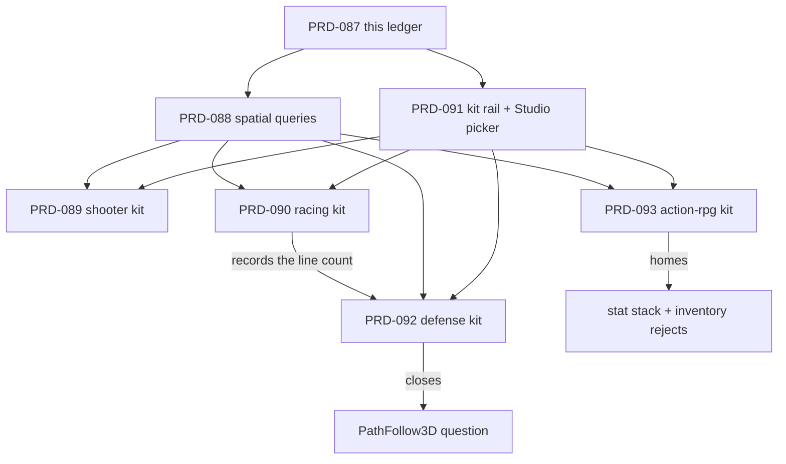

# PRD-087 — Genre borrow ledger: what seven shipped open-source games converge on, and which one of it belongs in the framework

**Status: CLOSED WITH EXPLICIT BOUNDARIES, 2026-08-31.** The genre-borrow ledger and platformer
qualification are delivered; the starter-kit continuation is recorded in
[`docs/verification/starter-kits-linchpin-resume-2026-08-31.md`](../../../verification/starter-kits-linchpin-resume-2026-08-31.md).
Child-kit implementation evidence remains with the child PRDs named by this ledger.
The external-repository claims remain a file listing or source file fetched from GitHub on
2026-08-12 and cited by path. The platformer Phase 2 deliverable below was executed in
`/home/joao/projects/threejs-webgpu/.worktrees/starter-kit-087-r5-20260812` on branch
`linchpin/starter-kit-087-r5-20260812`, based on `d83ce20c252ff1fc6ab1c4dec145a5fe9ad12067`;
the exact local results are recorded in `.linchpin/starter-kit-087-gates.md`. The cumulative
batch result is recorded in
[`docs/verification/starter-kits-batch-2026-08-12.md`](../../../verification/starter-kits-batch-2026-08-12.md).
The four child kit PRDs were executed in separate lanes; their blind visual score and mobile
execution remain outside this batch's claims.

**This is the parent of six PRDs.** It carries the method and the verdicts so none of them
re-argues these.

| PRD | Delivers | Depends on |
|---|---|---|
| PRD-087 | platformer terminal-loop qualification repair | existing platformer template; no child-PRD dependency |
| [PRD-088](../../BLOCKED/requires-ray-measurement/PRD-088-physics-spatial-queries.md) | physics spatial queries — the one accepted package change | — |
| [PRD-091](../PRD-091-genre-kit-delivery-rail.md) | the kit registry, the fail-closed gate, the Studio picker | — |
| [PRD-089](../PRD-089-shooter-starter-kit.md) | `shooter` starter kit | 088, 091 |
| [PRD-090](../PRD-090-racing-starter-kit.md) | `racing` starter kit | 088, 091 |
| [PRD-092](../PRD-092-strategy-starter-kit.md) | `defense` starter kit; **closes the `PathFollow3D` question** | 088, 091, 090 |
| [PRD-093](../PRD-093-action-rpg-starter-kit.md) | `action-rpg` starter kit; **homes the two hardest rejects** | 088, 091 |

**Build order: 088 and 091 first, in parallel. Then 089, 090, 092, 093 in that order** — 092
consumes 090's measurement, and 093 is last because it is the largest.

## The question

The framework ships one genre template (`platformer`) and two generic ones (`minimal`,
`starter`). The open question is what a *second* and *third* genre would need that we do not
ship — and whether the answer is package code or generated user source.

## What ships at the end of this programme

**Five genre starter kits**, not five templates. The distinction is the deliverable:

| | Template (what we ship today) | Starter kit (what these PRDs ship) |
|---|---|---|
| What boots | a scene with a character in it | a game with a win condition and a fail condition |
| What the user does | walks around | plays, loses, wants another go |
| What they edit first | an entity, to make something happen | a system, to change something that already happens |
| Reachable from | `npx create-threenative --template <name>` | `npx`, **and the live Studio's picker** |
| Quality bar | boots | boots, plays, and clears the blind visual floor |

Every qualifying kit clears the same two gates, and neither is a new invention:

- **Functional** — a playtest that drives the real build through the game's own loop and
  asserts each transition. Not "it booted".
- **Looks good** — `scripts/visual-gate.ts` already encodes this and it is not vibes: the six
  `RENDER_LAYER_FILES` under `src/render/` each with a live importer, a palette of at most six
  named colours with exactly one `accent`, `materials.ts` and `sky.ts` importing `palette.js`,
  a key and a rim `DirectionalLight` plus a fill, `PCFSoftShadowMap`, `normalBias`, and
  `toneMapping` / `toneMappingExposure` / `setOutputNode` / `bloom(` in post — then a blind
  1–5 score at or above `VISUAL_SCORE_FLOOR = 4` (`scripts/visual-gate.ts:29`).

**Genre coverage, and the one deliberately left out.** The existing platformer is the fifth-genre
qualification leg, completed by the terminal-loop deliverable in Phase 2 below; shooter, racing,
tower defense and action-RPG are PRDs 089, 090, 092 and 093.
**Survival/sandbox is surveyed here and not built.** Luanti's `emerge.h`, `mapblock.h` and `mapgen/` are chunked world
streaming, which is a programme in its own right and overlaps the terrain work already
underway. Scoping it out is a decision with a reason, not an oversight.

Guessing that question wrong is the failure mode this repo already paid for once: v1 owned
materials, lights and post, and scored **worse** than vanilla Three.js on the blind rubric.
So the survey is deliberately not "what would be convenient". It is: **which capability do
several independent, shipped games in different genres each implement from scratch, and does
vanilla Three.js already answer it?** A capability that seven codebases each wrote by hand is
validated by seven shipping games. A capability only one wrote is a genre feature.

## 1. Why this is user value and not tidying

Today a user's agent can build a platformer, because we shipped that template and playtested
it. It cannot build a shooter. Not "would find it awkward" — **cannot**, in the literal
sense: there is no way to ask the physics world a question.

```
$ git grep -n "castRay\|intersectRay\|intersectShape\|intersectPoint" f9de41f -- packages/physics/src/index.ts
$   # no output. The public physics surface has no query of any kind.

$ git grep -n -E "const target = this.#player.mesh.position|const targetDistance = position.distanceTo\(target\)" f9de41f -- packages/create-threenative/templates/platformer/src/entities/Chaser.ts
f9de41f:packages/create-threenative/templates/platformer/src/entities/Chaser.ts:39:    const target = this.#player.mesh.position;
f9de41f:packages/create-threenative/templates/platformer/src/entities/Chaser.ts:45:    const targetDistance = position.distanceTo(target);
```

`ScenePicker.raycast` (`packages/core/src/picking.ts:62`) is a **Three.js mesh raycast**. It
returns a `THREE.Intersection`, walks the scene graph, and knows nothing about collision
layers, sensors, or the capsule collider that is the actual shape of a character. It is the
right tool for "what did the user click". It is the wrong tool, and on native an
increasingly wrong tool, for "did this bullet hit anything".

The workaround is visible in our own generated source. `packages/create-threenative/templates/platformer/src/entities/Chaser.ts`
holds a direct TypeScript reference to the player object and brute-forces distance in JS:

```ts
// packages/create-threenative/templates/platformer/src/entities/Chaser.ts:39 and :45
const target = this.#player.mesh.position;
...
const targetDistance = position.distanceTo(target);
```

That works because the platformer has exactly one target, known at construction. It does not
generalise to *n* enemies, to line-of-sight, or to "the nearest hostile within 6 m" — the
verb every codebase below implements. **A framework that ships physics but no spatial query
has shipped the bodies and withheld the questions.**

## 2. Method

Seven codebases, chosen one per genre, each shipped and each readable. Listings fetched from
the GitHub contents API on 2026-08-12; the three marked ✱ also had a source file read.

| Genre | Repository | Path surveyed |
|---|---|---|
| 2D platformer | `SuperTux/supertux` | `src/object/` |
| Arena FPS | `id-Software/Quake-III-Arena` | `code/game/` |
| Kart racing | `supertuxkart/stk-code` ✱ | `src/karts/`, `src/tracks/`, `src/tracks/track_sector.hpp` |
| RTS | `OpenRA/OpenRA` ✱ | `OpenRA.Mods.Common/Traits/`, `Traits/AutoTarget.cs` |
| RTS | `0ad/0ad` | `binaries/data/mods/public/simulation/components/` |
| Action RPG | `flareteam/flare-engine` | `src/` |
| Survival / voxel | `luanti-org/luanti` ✱ | `src/`, `src/craftdef.h` |
| (control) | `godotengine/godot-demo-projects` | `3d/` |

Godot's demo set is the control, not a survey subject: it is where the borrowed vocabulary
comes from, and its `3d/` directory contains `kinematic_character`, `platformer`,
`truck_town`, `squash_the_creeps`, `waypoints`, `navigation`, `navigation_mesh_chunks` and
`voxel` — the same genre spread, arrived at independently.

Genre selection is scoped to what a 3D WebGPU-and-native framework can serve. The itch.io
jam literature puts Puzzle, Platformer, Interactive Fiction and Action at the top of
high-ranking submissions; Interactive Fiction and most Puzzle entries are not 3D-engine
work, so the six 3D-shaped genres above are what the survey covers.

## 3. What they converge on

A row is a capability. A populated cell is the repository-rooted file where that codebase
implements it; `none — ...` is an explicit negative finding. **Convergence across genres,
not popularity within one, is the whole signal.**

| Capability | SuperTux | Quake III | SuperTuxKart | OpenRA | 0 A.D. | Flare | Luanti |
|---|---|---|---|---|---|---|---|
| **Spatial query** (ray / radius / shape) | `src/collision/collision_system.cpp` | `code/game/g_weapon.c`, `code/game/g_combat.c` (`G_RadiusDamage`) | `src/physics/btKartRaycast.cpp` | `OpenRA.Mods.Common/Traits/AutoTarget.cs` → `FindActorsInCircle` | `binaries/data/mods/public/simulation/components/Attack.js`, `binaries/data/mods/public/simulation/components/UnitAI.js` | `src/HazardManager.cpp`, `src/Hazard.cpp` | `src/collision.cpp` |
| **Path / route following** | `src/object/path_walker.cpp`, `src/object/path_object.cpp` | `none — no route-following implementation in code/game/` | `src/karts/controller/ai_base_lap_controller.cpp`, `src/karts/controller/ai_base_controller.cpp`, `src/tracks/drive_graph.cpp` | `OpenRA.Mods.Common/Traits/Mobile.cs` | `binaries/data/mods/public/simulation/components/UnitAI.js`, `binaries/data/mods/public/simulation/components/Formation.js` | `src/EntityBehavior.cpp` | `none — pathfinding-only code has no actor route/progress/rotation loop` |
| **Stat modifier stack** | `none — no general stat-modifier stack found in src/object/` | `none — `bg_misc.c` is item metadata, not an ordered sourced stat-modifier stack` | `src/karts/abstract_characteristic.cpp`, `src/karts/combined_characteristic.cpp`, `src/karts/max_speed.cpp` | `none — conditional percentage multipliers are not an ordered, source-attributed additive/multiplicative modifier stack with a lifetime` | `binaries/data/mods/public/simulation/components/ModifiersManager.js`, `binaries/data/mods/public/simulation/components/Auras.js`, `binaries/data/mods/public/simulation/components/ValueModificationManager.js` | `src/EffectManager.cpp` | `none — src/itemgroup.h defines item tags, not a stat-modifier stack` |
| **Trigger volume** | `src/trigger/trigger_base.cpp` | `code/game/g_trigger.c` | `src/tracks/check_trigger.cpp` | `OpenRA.Mods.Common/Traits/ProximityCapturable.cs` | `binaries/data/mods/public/simulation/components/Trigger.js`, `binaries/data/mods/public/simulation/components/TriggerPoint.js` | `src/EventManager.cpp` | `none — src/nodetimer.cpp only advances timers; no trigger-volume overlap/entry/exit implementation found` |
| **Spawn & respawn to a valid place** | `none — no checkpoint/respawn implementation found` | `code/game/g_client.c` | `src/tracks/track_sector.cpp`, `src/karts/rescue_animation.cpp` | `OpenRA.Mods.Common/Traits/ActorSpawner.cs`, `OpenRA.Mods.Common/Traits/World/ActorSpawnManager.cs` | `binaries/data/mods/public/simulation/components/RallyPoint.js` | `src/EntityManager.cpp` | `src/server/player_sao.cpp` |
| **Inventory / crafting** | `none — no inventory/crafting system found` | `code/game/g_items.c`, `code/game/bg_misc.c` | `src/items/powerup.cpp` | `OpenRA.Mods.Common/Traits/Cargo.cs` | `binaries/data/mods/public/simulation/components/Trader.js` | `src/ItemStorage.cpp`, `src/ItemManager.cpp` | `src/inventory.h`, `src/craftdef.h` |
| **Fog of war** | `none — no fog-of-war implementation found` | `none — no fog-of-war implementation in code/game/` | `none — no fog-of-war implementation found` | `OpenRA.Mods.Common/Traits/AffectsShroud.cs`, `OpenRA.Mods.Common/Traits/CreatesShroud.cs` | `binaries/data/mods/public/simulation/components/Fogging.js`, `binaries/data/mods/public/simulation/components/Visibility.js` | `src/FogOfWar.cpp` | `none — no fog-of-war implementation found` |

**Seven of seven implement a spatial query. Five of seven implement path or route following.
Three of seven implement a stat modifier stack. Six of seven implement a trigger volume. Three of seven implement fog of war.**

Two of those rows are already ours. Trigger volumes are `Area3D`; spawn-and-respawn is
`packages/create-threenative/templates/platformer/src/level/Checkpoints.ts`. They stay in the
table as the control: the method finds things we already agreed were framework-shaped, which is
weak evidence it is not just finding whatever it looks for.

## 4. Scoring, and the verdicts

Scored on the existing rubric in `docs/PRDs/OPPORTUNITY-AREAS.md` — Gap 30, Ceiling safety
25, Agent leverage 25, Cost fit 20.

| Candidate | Gap | Ceiling | Agent | Cost | **Total** | Verdict |
|---|---:|---:|---:|---:|---:|---|
| **Spatial queries** (`intersectRay`/`Shape`/`Point`) | 28 | 25 | 24 | 14 | **91** | **Build.** → PRD-088 |
| Deterministic rewind / resimulate | 26 | 20 | 20 | 8 | 74 | Defer. Next candidate after 088. |
| `Path3D` / `PathFollow3D` | 12 | 22 | 12 | 16 | 62 | Template. Promotion rule below. |
| Trigger volume | n/a | n/a | n/a | n/a | n/a | **Keep in framework.** Already shipped at `packages/physics/src/Area3D.ts`; no new PRD. |
| Spawn & respawn to a valid place | n/a | n/a | n/a | n/a | n/a | **Keep in template.** Already shipped at `packages/create-threenative/templates/platformer/src/level/Checkpoints.ts`; no package promotion. |
| Inventory + crafting registry | 30 | 12 | 10 | 6 | 58 | **Reject as package.** Kit home: `src/items/Inventory.ts` in PRD-093; crafting has no framework home. |
| Stat modifier stack | 30 | 10 | 8 | 6 | 54 | **Reject as package.** Kit home: `src/stats/StatBlock.ts` in PRD-093. |
| Selection + command issuing | 8 | 18 | 10 | 14 | 50 | Reject. |
| Fog of war | 30 | 2 | 8 | 4 | 44 | **Reject, permanently.** |

### Why the rejects are rejects

**Fog of war is rule 3 in its purest form.** It is *literally* what a screenshot shows. Three
codebases implement it and all three implement it as rendering — a shroud texture, a
visibility mask, a palette effect. Owning it means owning the look. It ships as user source
in a strategy template or it does not ship.

**The stat modifier stack is the one that hurts to reject.** Three of seven converge on it,
and the three positive cells converge on the same *shape*: a base value, an ordered set of additive and
multiplicative layers, each attributed to a source with a lifetime. SuperTuxKart splits it
across four files (`src/karts/abstract_characteristic.cpp`, `src/karts/combined_characteristic.cpp`,
`src/karts/cached_characteristic.cpp`, `src/karts/xml_characteristic.cpp`) plus
`src/karts/max_speed.cpp` for the time-limited case; 0 A.D. calls it
`binaries/data/mods/public/simulation/components/ModifiersManager.js` +
`binaries/data/mods/public/simulation/components/ValueModificationManager.js` +
`binaries/data/mods/public/simulation/components/Auras.js`. That is real, validated convergence.

It is still gameplay. It has no Three.js surface, no native surface, and no answer to "what
is a stat" that is not a design decision about the user's game. A competent developer writes
the useful 80% — a `Map` of sources to `{add, mul}` and a reduce — in well under 20 lines.
Rule 1 forbids it and the table above is not an appeal.

**A reject with no home gets re-proposed every six months by whoever notices the same
convergence.** So both of the hard ones are given an address: the stat stack ships as
`src/stats/StatBlock.ts` in PRD-093's action-RPG kit, and its line count is recorded against
the "under 20 lines" claim made in this paragraph. If the built version lands well over that
**and** a second kit needs it, this row reopens with a number attached. One RPG needing stats
is not evidence — stats are what an RPG is.

**Inventory and crafting** is the same call with a different label. Luanti's `src/craftdef.h`
carries five recipe kinds, a six-level match priority and three hashing strategies — that is
Luanti's game design encoded, not plumbing every game repeats. It ships as
`src/items/Inventory.ts` in PRD-093. Crafting does not ship at all.

**Fog of war gets no home.** It is the one reject that is not homeless by accident: every line
a user would need is already under their own `src/render/`, and no kit ships it, because a
kit that shipped it would be teaching the framework to own the look.

**Selection and command issuing** fails on Gap. `packages/core/src/picking.ts` already answers
"what is under the pointer", and marquee selection is `Frustum.setFromProjectionMatrix` plus a
loop, which Three.js ships. Command issuing has no framework implementation or home: it remains
nowhere because order semantics and target selection are game-specific.

### The promotion rule for `Path3D`

`PathFollow3D` scores 62 because Three.js already ships the hard half: `CatmullRomCurve3`,
`getPointAt` and the arc-length reparameterisation behind `getUtoTmapping`. What is missing
is progress state and a rotation mode — roughly 40 lines. Five of seven codebases implement
route following; four of those five also show the fuller progress-plus-turning/rotation shape.
SuperTux is the fifth route-following control: its `PathWalker` proves progress, but not an
actor rotation mode. That argues for the evidence, while the 20-line rule and a thin Gap argue
against promotion.

**It is resolved by measurement rather than by argument, and the three sites are already
named:**

| Site | Where | Which PRD writes it |
|---|---|---|
| 1 | `packages/create-threenative/templates/platformer/src/entities/Chaser.ts:21` — a hand-rolled waypoint route | already on disk |
| 2 | the racing kit's driveline | PRD-090, which **records the reusable line count** |
| 3 | the defense kit's attacker route | PRD-092, which **executes the rule** |

**If the recorded count is over 20 lines, PRD-092 Phase 1 promotes `PathFollow3D` into
`@threenative/core` and deletes all three copies in the same commit. Under 20, rule 1 closes
the question permanently and PRD-092 records the number that closed it.** Two copies is a
coincidence; three is a tax. Nothing is built on speculation, the trigger is countable, and it
is scheduled into a phase rather than left to be noticed.

## 5. Integration Ledger

This PRD records the ledger and the executed platformer qualification deliverable. Its
integration obligation is that its verdicts bind and that the fifth-genre terminal loop remains
proved by the shipped source, playtests, tests, and observed-red control named below.

The executed platformer row is concrete: source is
`packages/create-threenative/templates/platformer/src/state.ts` and
`packages/create-threenative/templates/platformer/src/scenes/Level.ts`; the playtest pair is
`playtests/terminal-loop-win.playtest.json` and `playtests/terminal-loop-fail.playtest.json`;
the scaffold contract is
`packages/create-threenative/__tests__/playtest.spec.ts`; and the temporary gap-fall control
mutates the terminal predicate to x-only and is recorded in
`.linchpin/starter-kit-087-gates.md`.

| # | New thing | Live consumer | Replaces | Old path removed? | Negative control |
|---|---|---|---|---|---|
| 1 | This ledger | all six children cite it instead of re-deriving | ad-hoc genre guessing | n/a | a child PRD that proposes a rejected row without new evidence is rejected on sight |
| 2 | The `PathFollow3D` promotion rule | site 3 is PRD-092 Phase 1, which executes it | "does this feel worth it" | n/a | fewer than three sites and the rule forbids the promotion |
| 3 | Addresses for the two hard rejects | PRD-093 ships both as kit source and records the line count | homeless rejects that get re-proposed | n/a | a package gains a `StatBlock` or an `Inventory` → the reject was overturned without evidence |
| 4 | The starter-kit bar in §"What ships" | every kit PRD's acceptance criteria | "template" meaning whatever the author felt like | n/a | a kit that boots to a walkable scene with no win condition fails its own criteria |
| 5 | Platformer terminal-loop qualification | `packages/create-threenative/templates/platformer/src/state.ts`, `src/scenes/Level.ts`, and the typed `src/game.ts` | x-only terminal win | no — the x-only path is replaced by grounded final-platform qualification | `playtests/terminal-loop-win.playtest.json` asserts `GameState.grounded = true`; the temporary gap-fall control makes the same assertion red under an x-only mutation |

## 6. Execution phases



### Phase 0 — Ratify or amend the verdicts

**Outcome:** the table in §4 is either accepted as written or amended with a reason recorded
in this file. **Gate:** owner decision. No code.

### Phase 1 — The two rails, in parallel

**Outcome:** PRD-088 lands spatial queries on web and native; PRD-091 lands the kit registry,
the fail-closed gate and the Studio picker. **Gate:** each PRD's own acceptance criteria.
These are independent of each other and both block everything downstream.

### Phase 2 — Platformer qualification repair, then four child kits

**Outcome:** the existing platformer becomes a qualifying starter kit through the terminal-loop
upgrade below; PRD-089, 090, 092 and 093 each then ship a playable, gated genre kit.
**Gate:** the platformer terminal-loop pair passes in the lane that implements it; the four child
kit gates remain `pnpm test:templates` plus blind score ≥ 4 for each, and
`pnpm studio:probe --browser` must list all four child kits. This lane does not claim those
four child-kit gates.

**Platformer deliverable — executed in this lane.** This is the concrete fifth-genre obligation;
it does not add a fifth child PRD or restore a four-kit claim. The exact gameplay and observable
state files are `packages/create-threenative/templates/platformer/src/state.ts`,
`packages/create-threenative/templates/platformer/src/level/Checkpoints.ts`,
`packages/create-threenative/templates/platformer/src/scenes/Level.ts`,
`packages/create-threenative/templates/platformer/src/game.ts`, and
`packages/create-threenative/templates/platformer/package.json`. The terminal value is exposed
through the render-owned `packages/create-threenative/templates/platformer/src/render/hud.ts`
and the template UI at `packages/create-threenative/templates/platformer/src/ui/Hud.tsx`.
The required playtest files are
`packages/create-threenative/templates/platformer/playtests/terminal-loop-win.playtest.json`
and `packages/create-threenative/templates/platformer/playtests/terminal-loop-fail.playtest.json`.
Win is observable as `GameState.terminal = 1`, `game/won`, and `GameState.grounded = true` at the
labeled `reach-goal` sample after contacting the final platform;
fail is observable as `GameState.terminal = 2`, `hearts = 0`, no respawn, and `game/lost` after
exhausted hearts. Once either terminal value is reached, the gameplay update stops. Movement,
checkpoint respawn while hearts remain, and stomp behavior remain the pre-terminal path. This
deliverable consumes no PRD-088/091 surface and has no dependency on the four child kits.

**The order is load-bearing in one place only:** 092 must follow 090, because it consumes the
number 090 records. The rest is size, smallest first.

**Phase 2 also tests Phase 1.** If any kit has to edit the CLI or a gate script to ship, the
rail in PRD-091 did not work and that is a finding, not a shrug.

## 7. Verification strategy

A survey cannot be run as a package test, so it is falsifiable instead of hand-waved. Each
populated cell in §3 is a path in a public repository, and the semantic evidence map below adds
named source anchors for that path. A path that exists but lacks its claimed behavior fails the
check. The two claims about *this* repo are the ones that carry weight, and both are `grep`s at
`f9de41f` reproduced verbatim in §1.

### Semantic evidence map

The entries below use the same repository-column order as §3. `file → anchor; anchor` means the
fetch must find every literal anchor in that file; a cell with multiple files checks every file.
The check uses each repository's default branch except OpenRA's `bleed` branch. A successful
HTTP fetch is not enough: one missing anchor is a failure even when the path resolves.

| Capability | SuperTux | Quake III | SuperTuxKart | OpenRA | 0 A.D. | Flare | Luanti |
|---|---|---|---|---|---|---|---|
| Spatial query | `collision_system.cpp → get_first_line_intersection; get_nearby_objects` | `g_weapon.c → trap_Trace; g_combat.c → G_RadiusDamage` | `btKartRaycast.cpp → btKartRaycaster::castRay; m_dynamicsWorld->rayTest` | `AutoTarget.cs → FindActorsInCircle` | `Attack.js → Attack.prototype.CanAttack; UnitAI.js → PositionHelper.DistanceBetweenEntities` | `HazardManager.cpp → HazardManager::logic; isWithinRadius; Hazard.cpp → Hazard::hasEntity` | `collision.cpp → collisionMoveSimple; collision_check_intersection` |
| Path / route following | `path_walker.cpp → PathWalker::update; m_node_time; advance_node; PathWalker::get_pos` | `none` | `ai_base_lap_controller.cpp → AIBaseLapController::computePath; AIBaseLapController::update; steerToAngle`<br>`ai_base_controller.cpp → steerToPoint; setSteering`<br>`drive_graph.cpp → computeDirectionData` | `Mobile.cs → MoveFollow; UpdateMovement; FinishedMoving; TurnSpeed` | `UnitAI.js → "Order.Patrol"; "PATROLLING"; MovementUpdate`<br>`Formation.js → SetupPositionAndHandleRotation; DoesAngleDifferenceAllowTurning` | `EntityBehavior.cpp → EntityBehavior::checkMove; computePath; path.pop_back; Utils::calcDirection` | `none` |
| Stat modifier stack | `none` | `none` | `abstract_characteristic.cpp → AbstractCharacteristic::process`<br>`combined_characteristic.cpp → CombinedCharacteristic::addCharacteristic; CombinedCharacteristic::process`<br>`max_speed.cpp → increaseMaxSpeed; SpeedIncrease::update` | `none — conditional percentage multipliers only; no ordered, source-attributed additive/multiplicative stack with a lifetime` | `ModifiersManager.js → ApplyModifiers; AddModifiers; RemoveModifier`<br>`Auras.js → ApplyAura; RemoveAura`<br>`ValueModificationManager.js → ApplyModifications` | `EffectManager.cpp → EffectManager::logic; effect_list; is_multiplier; bonus_multiplier; source_type; duration` | `none` |
| Trigger volume | `trigger_base.cpp → TriggerBase::collision; TriggerBase::update` | `g_trigger.c → InitTrigger; Touch_Multi; multi_trigger` | `check_trigger.cpp → CheckTrigger::isTriggered` | `ProximityCapturable.cs → CreateTrigger; AddProximityTrigger; UpdateProximityTrigger` | `Trigger.js → RegisterTrigger; EnableTrigger; CallTrigger`<br>`TriggerPoint.js → RegisterRangeTrigger; OnRangeUpdate` | `EventManager.cpp → EventManager::executeEventInternal; on_trigger` | `none — NodeTimerList::step advances timers only; no trigger-volume overlap/entry/exit behavior` |
| Spawn & respawn | `none` | `g_client.c → SelectSpawnPoint; SelectInitialSpawnPoint; respawn; ClientSpawn` | `track_sector.cpp → TrackSector::rescue`<br>`rescue_animation.cpp → RescueAnimation::create; RescueAnimation::update` | `ActorSpawner.cs → ActorSpawner`<br>`World/ActorSpawnManager.cs → GetRandomSpawnPoint; SpawnActor` | `RallyPoint.js → AddPosition; GetPositions; OrderToRallyPoint` | `EntityManager.cpp → EntityManager::handleSpawn; EntityManager::spawn; isValidPosition; getRandomNeighbor` | `player_sao.cpp → PlayerSAO::respawn; findSpawnPos; setPos` |
| Inventory / crafting | `none` | `g_items.c → Touch_Item; Pickup_Powerup; RespawnItem`<br>`bg_misc.c → bg_itemlist; BG_FindItem` | `powerup.cpp → Powerup::set; hitBonusBox; use` | `Cargo.cs → Cargo; CanLoad; Load; Unload` | `Trader.js → GetGoods; PerformTrade; AddResources` | `ItemStorage.cpp → ItemStorage::add; ItemStorage::remove; ItemStorage::count`<br>`ItemManager.cpp → ItemManager::loadItems` | `inventory.h → addItem; removeItem`<br>`craftdef.h → virtual bool check; virtual CraftOutput getOutput; virtual void decrementInput` |
| Fog of war | `none` | `none` | `none` | `AffectsShroud.cs → UpdateShroudCells; AddCellsToPlayerShroud`<br>`CreatesShroud.cs → RemoveCellsFromPlayerShroud` | `Fogging.js → Activate; OnVisibilityChanged`<br>`Visibility.js → SetActivated; GetVisibility` | `FogOfWar.cpp → FogOfWar::logic; updateTiles; getTileColorMod` | `none` |

The focused semantic check is deliberately small and fail-closed:

```sh
# For every `file → anchor` entry above, with the repository URL and branch from §2:
curl -fsSL "$raw_file" | rg -F -q -- "$anchor"
```

Run it once per anchor, not once per path. The former path-only files are negative controls: the
same command must fail when they are required to contain `PathWalker::update` or `MoveFollow`.
Likewise, requiring `GetDamageModifier` in Quake III's `bg_misc.c` must fail. These controls keep
an unrelated but existing file from making the ledger green.

The rubric scores are judgement, and are labelled as judgement. They are not evidence and
must not be cited as if they were.

## 8. Acceptance criteria

- [ ] Every external file path cited in §3 resolves in the named repository.
- [ ] Both `grep` results in §1 reproduce at `f9de41f`.
- [ ] The verdict table names a home for every surveyed capability — no row is left "maybe".
- [ ] Each reject carries the rule that rejects it **and an address**: a kit file, or an
      explicit "nowhere, and here is why".
- [ ] The `PathFollow3D` promotion rule states a countable trigger, names all three sites, and
      names the PRD phase that executes it.
- [ ] Every child PRD in the table above exists, and its stated dependencies match this file.
- [x] The platformer fifth-genre qualification leg is concrete and executed in this lane: its
      terminal win/fail behavior is in the exact template source files named in Phase 2, its
      required terminal-loop playtest pair asserts numeric state and signals for both outcomes,
      the positive path samples grounded contact at the final platform, and the exhausted-hearts
      path stops without respawning.
- [ ] Each of the five genres ships a kit that is playable and clears the blind visual floor,
      or is explicitly scoped out here with a reason — survival/sandbox is the only one. This
      remains unchecked in this lane because the four child-kit implementations and blind visual
      gates were not executed here; the platformer terminal-loop defect is no longer the blocker.
- [ ] Every populated §3 cell passes the semantic evidence map, and the former path-only and
      statless-file negative controls fail.
- [ ] No section of `CHARTER.md` is cited by number anywhere in this file.
