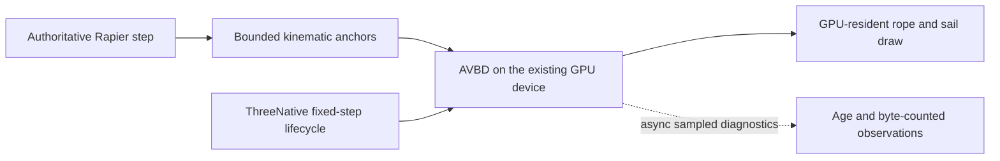

# PRD-avbd-ropes-and-sails — Prototype bounded secondary GPU simulation

**Status:** NOT STARTED
**Priority:** P2 — Determine whether AVBD ropes and sails improve a real ThreeNative secondary-simulation workload before promoting a new subsystem.
**Adoption order:** 3 of 3; independent of the other two plans.
**Complexity:** 6 (HIGH); estimated 6–10 implementation files (+2), optional solver integration (+2), GPU scheduling/resource state (+2); risk override: shared-device buffer ownership and native GPU compatibility.
**Owner:** ThreeNative maintainers; implementation agent executes the plan.
**Depends on:** None. Existing `SoftBody3D`, Rapier and `IComputeDriven` are reused, not replaced.
**Progress:** 0%
**Planning baseline:** `develop` at `ba72eed258b1aefabb9744dc86fd8282c3ab39a5`; 2026-10-05. No implementation or benchmark result is claimed.

## Context

ThreeNative's [SoftBody3D](https://github.com/ThreeNativeHQ/threenative/blob/ba72eed258b1aefabb9744dc86fd8282c3ab39a5/packages/core/src/softbody.ts) already implements GPU spring cloth. Its [compute lifecycle](https://github.com/ThreeNativeHQ/threenative/blob/ba72eed258b1aefabb9744dc86fd8282c3ab39a5/packages/core/src/compute-driven.ts) attaches the active renderer, warms kernels, schedules fixed/render cadence and detaches scene-owned resources. A second flag demo alone is not a reason to replace that infrastructure.

[three-avbd at `5b38b1e5f4f19adc08a2beac64678a78e91fa41c`](https://github.com/sbobyn/three-avbd/tree/5b38b1e5f4f19adc08a2beac64678a78e91fa41c) is a GPU rigid-body/contact/joint solver with [renderer/device entry points and asynchronous readback](https://github.com/sbobyn/three-avbd/blob/5b38b1e5f4f19adc08a2beac64678a78e91fa41c/README.md), not an extension of the Rapier world.

[Windward at `83b25adb24f671e93a55683913ca9a794dc0f613`](https://github.com/sbobyn/avbd-ship-demo/tree/83b25adb24f671e93a55683913ca9a794dc0f613) contains the ship-specific rope/cloth construction. Its [README](https://github.com/sbobyn/avbd-ship-demo/blob/83b25adb24f671e93a55683913ca9a794dc0f613/README.md) explicitly pins a different solver revision, `b3675dea83c78aba9644b059975f48285bf02a47`, and says cloth self-collision is disabled and hull/buoyancy are approximations. Do not combine current three-avbd internals and the ship's pinned internals as though their layouts were interchangeable.

## Solution

Prototype an opt-in secondary-simulation adapter, initially scoped to one generated rigging example. Port the smallest pinned construction/solver slice that can simulate ropes and sail cloth while leaving Rapier authoritative for the game. Keep the ship-pinned solver and its construction code together for the first comparison; evaluate a newer library revision only through an explicit layout/API compatibility test.

Preserve upstream license notices and inspect [Windward's third-party notices](https://github.com/sbobyn/avbd-ship-demo/blob/83b25adb24f671e93a55683913ca9a794dc0f613/THIRD_PARTY_NOTICES.md) before copying code or assets. Use game-authored primitive sail/rigging geometry for the acceptance scene, so third-party ship assets are not a hidden dependency. Do not vendor the ocean, weather, HUD, quality presets or hull-navigation model.

Start under proposed `examples/avbd-rigging/src/physics/`. Promote mechanisms to a proposed optional `packages/secondary-physics/` boundary only if the performance/correctness gate passes and the dependency genuinely needs isolation. Neither a new public API nor a Rapier replacement is authorized by a passing prototype. All visual geometry/materials stay game-owned.

### Device, cadence and ownership contracts

- Attach through `ctx.add()`/`IComputeDriven` using the existing renderer and its device. No second `GPUDevice`, renderer, canvas, animation loop or independent fixed-step accumulator. Warm actual compute kernels before first visible use.
- Use a supported renderer/device seam. Do not reach blindly into private backend fields, reinterpret undocumented buffer layouts or assume browser `navigator.gpu` exists on native. If the current cohort lacks a safe buffer-sharing seam, record the smallest blocker and keep promotion pending; no silent CPU/full-readback substitution.
- Reconcile the donor's actual Three.js peer requirement with the repository's pinned cohort before choosing an adapter. Do not install a second Three.js copy, suppress peer checks or upgrade the whole engine in this prototype. A required cohort upgrade becomes an explicit dependency, not scope hidden in a docs plan.
- Framework fixed step owns time. Set finite limits for particles/bodies, constraints, colliders, iterations and catch-up steps before allocation. Reject oversized or malformed topology with names and counts. Overflow never drops constraints silently.
- Rapier-owned anchors/colliders move into AVBD as bounded kinematic inputs. AVBD deforms only the secondary rope/cloth visual. No solver feeds delayed readback forces into a gameplay-authoritative body in this first slice. Sail propulsion, towing gameplay, character collision and authoritative debris are excluded.
- Keep solver output GPU-resident for rendering. Observations use bounded asynchronous readback with sample age and byte counts; no awaited readback in fixed-step/render. Stale data is marked stale, not described as current.
- Define order: fixed-step Rapier update → anchor snapshot → AVBD dispatch → visual draw. Render interpolation must not step the solver again. Paused worlds dispatch zero simulation steps.
- Detach removes registration and destroys only owned resources after in-flight use is safe. Late readbacks carry a generation token and cannot mutate a new scene. Capacity growth is a controlled rebuild outside steady-state stepping.

## Comparison and promotion contract

The reference workload is one 4 m × 4 m, 32 × 32 vertex sail, four 64-segment rigging ropes and a 16 × 16 vertex flag. Use the same authored dimensions, total masses, pinned locations, gravity, wind schedule, collision proxies, camera and 1/60 s timestep across independently identified candidates. The sail/flag baseline uses existing `SoftBody3D`; a rope without an incumbent counterpart is explicitly a new capability, not a claimed speedup over nonexistent rope code.

A minimal diagnostic ladder includes zero wind, step/gust wind, a translating anchor, a fast stop, pause/reset and collider contact. Because the solvers differ, compare physical observables and silhouette rather than pretending their stiffness numbers are equivalent. Freeze the mapping and workload before collecting candidate timings.

Proposed correctness targets: finite positions throughout 10,000 fixed steps; rope end-to-end extension ≤3% under its specified steady hanging load; sail p95 edge-length stretch ≤5% after settling; no measured proxy penetration deeper than 2 cm; no cloth self-collision claim. Measure only the simulated collision representation. These are acceptance targets, not results supplied by upstream.

Promotion requires both correctness and a useful tradeoff: at matched constraint-error quality, AVBD p95 simulation GPU time ≤1.10× the spring-cloth baseline; alternatively, at matched GPU budget, p95 stretch is at least 25% lower. Report both branches and their exact workloads; pick no favorable comparison after changing geometry or resolution. Total secondary-simulation p95 GPU ≤4 ms and CPU submission ≤0.5 ms on a recorded hardware adapter, using 300 warm-up and 1,800 measured frames across three paired runs. Optional device diagnostics must report their cost separately.

A correctly measured NO-GO is a valid outcome for this prototype: retain the bounded example and result, do not promote an optional package, and leave Rapier/SoftBody3D defaults unchanged. A blocked/missing measurement is not NO-GO evidence and cannot close the plan.

## Integration Ledger

| Capability | Reachable consumer/trigger | Replaces / disposition | Evidence |
|---|---|---|---|
| Rope/sail constraints | Proposed `examples/avbd-rigging/src/game.ts` → scene-owned adapter → pinned solver | Adds secondary rigging; existing spring cloth is the independent comparison arm | AC-1 |
| Scheduling | `ctx.add()` → existing compute registry → one fixed-step dispatch | Replaces the donor's standalone update loop | AC-2, AC-5, AC-6 |
| Kinematic coupling | Rapier step → anchor/collider snapshot → AVBD | One-way inputs only; Rapier retains every gameplay body | AC-3 |
| Rendering/lifetime | Existing renderer → solver-owned buffers → game-owned mesh; scene exit → detach | No duplicate renderer or synchronous-copy fallback | AC-4, AC-8 |

Proposed paths below must be updated to actual entry points before a phase is complete. No source is copied and no runtime API is added by this planning PR.

## Execution Phases

### Phase 1 — One bounded rigging scene runs through ThreeNative

**Status:** NOT STARTED
**ACs:** AC-1, AC-2
**Files:** Proposed `examples/avbd-rigging/src/physics/avbd-adapter.ts`, `topology.ts`, pinned donor subset/notices, `src/game.ts` and game-owned materials; existing compute seam only if a bounded safe extension is necessary.
**Implementation:** Lock one consistent solver revision/layout; verify peer/API compatibility; construct bounded topology; attach to the real renderer; use existing warm-up/fixed-step ownership. No production-default changes.

- [ ] AC-1 [local; actor: implementation agent]: The game-facing construction path produces the specified anchored rope/sail topology and rejects over-capacity or invalid indices. proof: `pnpm exec vitest run examples/avbd-rigging/__tests__/topology.spec.ts` (planned adapter-entry test). Evidence: pending.
- [ ] AC-2 [local; actor: implementation agent]: The real compute registry invokes exactly one solver step per fixed tick and none while paused or detached. proof: `pnpm exec vitest run examples/avbd-rigging/__tests__/lifecycle.spec.ts` (planned registry integration, not a standalone solver call). Evidence: pending.

**Verification:** Count real registry/adapter invocations; GPU state correctness belongs to Phase 3, not to a stubbed-device test.
**Checkpoint:** Pending; self-review and one equivalent reviewer when available.

### Phase 2 — Coupling and resource lifetime are explicit

**Status:** NOT STARTED
**ACs:** AC-3, AC-4
**Files:** Proposed example `src/physics/anchors.ts`, `readback.ts`, focused integration tests and comparison-scene controls.
**Implementation:** Take post-Rapier anchor snapshots, bound collider uploads, handle moving/removed anchors, age diagnostics and generation-token cancellation. Check native-required WebGPU features rather than assuming browser success proves the host.

- [ ] AC-3 [local; actor: implementation agent]: Enabling the secondary solver leaves the seeded authoritative Rapier body trace unchanged while its anchor inputs follow accepted body transforms. proof: `pnpm exec vitest run examples/avbd-rigging/__tests__/anchors.spec.ts` (planned real Rapier/adapter integration). Evidence: pending.
- [ ] AC-4 [local; actor: implementation agent]: A readback completing after scene disposal cannot update state in a replacement scene. proof: `pnpm exec vitest run examples/avbd-rigging/__tests__/lifecycle.spec.ts` (planned delayed-completion case). Evidence: pending.

**Verification:** Exercise scene reload, rejected initialization and bounded-capacity rebuild. Observe ownership, not just a `disposed` flag.
**Checkpoint:** Pending.

### Phase 3 — Qualify correctness on web and native

**Status:** NOT STARTED
**ACs:** AC-5, AC-6
**Files:** Proposed `examples/avbd-rigging/playtests/rigging.playtest.json`, installed/tarball consumer setup, comparison fixtures and optional discovery guidance after promotion only.
**Implementation:** Run the workload/diagnostic ladder through one portable game entry. Assert sampled GPU positions against the stated physical tolerances, visible sail/rope output and absence of synchronous readback. Do not inherit upstream tests that skip when no adapter exists.

- [ ] AC-5 [shared; actor: implementation agent on a WebGPU runner]: The browser consumer satisfies the rigging correctness targets through actual GPU dispatch. proof: `node packages/playtest/dist/runner/cli.js examples/avbd-rigging/playtests/rigging.playtest.json --url ${TN_EXAMPLE_URL:?} --browser-recipe webgpu`. Evidence: pending.
- [ ] AC-6 [shared; actor: implementation agent on the Linux native runner]: The identical entry/solver revision satisfies the rigging correctness targets on Linux native. proof: `node packages/playtest/dist/runner/cli.js examples/avbd-rigging/playtests/rigging.playtest.json --target desktop --executable ${TN_NATIVE_EXECUTABLE:?}`. Evidence: pending.

**Verification:** Record source/solver/package hashes, device/driver, collected assertions and result. CPU reference checks cannot substitute for native shared-device proof.
**Checkpoint:** Pending. Other platforms are not qualified by these runs.

## Acceptance Criteria

- [ ] AC-7 [shared; actor: implementation agent on the Phase 3 reference runner]: The controlled comparison yields a supported GO or NO-GO under the frozen promotion rule, with baseline/candidate identities and measured frame/error data. proof: Phase 3 scenario's paired benchmark mode through the existing playtest performance instrument. Evidence: pending.
- [ ] AC-8 [shared; actor: implementation agent on the Phase 3 reference runner]: Fifty scene lifecycle cycles return owned GPU resource/registration counts to baseline without destroying the shared device. proof: Phase 3 scenario lifecycle mode with actual resource observations. Evidence: pending.

## Scope, risks and rollback

Included: rope and sail/flag constraint construction, kinematic anchors/proxies, shared-device rendering, bounded diagnostics and a benchmark decision. Excluded: replacing Rapier or default cloth, two-way sail forces, full boat buoyancy, fluid simulation, cloth self-collision, networking and production GPU debris. Debris may become a follow-up only after the solver boundary is proven; it is not a hidden checkbox.

On a NO-GO, remove experimental package wiring/default registrations and retain only a clearly named opt-in comparison example plus concise results in this PRD. On an unsupported backend, fail with the missing feature/limit and preserve the existing cloth route; never silently claim equivalent AVBD behavior. Device seam/cohort work larger than the bounded adapter requires a separately scoped prerequisite.

## Blocked on

Actual hardware-WebGPU and Linux native runners are required for Phase 3; they were not exercised during planning. A discovered unsupported device/buffer seam or required Three.js cohort upgrade must be recorded here with the concrete failure before implementation continues. No external account or release action is needed. Missing proof keeps this prototype open.

## Decisions

2026-10-05 — User selected a bounded ropes/sails prototype, with debris only a later option. Preserve Rapier authority, compare against existing cloth and allow an evidence-backed NO-GO rather than forcing adoption. The three plans share one documentation-only draft PR as requested; this is not permission to implement or merge them.
