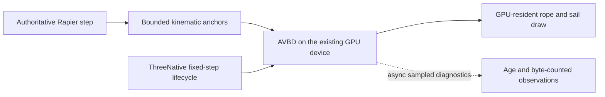

# PRD-avbd-ropes-and-sails — Prototype bounded secondary GPU simulation

**Status:** PARTIAL — browser attempt 3 fails penetration; pinned Windward configuration correction passes CPU controls and awaits installed qualification
**Priority:** P2 — Determine whether AVBD ropes and sails improve a real ThreeNative secondary-simulation workload before promoting a new subsystem.
**Adoption order:** 3 of 3; independent of the other two plans.
**Complexity:** 6 (HIGH); estimated 6–10 implementation files (+2), optional solver integration (+2), GPU scheduling/resource state (+2); risk override: shared-device buffer ownership and native GPU compatibility.
**Owner:** ThreeNative maintainers; implementation agent executes the plan.
**Depends on:** None. Existing `SoftBody3D`, Rapier and `IComputeDriven` are reused, not replaced.
**Progress:** 0%
**Planning baseline:** `develop` at `ba72eed258b1aefabb9744dc86fd8282c3ab39a5`; 2026-10-05. No implementation or benchmark result is claimed.

## Context

ThreeNative's [SoftBody3D](https://github.com/ThreeNativeHQ/threenative/blob/ba72eed258b1aefabb9744dc86fd8282c3ab39a5/packages/core/src/softbody.ts) already implements GPU spring cloth. Its [compute lifecycle](https://github.com/ThreeNativeHQ/threenative/blob/ba72eed258b1aefabb9744dc86fd8282c3ab39a5/packages/core/src/compute-driven.ts) attaches the active renderer, warms kernels, schedules fixed/render cadence and detaches scene-owned resources. A second flag demo alone is not a reason to replace that infrastructure.

[three-avbd at `5b38b1e5f4f19adc08a2beac64678a78e91fa41c`](https://github.com/sbobyn/three-avbd/tree/5b38b1e5f4f19adc08a2beac64678a78e91fa41c) is a GPU rigid-body/contact/joint solver with [renderer/device entry points and asynchronous readback](https://github.com/sbobyn/three-avbd/blob/5b38b1e5f4f19adc08a2beac64678a78e91fa41c/README.md), not an extension of the Rapier world.

[Windward at `83b25adb24f671e93a55683913ca9a794dc0f613`](https://github.com/sbobyn/avbd-ship-demo/tree/83b25adb24f671e93a55683913ca9a794dc0f613) contains the ship-specific rope/cloth construction. Its [README](https://github.com/sbobyn/avbd-ship-demo/blob/83b25adb24f671e93a55683913ca9a794dc0f613/README.md) explicitly pins a different solver revision, `b3675dea83c78aba9644b059975f48285bf02a47`, and says cloth self-collision is disabled and hull/buoyancy are approximations. Do not combine current three-avbd internals and the ship's pinned internals as though their layouts were interchangeable.

## Solution

Prototype an opt-in secondary-simulation adapter, initially scoped to one generated rigging example. Port the smallest pinned construction/solver slice that can simulate ropes and sail cloth while leaving Rapier authoritative for the game. Keep the ship-pinned solver and its construction code together for the first comparison; evaluate a newer library revision only through an explicit layout/API compatibility test.

Preserve upstream license notices and inspect [Windward's third-party notices](https://github.com/sbobyn/avbd-ship-demo/blob/83b25adb24f671e93a55683913ca9a794dc0f613/THIRD_PARTY_NOTICES.md) before copying code or assets. Use game-authored primitive sail/rigging geometry for the acceptance scene, so third-party ship assets are not a hidden dependency. Do not vendor the ocean, weather, HUD, quality presets or hull-navigation model.

Start under proposed `examples/avbd-rigging/src/physics/`. Promote mechanisms to a proposed optional `packages/secondary-physics/` boundary only if the performance/correctness gate passes and the dependency genuinely needs isolation. Neither a new public API nor a Rapier replacement is authorized by a passing prototype. All visual geometry/materials stay game-owned.

### Device, cadence and ownership contracts

- Attach through `ctx.add()`/`IComputeDriven` using the existing renderer and its device. No second `GPUDevice`, renderer, canvas, animation loop or independent fixed-step accumulator. Warm actual compute kernels before first visible use.
- Use a supported renderer/device seam. Do not reach blindly into private backend fields, reinterpret undocumented buffer layouts or assume browser `navigator.gpu` exists on native. If the current cohort lacks a safe buffer-sharing seam, record the smallest blocker and keep promotion pending; no silent CPU/full-readback substitution.
- Reconcile the donor's actual Three.js peer requirement with the repository's pinned cohort before choosing an adapter. Do not install a second Three.js copy, suppress peer checks or upgrade the whole engine in this prototype. A required cohort upgrade becomes an explicit dependency, not scope hidden in a docs plan.
- Framework fixed step owns time. Set finite limits for particles/bodies, constraints, colliders, iterations and catch-up steps before allocation. Reject oversized or malformed topology with names and counts. Overflow never drops constraints silently.
- Rapier-owned anchors/colliders move into AVBD as bounded kinematic inputs. AVBD deforms only the secondary rope/cloth visual. No solver feeds delayed readback forces into a gameplay-authoritative body in this first slice. Sail propulsion, towing gameplay, character collision and authoritative debris are excluded.
- Keep solver output GPU-resident for rendering. Observations use bounded asynchronous readback with sample age and byte counts; no awaited readback in fixed-step/render. Stale data is marked stale, not described as current.
- Define order: fixed-step Rapier update → anchor snapshot → AVBD dispatch → visual draw. Render interpolation must not step the solver again. Paused worlds dispatch zero simulation steps.
- Detach removes registration and destroys only owned resources after in-flight use is safe. Late readbacks carry a generation token and cannot mutate a new scene. Capacity growth is a controlled rebuild outside steady-state stepping.

## Comparison and promotion contract

The reference workload is one 4 m × 4 m, 32 × 32 vertex sail, four 64-segment rigging ropes and a 16 × 16 vertex flag. Use the same authored dimensions, total masses, pinned locations, gravity, wind schedule, collision proxies, camera and 1/60 s timestep across independently identified candidates. The sail/flag baseline uses existing `SoftBody3D`; a rope without an incumbent counterpart is explicitly a new capability, not a claimed speedup over nonexistent rope code.

A minimal diagnostic ladder includes zero wind, step/gust wind, a translating anchor, a fast stop, pause/reset and collider contact. Because the solvers differ, compare physical observables and silhouette rather than pretending their stiffness numbers are equivalent. Freeze the mapping and workload before collecting candidate timings.

Proposed correctness targets: finite positions throughout 10,000 fixed steps; rope end-to-end extension ≤3% under its specified steady hanging load; sail p95 edge-length stretch ≤5% after settling; no measured proxy penetration deeper than 2 cm; no cloth self-collision claim. Measure only the simulated collision representation. These are acceptance targets, not results supplied by upstream.

Promotion requires both correctness and a useful tradeoff: at matched constraint-error quality, AVBD p95 simulation GPU time ≤1.10× the spring-cloth baseline; alternatively, at matched GPU budget, p95 stretch is at least 25% lower. Report both branches and their exact workloads; pick no favorable comparison after changing geometry or resolution. Total secondary-simulation p95 GPU ≤4 ms and CPU submission ≤0.5 ms on a recorded hardware adapter, using 300 warm-up and 1,800 measured frames across three paired runs. Optional device diagnostics must report their cost separately.

A correctly measured NO-GO is a valid outcome for this prototype: retain the bounded example and result, do not promote an optional package, and leave Rapier/SoftBody3D defaults unchanged. A blocked/missing measurement is not NO-GO evidence and cannot close the plan.

## Integration Ledger

| Capability | Reachable consumer/trigger | Replaces / disposition | Evidence |
|---|---|---|---|
| Rope/sail constraints | Proposed `examples/avbd-rigging/src/game.ts` → scene-owned adapter → pinned solver | Adds secondary rigging; existing spring cloth is the independent comparison arm | AC-1 |
| Scheduling | `ctx.add()` → existing compute registry → one fixed-step dispatch | Replaces the donor's standalone update loop | AC-2, AC-5, AC-6 |
| Kinematic coupling | Rapier step → anchor/collider snapshot → AVBD | One-way inputs only; Rapier retains every gameplay body | AC-3 |
| Rendering/lifetime | Existing renderer → solver-owned buffers → game-owned mesh; scene exit → detach | No duplicate renderer or synchronous-copy fallback | AC-4, AC-8 |

Proposed paths below must be updated to actual entry points before a phase is complete. No source is copied and no runtime API is added by this planning PR.

## Execution Phases

### Phase 1 — One bounded rigging scene runs through ThreeNative

**Status:** PARTIAL — bounded game construction, real lifecycle controls and first installed CPU build pass; hardware integration pending
**ACs:** AC-1, AC-2
**Files:** Proposed `examples/avbd-rigging/src/physics/avbd-adapter.ts`, `topology.ts`, pinned donor subset/notices, `src/game.ts` and game-owned materials; existing compute seam only if a bounded safe extension is necessary.
**Implementation:** Lock one consistent solver revision/layout; verify peer/API compatibility; construct bounded topology; attach to the real renderer; use existing warm-up/fixed-step ownership. No production-default changes.

- [ ] AC-1 [local; actor: implementation agent]: The game-facing construction path produces the specified anchored rope/sail topology and rejects over-capacity or invalid indices. proof: `pnpm exec vitest run --config examples/avbd-rigging/vitest.config.ts`. Partial evidence: 2026-10-06, actual exported game construction is covered: 1,536 bodies, 100 anchors, 5,188 joints and 11.8 kg; joint capacity 5,187 rejects by name. The latest serial CPU suite passes 74 controls, including dense/sparse/coerced input and fixed-color conflict regressions. Installed hardware attachment remains pending, so this box stays open.
- [ ] AC-2 [local; actor: implementation agent]: The real compute registry invokes exactly one solver step per fixed tick and none while paused or detached. proof: `pnpm exec vitest run --config examples/avbd-rigging/vitest.config.ts __tests__/lifecycle.spec.ts`. Partial evidence: actual Game/compute registry executes three ticks, dispatches none for five paused ticks, resumes for two ticks and dispatches none for three detached ticks. These source controls pass; installed hardware execution remains pending.

**Verification:** Count real registry/adapter invocations; GPU state correctness belongs to Phase 3, not to a stubbed-device test.
**Checkpoint:** 2026-10-06 — fresh read-only reviewer found descriptor-kind and unknown-limit-key defects; regression controls failed, fixes passed, and follow-up found no remaining validation defect in the inspected files. The first focused topology/source-test check used TypeScript 5.9.3; the published topology now also passes the current TypeScript 7.0.2 strict check. The full current-cohort workspace typecheck remains unrun. Biome checked the three example files without warnings. No lifecycle, packaged consumer, GPU, native or performance acceptance follows from these CPU results.

### Phase 2 — Coupling and resource lifetime are explicit

**Status:** PARTIAL — real Rapier, generation and ownership controls pass; installed hardware lifetime proof pending
**ACs:** AC-3, AC-4
**Files:** Example `src/physics/avbd-adapter.ts`, `model.ts`, `resources.ts`, `checks.ts`, `frame.ts`, `measure.ts`, focused integration tests; narrow `packages/core/src/storage-buffer.ts` renderer seam (native proof pending).
**Implementation:** Take post-Rapier anchor snapshots, bound collider uploads, handle moving/removed anchors, age diagnostics and generation-token cancellation. Check native-required WebGPU features rather than assuming browser success proves the host.

- [ ] AC-3 [local; actor: implementation agent]: Enabling the secondary solver leaves the seeded authoritative Rapier body trace unchanged while its anchor inputs follow accepted body transforms. proof: `pnpm exec vitest run --config examples/avbd-rigging/vitest.config.ts __tests__/anchors.spec.ts`. Partial evidence: seeded real Rapier world (seed 446, 240 ticks) has identical authoritative body traces with the secondary adapter off/on; accepted moving-body transforms reach one-way anchor uploads. Controls pass, hardware coupling remains pending.
- [ ] AC-4 [local; actor: implementation agent]: A readback completing after scene disposal cannot update state in a replacement scene. proof: `pnpm exec vitest run --config examples/avbd-rigging/vitest.config.ts __tests__/lifecycle.spec.ts`. Partial evidence: a deferred mapped readback resolves after disposal and replacement and cannot mutate the replacement generation; initialization failure/retry and disposal controls pass. Actual asynchronous hardware lifetime proof remains pending.

**Verification:** Exercise scene reload, rejected initialization and bounded-capacity rebuild. Observe ownership, not just a `disposed` flag.
**Checkpoint:** 2026-10-06 — actual adapter snapshots run inline after the existing Rapier plugin update, with no writes to Rapier. Named body/joint/drag bounds precede allocation. GPU output stays in the leased vec4 body storage; the complete z-up solver frame is rotated to authored y-up, including world anchors and proxies. GPUReadback scheduling is reused with owned staging/finally cleanup because the pinned Three rejected-map path otherwise leaks staging. Fresh independent review reproduced live-allocation accounting and manager-before-backend deletion defects; focused fixes pass 8 allocation controls and 28 renderer seam controls. Normal example installation passed; adapter retry, delayed-map replacement, actual Game pause and seeded Rapier traces now pass the focused serial CPU controls. These CPU controls do not close AC-3/4/8.

### Phase 3 — Qualify correctness on web and native

**Status:** PARTIAL — installed browser attempt 3 exits 1 with the penetration failure; its admission errors are resolved; new candidate and Linux qualification remain unrun
**ACs:** AC-5, AC-6
**Files:** Proposed `examples/avbd-rigging/playtests/rigging.playtest.json`, installed/tarball consumer setup, comparison fixtures and optional discovery guidance after promotion only.
**Implementation:** Run the workload/diagnostic ladder through one portable game entry. Assert sampled GPU positions against the stated physical tolerances, visible sail/rope output and absence of synchronous readback. Do not inherit upstream tests that skip when no adapter exists.

- [ ] AC-5 [shared; actor: implementation agent on a WebGPU runner]: The browser consumer satisfies the rigging correctness targets through actual GPU dispatch. proof: `pnpm --filter threenative-avbd-rigging qualify playtests/rigging.playtest.json --url ${TN_EXAMPLE_URL:?} --browser-recipe webgpu --headed --artifacts ${TN_ATTEMPT_ARTIFACTS:?}`. Evidence: FAILED, installed browser attempt 3 (2026-10-06), 10,003 solver steps / 10,001 finite GPU ticks; maximum proxy penetration 0.02415698730681404 m exceeds 0.02 m. Exactly two of 48 rows fail: the original scalar and its additional phase predicate; explicit metadata retains the numerical failure. Raw report, bounded peak and attempt/cleanup receipts are retained below; this box remains open.
- [ ] AC-6 [shared; actor: implementation agent on the Linux native runner]: The identical entry/solver revision satisfies the rigging correctness targets on Linux native. proof: `pnpm --filter threenative-avbd-rigging qualify playtests/rigging.playtest.json --target desktop --executable ${TN_NATIVE_EXECUTABLE:?} --host-arg run --host-arg ${TN_NATIVE_BUNDLE:?} --artifacts ${TN_ATTEMPT_ARTIFACTS:?}`. Evidence: pending.

**Verification:** Record source/solver/package hashes, device/driver, collected assertions and result. CPU reference checks cannot substitute for native shared-device proof.
**Checkpoint:** 2026-10-06 — installed attempt 1 (`/tmp/tn-avbd-installed-20261006-a`) uses ordinary core/physics/playtest tarballs and normal consumer installation; TypeScript 7.0.2 and Vite build pass. Its source predates the latest validation/draw-review repairs, so it does not qualify the latest pending source. Browser/native execution remains unrun. The mandatory `qualify.ts` wrapper delegates to the existing installed runner and additionally requires captured sail, flag and rope pixels; correctness also requires changed rigging pixels. Synthetic PNG controls reject a blank stage, missing ropes and unchanged rigging, but are not hardware evidence. The current wrapper now passes full TypeScript 7 checking and its pure controls; fresh independent follow-up found no remaining defect in the inspected qualification path. Hardware runs remain pending. Other platforms are not qualified by these runs.

## Acceptance Criteria

- [ ] AC-7 [shared; actor: implementation agent on the Phase 3 reference runner]: The controlled comparison yields a supported GO or NO-GO under the frozen promotion rule, with baseline/candidate identities and measured frame/error data. proof: Phase 3 scenario's paired benchmark mode through the existing playtest performance instrument. Evidence: pending.
- [ ] AC-8 [shared; actor: implementation agent on the Phase 3 reference runner]: Fifty scene lifecycle cycles return owned GPU resource/registration counts to baseline without destroying the shared device. proof: `pnpm --filter threenative-avbd-rigging qualify playtests/rigging-lifecycle.playtest.json` with the same recorded browser/native target flags and a fresh artifact directory; actual resource observations and captured rigging are mandatory. Evidence: pending.

## Scope, risks and rollback

Included: rope and sail/flag constraint construction, kinematic anchors/proxies, shared-device rendering, bounded diagnostics and a benchmark decision. Excluded: replacing Rapier or default cloth, two-way sail forces, full boat buoyancy, fluid simulation, cloth self-collision, networking and production GPU debris. Debris may become a follow-up only after the solver boundary is proven; it is not a hidden checkbox.

On a NO-GO, remove experimental package wiring/default registrations and retain only a clearly named opt-in comparison example plus concise results in this PRD. On an unsupported backend, fail with the missing feature/limit and preserve the existing cloth route; never silently claim equivalent AVBD behavior. Device seam/cohort work larger than the bounded adapter requires a separately scoped prerequisite.

## Blocked on

Installed browser attempt 3 on NVIDIA Turing exits 1: maximum sampled proxy penetration is 0.02415698730681404 m against the unchanged ≤0.02 m target. Its twenty initial-admission defects are resolved; the original scalar and additional phase predicate still fail. The retained body 993/wall 1536 witness at tick 1323 establishes geometric intrusion but lacks actual GPU contact state. CPU review identifies an omitted Windward alpha=.95 setting; the game-layer correction and real packed-parameter controls pass, but a new installed consumer and hardware qualification require the parent's CPU/GPU slot. The prior consumer F uses alpha=.99 and remains immutable. Linux remains unrun until browser correctness passes. Fifty hardware lifecycle cycles and the complete frozen comparison remain unrun; missing proof cannot establish a complete NO-GO or close this plan.

2026-10-06 — Shared storage/device seam coordination: `IRendererLike` currently exposes compute/readback and `raw: unknown`, but no supported raw device/storage-buffer sharing contract. Windward's `ShipGpuSkin` instead casts `renderer.backend.createStorageAttribute/get`; the adapter must not copy that cast blindly. Its pinned solver package declares `three >=0.186.0`, while this checkout uses patched `three 0.185.1`. A bounded vendored source slice may avoid the package peer requirement, but exact renderer compatibility and native proof are still required before GPU attachment. No second Three.js, device, renderer or simulation loop has been introduced.

2026-10-06 — Parent assigned then released a CPU 10/22 setup slot. Normal filtered frozen install and the seven-package scaffolder dependency build passed (JS/DTS/publint); the current-cohort workspace typecheck stopped on missing Three in `native-cpu-load-test`, whose normal filtered frozen installation then passed. Focused topology and the pinned donor source closure pass TypeScript 7 strict checks. The normal example install and lock update passed, followed by full source example/core TypeScript 7 checks, 72 example controls and an initial ordinary tarball consumer install/typecheck/Vite build. The latest mandatory capture qualifier passes the full example/core TypeScript 7 check and the 74 focused controls; installation/build of the refreshed consumer still awaits the next broad CPU slot. No current full-board gate is claimed. Final live-clock polling integration and normal publication hooks remain pending. GPU/native priority stays with Strata/HLOD. No install/typecheck waiver, alias or hook bypass has been used. The shared native BUILD_PASS is recorded below; no GPU/native execution has run in this lane.

## Decisions

2026-10-05 — User selected a bounded ropes/sails prototype, with debris only a later option. Preserve Rapier authority, compare against existing cloth and allow an evidence-backed NO-GO rather than forcing adoption. The three plans share one documentation-only draft PR as requested; this is not permission to implement or merge them.

2026-10-06 — User delegated a separate implementation PR for this PRD, with original correctness/performance bars and authentic PR screenshots retained. The chosen source is Windward `83b25adb24f671e93a55683913ca9a794dc0f613` with solver `b3675dea83c78aba9644b059975f48285bf02a47`; static import-closure audit found all 17 required solver files (6,399 lines) byte-identical. Archive SHA-256: Windward `2f74256dfaea48fc16e2d37cd0b41460d10a173e3de8de50fb6f43725edc545a`, solver `a36e9b02b1ccad99eb484b3faa597c02471b899bf0c5d86633c31b9619a493e3`. The isolated prototype now includes the qualified 17-file solver closure under `examples/avbd-rigging/src/physics/vendor/`, MIT license and upstream third-party notices, and one fail-closed indexed-access helper. Mechanical ESM/interface/index/nullability/format changes leave every generated WGSL byte unchanged; three seeded CPU chains match the original pinned source at every one of 200 ticks. No ship asset was copied, no optional package has been promoted, and no GO/NO-GO result exists. The original eight boxes remain open.

2026-10-06 — Bounded read-only Linux host inventory found no verified source-compatible artifact. This checkout and `origin/develop` share native Git tree `cbd661d372747dd33aceaa18f92b4aac192b0cec`, but the existing shared root is dirty and its native coverage-input digest differs. `packages/runtime-native/build/tn-linux/mystral` SHA-256 is `c89a79b6960768bc7060bb49909d29a865929b93b6d54abc96fd3cd07874ca44`; the prior September desktop report records a different binary `92fc51519ef420c934615f772a496d66823ab09373caed14b588d3aeee9de48a` and dirty commit `356cbe9f01085d801ffa67b85a3afa39f5cf7f6d`. No adjacent source/identity receipt was found in the bounded build inventory. This is missing reuse proof, not a claim that the host fails; no binary was launched or rebuilt.

2026-10-06 — Dedicated implementation draft [PR #448](https://github.com/ThreeNativeHQ/threenative/pull/448) targets `develop` at published commit `4c50a96c4f6e7f4d6873ac2bcda73defb225101a`, label `prd:0%`. Normal pre-push lint, docs, mirrors and drift checks passed; the 19 topology tests and focused TypeScript 7.0.2 check passed. The pending donor/adapter/game/core-seam source was saved and restored only in this isolated lane, so the first PR commits do not claim that integration is qualified.

2026-10-06 — The portable `src/game.ts` now reaches both the candidate GPU draw and the independent spring sail/flag arm. A common authored temporal wind schedule disables the donor's spatial gust; initial flat-plate pressure is mapped to spring acceleration using authored patch area and vertex mass, while the candidate retains normal/relative-velocity drag. Spring mesh translation transports all vertices; AVBD moves only accepted pins. That moving-anchor/fast-stop limitation must accompany the frozen comparison. Both arms read the same authored sail-edge observable; a known 10% elongation and missing/nonfinite-sample controls pass (6 measurement tests total). No rest-pose rope substitute is used for the baseline. Mapping calibration, both relative tradeoff branches and actual frame windows remain pending.

2026-10-06 — Qualification-only lifetime instrumentation now observes the real registry's public size, records owned buffers/bytes/query sets and public renderer storage/readback accounting at each retirement, and compares the shared raw device identity across rebuilds. It adds no scheduler/device/server. The focused CPU lifetime controls pass; 50 installed hardware cycles remain unrun, and counters alone do not close AC-8.

2026-10-06 — Existing develop CI run `37417904209`, artifact `11392410163` (`native-performance-evidence`, archive digest `f973f94e0151800b6ece0f31c2d2547cb74b3213e006215edd079b9d3e0b0ce5`) records native binary SHA-256 `056691d32198543cb8b3e7002dbf765f53181bbb254cc22d91a4155c0f9c3dc9`, unlike all three inventoried local hosts. Its retained files are two PNG/two JSON observations and reports, with no executable. Recent desktop-parity run `37396260641` has the same native Git tree `cbd661d372747dd33aceaa18f92b4aac192b0cec`; artifact `11384507132` (archive digest `ba55b89d4ad4b9e079dcc41d3e5b901e89da3057e268031f72336a43153a3ba9`) contains 385 conformance/capture/report files and no ELF executable. Its collector is BLOCKED (exit 2) and records native binary `f2d3dcd9c0dcfc8c09a0122e4fd67253dc66d61aacc428b99565b08471f7e489`, also unlike the local hosts. No exact reusable host/build/dependency receipt was found in this bounded inventory; parent must supply an exact compatible host or schedule one shared build for the three ecosystem proofs. No native binary has been launched or built.

2026-10-06 — Parent authorized acquisition-only native dependency preparation on CPU 10 while Animals owns the broad slot. The normal existing downloader completed successfully for all 12 desktop dependencies in this isolated worktree with canonical lock digest `bf2291e7d799c7298c283c4981743121b032a4650b164de65e300dfbd4e1b375`; no Rust/C++ build has started. A shared host build for PRs 447/448/449 remains conditional on current native-tree equality, Animals releasing CPU, Strata being CPU idle and no timed GPU benchmark overlap. Current source compatibility receipts are preparation evidence, not a built host or AC-6 result.

2026-10-06 — Fresh independent source review found that device targets reject explicit browser-network and generic visual assertions before execution, that a scenario name alone did not freeze its workload, and that a passing native report could omit hardware identity. The shared scenarios now use the existing target-aware network default; mandatory PNG qualification retains nonblank ≥0.01 and correctness frame difference ≥0.001, additionally requires the actual sail/flag/rope hues, and binds correctness/lifecycle mode to complete canonical scenario hashes. A recorded WebGPU hardware identity from adapter.info, target/capture method and 1280×720 viewport are required; no absent identity is called hardware. These latest repairs pass the complete serial 74-test example suite and TypeScript 7.0.2 check; the actual browser provenance mapping (`web` versus CLI `browser`) is covered. Fresh independent follow-up found no remaining qualification-path defect in the inspected source. Original physical, timing and lifecycle bars remain unchanged.

2026-10-06 — Current published PR heads 447 (`6b9597e15e4c7cdd3c246c709b3751b7f143be65`), 448 (`4c50a96c4f6e7f4d6873ac2bcda73defb225101a`) and 449 (`2ceb63ce797a3fd6e652fecb28d6e38610869662`) all retain native tree `cbd661d372747dd33aceaa18f92b4aac192b0cec`. Parent released CPU 10/22 and authorized one shared build. Fresh native Rapier and UI overlay release libraries build successfully, with source/lock inputs unchanged; CMake configures the existing Linux Release V8/Dawn profile. C++ compilation completes all 409 targets with exactly one worker on CPU 10. The sealed standalone host SHA-256 is `14bc0aec4ef44b743a65b7cbb24e76bc84037d6564187410739e9234e6885058`; producer receipt SHA-256 is `b306ac6fb1e8b2c0eec4a68d81af1dd8ffa11597ca177ba69f08fb29248450f7`. Receipt path: `/home/joao/Documents/Codex/2026-10-05/task-5/shared-linux-host/14bc0aec4ef4/producer-receipt.json`; it binds all 3,668 final dependency files, 2,124 compiler inputs, 3,022 Rust inputs, toolchain, generated header, CMake flags/logs and 149 transitive system shared libraries. No ELF RPATH/RUNPATH is present. This is BUILD_PASS, not native runtime/game acceptance. The broad CPU slot is released; GPU/native execution waits for the parent lease.

2026-10-06 — Installed attempt 2 (`/tmp/tn-avbd-installed-20261006-b`) is prepared from the latest example/qualifier/scenario source and the same independently hashed ordinary core/physics/playtest tarballs. Installation, typecheck, browser/native bundle builds and hardware execution for this second attempt are still pending. The standard desktop packager accepts the sealed host through explicit `--runtime` (public build selector `THREENATIVE_RUNTIME_BINARY`), so no new native compilation is needed; packaging itself has not run. Debug packaging appends the game payload to a copy; final artifact hashes and the underlying producer hash must both be recorded rather than calling the resulting package byte-identical to the bare host.

2026-10-06 — Fresh independent AC-7 source review confirms that `gpuComputeMs()` is a last resolved numeric value, not a complete per-fixed-tick series; the spring sail/flag arm issues four compute calls per tick. Three retains each resolved query UID, but the existing public surface has no guarded receipt tying that UID to its call/generation. The smallest proposed prerequisite is a renderer-owned optional timing scope that preserves exact compute-call receipts while the game associates run/tick/pass IDs; missing, stale, duplicated or partially resolved membership must reject the window. Parent approved the exact noncolliding timing filenames. The pending lazy optional renderer timing scope now passes 32 timing controls plus 28 storage controls; a fresh reviewer reproduced retained-scope, restoration, query-capacity, malformed-options and disposed-before-first-use defects, and repaired controls pass. It is not committed or hardware-qualified. No root index export, Three patch or compute-registry change is involved. The pinned donor profiler can silently decline busy requests and changes pass partitioning when enabled. Any comparison must freeze its partition before calibration, collect exactly 300 post-ready warm-up and 1,800 measured frames for each arm in each of three pairs, and retain complete raw rows rather than the stock 1,024-entry final series. Its four phase timestamps exclude three mandatory `clearBuffer` commands; pass-only timings below 4 ms cannot establish the original total-secondary GPU bar. A measured mandatory subset above 4 ms can establish that bar's failure, but missing samples establish neither GO nor NO-GO. Complete timing boundaries and separately reported diagnostic overhead remain unfinished.

2026-10-06 — In the parent-allocated serial CPU slot, the current core JS/declaration build and normal publint pass; a later tiny disposed-first-use review repair still requires a rebuilt consumer artifact. The current timing/storage integration passes 60 focused controls. Three existing renderer complexity warnings remain; the new timing helper and tests have no formatting/lint errors. The slot is temporarily released for Animals’ consumer-only repair. GPU/native launch remains unrun and awaits the parent lease. The planned candidate collector must cover all three mandatory buffer clears and complete per-tick membership, with queue elapsed upper bounds identified separately from GPU busy/pass lower bounds; no performance decision follows from this design or the CPU controls.

2026-10-06 — The primary candidate timestamp collector now covers the pre-upload queue bookend, all three mandatory clears, all four fixed-partition solver phases and the post-diagnostic bookend; the old donor profiler is explicitly disabled in both timed/untimed candidate runs. Eighteen focused CPU controls pass, including permanent GPU-failure latching, atomic mapped-batch publication, bounded capacity and retirement. Actual donor construction revealed a mechanical port defect: initial hull/radius optional reads precede population of the bodies array. Restoring the exact pinned optional indexed reads passes three donor construction/hook controls; current shaders/layout and three seeded 200-tick reference chains pass four compatibility controls. No numerical/shader or solver revision change is claimed.

2026-10-06 — Fresh independent timing review reproduced seven window acceptance faults and six spring receipt/envelope faults. The repaired window passes 15 controls, keeps the original 300 warm-up/1,800 measured render frames including zero-tick frames, latches every observation error (including an undefined thrown cause), publishes polls atomically and rejects sparse data. Actual monotonic render-callback timestamps, paused state and elapsed fixed-tick coverage are mandatory; these are not compositor presentation timestamps. The spring arm passes seven controls, consumes cached components once, rejects retired/caught-error generations and reports a whole-tick elapsed upper envelope. Without absolute endpoint ordering proof, its maximum mandatory compute duration is a conservative lower bound; the four pass durations/sum remain separate observations. Baseline readback must be explicitly disabled in primary timing. One explicit candidate late-map observation control and nine spring observation controls pass using existing owned readback/public Three TSL position storage; no awaited work enters fixed/render callbacks. Benchmark game wiring, raw paired artifacts, full current example typecheck/rebuilt tarballs and real hardware windows remain pending. All original acceptance boxes remain open, prd:0%; CPU controls establish neither GO nor NO-GO. The broad CPU slot remains temporarily released for Animals; AVBD has launched no GPU/native attempt.

2026-10-06 — Before first hardware proof, fresh independent source review reproduced Three’s GPU-mutated vec3 padding and rejected-map staging cleanup/retirement defects. Fifteen focused spring controls now pass, including disposal failures remaining visible through retirement; the current core timing/storage controls pass 61 (32 timing,29 storage). The existing renderer readback method accepts an optional public caller-owned Three ReadbackBuffer, returning copied CPU bytes; no new device or frame pump is introduced. The latest full graph/typecheck and installed consumer build remain pending after the earlier CPU lease was released.

2026-10-06 — Timing hardening is frozen after demonstrated false-pass controls:28 coordinator/window controls pass (13+15). Raw measured rows retain the preceding frame-299 elapsed boundary, actual contiguous fixed-tick/query membership, zero-tick frames, active/fixed CPU summaries and counts-only complete pipeline observations. Post-ready admission requires existing warmUpScene accounting and an actual producer bridge wall-clock sample; subsequent compilation, census failure/pending/incompleteness/overflow or creation-count change invalidates the window. Duration-only per-tick lower bounds are aggregated by maximum, not an unproved nonoverlap sum; queue-envelope upper sums remain explicitly conservative. The separately frozen benchmark scenario requires all seven windows (three alternating primary pairs plus one diagnostic run); four capture/scenario controls pass. Artifact parsing/evaluation and hardware measurements remain unfinished, so no GO/NO-GO or acceptance checkbox follows.

2026-10-06 — Parent returned CPU 10/22 and assigned the next GPU slot for original correctness, followed by Linux only if browser passes. The current core JS/DTS/publint build and both core/example TypeScript 7 checks pass; all 142 focused example controls pass. Performance artifact qualification is disabled pending fresh review of interval bounds, zero-denominator improvement, exact final-step membership, failure markers and sequential run clocks. The first installed hardware correctness run keeps timing collection disabled and preserves the original scenario hashes and thresholds. No hardware acceptance result or GO/NO-GO is claimed.

2026-10-06 — Integrated prototype is committed/pushed at `da99a8df611d806f0edfb1774a5a675ca5cab946` through normal capability/API/pre-push hooks. Fresh consumer D (`/tmp/tn-avbd-installed-20261006-d`) normally installs core/physics/playtest 0.3.4 tarballs, exactly one patched Three 0.185.1, and passes TypeScript/browser/Linux bundle/package builds. Original browser attempt 1 ran 13:14:52–13:21:15 UTC on recorded NVIDIA Turing and captured actual sail/flag/ropes; one real reset restores owned GPU resources/registrations and keeps the shared device. It exits 2 before final assertions: `TN_PLAYTEST_OBSERVATION_UNAVAILABLE`, acceptedAnchorVelocity ≥0.24 timed out after120008ms,last0. This is a functional blocker, not algorithm NO-GO. All eight ACs remain open; Linux was not launched. Exact owned runner/browser/GPU PIDs, managed port5198 and owned display have exited, CPU10/22 are free and GPU priority is released to Animals. Raw captures/console/qualifier log and source/package/build/attempt receipts are retained at `/home/joao/Documents/Codex/2026-10-05/task-5/avbd-proof/browser-correctness-1/` (attempt SHA-256 `160b9d9ed5f987f3fb789df6fec93b5b38692e55f87ee207bd18920ef7c964f1`). Independent read-only diagnosis identifies a separate clock mismatch: forced wall-clock advance interprets the ladder tick counts as elapsed spans, not exact fixed steps. That does not establish the cause of velocity zero; real input/accepted-motion reproduction and bounded diagnostic receipts are next. The unchanged scenario and numeric bars remain mandatory.

2026-10-06 — Tiny serial CPU10 reproduction passes real InputMap KeyA-tap → actual rigging scene → 120 accepted Rapier steps (0.25 m/s,0.5 m), then KeyS holds the accepted position. A separate real entry control fails: an unset protocol clock is overwritten to wall-clock. The entry/qualifier now preserve the existing exact fixed-step correctness/lifecycle clock and reject a live-clock correctness invocation; the scenario hash and all physical bars are unchanged. This repairs a demonstrated clock contract defect, but does not yet establish the hardware velocity-timeout cause. One bounded KeyA input/first-post-Rapier receipt per scene and current requested/accepted state are added for the next unchanged hardware attempt. The independently observed favicon404 is addressed with the standard inline empty icon. The three focused input/clock controls are green after the repair; Biome passes with existing complexity warnings. Current strict type/consumer rebuild and fresh hardware retry remain pending; no GPU/native run starts before the parent release.

2026-10-06 — Fresh independent source review exposes two additional reproducible observation faults: startup-stalled compute emits the same input receipt on 20 ticks, and accepted velocity remains0 in state until a render even though Rapier has moved. Separate input/accepted emission flags now bound diagnostics to one pair per scene, including a repeated tap while compute is stalled. Non-benchmark post-Rapier snapshots publish actual accepted anchor fields immediately so exact-step resource polling cannot advance an unseen moving tick while waiting for render publication. The primary performance workload excludes this new fixed-tick state publication. Two new controls run the real scene, InputMap, Rapier, adapter and compute registry, replacing only GPU execution; both fail before the repair and pass afterward. All five focused clock/input/accepted-motion controls pass (3.32s,one CPU10), including all120 accepted0.25m/s ticks and a0.5m fast stop without a render. Fresh source follow-up, current strict checking, ordinary rebuilt/resealed consumer and unchanged hardware retry remain pending. Scenario raw SHA-256 values remain correctness `e551c42445f3fcf2edec2ab350efd2c2e253337f1d3e209f42097bd5e15be57c`, lifecycle `4156e6c63768f366cd5a3e8941a846d013ddb0d3237b87151cc44b2ba788e881`; all eight acceptance boxes remain open. The prior hardware timeout cause is not yet established.

2026-10-06 — Final fresh source follow-up finds no remaining defect in the clock/input repair scope. A third real-store control reproduces synchronous subscriber publication during the solver snapshot; removing its flush preserves immediate getState observation while the existing bridge publishes outside dispatch. Six focused controls pass (3.44s,one CPU10), including deferred subscriber detachment after one completed solver step. This does not modify adapter lifetime semantics or the frozen benchmark collector. Current strict checking, fresh installed consumer rebuild/reseal and hardware retry still await the parent resource slots; prior failure receipts remain immutable and all eight ACs remain open.

2026-10-06 — Parent grants the small serial CPU22 strict-check/consumer/reseal/normal-push slot, while GPU remains available to Strata. Current TypeScript 7 strict example checking passes after correcting a test-only extra argument to the scene's no-argument exit method (the first strict failure is retained). All148 owned example controls pass across17 files in10.67s on CPU22; no workspace-wide or native host build runs. Production clock/input source remains the independently reviewed repair. Consumer E and normal push hooks are next; hardware acceptance and all eight ACs remain open.

2026-10-06 — Corrected installed consumer E (`/tmp/tn-avbd-installed-20261006-e`) is sealed to clean source `ae5fe83d538ec5e355f32da0ccf5ab20a64f5cfe`. Ordinary offline installation, installed TypeScript, browser build, same-entry Linux bundle and normal debug packaging all pass on approved CPU22. An initial sandbox install hits the read-only existing pnpm store; the unchanged normal approved retry passes, with the failed log retained. No native host is rebuilt. The three tarball hashes exactly match consumer D; entry SHA-256 is `96b54e9b539f1bc3325258098195132c34684d7608f1331fb0a69988924692ad`, native bundle `a97fbdc6e2aae47b170602aa5be757cacbf98ad322d35dc5f74fa1bb05f36c94`, packaged artifact `4a0d212497131530f882c47a67aa32c7ca039ac541d3a5fef0998871366a7626`; sealed host `14bc0aec4ef44b743a65b7cbb24e76bc84037d6564187410739e9234e6885058` is unchanged. Immutable build receipt SHA-256: `af625a8e47545d79c1a76f0a2f6d972dc8917b28ba2abe82b7b7afa60bd47650`. Fresh independent installed-path review matches all43 source/qualification entries, all17 donor port hashes and all regular installed package payloads (52/10/18 files); no new mapping/clock/threshold blocker is found. Original runtime timeout cause remains unconfirmed. Normal push hooks and the original hardware retry follow; all eight ACs remain open. GPU priority was relinquished during preparation, and no AVBD runtime or capture lease is held.

2026-10-06 — Published HEAD `388dd497e4594966bc6b4c99b6616c23e214f4ef` completes normal push hooks. Corrected installed consumer E is sealed to its identical executable source at `ae5fe83d538ec5e355f32da0ccf5ab20a64f5cfe`; the published child adds PRD prose only. Original browser attempt 2 acquires the existing forced capture mutex at `2026-10-06T14:24:31.089Z` on CPU 22 and recorded NVIDIA Turing hardware, preserving the exact fixed-step clock and original correctness/lifecycle scenario hashes. It completes with exit 1 / report `pass=false`, retaining all 29 checkpoint samples, 10,004 solver steps and 10,002 finite GPU ticks. Actual KeyA input and accepted Rapier motion are observed at 0.25000001303851604 m/s; final accepted anchor x is 0.5083330273628235 m. Final rope extension 0.004102552610819599 and sail stretch 0.0019819831374841 are numerically below the original bars. Maximum sampled proxy penetration is **0.02415698730681404 m > 0.02 m**. Twenty scalar assertions independently report `TN_PLAYTEST_ASSERTION_TRIVIAL`; no threshold, scenario, initial-state or admission waiver has changed. Linux was not launched, and no complete GO/NO-GO follows.

Fresh independent source-only audits find no frame, full-size/half-size, quaternion or contact-sign defect. The pinned CPU contact oracle uses a legacy edge preference, while the active pinned GPU uses `faceBias: true`; this fidelity difference does not establish that the recorded violation is false. The solver's 10 mm collision margin is not subtracted from raw geometric penetration. The cumulative maximum is already present by `step-settled` at solver step 3,004, before gust or anchor translation; current depth there is 0.010010123288467851 m. The retained data therefore bounds the excess to the step-wind interval but lacks the peak body poses needed for exact contact attribution. The harness documents initial-satisfaction rejection, and existing `throughoutSteps`/`atSteps` produce additional rows rather than replacing the rejected final comparator. Any coordinated admission correction must still reject the numeric penetration failure and missing observations. No shared harness or donor source is changed by this diagnosis.

Actual connected-host cleanup confirms owned runner PID 3361306, Vite PID 3361361 and private Xvfb PID 3361323 have exited; port 5198 and the capture mutex are clear at 14:36:16 UTC. Foreign processes are untouched and GPU priority is released. Immutable report, before/after captures, console, qualifier log, source/package/build/start receipts and cleanup/result receipt are retained at `/home/joao/Documents/Codex/2026-10-05/task-5/avbd-proof/browser-correctness-2/`; attempt receipt SHA-256 is `7fce904566a735e6a73d56b7be35a016a97959cad124d7e6a3c2b16fba25a302`, raw report `ea0a78718d58c74c8cd4c6a2b638efebcbded9533d1822033a5b19c465d5c90a`. All eight ACs remain open (`prd:0%`). The PR body and exact failed-result comment record actual completion. Outbound app messages to parent fail with `An earlier turn submission is not yet confirmed`; delivery is not claimed. Parent subsequently authorizes CPU diagnosis, preserving the original bar and parking Linux until browser passes.

2026-10-06 — A review-only authoring proposal uses the harness's existing documented per-assertion `allowTrivial` reasons; no shared-harness implementation is needed. The previous audit's impossibility statement explicitly excluded this route and does not establish a missing capability. The proposal adds 20 meaningful held-invariant reasons and otherwise preserves all 29 labeled steps, 24 resource definitions, thresholds and checkpoints. It is outside the tracked frozen fixture and is **not authorized or installed**; the API records these as `trivialityOptOut`, so compatibility with the requested no-waiver contract and a revised canonical hash requires the parent's decision. A one-CPU replay of the retained report through the unchanged resource emitter reproduces all 20 original trivial failures, then retains exactly one failed numeric penetration row (`TN_PLAYTEST_RESOURCE_ASSERTION_FAILED`, 0.02415698730681404 > 0.02) under the proposal. It retains all 30 resource result rows and rejects all 20 missing-observation controls; the full original report has 31 rows including diagnostics. This is CPU authoring analysis, not a new hardware result or solver cause. Fresh independent review finds no actionable defect in this limited proposal and infers no authorization. Proposal SHA-256: `8ec2c12dd20e8b103131118ff84169f78937b1a3e987cf2800559719b2cc4443`; replay receipt at `/home/joao/Documents/Codex/2026-10-05/task-5/avbd-proof/cpu-diagnosis-attempt2/admission-proposal-replay.json`, SHA-256 `1df811ffd94a2cf760b62a232888efc78406834d5a86d761d1caef1984fd5253`. The tracked scenario raw hash remains `e551c42445f3fcf2edec2ab350efd2c2e253337f1d3e209f42097bd5e15be57c`.

No physical repair is justified by the retained data. The smallest next diagnostic change would retain one cumulative-maximum witness from the existing bounded readback: copied secondary/proxy poses and full dimensions, contact normal/local points, scene generation, sampled fixed step and observation age. It would preserve the current penetration scalar, threshold, maximum accumulator, readback cadence and GPU solver/WGSL, and add no loop or Rapier write. Exact cached GPU-manifold attribution may require a separately bounded contact observation; a fresh SAT choice alone cannot reconstruct contact reuse. No such source change or new runtime attempt is made without coordination. Prose verification runs on CPU 22: `pnpm check:docs` passes, and all six required prose-contract files pass 243 controls in 12.71 s. No product, native, full-board or CI-readiness gate is claimed.

2026-10-06 — Parent authorizes explicit held-invariant metadata and one bounded penetration-peak diagnostic, with unchanged solver physics and the original 20 mm bar. The strengthened authored fixture uses the existing schema: eleven held fields have named `allowTrivial` reasons plus `throughoutSteps`; reset/readiness, wind, gust, pause/resume and accepted post-Rapier motion have actual labeled `atSteps` transitions. Finite measured phase predicates enforce the original 3% rope, 5% sail, 20 mm cumulative penetration and 120-tick freshness limits at their applicable checkpoints. Reset remains unmeasured; invalid or absent observations cannot satisfy these predicates. The original 29 steps, 24 final comparator definitions, existing checkpoints and numeric bars are preserved, with the original fixture retained at raw SHA-256 `e551c42445f3fcf2edec2ab350efd2c2e253337f1d3e209f42097bd5e15be57c`. The strengthened scenario raw SHA-256 is `20fe2c69342642ca31892b21fbdc87cf7bed601b458914248dad4a0b56b3525f`, canonical seal `47533aad23e554a9bf1d863870f0033bf51b96c55e5b34b708bc6508adf3e599`. Lifecycle and benchmark scenarios are unchanged. Independent review identifies and closes missing gust activation and residual stop-velocity proof: a zero-gust trace and 0.1 m/s stop checkpoint now fail. Negative controls also reject a post-start invariant violation followed by recovery, missing checkpoints/fields, unmeasured readiness, malformed bounds and the original recorded 0.02415698730681404 m numeric failure.

The existing sampled observation now retains one copied cumulative-maximum witness: scene generation, sampled/observed fixed ticks and age; secondary/proxy identities and mapped topology vertices; CPU and packed Float32 full extents; exact 40-word Uint32 body records; local/world contacts, feature axes, honest clipped-polygon indices, normal/separation; solver-to-authored transform and analytic point/OBB signed distances. Its source is explicitly pinned CPU SAT reconstruction on sampled GPU poses, not the GPU cached manifold. Point SDF remains separate from the original contact-normal penetration metric. New lower samples preserve the peak, and current freshness is recomputed when cached poses age. There is no change to donor WGSL, layout, contact algorithm, timestep, iterations, readback cadence, Rapier authority, shared engine exports or device/loop ownership.

Genuine CPU red controls reproduce the missing admission/diagnostic behavior and the independently identified receipt-validation gaps. Focused controls pass 47 tests across four files; the entire owned example passes 182 tests across eighteen files in 15.49 s on CPU 22. Strict example TypeScript passes; affected Biome checking has zero errors and five complexity warnings. Fresh independent source follow-ups close all scoped findings, including test cleanup. The workflow-only postprocessor `avbd-seal-penetration-peak.mjs` requires an immutable completed-attempt receipt linking raw report, start, producer and build hashes, plus exact source/scenario/runtime/clock/URL/artifact identities. It verifies packed poses/extents, replays local/world geometry and all four signed distances, rejects nonfinite derived arithmetic, retains failed report status and the 20 mm bound, and declares no hardware qualification. Its sixteen CPU controls pass, including missing identities, cross-attempt report substitution, corrupt geometry and finite-input overflow. Script SHA-256 is `03f7d2f6f76c4cf6d3f0958eaee5f0d93503342535c1fda3ac3d49061b482504`. These controls explicitly refuse to fabricate the absent peak from attempt 2.

Workflow-consumed CPU source hashes, controls and logs are retained in `/home/joao/Documents/Codex/2026-10-05/task-5/avbd-proof/cpu-preparation-3/`; receipt SHA-256 is `82c68299fa04e8fd23edd48a257eb003fe6aa3f232908d4fc9e93c8fc79a0599`. This records dirty precommit source honestly and supplies no installed/GPU/native claim. Consumer E and both original hardware attempts remain immutable. A clean new consumer and one coordinated hardware diagnostic await parent scheduling after GGEZ/Animals; no hardware is launched by this preparation. Original penetration remains **FAIL**, all eight ACs remain open (`prd:0%`), and Linux, fifty hardware lifecycle cycles, complete paired timings and GO/NO-GO remain unmeasured. No full-board or CI-readiness gate is claimed.

2026-10-06 — Parent releases CPU10 max1 for consumer F preparation after the GGEZ compiler/push sessions finish. Clean executable source `2f80d1ee80669d3d2d57ee4964a8cc71ede570af` is installed at `/tmp/tn-avbd-installed-20261006-f`. Normal offline installation, strict installed typecheck, browser build, same-entry Linux bundle and normal debug packaging all pass. Core/physics/playtest archives exactly match immutable consumer E; the consumer contains one patched Three 185.1. No native host is rebuilt or game launched. Source entry SHA-256 is `dadf7f1e03a7df9a12b89dab22f1123227617600e2dcb9f86a64581e03651684`, native bundle `779112f445c0fc33a85eb30db1b80f4ef2aa765c75b39a2d5d7f016ab4909124`, packaged artifact `d431761c7015649dfc38ba7faa030efa0f520809bcef2a5ce5313c328d501de7`; the existing sealed Linux host `14bc0aec4ef44b743a65b7cbb24e76bc84037d6564187410739e9234e6885058` is reused. Build receipt SHA-256 is `769f3c994eba37f1635094be74340312daaccb090ae4bac60ab2181c8a6bcb93`. This receipt records build passes and hardware acceptance **NOT_RUN**. The published notes following this executable source change only this PRD.

Fresh independent read-only review matches all 43 source/qualification files, all 26 build files and six logs, every regular installed package payload, archive hashes and shared-host binding. The packaged artifact has the exact sealed host prefix and one embedded native bundle. Original 29 scenario steps and 24 final comparators remain; the additional assertions strengthen observation requirements. No actionable identity mismatch is found. Evidence is retained at `/home/joao/Documents/Codex/2026-10-05/task-5/avbd-proof/installed-consumer-f/`, with archive receipt SHA-256 `d87d1ff6acec0ffc464c6a779a05f55e176600c1013e451bd849ecdad69184d8` and independent review `a7ada2160e38614670bacba7510fceca698a288ef870b2c8802e67caad155ea5`. The bounded GPU diagnostic is prepared only, awaiting the parent's slot after Animals native and Strata readiness. No capture/runtime lease or CI-readiness gate is held. Original **0.02415698730681404 m > 0.02 m remains FAIL**; all eight ACs remain open (`prd:0%`). Linux correctness, fifty hardware lifecycle cycles, paired timings and complete GO/NO-GO remain unmeasured.

2026-10-06 — Parent releases one GPU correctness attempt after Strata's owned processes and lease are retired. Consumer F passes fresh source/qualification, archive, build and binary seal checks; installed doctor and actual driver/port/lease checks pass. The original strengthened scenario launches at `16:30:49.636167+00:00`, acquiring the existing capture mutex at `16:30:51.529Z` on CPU10. The recorded adapter is NVIDIA Turing WebGPU, GeForce RTX 2080 driver 615.71.09, with page screenshot captures at 1280×720. The existing runner owns private Xvfb and its managed server. Solver revision, fixed clock, iterations, original 29 steps and numerical bars are unchanged. It completes at `16:38:31.038288+00:00`, exit 1 / report `pass=false`, retaining all 29 checkpoint samples, 10,003 solver steps and 10,001 finite GPU ticks. Forty-six of 48 assertion rows pass; only cumulative penetration and its applicable phase predicate fail. The twenty initial-admission defects do not recur. Rope extension is 0.004102552610819599 and sail p95 stretch 0.0019819831374841; maximum proxy penetration remains **0.02415698730681404 m > 0.02 m**. Final accepted anchor x is 0.5083330273628235 m, accepted velocity is zero after stop, and current readback age is seven ticks. These values do not close the failed correctness AC.

The bounded historical peak identifies sail body/topology vertex 993 against wall proxy 1536: CPU-reconstructed faceB, reference/incident axes 2, clipped polygon index 2. Its generation is 3, sampled fixed tick 1323, observed tick 1854 and age 531; this historical witness is distinct from the final fresh pose. Raw normal depth is 24.156987 mm, and the independently replayed secondary surface point/OBB signed distance is 24.1570018 mm inside the wall. The frozen postprocessor binds the actual completed report/start/source/package/build receipts, verifies geometry and packed dimensions, and retains `reportPass=false` with the original 20 mm bar. It reports CPU SAT reconstruction on sampled GPU poses, never the GPU cached manifold. No contact margin is subtracted, no measurement repair or solver root cause is established, and no solver change or second hardware run follows.

Actual connected-host cleanup at `16:39:40.948186+00:00` confirms all 17 recorded owned PIDs and the owned browser profile are absent, port 5198 is free and the capture holder is absent. The driver responds normally; foreign processes are untouched and GPU priority is released. Raw report SHA-256 is `816996357b707adafc887e611e6dbc2ecf706b5d855945c96cc352c227fb49a9`, completed attempt `f26fb0808bf50bde0c9a083915272ba9c77eb8874819a2d47a23edc8c9c58250`, bounded peak `f4eb8f3325c0b34d72853b5df3857fd835d7a278fb95485c9d848d353831f86c`, cleanup `d15f33887b1acb95cc8eddc7cac29a060e02d1e2ebd2c1ebeba7debb3b365624`. Evidence is retained at `/home/joao/Documents/Codex/2026-10-05/task-5/avbd-proof/browser-correctness-3/`. The existing pure capture qualifier finds sail/flag/rope pixels and 6,856 changed pixels in the actual retained PNGs; draw analysis SHA-256 is `c7f83aad1c8a5778afd5d4b9c96612cccae74cbf0e50e98652a75d3c0bc1f57a`. Its first external-script invocation fails because it uses CommonJS mode; the corrected ESM invocation passes and creates no new capture. Pixel checks cannot override the failed physics. Linux remains unlaunched under the parent rule. All eight ACs remain open (`prd:0%`); fifty hardware lifecycle cycles, paired timings and the complete GO/NO-GO are unmeasured.

Fresh independent read-only review matches every completion-listed file, all 38 installed source files, all three package archives and the frozen sealer payload. A separate Python geometry replay reproduces local-to-world points, all four signed distances and separation with zero numeric discrepancy. Original comparator fields and step sequence remain intact; no actionable measurement defect is found. The sampled intrusion is placed in the step-wind interval, before gust or anchor translation, with GPU cached-manifold behavior and solver cause unresolved. The archived independent report records the same report/result/peak/cleanup hashes. No Linux, complete GO/NO-GO or AC closure follows from this review.

2026-10-06 — CPU contact-response investigation decodes the exact peak body records. Sail body 993's packed last-moved word 27 is 1323, equal to the sampled solver tick; the pinned `reuseContacts` fast path therefore rejects any prior whole manifold at this tick if the pair is emitted. The historical observation age 531 does not establish 531 ticks of contact reuse. Fresh narrowphase can still preserve previous lambdas, penalties and static-friction anchors. Actual GPU pair presence, manifold basis/C0/anchors, dual state and combined primal contributions remain unobserved.

The pinned Windward constructor sets alpha=.95, dt=1/120, gravity −9.81 and 12 iterations; the prototype accidentally inherited the pinned solver default alpha=.99 while explicitly selecting the PRD-required 1/60 clock. Windward disables contacts, so its configuration carries no upstream proxy-contact guarantee. The game-layer correction explicitly sets alpha=.95 and freezes all candidate parameters: dt 1/60, gravity −9.81, iterations 12, betaLin 10000, betaAng 100, gamma .999. Donor WGSL/layout/defaults, topology, mass, wind, collision proxies, numeric bars and all scenario steps are unchanged. Alpha also affects hard-joint stabilization and warm-start decay; this correction is not a demonstrated penetration repair.

Two actual construction/command-recording controls fail on the prior configuration, then pass after the correction: the real hanging-rigging model and frozen comparison agree, and real `GpuSolver3D` writes Float32 alpha=.95 into uniform word 5 and every pass across 12 iterations. All 18 focused tests in two files pass in 3.75s on CPU10; affected Biome has zero errors and two existing complexity warnings. Fresh independent review finds no actionable defect in these four files. Current strict typecheck, new installed build and hardware rerun remain unrun; no broad graph, native host build or GPU launch follows from these CPU results.

A separately labeled Float64 counterfactual uses copied poses and reconstructed CPU SAT anchors. Initial separation is −0.024300197618398925m; hypothetical C0 including the 10 mm margin is −0.014300197618398925m. At the same final poses, the pinned Taylor row gives C≈2.098590890780647e−7m for alpha.99 versus −0.0005717980456468795m for alpha.95. This is neither the observed GPU contact nor a prediction of a changed trajectory. Actual forces/penalties are unknown; any betaLin increment is uncapped and conditional. The independent arithmetic replay agrees exactly. CPU source/control/receipt evidence is retained at `/home/joao/Documents/Codex/2026-10-05/task-5/avbd-proof/cpu-contact-response-3/`, receipt SHA-256 `f7bf399e16b58c3b77b2683d3706846d4fea76fd299e4d635952bedaba347fd2`; qualified counterfactual SHA-256 `13fb69305d2410592fd3cc4f8861c34c52a930d12a4957215adb80c694368142`. This receipt records dirty precommit source and no hardware acceptance.

If contact attribution remains unresolved after the fidelity correction, the reviewed minimum diagnostic uses existing public `contactStorage` before/after one step: two bounded 544-byte raw pair/contact snapshots plus 320 fresh body bytes and headers. Queue copies must precede storage overwrite, carry the same new attempt/generation/tick, reject overflow/duplicates/invalid ranges and record pair absence. It requires no vendor hook, but cannot identify initial matched dual state or exact narrowphase matching decisions. It is a proposal only; no implementation or additional GPU run is claimed. Original **24.156987 mm > 20 mm remains FAIL**; all eight ACs stay open (`prd:0%`).
