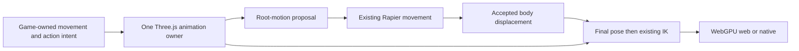

# PRD-ggez-animation-composition — Selectively absorb GGEZ animation mechanics

**Status:** PARTIAL
**Priority:** P2 — Qualify the original three-pair animation CPU budget for the implemented opt-in composition path.
**Adoption order:** 1 of 3 in this batch; ordering is preference, not a dependency on the other two PRDs.
**Complexity:** 6 (MEDIUM); estimated 6–10 implementation files (+2), new composition mechanism (+2), coupled animation/physics state (+2); risk override: none.
**Owner:** ThreeNative maintainers; implementation agent executes the plan.
**Depends on:** The masked-layer behavior specified by [PRD-VQ-05](../animation/PRD-VQ-05-masked-additive-animation.md). That behavior may land in the same implementation; completion of the entire VQ-05 document is not a prerequisite.
**Progress:** 50%
**Planning baseline:** `develop` at `ba72eed258b1aefabb9744dc86fd8282c3ab39a5`; 2026-10-05. This document authorizes no implementation, release or merge.

## Context

ThreeNative already owns clip validation, skeleton-safe preparation and stride synchronization through [AnimationPlayer](https://github.com/ThreeNativeHQ/threenative/blob/ba72eed258b1aefabb9744dc86fd8282c3ab39a5/packages/core/src/animation.ts), with public character integration in [core exports](https://github.com/ThreeNativeHQ/threenative/blob/ba72eed258b1aefabb9744dc86fd8282c3ab39a5/packages/core/src/index.ts). VQ-05 already specifies masked override/additive layers. Do not build a parallel layer owner or treat additive animation as missing Three.js mathematics.

[GGEZ at `45ed541cb163ef98694467758f60d5533373ac60`](https://github.com/vibe-stack/ggez/tree/45ed541cb163ef98694467758f60d5533373ac60) separates its animation runtime from its editors. The inspected donor [runtime](https://github.com/vibe-stack/ggez/blob/45ed541cb163ef98694467758f60d5533373ac60/packages/anim-runtime/src/runtime/index.ts) and [evaluator](https://github.com/vibe-stack/ggez/blob/45ed541cb163ef98694467758f60d5533373ac60/packages/anim-runtime/src/runtime/evaluation.ts) implement layered poses, blend nodes, synchronization and root-motion output. Its compiled graph/pose schema is not a drop-in ThreeNative API.

The useful outcome is a normal ThreeNative character that blends walking/running/strafing, reloads or aims with its upper body, and moves against a wall without animation moving it through the wall.

## Solution

Use Three.js `AnimationMixer`/`AnimationAction` as the pose owner. Extract only donor algorithms that reduce implementation risk: blend-weight selection, normalized-phase synchronization and root-motion interval handling. Prefer existing Three.js operations for additive preparation and action blending. Keep source attribution and the inspected [MIT license](https://github.com/vibe-stack/ggez/blob/45ed541cb163ef98694467758f60d5533373ac60/LICENSE) beside every copied implementation; record changed donor paths and the exact revision in the eventual patch. No source is vendored by this planning PR.

Game-authored TypeScript chooses states, clips, masks and weights. The framework supplies bounded mechanical composition, not a serialized animation graph, editor, new scene format or mandatory `@ggez/*` runtime dependency. No new package is justified for these dependency-free mechanics.

### Contracts

- Blend 1D samples by sorted thresholds. For 2D, use a fixed, validated sample triangulation and barycentric weights; project outside-hull queries to the nearest hull edge. Define exact-sample, duplicate/collinear-sample and zero-weight behavior explicitly. Weights are finite, nonnegative and normalized; invalid inputs fail by name, not by NaN propagation.
- A synchronization group has one normalized-phase clock. Speed changes and crossfades preserve phase; loops wrap deliberately, one-shot clips finish once, and pause/resume does not re-fire events. No second wall clock or per-rig render loop.
- Reuse the VQ-05 layer owner and its proof fixture. One base locomotion layer, one masked override and at most two additive layers suffice. Masks resolve on the cloned rig, never mutate shared clips, and exclude the root unless that ownership is explicitly selected. An explicit additive reference pose is mandatory.
- Evaluate root translation/yaw from a named root track over the fixed-step interval, including loop seams. Strip that contribution from the rendered pose exactly once. Convert the delta into the character body's coordinate convention and pass it through existing Rapier movement; accepted displacement, not requested displacement, updates the actor.
- Root-motion authority and velocity-driven stride synchronization are mutually exclusive for a given step. Ordinary velocity-driven characters keep current behavior. Root-motion mode reports requested/accepted delta and blockage without silently retiming or moving the body twice.
- Order is animation intent/root delta, Rapier movement, final composed pose, existing IK, rendering. Unsupported nonuniform parent transforms fail explicitly in the first slice rather than applying a plausible wrong delta.
- Bound action/scratch capacity at initialization; no per-frame pose-buffer or action creation. Scene exit releases only owned actions/buffers, never another character's shared source data.

## Integration Ledger

| Capability | Reachable consumer/trigger | Replaces / disposition | Evidence |
|---|---|---|---|
| Synchronized blending | `examples/animation-composition/src/game.ts` → `CompositionCourse.enter` frame → public `AnimationComposer` → incumbent player's mixer | Replaces per-example weight/phase plumbing; existing player remains the default | Published `9c383e06` package/browser/Linux correctness passes; changed pose-sampling candidate awaits packed/runtime refresh; AC-7 open |
| Masked actions | Same character → VQ-05 layer owner → final pose | One implementation and shared tests with VQ-05; no second layer stack | AC-2 |
| Root motion | Fixed-step animation intent → existing character movement → accepted transform | Opt-in alternative to velocity-driven stride authority, never concurrent body writers | AC-3 |
| Consumer discovery | Exported capability → generated agent guidance → installed example | Document only after the export ships; no editor workflow | AC-8 |

The source caller is `examples/animation-composition/src/character.ts`: `update` queues intent, `afterPhysics` observes accepted Rapier movement and finishes the pose, then `CompositionPose.apply` runs existing Three CCD. Shared VQ-05 assertions produce one evidence record reused by both documents; this PRD does not close or rewrite VQ-05.

## Execution Phases

### Phase 1 — A character blends and composes actions

**Status:** COMPLETE (public package and installed CPU behavior; rendered runtime gates remain in Phase 3)
**ACs:** AC-1, AC-2
**Files:** Proposed `packages/core/src/animation-composition.ts`; existing `animation.ts`, `index.ts`; VQ-05's canonical layer implementation/tests; new example game entry.
**Implementation:** Audit donor files/transitive licenses; adapt the smallest useful algorithms to existing Three objects; resolve blend and synchronization data at load; extend the existing layered fixture rather than cloning it. The example must call the public export.

- [x] AC-1 [local; actor: implementation agent]: Public composition updates produce the independently calculated blend weights and synchronized sample times for the locomotion fixture. proof: `pnpm exec vitest run packages/core/__tests__/animation-composition.spec.ts --maxWorkers=1`, plus the same tests in the standalone tarball consumer. Evidence: 2026-10-06, CPU 10, exit 0; eight independently calculated public-import controls pass without source aliases, including invalid layouts and loop/interruption traces. Seven-package JS/DTS builds and strict installed-consumer typechecking pass; the installed suite passes 14/14 composition and canonical masked-layer controls.
- [x] AC-2 [local; actor: implementation agent]: The shared VQ-05 consumer preserves the lower-body pose while applying an upper-body action; weight zero restores the base pose within 1e-5 local-transform tolerance. proof: `pnpm exec vitest run packages/core/__tests__/vq-masked-additive-animation.spec.ts --maxWorkers=1`. Evidence: 2026-10-06, CPU 10, exit 0, 6 tests; exact override/lower-body/zero tolerance, additive reference, distinct cloned masks, once pause/replay/cancellation and 50 shared-source disposal cycles. The canonical VQ-05 PRD is unchanged.

**Verification:** Compare against hand-calculated weight/phase cases and independent base-only samples, not a second call to the same helper.
**Checkpoint:** Independent reviewer reproduced five initial defects; red/green controls now pass for turning subdivision/seams, collinear boundary projection, body/ancestor ownership, root interpolation and quaternion track types. A second pass verified mixed-root interval math and found one additional body-hierarchy defect; its red/green control now passes. Public build/package qualification passes; rendered runtime qualification remains open.

The later CPU investigation reproduced a mask-ownership defect: renaming only a prepared Three `AnimationClip.name` changed the independently expected upper-body position from 2 to 1.8. Cache the fixed masked/unmasked partition when creating the owned sample actions instead of interpreting mutable diagnostic names on each tick. Source RED: one failure, exit 1. Source GREEN: seven canonical masked-layer controls pass; the focused mixed source/existing-built-package lane passes 79/79 (seven masked-layer, 13 root/Rapier, 51 incumbent and eight existing public-package controls), CPU 10, one worker. The unchanged public-import callers still resolve the previous built package; this does not qualify a newly packed module. Single-package strict `tsc --noEmit` passes. A fresh independent reviewer found no source blocker, verified UUID-based disposal and spy restoration, and requested an explicit captured-action count before renaming; that assertion is now present. Biome exits 0 with the existing `finish` complexity warning; the 2,449-link documentation check and required 243/243 prose contracts pass. The first sandboxed prose-contract attempt stalled in its Git batch reader and was stopped only through verified owned descendants; the identical normal command passes with Git/IPC permissions, without a source change. No phase/override cache or Three action-evaluation change is included. Normal repacking and the latest installed public GREEN are recorded below; current rendered browser/native requalification is recorded in Phase 3.

The same regression also reproduces through the unchanged installed tarball's public entry (exit 1, expected upper 2, observed 1.8). Its strict consumer/test typecheck first catches the capture's nullable `clipAction` return; an explicit failure on null repairs the test, then strict types and seven source controls pass. The packed negative still fails for the intended pose assertion. No installed runtime dependency is patched. After the parent releases the bounded core-build slot, the normal core JS/declaration build and package lint pass in 21.33 s on CPU 10. Existing manifest/declaration checks stamp archive `7dd6ad7a73e06e7b0e458344e9ccdefb35d4547cc30449019190d7f250dfbf38`; the other seven archives remain unchanged. The normal offline install updates the explicit core override and runs its lifecycle script. Latest packed GREEN: 15/15 public tests (eight composition, seven canonical layers), strict consumer types and the normal web build pass. Installed module SHA-256 `4ada93cbc7fbb029239d43083b510c648e4147286ff42105ac5a5e1b3422190e` equals the archive's module bytes and resolves inside the consumer's `.pnpm` tree, without source aliases. The current built-public game caller also passes 13/13 focused root/Rapier controls. The earlier mixed prior-package 79-test lane is historical diagnosis, not this package proof. No newly rendered acceptance follows from these CPU/build results.

### Phase 2 — Movement has one authority

**Status:** COMPLETE (local source behavior; packaged runtime gates remain in Phase 3)
**ACs:** AC-3, AC-4
**Files:** Proposed `packages/core/src/animation-root-motion.ts`; existing character/physics integration identified before editing; example collision course and focused regression fixture.
**Implementation:** Handle loop-seam deltas and reference transforms; route movement through Rapier; exclude the consumed root contribution from skin pose; retain velocity-driven defaults and IK ordering. No new native ABI is assumed.

- [x] AC-3 [local; actor: implementation agent]: Through the actual game fixed-step path, a root-motion character stops at a collider and its transform follows accepted Rapier displacement with no duplicate root translation. proof: focused Vitest lane on CPU 10, one worker, `animation-root-motion.spec.ts` (12 tests, exit 0). Evidence: 2026-10-06; actual `CompositionCharacter` caller with real Rapier/FixedStepLoop stops at the wall over 240 ticks; turning seams run 180 ticks; authored nine-bone skin with eight actions runs 120 ticks and existing Three CCD after final pose. Lower/zero local-transform tolerance remains 1e-5. Both 100-clone benchmark arms now use built public imports without source aliases; these CPU controls verify counting/animation updates, not the performance target.
- [x] AC-4 [local; actor: implementation agent]: A character using only the incumbent player retains its previous sampled pose/stride trace when composition is unused. proof: `pnpm exec vitest run packages/core/__tests__/animation-composition.spec.ts packages/core/__tests__/animation.spec.ts --maxWorkers=1`. Evidence: 2026-10-06, CPU 10, exit 0; independent four-tick incumbent pose/stride trace and action/binding baseline pass, plus 51 incumbent-player regression tests. Composition creates no unused-path owner or update registration.

**Verification:** Exercise paused/interrupted/root-loop movement and IK-after-animation ordering; reject unsupported transforms with actionable diagnostics.
**Checkpoint:** Independent review exposed NaN observed coordinates, an unmatched callback on synchronous scene reset, frozen benchmark frame counting and incomplete removal observations. Reproduced failures and corresponding fixes pass: finite body-coordinate validation; pending-intent guard in the example; only rendered frames with actual animation updates count; Spine/Arm/RightHand authored local transforms are observed before IK. The normal example typecheck and public baseline arm then reproduced a wrong `playWeighted` field (`name` instead of `clip`); both pass after the three-field correction. Full focused built-package lane: 86/86 tests, seven files, CPU 10, one worker, no source aliases. Core and example strict typechecks pass.

### Phase 3 — The installed consumer works on two runtimes

**Status:** IN PROGRESS (published `9c383e06` packed browser/Linux correctness verified; changed pose-sampling candidate requires revalidation)
**ACs:** AC-5, AC-6
**Files:** Proposed `examples/animation-composition/playtests/composition.playtest.json`, example packaging, capability comments and generated agent guidance; reuse existing playtest runner.
**Implementation:** Package the same game entry for browser and Linux desktop. Scenario drives locomotion, strafe, reload, blocked movement and reset, observing bones/body state and actual rendered output. Test an installed/tarball consumer, not only workspace aliases.

- [ ] AC-5 [shared; actor: implementation agent on a WebGPU runner]: The browser consumer passes the full composition scenario with a nonblank animated character. proof: the installed CLI runs the original course with five screenshot fields added, its managed preview server and all seven supported WebGPU/performance arguments. Evidence: 2026-10-06, CPU 10/22, RTX 2080, driver 615.71.09, actual `webgpu` adapter `nvidia/turing`; third attempt exit 0, 26.13 s, 35/35 assertions. Observed ticks 60→926 preserve 804 authored ticks plus 62 release-settle ticks; 50 real scene transitions return actions/buffer bytes to zero and leave clips unchanged. Inspected [walk](../../verification/visuals/ggez-animation-composition/walk.png), [run](../../verification/visuals/ggez-animation-composition/run.png), [reload](../../verification/visuals/ggez-animation-composition/reload-finish.png), [recoil](../../verification/visuals/ggez-animation-composition/recoil.png) and [blocked](../../verification/visuals/ggez-animation-composition/blocked.png) captures contain the animated character. The original root negative exits 1 in 5.30 s: actual body movement 1.033 m while `skinRootZ` remains 0, failing the forbidden `>= 0.5` assertion with its expected stagnation diagnostic. Both runs reach ready startup with no runtime errors; all 14 recorded owned PIDs per run are gone and the capture lease is free. The first two failed attempts remain recorded below.
- [ ] AC-6 [shared; actor: implementation agent on the Linux native runner]: The same packaged entry passes the composition scenario on Linux native. proof: `node packages/playtest/dist/runner/cli.js examples/animation-composition/playtests/composition.playtest.json --target desktop --executable ${TN_NATIVE_EXECUTABLE:?}`. Evidence: 2026-10-06, installed CLI with the original course plus five capture fields, CPU 10/22, exit 0 in 21.34 s, 35/35 assertions. Actual desktop WebGPU adapter is NVIDIA GeForce RTX 2080 / `nvidia/turing`, Vulkan, driver 615.71.09. The same source entry SHA-256 `cc07f0d8184b3431991dc0927fa865232a65a1d4f9ededa200facb7695250ae1` builds native bundle SHA-256 `2b8a59dd53cc4db9cc0a129162454c67caa1f80002aa335bfbdfcf57c48c5970`, which is appended to independently verified host `14bc0aec4ef44b743a65b7cbb24e76bc84037d6564187410739e9234e6885058`; packaged executable SHA-256 is `f04e01712261ad5a8996a0a2cbae1012065bfdfdf2e50d3ecd988bf54249ab9a`, with an exact matching host prefix and normal build report. Ticks 67→933 deliver the original 866 ticks; all 50 actual exit snapshots return actions/owned bytes to zero and preserve source clips. Inspected [walk](../../verification/visuals/ggez-animation-composition/native-walk.png), [run](../../verification/visuals/ggez-animation-composition/native-run.png), [reload](../../verification/visuals/ggez-animation-composition/native-reload-finish.png), [recoil](../../verification/visuals/ggez-animation-composition/native-recoil.png) and [blocked](../../verification/visuals/ggez-animation-composition/native-blocked.png) PNGs show the character and changing poses/positions at 1,280×720. Original native root negative exits 1 in 2.57 s: body movement 1.033 m, residual skin-root translation 0, only the forbidden root assertion fails. Both controls reach ready and have no observed console/runtime errors; native network observation is explicitly waived by the shipped runner. All five owned PIDs per run are gone, the lease is free and the executable is unchanged. Linux correctness only; no native performance or other-platform qualification is implied.

Published `9c383e06` AC-5 revalidation uses the same packed module and sealed web build: `metadata-browser-positive-1`, exit 0 in 24.78 s, 35/35 assertions on actual RTX 2080 / `nvidia/turing` WebGPU, driver 615.71.09. All 50 individual exit snapshots release actions/buffers and preserve clips. Inspected current [walk](../../verification/visuals/ggez-animation-composition/current-browser-walk.png), [run](../../verification/visuals/ggez-animation-composition/current-browser-run.png), [reload](../../verification/visuals/ggez-animation-composition/current-browser-reload-finish.png), [recoil](../../verification/visuals/ggez-animation-composition/current-browser-recoil.png) and [blocked](../../verification/visuals/ggez-animation-composition/current-browser-blocked.png) PNGs show the animated character. The original browser root negative exits 1 in 4.40 s for the intended residual-root assertion after 1.033 m body movement with `skinRootZ` 0. All 14 owned PIDs per run are gone and the lease is free. Historical AC-5 attempts and old package seals remain retained separately.

**Verification:** Record revision, package hashes, adapter/driver, collected assertions and actual result. These are future implementation gates; none ran during planning.
**Checkpoint:** Authored example and four scenarios are present. Actual scenario loader accepts all four (4/4, exit 0); the positive course includes 50 separate scene transitions and the negative control requires forbidden residual skin-root translation. A standalone tarball consumer passes strict typechecking, initially 14/14 and now 15/15 public composition/masked-layer tests, and its normal web build. Its first authored entry SHA-256 was `87343d9ca3aa4c3417427572a147286b3922710e1fef1453c32a2fffb66fef06`; the verified startup repair below changes it to `cc07f0d8184b3431991dc0927fa865232a65a1d4f9ededa200facb7695250ae1`. The paired crowd preserves 100 rigs, nine bones, at most eight actions, 300 warm-up/1,800 measured frames and the original 2 ms incremental p95 target. Browser and Linux native correctness at published `9c383e06` pass; the changed pose-sampling candidate requires fresh qualification. Original failed benchmark attempts remain retained below. No Windows, macOS, Android or iOS qualification is implied by Linux evidence.

2026-10-06 hardware browser attempts: the parent allocated a serial browser window after Strata released the GPU. Preflight recorded an RTX 2080, driver 615.71.09, 6,685 MiB free VRAM and a free capture lease. Attempt 1 exited 2 after 33.16 s: the authored game omitted `initialState`, so the existing constructor rejected scene `course` before bridge installation. A focused public-entry construction test reproduced that exact error (one failure, exit 1), then passed after adding `initialState: {}` (one pass, exit 0, CPU 10). The normal installed web rebuild passed in 12.31 s; the final public-entry/root-motion focused lane passes 13/13. The failure, console, actual launch arguments and teardown are retained; it is not qualifying proof.

Attempt 2 exited 1 after 79.29 s on `TN_CAPTURE_BLANK`. It reached actual `webgpu` with adapter vendor `nvidia`, architecture `turing`, and the seven supported WebGPU/performance arguments. All 35 collected semantic assertions passed, including 50 actual scene transitions, zero exit actions/buffer bytes and unchanged source clips. Observed ticks advanced from 60 to 926: 804 authored ticks plus 62 release-settle ticks. The initial PNG visibly contains the character; later captures fail because the drawing buffer changed from 1,280×720 at automatic scale 1 to 3×3 at scale 0.85. The authored HTML had removed the generated minimal template's full-size canvas layout. Restoring its `width: 100%; height: 100%` keeps the CSS box independent of the backing buffer, preserving automatic resolution scaling without a renderer override or package change. Independent read-only review accepted this game-layer repair; its normal installed web rebuild passed in 12.99 s. All 14 recorded owned process IDs are gone and the capture lease is free. Neither failed attempt closes AC-5.

Attempt 3 and the original negative qualified the historical browser course as recorded in AC-5. The current installed source also passes its normal strict typecheck, exit 0. B1 was rejected before launch when a fresh read-only check found foreign GPU utilization at 37% with 4,316 MiB free VRAM. The first B1 attempt then ran and is recorded below; native had not launched at that checkpoint. The original three-pair performance contract is unchanged.

The first B1 hardware attempt exited 1 after 80.84 s. It reached all 300 warm-up and 1,800 measured renders with 100 rigs, nine bones and three actions, but the scene-node observer's default 50-node sample reported only 4,800 triangles against the required 9,600 despite matching all 100 rigs. Its only failed assertion is `sceneNodes[0].minTriangles`, with `TN_PLAYTEST_SCENE_NODE_GEOMETRY` explaining the sample limit. Adding the shipped `select.limit: 100` to both benchmark scenarios changes only observation capacity; removing that field restores the prior scenario objects exactly. All rig/action/frame counts, 120,000 ms deadlines and original thresholds remain intact. The failed run and prior scenarios are retained, including its 2,724 measured fixed updates over 45.4 simulation seconds and 10.6 ms animation CPU p95; this is not a performance pass. Teardown released all 12 recorded owned PIDs and the capture lease; postrun foreign GPU utilization was 30%. Restart the entire six-arm set rather than use this arm in a pair.

Resource polling unnecessarily called bridge advance under `--live-clock`. The production core plugin already selects `wallClockAdvance`, preserving the frame pump; the initial lower-level test did not establish a production freeze. The corrected control calls actual `playtest().setup`, its bridge and `FixedStepLoop`: a resource ready at 10 ms is observed at 16 ms after the fix, but the old runner adds a 10 ms wait and rejects it at 26 ms against a 20 ms deadline. A held live pump also respects the resource deadline without entering the separate pump timeout. The scoped fix forwards the selected live-clock flag and omits advance only for live-clock resource waits; deterministic waits still deliver explicit ticks. Production-adapter RED: one live failure and one deterministic pass, exit 1. GREEN: clock/wait/CLI 9/9, CPU 10, one worker, exit 0; prior wait/aim/click controls 29/29. Independent review found no remaining source blocker. The context/renderer and in-process transport are stubbed; this result does not qualify browser execution or performance. Current active PR inventory has no owner editing these playtest paths; PRs 437/438 were only read.

## Acceptance Criteria

- [ ] AC-7 [shared; actor: implementation agent on the Phase 3 reference runner]: Composition meets the bounded animation CPU budget below. proof: Phase 3 scenario's benchmark mode using the existing playtest performance instrument and isolated baseline/candidate artifacts. Evidence: 2026-10-06, CPU 10/22, actual RTX 2080 / `nvidia/turing` WebGPU, driver 615.71.09. The first completed pair fails: baseline p95 4.20 ms, candidate 7.30 ms, incremental 3.10 ms against the unchanged 2 ms ceiling. Both arms exit 0 with 16/16 assertions, all 100 distinct skins / 9,600 triangles, nine bones, baseline three / candidate eight actions, 300 warm-up and exactly 1,800 measured renders. Baseline observes 2,172 measured fixed updates / 36.2 simulation seconds; candidate 2,153 / 35.883 s. One pair completed; the other two are unqualified. C2 was launched before the comparison was assessed, then deliberately interrupted through only its verified owned timeout supervisor: exit 2, not a qualifying or substitute arm. All 14 owned PIDs are gone on recheck and the lease is free. The external serial orchestrator now rejects B2 before any GPU query or renderer launch after the failed prior pair (exit 4). Preserve the failed pair and interrupted attempt; no source, frame count, threshold or package change masks this result.
- [ ] AC-8 [local; actor: implementation agent]: The packed consumer reaches the documented public capability without any GGEZ editor/compiler/schema package. proof: existing tarball/scaffolder path, standalone strict typecheck and 14/14 public tests, normal `pnpm build:web`, and actual installed engine MCP stdio capability search/detail. Evidence: 2026-10-06, CPU 10, all exit 0; eight stamped package archives have resolved manifests and shipped declarations. Core, physics, playtest and scaffolder resolve inside the consumer's `.pnpm` tree; no workspace-linked runtime or `@ggez/*` runtime package is present. Donor MIT notices survive emitted JS and declarations. Package/source hashes and commands are in the requested run receipts outside the repository.

CPU-only follow-up preserves the failed rendered pair. Actual packed-module sampled stacks locate most timed work in incumbent Three action/quaternion evaluation; mask preparation and root-motion sampling are outside this crowd's timed path. Allocation sampling establishes no per-tick pose/action creation. A diagnostic copy of the existing caller compares identical 100 rigs, nine bones, eight actions and 30 tracks over 300 warm-up and 1,800 updates. Three fresh-process pairs alternate order: incumbent p95 0.318868 / 0.309158 / 0.318538 ms, metadata-cache candidate 0.315298 / 0.306818 / 0.312728 ms. Improvements 0.003570 / 0.002340 / 0.005810 ms are below the predeclared 0.019420 ms noise margin. This rejects a performance claim for the full phase/override/mask cache; only the independently reproduced mask-name defect is repaired. Node timings, sampled allocations and this external diagnostic copy do not qualify the rendered 2 ms target. Two setup failures (missing diagnostic loader and a CommonJS/ESM Three-instance mismatch) are retained; corrected ESM attempts use one installed Three instance and leave installed dependencies untouched. No new GPU or native process was launched.

The parent later allocated exactly one reviewed shipped `--cpu-prof` diagnostic pair before correctness revalidation. Old and current packed composers both run the unchanged candidate scenario: 100 rigs, nine bones, eight actions, 30 tracks, 300 warm-up and 1,800 measured frames, original 120,000 ms deadline. Both fresh-process arms pass 16/16 on RTX 2080 / `nvidia/turing`, driver 615.71.09; profiled p95 is 5.10 / 4.80 ms, with 2,144 / 2,150 measured updates. These perturbed timings are diagnosis only, not an acceptance pair or a speed-improvement claim. Fresh independent aggregation places about 88–91% of the animation update subtree in incumbent Three mixer evaluation; quaternion `slerpFlat`, interpolant `evaluate` and `AnimationAction._update` dominate. Composer `advance` and `finish` self time is much smaller. The current profile also has about 7.74 s of anonymous samples; no speculative optimization follows. The original incumbent-three-action versus composer-eight-action unprofiled three-pair ceiling remains unchanged and unticked.

A subsequent source-causal investigation retains the same two actual browser profiles. Composer update subtrees total 2,074.111 / 1,950.589 ms across entire profiles, including warmup and continued updates after the measured window. Three mixer subtrees total 1,891.574 / 1,712.742 ms; track-interpolation SLERP self time is 495.579 / 488.330 ms, separately from property-blending SLERP at 143.145 / 105.302 ms. The 7,739 ms anonymous current-profile node attaches directly to the profiler root and has no animation ancestor. Unequal whole-profile work prevents a causal timing comparison.

Track-interpolation SLERP is 23.89% / 25.04% of those whole-profile composer subtrees. The source-causal choice targets that attributed path, but the profiles cannot separate constant from varying calls: all SLERP position ticks name the function start, with no key/track identity or argument values. Closing the original failed pair needs 1.10 ms, or 15.1% of candidate p95. Even if the whole-profile 25% share held in the p95 tail, selection would have to remove about 60% of that path's time. The observed 18 constant calls out of 25 post-warmup track-interpolation calls per rig (72%) do not establish 60% of time: constant calls already take Three's fast copy branch, and discrete sampling still copies each result and evaluates intervals. No retained evidence establishes the required 1.10 ms saving; this remains a targeted waste-removal candidate, not a predicted AC-7 repair.

The engine-layer qualification candidate changes only final prepared pose clips in the existing VQ-05 owner. A stock `QuaternionKeyframeTrack` with linear interpolation and exactly identical quaternion components at every key selects Three's discrete interpolant after root stripping and additive conversion. Every action, track, key, time/value buffer and existing mixer owner is retained. Root-motion extraction/validation retains its original linear interpolants. Varying, near-equal, antipodal and custom-factory tracks retain authored interpolation. Public composer documentation names prepared clips as construction-time pose snapshots; source keys are reauthored before constructing a new composer.

RED: the constant-quaternion control fails because the prepared clip remains linear, while the varying/custom guard passes (one failure, one pass, seven skips). The first placement in the shared canonical validator then produces six actual root-motion failures; those failures remain recorded. Moving selection to final pose preparation preserves validation and passes the final focused 30/30 controls, CPU 10, one worker: nine masked/additive/50-lifecycle/public-action controls, 13 root/Rapier/game-caller controls and eight incumbent/composition controls. This source/existing-built-package lane does not establish a new packed module. Normal core typecheck then catches six diagnostics from direct constructor comparison narrowing a track to `never`. Replacing that comparison with exact stock Three prototype identity preserves the same subclass exclusion; normal core typecheck exits 0 and the focused 30/30 controls pass again. No cast or suppression replaces the guard. The expanded public-only suite against the unchanged installed archive is RED: 16/17 pass; only the new constant-quaternion control fails on linear versus discrete interpolation. No installed dependency is patched; normal repack and public GREEN remain pending. Biome exits 0 with four pre-existing complexity warnings. Fresh independent review finds no semantic blocker and explicitly requires renewed packed/browser/native proof.

A tiny external diagnostic preserves the original caller's 100 cloned rigs, nine bones, eight actions and 30 tracks per rig. Public operation counts after 300 warmup updates show 4,500 → 2,700 SLERP calls per crowd update, while retaining 800 actions, 3,000 tracks/evaluations and 100 mixers. Three fresh-process old/new CPU pairs retain 12,600 keys, 249,600 track-buffer bytes, 300 warmup / 1,800 measured updates and identical final bone-pose SHA-256 `e85f5af7d1badde8879dd891da1a471515513755e404d0f4dc66123d72294e9f`. Old p95 is 0.320338 / 0.297158 / 0.306228 ms; candidate p95 is 0.290068 / 0.290168 / 0.282208 ms. **The predeclared timing screen fails:** median improvement 0.024020 ms is below its 0.046360 ms noise margin. No speedup or hardware performance claim follows. Two diagnostic setup failures (incorrect dependency-link parent and missing external ESM package scope) are retained; corrected attempts use one installed ESM Three instance and leave installed dependencies unchanged. The source guard is copied exactly into a separate diagnostic module; this is not normal packaging or acceptance proof. Independent review supports retaining it only as an unqualified hardware candidate because deterministic call removal and identical poses target the attributed hot stack; it rejects repeating tiny trials until they pass or altering the noise rule.

AC-5, AC-6 and AC-8 are reopened for this changed source; all prior published proof remains recorded above. The parent confirms the actual AVBD command has ended and releases the next small CPU 10/22 normal core build/repack with at most one CPU; commands use CPU 10. GPU permission is not granted. Strict declarations and browser/Linux native revalidation remain unverified for this source. AC-7 remains open under the unchanged original three unprofiled pairs and 2 ms ceiling. No GPU/native process or broad build launches during this investigation.

## Performance and lifecycle contract

Proposed targets, not measurements: 100 cloned rigs of at most 80 bones, at most eight active actions per rig; 300 warm-up and 1,800 measured frames, three paired runs on the same machine. Composition's incremental p95 CPU cost is at most 2 ms/frame. The unused path adds no actions, buffers or update registrations. Fifty scene enter/exit cycles return owned action and buffer counts to baseline; source-clip hashes stay unchanged. Include those lifecycle assertions in the Phase 3 scenario, not another harness. Report individual paired results and noise; a skipped benchmark or software adapter does not establish the target. Do not loosen a failed target without a recorded scope decision.

## Scope, risks and rollback

Includes bounded blending, synchronization, shared masks/additive behavior and explicit root-motion routing. Excludes generalized graphs/state-machine editors, motion matching, networking, retargeting, new IK solvers and automatic replacement of existing games. The fixture owns visual assets, shaders and motion choices. Primary risks are cloned-rig cross-talk, sync discontinuities, root-motion double application and new work on the unused path.

If selective extraction becomes a dependency on GGEZ's graph compiler, keep upstream Three operations and re-scope the extraction; do not import the framework to save the prototype. Removing the opt-in composition entry must restore the incumbent consumer unchanged.

## Blocked on

AC-7 remains failed/open after the original 3.10 ms increment against 2 ms; the other two original pairs are unqualified. All three original unprofiled pairs must qualify after a justified performance repair and parent scheduling. The full metadata-cache experiment did not clear its noise margin, and the one shipped identical-composer profile pair cannot replace the original incumbent/composer acceptance arms. The published `9c383e06` normal core build, stamped archive, installed 15/15 controls, strict types, web packaging and hardware browser/Linux correctness pass. The changed constant-quaternion pose candidate has focused semantic/count proof only; its tiny timing screen fails. Parent build/repack and hardware slots are pending, so its packed/runtime criteria remain reopened. No hardware attempt or timing pass is claimed for this candidate.

The parent supplied a shared exact-source Linux host, then allocated the serial GPU/native window after animals released it. Host SHA-256 `14bc0aec4ef44b743a65b7cbb24e76bc84037d6564187410739e9234e6885058` and producer-receipt SHA-256 `b306ac6fb1e8b2c0eec4a68d81af1dd8ffa11597ca177ba69f08fb29248450f7` match. Native tree `cbd661d372747dd33aceaa18f92b4aac192b0cec`, 11 source inputs and 5,181 unique files match, including 2,124 compiler inputs, 3,022 Rust inputs and 149 system libraries. Static ELF has no RPATH/RUNPATH; five installed packaging scripts match. Normal desktop packaging passes in 25.04 s, selecting this explicit host; appended executable `f04e01712261ad5a8996a0a2cbae1012065bfdfdf2e50d3ecd988bf54249ab9a` retains its exact host prefix and the same entry. The first native invocation fails before host launch, exit 2, because the operator added redundant `--artifact` beside `--executable`. The shipped guard is retained; restoring the reviewed invocation gives the qualifying positive and negative above without a source, binary, scenario or threshold change. All 75 recorded owned PIDs across the window are gone; GPU is 0%, 6,720 MiB free, the lease and port 5195 are free. The GPU window ends at 12:28:33 UTC. Fresh independent review accepts current browser/native correctness and inspected all ten pose PNGs. Native network observation remains unavailable. No duplicate build, released-host fallback, additional platform claim, npm release, merge or credential change occurs.

## Decisions

2026-10-06 — User authorized this dedicated implementation lane after planning PR 446 merged. Isolated branch `feat/ggez-animation-composition` starts at fetched `origin/develop` `29fdae8bf9141b4a82dac91b276dbb574a7d06a3`. Existing VQ-05 has no landed layer owner or active animation-editing PR; this lane supplies its one shared layer-preparation fixture. PRs 437/438 remain read-only. No GGEZ runtime dependency is introduced: inspected `anim-runtime`, `anim-core`, `anim-schema` and `anim-utils` are MIT; schema's Zod dependency is not imported. Adapted helper/yaw paths retain the pinned donor MIT notice in source. Donor `anim-core/src/clip.ts` was also inspected; its per-call full-pose allocations and loop iteration were not adopted. Packed public proof, current hardware browser and Linux native correctness pass. The original three-pair hardware performance target remains failed/open and unticked.

The transitive license audit also inspected the upstream [Zod 3.25.76 MIT license](https://github.com/colinhacks/zod/blob/v3.25.76/LICENSE), the dependency version named by the pinned donor schema manifest. Neither Zod nor the GGEZ graph/schema runtime enters this implementation's import closure.

2026-10-05 — User selected GGEZ for selective absorption. Preserve existing animation/physics ownership and share VQ-05's masked-layer implementation. The user requested one documentation-only draft PR containing all three plans; this planning-only batch does not authorize implementing three PRDs in one feature PR. All implementation progress remains zero.
