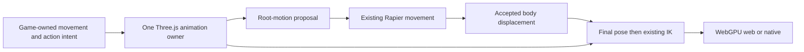

# PRD-ggez-animation-composition — Selectively absorb GGEZ animation mechanics

**Status:** PARTIAL
**Priority:** P2 — Add synchronized locomotion blending and collision-safe root-motion composition without replacing the existing player.
**Adoption order:** 1 of 3 in this batch; ordering is preference, not a dependency on the other two PRDs.
**Complexity:** 6 (MEDIUM); estimated 6–10 implementation files (+2), new composition mechanism (+2), coupled animation/physics state (+2); risk override: none.
**Owner:** ThreeNative maintainers; implementation agent executes the plan.
**Depends on:** The masked-layer behavior specified by [PRD-VQ-05](../animation/PRD-VQ-05-masked-additive-animation.md). That behavior may land in the same implementation; completion of the entire VQ-05 document is not a prerequisite.
**Progress:** 25%
**Planning baseline:** `develop` at `ba72eed258b1aefabb9744dc86fd8282c3ab39a5`; 2026-10-05. This document authorizes no implementation, release or merge.

## Context

ThreeNative already owns clip validation, skeleton-safe preparation and stride synchronization through [AnimationPlayer](https://github.com/ThreeNativeHQ/threenative/blob/ba72eed258b1aefabb9744dc86fd8282c3ab39a5/packages/core/src/animation.ts), with public character integration in [core exports](https://github.com/ThreeNativeHQ/threenative/blob/ba72eed258b1aefabb9744dc86fd8282c3ab39a5/packages/core/src/index.ts). VQ-05 already specifies masked override/additive layers. Do not build a parallel layer owner or treat additive animation as missing Three.js mathematics.

[GGEZ at `45ed541cb163ef98694467758f60d5533373ac60`](https://github.com/vibe-stack/ggez/tree/45ed541cb163ef98694467758f60d5533373ac60) separates its animation runtime from its editors. The inspected donor [runtime](https://github.com/vibe-stack/ggez/blob/45ed541cb163ef98694467758f60d5533373ac60/packages/anim-runtime/src/runtime/index.ts) and [evaluator](https://github.com/vibe-stack/ggez/blob/45ed541cb163ef98694467758f60d5533373ac60/packages/anim-runtime/src/runtime/evaluation.ts) implement layered poses, blend nodes, synchronization and root-motion output. Its compiled graph/pose schema is not a drop-in ThreeNative API.

The useful outcome is a normal ThreeNative character that blends walking/running/strafing, reloads or aims with its upper body, and moves against a wall without animation moving it through the wall.

## Solution

Use Three.js `AnimationMixer`/`AnimationAction` as the pose owner. Extract only donor algorithms that reduce implementation risk: blend-weight selection, normalized-phase synchronization and root-motion interval handling. Prefer existing Three.js operations for additive preparation and action blending. Keep source attribution and the inspected [MIT license](https://github.com/vibe-stack/ggez/blob/45ed541cb163ef98694467758f60d5533373ac60/LICENSE) beside every copied implementation; record changed donor paths and the exact revision in the eventual patch. No source is vendored by this planning PR.

Game-authored TypeScript chooses states, clips, masks and weights. The framework supplies bounded mechanical composition, not a serialized animation graph, editor, new scene format or mandatory `@ggez/*` runtime dependency. No new package is justified for these dependency-free mechanics.

### Contracts

- Blend 1D samples by sorted thresholds. For 2D, use a fixed, validated sample triangulation and barycentric weights; project outside-hull queries to the nearest hull edge. Define exact-sample, duplicate/collinear-sample and zero-weight behavior explicitly. Weights are finite, nonnegative and normalized; invalid inputs fail by name, not by NaN propagation.
- A synchronization group has one normalized-phase clock. Speed changes and crossfades preserve phase; loops wrap deliberately, one-shot clips finish once, and pause/resume does not re-fire events. No second wall clock or per-rig render loop.
- Reuse the VQ-05 layer owner and its proof fixture. One base locomotion layer, one masked override and at most two additive layers suffice. Masks resolve on the cloned rig, never mutate shared clips, and exclude the root unless that ownership is explicitly selected. An explicit additive reference pose is mandatory.
- Evaluate root translation/yaw from a named root track over the fixed-step interval, including loop seams. Strip that contribution from the rendered pose exactly once. Convert the delta into the character body's coordinate convention and pass it through existing Rapier movement; accepted displacement, not requested displacement, updates the actor.
- Root-motion authority and velocity-driven stride synchronization are mutually exclusive for a given step. Ordinary velocity-driven characters keep current behavior. Root-motion mode reports requested/accepted delta and blockage without silently retiming or moving the body twice.
- Order is animation intent/root delta, Rapier movement, final composed pose, existing IK, rendering. Unsupported nonuniform parent transforms fail explicitly in the first slice rather than applying a plausible wrong delta.
- Bound action/scratch capacity at initialization; no per-frame pose-buffer or action creation. Scene exit releases only owned actions/buffers, never another character's shared source data.

## Integration Ledger

| Capability | Reachable consumer/trigger | Replaces / disposition | Evidence |
|---|---|---|---|
| Synchronized blending | Proposed `examples/animation-composition/src/game.ts` scene update → public composition entry → existing mixer | Replaces per-example weight/phase plumbing; existing player remains the default | AC-1, AC-5, AC-6 |
| Masked actions | Same character → VQ-05 layer owner → final pose | One implementation and shared tests with VQ-05; no second layer stack | AC-2 |
| Root motion | Fixed-step animation intent → existing character movement → accepted transform | Opt-in alternative to velocity-driven stride authority, never concurrent body writers | AC-3 |
| Consumer discovery | Exported capability → generated agent guidance → installed example | Document only after the export ships; no editor workflow | AC-8 |

All new paths/APIs below are proposed. Fill actual caller locations when implementing. Shared VQ-05 assertions produce one evidence record reused by both documents; this PRD does not close or rewrite VQ-05.

## Execution Phases

### Phase 1 — A character blends and composes actions

**Status:** PARTIAL
**ACs:** AC-1, AC-2
**Files:** Proposed `packages/core/src/animation-composition.ts`; existing `animation.ts`, `index.ts`; VQ-05's canonical layer implementation/tests; new example game entry.
**Implementation:** Audit donor files/transitive licenses; adapt the smallest useful algorithms to existing Three objects; resolve blend and synchronization data at load; extend the existing layered fixture rather than cloning it. The example must call the public export.

- [ ] AC-1 [local; actor: implementation agent]: Public composition updates produce the independently calculated blend weights and synchronized sample times for the locomotion fixture. proof: `pnpm exec vitest run packages/core/__tests__/animation-composition.spec.ts` (planned; includes invalid layouts and loop/interruption traces). Evidence: pending.
  Source controls pass (8 tests); public JS/DTS build and actual example caller remain unverified.
- [x] AC-2 [local; actor: implementation agent]: The shared VQ-05 consumer preserves the lower-body pose while applying an upper-body action; weight zero restores the base pose within 1e-5 local-transform tolerance. proof: `pnpm exec vitest run packages/core/__tests__/vq-masked-additive-animation.spec.ts --maxWorkers=1`. Evidence: 2026-10-06, CPU 10, exit 0, 6 tests; exact override/lower-body/zero tolerance, additive reference, distinct cloned masks, once pause/replay/cancellation and 50 shared-source disposal cycles. The canonical VQ-05 PRD is unchanged.

**Verification:** Compare against hand-calculated weight/phase cases and independent base-only samples, not a second call to the same helper.
**Checkpoint:** Independent reviewer reproduced five initial defects; red/green controls now pass for turning subdivision/seams, collinear boundary projection, body/ancestor ownership, root interpolation and quaternion track types. A second pass verified mixed-root interval math and found one additional body-hierarchy defect; its red/green control now passes. Build/package/runtime qualification remains open.

### Phase 2 — Movement has one authority

**Status:** PARTIAL
**ACs:** AC-3, AC-4
**Files:** Proposed `packages/core/src/animation-root-motion.ts`; existing character/physics integration identified before editing; example collision course and focused regression fixture.
**Implementation:** Handle loop-seam deltas and reference transforms; route movement through Rapier; exclude the consumed root contribution from skin pose; retain velocity-driven defaults and IK ordering. No new native ABI is assumed.

- [ ] AC-3 [local; actor: implementation agent]: Through the actual game fixed-step path, a root-motion character stops at a collider and its transform follows accepted Rapier displacement with no duplicate root translation. proof: `pnpm exec vitest run packages/core/__tests__/animation-root-motion.spec.ts` (planned real Rapier/loop integration, not a mocked movement helper). Evidence: pending.
  Real Rapier and FixedStepLoop controls pass (6 tests, 240 collision ticks); actual example fixed-step caller and existing IK integration remain to be exercised.
- [x] AC-4 [local; actor: implementation agent]: A character using only the incumbent player retains its previous sampled pose/stride trace when composition is unused. proof: `pnpm exec vitest run packages/core/__tests__/animation-composition.spec.ts packages/core/__tests__/animation.spec.ts --maxWorkers=1`. Evidence: 2026-10-06, CPU 10, exit 0; independent four-tick incumbent pose/stride trace and action/binding baseline pass, plus 51 incumbent-player regression tests. Composition creates no unused-path owner or update registration.

**Verification:** Exercise paused/interrupted/root-loop movement and IK-after-animation ordering; reject unsupported transforms with actionable diagnostics.
**Checkpoint:** Pending; record results on the owning boxes only.

### Phase 3 — The installed consumer works on two runtimes

**Status:** NOT STARTED
**ACs:** AC-5, AC-6
**Files:** Proposed `examples/animation-composition/playtests/composition.playtest.json`, example packaging, capability comments and generated agent guidance; reuse existing playtest runner.
**Implementation:** Package the same game entry for browser and Linux desktop. Scenario drives locomotion, strafe, reload, blocked movement and reset, observing bones/body state and actual rendered output. Test an installed/tarball consumer, not only workspace aliases.

- [ ] AC-5 [shared; actor: implementation agent on a WebGPU runner]: The browser consumer passes the full composition scenario with a nonblank animated character. proof: `node packages/playtest/dist/runner/cli.js examples/animation-composition/playtests/composition.playtest.json --url ${TN_EXAMPLE_URL:?} --browser-recipe webgpu`. Evidence: pending.
- [ ] AC-6 [shared; actor: implementation agent on the Linux native runner]: The same packaged entry passes the composition scenario on Linux native. proof: `node packages/playtest/dist/runner/cli.js examples/animation-composition/playtests/composition.playtest.json --target desktop --executable ${TN_NATIVE_EXECUTABLE:?}`. Evidence: pending.

**Verification:** Record revision, package hashes, adapter/driver, collected assertions and actual result. These are future implementation gates; none ran during planning.
**Checkpoint:** Pending. No Windows, macOS, Android or iOS qualification is implied by Linux evidence.

## Acceptance Criteria

- [ ] AC-7 [shared; actor: implementation agent on the Phase 3 reference runner]: Composition meets the bounded animation CPU budget below. proof: Phase 3 scenario's benchmark mode using the existing playtest performance instrument and isolated baseline/candidate artifacts. Evidence: pending.
- [ ] AC-8 [local; actor: implementation agent]: The packed consumer reaches the documented public capability without any GGEZ editor/compiler/schema package. proof: `pnpm exec vitest run packages/core/__tests__/animation-composition.spec.ts` (planned pack/import-graph consumer arm). Evidence: pending.

## Performance and lifecycle contract

Proposed targets, not measurements: 100 cloned rigs of at most 80 bones, at most eight active actions per rig; 300 warm-up and 1,800 measured frames, three paired runs on the same machine. Composition's incremental p95 CPU cost is at most 2 ms/frame. The unused path adds no actions, buffers or update registrations. Fifty scene enter/exit cycles return owned action and buffer counts to baseline; source-clip hashes stay unchanged. Include those lifecycle assertions in the Phase 3 scenario, not another harness. Report individual paired results and noise; a skipped benchmark or software adapter does not establish the target. Do not loosen a failed target without a recorded scope decision.

## Scope, risks and rollback

Includes bounded blending, synchronization, shared masks/additive behavior and explicit root-motion routing. Excludes generalized graphs/state-machine editors, motion matching, networking, retargeting, new IK solvers and automatic replacement of existing games. The fixture owns visual assets, shaders and motion choices. Primary risks are cloned-rig cross-talk, sync discontinuities, root-motion double application and new work on the unused path.

If selective extraction becomes a dependency on GGEZ's graph compiler, keep upstream Three operations and re-scope the extraction; do not import the framework to save the prototype. Removing the opt-in composition entry must restore the incumbent consumer unchanged.

## Blocked on

Phase 3 requires an actual WebGPU runner and a built Linux native executable supplied through the existing playtest/native workflow. These were not provisioned or exercised in this planning session. Additional platform qualification is outside this bounded first slice and must precede claims for those targets. No owner sign-off, publication or credential gate is required to implement the slice.

## Decisions

2026-10-06 — User authorized this dedicated implementation lane after planning PR 446 merged. Isolated branch `feat/ggez-animation-composition` starts at fetched `origin/develop` `29fdae8bf9141b4a82dac91b276dbb574a7d06a3`. Existing VQ-05 has no landed layer owner or active animation-editing PR; this lane supplies its one shared layer-preparation fixture. PRs 437/438 remain read-only. No GGEZ runtime dependency is introduced: inspected `anim-runtime`, `anim-core`, `anim-schema` and `anim-utils` are MIT; schema's Zod dependency is not imported. Adapted helper/yaw paths retain the pinned donor MIT notice in source. Donor `anim-core/src/clip.ts` was also inspected; its per-call full-pose allocations and loop iteration were not adopted. Browser, Linux native, packed public consumer and the original hardware performance target remain unverified and unticked.

2026-10-05 — User selected GGEZ for selective absorption. Preserve existing animation/physics ownership and share VQ-05's masked-layer implementation. The user requested one documentation-only draft PR containing all three plans; this planning-only batch does not authorize implementing three PRDs in one feature PR. All implementation progress remains zero.
