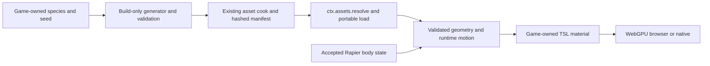

# PRD-procedural-animal-content — Bake procedural animals for a portable game consumer

**Status:** NOT STARTED
**Priority:** P2 — Provide one deterministic, baked animal with WebGPU skinning and physics-follow integration before expanding the species catalogue.
**Adoption order:** 2 of 3; independent of GGEZ animation composition.
**Complexity:** 6 (HIGH); estimated 6–10 implementation files (+2), optional content integration (+2), build/runtime ownership and motion state (+2); risk override: binary-input validation and a custom skinning port require explicit high-risk proof.
**Owner:** ThreeNative maintainers; implementation agent executes the plan.
**Depends on:** None. [PRD-372](../assets/PRD-372-anycreature-through-the-asset-mcp.md) remains the separate anyCreature/MCP authoring workflow, not a prerequisite or replacement target.
**Progress:** 0%
**Planning baseline:** `develop` at `ba72eed258b1aefabb9744dc86fd8282c3ab39a5`; 2026-10-05. This is planning only.

## Context

[Procedural Animals at `c95ae49346aa8e140a924376cec6cf0073d99512`](https://github.com/majidmanzarpour/threejs-procedural-animals/tree/c95ae49346aa8e140a924376cec6cf0073d99512) separates generation/bake loading in [src/index.js](https://github.com/majidmanzarpour/threejs-procedural-animals/blob/c95ae49346aa8e140a924376cec6cf0073d99512/src/index.js) from its [animal motion API](https://github.com/majidmanzarpour/threejs-procedural-animals/blob/c95ae49346aa8e140a924376cec6cf0073d99512/src/animal.js). Its `follow(position, velocity)` seam is useful for a Rapier-authoritative actor.

The [render object](https://github.com/majidmanzarpour/threejs-procedural-animals/blob/c95ae49346aa8e140a924376cec6cf0073d99512/src/core/render/animalObject.js) uses custom dual-quaternion skinning, coat shells/fins, disabled frustum culling and effectively unbounded geometry bounds. Its [coat material](https://github.com/majidmanzarpour/threejs-procedural-animals/blob/c95ae49346aa8e140a924376cec6cf0073d99512/src/core/render/coatMaterial.js) is GLSL-based. Lowering shell quality does not rebake lower-resolution geometry. These are porting/performance tasks, not evidence of ready-made WebGPU/native compatibility.

ThreeNative already has manifest-aware [asset resolution](https://github.com/ThreeNativeHQ/threenative/blob/ba72eed258b1aefabb9744dc86fd8282c3ab39a5/packages/core/src/assets.ts), a build-time asset package and physics/scene lifecycle. Use `ctx.assets.resolve(logicalPath)` for nonstandard files; never hard-code a hashed filename or introduce a parallel manifest.

## Solution

Deliver one quadruped (wolf) through a build-first content pipeline, then prove it walking, turning and stopping under Rapier control. Retain the upstream [MIT notice](https://github.com/majidmanzarpour/threejs-procedural-animals/blob/c95ae49346aa8e140a924376cec6cf0073d99512/LICENSE) for imported files. Audit transitive files and generated-asset provenance before vendoring; this PR adds no upstream code or assets.

Keep the integration optional. A proposed `@threenative/procedural-animals` package is justified only by isolating the upstream generator/motion dependency from core; separate its build-only entry from its runtime loader. If an existing optional content boundary can provide that isolation, use it instead and update this document. Do not add the generator to `@threenative/core`'s normal dependency graph.

### Build and data contract

- Game-authored TypeScript selects species, seed and quality; this is content generation, not a new scene format or DSL. Reuse existing asset-build hooks/commands; no new top-level CLI vocabulary or MCP server.
- Bake on the development/build machine. Cache key includes donor revision, adapter version, species definition, seed, normalized options and geometry tier. Identical inputs under the pinned build runtime produce identical payload hashes. Do not promise bitwise equality across arbitrary JS engines.
- Stage the upstream `.animal` representation plus a small versioned metadata record through the normal asset cook. Reuse upstream bake serialization; only add fields actually needed for compatibility, bounds and integrity. Publish artifacts atomically; interrupted or rejected builds cannot replace the last valid output.
- Validate magic/version, byte length, counts, section offsets, index ranges, bone indices, finite attributes and normalized skin weights before allocating GPU resources. Impose explicit limits: 64 MiB uncompressed payload, 250,000 vertices, 1.5 million indices and 256 bones per animal. Unknown revisions, corrupt payloads and contradictory options fail by name; no silent regeneration or fallback animal.
- Runtime loading follows `ctx.assets.resolve()` and the portable fetch path, verifies the baked payload and constructs Three.js geometry. No network species lookup, SDF meshing, worker creation or Node module import on the game path. Include asset-resolution/corruption behavior in the installed-consumer proof.

### Rendering and motion contract

- Port base-surface dual-quaternion skinning to Three.js node/TSL materials, including normals and shadow casting. Test the known deformation against the CPU reference; stock linear-blend skinning is not a silently equivalent replacement.
- First slice uses an editable game-owned base material in `src/render/`. Fur shells, silhouette fins, eyes and advanced coat optics are deferred visual extensions; do not claim full upstream appearance parity. Preserve material/rig attributes needed for a later port without paying for unused GPU passes.
- Bind-space geometry and pose data may be shared read-only; skeleton/motion/pose buffers belong to each actor. Do not feed procedural motion through `AnimationMixer` or apply the GGEZ composer to the same bones.
- Rapier is the transform authority: fixed-step body movement → accepted position/velocity → animal `follow()` → procedural pose → render. Resolve the upstream parent-space convention explicitly; for the first slice require an identity parent transform, reject unsupported transforms, and convert world/parent coordinates at the adapter boundary.
- Ground sampling comes from existing physics/navigation data. Reset/teleport clears velocity history; pause freezes motion; an action resolves once when completed, interrupted or disposed. No `move()` call may compete with `follow()` on a physics-owned actor.
- Compute conservative animated bounds from the generated rig/envelope and verify them over the action corpus. Enable frustum culling. Bake both high and crowd geometry tiers with consistent individual parameters; choose an appropriate tier when spawning. Runtime shell-quality switches alone are not geometry LOD, and automatic cross-tier morphing is not required here.

## Integration Ledger

| Capability | Reachable consumer/trigger | Replaces / disposition | Evidence |
|---|---|---|---|
| Deterministic baking | Existing asset build → optional build entry → cooked `.animal` | Replaces runtime generation in the shipped game; source generation remains authoring-only | AC-1 |
| Portable load/render | Proposed installed `examples/procedural-animals/src/game.ts` → asset resolver → optional runtime entry → real mesh | No parallel manifest or GLB-only assumption | AC-2, AC-5, AC-6 |
| Procedural movement | Existing fixed-step character controller → accepted Rapier state → follow adapter | Replaces animal self-translation only for physics-owned instances | AC-3 |
| Dependency isolation | Ordinary scaffold/build with no optional import | Existing core/physics paths unchanged; anyCreature/MCP stays separate | AC-8 |

All package/API/test paths below are proposed, not shipped. Fill actual non-test caller locations while implementing and reuse existing asset/playtest fixtures where equivalent.

## Execution Phases

### Phase 1 — A baked wolf reaches the real renderer

**Status:** NOT STARTED
**ACs:** AC-1, AC-2
**Files:** Proposed optional package `src/build.ts`, `src/bake.ts`, `src/runtime.ts`, package exports; existing asset-build integration; example `src/render/animal-material.ts` and portable game entry.
**Implementation:** Pin the smallest donor set, validate licenses and bytes, bake high/crowd variants, integrate normal manifest resolution, and port only base-surface DQS/normal/shadow behavior. Produce one working public consumer rather than an isolated meshing helper.

- [ ] AC-1 [local; actor: implementation agent]: The real asset-build consumer produces identical payload hashes for repeated identical inputs and invalidates the cache when seed or geometry tier changes. proof: `pnpm exec vitest run packages/procedural-animals/__tests__/bake.spec.ts` (planned build-entry integration). Evidence: pending.
- [ ] AC-2 [local; actor: implementation agent]: The runtime loader rejects malformed bakes before any GPU allocation and preserves the validated skinning data on a valid bake. proof: `pnpm exec vitest run packages/procedural-animals/__tests__/runtime.spec.ts` (planned public-loader test). Evidence: pending.

**Verification:** Distinguish metadata/cache hits from actual consumed payload hashes. Numerical deformation and shadow output are qualified through the GPU consumer in Phase 3, not claimed from parser tests.
**Checkpoint:** Pending; self-review and one equivalent reviewer when available.

### Phase 2 — The wolf follows physics with bounded lifetime

**Status:** NOT STARTED
**ACs:** AC-3, AC-4
**Files:** Proposed optional package `src/follow.ts`, `src/bounds.ts`; existing physics integration; example sloped collision course and lifecycle scenario.
**Implementation:** Add the single-writer follow adapter, parent-space validation, height sampling, per-instance ownership, reset/disposal and conservative animated bounds. Keep expensive generation and worker modules outside runtime exports.

- [ ] AC-3 [local; actor: implementation agent]: Through the game fixed-step path, a blocked/stopped/teleported Rapier actor determines the animal root transform without independent animal drift. proof: `pnpm exec vitest run packages/procedural-animals/__tests__/follow.spec.ts` (planned loop integration using real Rapier). Evidence: pending.
- [ ] AC-4 [local; actor: implementation agent]: Every sampled deformed vertex in the selected gait/action corpus lies inside the instance's reported animated bounds. proof: `pnpm exec vitest run packages/procedural-animals/__tests__/bounds.spec.ts` (planned independent CPU deformation oracle). Evidence: pending.

**Verification:** Include two instances sharing a bake with different motion, cancellation during load, and fifty create/dispose cycles. Owned resources return to baseline; shared data remains unchanged. These are assertions in the same focused fixtures, not extra ceremony boxes.
**Checkpoint:** Pending.

### Phase 3 — Qualify the packaged web/native consumer

**Status:** NOT STARTED
**ACs:** AC-5, AC-6
**Files:** Proposed `examples/procedural-animals/playtests/animals.playtest.json`, package/tarball example setup, generated discovery guidance; existing native/playtest tools.
**Implementation:** The same baked wolf walks on a slope, turns, stops against a wall, casts a deformed shadow and disappears when fully outside the frustum. Use independently expected DQS vertex probes (maximum position error 1e-4 m), observed physics transforms and nonblank captures. No regeneration in a warm or cold runtime launch.

- [ ] AC-5 [shared; actor: implementation agent on a WebGPU runner]: The installed browser consumer passes the animal scenario, including actual deformed pixels and off-frustum draw suppression. proof: `node packages/playtest/dist/runner/cli.js examples/procedural-animals/playtests/animals.playtest.json --url ${TN_EXAMPLE_URL:?} --browser-recipe webgpu`. Evidence: pending.
- [ ] AC-6 [shared; actor: implementation agent on the Linux native runner]: The identical baked payload and packaged game entry pass the animal scenario on Linux native. proof: `node packages/playtest/dist/runner/cli.js examples/procedural-animals/playtests/animals.playtest.json --target desktop --executable ${TN_NATIVE_EXECUTABLE:?}`. Evidence: pending.

**Verification:** Record package/bake hashes, adapter, runtime revision, assertions and observed results once. A blank screenshot, skipped GPU test or generated-on-demand fallback cannot pass.
**Checkpoint:** Pending. Additional native platforms remain unqualified until their consumer runs.

## Acceptance Criteria

- [ ] AC-7 [shared; actor: implementation agent on the Phase 3 reference runner]: The baked-animal workload meets the frame/resource budgets below without runtime generation. proof: Phase 3 scenario benchmark mode through the existing playtest performance instrument. Evidence: pending.
- [ ] AC-8 [local; actor: implementation agent]: A packed ordinary game without the optional import contains no animal generator, worker or runtime module. proof: `pnpm exec vitest run packages/procedural-animals/__tests__/runtime.spec.ts` (planned packed-consumer import-graph arm). Evidence: pending.

## Performance and acceptance boundaries

Proposed targets, not measured results: 32 crowd-tier wolves, each at most 8,000 vertices, 128 bones and one opaque base-surface draw, plus the separately counted shadow pass. Use 300 warm-up frames, 1,800 measured frames and three paired runs against the same scene with animals removed, on one recorded hardware adapter. Target incremental p95 CPU ≤2 ms/frame and GPU ≤4 ms/frame; no synchronous readback and no generation work after load. Report high-tier single-animal cost separately; fur and cross-animal instancing are not implied. Fifty lifecycle cycles must leave no owned buffers/listeners/actors alive. A frame-time win from accidentally culling visible animals fails correctness.

## Risks and rollback

The main risks are binary allocation abuse, inaccurate DQS/normal/shadow ports, parent-space drift, bounds that clip the animal, and a runtime import dragging in generation. Disable the optional package and remove its example import to restore incumbent asset/physics behavior; no default template or existing character changes are needed.

This is one species, two baked geometry tiers and the stated actions on browser/Linux. Additional species, full fur, runtime SDF generation, automatic mesh-tier switching, GLB conversion, MCP authoring and mobile crowd qualification are separate scope. In particular, this plan does not duplicate PRD-372's anyCreature toolchain.

## Blocked on

Phase 3 needs a provisioned hardware-WebGPU runner and Linux native build from the existing workflow; neither was run during planning. No external account, AI-generation service, publishing credential or mandatory owner approval is needed for this slice. Missing GPU observations keep the implementation open, not silently browser-only complete.

## Decisions

2026-10-05 — User selected deterministic generation, baking, motion and physics-follow integration. Bake first, retain one physics authority, and qualify a base-surface wolf before claiming the full upstream catalogue or fur renderer. One documentation-only draft PR groups the three requested plans; implementation remains not started.
