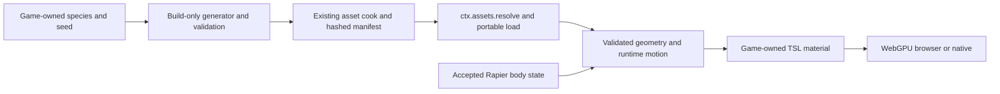

# PRD-procedural-animal-content — Bake procedural animals for a portable game consumer

**Status:** PARTIAL
**Priority:** P2 — Provide one deterministic, baked animal with WebGPU skinning and physics-follow integration before expanding the species catalogue.
**Adoption order:** 2 of 3; independent of GGEZ animation composition.
**Complexity:** 6 (HIGH); estimated 6–10 implementation files (+2), optional content integration (+2), build/runtime ownership and motion state (+2); risk override: binary-input validation and a custom skinning port require explicit high-risk proof.
**Owner:** ThreeNative maintainers; isolated implementation lane `feat/procedural-animal-content` executes this PRD only.
**Depends on:** None. [PRD-372](../assets/PRD-372-anycreature-through-the-asset-mcp.md) remains the separate anyCreature/MCP authoring workflow, not a prerequisite or replacement target.
**Progress:** 50%
**Planning baseline:** `develop` at `ba72eed258b1aefabb9744dc86fd8282c3ab39a5`; 2026-10-05. This is planning only.

## Context

[Procedural Animals at `c95ae49346aa8e140a924376cec6cf0073d99512`](https://github.com/majidmanzarpour/threejs-procedural-animals/tree/c95ae49346aa8e140a924376cec6cf0073d99512) separates generation/bake loading in [src/index.js](https://github.com/majidmanzarpour/threejs-procedural-animals/blob/c95ae49346aa8e140a924376cec6cf0073d99512/src/index.js) from its [animal motion API](https://github.com/majidmanzarpour/threejs-procedural-animals/blob/c95ae49346aa8e140a924376cec6cf0073d99512/src/animal.js). Its `follow(position, velocity)` seam is useful for a Rapier-authoritative actor.

The [render object](https://github.com/majidmanzarpour/threejs-procedural-animals/blob/c95ae49346aa8e140a924376cec6cf0073d99512/src/core/render/animalObject.js) uses custom dual-quaternion skinning, coat shells/fins, disabled frustum culling and effectively unbounded geometry bounds. Its [coat material](https://github.com/majidmanzarpour/threejs-procedural-animals/blob/c95ae49346aa8e140a924376cec6cf0073d99512/src/core/render/coatMaterial.js) is GLSL-based. Lowering shell quality does not rebake lower-resolution geometry. These are porting/performance tasks, not evidence of ready-made WebGPU/native compatibility.

ThreeNative already has manifest-aware [asset resolution](https://github.com/ThreeNativeHQ/threenative/blob/ba72eed258b1aefabb9744dc86fd8282c3ab39a5/packages/core/src/assets.ts), a build-time asset package and physics/scene lifecycle. Use `ctx.assets.resolve(logicalPath)` for nonstandard files; never hard-code a hashed filename or introduce a parallel manifest.

## Solution

Deliver one quadruped (wolf) through a build-first content pipeline, then prove it walking, turning and stopping under Rapier control. Retain the upstream [MIT notice](https://github.com/majidmanzarpour/threejs-procedural-animals/blob/c95ae49346aa8e140a924376cec6cf0073d99512/LICENSE) for imported files. The pinned build/serializer/wolf closure has 24 files and only external `three` imports; five motion files are retained as editable game source with the MIT notice. Generated bakes record donor revision, adapter version, pinned Node runtime and cache identity.

Keep the integration optional. The optional `@threenative/procedural-animals` package is justified only by isolating the upstream generator/motion dependency from core; separate its build-only entry from its runtime loader. If an existing optional content boundary can provide that isolation, use it instead and update this document. Do not add the generator to `@threenative/core`'s normal dependency graph.

### Build and data contract

- Game-authored TypeScript selects species, seed and quality; this is content generation, not a new scene format or DSL. Reuse existing asset-build hooks/commands; no new top-level CLI vocabulary or MCP server.
- Bake on the development/build machine. Cache key includes donor revision, adapter version, species definition, seed, normalized options and geometry tier. Identical inputs under the pinned build runtime produce identical payload hashes. Do not promise bitwise equality across arbitrary JS engines.
- Stage the upstream `.animal` representation plus a small versioned metadata record through the normal asset cook. Reuse upstream bake serialization; only add fields actually needed for compatibility, bounds and integrity. Publish artifacts atomically; interrupted or rejected builds cannot replace the last valid output.
- Validate magic/version, byte length, counts, section offsets, index ranges, bone indices, finite attributes and normalized skin weights before allocating GPU resources. Impose explicit limits: 64 MiB uncompressed payload, 250,000 vertices, 1.5 million indices and 256 bones per animal. Unknown revisions, corrupt payloads and contradictory options fail by name; no silent regeneration or fallback animal.
- Runtime loading follows `ctx.assets.resolve()` and the portable fetch path, verifies the baked payload and constructs Three.js geometry. No network species lookup, SDF meshing, worker creation or Node module import on the game path. Include asset-resolution/corruption behavior in the installed-consumer proof.

### Rendering and motion contract

- Port base-surface dual-quaternion skinning to Three.js node/TSL materials, including normals and shadow casting. Test the known deformation against the CPU reference; stock linear-blend skinning is not a silently equivalent replacement.
- First slice uses an editable game-owned base material in `src/render/`. Fur shells, silhouette fins, eyes and advanced coat optics are deferred visual extensions; do not claim full upstream appearance parity. Preserve material/rig attributes needed for a later port without paying for unused GPU passes.
- Bind-space geometry and pose data may be shared read-only; skeleton/motion/pose buffers belong to each actor. Do not feed procedural motion through `AnimationMixer` or apply the GGEZ composer to the same bones.
- Rapier is the transform authority: fixed-step body movement → accepted position/velocity → animal `follow()` → procedural pose → render. Resolve the upstream parent-space convention explicitly; for the first slice require an identity parent transform, reject unsupported transforms, and convert world/parent coordinates at the adapter boundary.
- Ground sampling comes from existing physics/navigation data. Reset/teleport clears velocity history; pause freezes motion; an action resolves once when completed, interrupted or disposed. No `move()` call may compete with `follow()` on a physics-owned actor.
- Compute conservative animated bounds from the generated rig/envelope and verify them over the action corpus. Enable frustum culling. Bake both high and crowd geometry tiers with consistent individual parameters; choose an appropriate tier when spawning. Runtime shell-quality switches alone are not geometry LOD, and automatic cross-tier morphing is not required here.

## Integration Ledger

| Capability | Reachable consumer/trigger | Replaces / disposition | Evidence |
|---|---|---|---|
| Deterministic baking | Existing asset build → optional build entry → cooked `.animal` | Replaces runtime generation in the shipped game; source generation remains authoring-only | AC-1 |
| Portable load/render | `examples/procedural-animals/src/game.ts` (installed proof pending) → asset resolver → optional runtime entry → real mesh | No parallel manifest or GLB-only assumption | AC-2, AC-5, AC-6 |
| Procedural movement | Existing fixed-step character controller → accepted Rapier state → follow adapter | Replaces animal self-translation only for physics-owned instances | AC-3 |
| Dependency isolation | Ordinary scaffold/build with no optional import | Existing core/physics paths unchanged; anyCreature/MCP stays separate | AC-8 |

Current non-test callers are `examples/procedural-animals/scripts/bake-assets.ts` (optional build entry and normal asset cook), `src/Animals.ts` (resolver, actors and accepted Rapier state), and `src/render/animal-material.ts` (editable DQS/normal/shadow TSL). Packed typecheck/bake/browser bundles and ordinary-game exclusion are verified; actual renderer qualification remains open.

## Execution Phases

### Phase 1 — A baked wolf reaches the real renderer

**Status:** COMPLETE — local AC-1/AC-2 verified; renderer qualification remains Phase 3.
**ACs:** AC-1, AC-2
**Files:** Optional package `src/build.ts`, `src/format.ts`, `src/runtime.ts`, `src/pose.ts`, package exports; existing asset-build integration; example `src/render/animal-material.ts` and portable game entry.
**Implementation:** Pin the smallest donor set, validate licenses and bytes, bake high/crowd variants, integrate normal manifest resolution, and port only base-surface DQS/normal/shadow behavior. Produce one working public consumer rather than an isolated meshing helper.

- [x] AC-1 [local; actor: implementation agent]: The real asset-build consumer produces identical payload hashes for repeated identical inputs and invalidates the cache when seed or geometry tier changes. proof: `pnpm exec vitest run packages/procedural-animals/__tests__/bake.spec.ts` (real build-entry integration). Evidence: 2026-10-06 — 4 bake tests pass: actual uncached pinned wolf generations yield identical consumed SHA-256 payloads; seed/tier changes alter cooked hashes/manifest names; invalid options, corrupt cooking and interrupted partial writes preserve the last valid output. High/crowd individual parameters match. Normal compileAssets runs rather than a parallel manifest.
- [x] AC-2 [local; actor: implementation agent]: The runtime loader rejects malformed bakes before any GPU allocation and preserves the validated skinning data on a valid bake. proof: `pnpm exec vitest run packages/procedural-animals/__tests__/runtime.spec.ts` (public-loader test). Evidence: 2026-10-06 — 33 public parser/loader tests and the actual cooked-wolf integration pass. Malformed limits/offsets/indices/weights/finite values, coercion, inherited joints, excessive metadata depth and finite-byte corruption reject before the BufferGeometry constructor; valid cooked wolf preserves every skin attribute. Streaming limits/abort/cancellation and buffered-response rejection pass. This CPU allocation-order proof does not qualify actual GPU output or native transport allocation.

**Verification:** Distinguish metadata/cache hits from actual consumed payload hashes. Numerical deformation and shadow output are qualified through the GPU consumer in Phase 3, not claimed from parser tests.
**Checkpoint:** Final focused single-worker suite on CPU 10 at 2026-10-06 08:25 UTC: 61/61 tests pass (bake 4, runtime 33, follow 10, bounds 10, qualification lifetime 4); the earlier sealed 57-test receipt remains tied to its source. The fresh reviewer found parser/network/lifecycle/bounds defects; controls reproduced them before repairs. Current engine MCP/playtest/core/physics/animal ESM/DTS/publint builds pass on the parent-granted serial CPU slot; the scaffolder build passes after restoring missing dependencies normally. The installed tarball consumer passes strict typecheck, packaged generation/normal asset cooking and a four-entry Vite bundle. Its graph contains the animal runtime and no donor generator module. GPU observations remain pending. No GPU/native/performance gate has run.

### Phase 2 — The wolf follows physics with bounded lifetime

**Status:** COMPLETE — local AC-3/AC-4 verified; renderer qualification remains Phase 3.
**ACs:** AC-3, AC-4
**Files:** Optional package `src/follow.ts`, `src/bounds.ts`; existing physics integration; example sloped collision course and lifecycle scenario.
**Implementation:** Add the single-writer follow adapter, parent-space validation, height sampling, per-instance ownership, reset/disposal and conservative animated bounds. Keep expensive generation and worker modules outside runtime exports.

- [x] AC-3 [local; actor: implementation agent]: Through the game fixed-step path, a blocked/stopped/teleported Rapier actor determines the animal root transform without independent animal drift. proof: `pnpm exec vitest run packages/procedural-animals/__tests__/follow.spec.ts` (loop integration using real Rapier). Evidence: 2026-10-06 — 10 follow tests pass through the real FixedStepLoop, afterPhysics phase and Rapier backend: blocked/stopped/teleported accepted state is the only animal root authority. Identity-parent rejection, physics ground, pause/reset, completed/interrupted/disposed actions, two independently posed instances and 50 lifetimes per instance pass; owned geometry/material/texture disposal occurs exactly once. Reviewer-discovered partial-construction, failed ground and double-disposal controls failed before repair.
- [x] AC-4 [local; actor: implementation agent]: Every sampled deformed vertex in the selected gait/action corpus lies inside the instance's reported animated bounds. proof: `pnpm exec vitest run packages/procedural-animals/__tests__/bounds.spec.ts` (independent CPU deformation oracle). Evidence: 2026-10-06 — 10 bounds tests pass, including every crowd vertex at 32 selected stand/walk/trot/turn/stop/sit/lie/reset samples against an independent double-precision DQS oracle. Opposed rotations distinguish DQS from collapsed LBS; normals remain unit length; the permitted weight tolerance and edited instance geometry are covered. Pause/zero-step refreshes bounds without pose or texture advancement; normalized edited skin attributes reject by name before their raw arrays could contradict shader-visible values. Formatted game motion agrees with the original pinned donor over 720 ticks (maximum packet error ≤1e-6). Frustum draw suppression and GPU position error ≤1e-4 m remain Phase 3 proof.

**Verification:** Include two instances sharing a bake with different motion, cancellation during load, and fifty create/dispose cycles. Owned resources return to baseline; shared data remains unchanged. These are assertions in the same focused fixtures, not extra ceremony boxes.
**Checkpoint:** The final 61-test run verifies these local contracts; the earlier 57-test receipt retains its original source identity. CPU tests exercise real Rapier and actual pinned wolf generation; renderer culling, GPU positions/normals/shadows and installed Linux ownership remain unverified.

### Phase 3 — Qualify the packaged web/native consumer

**Status:** IN PROGRESS — animal browser scenario passes; the third attempt still fails the frustum capture guard, and Linux native remains unrun.
**ACs:** AC-5, AC-6
**Files:** Proposed `examples/procedural-animals/playtests/animals.playtest.json`, package/tarball example setup, generated discovery guidance; existing native/playtest tools.
**Implementation:** The same baked wolf walks on a slope, turns, stops against a wall, casts a deformed shadow and disappears when fully outside the frustum. Use independently expected DQS vertex probes (maximum position error 1e-4 m), observed physics transforms and nonblank captures. No regeneration in a warm or cold runtime launch.

- [ ] AC-5 [shared; actor: implementation agent on a WebGPU runner]: The installed browser consumer passes the animal scenario, including actual deformed pixels and off-frustum draw suppression. proof: `node packages/playtest/dist/runner/cli.js examples/procedural-animals/playtests/animals.playtest.json --url ${TN_EXAMPLE_URL:?} --browser-recipe webgpu`. Evidence: 2026-10-06 — actual installed headed WebGPU attempt 11:03:32–11:04:05 UTC on NVIDIA Turing failed: uniform final posture capture and startup-held assertion triviality. Nine actual GPU DQS cases completed (maximum position error 3.7937993132632856e-7 m; normal error 4.550296105058373e-7), initial main/shadow wolf draws 32/32 and root error 0. These supporting observations do not pass this AC. The frustum scenario was not launched after the failure. Its immutable report/images/input snapshot remain under `animal-platform-runs/attempt.5CE8akDw` outside the checkout. The repaired game holds all original capture milestones through portable inputs, explicitly arms probes after runner baseline and keeps the course visible in the outside view.
- [ ] AC-6 [shared; actor: implementation agent on the Linux native runner]: The identical baked payload and packaged game entry pass the animal scenario on Linux native. proof: `node packages/playtest/dist/runner/cli.js examples/procedural-animals/playtests/animals.native.playtest.json --target desktop --executable ${TN_NATIVE_EXECUTABLE:?}`. Evidence: pending.

**Verification:** Record package/bake hashes, adapter, runtime revision, assertions and observed results once. A blank screenshot, skipped GPU test or generated-on-demand fallback cannot pass.
**Checkpoint:** The failing browser attempt is retained with package/source/adapter and all 1,809 original input files; no failed receipt is relabelled. Independent review identified screenshot-latency timeline drift and pre-satisfied observations. Red controls reproduced the observed delay; corrected clock/camera and portable resource ownership checks pass 38/38 focused tests on CPU 10, one worker. Six browser/native fixtures pass the shipped public scenario loader. Final reviewed installed strict typecheck and five-entry browser production builds pass (139 graph modules); the identical installed `src/game.ts` produces a standalone 115-module Linux/V8 bundle. Both actual graphs contain the optional runtime and exclude donor generation/build/Node-worker imports. The first native bundler attempt reproduced a five-HTML-input/library conflict; the owned build config uses the existing `TN_BENCH_TARGET=native` convention and the ordinary bundler rerun passes. No core or host rebuild occurred. Actual rerun pixels, native and performance/lifecycle remain open. Additional native platforms remain unqualified until their consumer runs.

## Acceptance Criteria

- [ ] AC-7 [shared; actor: implementation agent on the Phase 3 reference runner]: The baked-animal workload meets the frame/resource budgets below without runtime generation. proof: Phase 3 scenario benchmark mode through the existing playtest performance instrument. Evidence: 2026-10-06 — portable 50-generation driver/census is implemented and CPU controls pass, including five reproduced missing/contradictory GPU-observation failures. It observes actual device buffer/texture handles, exact buffer bytes and creation/destruction conservation, completed main/shadow submissions, Three memory, Rapier bodies, entities, listeners, post-disposal callbacks and pending actions. An explicit input starts it after runner baseline; every cycle must return to the stable shared-renderer census after asynchronous queue completion. Observer-install and first-ready snapshots distinguish shared allocations honestly. Actual GPU lifecycle cycles and the original 300/1,800-frame, three-pair CPU/GPU budgets have not run; this box stays open.
- [x] AC-8 [local; actor: implementation agent]: A packed ordinary game without the optional import contains no animal generator, worker or runtime module. proof: `node examples/procedural-animals/scripts/check-ordinary-graph.mjs /home/joao/Documents/Codex/2026-10-05/task-4/animal-packed-consumer/ordinary`. Evidence: 2026-10-06 — The separate ordinary game installs the same core/physics/playtest tarballs and pinned Three/compiler/Vite, with no optional animal dependency. Strict typecheck and production build pass on CPU 10. The emitted graph contains 101 modules and 11 JavaScript artifacts; graph, package/lock and emitted-script checks find no animal generator, worker or runtime. The same verifier rejects the existing wolf production graph by name for its actual installed animal runtime. Core terrain workers remain ordinary core content. No browser/native launch is claimed by this build proof.

## Performance and acceptance boundaries

Proposed targets, not measured results: 32 crowd-tier wolves, each at most 8,000 vertices, 128 bones and one opaque base-surface draw, plus the separately counted shadow pass. Use 300 warm-up frames, 1,800 measured frames and three paired runs against the same scene with animals removed, on one recorded hardware adapter. Target incremental p95 CPU ≤2 ms/frame and GPU ≤4 ms/frame; no synchronous readback and no generation work after load. Report high-tier single-animal cost separately; fur and cross-animal instancing are not implied. Fifty lifecycle cycles must leave no owned buffers/listeners/actors alive. A frame-time win from accidentally culling visible animals fails correctness.

## Risks and rollback

The main risks are binary allocation abuse, inaccurate DQS/normal/shadow ports, parent-space drift, bounds that clip the animal, and a runtime import dragging in generation. Disable the optional package and remove its example import to restore incumbent asset/physics behavior; no default template or existing character changes are needed.

This is one species, two baked geometry tiers and the stated actions on browser/Linux. Additional species, full fur, runtime SDF generation, automatic mesh-tier switching, GLB conversion, MCP authoring and mobile crowd qualification are separate scope. In particular, this plan does not duplicate PRD-372's anyCreature toolchain.

## Blocked on

2026-10-06 — The parent released GGEZ’s serial CPU slot to this lane at 07:50 for package builds, normal hooks, the installed consumer and draft publication. These builds and the installed source/bake/bundle checks have run; focused tests stay on CPU 10 with one worker. Hardware WebGPU and Linux-native scheduling remain with the parent; Strata/HLOD has GPU priority. The final parent-owned production resource-clock fix was adopted normally and passes its 7 focused tests. Hooks have not been bypassed.

The native fetch host currently returns an already-buffered response without `Response.body`; the loader rejects oversized bytes before geometry, but this does not establish a native transport allocation limit. The real Linux consumer must establish the stated binary/GPU allocation boundary without silently claiming the browser streaming cap applies to the host.

Phase 3 needs a provisioned hardware-WebGPU runner and Linux native build from the existing workflow; neither was run during planning. No external account, AI-generation service, publishing credential or mandatory owner approval is needed for this slice. Missing GPU observations keep the implementation open, not silently browser-only complete.

## Decisions

2026-10-05 — User selected deterministic generation, baking, motion and physics-follow integration. Bake first, retain one physics authority, and qualify a base-surface wolf before claiming the full upstream catalogue or fur renderer. The documentation-only PR grouped the three plans; this implementation owns only the animal PRD and requires its own draft PR.

2026-10-06 — Implementation base is actual fetched `origin/develop` at `29fdae8bf9141b4a82dac91b276dbb574a7d06a3` (documentation PR #446), with foreign work preserved in its existing checkouts. The smallest consumer is the wolf example: one portable entry loads high/crowd bakes through `ctx.assets.resolve`; build-time generation stages atomic source bakes before the normal asset cook. The optional package contains validated loading, build-only baking, per-instance pose/follow/lifetime and animated bounds; the example contains donor motion and DQS/normal/shadow TSL. The installed game entry passes typecheck and production browser bundling; platform gates remain open. No core, physics, AnimationPlayer/composer or secondary-simulation source changed.

2026-10-06 — Pinned donor archive SHA-256 is `7d0a04f0e1b910f13acc5fb3fe3d1372d73f8c257f8d168afe937a80fe34b82e`. Its root MIT notice is retained in `packages/procedural-animals/LICENSES/Procedural-Animals-MIT.txt`. Source/import/license inspection found a 24-file build/serializer/wolf closure and only external `three` imports; the generator is imported solely by the optional build export. Upstream serializes nondeterministic timing statistics (`weightsMs`, `coatMs`, `buildMs`), which must be excluded from deterministic payloads. Reuse upstream PANM serialization, pin the build runtime and include donor/species/options/tier identity in cache keys. Actual repeated consumed wolf hashes and atomic bake controls now pass AC-1. Runtime export isolation in a packed ordinary game is verified by AC-8.

2026-10-06 — Source review found qualifier scene/probe cleanup failures. Three failure-injection controls against the earlier scene/probe reproduced skipped releases; repairs pass. Strict optional-package compilation retains all animal tests and uses the existing asset harness declaration. A fourth CPU test drives actual Three WGSL material construction, RenderObject, Geometries, Attributes and Info with a fake allocation backend, proving the five compute attributes reach normal geometry destruction. This is not actual GPU leak evidence. Qualification-only compute waits until the invisible diagnostic Mesh has an established render owner; benchmark modes omit that probe. Renderer observations, shadow pixels, native parity and 50 GPU lifecycle cycles remain open.

2026-10-06 — Installed packaged bakes match source repeats exactly: seed-7 crowd SHA-256 `f86a56cee88491a210f652788dad7c5024fafd3d961880fc0b85524133be3c6b` (1,099,120 bytes; 6,999 vertices; 37 bones), high `6bf3f6cf5477c6afb0fb22915979d81417638dbca49131902afdbce742637b3e` (11,268,048 bytes; 75,788 vertices; 37 bones). The seed-8 crowd changes to `ca38e831c5b7da8268d857438ee265b0d3ca4439441eb40ef22dfd5498cbb370`. No runtime generation was needed by the bundle build; an actual cold browser/native launch remains unverified.

2026-10-06 — The parent granted a serial CPU continuation for the ordinary-game exclusion arm and runbook preparation. AC-8 is now verified with the real installed ordinary production bundle and wolf rejection control. Remaining platform execution requires the parent’s GPU/native allocation. The finite qualification runbook seals source/package/bake/scenario/build inputs and keeps original performance/lifetime thresholds. AC-7 cannot use the current 1,024-frame retained series as 1,800 samples, aggregate window percentiles as a full-run p95, startup-only visibility as continuous submission proof, or upload-byte counters as live GPU resource counts. Measurement and 50-cycle resource observation must be complete before that hardware gate can qualify.

2026-10-06 — Parent-requested CPU layout control reproduces the missing canvas percentage sizing in all four authored HTML entries: reducing a 1,280×720 drawing buffer to 640×360 also reduced CSS layout to 640×360. Applying the generated minimal template’s canvas width/height rules passes all four actual inert-Chromium layout tests, including physical 3×3 buffers and 1,024×768 viewports. No game script, GPU context or screenshot is used by that regression. Installed rebuild/reseal requires the next parent-assigned serial CPU slot before platform qualification.

2026-10-06 — AC-6 requires the identical baked payload/game entry and real native animal output, not a new native CDP network observer. Native-compatible qualification fixtures preserve the browser scenario’s steps, resource/GPU error thresholds, geometry and submission assertions. They use existing native labeled PNG/tone capture and require independent review of actual wolf deformation and shadows; the existing target diagnostics policy records the unavailable CDP channel rather than reporting a passing empty observation. The public scenario loader validates all four fixtures, and three existing native tone runner CPU controls pass (other seven intentionally unselected). These are preparation, not a Linux run. No playtest or host observer API changed, and original acceptance text and performance/binary thresholds remain unchanged.

2026-10-06 — On the parent-released serial CPU slot, the installed consumer strict typecheck and four-entry Vite build pass after copying the current HTML/scenarios. Every portable installed source file equals the candidate source; package dependencies/archives and baked payloads are unchanged, so no core/package/native rebuild was needed. Independent source review confirms native PNG dimensions follow the adaptive drawing buffer rather than the requested window; retain decoded dimensions, existing public frame-budget surface records and actual wolf/shadow review without adding a fixed PNG-size acceptance threshold. AC-5–7 remain open until executed platform/performance/lifetime proof.

2026-10-06 qualification repair — Layer: game/example. The measured blank posture capture came from its autonomous camera departure while screenshot work continued, so no engine/core change is needed. Qualification-only KeyP arms numerical probes after baseline; KeyN releases the held 2/4.5/11/24.5 s milestones; KeyF selects the course-visible off-frustum view. Benchmark modes keep their existing crowd camera/path. GPU error values are absent until observed; all original numerical, draw, vertex/bone, motion and visual thresholds remain unchanged. The existing documented held-invariant reason is used only for startup-established values. A fresh read-only reviewer audited the actual device/Three/native destruction paths, found census schema/start/wait-limit defects and confirmed their repairs. No full board, native execution, GPU rerun or 100% claim is implied by these focused CPU results.

2026-10-06 second browser attempt — Published source `08616b7a0ad6ca4f3432b81720c8cf361bef4197` ran 11:49:33–11:50:19 UTC and failed only `TN_PLAYTEST_ENTITY_VISIBILITY_DROPPED`: the fixture's descriptive subject requested an absent entity. Nine real GPU cases passed the original numerical bounds (maximum position error 3.7937993132632856e-7 m, normal error 4.877406895341573e-7); all other scenario assertions passed. Independent review confirmed four nonblank wolf deformation/shadow PNGs and also found rear geometry clipping through the wall. The report, four PNGs and all 1,903 exact input files are preserved under `animal-platform-runs/attempt.A3JoCvh7`. The canonical lease, private browser/display processes and port 5195 were released. Frustum and native were not launched; AC-5 remains open.

The correction stays in the game layer. Real harness controls reproduce all four incorrect subject requests and now select `wolf-0` without changing the original visual or numerical thresholds. Real Rapier/DQS tests reproduce 0.260 m stopped-surface wall penetration with the historical capsule and a 0.923 m horizontal animated extent beyond its 0.25 m radius. The shared game helper measures bind-origin sphere radii 1.143367 m (crowd) and 1.144010 m (high); every vertex at the 32 selected gait/action samples fits its horizontal clearance, including 223,968 crowd and 2,425,216 high observations. The corrected physical test has accepted stopped Z velocity 0, root error 0, 0.633 m conservative mesh-to-wall stand-off and 0.012923 m minimum surface-to-slope gap. These measurements describe the sphere/controller tradeoff; they do not claim exact foot contact or passing new pixels. A fresh independent reviewer found no new runtime blocker and caught an inherited final-only root-error observation; a failure-injection control reproduces erased transient drift before cumulative reporting is applied. Camera framing now follows the completed actor's measured bind center after teleport. The reviewed correction still requires rebuilt/sealed installed browser/native graphs and actual platform reruns. AC-5–7 stay open.

Final focused repair verification: `animal-wall-final47.json` reports 47 passed / 0 failed across nine affected files on one CPU 10 worker. The installed consumer strict typecheck and five-entry Vite production build pass; its ordinary standalone Linux entry also bundles and parses as a classic script. No package/core/host rebuild or new platform launch occurred.

2026-10-06 third browser attempt — Published source `2653aaa8b7d957e91ad378e95e250a1a89a0a56b` ran 12:41:34–12:42:35 UTC on the installed NVIDIA Turing headed WebGPU consumer. The animal scenario passes all 17 assertions. The separate frustum scenario passes all 17 assertions, including actual wolf main submissions falling to zero, but its `outside.png` has only seven colours and correctly fails `TN_CAPTURE_BLANK`. Its nine real GPU cases have maximum position error 6.337275425431804e-7 m and normal error 4.978046099538083e-7; cumulative root error remains zero. Independent image review confirms clear wall stand-off, articulated stride and distinct wolf shadows in the animal captures; final standing captures do not independently establish sit/lie pixels or exact zero paw gap. The outside image contains a uniform floor corner against sky, so the remaining defect belongs to game appearance. All 1,936 exact original inputs and reports/images are preserved under `animal-platform-runs/attempt.bK7ybAC8`. Own processes, port and canonical lease were released and independently checked at 12:43:26 UTC. Native was not launched after the frustum failure. AC-5–7 remain open.

The game course now gives its existing floor a small repeating, linearly filtered Three DataTexture with metre-sized squares. Animal, animal-free baseline and lifecycle modes share it, with explicit course-owned texture disposal. No additional draw pass, renderer policy, capture guard or wolf-exclusion predicate changes. Actual corrected browser/native pixels remain unverified pending the parent-assigned window.

Floor repair preparation: fresh independent source review finds no blocker in portability, metre scaling, shared baseline use or texture disposal. Four focused camera/lifecycle-generation controls pass; installed strict `tsc6` typecheck, five-entry browser production build, standalone classic-script-valid Linux entry build and documentation link check pass on serial CPU 10. The first typecheck command used a nonexistent installed `tsc` executable and failed before compiling; the corrected installed `tsc6` command passes. No core/host rebuild or actual corrected GPU/native run occurred.
