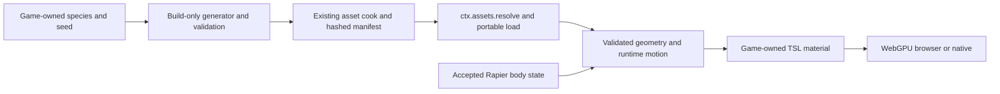

# PRD-procedural-animal-content — Bake procedural animals for a portable game consumer

**Status:** PARTIAL
**Priority:** P2 — Provide one deterministic, baked animal with WebGPU skinning and physics-follow integration before expanding the species catalogue.
**Adoption order:** 2 of 3; independent of GGEZ animation composition.
**Complexity:** 6 (HIGH); estimated 6–10 implementation files (+2), optional content integration (+2), build/runtime ownership and motion state (+2); risk override: binary-input validation and a custom skinning port require explicit high-risk proof.
**Owner:** ThreeNative maintainers; isolated implementation lane `feat/procedural-animal-content` executes this PRD only.
**Depends on:** None. [PRD-372](../assets/PRD-372-anycreature-through-the-asset-mcp.md) remains the separate anyCreature/MCP authoring workflow, not a prerequisite or replacement target.
**Progress:** 75%
**Planning baseline:** `develop` at `ba72eed258b1aefabb9744dc86fd8282c3ab39a5`; 2026-10-05. This is planning only.

## Context

[Procedural Animals at `c95ae49346aa8e140a924376cec6cf0073d99512`](https://github.com/majidmanzarpour/threejs-procedural-animals/tree/c95ae49346aa8e140a924376cec6cf0073d99512) separates generation/bake loading in [src/index.js](https://github.com/majidmanzarpour/threejs-procedural-animals/blob/c95ae49346aa8e140a924376cec6cf0073d99512/src/index.js) from its [animal motion API](https://github.com/majidmanzarpour/threejs-procedural-animals/blob/c95ae49346aa8e140a924376cec6cf0073d99512/src/animal.js). Its `follow(position, velocity)` seam is useful for a Rapier-authoritative actor.

The [render object](https://github.com/majidmanzarpour/threejs-procedural-animals/blob/c95ae49346aa8e140a924376cec6cf0073d99512/src/core/render/animalObject.js) uses custom dual-quaternion skinning, coat shells/fins, disabled frustum culling and effectively unbounded geometry bounds. Its [coat material](https://github.com/majidmanzarpour/threejs-procedural-animals/blob/c95ae49346aa8e140a924376cec6cf0073d99512/src/core/render/coatMaterial.js) is GLSL-based. Lowering shell quality does not rebake lower-resolution geometry. These are porting/performance tasks, not evidence of ready-made WebGPU/native compatibility.

ThreeNative already has manifest-aware [asset resolution](https://github.com/ThreeNativeHQ/threenative/blob/ba72eed258b1aefabb9744dc86fd8282c3ab39a5/packages/core/src/assets.ts), a build-time asset package and physics/scene lifecycle. Use `ctx.assets.resolve(logicalPath)` for nonstandard files; never hard-code a hashed filename or introduce a parallel manifest.

## Solution

Deliver one quadruped (wolf) through a build-first content pipeline, then prove it walking, turning and stopping under Rapier control. Retain the upstream [MIT notice](https://github.com/majidmanzarpour/threejs-procedural-animals/blob/c95ae49346aa8e140a924376cec6cf0073d99512/LICENSE) for imported files. The pinned build/serializer/wolf closure has 24 files and only external `three` imports; five motion files are retained as editable game source with the MIT notice. Generated bakes record donor revision, adapter version, pinned Node runtime and cache identity.

Keep the integration optional. The optional `@threenative/procedural-animals` package is justified only by isolating the upstream generator/motion dependency from core; separate its build-only entry from its runtime loader. If an existing optional content boundary can provide that isolation, use it instead and update this document. Do not add the generator to `@threenative/core`'s normal dependency graph.

### Build and data contract

- Game-authored TypeScript selects species, seed and quality; this is content generation, not a new scene format or DSL. Reuse existing asset-build hooks/commands; no new top-level CLI vocabulary or MCP server.
- Bake on the development/build machine. Cache key includes donor revision, adapter version, species definition, seed, normalized options and geometry tier. Identical inputs under the pinned build runtime produce identical payload hashes. Do not promise bitwise equality across arbitrary JS engines.
- Stage the upstream `.animal` representation plus a small versioned metadata record through the normal asset cook. Reuse upstream bake serialization; only add fields actually needed for compatibility, bounds and integrity. Publish artifacts atomically; interrupted or rejected builds cannot replace the last valid output.
- Validate magic/version, byte length, counts, section offsets, index ranges, bone indices, finite attributes and normalized skin weights before allocating GPU resources. Impose explicit limits: 64 MiB uncompressed payload, 250,000 vertices, 1.5 million indices and 256 bones per animal. Unknown revisions, corrupt payloads and contradictory options fail by name; no silent regeneration or fallback animal.
- Runtime loading follows `ctx.assets.resolve()` and the portable fetch path, verifies the baked payload and constructs Three.js geometry. No network species lookup, SDF meshing, worker creation or Node module import on the game path. Include asset-resolution/corruption behavior in the installed-consumer proof.

### Rendering and motion contract

- Port base-surface dual-quaternion skinning to Three.js node/TSL materials, including normals and shadow casting. Test the known deformation against the CPU reference; stock linear-blend skinning is not a silently equivalent replacement.
- First slice uses an editable game-owned base material in `src/render/`. Fur shells, silhouette fins, eyes and advanced coat optics are deferred visual extensions; do not claim full upstream appearance parity. Preserve material/rig attributes needed for a later port without paying for unused GPU passes.
- Bind-space geometry and pose data may be shared read-only; skeleton/motion/pose buffers belong to each actor. Do not feed procedural motion through `AnimationMixer` or apply the GGEZ composer to the same bones.
- Rapier is the transform authority: fixed-step body movement → accepted position/velocity → animal `follow()` → procedural pose → render. Resolve the upstream parent-space convention explicitly; for the first slice require an identity parent transform, reject unsupported transforms, and convert world/parent coordinates at the adapter boundary.
- Ground sampling comes from existing physics/navigation data. Reset/teleport clears velocity history; pause freezes motion; an action resolves once when completed, interrupted or disposed. No `move()` call may compete with `follow()` on a physics-owned actor.
- Compute conservative animated bounds from the generated rig/envelope and verify them over the action corpus. Enable frustum culling. Bake both high and crowd geometry tiers with consistent individual parameters; choose an appropriate tier when spawning. Runtime shell-quality switches alone are not geometry LOD, and automatic cross-tier morphing is not required here.

## Integration Ledger

| Capability | Reachable consumer/trigger | Replaces / disposition | Evidence |
|---|---|---|---|
| Deterministic baking | Existing asset build → optional build entry → cooked `.animal` | Replaces runtime generation in the shipped game; source generation remains authoring-only | AC-1 |
| Portable load/render | `examples/procedural-animals/src/game.ts` (installed browser and Linux native verified) → asset resolver → optional runtime entry → real mesh | No parallel manifest or GLB-only assumption | AC-2, AC-5, AC-6 |
| Procedural movement | Existing fixed-step character controller → accepted Rapier state → follow adapter | Replaces animal self-translation only for physics-owned instances | AC-3 |
| Dependency isolation | Ordinary scaffold/build with no optional import | Existing core/physics paths unchanged; anyCreature/MCP stays separate | AC-8 |

Current non-test callers are `examples/procedural-animals/scripts/bake-assets.ts` (optional build entry and normal asset cook), `src/Animals.ts` (resolver, actors and accepted Rapier state), and `src/render/animal-material.ts` (editable DQS/normal/shadow TSL). Packed typecheck/bake/browser bundles, ordinary-game exclusion and installed browser rendering are verified; Linux native correctness is verified; frame/resource budgets remain open.

## Execution Phases

### Phase 1 — A baked wolf reaches the real renderer

**Status:** COMPLETE — local AC-1/AC-2 verified; renderer qualification remains Phase 3.
**ACs:** AC-1, AC-2
**Files:** Optional package `src/build.ts`, `src/format.ts`, `src/runtime.ts`, `src/pose.ts`, package exports; existing asset-build integration; example `src/render/animal-material.ts` and portable game entry.
**Implementation:** Pin the smallest donor set, validate licenses and bytes, bake high/crowd variants, integrate normal manifest resolution, and port only base-surface DQS/normal/shadow behavior. Produce one working public consumer rather than an isolated meshing helper.

- [x] AC-1 [local; actor: implementation agent]: The real asset-build consumer produces identical payload hashes for repeated identical inputs and invalidates the cache when seed or geometry tier changes. proof: `pnpm exec vitest run packages/procedural-animals/__tests__/bake.spec.ts` (real build-entry integration). Evidence: 2026-10-06 — 4 bake tests pass: actual uncached pinned wolf generations yield identical consumed SHA-256 payloads; seed/tier changes alter cooked hashes/manifest names; invalid options, corrupt cooking and interrupted partial writes preserve the last valid output. High/crowd individual parameters match. Normal compileAssets runs rather than a parallel manifest.
- [x] AC-2 [local; actor: implementation agent]: The runtime loader rejects malformed bakes before any GPU allocation and preserves the validated skinning data on a valid bake. proof: `pnpm exec vitest run packages/procedural-animals/__tests__/runtime.spec.ts` (public-loader test). Evidence: 2026-10-06 — 33 public parser/loader tests and the actual cooked-wolf integration pass. Malformed limits/offsets/indices/weights/finite values, coercion, inherited joints, excessive metadata depth and finite-byte corruption reject before the BufferGeometry constructor; valid cooked wolf preserves every skin attribute. Streaming limits/abort/cancellation and buffered-response rejection pass. This CPU allocation-order proof does not qualify actual GPU output or native transport allocation.

**Verification:** Distinguish metadata/cache hits from actual consumed payload hashes. Numerical deformation and shadow output are qualified through the GPU consumer in Phase 3, not claimed from parser tests.
**Checkpoint:** Final focused single-worker suite on CPU 10 at 2026-10-06 08:25 UTC: 61/61 tests pass (bake 4, runtime 33, follow 10, bounds 10, qualification lifetime 4); the earlier sealed 57-test receipt remains tied to its source. The fresh reviewer found parser/network/lifecycle/bounds defects; controls reproduced them before repairs. Current engine MCP/playtest/core/physics/animal ESM/DTS/publint builds pass on the parent-granted serial CPU slot; the scaffolder build passes after restoring missing dependencies normally. The installed tarball consumer passes strict typecheck, packaged generation/normal asset cooking and a four-entry Vite bundle. Its graph contains the animal runtime and no donor generator module. GPU observations remain pending. No GPU/native/performance gate has run.

### Phase 2 — The wolf follows physics with bounded lifetime

**Status:** COMPLETE — local AC-3/AC-4 verified; renderer qualification remains Phase 3.
**ACs:** AC-3, AC-4
**Files:** Optional package `src/follow.ts`, `src/bounds.ts`; existing physics integration; example sloped collision course and lifecycle scenario.
**Implementation:** Add the single-writer follow adapter, parent-space validation, height sampling, per-instance ownership, reset/disposal and conservative animated bounds. Keep expensive generation and worker modules outside runtime exports.

- [x] AC-3 [local; actor: implementation agent]: Through the game fixed-step path, a blocked/stopped/teleported Rapier actor determines the animal root transform without independent animal drift. proof: `pnpm exec vitest run packages/procedural-animals/__tests__/follow.spec.ts` (loop integration using real Rapier). Evidence: 2026-10-06 — 10 follow tests pass through the real FixedStepLoop, afterPhysics phase and Rapier backend: blocked/stopped/teleported accepted state is the only animal root authority. Identity-parent rejection, physics ground, pause/reset, completed/interrupted/disposed actions, two independently posed instances and 50 lifetimes per instance pass; owned geometry/material/texture disposal occurs exactly once. Reviewer-discovered partial-construction, failed ground and double-disposal controls failed before repair.
- [x] AC-4 [local; actor: implementation agent]: Every sampled deformed vertex in the selected gait/action corpus lies inside the instance's reported animated bounds. proof: `pnpm exec vitest run packages/procedural-animals/__tests__/bounds.spec.ts` (independent CPU deformation oracle). Evidence: 2026-10-06 — 10 bounds tests pass, including every crowd vertex at 32 selected stand/walk/trot/turn/stop/sit/lie/reset samples against an independent double-precision DQS oracle. Opposed rotations distinguish DQS from collapsed LBS; normals remain unit length; the permitted weight tolerance and edited instance geometry are covered. Pause/zero-step refreshes bounds without pose or texture advancement; normalized edited skin attributes reject by name before their raw arrays could contradict shader-visible values. Formatted game motion agrees with the original pinned donor over 720 ticks (maximum packet error ≤1e-6). Frustum draw suppression and GPU position error ≤1e-4 m remain Phase 3 proof.

**Verification:** Include two instances sharing a bake with different motion, cancellation during load, and fifty create/dispose cycles. Owned resources return to baseline; shared data remains unchanged. These are assertions in the same focused fixtures, not extra ceremony boxes.
**Checkpoint:** The final 61-test run verifies these local contracts; the earlier 57-test receipt retains its original source identity. CPU tests exercise real Rapier and actual pinned wolf generation; renderer culling, GPU positions/normals/shadows and installed Linux ownership remain unverified.

### Phase 3 — Qualify the packaged web/native consumer

**Status:** COMPLETE — AC-5 installed browser and AC-6 frozen Linux native qualification pass; AC-7 performance and lifetime acceptance remains open.
**ACs:** AC-5, AC-6
**Files:** Proposed `examples/procedural-animals/playtests/animals.playtest.json`, package/tarball example setup, generated discovery guidance; existing native/playtest tools.
**Implementation:** The same baked wolf walks on a slope, turns, stops against a wall, casts a deformed shadow and disappears when fully outside the frustum. Use independently expected DQS vertex probes (maximum position error 1e-4 m), observed physics transforms and nonblank captures. No regeneration in a warm or cold runtime launch.

- [x] AC-5 [shared; actor: implementation agent on a WebGPU runner]: The installed browser consumer passes the animal scenario, including actual deformed pixels and off-frustum draw suppression. proof: `node packages/playtest/dist/runner/cli.js examples/procedural-animals/playtests/animals.playtest.json --url ${TN_EXAMPLE_URL:?} --browser-recipe webgpu`. Evidence: 2026-10-06 — installed headed hardware-WebGPU source `7c73fbad570155cd720feb5e7352dcf68ab4bcfd` ran 13:25:45–13:26:46 UTC on NVIDIA Turing/RTX 2080. Both animal and frustum reports pass all 17 assertions with no diagnostics. Nine actual GPU DQS cases per scenario have maximum position error 6.337275425431804e-7 m and normal error 4.978046099538083e-7; cumulative root error is zero, initial main/shadow draws are 32/32, and fully outside main draws are zero. Independent image review confirms articulated wolf/heading changes, deformed shadows, wall stand-off and a nonblank textured outside course without wolves. It does not claim exact zero paw gap or independent sit/lie pixels from the final standing capture. Reports, PNGs, adapter and all 1,947 original sealed inputs are preserved in `animal-platform-runs/attempt.UxK63uHa`; the corrected floor passes the unchanged capture guard.
- [x] AC-6 [shared; actor: implementation agent on the Linux native runner]: The identical baked payload and packaged game entry pass the animal scenario on Linux native. proof: `node packages/playtest/dist/runner/cli.js examples/procedural-animals/playtests/animals.native.playtest.json --target desktop --executable ${TN_NATIVE_EXECUTABLE:?}`. Evidence: 2026-10-06 — frozen published source `472925d7b42eae2b4c1de89604334a5d7552b693` passes installed Linux V8/Dawn/RTX 2080 animal 20/20 and frustum 19/19 assertions at 15:20:52–15:21:58 UTC. The existing production prelude requests wall-clock ahead of the unchanged entry bundle; 181/185 actual bridge clock observations confirm it. The raw report label remains fixed-step because runner-support derives the config flag, and is preserved with the discrepancy recorded. Each arm has nine actual GPU cases, maximum position error 6.337275425425687e-7 m, normal error 4.978046099538083e-7 and root error zero; startup main/shadow draws 32/32 and fully outside main draws 0. Both captured-console guards pass 803/801 nonempty records with zero errors; runtimeDiagnostics/network remain unavailable. All seven 1280×720 PNGs have independent review: intact articulated wolf/heading changes, deformed shadows, wall clearance and nonblank outside course without wolves; exact paw contact, independent sit/lie pixels and pixel parity are unclaimed. Each actual canonical holder was saved before host launch, wrappers exited 0 after cleanup, and no host/holder remained at 15:22:37 UTC. `animal-platform-runs/attempt.vRlqpqSr` preserves all 2,055 original inputs, reports, responses, PNGs, lease/clock records and artifact hashes. Earlier failed attempts remain intact.

**Verification:** Record package/bake hashes, adapter, runtime revision, assertions and observed results once. A blank screenshot, skipped GPU test or generated-on-demand fallback cannot pass.
**Checkpoint:** The fourth attempt preserves all 1,947 exact inputs and passes both installed hardware browser scenarios plus independent image review. The installed strict typecheck, five-entry browser build (140 modules) and standalone Linux bundle (116 modules, SHA-256 `098acb1782f14e2100b39ae2eb787a286789c6006e3be2185ab7d7b5c1fb1b4c`) passed without rebuilding core or the audited host. Both graphs contain the optional runtime and exclude donor generation/build/Node-worker imports. Linux first rejected an unsupported fixture family and then timed out on fixed-step mailbox pacing; both failed receipts are retained. The frozen live-clock/external-lease attempt now passes both original native scenarios and independent image review. Performance/lifecycle remain open. Additional native platforms remain unqualified until their consumers run.

## Acceptance Criteria

- [ ] **AC-7 — OPEN.** [shared; actor: implementation agent on the Phase 3 reference runner]: The baked-animal workload meets the frame/resource budgets below without runtime generation. proof: Phase 3 scenario benchmark mode through the existing playtest performance instrument. Evidence: 2026-10-06 — portable 50-generation driver/census is implemented and CPU controls pass, including five reproduced missing/contradictory GPU-observation failures. It observes actual device buffer/texture handles, exact buffer bytes and creation/destruction conservation, completed main/shadow submissions, Three memory, Rapier bodies, entities, listeners, post-disposal callbacks and pending actions. An explicit input starts it after runner baseline; every cycle must return to the stable shared-renderer census after asynchronous queue completion. Observer-install and first-ready snapshots distinguish shared allocations honestly. Actual GPU lifecycle cycles and the original 300/1,800-frame, three-pair CPU/GPU budgets have not run; this box stays open.
- [x] AC-8 [local; actor: implementation agent]: A packed ordinary game without the optional import contains no animal generator, worker or runtime module. proof: `node examples/procedural-animals/scripts/check-ordinary-graph.mjs /home/joao/Documents/Codex/2026-10-05/task-4/animal-packed-consumer/ordinary`. Evidence: 2026-10-06 — The separate ordinary game installs the same core/physics/playtest tarballs and pinned Three/compiler/Vite, with no optional animal dependency. Strict typecheck and production build pass on CPU 10. The emitted graph contains 101 modules and 11 JavaScript artifacts; graph, package/lock and emitted-script checks find no animal generator, worker or runtime. The same verifier rejects the existing wolf production graph by name for its actual installed animal runtime. Core terrain workers remain ordinary core content. No browser/native launch is claimed by this build proof.

## Performance and acceptance boundaries

Proposed targets, not measured results: 32 crowd-tier wolves, each at most 8,000 vertices, 128 bones and one opaque base-surface draw, plus the separately counted shadow pass. Use 300 warm-up frames, 1,800 measured frames and three paired runs against the same scene with animals removed, on one recorded hardware adapter. Target incremental p95 CPU ≤2 ms/frame and GPU ≤4 ms/frame; no synchronous readback and no generation work after load. Report high-tier single-animal cost separately; fur and cross-animal instancing are not implied. Fifty lifecycle cycles must leave no owned buffers/listeners/actors alive. A frame-time win from accidentally culling visible animals fails correctness.

## Risks and rollback

The main risks are binary allocation abuse, inaccurate DQS/normal/shadow ports, parent-space drift, bounds that clip the animal, and a runtime import dragging in generation. Disable the optional package and remove its example import to restore incumbent asset/physics behavior; no default template or existing character changes are needed.

This is one species, two baked geometry tiers and the stated actions on browser/Linux. Additional species, full fur, runtime SDF generation, automatic mesh-tier switching, GLB conversion, MCP authoring and mobile crowd qualification are separate scope. In particular, this plan does not duplicate PRD-372's anyCreature toolchain.

## Blocked on

2026-10-06 — The parent released GGEZ’s serial CPU slot to this lane at 07:50 for package builds, normal hooks, the installed consumer and draft publication. These builds and the installed source/bake/bundle checks have run; focused tests stay on CPU 10 with one worker. Hardware WebGPU and Linux-native scheduling remain with the parent; Strata/HLOD has GPU priority. The final parent-owned production resource-clock fix was adopted normally and passes its 7 focused tests. Hooks have not been bypassed.

The native fetch host currently returns an already-buffered response without `Response.body`; the loader rejects oversized bytes before geometry, but this does not establish a native transport allocation limit. The real Linux consumer must establish the stated binary/GPU allocation boundary without silently claiming the browser streaming cap applies to the host.

Phase 3 needs a provisioned hardware-WebGPU runner and Linux native build from the existing workflow; neither was run during planning. No external account, AI-generation service, publishing credential or mandatory owner approval is needed for this slice. Missing GPU observations keep the implementation open, not silently browser-only complete.

## Decisions

2026-10-05 — User selected deterministic generation, baking, motion and physics-follow integration. Bake first, retain one physics authority, and qualify a base-surface wolf before claiming the full upstream catalogue or fur renderer. The documentation-only PR grouped the three plans; this implementation owns only the animal PRD and requires its own draft PR.

2026-10-06 — Implementation base is actual fetched `origin/develop` at `29fdae8bf9141b4a82dac91b276dbb574a7d06a3` (documentation PR #446), with foreign work preserved in its existing checkouts. The smallest consumer is the wolf example: one portable entry loads high/crowd bakes through `ctx.assets.resolve`; build-time generation stages atomic source bakes before the normal asset cook. The optional package contains validated loading, build-only baking, per-instance pose/follow/lifetime and animated bounds; the example contains donor motion and DQS/normal/shadow TSL. The installed game entry passes typecheck and production browser bundling; platform gates remain open. No core, physics, AnimationPlayer/composer or secondary-simulation source changed.

2026-10-06 — Pinned donor archive SHA-256 is `7d0a04f0e1b910f13acc5fb3fe3d1372d73f8c257f8d168afe937a80fe34b82e`. Its root MIT notice is retained in `packages/procedural-animals/LICENSES/Procedural-Animals-MIT.txt`. Source/import/license inspection found a 24-file build/serializer/wolf closure and only external `three` imports; the generator is imported solely by the optional build export. Upstream serializes nondeterministic timing statistics (`weightsMs`, `coatMs`, `buildMs`), which must be excluded from deterministic payloads. Reuse upstream PANM serialization, pin the build runtime and include donor/species/options/tier identity in cache keys. Actual repeated consumed wolf hashes and atomic bake controls now pass AC-1. Runtime export isolation in a packed ordinary game is verified by AC-8.

2026-10-06 — Source review found qualifier scene/probe cleanup failures. Three failure-injection controls against the earlier scene/probe reproduced skipped releases; repairs pass. Strict optional-package compilation retains all animal tests and uses the existing asset harness declaration. A fourth CPU test drives actual Three WGSL material construction, RenderObject, Geometries, Attributes and Info with a fake allocation backend, proving the five compute attributes reach normal geometry destruction. This is not actual GPU leak evidence. Qualification-only compute waits until the invisible diagnostic Mesh has an established render owner; benchmark modes omit that probe. Renderer observations, shadow pixels, native parity and 50 GPU lifecycle cycles remain open.

2026-10-06 — Installed packaged bakes match source repeats exactly: seed-7 crowd SHA-256 `f86a56cee88491a210f652788dad7c5024fafd3d961880fc0b85524133be3c6b` (1,099,120 bytes; 6,999 vertices; 37 bones), high `6bf3f6cf5477c6afb0fb22915979d81417638dbca49131902afdbce742637b3e` (11,268,048 bytes; 75,788 vertices; 37 bones). The seed-8 crowd changes to `ca38e831c5b7da8268d857438ee265b0d3ca4439441eb40ef22dfd5498cbb370`. No runtime generation was needed by the bundle build; an actual cold browser/native launch remains unverified.

2026-10-06 — The parent granted a serial CPU continuation for the ordinary-game exclusion arm and runbook preparation. AC-8 is now verified with the real installed ordinary production bundle and wolf rejection control. Remaining platform execution requires the parent’s GPU/native allocation. The finite qualification runbook seals source/package/bake/scenario/build inputs and keeps original performance/lifetime thresholds. AC-7 cannot use the current 1,024-frame retained series as 1,800 samples, aggregate window percentiles as a full-run p95, startup-only visibility as continuous submission proof, or upload-byte counters as live GPU resource counts. Measurement and 50-cycle resource observation must be complete before that hardware gate can qualify.

2026-10-06 — Parent-requested CPU layout control reproduces the missing canvas percentage sizing in all four authored HTML entries: reducing a 1,280×720 drawing buffer to 640×360 also reduced CSS layout to 640×360. Applying the generated minimal template’s canvas width/height rules passes all four actual inert-Chromium layout tests, including physical 3×3 buffers and 1,024×768 viewports. No game script, GPU context or screenshot is used by that regression. Installed rebuild/reseal requires the next parent-assigned serial CPU slot before platform qualification.

2026-10-06 — AC-6 requires the identical baked payload/game entry and real native animal output, not a new native CDP network observer. Native-compatible qualification fixtures preserve the browser scenario’s steps, resource/GPU error thresholds, geometry and submission assertions. They use existing native labeled PNG/tone capture and require independent review of actual wolf deformation and shadows; the existing target diagnostics policy records the unavailable CDP channel rather than reporting a passing empty observation. The public scenario loader validates all four fixtures, and three existing native tone runner CPU controls pass (other seven intentionally unselected). These are preparation, not a Linux run. No playtest or host observer API changed, and original acceptance text and performance/binary thresholds remain unchanged.

2026-10-06 — On the parent-released serial CPU slot, the installed consumer strict typecheck and four-entry Vite build pass after copying the current HTML/scenarios. Every portable installed source file equals the candidate source; package dependencies/archives and baked payloads are unchanged, so no core/package/native rebuild was needed. Independent source review confirms native PNG dimensions follow the adaptive drawing buffer rather than the requested window; retain decoded dimensions, existing public frame-budget surface records and actual wolf/shadow review without adding a fixed PNG-size acceptance threshold. AC-5–7 remain open until executed platform/performance/lifetime proof.

2026-10-06 qualification repair — Layer: game/example. The measured blank posture capture came from its autonomous camera departure while screenshot work continued, so no engine/core change is needed. Qualification-only KeyP arms numerical probes after baseline; KeyN releases the held 2/4.5/11/24.5 s milestones; KeyF selects the course-visible off-frustum view. Benchmark modes keep their existing crowd camera/path. GPU error values are absent until observed; all original numerical, draw, vertex/bone, motion and visual thresholds remain unchanged. The existing documented held-invariant reason is used only for startup-established values. A fresh read-only reviewer audited the actual device/Three/native destruction paths, found census schema/start/wait-limit defects and confirmed their repairs. No full board, native execution, GPU rerun or 100% claim is implied by these focused CPU results.

2026-10-06 second browser attempt — Published source `08616b7a0ad6ca4f3432b81720c8cf361bef4197` ran 11:49:33–11:50:19 UTC and failed only `TN_PLAYTEST_ENTITY_VISIBILITY_DROPPED`: the fixture's descriptive subject requested an absent entity. Nine real GPU cases passed the original numerical bounds (maximum position error 3.7937993132632856e-7 m, normal error 4.877406895341573e-7); all other scenario assertions passed. Independent review confirmed four nonblank wolf deformation/shadow PNGs and also found rear geometry clipping through the wall. The report, four PNGs and all 1,903 exact input files are preserved under `animal-platform-runs/attempt.A3JoCvh7`. The canonical lease, private browser/display processes and port 5195 were released. Frustum and native were not launched; AC-5 remains open.

The correction stays in the game layer. Real harness controls reproduce all four incorrect subject requests and now select `wolf-0` without changing the original visual or numerical thresholds. Real Rapier/DQS tests reproduce 0.260 m stopped-surface wall penetration with the historical capsule and a 0.923 m horizontal animated extent beyond its 0.25 m radius. The shared game helper measures bind-origin sphere radii 1.143367 m (crowd) and 1.144010 m (high); every vertex at the 32 selected gait/action samples fits its horizontal clearance, including 223,968 crowd and 2,425,216 high observations. The corrected physical test has accepted stopped Z velocity 0, root error 0, 0.633 m conservative mesh-to-wall stand-off and 0.012923 m minimum surface-to-slope gap. These measurements describe the sphere/controller tradeoff; they do not claim exact foot contact or passing new pixels. A fresh independent reviewer found no new runtime blocker and caught an inherited final-only root-error observation; a failure-injection control reproduces erased transient drift before cumulative reporting is applied. Camera framing now follows the completed actor's measured bind center after teleport. The reviewed correction still requires rebuilt/sealed installed browser/native graphs and actual platform reruns. AC-5–7 stay open.

Final focused repair verification: `animal-wall-final47.json` reports 47 passed / 0 failed across nine affected files on one CPU 10 worker. The installed consumer strict typecheck and five-entry Vite production build pass; its ordinary standalone Linux entry also bundles and parses as a classic script. No package/core/host rebuild or new platform launch occurred.

2026-10-06 third browser attempt — Published source `2653aaa8b7d957e91ad378e95e250a1a89a0a56b` ran 12:41:34–12:42:35 UTC on the installed NVIDIA Turing headed WebGPU consumer. The animal scenario passes all 17 assertions. The separate frustum scenario passes all 17 assertions, including actual wolf main submissions falling to zero, but its `outside.png` has only seven colours and correctly fails `TN_CAPTURE_BLANK`. Its nine real GPU cases have maximum position error 6.337275425431804e-7 m and normal error 4.978046099538083e-7; cumulative root error remains zero. Independent image review confirms clear wall stand-off, articulated stride and distinct wolf shadows in the animal captures; final standing captures do not independently establish sit/lie pixels or exact zero paw gap. The outside image contains a uniform floor corner against sky, so the remaining defect belongs to game appearance. All 1,936 exact original inputs and reports/images are preserved under `animal-platform-runs/attempt.bK7ybAC8`. Own processes, port and canonical lease were released and independently checked at 12:43:26 UTC. Native was not launched after the frustum failure. AC-5–7 remain open.

The game course now gives its existing floor a small repeating, linearly filtered Three DataTexture with metre-sized squares. Animal, animal-free baseline and lifecycle modes share it, with explicit course-owned texture disposal. No additional draw pass, renderer policy, capture guard or wolf-exclusion predicate changes. Actual corrected browser/native pixels remain unverified pending the parent-assigned window.

Floor repair preparation: fresh independent source review finds no blocker in portability, metre scaling, shared baseline use or texture disposal. Four focused camera/lifecycle-generation controls pass; installed strict `tsc6` typecheck, five-entry browser production build, standalone classic-script-valid Linux entry build and documentation link check pass on serial CPU 10. The first typecheck command used a nonexistent installed `tsc` executable and failed before compiling; the corrected installed `tsc6` command passes. No core/host rebuild or actual corrected GPU/native run occurred.

2026-10-06 fourth browser/native attempt — AC-5 passes at published `7c73fbad570155cd720feb5e7352dcf68ab4bcfd` with independent pixel review and original numerical/frustum assertions. AC-6 remains open after actual native assertion-admission failure. The native fixture repair follows the existing production workflow: the complete diagnostics family is web-only, not merely its CDP network predicate. Startup uses the shipped desktop observation; `scripts/check-native-console.mjs <native-artifacts>/console.json` separately rejects missing, empty, malformed or error-bearing console logs and explicitly reports runtimeDiagnostics/network unavailable. Its nine controls pass after three reviewer-discovered malformed-log failures, including the actual 203 startup records, without treating that failed native attempt as a scenario pass. The unchanged browser/game/bake/bundle bytes need no rebuild for this fixture-only repair. Own processes, port 5195 and global lease were confirmed released at 13:30:11 UTC; no foreign process changed. AC-7 and all original budgets remain open.

2026-10-06 native timing investigation — The actual bridge reported fixed-step. Between the stopped and last sample, 398 ticks advanced 6.633 game seconds in 45.664 host seconds (114.7 ms per mailbox-paced tick). Resource polling alternates one advance and one sample while the producer freezes autonomous simulation. The existing `productionClockRequest(true)` prelude is now prepared ahead of the unchanged installed game bundle, preserving every payload, source entry and resource timeout; its 58 bytes yield bundle SHA-256 `f8912ef0bd5f34245b33e97cdb2121e08e156c2c3448a99096eb7a662f05e096`. Three focused production-clock controls pass (27 intentionally unselected); actual host wall-clock behavior remains unrun. No engine or host change is required for this launch configuration.

The desktop runner does not acquire the browser mutex from CAPTURE_LOCK alone. The existing external canonical wrapper must own the lease before spawning any host and hold it through cleanup. A real Node stand-in reproduced its separate-group defect: the old wrapper released while a detached owned child lived. The reviewed preparation adds a unique inherited ownership marker, PID/starttime validation and explicit cleanup across groups; uncertain ownership retains a live holder. A second real-process red control reproduced late identity-inspection failure after lease release. The repaired wrapper closes job admission with handlers installed, drains admitted checks, then cleans up and releases. Nine real Node-process controls pass on the final source, including ordering, failed/abrupt parent exit, detached cleanup, cancellation, an unmarked peer, unknown ownership and pending-inspection retention. They use a private real mutex and establish launcher behavior only. The hard timeout belongs to the CLI child, never the lease holder. Parent scheduling keeps further GPU launches on hold while AVBD uses its window; AC-6/AC-7 and all original limits remain open.

2026-10-06 native qualification — The frozen 472925 consumer passed both native scenarios with actual canonical ownership before host spawn and cleanup after each arm. Source/package/payload/entry/host hashes and all 2,055 original inputs survive in attempt.vRlqpqSr. Actual producer wall-clock is observed despite the raw config-derived report label; no runner or host code was changed. AC-6 is verified; AC-7 retains every original warmup/frame/pair/budget/visibility/lifetime threshold and remains open. The native consumer is frozen separately before permitted observer integration so later performance preparation cannot change its executed bytes.

2026-10-06 performance measurement preparation — Layer: engine renderer measurement for complete asynchronous query delivery; game/example for workload and paired collection. The former public latest-sample facade loses earlier frame IDs when a batch resolves, so it cannot establish 1,800 measured GPU rows. The opt-in renderer observation retains complete bounded query groups through the existing resolver without changing render/compute resolution or default sampling. All 36 observer controls and 38 existing renderer controls pass on one CPU worker; the normal core ESM/DTS/publint build passes. Fresh independent source review finds no integration blocker. These are CPU/build results, not executed hardware observer or AC-7 proof. The previously qualified native 472925 entry was frozen before this change and remains byte-identical.

2026-10-06 AC-7 CPU preparation — Layer: engine for teardown and window reporting, game for performance admission and workload. Three real red controls reproduce a scene.exit failure skipping plugin/hooks/renderer release, configured report sink missing window telemetry, and 2,100 GPU-tagged renders accepted with zero simulation work. Scene-exit errors now retain the first failure while cleanup proceeds. All window telemetry follows the existing frameBudget.report sink; default info/warn severities and measurements remain. Actual public bridge clock observation must report wall-clock before GPU observation allocation, every one-frame CPU row retains substeps and checks the public loop tick delta, and completion requires advancing producer time/ticks plus measured simulation work. Full rows are emitted after collection/drain rather than during measurement. The game owns the shared camera and separated, ground-relative moving crowd; every selected wolf requires actual backend-confirmed main/shadow submissions.

The focused CPU receipt reports 184 passed / 0 failed across nine files on CPU 22 with one worker; strict core/optional-package compilation and the normal core ESM/DTS/publint build pass. Fresh independent source review finds no blocker in clock admission, asynchronous stop guards, failure cleanup or sink routing. Normal protocol dependencies are confined to the example and optional-package development importers; the lockfile adds only those two entries. These are preparation controls, not hardware AC-7 evidence. The [exact frozen native receipt and seven reviewed PNGs](../../benchmark/procedural-animals/native-472925/README.md) are published separately and remain bound to source 472925. All original frame, pair, timing, visibility and 50-cycle thresholds remain open and unchanged.

Installed AC-7 preparation verification: normal uniquely named core/optional-package archives install with core postinstall enabled. All 39 authored source files and every installed core/animal dist file match the candidate. Installed strict tsc6 typing and five-entry browser build pass; module graph contains 146 modules. The same crowd/baseline/high portable entries bundle through the shipped desktop bundler, each with 122 recorded modules and valid import-free classic-script parsing; every graph contains optional animal runtime and excludes donor generation, build entry and Node imports. The original production wall-clock prelude is preserved byte-for-byte. No native host was rebuilt or launched for these preparations. Six required documentation contract files pass 243 tests, documentation links pass, mirrors regenerate normally, and prd:progress remains 75%. No full CI, actual performance result or GPU lifecycle pass is claimed.

2026-10-06 first AC-7 hardware sequence — Original published source `3e3480a3f` and executable code `ca27497` ran after the parent released the GPU slot. The first baseline failed before admission because its artifact-local Chromium socket path was 149 bytes; a real AF_UNIX red/green control and independent review justify a unique mode-0700 short `/tmp` root. The corrected baseline ran 17:58:01–18:00:22 UTC on an observed retained NVIDIA Turing WebGPU adapter/device/render-query-pool, with settled startup before input. It failed the unchanged 120-second overall backstop; 1,500 is its last 300-row progress checkpoint, not a complete measured series. No final HEADER/ROW/END records were emitted and no budget result is claimed. All raw reports, consoles, binary/source/input receipts and two original PNGs are retained in `animal-ac7-runs/attempt.hvs8x3v3`; no crowd or later arm ran. Canonical cleanup completed at 18:00:23 UTC, all recorded owned identities were gone, and only the proven owned short temporary root was removed.

Layer: game fixture. Its absent `assert.performance` omitted the shipped runner's existing `--disable-frame-rate-limit` and `--disable-gpu-vsync` benchmark arguments, as the actual capture confirms. The browser fixture now requests the existing public instrument with main/shadow draw ceilings 35/32: 32 opaque wolves, two course meshes and one output draw; one shadow draw per wolf. These supplement the collector's per-wolf actual submission checks and complete 300/1,800-frame records. Each paired browser arm uses the same fixture and its additional bounded polling/copying overhead (up to 1,024 runtime samples); that series cannot substitute for the full 1,800 CPU/GPU rows. Independent source review supports this focused selection repair; whether it relieves the measured timeout remains unverified until a fresh baseline. No package, renderer, bake, clock, original budget or lifecycle threshold changed. AC-7 stays open at 75%.

Focused fixture verification: seven installed public-API controls pass for scenario loading, preservation of all original assertions, valid draw boundaries, main/shadow overflow, empty performance series and missing shadow observations. Biome formats the one JSON fixture without changes; prd:progress remains 75%. The first two control-harness invocations failed on CJS resolution of an ESM-only export and a missing evaluator report argument; corrected checks use the documented installed ESM API/report shape. These are fixture admission controls, not completed frame-budget or lifetime proof.

2026-10-06 corrected first-baseline hardware RED — Sealed source `0899bd1f341f5b7aa2f32e6b158ed6c1c53b3846` (game/package executable code `ca27497f1c8ae840fc701dac4b1ee8bfa1a702b6`) ran 18:26:49.713985183–18:28:31.714507797 UTC. All 395 exact input copies and live inputs matched before launch. Actual retained NVIDIA Turing WebGPU backend/device admission preceded input; owned Chromium GPU PID 339373 was observed on physical RTX 2080 GPU-2164293a-5e07-31de-ea15-55c1df778245. Both existing benchmark pacing flags were present. The first raw runtime error is WORLD_FRAME_ORDER; the final resource error is TICK_COVERAGE. Only the last 300-frame progress checkpoint and a supplementary 1,024-sample tail survive; no complete-series row markers exist and no CPU/GPU p95 or pair qualifies. The tail cannot establish the exact earlier missing window or its cause. A foreign `/home/joao/.cache/tnt` Chromium GPU process was observed and left untouched, so contention is also unresolved. Raw stdout, original report, console/trace, PNGs, source/package/binary copies, actual adapter, physical-GPU receipt and terminal verdict remain under `animal-ac7-runs/attempt.ed_waiyu/browser-pair1-baseline`. Crowd and every later arm are unrun. Wrapper cleanup ended 18:28:32.543052628 UTC; verification at 18:29:05 UTC found all 16 observed own PID/starttime identities gone, canonical holder absent and port 5195 free. Only the exact owned short temporary root was removed; the GPU was released to the parent for PRD-398.

Layer: game/example failure attribution. The existing FrameBudget intentionally excludes hitch frames; with reportEvery:1 it cannot issue a complete CPU window for that frame. A pending world row must therefore fail rather than be discarded or reticked. A real 2,500 ms FrameBudget gap control reproduces the authored report sink leaving an armed collector live; it fails at performanceFinished=false before the correction. The minimal repair consumes the public FRAME_HITCH_MARKER through that same sink, preserves its raw marker in the failure, releases the existing collector/submission hooks immediately and clears the callback on disposal. All 43 nearest controls pass on one CPU 22 worker across hitch attribution, collector, clock and actual draw observation. The first test setup failed earlier at SURFACE_UNAVAILABLE because it primed the budget after admission; the corrected control primes before admission and exposes the intended failure. Biome passes with two pre-existing complexity warnings. A fresh independent source reviewer finds no blocker; it ran no commands. No threshold, payload, frame count, window exclusion, clock mode, core/host code or ordinary logging policy changed. This is CPU-only attribution/cleanup proof: the repaired game, complete three-pair 300/1,800 series, separate high cost and fifty actual GPU lifetimes remain unrun. AC-7 and every original bar remain open; no unchanged hardware rerun occurred.

Security receipt: automatic approval review rejected a broad ownership scan of unrelated `/proc/*/environ` and `/proc/*/cmdline` because it could expose credentials or session data. The denied command did not execute. A narrower process-stat ancestry scan rooted at the owned canonical holder, with command lines read only for its descendants, completed the live physical-GPU and cleanup receipts instead. No foreign process was changed.

Publication boundary — Fresh develop is `a683fcff3b598acdd3fd47760b1be2dfd64f914e` (PR-447). Its public live-clock resource-polling changes are already identical to this lane and the actual installed runner. The normal isolated merge retains upstream's declared `@playwright/test` Page type in the otherwise identical shared clock fixture. Native host source inputs are unchanged relative to the prior develop base; this input comparison permits retaining the existing audited host and does not treat different repository commit hashes as binary incompatibility. Existing browser/native captures and AC receipts keep their exact historical source/package/payload/host identities. No new graph, package, native build or hardware rerun is implied by this merge.

2026-10-06 retained-event causal analysis and CPU preparation — The preserved corrected baseline does not establish an underlying hitch cause. Its surviving 1,024-sample tail has a maximum 439.6 ms presentation gap, below the existing 2,000 ms hitch threshold, and lacks frame IDs/timestamps. The complete pipeline census records five creations with a maximum 4.8 ms service time; the last wall pipeline begins 18,716.8 ms into the page. Neither that fact nor the single observed foreign GPU process proves a 2,000 ms stall. Earlier collector rows, console timestamps, intermediate resource-poll observations and GC/scheduler/driver traces are absent. These limits and exact raw artifact hashes are retained in `animal-ac7-retained-causal-analysis.json`; no unchanged baseline rerun occurred.

Layer: game/example failure evidence. A genuine red control shows incomplete CPU/GPU rows disappearing on disposal. Independent review also identifies already-resolved GPU observations being dropped between polls and specific aggregate cleanup causes being lost from captured console text; separate red controls reproduce both. The collector now snapshots immutable raw rows, and failure independently snapshots the existing bounded observer's already-resolved CPU queue and status before releasing resources. It does not wait for pending GPU work. Distinct ABORT/PARTIAL_ROW/PARTIAL_GPU text is emitted only after cleanup; missing CPU/GPU fields remain absent and partial records never produce a receipt, percentile or passing result. Aggregate member messages survive the runner's text-only console capture. The final command `taskset -c 22 node node_modules/vitest/vitest.mjs run packages/procedural-animals/__tests__/performance-hitch.spec.ts packages/procedural-animals/__tests__/performance-collector.spec.ts packages/procedural-animals/__tests__/performance-clock.spec.ts packages/procedural-animals/__tests__/observe-submissions.spec.ts packages/core/__tests__/playtest-resource-clock.spec.ts --maxWorkers 1` passes 50/50 tests across five files, exit 0. Biome passes with three complexity warnings (two existing and one in the expanded failure handler), no suppressions. The initial queued-diagnostic harness expected one disposer call rather than the existing two idempotent release paths; the corrected expectation is recorded alongside the original red log. Fresh independent source review finds no remaining blocker and ran no tests/builds/hardware. This is failure-evidence proof, not a resolved physical stall or AC-7 qualification.

Installed capability discovery — The normal offline-installed consumer's generated `.mcp.json` launches its bundled `@threenative/core/mcp/engine.mjs` without network fallback. Actual JSON-RPC tools/list, seven engine_search_capabilities calls and engine_capability_detail for every one of 19 distinct hits pass. All seven animal entries already exist in the canonical generated manifest: runtime createAnimalActor/createAnimalGeometry/loadAnimalBake/parseAnimalBake and build animalBakePass/bakeWolf/bakeWolfToFile. Each animal entry names the optional dependency, example and constraints. `animal-installed-capability-proof.json` retains the exact launcher/server/manifest/config hashes, requests and responses. No missing registration was found, so no artificial absence failure, new capability system or generator edit is justified. The package README now names these shipped discovery tools and IDs. The fresh versioned consumer installs the same pinned package tarballs/lock normally and preserves both cooked payloads; current source copy/seal preparation continues. Its typecheck, five-entry browser graph and three desktop JavaScript graphs await the parent-owned CPU slot; no native host build or hardware launch is implied. The user authorizes merge once all original criteria and normal required checks pass. AC-7 stays open at 75%, with 300 warmup plus 1,800 measured frames, three pairs, CPU increment <= 2 ms, GPU increment <= 4 ms, separately recorded high-tier cost and fifty actual GPU lifecycle cycles unchanged.

2026-10-06 installed readiness and safe ownership continuation — The granted serial CPU22 checks at source 2ad55311e pass: strict installed tsc6, all five browser entries (146 modules), three desktop portable performance entries (122 modules each), exact cooked-payload copies and classic-script parsing with the original 58-byte clock prelude. The current installed public runner does not export productionClockRequest; an attempted named import failed before execution. The shipped --live-clock global contract and previously verified native prelude are preserved without adding an export. An initial graph predicate incorrectly rejected the inherited Three.js WorkerPool module; the corrected check preserves that module and excludes animal/donor generator workers, build entry and Node imports. No native host build or hardware execution occurred. The final 518-file, 599,950,272-byte input seal at clean published 2ad55311e was independently hashed with no original/copy mismatch; source, five pinned package distributions, bakes, host/Node/browser binaries and launchers are bound separately.

The earlier external inherited-marker cleanup wrapper still contained a broad process-environment scan and was removed from the active launch path rather than retried after the recorded automatic security denial. Its archive and historical attempts remain intact. The existing canonical captureLock holder now launches one dedicated Linux Python subreaper. SIGCHLD is explicitly default; only kernel waitpid ECHILD proves no child remains, while narrow owned-child metadata supplies signal candidates. Guardian cancellation uses its private pipe, avoiding Node numeric-PID signaling after reap. A real cancellation-during-startup control reproduced a two-second delay before replay was repaired; final latency is 90.7 ms. All three final serial CPU22 control commands pass thirteen result cases (including the historical environment-only red), with private locks, inert processes and zero browser/native-host launches. Fresh independent source review finds no remaining concrete ownership/release blocker. Missing metadata, terminal proof or guardian exit retains a live lease. All eleven recorded owned PID/starttime identities are absent at the final narrow cleanup check; no foreign process changed. External NVIDIA activity remains observed, so no animal lease or renderer is held while awaiting the parent-assigned actual-free window. These controls qualify launch ownership only.

Layer: game/example lifecycle failure cleanup. Final source review identified action admission after an already-failed actor teleport skipping the generation's remaining cleanup. A genuine ground failure inside motion reset disposes one actor; the old generation disposer leaves all 33 Rapier bodies instead of the shared floor alone. A separate driver control proves a cleanup exception masks the original teleport exception. The first control attempts failed earlier at outer/accepted-state ground admission and are preserved; the corrected control reaches motion reset before asserting cleanup. The game now uses its existing releaseAll for every action admission and remaining owner release, counts only actions actually admitted, and retains their settlement promises. The driver preserves both original and cleanup errors rather than replacing the original in finally. The failed actor case records 31 disposed actions and all 96 resource disposals; it remains a failed cycle, never a fabricated 32-action success. A third genuine red control proves an admitted motion-action rejection leaves 32 falsely pending requests and an unhandled aggregate promise. Admitted requests now decrement on both outcomes; an immediate rejection observer covers error cleanup and scene exit, while settled() retains the original rejection so qualification fails. Four nearest control files pass 30/30 tests on CPU22 with one worker; Biome passes with four complexity warnings (three existing, one in the extended test disposer), no suppressions. Fresh independent final source review finds no remaining blocker. A fresh normally offline-installed consumer passes strict tsc6 and all five browser entries (146 modules), matches all 39 authored sources and preserves exact payloads/pins/lock. Every input in each retained 122-module Linux performance graph still matches its frozen hash and its new-consumer counterpart; neither changed lifecycle source occurs in those graphs, so no unchanged desktop JavaScript or C++ build was repeated. No package behavior, Rapier authority, DQS/render look, bake, native host, original threshold or fifty-cycle assertion changed. AC-7 remains open at 75%; no performance or actual GPU lifetime qualification is claimed.

2026-10-07 paired hardware attempt, diagnostic attribution and bounded deadline repair — Layer: game/example fixture. A fresh sealed run at clean `e56198ab0` retained a complete baseline arm and an aborted crowd arm under `animal-ac7-hw-2026-10-07T0155Z/`. Independent re-derivation from the retained console rows: the baseline emits 2,100 contiguous indices 0–2,099 with 300 warm-up and 1,800 measured rows, CPU p95 3.1 ms, GPU p95 1.795136 ms and 0/0 wolf submissions per row, matching its own summary. The crowd arm aborts on its own game-side 120-second cap with `TN_ANIMAL_PERFORMANCE_OVERALL_TIMEOUT` and retains 1,013 contiguous partial rows (300 warm-up, 713 measured); every one of the 713 measured rows carries 32 main and 32 shadow wolf submissions, so the abort is a deadline, never a visibility or submission failure. Those rows are diagnostic-only and ineligible for AC-7 qualification; their CPU/GPU p95 values are not measured results.

The fixture cap was raised from 120 s to 600 s in the example game and both performance playtests; that allowance permits a complete series, but no AC-7 qualification passes while crowd CPU increment remains near 242 ms.

2026-10-07 CPU-only root attribution: the hot path is `examples/procedural-animals/src/Animals.ts` → `follow()` → donor quadruped `motion.update` → `terrainH/terrainN` → the shared level-mask `ground` callback, which cast a Rapier ray for every terrain sample. A focused 32-wolf × 300-step Node `--cpu-prof` real-bake run fell from 8.166 s to 3.059 s after `Animals.ts` uses `slopedFloorGround` from `render/course.ts`; the `follow` node inclusive samples fell from 5026 to 927, and repeated `intersectRay` calls largely disappeared. The planar ground matches the Rapier level-mask ray within 1e-5 for interior floor points and falls back to the same validated ray off the floor. The 8.166 s->3.059 s profile total and the `follow` inclusive samples 5026->927 are CPU-only, diagnostic-only counts; they do NOT establish the original CPU increment<=2 ms and no GPU result is claimed.

2026-10-07 ground-sampler repair follow-up — Layer: game fixture. `slopedFloorGround` now falls back for a non-upward (vertical or inverted) top face instead of accepting `abs(normal.y)`, uses exact floor bounds instead of a 1e-4 expansion, and preserves fallback errors. The focused spec proves via a call counter that interior analytic samples never invoke the fallback, and covers outside-floor, nonfinite, unsupported-geometry, vertical and upside-down top-face fallback. The temporary one-shot `ac7-cpu-profile.spec.ts` was moved byte-identical under `animal-ac7-hw-2026-10-07T0155Z/` as a raw diagnostic script and removed from the tracked suite; it is not a regression test. AC-7 remains OPEN; the prior 8.166 s->3.059 s / 5026->927 figures stay diagnostic-only.

2026-10-07 schema-bounded fixture correction — Layer: game/example fixture. The actual installed consumer CLI rejected the raised performance scenarios before any browser started: `TN_PLAYTEST_SCENARIO_STEP_INVALID step1 timeoutMs600000 exceeds schema max120000`, with guardian `ECHILD` cleanup and lease release proven. The shipped schema caps a `waitForResource` step at 120000 ms (`packages/playtest/src/scenario/schema-validate.ts`), so the step-level cap raise recorded above was never admissible. Both `performance.playtest.json` and `performance.native.playtest.json` restore the supported 120000 ms complete-series step and pass the existing installed parser; the overall 600000 ms internal backstop in `performance-game.ts` is unchanged. No engine schema, AC-7 threshold, payload or other source changed. AC-7 remains OPEN: a fresh hardware run with these fixtures is still pending.

2026-10-07 complete paired browser measurement at `9ff86980d` — The sealed candidate under `animal-ac7-9ff86980d.zyk44cpd/` retains complete `browser-pair-1-baseline-2` and `browser-pair-1-crowd` captures. Each has one HEADER, 2100 contiguous ROWs (300 warm-up, 1800 measured), one END, no ABORT, conserved CPU substeps and GPU query groups, and zero pending/undrained/dropped/ignored groups. Every crowd row records all 32 wolves in main and shadow draws. Baseline/crowd CPU p95 are 2.70/40.20 ms: delta **37.50 ms, FAIL** against <=2 ms. GPU p95 are 1.404736/5.100800 ms: delta **3.696064 ms, PASS** against <=4 ms. Guardian ECHILD cleanup and lease release completed for both arms. The preceding long-TMPDIR Chromium socket-path failure is retained separately and excluded; both measured arms use dedicated short `/tmp/tn-animal.*` directories. Remaining pairs, high, lifecycle and fresh native qualification were not started after this RED pair. AC-7 stays OPEN.

The subsequent actual-rendering CDP CPU profile in `diagnostic-crowd-cpu/crowd.cpuprofile` is diagnostic-only: 62.34 s, 27285 samples, follow inclusive 31.30 s, donor motion update 19.71 s and upload 9.65 s. Pose/bounds packet generation includes avoidable per-bone temporary arrays and callback scans. Removing that allocation overhead preserves cadence and validation, but neither this profile nor a focused unit pass establishes the original CPU increment or any fresh native/GPU qualification.

2026-10-07 allocation repair — Layer: engine (`packages/procedural-animals`). Pose packet writes now assign the same twenty scalars directly into the existing pending buffer; indexed finite scans preserve atomic publication and every validation. Bounds retain the same Math.hypot envelope, skin-attribute caching and error paths while removing temporary iteration arrays/callback scans. Parent review restored the exact singular-scale rejection semantics and replaced repeated matrix predicates with one indexed scan. Final focused follow/bounds suite passes 20/20, including the independent DQS deformation/action corpus, malformed late-bone atomicity, original pinned-donor matrix comparison, actual Rapier fixed-step follow and fifty CPU ownership lifetimes. Biome exits zero with existing complexity warnings. This CPU-only pass does not replace the required fresh installed-browser/native runtime and performance captures; AC-7 remains OPEN at 75%.

2026-10-07 fresh installed allocation candidate `f35d5967f` — Normal package build/DTS/publint, installed strict typecheck, five-entry browser build, installed runtime byte equality and shipped Three patch hashes pass. The offline store could not resolve the unchanged pinned donor URL for the new parent tarball; after restoring the sealed original lock, a normal prefer-offline install with npm credentials excluded succeeded. The actual runtime module graph remains 146 modules with no added/removed modules after normalizing the changed animal archive filename, and no animal build/generator/worker or Node imports. All 567 current input originals/frozen copies independently match seal SHA-256 `e4ccf91cad2967ddca11da92b738ba280d62b608b56809673556a11220b9e84b` under `animal-ac7-f35d5967f.lxk0qk6q/`.

The new complete browser pair has baseline/crowd CPU p95 2.10/37.60 ms, delta **35.50 ms, FAIL** against <=2 ms; GPU p95 1.372384/4.997184 ms, delta **3.624800 ms, PASS** against <=4 ms. Both arms retain all 2100 contiguous actual world/CPU/GPU rows, 300 warm-up and 1800 measured, all 32 crowd main/shadow submissions, conserved simulation substeps/query groups, zero pending/undrained/queued/dropped/ignored groups, and guardian ECHILD cleanup plus lease release. The prior and current pair values do not alone establish a causal speedup. Remaining pairs/high/lifecycle/fresh native runs are stopped after RED. AC-7 remains OPEN at 75%.

2026-10-07 observer-overhead diagnosis — A flat-ground Node-only 32-actor probe of the installed runtime reports median 1.24 ms (LOD0); it excludes Rapier/rendering and is not qualification or a causal LOD comparison. The existing Chrome trace command with the established wall-clock init contract completed under `diagnostic-scheduling-trace-wall-clock-2/` with actual-renderer admission and guardian cleanup. Renderer RunTask totals are 16147.83 ms wall/10627.45 ms thread CPU; this gap does not alone identify a GPU wait. Earlier wrong-clock/module-resolution diagnostic attempts are retained and excluded. Source review finds that both browser and device resource-wait callers poll the entire scenario sample request, including an armed geometry capture, every 16 ms. The next harness change will poll only the requested resource, then require one full passing snapshot within the original deadline. Benchmark frames/query membership, full final assertions and thresholds remain mandatory; no CPU pass is claimed.

2026-10-07 bounded resource-poll repair — Layer: shared playtest engine. Browser/device waits now poll only the requested resource; a candidate pass triggers one full original sample, whose resource predicate and original elapsed-time deadline must independently pass before return. A changed predicate resumes waiting; a missing/late full observation still fails. No-poll callers retain their prior behavior. Genuine pre-fix focused run: 2 failed/8 passed because minimal polls were ignored; post-fix wait suite passes 10/10, plus focused browser (1), device (2) and desktop (2) resource-wait caller tests. Required full geometry/entity observations, fixed-step/live-clock behavior and all benchmark row/query collection remain intact. Fresh installed CLI/browser/native runtime proof is pending; AC-7 is OPEN.

2026-10-07 complete installed pair after resource-poll repair at `145d7eb10` — The 571-input seal under `animal-ac7-145d7eb10._ufk1kf4/` has SHA-256 `1cda9dbf4a1bd86c45253cd9c4892bbfcdaba513a636c17542cbf56d4da35a8c`; originals and frozen copies match independently. Baseline/crowd CPU p95 1.80/21.90 ms gives **20.10 ms, FAIL** against <=2 ms. GPU p95 1.403680/4.274880 ms gives **2.871200 ms, PASS** against <=4 ms. Each arm conserves all 2100 contiguous actual frame/CPU/query rows (300 warm-up, 1800 measured), all 32 crowd main/shadow submissions, simulation substeps and 12600 timestamp queries, with zero pending/undrained/queued/dropped/ignored groups. Guardian ECHILD cleanup and lease release pass. Remaining pairs/high/lifecycle/fresh native qualification were stopped after RED. Grouping measured crowd rows by substeps gives median CPU 0.9 ms with zero ticks and 9.5 ms with one tick; this correlation does not identify the cause. After three insufficient CPU repairs, product edits are paused for read-only attribution using the actual authored course/physics/motion and CPU-window boundaries. AC-7 remains OPEN at 75%.

2026-10-07 read-only attribution at the same product source — `animal-cpu-replay.CqWdwmJY/` retains the actual 32-actor authored course/Rapier/default-LOD motion replay (300 warm-up ticks, 600 measured ticks), corrected launch, raw profiles and the CPU-only canonical lease. The first launch failed before Node on the invalid `taskset -c22` spelling; the corrected `taskset -c 22` run reports median total/follow/physics 12.35/10.69/1.09 ms. A subsequent lease-controlled Node 20.19.6 replay reports median 1.83/1.47/0.35 ms, total p95 4.10 ms, 4.236 s elapsed versus 4.013 s user and 0.180 s system CPU. All 1,438,298 ground samples use the analytic floor (zero fallback rays), packets are finite and root error is zero. These Node diagnostics exclude rendering and do not establish the original frame budget or a causal scheduling explanation. The unavailable `/usr/bin/time` attempt is retained separately; Bash's built-in timer supplied the successful process-time observation.

The fresh installed browser profile `animal-ac7-145d7eb10._ufk1kf4/diagnostic-crowd-cpu-current/` completes 2100 rows with original draws/queries and guardian ECHILD cleanup plus lease release; profiling makes it diagnostic-only. Its CPU/GPU p95 are 21.00/4.390528 ms; follow occupies 21.30 s inclusive, donor update 16.18 s and upload 3.88 s over the 47.56 s profile. `loop.ts` opens and closes the CPU window around synchronous simulation/render callbacks; asynchronous query completion is outside that window, while OS preemption remains elapsed time. Linux topology confirms CPUs 10 and 22 share physical core 10. The existing hardware child pins the entire browser/server subtree to this pair. Allocation expansion to two physical cores is awaiting user approval; no affinity, threshold, motion cadence, LOD or observation has changed. Product edits remain paused and AC-7 stays OPEN at 75%.

2026-10-07 approved two-core attribution — The user approved CPUs 10, 11, 22 and 23 (two physical cores) equally for baseline and crowd, retaining the original 2 ms CPU gate. The unchanged product candidate at `ba5641b51` passes complete observation/cleanup checks but fails both new pairs: development CPU/GPU deltas 8.60/1.105504 ms; normal production 14.50/1.851744 ms. Production fixture exports preserve the actual default game objects for the existing renderer/device admission, without changing game motion. The 581-input production seal is `228d044c40d647f2e432f1f92fa2b363c41861e545095cfbd9d2f8510ea56632`.

A read-only host sample found the approved cores 79–83% busy while another checkout's Node job used approximately ten cores. No foreign process was stopped. An owned-renderer Linux schedstat diagnostic subsequently measured 29.35 s main-thread runtime and 3.62 s runqueue waiting; it is diagnostic-only. After that job exited, the approved cores sampled 0.5–7% busy. A fresh idle-host production pair under `animal-ac7-ba5641b51-production.bqdzgdbt/quiet-two-core/` still fails: baseline/crowd CPU p95 1.10/8.40 ms, delta **7.30 ms, FAIL**; GPU p95 0.203552/0.742976 ms, delta **0.539424 ms, PASS**. Both arms independently conserve all 2100 contiguous frame/CPU/query rows, 300 warm-up and 1800 measured, all 32 crowd main/shadow submissions, simulation substeps and timestamp queries, with zero pending/undrained/queued/dropped/ignored groups; actual renderer admission and guardian ECHILD cleanup/lease release pass. Host contention therefore does not explain the remaining CPU failure. No subsequent qualification or product repair was attempted after this RED; AC-7 remains OPEN at 75%.

The existing CPU course replay was also executed inside the owned Chromium session (`diagnostic-browser-cpu-replay-2/`), excluding rendering from its timed synchronous loop. The same 32 actors, actual Rapier/course/motion, 300 warm-up ticks and 600 measured ticks report total median/p95 2.90/6.80 ms, follow 2.50/6.10 ms and physics 0.30/0.80 ms, finite packets and zero root error. This isolates a browser-side CPU cost but does not qualify frame budgets or prove a specific optimization. The first wrapper attempt failed before launch because createRequire needed the installed CLI realpath; the corrected wrapper passes and both attempts release the owned guardian/lease. Temporary replay source is retained with the raw diagnostic and removed from the consumer. A subsequent existing-frame-meter phase diagnostic was not launched because another GPU job was active; its temporary logging edit was restored. No foreign process was changed. AC-7 remains OPEN.

The next idle GPU window permitted the installed frame meter to separate phases (`diagnostic-frame-phases/`). All 1800 measured rows match their unique original CPU windows. Across 365 single-tick rows, update median/p95 is 5.90/7.90 ms and render 1.30/2.20 ms; across all measured rows, update p95 is 6.60 ms and render p95 1.70 ms. Per-window logging makes this diagnostic-only; its temporary source edit restores automatically after the owned run. Guardian ECHILD cleanup and lease release pass. The earlier profile attributes 21.30 s inclusive to follow versus 0.96 s to contact observation, so removing contact observation is not supported as the primary repair. Further attribution/optimization should target the motion/update path while retaining original semantics and all observers.

2026-10-07 bounded pose-envelope optimization — Layer: engine (`packages/procedural-animals`). Float32 pose norms now use direct double-precision squared sums: the entire Float32 range squares safely in a JavaScript double, and the existing float32 envelope margin covers norm rounding. Non-Float32 callers retain Math.hypot; all finite/length/skin validation, envelope terms and error paths remain. The actual 37-bone, 32-actor bounds comparison (`bounds-norm-comparison.o93knbhz/`, seven alternating 1000-update batches) measures median 271.57/113.12 ms before/after, **2.40x faster**, with the resulting radius agreeing within relative 1e-12. This is component CPU evidence, not a passing frame budget. The comparison's initial module-path and CJS/ESM identity failures are excluded; the corrected ESM comparison passes. Focused follow/bounds tests pass 23/23, including three independent-deformation cases at normal, smallest-subnormal and maximum-finite Float32 magnitudes, original donor matrices, action/terrain corpus, atomic publication and 50 CPU lifetimes. Biome exits zero with existing complexity warnings; normal ESM/DTS/publint build passes.

The package typecheck genuinely failed on an undeclared public IGameConfig test import, a stale three-argument Three onAfterRender callback, and source/dist plugin type mixing. Tests now import the internal config type alongside their existing internal FrameBudget, supply the complete six-argument callback and map the existing core/playtest subpath consistently to source. Package typecheck passes and the hitch suite passes 5/5; no observer or runtime behavior was removed. Fresh installed-browser/native runtime and original performance/lifetime qualification remain unverified after this optimization. AC-7 stays OPEN at 75%.

2026-10-07 shared producer-side polling repair — The 17cf124d6 animal package passes the complete 19-file/166-test unit suite. Its installed pnpm-packed consumer also typechecks/builds with an unchanged 146-module runtime graph and preserved Three patches; the 584-input seal is `91bc0fd1a423b8ef98c8df083a6f11ebf8134fc5b2f937d2b11cd63d83542d79`. No hardware pair was launched from that seal because the assigned CPUs/GPU remained busy; foreign jobs were not changed.

Layer: shared playtest engine. Runner minimal polls still caused the producer to synchronize entities, serialize components/gameplay and walk the scene, despite an explicit empty entity list and resource-only request. The producer now recognizes that exact request shape, retains its actual clock and JSON-validated resources, and leaves all other requests on the complete original path. Geometry/scene-node requests and the runners' final full request cannot use the minimal branch. The genuine corrected pre-fix bridge run failed 1/24 tests on an unwanted entity-provider call; final bridge tests pass 25/25, including non-finite resource rejection and a passing poll that still rejects its invalid full component witness. Existing wait/scene/resource-clock tests pass 10/14/2, and six focused browser/device/desktop resource-wait caller tests pass. Playtest typecheck and normal validators/ESM/DTS/publint build pass. Typecheck required adding the gameplay fixture's declared animation field and restoring an example's already-declared Three dependency from the existing store using a frozen offline install; no lockfile change or assertion removal. Fresh installed browser/native runs, native-smoke misspelled/wrong-value controls, and original AC-7 performance/lifetime qualification remain pending. CPU/stubbed caller tests do not claim a hardware platform pass. AC-7 remains OPEN at 75%.

The fresh installed production pair at `animal-ac7-ff9ff89a3-production.1wpiogm8/` includes both the Float32 bounds optimization and producer resource-only polling repair. Its input seal is `a97242f9f75a51cdd99d3595ddb6e297a89840fa6ee6bb5c4cef4080621b3fba` (587 files, zero original/copy mismatches, unchanged 146-module canonical runtime graph). Baseline/crowd CPU p95 is 0.70/7.80 ms: **7.10 ms incremental, FAIL** against the original 2 ms gate. GPU p95 is 0.558848/1.774176 ms: **1.215328 ms incremental, PASS**. Both arms conserve all 2100 rows, 300 warm-up/1800 measured frames, actual main/shadow submissions, simulation ticks and unique timestamp queries with zero pending/undrained/queued/dropped/ignored work. Actual hardware adapter admission, guardian ECHILD cleanup and lease release pass; both GPU watchers report no known foreign active work. Crowd waited for the user-requested idle CPU window (1–2.6% sampled usage); no foreign process was modified.

Qualification stops after this RED. Existing captured rows isolate the gap to simulation frames: crowd zero-substep rows have median/p95 0.90/1.20 ms, versus single-substep rows 7.10/11.40 ms (267 measured rows); baseline zero-substep rows are 0.40/0.60 ms. These are observations, not a causal attribution to one motion function. The assumption that bounds or polling alone explains the remaining gap is rejected; further product editing requires a new measured motion/update hypothesis. Fresh native correctness, native-smoke negative controls, remaining paired runs, high-detail and GPU lifecycle qualification remain unrun on this candidate. AC-7 stays OPEN at 75%.

A fresh diagnostic-only Chromium CPU profile of the unchanged installed candidate (`diagnostic-current-cpu/crowd.cpuprofile`, 33.631 s sampling interval) attributes 14.391 s inclusively to actor follow, 11.405 s to donor update and 8.388 s to donor pose. Nested solver totals include solveLeg 4.059 s, solveTail 1.953 s and reachSpan 1.198 s; these overlap and must not be summed. Pose-packet update remains a separate cost. No single sampled helper accounts for the reduction needed to meet the original CPU gate, so another small unmeasured edit is unsupported. The diagnostic scenario and owned guardian/lease cleanup complete successfully; it does not qualify AC-7. No foreign process was modified and no product source changed during profiling. The next work is a bounded motion/update optimization hypothesis with component timing and the existing pinned numerical oracle before any further qualification.

The next diagnostic rejects cold JIT tiering as a sufficient explanation. Three independent fresh 32-actor sets each ran 900 actual Rapier/motion ticks in the existing browser CPU replay, with per-100-tick samples (`diagnostic-jit-cohorts/`). Whole-replay follow medians are 2.40/2.30/2.30 ms and p95s 4.10/2.80/2.70 ms; total medians remain 2.70/2.60/2.60 ms. All packets remain finite and root error is zero. The subsequent rendered diagnostic still has single-substep CPU median/p95 7.40/10.50 ms and overall CPU p95 8.20 ms. This is diagnostic-only, not an AC-7 pair or permission to increase the 300-frame warm-up. The temporary replay source was removed after byte-guarded cleanup, canonical guardian/lease cleanup passes, and the GPU watcher reports no known foreign active work. No product implementation changed. A scheduling experiment may partition only this capture's owned Chromium threads within the already approved two physical cores; any qualification would apply the identical allocation to baseline and crowd and retain every original limit.

The first owned-thread partition diagnostic stopped before the benchmark input: an owned Chromium thread reported `Cpus_allowed_list: 0-23`, despite launcher taskset affinity. Its canonical guardian/lease cleanup passes. Earlier launch masks therefore do not prove confinement of every Chromium thread; their frame/query measurements remain recorded, but CPU allocation must be proven again. A short user-systemd transient scope using `AllowedCPUs=10,11,22,23` successfully constrains a child to effective cpuset `10-11,22-23` even when the child explicitly requests all 24 host CPUs. The test scope is collected after exit. This changes only the owned test child, with no foreign process stopped or repinned. The next diagnostic uses this kernel confinement, reserves CPU 10 for owned renderer main threads and CPUs 11/23 for owned helpers, and validates cgroup and thread affinity at start/end. The original two-physical-core allowance, frame counts, per-actor motion, observers and CPU/GPU gates remain unchanged. Initial scoped attempts stop before measurement because Chromium moves its browser parent into an independent `app-org.chromium.Chromium-<owned-pid>.scope`; the owned renderer, GPU and service processes remain in the launch scope. Both stopped attempts release the canonical lease and collect the launch scope.

The completed dual-scope diagnostic (`diagnostic-partition-dual-scope-crowd/`) verifies PID/starttime, UID and descendant ownership before constraining Chromium's own browser scope to the same approved cpuset. Both scopes retain effective CPUs `10-11,22-23`; 98 initial and 73 final owned threads have no partition violations. The active renderer records 20301.630396 ms CPU runtime and 213.051272 ms runqueue wait. CPU p95 remains 5.70 ms, GPU p95 1.640320 ms, and single-substep median/p95 is 5.00/6.40 ms across 332 measured rows. All 2100 rows, main/shadow submissions, simulation ticks and timestamp queries pass the existing independent conservation checker. The GPU watcher reports no known foreign active work; guardian ECHILD, lease release and removal of both owned scopes pass. This is a crowd diagnostic without a matching newly confined baseline, not an incremental-budget qualification. Scheduling alone does not resolve the remaining motion/update cost; AC-7 remains OPEN at 75%.

The requested save-tokens default routing is restored to Go free, then guarded OpenRouter free, then plan-backed DeepSeek v4.1 Flash, retaining the exact Muse free ID and excluding Nemotron. Three genuine default-order/stop tests fail before the repair; all 28 router tests pass afterward. The bounded live read-only motion arm finds Go candidates unavailable, reaches OpenRouter North and times out at 120 seconds; timeout correctly stops automatic routing before Laguna or paid models. No finding is accepted, the task checkout stays unchanged, and the owned worker scope is collected. The parent continues under the user's existing availability-fallback authorization; no billing exhaustion is inferred.

A fresh diagnostic-only CPU profile under that verified dual-scope allocation (`diagnostic-confined-cpu-profile/`) completes with CPU/GPU p95 5.30/1.561312 ms and all 2100 rows, simulation ticks and timestamp-query conservation passing the existing checker. The active renderer records 16653.483566 ms runtime and 357.592330 ms runqueue wait, with zero ending partition violations; both owned scopes are removed and the canonical guardian/lease cleanup passes. Over the 30.769816 s profile, follow/donor-update/pose inclusive totals are 4.650840/3.772420/2.917190 s (overlapping). Aggregated exclusive follow costs remain distributed: pose-packet update 285.06 ms, writeFrame 242.03 ms, step 209.16 ms, matrix decompose 189.72 ms and tail integration 185.71 ms. The profile includes work outside the measured series and cannot be divided by its 438 simulation ticks as a per-step CPU measurement. No product implementation or acceptance threshold changes; further work requires a measured exact-state-preserving motion/update optimization.

After reviewing North's timeout and the unchanged checkout, one explicit bounded Go DeepSeek v4.1 Flash read-only review returns successfully. Actual tool output includes source reads and searches, so the paid Go route responds; this does not qualify any free route. The reviewer exceeds its 500-line/named-file budget and returns no supported substantial optimization. Its runtime/profile percentages are not accepted as a per-step measurement. No code changes or performance finding are accepted, and its owned scope is collected. The next isolated replay measures motion, pose-packet and bounds time directly on the current installed consumer before another product edit.

The isolated current-installed Node replay (`animal-component-replay.tf7ci9ec/`) completes after idle CPU admission (0.2–1.8% across the four approved logical CPUs), with 32 wolves, 300 warm-up/600 measured physics ticks, finite pose packets and zero root error. Whole-follow median/p95 is 1.295312/2.957612 ms; separately instrumented motion is 0.917234/2.578985 ms, pose-packet update 0.255159/0.275470 ms and bounds 0.078380/0.086500 ms. Component percentiles overlap and must not be summed; instrumentation and Node without rendering make this diagnostic-only. Pose/bounds alone do not support the requested multi-millisecond repair. Before another source edit, a production build with only Vite's minification disabled is prepared in a separate output directory; the normal installed production output is preserved. The upcoming same-allocation diagnostic tests whether production build transformation contributes to the replay/rendered gap, without changing motion, counts, cadence, observers or budgets.

The unminified production diagnostic (`diagnostic-unminified-crowd/`) completes with CPU/GPU p95 6.00/1.589952 ms and single-substep median/p95 5.40/6.90 ms. All original rows, submissions, ticks and timestamp queries conserve; owned thread partitions remain valid, the GPU watcher has no known foreign active work, and both scopes plus guardian/lease cleanup pass. Renderer runqueue wait is 1660.391464 ms against 21942.615405 ms runtime, so this is not a controlled causal slowdown comparison, but disabling minification supplies no supported large improvement and is not adopted. A new diagnostic retains the existing public frame-window phase means in its rows, using a separately built output and byte-guarded restoration of the consumer collector source; normal production output and repository product source remain unchanged. This separates simulation and rendering cost under the proven allocation before choosing a motion or upload optimization.

The completed confined frame-phase diagnostic (`diagnostic-confined-frame-phases/`) conserves every original row, submission, tick and query. Among 399 single-substep measured rows, update median/p95 is 5.00/7.30 ms and render is 1.60/2.60 ms; 1379 zero-substep rows have render 0.90/1.40 ms and zero update. Overall CPU/GPU p95 is 8.20/1.591488 ms. The renderer records 24966.113980 ms runtime and 325.019692 ms runqueue wait; ending partition violations are zero, no known foreign GPU work is observed, and owned scopes/guardian/lease cleanup pass. This keeps simulation as the primary measured target rather than assuming small pose-texture uploads explain the full gap. An isolated next diagnostic imports the same installed Three source math classes for donor scratch objects, separating their V8 feedback from renderer math while leaving equations and per-actor state intact. The three private consumer source edits (two imports plus phase logging) are restored byte-for-byte after a separately built diagnostic output; no repository product change is adopted. A CPU sampler is added beside the existing GPU watcher to observe assigned-core load throughout the run. Numerical parity and a performance improvement are unverified pending execution; AC-7 remains OPEN.

The isolated-math capture (`diagnostic-isolated-math-crowd/`) is REJECTED: 17 GPU frames/102 queries remain pending at the unchanged drain deadline, despite retaining 2100 CPU rows. Partial CPU p95 5.00 ms and single-substep update/render medians 3.30/1.00 ms are descriptive only and cannot qualify the change. Both scopes, guardian and lease cleanup pass. The same private isolated imports subsequently pass the existing pinned-donor matrix oracle and every-crowd-vertex stand/walk/trot/turn/stop/sit/lie/altitude-reset oracle (2/2 selected; 11 unrelated cases skipped). Consumer imports and the original repository test are restored byte-for-byte. No math import change is adopted. The new sampler reports CPU 11/23 at median/p95 100%, versus unused sibling CPU 22 median/p95 2.8/35.8%. A separate next diagnostic keeps normal installed motion and moves only its owned Node/renderer helper threads to approved CPU 22, retaining renderer main CPU 10 and GPU/browser/service threads on 11/23. It tests helper-core saturation without changing the two-physical-core allowance, motion, observers or drain limit; any qualification still requires an identically allocated baseline and fresh sealed inputs.

The first separated-helper controller reaches its 600-second idle-wait limit with CPUs 10/11/22/23 still 85.9–88.3% busy; authoritative result says `launched:false`, and no capture arm is created. After observing its terminal exit 75, a separate bounded wait is admitted with a new result/receipt namespace. No foreign process is stopped or repinned.

While hardware admission is unavailable, a bounded Go DeepSeek arm produces a private scapula-cost algebra experiment (`animal-scap-cost.vmev38fq/`). Parent-owned baseline and checker remain byte-identical. The candidate preserves 16/26 search iterations and passes 20404 independent ordinary orthogonal/generic fixtures with zero angle difference, but parent review REJECTS it: alternating 100000-evaluation Node batches have baseline/candidate medians 109.202960/113.262028 ms (0.964162x), and finite coefficients `[1e154,0,0,0,1e154,0,1e154,0,0,5e153,-0.7,4e304]` expose unsafe intermediate overflow. Baseline/candidate output is -0.5054426773983844/-0.6999984267187074 radians, a 0.19455574932032293 difference. Its clamp hides a NaN produced by overflowing precomputed coefficients. These synthetic component timings are not reference-runner qualification. The worker scope is collected and no repository/consumer product source changes. Neither the slower formula nor its arbitrary 1e-9 basis tolerance is adopted; original validation, equations, iterations and AC-7 limits stay intact.

The second separated-helper idle controller also exits 75 without launching: final observed CPU 10/11/22/23 loads are 21.9/59.9/0.6/80.4%. No capture arm is created, and no foreign work is stopped or repinned. Both reference controllers are terminal.

Fresh Linux native shared-producer controls complete in `animal-native-observation-ff9.xesssqsd/`. The locked native-smoke importer is restored offline from the existing pnpm store without lockfile changes; the native bundle builds with the existing native-backend/UI-frame-gate overrides and passes the one-file/no-import guard. Bundle SHA-256 is `0ed1756f5ab1a3cfbefd8bc70a12b0c43552500a2875eeb415af8becb19ea93c`; the owned frozen host remains `14bc0aec4ef44b743a65b7cbb24e76bc84037d6564187410739e9234e6885058`. Its copied executable permission is restored after a retained EACCES launch failure; doctor passes the Linux prerequisites. The fixture's documented UI-frame gate excludes its deliberate invalid-audio-decode probe.

All five controls have the intended actual CLI exits: original positive 0, impossible visibility 1 (`TN_PLAYTEST_VISIBILITY_FAILED`), misspelled field 2 (`TN_PLAYTEST_SCENARIO_INVALID`), resource-wait positive 0, and resource-wait impossible visibility 1 (the same visibility diagnostic). Derived controls preserve the original scenario's declared target and use the existing `--target desktop` override. An initial explicit-desktop fixture is retained as an admission rejection; its visibility contract is unsupported by that declared-target registry. The initial resource threshold 30 is retained as a correctly rejected trivial assertion because startup already observes frame 63. The corrected private threshold 200 observes a real 63-to-202 transition. Each resource control records 138 exact resource-only responses (clock, pipeline census, resources) and five full entity/component/scene witnesses; final full visibility remains enforced. All four launched intended controls pass strict nonempty console checks with zero error entries. All five cases prove terminal kernel-child cleanup, no surviving descendants and outer lease release; the global holder is absent afterward. The positive host run was retained and independently rechecked after correcting the private verifier's mistaken runtime spelling (`native`, with target `desktop`). No product source changes or gate relaxations are adopted. This closes the fresh shared-producer native controls; the subsequent installed animal correctness runs below complete that separate proof. Original AC-7 performance/lifecycle evidence and required CI remain OPEN.

Fresh installed-consumer correctness completes on Linux native and browser WebGPU after the shared-producer change. The bounded Go DeepSeek arm executes the supplied native build script without source/dependency edits; its collected CPU-0 scope is removed. The output has 122 installed-only modules, passes classic-script/no-runtime-import checks, and retains the exact 58-byte wall-clock prelude. `animal-native-current-l3pub0v4/game.wall-clock.js` SHA-256 is `0dae7fdff12b1504c420b95ef8ab5abe9b6bf80bce0f42794ef1b3bfe93aeff3`. After the foreign capture releases its global lease, existing native animal/frustum scenarios pass 20/19 assertions respectively, with strict console checks and actual CLI exits 0. All 32 wolves retain 6999 vertices/37 bones, zero root error, nine GPU oracle cases, 32 main/shadow submissions when visible and zero main submissions off frustum. Maximum native GPU position/normal errors are 0.0000005936475/0.0000004324742, within the original 0.0001 thresholds. The native wall screenshot is inspected and shows rendered wolves and their shadows.

Fresh normal-production browser animal/frustum scenarios (`animal-browser-current-_5c3u2bm/`) each pass 17 assertions on the reported NVIDIA/Turing hardware WebGPU adapter. They independently retain the same actor/geometry/root/draw invariants and nine actual GPU oracle cases; maximum browser position/normal errors are 0.0000005936475/0.0000004762309. The ten native and 39 browser sealed launch/input file hashes remain unchanged afterward. Both serial scenario groups prove terminal kernel-child cleanup, no surviving descendants and outer global-lease release. These are correctness/culling proofs, not CPU performance qualification: no second/third performance pair, high single-animal arm or lifecycle arm is started after the existing RED gate. During these correctness runs, the fresh separated-helper diagnostic controller waits for the originally approved CPUs to become idle. It subsequently reaches its 600-second deadline and exits 75 with `launched:false`; final CPU 10/11/22/23 loads are 19.2/99.8/17.2/6.6%. No capture arm is created, and no owned controller or capture remains live. AC-7 stays OPEN and the PR stays draft with no fresh required-CI result.

After resumption, the approved CPUs become idle and the prepared separated-helper diagnostic executes once. It completes all 2100 rows, 300 warm-up/1800 measured callbacks, 6300 unique GPU queries/12600 timestamps, simulation-substep conservation and zero pending/dropped/ignored observations. Normal motion crowd CPU/GPU p95 is 6.40/1.578016 ms (434 simulation ticks); single-substep CPU p95 is 7.30 ms. Ending affinity violations are zero, renderer runtime/runqueue wait is 13946.209336/43.121168 ms, and both owned scopes, watcher, guardian and lease cleanup pass. This is diagnostic-only and lacks a contemporaneous matching baseline. A separately completed donor-only isolated-math diagnostic records CPU/GPU p95 5.20/0.806592 ms (396 ticks), with all the same conservation/cleanup checks passing. The broader private animal-math isolation plus scalar writer records 5.40/0.803456 ms (407 ticks), also complete. These single captures do not establish a controlled causal win; no broader package math-import changes are adopted. The matching normal baseline subsequently completes under the same verified allocation with CPU/GPU p95 0.50/1.261568 ms and 289 simulation ticks; all 2100 rows, query/substep conservation and terminal scope/guardian/lease checks pass. Its CPU cost remains small, so the missing baseline does not explain the crowd CPU gap. These diagnostic captures do not qualify the newly adopted scalar source. A separate rendered-loop component probe is prepared to time actual motion/pose/bounds/follow, rather than assuming the unrendered Node replay explains the remaining cost.

The bounded Go arm produces a local-scalar `writeFrame` replacement. Its first numerical command fails because the parent supplied a nonexistent root Three import; the arm exceeds its read/mutation budget by searching outside the lane and creating an ignored root dependency symlink. That exact worker-created symlink is removed, and protected baseline/checker hashes remain unchanged. Parent-owned derived checks instead resolve the current installed consumer's Three copy: all 20162 ordinary, degenerate, tiny and finite-overflow fixtures match with maximum numeric matrix difference zero. Alternating 500000-call component batches have baseline/candidate median 23.774245/15.176707 ms (1.566496x); this is not a whole-frame result. Parent review confirms the original normalizations, thresholds, arithmetic order and matrix output are retained; scratch-vector method calls are replaced by local scalar arithmetic. The reviewed game-layer donor helper is adopted, preserving the engine API and look ownership.

After the scalar writer change, the pinned donor motion and every-crowd-vertex oracles pass (2 selected tests), all 19 animal suites/166 tests pass, the changed helper passes Biome, and the installed consumer's normal production build and strict typecheck pass. Fresh Linux native animal/frustum scenarios pass 20/19 assertions and fresh browser hardware-WebGPU scenarios each pass 17. All retain 32 wolves, 6999 vertices/37 bones, zero root error, nine actual GPU oracle cases, 32 visible main/shadow submissions and zero off-frustum main submissions. GPU position error remains 0.0000005936475 and maximum observed normal error is 0.0000004981681, within the original 0.0001 thresholds. Native bundle `animal-writeframe-native-laks45tj/game.wall-clock.js` SHA-256 is `27358dc2b81f3414ac7feeb326a7de1631350ba56512e5cf016dfcdaf7fc6143`, with the original 58-byte wall-clock prelude and classic-script/no-import guard passing. Both native strict console checks pass; the four scenarios run serially under the canonical global lease/subreaper, whose terminal cleanup confirms no surviving descendants and lease release. Browser captures are retained in `animal-writeframe-browser-5qu0a3st/`. Fresh source qualification still needs the original matched performance pairs, high single-animal and lifecycle arms plus required CI; AC-7 remains OPEN.

The first rendered-loop component probe conserves the normal scenario rows but is REJECTED for diagnostic use: its final page evaluation runs after Playwright closes the page, so no component timing or ending affinity receipt is written. The existing outer guardian still proves kernel cleanup and releases the lease. A separate corrected probe collects counters before page/context close, retains the original ownership/ending-affinity checks, and requires both timing and scheduler receipts before accepting any component conclusion. No failed diagnostic is promoted to qualification and no numerical or runtime assertion is weakened.
