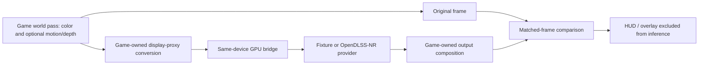
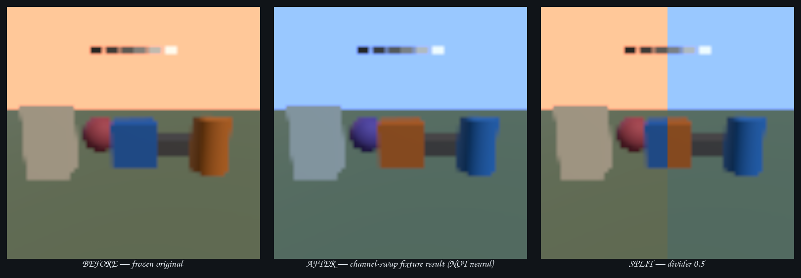

# PRD — Experimental Neural Rendering Sandbox

**Status:** PARTIAL — same-device snapshot integration, WGSL providers and diagnostic scene implemented and passing their repository gates; the real-browser WebGPU fixture scenario passes on one host. Actual model/native/multi-platform qualification remains outstanding.
**Date:** 2026-09-28.
**Owner:** ThreeNative rendering / sandbox maintainers.
**Scope:** One opt-in sandbox, one provider-neutral render contract, one initial OpenDLSS-NR adapter.
**Targets:** Browser WebGPU and Linux x64 native WebGPU, qualified independently.
**Integration base inspected:** `develop` at `9ca18502207f107a83ca4acf6d44f7d30386aeee`.
**Filing:** Descriptive experimental PRD; no global numeric identifier reserved. Keep one draft PR for this PRD and its implementation.

## Outcome

A developer opens a user-like, installed ThreeNative sandbox, captures a rendered scene, and compares the original with a neural-enhanced version of **the same frame**. The sandbox makes model loading, supported controls, processing cost, memory estimates, temporal failures, and fallback visible. An explicitly selected live-preview mode is a research option, not a gameplay default.

The initial provider evaluates the independent OpenDLSS-NR browser/WGSL implementation. This is **same-resolution neural image enhancement**, not DLSS Super Resolution, frame generation, a replacement for geometry, or an FPS optimization. Do not advertise official NVIDIA integration, arbitrary model loading, GGUF support, or production readiness.

Success has two distinct levels: a working, cross-runtime integration using a redistributable deterministic compute fixture; and separately qualified neural output using authorized model data. The first never substitutes for the second. Missing weights must not prevent implementation of the integration, but must prevent any claim that real neural rendering is qualified.

## Existing systems and boundaries

The inspected sources already provide the following. Extend them only where the experiment proves a missing mechanism.

| Existing surface | Reuse and boundary |
| --- | --- |
| [`IRendererLike`][renderer] | `kind`, `raw`, `compute`, `setOutputNode`, `renderOverlay`, `createRenderChain`, GPU-frame samples, and resolution observations exist. Its interface does **not** currently expose a typed external-WGSL texture/device interop contract. |
| [`RenderChain`][chain] | Accepts game-supplied stage IDs, `before`/`after` anchors, availability reasons, velocity requirements, disposal, and measured tier selection. Reuse this; do not add a second composer or global provider registry. |
| [`velocity.ts`][velocity] | Provides MRT velocity and previous rigid, instance, and skeleton state. Reuse the actual scene pass; do not build another transform-history system. |
| [Rendering guide][rendering-guide] and [repository rules][rules] | The game owns the look in generated `src/render/`; core owns cross-runtime plumbing. A core addition needs native proof in the same implementation commit. |
| [AI view-projection draft PR #379][view-projection] | Offline image acquisition and projection onto geometry is a separate authoring workflow. No OpenRouter calls, API keys, paid generation, or hard dependency on that PR belong here. |

The current stage `build` callback constructs a graph; it is not an asynchronous per-frame inference hook. A `beforeRender` callback alone also does not prove that the current scene texture has been rendered. The implementation must prove render/compute/composite order, not infer it from callback names.

Before adding implementation files or toggling render stages, run the repository's capability-search/detail workflow and check the then-current manifest. This specification does not claim that those MCP queries or a GPU experiment have run.

## Upstream evidence and limits

Reference revision: OpenDLSS-NR `9d08f4184bbcb9d858e2fb7a7834ec0837a9d2f1`, inspected on 2026-09-28. Pin any adopted source to a reviewed revision and preserve its license and notices.

The [upstream overview][upstream] describes a fixed network and approximately 141 MiB of model weights, supplied separately. That is **not** total GPU memory: activations, retained tensors, weight repacking, history, staging, and render targets add to it. The [browser README][browser-port] reports approximately 465 ms of inference plus 15 ms of WebGL readback at 1904×929. These are the author's observations, not ThreeNative measurements, and are not a performance target or a promise for another GPU.

Source-level integration findings:

- [`Network.create`][network] accepts an existing device and model. Its `run()` submits work and awaits queue completion; do not directly await that convenience method from the normal render loop.
- In that revision, `destroy()` destroys the device when `borrowedModel` is false, even though device and model can be supplied independently. An adapter must track their ownership independently and **never destroy ThreeNative's device**.
- [`gpu.js`][gpu] requests elevated limits at device creation. Inspect the actual renderer device's limits, not just adapter maxima. The browser port documents a 32 KiB workgroup-storage requirement. An already-created device cannot be treated as though it acquired higher limits afterward.
- The upstream demo bridges WebGL and WebGPU through CPU arrays. That is a diagnostic reference, not the accepted ThreeNative steady-state transport.

Upstream parity fixtures and weights are not supplied by this PR. Upstream bit-exactness claims must not be restated as cross-vendor, cross-runtime, or ThreeNative guarantees.

## Chosen approach

Use a game-owned `NeuralRenderPass` composition and a small local `INeuralRenderProvider` contract, attached to the existing render chain. Keep neural appearance, proxy construction, conditioning, and compositing editable in the generated game's `src/render/neural/`. Start with a deterministic fixture provider and an explicitly named `opendlss-nr-webgpu` adapter.

Prefer supported Three.js node/resource APIs. Where raw WGSL interop requires backend knowledge, isolate it behind the smallest typed core renderer seam, with version guards and browser/native tests. Generated game code must not reach into private backend resource maps or create another device. Do not expose a public engine-wide provider API merely to support one experiment.

Alternatives not selected: copy the WebGL/readback demo unchanged (useful as an upstream reference, but bypasses the intended pipeline); or implement a native Vulkan/NVIDIA integration first (a different device/backend and distribution project). Official SDK integration, custom training, alternative networks, and optimization forks require separate follow-up PRDs.



### Provider and frame contract

The following are proposed responsibilities, not existing exported APIs:

| Responsibility | Required contract |
| --- | --- |
| Describe | Provider ID/revision; input/output formats and color domain; dimension/alignment rules; required features/limits; optional motion/history; supported numeric controls; model identity. Unsupported controls stay hidden or explicitly disabled. |
| Prepare | Validate model metadata and actual device limits before allocating; estimate live and peak bytes; load/compile asynchronously with progress and cancellation. |
| Encode | Borrow the renderer device and explicitly owned inputs; schedule GPU work after this frame's source pass and before consuming its result. Record source frame ID and resource-generation ID. |
| Complete | Publish only a successfully completed, valid result; report timing provenance, result age, and failure. Keep at most one inference in flight. |
| Reset / dispose | Invalidate history or stale generations; stop new submissions; retire owned allocations only when safe. Never dispose borrowed device, queue, source textures, or shared model resources. |

Inputs carry source frame ID, dimensions, valid crop/padding, texture format, color-domain/exposure metadata, and optional velocity/depth with defined units and conventions. Outputs carry matching identity and validity. Validate ownership, usage flags, format compatibility, and dimensions before encoding. No object crosses GPU devices.

Model loading is data-only. Require a versioned manifest, byte lengths and hashes for stage files, fixed graph compatibility, and bounded dimensions/counts/allocations. Reject malformed or mismatched inputs, path traversal, disallowed URL origins, partial downloads, and excess memory before execution. Do not execute URLs or shader source named by an untrusted model. The implementation supplies reviewed, pinned shaders.

### GPU integration and color correctness

Prove the full path with a deterministic compute transform before integrating model weights: current world texture -> GPU conversion -> compute output -> display. No per-frame image `readPixels`, `mapAsync`, canvas extraction, CPU tensor staging, or network request is permitted in the accepted path. One-time asset upload and bounded asynchronous diagnostic/timestamp readback are allowed and reported separately.

Preserve the existing pipeline when disabled. Do not request a second WebGPU device as a workaround. If the running device lacks required limits, report the exact mismatch and bypass; an opt-in pre-creation request may be added only through existing renderer initialization without weakening ordinary device acquisition/fallback.

The upstream network consumes a display proxy; do not feed scene-linear HDR as if it were display-referred color. The game defines the conversion, exposure, reconstruction/composition, and position relative to bloom and other effects. Apply output transfer/tone conversion exactly once. Use a gray ramp, saturated colors, and an HDR highlight fixture to detect double tonemapping, channel errors, clipping, and flipped coordinates. HUD and readable text bypass inference.

The initial network uses a fixed manifest/graph contract, not a generic GGUF file or free-text style prompt. Offer only controls that the adapter can map to the pinned provider's documented conditioning. An optional user blend is identified as compositing, not claimed to be a model parameter.

### Temporal behavior and scheduling

Photo mode is the default experimental mode: capture one coherent scene/camera state, clear history, and display original/enhanced images from that capture. Camera or scene changes invalidate the pair or leave it explicitly labeled as a frozen capture. Never compare a live original against an old result without an age/frozen indicator.

Live preview is opt-in. Use existing motion only after testing direction, scale, coordinate origin, jitter, and previous-frame semantics. Include camera movement, one rigid object, and one skinned object in the validation scene. Missing motion means temporal off, with an explanation; never silently pass zero velocity and claim temporal correctness.

Reset history on camera cut, scene restart, projection change, resize, scale change, provider/model/conditioning change, device recovery, or invalid frame identity. On a skipped source frame, either compose motion back to the actual history frame with proof, or reset history; v1 chooses reset. Reject disoccluded/out-of-bounds history and keep history/output ping-pong allocations distinct. Do not layer an unmeasured second temporal filter on top of the provider's history.

Allow one in-flight inference and coalesce pending requests to the newest source. Discard late results after generation changes. CPU-side asynchronous submission does not make shared-GPU work free: long compute still delays subsequent graphics. Cancelling a request cannot preempt already-submitted work or justify destroying the renderer device. Retire resources after completion, with device-loss recovery owned by the renderer.

## Sandbox experience and limits

Create one sandbox game outside the repository through the existing installed/tarball sandbox workflow; keep its reproducible recipe, generated render module, and portable playtest deliverables in the existing authoring/test structure. Do not add an editor, a new root CLI, or a new engine package. An in-repository fixture may support tests but is not the installed-user proof.

The small scene contains an animated humanoid when a redistributable asset is available, a moving rigid object, foliage/fine geometry, metal and matte surfaces, and an exposure test card. Use original/procedural placeholders when needed; fixture quality is not a license exception. No new large asset dependency is required.

Expose original/enhanced/split view, keyboard-accessible divider controls, one-shot capture, optional live preview, history reset, supported conditioning, and dimensions. Show provider/model revision, load progress, loading/ready/bypassed/error state, inference cadence, displayed FPS, input/output dimensions, result age, GPU/CPU timing provenance, and estimated allocations. A fixture-only result is prominently labeled **integration test, not neural enhancement**.

Separate world-render scale, neural-input scale, and presentation size. Quarter/half/full options describe scale **per axis**, validate provider-supported padded sizes, and disclose any ordinary resampling. Reduced-resolution neural enhancement plus reconstruction is an experiment, not DLSS Super Resolution. Do not run two competing automatic scale controllers.

Initial safety policy: start with a supported neural input no larger than 512×512 valid pixels, one in-flight result, and at most two history/output sets. Validate padded working-set estimates before enabling. Require an explicit configurable byte cap; a proposed sandbox default is 1 GiB of incremental estimated GPU allocations, **not an assertion of available VRAM**. If even the smallest valid graph exceeds the cap, bypass and report why. Release activation/history allocations on disable after outstanding work completes; retaining weights requires an explicit bounded cache choice.

No extra model request, inference dispatch, history allocation, or velocity activation occurs in ordinary disabled gameplay. WebGL2, unsupported limits, missing model, hash mismatch, allocation failure, shader/validation error, and device loss all have distinct visible reasons. Provider failure leaves the original rendering path available, except while renderer-level device recovery itself is in progress. Do not retry indefinitely or turn a failed observation into zero milliseconds.

## Measurement and stop conditions

Use the existing playtest/performance reporting rather than create a benchmark framework. Pin camera path, scene seed, source revision, actual adapter identity, browser/native host version, model hashes, scales, and settings. Run original and enhanced arms at the same world resolution; measure split-view overhead separately.

Report cold load/compile, warm per-stage GPU times where timestamp queries exist, CPU submission cost, end-to-end/presented frame time, completed neural frames per second, and estimated peak/live allocation bytes. Report p50/p95 plus sample count, not only minima. Without GPU timestamps, label wall-clock measurements and leave GPU time unavailable. Do not derive all-stage compute cost from render-only timestamps.

A bounded smoke run uses up to 10 warm-up completions and 30 measured completions per selected configuration, with a 60-second wall-clock ceiling per arm. Timeouts retain partial counts and failure status; sparse runs do not establish p95 quality or production performance. Limit the initial matrix to baseline, fixture, and the smallest valid real-model configuration, then optionally half/full scale if budget permits. No exhaustive engine benchmark or multi-hour optimization search belongs here.

Live preview remains a diagnostic unless measured end-to-end cadence meets its declared budget. Proposed sandbox budget: p95 <= 100 ms at the chosen configuration; stop scheduling live inference after three consecutive completed windows exceed it and return to one-shot mode. This is a research usability threshold, not a gameplay target. A production recommendation needs a separate PRD and actual full-frame evidence at the game's target rate.

Stop expanding this PRD when same-device transport cannot be demonstrated without a broad renderer rewrite, legal model access is unresolved, the smallest valid graph exceeds resource limits, or bounded measurements make interactive use unsuitable. Keep a useful snapshot experiment or record a no-go; do not quietly widen scope.

## Execution record — 2026-09-28, third pass: repository gates and a real-hardware browser run

User request: "execute PR 380 — attach screenshots to the PR once done, Before/After". Everything below was run in this checkout on one host: RTX 2080, NVIDIA driver 615.71.09, Playwright Chromium 1234, Node 22.22.0, pnpm 10.25.0. The Before/After pair the request asks for is `docs/verification/assets/prd-380-neural-rendering/before-after.png`.



Left, the frozen original this render path produces: the blue cube and the red/green/blue test card on the HDR background. Centre, the fixture's result from the same capture — every red and blue channel exchanged, which is the whole of what the integration fixture does. Right, the divider at 0.5 showing both at once. **This is an integration test, not neural enhancement**, exactly as the scene's own console marker says. The un-annotated live frame before any capture is `live-before-capture.png` in the same directory.

**Two defects in the supplied proof case had to be fixed before the scenario could pass.** Neither is a rendering defect; both are in the proof case itself, which is why "supplied runnable proof cases, not executions" was the right thing to write for the second implementation.

- The scenario waited a fixed `waitTicks: 600` for a proof that is driven by an asynchronous GPU readback. It failed at 600 on this host and passed at 900, which is a flake with a clock in it. The step now waits on the state it asserts — `waitForResource: { id: "state", path: "proofCount", equals: 2 }` with `timeoutMs: 30000`. (`kind` and `waitTicks` cannot be combined with `waitForResource`; the runner rejects the mix at validation.)
- The diagnostic scene rendered **five** distinct colours. `assertCaptureNotBlank` fails closed below `minDistinctColors: 8`, so the scenario's full-frame visual assertion could not pass however correct the render was: `TN_CAPTURE_BLANK: only 5 distinct color(s)`. Two changes, both to `NeuralSnapshotScene.ts`: it now carries the tonal fixture this PRD already asked the sandbox for — a six-step gray ramp, the three saturated primaries and HDR values above 1 — and its content is a small lit scene (ground plane, five props in `MeshStandardMaterial`, matte and metal, key/rim/ambient lights, one rotating rigid object) rather than a single unlit cube. The card is what clears the guard; the lit scene is what makes the Before/After pair read as a frame a game would produce, which is what the sandbox section of this PRD asks for.

**The real-browser WebGPU fixture scenario passes.** Installed sandbox outside the checkout: the branch's `packages/*` packed to tarballs, `create-threenative` scaffolding the `minimal` template against them, the example bundle copied in per its README, `pnpm install`, `pnpm exec vite --host 127.0.0.1 --port 5173 --strictPort`.

```sh
TN_PLAYTEST_HOST_DISPLAY=1 npx @threenative/playtest playtests/neural-rendering.playtest.json \
  --target browser --url http://127.0.0.1:5173 --browser-recipe webgpu --headed
```

Result: `pass: true`, adapter `webgpu:architecture=turing|vendor=nvidia`, `consoleErrors: 0`, `runtimeDiagnostics: 0`, and all four assertions green — `visual.0.region` (non-blank ratio 1.0), `state.proofPassed`, `state.proofCount` `0 -> 2`, `diagnostics`. Four consecutive runs passed with the same adapter. The GPU readback proof reported `{"pixels":4096,"changedPixels":4006,"hdrPixels":4033,"capture":1,"frame":43}` and `{"pixels":4096,"changedPixels":4006,"hdrPixels":4030,"capture":2,"frame":45}`.

Two environment facts the command above encodes, both worth keeping:

- `--headed` is **required** for a hardware adapter. `runner.ts` launches `headless: activeConfig.headless`, and headless Chromium on Linux serves WebGPU from SwiftShader no matter what `--enable-features=Vulkan` asks for. The headless run of this scenario reported `swiftshader / google`, produced 635 `createBuffer` pageerrors and a blank 1-colour frame; the headed run reported `turing / nvidia` and passed.
- `TN_PLAYTEST_HOST_DISPLAY=1` is required to reach that display. The runner's default on Linux is a private Xvfb, which has no GPU, so even a headed run under it comes back SwiftShader. With the opt-in, `captureDisplay` reported `{ display: ":0", strategy: "existing" }`.

**Repository gates now run.**

- `pnpm typecheck` — **exit 0, 0 errors**, root project and all 31 workspace projects. It did not pass before this pass: `packages/core/src/webgpu.ts` is the first raw-WebGPU surface in the repository and nothing here declared those globals, so the seam alone carried seven `Cannot find name 'GPUDevice'` errors and the game-owned example modules dozens more. Core now depends on `@webgpu/types` and references it from `src/webgpu.ts`, and `tsup` carries the reference into the emitted declarations (`dts.banner`) so a consumer of `@threenative/core/webgpu` resolves `GPUTextureFormat` too instead of seeing an unresolved name. That consumer path is checked, not assumed: the installed sandbox game's own `pnpm typecheck` is **exit 0** with its stock `types: ["vite/client"]` tsconfig and no declaration of its own, which only works because core's declaration carries the reference.
- Making the real WebGPU globals visible put six declarations in four **other** files in collision with them — `playtest`'s `traceRun` / `observationSampling` / `browserSession` stand-ins, `scripts/realism-effects-visual.ts` and `test-support/webgpu-provenance.ts`, each written when no `GPUDevice` global existed. All six now name the shape they actually read, with a reason on each cast. Net Biome result is unchanged from the branch baseline (38 errors, 868 warnings, none of them new): the repository's pre-existing lint debt is untouched.
- The eight new unit lanes now run under the repository's own Vitest rather than a `node:test` shim: `npx vitest run` over `neural-render-interop` (10), `neural-provider-contract` (54), `neural-render-capture` (5), `neural-render-hook` (4), `neural-render-lifecycle` (29), `neural-render-proof` (2), `neural-render-snapshot` (8), `opendlss-nr-adapter` (7) — **119 passed, 0 failed**. Three test-side defects fell out of running them for real: `assert.deepEqual(f.log, [])` narrows `log` to `never[]` through its `asserts` signature and broke every `indexOf`/`includes` after it, `world.updateBefore = originalUpdate` needed the `boolean | undefined` return the type asks for, and `StorageTexture.mipmapsAutoUpdate` exists at runtime but not in `@types/three` (core's atmosphere LUTs already narrow it the same way).
- The new public seam was **absent from the capability manifest**, so `pnpm build`/`pnpm capabilities:check` refused the branch: "public exports without `@situation` tags: `@threenative/core:createWebGPUInterop`". `createWebGPUInterop` now carries `@situation`/`@constraint`/`@example` in the repository's vocabulary, and the generated manifest and capability reference carry the entry — 359 entries, `@threenative/core/webgpu` import path included. This is the one surface the manifest exists to make discoverable, and the first pass had shipped it invisible to `engine_search_capabilities`.
- `pnpm lint` — **exit 0**. It did not pass before this pass either, and unlike the six collisions above those 38 errors were all in this PR's own new files: 21 `format`, 7 `organizeImports`, 5 `useNumberNamespace`, 2 `useTemplate`, 2 `noThenProperty`, 1 `useConst`. All cleared. The `useTemplate` pair concatenated `COMMON` onto a WGSL template; the rewritten form was checked to produce **byte-identical** shader source before it was kept. 866 warnings remain and are the repository's pre-existing measure (develop reads 847 over a smaller file set), not new ones. `pnpm quality` is exit 0 as well.
- `packages/playtest/__tests__/e2e-runner.spec.ts` and `generated-shooter-input.spec.ts` fail on this host. Verified **pre-existing**: both fail identically with every change in this pass stashed, and both are real-browser runs.

**Still not run, and still not claimed.** The Linux x64 native scenario (Phase 3, second box) — no native host or bundle was built here. Windows, macOS, Android, iOS and any non-NVIDIA adapter. Real model loading, inference and numerical parity — no weights. Performance measurement of any kind. The installed-consumer acceptance lane names `neural-render-installed.spec.ts`, which does not exist in this branch, so that box cannot pass yet.

## Integration record — 2026-09-28, second implementation

User request: "The do it? Properly integrate it". The implementation now extends beyond the initial policy scaffolding. It adds an opt-in `@threenative/core/webgpu` package subpath and game-owned capture, compute, and composition source; see the [installation and ownership recipe](../../../packages/create-threenative/agent-docs/examples/neural-rendering/README.md). This is implemented source, **not a qualified browser/native neural renderer**.

The core seam guards Three r185, borrows the initialized renderer device, resolves textures through that renderer's resource map, validates descriptors, scopes encoding errors, and separates successful completion from safe retirement. Per-job device-loss observers are removed when jobs finish. It never requests or destroys a device. `package.json` and the tsup entry list expose the new optional subpath; the normal core entry, dependencies and ordinary templates are unchanged.

The game-owned `attachNeuralCapture()` wraps the existing authored world's public `PassNode.updateBefore` hook. After the existing world draw has submitted, it records a GPU HDR capture/resample, a provider, and then lets the existing RenderChain composite the frozen matched pair. It is the first processing stage and refuses to discard an earlier stage's output. Source inspection confirmed the r185 world render ends with a direct queue submission. That establishes the intended ordering at source level; only the outstanding GPU runs can qualify actual transport/composition. Backend-resource access stays in core; no second device, composer or transform-history system was added.

The deterministic fixture executes a channel-swap WGSL kernel. The OpenDLSS-NR adapter executes GPU feature packing -> the prepared pinned network's actual `recorder.encode()` -> residual-head reconstruction into scene-linear HDR. It does not call `Network.run()`, use CPU image transport, or call the unsafe upstream `Network.destroy()`. The prepared network/model remains exclusively borrowed and application-owned. The WGSL adaptation preserves the upstream MIT notice; real numerical parity is unverified. Temporal/history inference, style presets and live preview are not exposed in this slice.

An optional `NeuralSnapshotScene.ts`, `sandbox-game.ts`, browser scenario and native scenario now supply a concrete installed-game diagnostic. The game remains outside the repository; source is copied from the existing package's opt-in `agent-docs` bundle. Pressing C requests two snapshots with deliberately different HDR backgrounds. A bounded diagnostic-only GPU readback checks current-source identity, HDR signal, exact R/B output and alpha before setting the runtime proof state. Both scenarios assert that proof state changes to two verified captures. The native scenario omits the browser-only visual assertion. Neither scenario has been executed here; supplying a proof case is not a native-conformance pass.

Verification for this second implementation:

- Test-first runs and subsequent regression tests were observed failing before their implementations/fixes. The final narrowed run passed **36 new tests, 0 failed, exit 0** with Node 22.16.0. The test registration was adapted from Vitest to `node:test`; GPU objects were mocks and minimal local Three API stand-ins were used. The stand-ins do not compile shaders, construct a real Three render graph or run inference. The earlier 83 policy tests were not rerun in this slice; do not sum them into a claimed current suite result.
- TypeScript 5.8.3 passed a strict check of the core seam and game-owned render modules, including unchecked-index and exact-optional checks. The local check used narrow substitute declarations for external GPU/Three boundaries; it does not validate the installed library typings, scene/game entry, repository TypeScript 5.9 gate, or native runtime. A real nullable-device compiler error found in that check was fixed.
- The two modified core packaging files were checked against their exact original Git blob hashes after removing only the intentional new subpath/entry. The PRD baseline was likewise reconstructed and hash-verified against `efb68d9d643a0f902b5b01ab1bfa9f1167d1425b` before editing. Source review added regression coverage for async hooks/providers/recorders, graph-detachment failure, safe resource retirement and device-loss observer retention.
- Repository Vitest and Biome commands were attempted and exited 127 (`pnpm` unavailable). Checkout/registry access failed on DNS. Local browser probes rejected both file and local-server navigation with `ERR_BLOCKED_BY_ADMINISTRATOR`; that restriction was not bypassed. No native host or real-model assets were available. Full build, installed-consumer, browser/native GPU, WGSL compilation, numerical parity and performance gates remain **not run**. No independent-review or CI-green claim is made.

Remaining implementation is explicit: bounded/cancellable/origin-controlled model loading and pre-allocation accounting, full loading/error/control UI, temporal/live-preview behavior and its budget controller, installed packaging, and actual cross-runtime/model qualification. The current adapter validates an **already prepared** network; its memory cap is not proof that network preparation itself was bounded. No weights were obtained or bundled. The original eight complete proof/acceptance gates stay open, and `prd:0%` is retained rather than claiming an arbitrary completion percentage. The progress calculator was not rerun for this second slice.

## Implementation record — 2026-09-28, first slice (historical)

The first code slice is optional editable source under `packages/create-threenative/agent-docs/examples/neural-rendering/`: `model-contract.ts`, `frame-gate.ts`, and `resource-scope.ts`, with usage and limitations in that directory's README. The existing package `files` list includes `agent-docs`; ordinary templates, their imports, core exports, dependencies, and renderer behavior are unchanged. This location avoids adding unfinished experiment code to every default scaffold. Packaging and installed-consumer proof are still pending.

Inspected the pinned capability manifest (blob `b443715af21f93af4a3a0deae59f29a4efbd7ef2`): no neural entry; existing `RenderChain` remains the composition reuse point. The engine MCP tools were not available here, so this was a direct manifest inspection, not a claimed `engine_search_capabilities` / `engine_capability_detail` execution. No new composer, public provider registry, private backend access, or transform-history system was added.

Local verification on the isolated partial source snapshot:

- Test-first runs observed 21 contract failures and 27 lifecycle failures before implementation. Final run: **83 tests passed, 0 failed, exit 0** under Node 22.16.0's real test runner. Only the `test` registration import was changed from `vitest` to `node:test` in an untracked temporary copy; production code and assertions were unchanged. This is **not a Vitest or repository-suite pass**.
- TypeScript 5.8.3 checked the three source modules with `--strict --noUncheckedIndexedAccess --exactOptionalPropertyTypes --lib ES2022`, exit 0. Tests also passed that local compiler using installed Node type definitions and a registration-only Vitest declaration. This is narrower than the repository's TypeScript 5.9 gate and proves no native-host execution.
- Direct checkout failed because `github.com` could not resolve. Registry access also failed; `pnpm`, Vitest, and Biome were unavailable. Full repository typecheck/lint/test/build, Biome formatting, publication/scaffold checks, browser/native playtests, and real-model inference were **not run**. All eight acceptance/phase boxes remain open; no GPU frame-order, neural quality, or platform-performance claim is made.

The exact repository progress calculator (`scripts/prd-progress.ts`, verified blob `7732f607c05aa74c86b952bec7784fd1467e288c`) was executed with Node type stripping against the original and updated PRD: **0/7 phase boxes, 0/1 acceptance, `prd:0%`** in both. The label remains unchanged because no complete stated proof has run.

The ownership tests exercise the new policy, not the upstream implementation. The OpenDLSS-NR `Network.destroy()` hazard remains an adapter integration requirement; never register that convenience destructor as an individually owned allocation. A fulfilled, renderer-authoritative retirement fence is required before cleanup or releasing an in-flight ticket; an inference rejection alone is insufficient.

## Implementation phases

The contract, lifecycle, interop, adapter, snapshot, hook, capture and pixel-proof tests now exist, as do the two installed-scene scenario files. Every lane named above has now been run by the repository's own Vitest; see the third-pass execution record. Installed-consumer proof remains a proposed deliverable — its named lane does not exist yet. Tests belong to the layer implemented; any admitted core seam also receives focused core tests and native conformance evidence.

### Phase 1 — Safe provider boundary

- [ ] The model/capability validator enforces the declared data, limit, and allocation contract. proof: `pnpm exec vitest run packages/create-threenative/__tests__/neural-provider-contract.spec.ts`.
  Partial: data-only manifest, digest, device-limit, padded-dimension, and byte-cap policy implemented in the optional source bundle. The named Vitest lane, bounded transport/cancellation, origin enforcement, and real-provider accounting remain unverified or unimplemented.
- [x] The same-device bridge presents the deterministic fixture's current-frame output in the correct render/compute/composite order. proof: `pnpm exec vitest run packages/core/__tests__/neural-render-interop.spec.ts` and the browser GPU scenario in Phase 3.
  Both proofs green 2026-09-28: interop lane 10 passed / 0 failed under the repository's Vitest, and the browser scenario `pass: true` on `turing / nvidia` with `consoleErrors: 0`. Run details and the two proof-case fixes: see the third-pass execution record above.
- [ ] Provider lifecycle preserves borrowed resources and rejects stale temporal/result generations. proof: `pnpm exec vitest run packages/create-threenative/__tests__/neural-render-lifecycle.spec.ts`, including supplied-device/owned-model cleanup, resize during inference, device loss, and skipped-frame history.
  Partial: generation-aware frame gate and individually owned-resource retirement implemented and exercised with deterministic deferred fences. Source integration is now implemented, but real GPU retirement has not been qualified; the named Vitest lane has not run.

### Phase 2 — Provider adapter and sandbox

- [x] The pinned OpenDLSS-NR adapter satisfies the frame contract without steady-state CPU image readback. proof: `pnpm exec vitest run packages/create-threenative/__tests__/opendlss-nr-adapter.spec.ts`; real-model numerical qualification remains the separate dependency below.
  Green 2026-09-28: 7 passed / 0 failed under the repository's Vitest. This is the mocked lane; real-model numerical qualification is still a `## Blocked on` item, not a ticked box.
- [x] The generated sandbox enforces its UI, bypass, color, scheduling, and budget behavior. proof: `pnpm exec vitest run packages/create-threenative/__tests__/neural-render-snapshot.spec.ts packages/create-threenative/__tests__/neural-render-capture.spec.ts packages/create-threenative/__tests__/neural-render-hook.spec.ts packages/create-threenative/__tests__/neural-render-proof.spec.ts` and the portable scene scenario in Phase 3.
  Green 2026-09-28: the four lanes 19 passed / 0 failed (snapshot 8, capture 5, hook 4, proof 2), and the portable scene scenario `pass: true` on hardware — including the keyboard view/divider controls (`1`/`2`/`3`, arrows), which is the UI this box covers. The complete loading/error UI the sandbox-experience section asks for is still unfinished and is tracked there, not here.

### Phase 3 — Installed cross-runtime proof

- [x] A clean installed sandbox passes its real-browser WebGPU fixture scenario. proof: from the generated game, `npx @threenative/playtest playtests/neural-rendering.playtest.json --target browser --url http://127.0.0.1:5173 --server-command "pnpm dev" --browser-recipe webgpu`.
  Green 2026-09-28 from a tarball-installed sandbox outside the checkout: `pass: true`, adapter `turing / nvidia`, 4/4 assertions, 0 console errors, 0 runtime diagnostics, four consecutive runs. The run needs `--headed` and `TN_PLAYTEST_HOST_DISPLAY=1` on this host — a headless launch and the default private Xvfb both serve SwiftShader, which fails the same scenario. Exact command, adapter identity and the two proof-case fixes: see the third-pass execution record above.
- [ ] The same fixture scenario runs through the Linux x64 native host without browser-only globals in the provider path. proof: from the generated game, `npx @threenative/playtest playtests/neural-rendering-native.playtest.json --target desktop --executable "$TN_DESKTOP_EXECUTABLE" --host-arg run --host-arg dist/game.js`, after building that exact game's native bundle; record host and adapter identity.

## Acceptance criteria

- [ ] A packaged/scaffolded consumer can opt into the complete experiment without workspace-only imports, proprietary model distribution, or changes to ordinary rendering defaults. proof: `pnpm exec vitest run packages/create-threenative/__tests__/publication.spec.ts packages/create-threenative/__tests__/scaffold.spec.ts packages/create-threenative/__tests__/neural-render-installed.spec.ts`.

## Blocked on

**Authorized model data and numerical references — owner/provider:** obtain a documented lawful source and permission for the intended local use; redistribution requires its own permission. This PR neither supplies weights/fixtures nor instructions to extract proprietary assets. A user-selected file alone is not proof of permission. Without those inputs, real-model loading/inference/parity stays unqualified while deterministic implementation can proceed.

**Real neural qualification — maintainers with those inputs:** run the pinned model on browser WebGPU and Linux x64 separately, compare against authorized reference fixtures using predeclared tolerances, and review matched-frame captures plus movement/occlusion sequences. Record the exact identities and measured result inline in this PRD/PR. Do not call fixture correctness, an upstream benchmark, or a successful shader compile a neural-quality pass.

**Other platforms — separate qualified lanes:** Windows, macOS, Android, iOS, RTX 2080 performance, and non-NVIDIA GPU behavior are not established by the required Linux/browser pair. No support or performance claim is made without running the corresponding lane.

These dependencies are not checkboxes or evidence of completion. If all doable work finishes first, use the repository's blocked-only filing rule, retaining the outstanding qualification clearly. Do not advertise completed DLSS support or merge as a production feature on the strength of the progress label alone.

## Decisions and verification at filing

2026-09-28: the user requested a PRD and draft PR following the experimental neural-rendering proposal. Scope this filing to documentation; no product code, model acquisition, paid calls, or implementation is authorized by this filing alone.

2026-09-28 follow-up: the user explicitly requested implementation ("Start working on it"). Begin with the optional safety-policy slice documented above; retain the same draft PR and all outstanding requirements.

Design decision: respect game-owned appearance, reuse RenderChain and velocity, and make GPU ownership/frame ordering an explicit first gate. Native Vulkan/NVIDIA SDK work and the separate view-projection authoring workflow are not bundled into this experiment.

Source inspection only at filing. No inference, GPU timing, model-parity, browser, or native feature test was run. Document-validation results belong in the draft PR and must distinguish structural checks from repository-wide gates.

[rules]: https://github.com/ThreeNativeHQ/threenative/blob/9ca18502207f107a83ca4acf6d44f7d30386aeee/AGENTS.md
[renderer]: https://github.com/ThreeNativeHQ/threenative/blob/9ca18502207f107a83ca4acf6d44f7d30386aeee/packages/core/src/renderer.ts
[chain]: https://github.com/ThreeNativeHQ/threenative/blob/9ca18502207f107a83ca4acf6d44f7d30386aeee/packages/core/src/render/chain.ts
[velocity]: https://github.com/ThreeNativeHQ/threenative/blob/9ca18502207f107a83ca4acf6d44f7d30386aeee/packages/core/src/render/velocity.ts
[rendering-guide]: https://github.com/ThreeNativeHQ/threenative/blob/9ca18502207f107a83ca4acf6d44f7d30386aeee/docs/guides/rendering.md
[view-projection]: https://github.com/ThreeNativeHQ/threenative/pull/379
[upstream]: https://github.com/maanHimself/OpenDLSS-NR/blob/9d08f4184bbcb9d858e2fb7a7834ec0837a9d2f1/README.md
[browser-port]: https://github.com/maanHimself/OpenDLSS-NR/blob/9d08f4184bbcb9d858e2fb7a7834ec0837a9d2f1/ports/browser-webgpu/README.md
[network]: https://github.com/maanHimself/OpenDLSS-NR/blob/9d08f4184bbcb9d858e2fb7a7834ec0837a9d2f1/ports/browser-webgpu/src/network.js
[gpu]: https://github.com/maanHimself/OpenDLSS-NR/blob/9d08f4184bbcb9d858e2fb7a7834ec0837a9d2f1/ports/browser-webgpu/src/gpu.js
