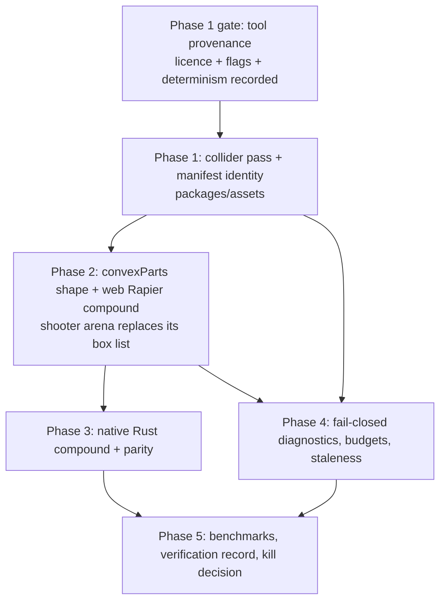
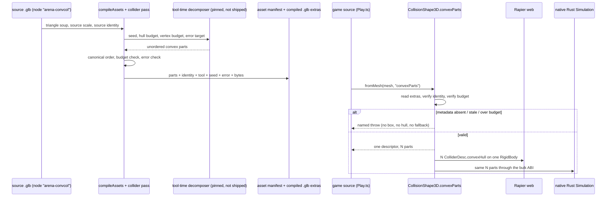

# PRD-252 — Imported meshes cook portable compound colliders

**Status:** PROPOSED
**Complexity:** 8 → HIGH mode (10+ files `+3`, new pipeline pass `+2`, multi-package `+2`, external tool
acquisition `+1`)
**Selected from:** the collision-aware decomposition portion of the broad engine-stack survey
(source candidate `SarahWeiii/CoACD`, SIGGRAPH 2022)
**Supersedes triage:** the earlier "needs a dynamic concave mesh first" rejection. That triage answered a
question no caller asked. The measured friction is *static level collision on an imported mesh*, and the
callers for that already exist and already hand-write their own collider lists.

## Decision

ThreeNative will add **one** backend-neutral collision shape — a bounded, ordered set of convex parts with
per-part local transforms — and **one** offline compile pass that produces it from a triangle mesh already
travelling through the existing asset pipeline. A game loads the imported asset and gets one logical rigid
body whose collision follows the model's concavity.

Three things this explicitly is not:

- Not a new package. The pass lives in `packages/assets`, the shape lives in `packages/physics`.
- Not a runtime dependency. The decomposer is a **tool-time** binary, acquired or built when the asset is
  compiled, never linked into the game bundle, the web runtime, or the native host.
- Not new gameplay vocabulary. `CoACD` names an implementation the tool provenance record pins. It does not
  appear in a public type, an export, a config key, a template, or `capabilities.json`. The game says
  `convexParts`; Godot says `-convcol`; Rapier says compound.

The visual mesh, its material, and every appearance decision remain untouched and entirely game-owned. This
change writes collision data beside a model and reads it back. It never touches geometry the renderer draws.

## Product context

An agent building an FPS or a platformer imports a level or a prop, attaches it to the scene, and needs the
player to collide with it. Today the honest options are:

| Option | What actually happens |
|---|---|
| `CollisionShape3D.fromMesh(mesh)` | falls through to `box` for any geometry whose `geometry.type` does not contain "sphere" or "capsule" (`CollisionShape3D.ts:170-222`). An archway becomes a solid brick. |
| `CollisionShape3D.fromMesh(mesh, "convexHull")` | one hull. Every doorway, bay, arch, stair-well and interior is filled in. |
| `CollisionShape3D.fromMesh(mesh, "trimesh")` | correct static collision, no interior. Character controllers tunnel and rest badly on it, and it is the slowest query subject in the set. |
| hand-feed boxes | correct, fast, and the thing the measured caller actually did. |

`docs/verification/sweep-fps-2026-08-17.md` records the fourth row from a real cold-agent FPS build, in the
agent's own words:

> "There is no 'add this mesh as static collision' helper and no compound/heightfield path for a level, so a
> 34 m yard's collision is hand-fed box by box from my own AABB list. […] Kept a parallel
> `colliders: BoxCollider[]` array in `src/render/range.ts` and built one fixed body per entry."
> — `src/render/range.ts:47-68`; `src/scenes/Play.ts:86-116`

The shipped shooter template does the same thing in-repo, at
`templates/shooter/src/scenes/Play.ts:112-113`: one hand-written `CollisionShape3D.box(22, 0.4, 20)` for the
floor, then a loop calling `CollisionShape3D.fromMesh(wall)` per wall — which reaches the AABB fallback path
above. That loop is this PRD's incumbent and its deletion target.

The framework's own rule settles ownership: could the game write this portably itself? A game **cannot**
run a decomposer at runtime without shipping one, and it cannot get identical collision on the browser and
the native Rapier build without a backend-neutral descriptor it does not own. Does it decide how anything
looks? No — no geometry, material, colour, texture, curve or timing crosses this seam. Rule (a) admits it;
rule (b) does not veto it.

## Executive summary

1. `packages/assets` gains a **collider pass** beside the existing model and texture passes. It runs only
   when the source opts in by Godot's import-suffix convention, calls an external decomposer discovered at
   tool time, and writes a cooked convex-part set plus its provenance into the existing asset manifest.
2. `packages/physics` gains **one** shape kind, `convexParts`, and one factory,
   `CollisionShape3D.convexParts(parts)`. `fromMesh(mesh, "convexParts")` reads the cooked set the loader
   attached to the mesh and **throws by name** when it is absent, stale, or over budget. It never
   silently degrades to a hull or a box.
3. The web Rapier adapter and the native Rust `Simulation` both expand one `convexParts` descriptor into N
   convex colliders on a single rigid body — Rapier's compound semantics. One body, one id, one contact
   set, one query subject on both platforms.
4. `pnpm assets health` and `npx create-threenative inspect` report source scale, hull count, total hull
   vertices, cooked bytes, decomposition error and the source identity that produced them, and say
   `STALE` when the source no longer hashes to that identity.
5. The shooter template's hand-authored arena collider list is **deleted** and replaced by one cooked body
   on an imported concave arena asset, proved by input-driven headed WebGPU and native desktop runs that
   walk through, around, and on the concavity.

## Context

Files inspected (this session):

- `packages/physics/src/CollisionShape3D.ts` — the whole shape surface, lines 88-223
- `packages/physics/src/simulation.ts` — `PhysicsShapeKind` (`:37-45`), `IPhysicsShapeDescriptor` (`:46`),
  `createShape` seam (`:319`), `QUERY_SHAPE_KINDS` (`:435-441`), the Rapier `ColliderDesc` switch
  (`:570-584`)
- `packages/physics/AGENTS.md` — the backend seam, the construction-time throw rule, the parity contract
- `packages/assets/src/` — `compile.ts` (`IAssetManifestEntry:110`, `IAssetManifest:127`, the stale-manifest
  fallback at `:676`), `health.ts`, `report.ts`, `watch.ts`, `passes/model.ts`, `passes/texture.ts`,
  `index.ts:13-37`
- `packages/create-threenative/src/index.ts:596-601` and `src/inspect.ts` — the `inspect` command
- `packages/create-threenative/templates/shooter/src/scenes/Play.ts:101-113` and
  `src/render/shapes.ts:93-125` — the incumbent hand-authored arena collider list
- `docs/verification/sweep-fps-2026-08-17.md` — the FPS friction ledger, static-world row
- `packages/runtime-native/native/physics/src/lib.rs` — the single-file native `Simulation`
- `docs/PRDs/done/PRD-043-terrain-and-open-world.md`, `PRD-094…099`, `PRD-143`, `PRD-144` (filed, adjacent)

Current behaviour:

- `PhysicsShapeKind` is a closed union of `box | sphere | capsule | trimesh | convexHull | heightfield`
  (`simulation.ts:37-45`). There is no multi-part kind and no per-part local transform anywhere in the
  descriptor.
- `IPhysicsShapeDescriptor` is flat: one `kind`, one `x/y/z`, optional `vertices`/`indices`/heightfield
  fields. A hull set has no home in it.
- `createRapierShape` (`simulation.ts:570-584`) builds exactly one `ColliderDesc`. Compound has no branch.
- `CollisionShape3D.fromMesh` infers from `geometry.type` string matching and otherwise returns
  `CollisionShape3D.box(...)` from the bounding box (`:205-222`). Nothing warns.
- `geometryVertices` (`:16-27`) bakes `mesh.scale` into the vertex array; `geometryIndices` (`:29-37`)
  fails closed on a non-triangle position count. Both are correct and both are reused unchanged.
- `packages/assets` already owns glTF compile, a content-addressed manifest, health reporting, model and
  texture passes, and a watch mode. PRDs 094–099 established that ownership. There is no second pipeline to
  build and none will be built.
- The asset manifest already carries per-entry identity and already has a documented stale-manifest
  fallback (`compile.ts:676`). Cooked collider identity rides that mechanism rather than inventing another.
- The native physics backend is one Rust file, `native/physics/src/lib.rs`, reached through the bulk ABI.
  Per `packages/physics/AGENTS.md`, a shape the ABI cannot honour must throw during construction.

## Upstream provenance — UNVERIFIED in this session

The task brief states that the candidate decomposer supports Linux/Windows/macOS C++, deterministic seed
control, non-manifold preprocessing, hull-count and per-hull vertex limits, and real-metric thresholds, under
MIT. **This session could not verify any of that**: `WebFetch` and `WebSearch` were both denied by the
permission layer (non-interactive session), so no upstream README, licence file, flag list or release
artifact was read.

Every upstream claim below is therefore written as a **requirement on Phase 1's provenance gate**, not as a
fact. Phase 1 does not proceed past its first step until the acquired source's own `LICENSE` and `--help`
output are pasted into `docs/verification/collider-cook.md`. If the real flag names differ from the ones this
PRD guesses, the PRD's flag names are wrong and the recorded ones win — the *contract* this PRD fixes is the
capability set, not the spelling:

| Required capability | Why this PRD needs it | If absent |
|---|---|---|
| Permissive licence compatible with MIT distribution of ThreeNative | the repo is MIT; a tool-time binary still needs its licence recorded | kill the vendored path; keep the shape and require a user-supplied cooker |
| Deterministic output under a fixed seed | cooked artefacts must be reproducible or the manifest identity is a lie | kill the feature (see Rollback) |
| Hard cap on hull count **and** per-hull vertex count | budgets must be enforceable at cook time, not discovered at runtime | enforce post-hoc in the pass and fail closed |
| Tolerates non-manifold / unwelded input | real downloaded game assets are routinely non-manifold | pre-clean in the pass or refuse the asset by name |
| Runs on Linux/macOS/Windows as a tool | the pipeline runs on contributor and CI machines | mark unavailable platforms `UNVERIFIED` and skip, never silently fall back |

**No runtime source is copied into this repository without owner review.** Phase 1 acquires a released
binary or builds from a pinned upstream tag in a tool-time step; it does not vendor `.cpp`/`.h` into
`packages/`. If the owner later chooses to vendor, that is a separate PRD with its own licence review.

## Charter fit

- **Admitted owner:** an offline compile step plus a backend-neutral physics descriptor. A game cannot write
  either portably — the first needs a native tool it must not ship, the second needs a shape contract two
  different Rapier builds honour identically.
- **Never owns the look:** no geometry, material, colour, texture, curve or timing crosses this seam. The
  game can replace the visual mesh entirely without editing package code; the collider is a sibling artefact
  keyed by source identity, not a fork of the render mesh.
- **Vocabulary borrowed, never invented:** Godot supplies the import-suffix convention and the shape's role;
  Rapier supplies compound semantics; glTF supplies the metadata channel. The word `CoACD` is not in the
  public surface.
- **No new package:** `@threenative/assets` and `@threenative/physics` already exist and already carry the
  right dependencies. Nothing here justifies a third.
- **Kill switch:** the shape's whole job is to delete collider lists. `scripts/count-loc.ts` scores it
  against the incumbent hand-authored arena list and against plain Three.js + Rapier written by hand. If the
  package code exceeds what it removes across the counted call sites, it is deleted.
- **A feature that works on web only is unfinished:** native desktop actuation ships in the same phase set,
  and no result claims a platform it did not execute.

## Scope

In scope:

1. One new `PhysicsShapeKind`, `convexParts`, with per-part vertices and a per-part local transform.
2. `CollisionShape3D.convexParts(parts)` and an explicit `fromMesh(mesh, "convexParts")` read path.
3. Rapier web expansion to N colliders on one body; native Rust expansion to the same.
4. Spatial-query support for the new kind (the `QUERY_SHAPE_KINDS` set at `simulation.ts:435-441`).
5. A collider pass in `packages/assets` gated by the Godot-style import suffix, with manifest identity,
   budgets, and named failures.
6. Health and `inspect` reporting of scale, hull count, hull vertices, bytes, error, and staleness.
7. Deletion of the shooter template's hand-authored arena collider list in favour of one cooked body.
8. Cook-time and runtime benchmarks against AABB, single hull, trimesh, and hand-authored boxes.

Explicit non-goals and fail-closed exclusions:

- **No dynamic concave bodies.** Cooked parts attach to `fixed` and `kinematic` bodies in this PRD. A
  dynamic `convexParts` body requires mass-property and stability evidence nobody has produced; constructing
  one throws `TN_PHYSICS_CONVEX_PARTS_DYNAMIC_UNSUPPORTED` until a later PRD measures it.
- **No automatic cooking.** A mesh is never decomposed because it looked concave. The source must carry the
  suffix, and the game must ask for `"convexParts"` by name. `fromMesh(mesh)` with no kind keeps its exact
  current behaviour, including the box fallback, so no existing game changes shape.
- **No runtime decomposition.** No WASM decomposer, no worker, no lazy cook-on-load, on any platform.
- **No second asset pipeline, no second physics API.** Everything extends `packages/assets` and
  `CollisionShape3D`. A new `Collider` node, a `LevelCollision` helper, or a `TN.physics.cook()` entry point
  is out of scope and rejected.
- **No Jolt, no PhysX, no backend abstraction layer.** Rapier on both platforms, as today.
- **No silent fallback, anywhere.** Missing metadata, stale identity, budget overrun, unsupported native
  path, or a hull set that collapsed to one AABB-shaped part are each a named throw. There is no code path
  in which a game asks for cooked collision and receives a box.
- **No convex-hull *decomposition quality* claim.** The pass reports the decomposer's own error metric and
  the measured contact behaviour. It does not assert the decomposition is optimal or watertight.
- **Android and iOS remain `UNVERIFIED`** until each exact target executes the proof. Desktop native
  evidence never closes a mobile row.

## Dependencies and sequencing



Hard ordering constraints:

- Phase 2 cannot start before Phase 1 produces a real cooked artefact for the real asset. A shape with no
  producer is an orphan module by construction.
- Phase 4 sets **no numeric budget** until Phase 1–3 have measured samples. Any threshold written before
  measurement is invented and is rejected at checkpoint.
- Phase 3 is not optional and does not defer. A cooked set that only works on web is unfinished under the
  charter.

Pre-existing dependencies, all already shipped: the asset compile/manifest/health surface (PRD-094…099), the
spatial-query surface (PRD-088), physics parity and native actuation (`packages/physics/__tests__/parity.spec.ts`
and `native/physics` — see `packages/physics/AGENTS.md`), the heightfield path (PRD-043), joints (PRD-143) and
ragdoll (PRD-144), none of which this PRD modifies.

## Borrow map

| Concept here | Borrowed from | Exact borrowed term | What this PRD refuses to invent |
|---|---|---|---|
| Opt-in on the imported node | Godot glTF import | `-convcol` name suffix on the source node | a ThreeNative-only config key, a JSON side-file schema of our own design |
| The shape's role and name | Godot | convex collision shape attached under one body | `LevelCollider`, `CookedShape`, `MeshCollider` |
| One body, many colliders | Rapier | compound / multiple colliders per rigid body | a ThreeNative "compound node" |
| Per-part placement | Three.js | `position` / `quaternion` on each part, metres and radians | a bespoke transform encoding |
| Where cooked data rides | glTF | `extras` on the node, mirrored into the existing asset manifest entry | a parallel `.collider` manifest |
| Reported identity | existing `packages/assets` manifest | the content identity already used for stale detection (`compile.ts:676`) | a second hashing scheme |
| The decomposer | upstream tool, tool-time only | recorded by name and pinned version in `docs/verification/collider-cook.md` only | `CoACD` as a public type, export, flag, or capability entry |

## Evidence map

| Claim in this PRD | Evidence | Status |
|---|---|---|
| `fromMesh` defaults arbitrary meshes to a box | `packages/physics/src/CollisionShape3D.ts:170-222` | verified, read |
| No compound or hull-set kind exists | `packages/physics/src/simulation.ts:37-45`, `:570-584` | verified, read |
| Query kinds are a closed set without compound | `packages/physics/src/simulation.ts:435-441` | verified, read |
| The shooter hand-feeds its arena collision | `templates/shooter/src/scenes/Play.ts:112-113`, `src/render/shapes.ts:93-125` | verified, read |
| A real cold-agent FPS kept a parallel box list | `docs/verification/sweep-fps-2026-08-17.md`, static-world row (`range.ts:47-68`) | verified, read |
| The asset pipeline already owns compile + manifest + health | `packages/assets/src/index.ts:13-37`, `compile.ts:110-127`, `health.ts` | verified, read |
| `inspect` already reports glTF facts | `packages/create-threenative/src/index.ts:596-601`, `src/inspect.ts` | verified, read |
| Native physics is one Rust `Simulation` | `packages/runtime-native/native/physics/src/lib.rs` | verified, listed |
| Upstream licence, flags, determinism, platforms | none — `WebFetch`/`WebSearch` denied this session | **UNVERIFIED**, gated in Phase 1 |
| Cook time, output size, runtime cost | none yet | **UNMEASURED**, produced in Phase 5 |

## Solution

**Cook time.** `compileAssets` gains a collider pass. For each source node whose name ends in the Godot
suffix, the pass extracts the triangle soup in source space, runs the discovered decomposer with a pinned
seed and the declared budgets, validates the result, and writes an ordered part list into the compiled
asset's node `extras` and into the manifest entry, alongside the source identity, the tool identity, the
seed, the budgets used, and the reported error. Ordering is canonicalised by the pass (sorted by a
deterministic key, not by the tool's emission order) so that the same source and seed produce byte-identical
output on any machine that ran the provenance gate.

**Load time.** The game loads the model with whatever loader it already uses. The compiled asset carries the
part list in `extras`; the physics package reads it from `mesh.userData` where the glTF loader deposits
`extras`. Nothing new loads it, nothing new caches it, and the render mesh is untouched.

**Runtime.** `CollisionShape3D.convexParts(parts)` produces one descriptor with `kind: "convexParts"` and an
ordered `parts` array, each part carrying a `Float32Array` of vertices and a local position/quaternion. Both
backends expand it into N convex colliders on one rigid body. The body has one id, one contact stream, and
one query identity on both platforms.



**Data changes.** One new manifest field group per cooked entry and one new `extras` key per cooked node.
Both are additive; the existing stale-manifest fallback at `compile.ts:676` continues to govern a manifest
that no longer matches its inputs.

**Key decisions.**

- Cooked parts are **source-space**, with the source scale recorded. `geometryVertices`
  (`CollisionShape3D.ts:16-27`) already bakes `mesh.scale`; the read path applies the same scale to each
  part so a scaled instance behaves like every other shape here.
- Part order is canonicalised by the pass, not by the tool, so determinism does not depend on the tool's
  internal iteration order.
- Budgets are **declared in the source's compile options and stored in the manifest**, so a runtime budget
  check compares against what the asset was cooked for, not against a global constant that can drift.
- `convexParts` joins `QUERY_SHAPE_KINDS`. A shape a body can have but a query cannot address is a
  half-shipped kind.

## Reachability

**How will this feature be reached?**

- Entry point (cook): the existing `compileAssets` CLI/build step run by a project's asset build.
- Entry point (runtime): the shooter template's `Play.enter()` frame-zero scene construction.
- Pre-existing files edited to call it: `packages/assets/src/compile.ts`,
  `packages/physics/src/simulation.ts`, `packages/create-threenative/templates/shooter/src/scenes/Play.ts`.
- Registration: the pass is added to the compile pass list beside `modelPass`/`texturePass`; the shape kind
  is added to the descriptor union, the Rapier switch, and the native ABI switch.

**Is this user-facing?** No UI. It is a build step plus a physics shape. The user-visible outcome is that the
player walks through an archway that previously blocked them.

**Full flow:**

1. The project runs its asset build.
2. `compileAssets` reaches the collider pass for a suffixed node.
3. The pass cooks, canonicalises, budget-checks and writes parts + identity into the compiled asset.
4. The shooter scene loads the asset and calls `CollisionShape3D.fromMesh(mesh, "convexParts")`.
5. Result observable in: the player passing under the arch and being stopped by its pillars, in a headed
   WebGPU run and a native desktop run, and in `assets health` / `inspect` output.

**What does this replace?** `templates/shooter/src/scenes/Play.ts:112-113` — the hand-written floor box and
the per-wall `fromMesh` loop — deleted in Phase 2.

## Integration Ledger

| # | New thing | Live caller (`file:line`, non-test) | Replaces | Old path removed? | Negative control |
|---|---|---|---|---|---|
| 1 | `colliderPass` in `packages/assets/src/passes/collider.ts` | `packages/assets/src/compile.ts` pass list | nothing — no cook step exists | n/a, new capability | remove the pass from the list; the shooter asset build emits no cooked parts and Phase 2's scene throws `TN_PHYSICS_CONVEX_PARTS_MISSING` |
| 2 | Cooked identity + budgets in the manifest entry | `packages/assets/src/compile.ts:110-127` entry writer | ad-hoc "recook everything" | n/a | edit one source byte without recompiling; health reports `STALE` and the runtime read path throws `TN_PHYSICS_CONVEX_PARTS_STALE` |
| 3 | `PhysicsShapeKind` `"convexParts"` + `CollisionShape3D.convexParts()` | `packages/create-threenative/templates/shooter/src/scenes/Play.ts:112` | `CollisionShape3D.box(22, 0.4, 20)` + `for (const wall of arena.walls) arenaBody(wall, CollisionShape3D.fromMesh(wall))` at `:112-113` | **deleted** in Phase 2 | restore the box list; the arch-traversal playtest passes for the wrong reason and the pillar-block assertion goes red |
| 4 | Rapier web compound expansion | `packages/physics/src/simulation.ts:570-584` switch | single-`ColliderDesc` construction | extended, not duplicated | expand only the first part; the "player is stopped by the second pillar" assertion goes red |
| 5 | Native Rust compound expansion | `packages/runtime-native/native/physics/src/lib.rs` shape switch | native throw on unknown kind | n/a | remove the native branch; construction throws `TN_PHYSICS_CONVEX_PARTS_NATIVE_UNSUPPORTED` at body creation, not at first contact |
| 6 | `convexParts` in `QUERY_SHAPE_KINDS` | `packages/physics/src/simulation.ts:435-441` | queries silently refusing the kind | n/a | drop the entry; the hitscan-through-the-arch assertion goes red with the named query-kind refusal |
| 7 | Cooked-collider rows in health + `inspect` | `packages/assets/src/health.ts` `runHealthReport`, `packages/create-threenative/src/inspect.ts:288` `inspectScene` | nothing reports collision cost of an asset | n/a | delete the cooked block from the compiled asset; both reports must say so by name rather than omitting the row |

Every caller above is a real non-test file that exists today; the anchors are pre-edit line numbers. Each
row's exact post-edit `file:line` is recorded at the end of its phase, and a row still carrying a pre-edit
anchor at delivery means the phase is incomplete.

## Execution Phases

### Proof subject declaration

**Proof subject:** a real imported concave arena asset for the shooter template — a walled arena with a
through-arch and an interior bay, acquired through the shipped asset-MCP loop with its licence recorded in
the template's `CREDITS.md`.
**Real target:** exactly that. This is the production subject, not a stand-in.
**Additional negative control only:** a synthetic U-shape fixture in `packages/physics/__tests__/fixtures/`.
It exists to make the "single hull fills the interior" failure legible in a unit test. It is never the sole
caller and never satisfies an acceptance criterion.
**Requirements the synthetic control does NOT exercise:** non-manifold input, real source scale, real
material/mesh separation, real hull counts, real cook time, real bytes, real query cost, native ABI
crossing.

**Owner decision required before Phase 2 (manual checkpoint):** adding a binary `.glb` to the shooter
template increases every scaffolded project's size. The recommended path is the template, because it is the
in-repo caller whose hand-authored list this PRD deletes. The alternative — proving on a `pnpm sandbox` FPS
game outside the repo — keeps the template lean but leaves no in-repo live caller, which makes ledger row 3
unfillable. If the owner picks the alternative, the shooter's box list must still be deleted in favour of a
cooked body built from a procedurally-generated-then-cooked arena, or this PRD does not close.

---

### Phase 1: A real imported arena asset compiles into a bounded, reproducible convex-part set

**User-visible outcome:** running the shooter's asset build on the arena `.glb` prints a cooked-collider row
naming hull count, hull vertices, bytes, error and source identity — and running it twice produces identical
bytes.

`compile.ts`, `health.ts` and `index.ts` already exist; the pass and its spec are new.

**Files (5):**

- `packages/assets/src/passes/collider.ts` — NEW: tool discovery, extraction, invocation, canonical
  ordering, budget and error validation, named failures.
- `packages/assets/src/compile.ts` — EDIT: register the pass in the pass list; extend `IAssetManifestEntry`
  (`:110`) with the cooked block; write it beside the existing entry fields.
- `packages/assets/src/health.ts` — EDIT: `runHealthReport` reports the cooked block and its staleness;
  `formatHealthReport` prints the row.
- `packages/assets/src/index.ts` — EDIT: export `colliderPass` and its option/row types beside
  `modelPass`/`texturePass` (`:19-21`).
- `packages/assets/__tests__/collider-pass.spec.ts` — NEW: reproducibility, budget, ordering, failure names.

**Implementation:**

- [ ] **Provenance gate first.** Acquire the decomposer (released binary, or a build from a pinned upstream
      tag) in a tool-time step. Paste its `LICENSE` and its real `--help` output into
      `docs/verification/collider-cook.md`, with the exact version/commit. **No pass code lands before this
      record exists.** Map each PRD-required capability in the Upstream Provenance table to a real recorded
      flag, or record its absence and take the stated consequence.
- [ ] Discover the tool by an explicit, documented resolution order; when the source opts in and no tool is
      found, fail with `TN_ASSET_COLLIDER_COOKER_MISSING` naming the resolution order tried. Never skip
      quietly, never cook a box instead.
- [ ] Gate on the Godot import suffix. A source node without it is untouched, and the pass costs nothing.
- [ ] Extract triangles in source space; carry the source scale into the manifest rather than baking it.
- [ ] Invoke with a pinned seed and the declared hull-count / per-hull-vertex budgets. Canonicalise part
      order by a deterministic key computed by the pass.
- [ ] Validate before writing: over-budget hull count, over-budget hull vertices, zero parts, a part with
      degenerate volume, or a single part whose bounds match the source AABB within tolerance each fail with
      their own named error.
- [ ] Write parts to the compiled asset's node `extras` and the identity/tool/seed/budget/error/bytes block
      to the manifest entry.
- [ ] Record cook wall-time and output bytes as **measurements**. Set no threshold in this phase.

**Wiring:**

- [ ] Caller edited: `packages/assets/src/compile.ts` pass list invokes `colliderPass`.
- [ ] Registration: `index.ts` exports it; the manifest entry writer persists the cooked block.
- [ ] Old path: none — but the pass must be reached by the ordinary `compileAssets` entry point, not by a
      script the tests call directly.
- [ ] Ledger rows filled: 1, 2, and the health half of 7.

**Tests required:**

| Test file | Test name | Assertion | Negative control (must be observed red) |
|---|---|---|---|
| `packages/assets/__tests__/collider-pass.spec.ts` | `should produce byte-identical parts when cooking the same source twice with the same seed` | two runs over the real arena source yield identical ordered part bytes | remove the canonical-ordering step; the second run differs and the test names the first divergent part index |
| `packages/assets/__tests__/collider-pass.spec.ts` | `should fail by name when the cooked result exceeds its declared hull budget` | budget 4 against a source needing more throws `TN_ASSET_COLLIDER_HULL_BUDGET` with actual and allowed counts | remove the check; the pass writes an over-budget set and the test goes green for the wrong reason — assert the count, not just the throw |
| `packages/assets/__tests__/collider-pass.spec.ts` | `should fail by name when the decomposer is unavailable and the source opted in` | `TN_ASSET_COLLIDER_COOKER_MISSING` naming the resolution order | make the pass skip silently; the compiled asset has no cooked block and the test goes red |
| `packages/assets/__tests__/collider-pass.spec.ts` | `should report the cooked block as stale when the source no longer matches its recorded identity` | health output contains `STALE` and the recorded vs actual identity | reuse the manifest without identity comparison; the stale source reports healthy |

**Revert check:** remove `colliderPass` from `compile.ts`'s pass list. The pre-existing
`packages/assets` compile test that now asserts the shooter arena entry carries a cooked block must fail.

**Verification plan:**

```sh
pnpm --filter @threenative/assets build
pnpm --filter @threenative/assets test
pnpm typecheck && pnpm lint && pnpm test
# reproducibility, by hand, pasted into docs/verification/collider-cook.md:
#   cook twice into two output dirs, diff the compiled asset bytes and the manifest cooked blocks
```

**User verification:** run the shooter asset build; expected — one cooked row naming hull count, hull
vertices, bytes, error, source identity, seed and tool version; running it again changes nothing.

---

### Phase 2: The shooter's arena collision is one cooked body, and the hand-authored box list is deleted

**User-visible outcome:** the player walks *through* the arch and is *stopped* by its pillars, in a headed
WebGPU run — behaviour no box or single hull produces.

Four already exist; only the playtest scenario is new.

**Files (5):**

- `packages/physics/src/simulation.ts` — EDIT: add `"convexParts"` to `PhysicsShapeKind` (`:37-45`), the
  part array to `IPhysicsShapeDescriptor` (`:46`), the compound branch to `createRapierShape` (`:570-584`),
  and the kind to `QUERY_SHAPE_KINDS` (`:435-441`).
- `packages/physics/src/CollisionShape3D.ts` — EDIT: `convexParts(parts)` factory and the
  `fromMesh(mesh, "convexParts")` read/verify path, reusing `geometryVertices` scaling semantics.
- `packages/create-threenative/templates/shooter/src/scenes/Play.ts` — EDIT: **delete** `:112-113`; build one
  fixed body from the imported arena's cooked parts.
- `packages/create-threenative/templates/shooter/src/render/shapes.ts` — EDIT: `createArena` returns the
  imported arena object; the hand-built floor/wall boxes it currently returns (`:93-125`) go.
- `packages/create-threenative/templates/shooter/playtests/arena-concavity.playtest.json` — NEW: input-driven
  traversal, blocking, and query scenario.

**Implementation:**

- [ ] Add the kind, the descriptor shape and one Rapier branch that attaches N `ColliderDesc.convexHull`
      colliders — with per-part translation and rotation — to the **same** rigid body. One body id.
- [ ] `fromMesh(mesh, "convexParts")` reads the cooked block from `mesh.userData`, verifies the recorded
      source identity and budget, applies `mesh.scale` exactly as `geometryVertices` does, and throws
      `TN_PHYSICS_CONVEX_PARTS_MISSING` / `_STALE` / `_BUDGET` rather than returning any other shape.
- [ ] `fromMesh(mesh)` with no kind is byte-for-byte unchanged. Assert that explicitly.
- [ ] Throw `TN_PHYSICS_CONVEX_PARTS_DYNAMIC_UNSUPPORTED` when a `dynamic` body requests the kind.
- [ ] Replace the shooter arena. Delete the floor box and the per-wall loop; keep collision layers and masks
      identical so no other shooter assertion changes meaning.
- [ ] The visual mesh and its material come from the imported asset and the template's own `src/render/`
      code. No package code chooses anything about how it looks.
- [ ] Write the scenario: drive real input through the arch, into a pillar, and onto the arena floor; assert
      a traversal that a box collider makes impossible and a block that an empty collider makes impossible.
      Add a query assertion (hitscan through the opening, blocked by a pillar).

**Wiring:**

- [ ] Caller edited: `Play.ts:112` now constructs the cooked body; nothing else builds arena collision.
- [ ] Registration: the kind is in the descriptor union, the Rapier switch and the query set.
- [ ] Old path: `CollisionShape3D.box(22, 0.4, 20)` and the `for (const wall of arena.walls)` loop are
      **deleted**, not left beside the new one.
- [ ] Ledger rows filled: 3, 4, 6.

**Tests required:**

| Test file | Test name | Assertion | Negative control (must be observed red) |
|---|---|---|---|
| `packages/physics/__tests__/collision.spec.ts` (EDIT) | `should attach every cooked part to a single rigid body` | N parts, one body id, N colliders; part count equals the manifest's | expand only the first part; count assertion goes red |
| `packages/physics/__tests__/collision.spec.ts` (EDIT) | `should keep fromMesh unchanged when no kind is requested` | the existing box-fallback result is identical to the pre-change baseline | change the default inference; this pre-existing behaviour test goes red |
| `packages/physics/__tests__/collision.spec.ts` (EDIT) | `should pass a point through a U-shape interior that a single hull fills` | synthetic control: a point inside the U is free under `convexParts`, contained under `convexHull` | make both sides use `convexHull`; the test becomes a self-comparison and must be caught by asserting the two shape kinds differ |
| `packages/physics/__tests__/spatial-query.spec.ts` (EDIT) | `should address a convexParts body from a spatial query` | ray through the opening misses; ray at a pillar hits, returning the one body id | drop the kind from `QUERY_SHAPE_KINDS`; the query refuses by name and the test goes red |
| `templates/shooter/playtests/arena-concavity.playtest.json` | `should let the player traverse the arch and be blocked by its pillar` | traversal distance past the arch plane exceeds a measured margin; pillar contact stops forward progress | restore the old box list; the traversal assertion goes red because the arch is solid |

**Revert check:** restore `Play.ts:112-113`. `arena-concavity.playtest.json` — a scenario that exists in the
shooter template's own test script — must fail on the traversal assertion.

**Verification plan:**

```sh
pnpm --filter @threenative/physics test
pnpm typecheck && pnpm lint && pnpm test
pnpm --filter @threenative/playtest build
node packages/playtest/dist/runner/cli.js \
  <scaffolded-shooter>/playtests/arena-concavity.playtest.json \
  --url http://127.0.0.1:5173 --server-command "<shooter dev command>" \
  --browser-recipe webgpu --headed
pnpm test:templates
```

Record `adapter.info` from the run. A run that cannot name a hardware adapter is `UNVERIFIED`, not green.

**User verification (manual checkpoint required — visual + input):** open the run's captured frames and the
recorded video; expected — the player visibly passes under the arch, collides with the pillars, and stands on
the floor, with the arena's appearance identical to the imported asset. Blank or software-adapter capture is
a failed run.

---

### Phase 3: The same cooked set runs on native desktop, and an unsupported ABI path throws at construction

**User-visible outcome:** the native desktop build of the same shooter walks the same arch, with equivalent
collision and query results.

Four already exist; `docs/verification/collider-cook.md` is created by Phase 1.

**Files (5):**

- `packages/runtime-native/native/physics/src/lib.rs` — EDIT: accept the `convexParts` kind through the bulk
  ABI and build N Rapier colliders on one body.
- `packages/physics/src/simulation.ts` — EDIT: encode the part array across the existing bulk ABI without
  adding a per-object per-frame call; throw at construction when the linked native ABI does not declare
  support.
- `packages/physics/__tests__/native-contract.spec.ts` — EDIT: the TypeScript-side ABI guard for the new kind
  and its named unsupported error.
- `packages/runtime-native/conformance/registry.json` — EDIT: register a conformance case that drives the
  arch on both runtimes.
- `docs/verification/collider-cook.md` — EDIT: record the native run, engine, OS, artefact identity, and any
  target not executed.

**Implementation:**

- [ ] Cross the seam in bulk. Parts are encoded once at body creation; nothing per-part crosses per frame.
- [ ] The native side builds N convex colliders on one body and preserves the body id the web side reports.
- [ ] When the linked native ABI does not declare the kind, construction throws
      `TN_PHYSICS_CONVEX_PARTS_NATIVE_UNSUPPORTED` — at construction, per the package's standing rule, never
      at first contact and never as a silent single hull.
- [ ] Run the equivalence comparison against the shipping Rust `Simulation`, not against a
      simulation-delegating fake. A fake is a self-comparison and is forbidden here exactly as it is in
      `parity.spec.ts`.
- [ ] Compare: contact set membership, resting position after a fixed tick count, the traversal outcome, and
      the query hit body/normal — under the tolerances the existing parity contract already uses.

**Wiring:**

- [ ] Caller edited: `lib.rs` shape construction path; `simulation.ts` native encode path.
- [ ] Registration: the conformance registry runs the case on both targets.
- [ ] Old path: n/a — but the native unknown-kind branch must throw the named error, not fall through.
- [ ] Ledger row filled: 5.

**Tests required:**

| Test file | Test name | Assertion | Negative control (must be observed red) |
|---|---|---|---|
| `packages/physics/__tests__/native-contract.spec.ts` (EDIT) | `should throw at construction when the native ABI cannot honour convexParts` | named error at body creation; no body is registered | make the guard warn instead; the pre-existing construction-throw contract test goes red |
| `packages/runtime-native/conformance` case | `should reach the same arch traversal and query result on web and native` | both runtimes agree on traversal, resting height, contact body id and query normal within the parity tolerance | expand a different part count on one side; the case reports the first diverging quantity |

**Revert check:** remove the native `convexParts` branch. The conformance case and
`pnpm native:verify:desktop` for the shooter must fail before the native frame budget is reported.

**Verification plan:**

```sh
pnpm native:build
pnpm native:verify:desktop
pnpm parity
node packages/playtest/dist/runner/cli.js <scenario>.playtest.json --target desktop
```

Android and iOS rows stay `UNVERIFIED` in the record unless that exact device executed.

**User verification (manual checkpoint required):** watch the native desktop run traverse the arch; expected
— the same traversal and the same blocking as the browser run, with the frame meters recorded, not
interpreted.

---

### Phase 4: Every wrong input fails loudly, and budgets come from measurement

**User-visible outcome:** an agent who breaks the cooked asset gets a named error saying exactly what broke,
instead of a game that silently collides like a brick.

All five already exist; `capabilities.json` is regenerated rather than hand-edited.

**Files (5):**

- `packages/physics/src/CollisionShape3D.ts` — EDIT: complete the named-failure set and its messages.
- `packages/assets/src/health.ts` — EDIT: staleness, budget and degeneracy rows with actual-vs-allowed
  numbers.
- `packages/create-threenative/src/inspect.ts` — EDIT: `inspectScene` (`:288`) reports source scale, hull
  count, hull vertices, cooked bytes, error and source identity, in text and `--json`.
- `packages/physics/__tests__/collision.spec.ts` — EDIT: the negative-control matrix below.
- `packages/create-threenative/capabilities.json` — EDIT: regenerated by `pnpm build`; the capability is
  findable by plain-words situation ("collide with an imported level that has a doorway"), and names no
  upstream tool.

**Implementation:**

- [ ] Implement the full named-failure set: `_MISSING`, `_STALE`, `_BUDGET`, `_DEGENERATE`,
      `_COLLAPSED_TO_BOUNDS`, `_DYNAMIC_UNSUPPORTED`, `_NATIVE_UNSUPPORTED`. Each message names the asset,
      the recorded identity, and the actual value.
- [ ] `_COLLAPSED_TO_BOUNDS` catches the specific silent failure this PRD exists to prevent: a cooked set
      that is one part whose bounds match the source AABB. That is an AABB wearing a compound's name.
- [ ] Set the shipped default hull-count and per-hull-vertex budgets **from Phase 1–3 measurements only**,
      and write the measured basis beside each number in `docs/verification/collider-cook.md`. A number
      without a measured basis is rejected at checkpoint.
- [ ] Report, never guess: health and `inspect` print what was observed and say what they could not observe.
- [ ] Add the capability entry with situation phrasing; keep the upstream tool name out of it.

**Wiring:**

- [ ] Caller edited: `inspect.ts:288` and `health.ts` both read the cooked block from the manifest/asset.
- [ ] Registration: capability manifest regenerated; template `AGENTS.md` documents the convention — a
      convention missing from the templates' `AGENTS.md` does not exist.
- [ ] Ledger row filled: 7 completed, all rows' `TBD` cells closed.

**Tests required:** the negative-control matrix in the next section, each with its observed red.

**Revert check:** replace any one named throw with a fallback to `convexHull`. The corresponding
negative-control case must go from red to green — and that transition is itself the proof the control works.

**Verification plan:** `pnpm --filter @threenative/physics test`, `pnpm --filter @threenative/assets test`,
`pnpm --filter create-threenative test`, `pnpm build`, `pnpm typecheck && pnpm lint && pnpm test`,
`pnpm budgets`, `pnpm quality`.

**User verification:** delete the cooked block from a compiled asset and run the shooter; expected — a named
error naming the asset and the missing block, not a game that plays with box collision.

---

### Phase 5: Measured cost, honest record, and the kill decision

**User-visible outcome:** a table saying what cooking costs and what the cooked body costs at runtime,
against the four alternatives an agent would otherwise pick.

**Files (5) — three already exist:**

- `docs/verification/collider-cook.md` — EDIT: the complete record.
- `packages/physics/__tests__/fixtures/` — EDIT/NEW: the benchmark subjects.
- `scripts/count-loc.ts` — no edit; run it and record the score (kill-switch evidence).
- `packages/create-threenative/templates/shooter/AGENTS.md` — EDIT: the convention, its override, and its
  failure names, for the user's agent.
- `docs/PRDs/feature-mining/README.md` — EDIT: status row for this PRD.

**Implementation:**

- [ ] Benchmark cook time and output bytes for the real arena asset across at least three hull budgets.
- [ ] Benchmark runtime cost on the real subject against **AABB box**, **single convex hull**, **static
      trimesh**, and the **hand-authored box list this PRD deleted**: contact resolution cost, spatial-query
      cost, and frame cost, on browser and native desktop.
- [ ] Report desktop frame numbers as `render.p50`, never as FPS — the desktop Xvfb present throttle makes an
      FPS verdict from that lane meaningless.
- [ ] Score the kill switch: package LOC added versus collider-list LOC removed across the counted call
      sites. If the framework code exceeds what it deletes, delete the feature and record why.
- [ ] Write the record: tool version, licence, seed, flags, hull counts, bytes, error, every executed target,
      and every target that did not execute.

**Wiring:**

- [ ] Caller edited: the template `AGENTS.md` teaches the convention; the feature-mining README records status.
- [ ] Ledger: final audit — every row has a real non-test `file:line`.

**Tests required:** none new. This phase records and decides.

**Revert check:** n/a — this phase's artefact is the record. A missing measurement makes the corresponding
acceptance row `UNVERIFIED`.

**Verification plan:** `pnpm tsx scripts/count-loc.ts`, the benchmark commands, `pnpm census` if any
runtime-native file changed, then the full local chain before any push.

---

## Consumer scenarios

| # | Consumer | What the agent does | What must happen |
|---|---|---|---|
| 1 | shooter template (in-repo, primary) | imports the arena `.glb`, calls `fromMesh(mesh, "convexParts")` | player traverses the arch, is blocked by pillars, stands on the floor; one body id; identical on web and native desktop |
| 2 | cold-agent FPS (the `sweep-fps` caller's situation) | replaces a parallel `BoxCollider[]` list with one cooked body | the hand-maintained list disappears; navigation blocking and hitscan still resolve against the same body |
| 3 | agent who forgets to cook | calls `fromMesh(mesh, "convexParts")` on an uncooked asset | `TN_PHYSICS_CONVEX_PARTS_MISSING` naming the asset and the suffix convention — never a box |
| 4 | agent who edits the source model | recompiles the visual, not the collider | health and the runtime both say `STALE` with recorded vs actual identity |
| 5 | agent who wants the old behaviour | calls `fromMesh(mesh)` or `fromMesh(mesh, "trimesh")` | unchanged, exactly as today; static trimesh and primitives stay first-class |

## Negative Controls

Each row must be observed red before its gate is recorded as passing.

| Gate | Control | Expected red | Exact command/result |
|---|---|---|---|
| NC-1 | Delete cooked metadata or alter the source identity without recooking. | Construction throws `TN_PHYSICS_CONVEX_PARTS_MISSING` or `_STALE`; health names the asset and the recorded versus actual identity. | command: pnpm --filter @threenative/assets test |
| NC-2 | Collapse output to an AABB, drop a hull, shuffle same-seed output, or exceed a hull/vertex budget. | The cooker reports the named collapse, reproducibility, hull-budget, or vertex-budget failure; it never writes degraded collision. | command: pnpm --filter @threenative/assets test |
| NC-3 | Remove the web query kind or native compound branch, or request the kind on a dynamic body. | Physics fails at construction/query with the named unsupported error; the failure is not delayed until contact. | command: pnpm --filter @threenative/physics test |
| NC-4 | Restore the deleted box list or disable one cooked part. | The input-driven arch traversal or pillar-block assertion fails, proving the scenario distinguishes the incumbent and incomplete decomposition. | command: node packages/playtest/dist/runner/cli.js arena-concavity.playtest.json --browser-recipe webgpu --headed |
| NC-5 | Make the cooker unavailable and insert a deliberate failing assertion in each new spec. | Opted-in compilation fails with `TN_ASSET_COLLIDER_COOKER_MISSING`, and the aggregate runner reports every seeded failure. | command: pnpm test |

## Acceptance Criteria

Consumer-scoped. None of these is satisfiable by a build a player could not tell apart from the previous one.

- [ ] In the shipped shooter, the player **walks through the arch** and is **stopped by its pillars**, driven
      by real input, in a headed WebGPU browser run naming a hardware adapter — behaviour the deleted box
      list made impossible.
- [ ] The same shooter, built native desktop, produces the same traversal, the same resting height, the same
      contact body id and the same query normal within the existing parity tolerance.
- [ ] The arena's appearance is decided entirely by the imported asset and the template's own `src/render/`
      code. No package code selects geometry, material, colour, texture, curve or timing. Replacing the
      visual mesh requires no package edit.
- [ ] `templates/shooter/src/scenes/Play.ts:112-113`'s hand-authored floor box and per-wall loop are
      **deleted**, and no second implementation of arena collision remains live.
- [ ] Cooking the same source twice with the same seed yields byte-identical parts in the same order.
- [ ] `pnpm assets health` and `npx create-threenative inspect` each report source scale, hull count, total
      hull vertices, cooked bytes, decomposition error and source identity, and report `STALE` when the
      source no longer matches.
- [ ] Every failure mode in the negative-control matrix produces its named error. **No path exists in which
      a game asks for cooked collision and silently receives an AABB, a single hull, or nothing.**
- [ ] `fromMesh(mesh)` with no kind, `"trimesh"`, `"convexHull"`, and every primitive factory behave exactly
      as they did before this PRD, proved by the pre-existing tests still passing unmodified.
- [ ] No decomposer code or binary is linked into the web bundle or the native host; a grep of the shipped
      artefacts finds no cooker.
- [ ] The upstream tool's licence, version and real flag list are recorded in
      `docs/verification/collider-cook.md`, read off the acquired artefact, not off this PRD.
- [ ] Cook time, output bytes and runtime cost are measured against AABB, single hull, trimesh and the
      deleted hand-authored list, and every shipped budget number cites its measured basis.
- [ ] `scripts/count-loc.ts` shows the feature removes more caller code than it adds in package code, or the
      feature is deleted.
- [ ] Integration Ledger has zero `TBD` cells; every live caller is a real non-test `file:line`.
- [ ] Every gate has an observed red recorded before its green.
- [ ] Android and iOS are explicitly `UNVERIFIED` unless that exact device executed the proof.

## Risks and rollback

| Risk | Likelihood | Mitigation | Kill condition |
|---|---|---|---|
| Upstream capability differs from this PRD's assumptions (unverified this session) | **high** | Phase 1 provenance gate blocks all code until the real licence and flags are recorded | if determinism or budget control is absent, kill — a non-reproducible cooked artefact cannot carry an identity |
| Cooked collision is slower than the hand-authored box list it replaces | medium | Phase 5 measures it against exactly that baseline | if it is slower at equal correctness on the real subject, keep the shape and stop recommending it in `AGENTS.md`; if it is slower *and* costs more code, delete the feature |
| Tool acquisition fails on a contributor or CI platform | medium | fail closed by name, never silently skip; the asset build without the tool is an error the operator can read | if no supported platform can acquire it, kill the pass and keep only a hand-authored `convexParts` factory |
| The template gains a binary asset and every scaffold grows | medium | manual owner checkpoint before Phase 2; the alternative sandbox path is written above | owner's call, recorded before Phase 2 starts |
| Native ABI cannot carry the part array in bulk | low | encode once at construction; nothing per-part crosses per frame | if it needs per-object per-frame calls, kill the native path and refuse the kind natively by name rather than shipping a web-only shape |
| Licence turns out incompatible | low | recorded before any code lands | kill the acquisition path; keep the shape, require a user-supplied cooker |

**Rollback:** revert in reverse phase order. The shape is additive to a closed union and the pass is one
entry in a pass list; reverting Phase 2's template edit restores the box list exactly. There is **no runtime
feature flag** — a flag would be a second live implementation of arena collision, which is the failure this
PRD is built to avoid.

**Scope-creep refusals, stated in advance:** do not rescue a failing phase by adding dynamic concave bodies,
a runtime decomposer, a second physics backend, a level-editor format, an IR, or a `LevelCollision` node.
File a new measured PRD instead.

## Integration ledger audit (run at every checkpoint)

```sh
# 1. Caller census — every new exported symbol has a non-test consumer
grep -rn "convexParts\|colliderPass" --include=*.ts --include=*.rs --include=*.json \
  packages examples | grep -v "__tests__" | grep -v "\.spec\." | grep -v "/tests/"
# Expected: hits in Play.ts, compile.ts, simulation.ts, lib.rs, inspect.ts, health.ts

# 2. Incumbent check — the replaced arena list is gone, not beside the new one
grep -n "CollisionShape3D.box(22\|for (const wall of arena.walls)" \
  packages/create-threenative/templates/shooter/src/scenes/Play.ts
# Expected: no hits after Phase 2

# 3. Shipped-artefact check — no cooker in the runtime
grep -rni "coacd\|decompos" packages/*/dist packages/runtime-native/build 2>/dev/null
# Expected: no hits

# 4. Public-vocabulary check — the upstream name is not in the product surface
grep -rni "coacd" packages/create-threenative/capabilities.json packages/*/src \
  packages/create-threenative/templates
# Expected: no hits
```

## Checkpoint Protocol

After every phase, record:

1. commit identity, OS, browser adapter (`adapter.info`) and/or native engine, and the cooked artefact's
   recorded identity;
2. the four audit commands above, pasted, not summarised;
3. one observed red per gate touched in that phase, followed by its green rerun;
4. the raw measurement — cook time, bytes, hull count, error, contact/query/frame samples — with no
   interpretation attached;
5. a target-by-target `PASS` / `FAIL` / `UNVERIFIED` matrix.

Manual checkpoints (in addition to automated) are required before Phase 2 (owner decides template vs
sandbox; visual inspection of the captured frames) and at Phase 3 (visual inspection of the native run).
Automated checkpoints use `prd-work-reviewer` with the integration audit prompt.

A green-only run, a source-only grep, a software-adapter capture, a missing raw log, or a platform inferred
from another platform is `UNVERIFIED` and blocks phase completion.

## Contract validation notes

- `prd_contract: v1` declared in frontmatter.
- Every path in this document was read or listed in this session except those marked `TBD` (filled during
  implementation) and `docs/verification/collider-cook.md` (created by Phase 1).
- Every upstream claim about the decomposer is marked `UNVERIFIED` and gated, because `WebFetch` and
  `WebSearch` were denied in this non-interactive session. **No upstream fact in this PRD may be cited as
  evidence.** Re-run the provenance step in an interactive session, or from the acquired artefact itself.
- No number in this document is a threshold. Budgets, tolerances and frame targets are all deferred to
  measurement in Phases 1–5, by explicit instruction.
- No gate is claimed green. This is a planning artefact.
- Linchpin contract validation: **not executed** — the validator was not invoked in this session. Run
  `sh ${LINCHPIN_PLUGIN_ROOT}/scripts/linchpin.sh contract docs/PRDs/feature-mining/PRD-252-imported-meshes-cook-portable-compound-colliders.md`
  and record the result before implementation begins.

