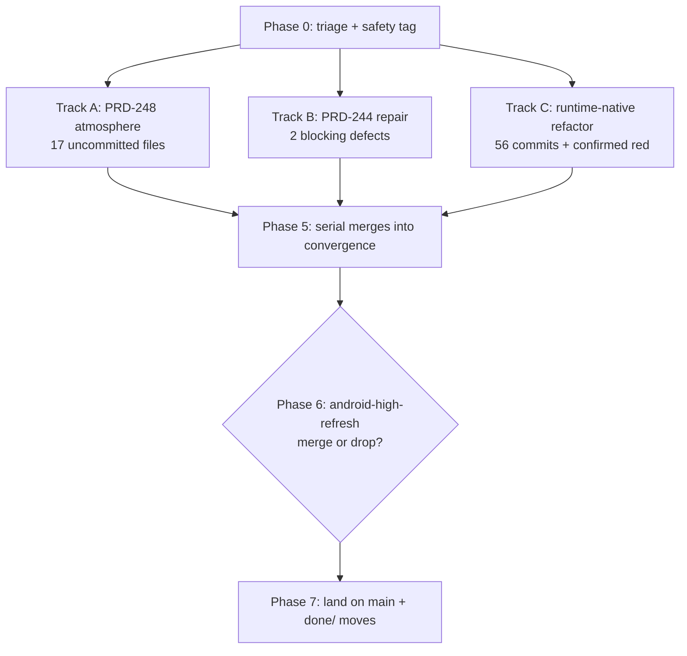

# PRD-254 — Land every stopped lane

**Status:** PARTIAL — landed on `main` 2026-08-29 at `65d30337`; see the gaps named below
**Filed:** 2026-08-28 (state captured ~22:00 local)
**Owner:** next session
**Scope:** every lane with work that stopped and never landed — the nine crashed feature-mining
sessions, the runtime-native refactor, and the stale worktrees left from 2026-08-22..27. No new
engine behaviour. Closing this PRD leaves `main` carrying all surviving work and the worktree list
short enough to read.

**Complexity: 3 (10+ files) + 2 (multi-package) + 2 (concurrency/state) = 7 → HIGH mode**
Mandatory checkpoint after every phase.


> **Outcome, 2026-08-29.** All six lanes landed on `main` (125 commits, fast-forward from
> `a4f2954d`). `pnpm typecheck`, `pnpm lint` and `pnpm budgets` are green on the landed tip;
> `pnpm test` has one failure, the generated-shooter capture, which three probes attribute to
> the pre-existing PRD-239/247 camera work rather than to any lane here. Worktrees went 39 -> 8.
> Full record: `docs/verification/prd-254-landing-2026-08-28.md`.
>
> **This PRD stays PARTIAL, and its boxes stay unticked on purpose.** Three of its own
> instructions were not carried out, each for a stated reason:
> 1. The nine `git mv ... docs/PRDs/done/` moves in Phase 5 were **not** made. Every
>    feature-mining PRD still carries unchecked boxes, and `docs/PRDs/AGENTS.md` forbids
>    archiving those. The lanes shipped code; nobody audited the boxes.
> 2. Seven of the eight Phase 6B lanes were **filed, not landed**, under
>    `docs/PRDs/BLOCKED/requires-physical-device/`. `adb devices -l` was run first: adb
>    executes and reports no device attached.
> 3. §6A's "0 commits ahead of `main` ⇒ dead" test is **wrong** and should not be reused. It
>    reads commits only. `agent-a90408deb31ba938a` passed it while holding 38 changed files and
>    +1236 lines absent from `main`, preserved as `a39beb03`.
>
> A second session landed work on this branch concurrently throughout; two of this session's
> commits were dropped in its history rewrite and re-applied. The verification record says which.

---

## 1. Context

**Problem:** A VSCode crash killed nine live agent sessions mid-flight, and the tree already
carried a backlog of worktrees from earlier in the week. 39 worktrees exist; `main` is 30 commits
behind the integration branch; nothing is landed and nothing is lost — yet.

**The pending work is three buckets, not one:**

| Bucket | What | Where |
|---|---|---|
| A · feature-mining | nine lanes crashed mid-flight today | Phases 1, 2, 5 |
| B · refactoring | `refactor-runtime-native-20260828`, 56 commits + a confirmed red | Phase 3 |
| C · stale worktrees | 20 worktrees from 2026-08-22..27; most dead, six still carry unlanded work | Phase 6 |

**PRD-228 — no action needed.** It reads `Status: DONE — every phase closed with device evidence,
2026-08-28`, it is in `docs/PRDs/done/` on `main`, its evidence file
`docs/verification/prd-228-fixed-frame-cost-2026-08-28.md` is committed, and it has zero unchecked
boxes. The device validation that was missing got closed today. Verified, not assumed.

**Files analyzed:** `git worktree list` (39 worktrees), all `feature-mining-*` branches,
`docs/PRDs/AGENTS.md`, `/AGENTS.md`, `~/.claude/projects/**` and `~/.codex/sessions/**` transcripts
for the nine dead sessions.

**Current behavior:**
- Primary checkout sits at **detached HEAD `f4ea591f`** — the shared tip of
  `feature-mining-convergence-20260828` and `feature-mining-244-repair-20260828`.
- `f4ea591f` is **30 ahead / 0 behind `main`** (`main` = `29b80090`), 106 files, +7830/−169. It has
  already absorbed lanes 237, 239 (×3), 242 (×2), 244-bvh, 247 (×2).
- **Not** in convergence: 238-culling, 241-ctx-surface (which contains 241-ease), 250-workers,
  refactor-runtime-native, android-high-refresh (×2).
- PRD-248's entire implementation is **uncommitted** in its worktree.
- A read-only review returned **REQUEST_CHANGES** on PRD-244 and nobody acted on it.

**On the branch question:** `feature-mining-convergence-20260828` is a disposable intermediary
integration branch. Do not rename it — it dies in Phase 6 when `main` fast-forwards onto it. The
confusion is the detached HEAD, not the name. Fix that in Phase 0.

---

## 2. Solution

**Approach:**
- Finish the three unfinished lanes **in parallel**, in the worktrees they already occupy — the
  isolation is free and already set up.
- Close the PRD-244 review's two blocking defects red-green before anything merges.
- Merge clean lanes into convergence one at a time, gate after each, so a red is attributable to one
  lane instead of a pile.
- Squash-and-land onto `main` only when the whole tree is green.
- `git mv` each finished PRD to `docs/PRDs/done/` **in the commit that finishes it**, per
  `docs/PRDs/AGENTS.md`.



**Key decisions:**
- Merge order inside Phase 5 is fixed: 241-ctx → 238 → 250 → 248 → runtime-native. Ascending blast
  radius; runtime-native last because it is 56 commits and touches the census.
- 241-ease is **not** merged separately: `241-ctx-surface` already contains `4bdbdcd5`, `10ae4aeb`,
  `affb48e8`. Merging it would be a no-op.
- Track C's last 8 commits are **reverts** of an adb-consolidation attempt the lane rejected. Read
  the log before assuming all 56 commits are wanted.

**Data changes:** None.

---

## 3. Integration Ledger

The risk this PRD exists to kill is a lane that merges green and ships nothing. One row per lane.
`Live caller` is `TBD` at plan time and must hold a real **non-test** `file:line` before the lane
merges.

| # | Lane / new thing | Live caller (`file:line`, non-test) | Replaces | Old path removed? | Negative control |
|---|---|---|---|---|---|
| 1 | PRD-248 `Atmosphere`, `AtmosphereLuts`, `resolveAtmosphereParameters` (`packages/core/src/atmosphere/`) | TBD — expect `templates/minimal/src/render/sky.ts` + `scenes/Play.ts` (both already modified in the worktree) | hand-rolled sky in `render/sky.ts` | TBD | zero the sun transmittance → the PRD-248 web capture must change |
| 2 | PRD-244 `GPUSceneBVH` + `bvhIntersectFirstHit` | TBD — must be the GPU traversal, **not** `tracePacked` | CPU `ScenePicker.raycast` for GPU consumers | n/a (both stay) | corrupt one `bvh.nodes` entry → the sampled comparison must go red |
| 3 | PRD-238 camera-culled projection batches | TBD | uncull'd projection path | TBD | point the camera away → culled batch count must drop |
| 4 | PRD-241 `ITweenOptions` / game-owned easing (`ScheduleHandle`) | TBD | built-in-only easing | TBD | pass a custom easing → tween samples must differ from the default curve |
| 5 | PRD-250 off-thread native Worker | TBD in `packages/runtime-native/` | in-isolate fake worker | TBD | assert worker id + isolate differ from main thread |
| 6 | runtime-native `scripts/check-build-matrix.ts` gate | TBD — must be wired into `pnpm budgets` or CI, not just its own test | n/a | n/a | delete `build-matrix.json` → the gate must fail loudly, not pass on a stale copy |

**Rule:** a test is not a caller. A row still reading `TBD` at phase end means the phase is incomplete.

---

## 4. Execution phases

### Phase 0 — Triage and safety net (serial, ~10 min)

**Files:** none edited; this phase protects the ones that follow.

- [ ] `git status` on the primary checkout, confirm clean, then
      `git checkout feature-mining-convergence-20260828` (leaves detached HEAD).
- [ ] Tag the pre-landing state so every later step is reversible:
      `git tag wrapup-2026-08-28-baseline f4ea591f`
- [ ] Confirm the uncommitted work in all three live worktrees is **still present** before running
      anything that could clean it:
```sh
for w in feature-mining-248-atmosphere-20260828 feature-mining-244-repair-20260828 refactor-runtime-native-20260828; do
  echo "== $w"; git -C .worktrees/$w status --porcelain; done
```
      Expect 17, 1 and 7 entries respectively. **If the atmosphere worktree is clean, STOP** — that
      is the only copy of PRD-248 and it is untracked.
- [ ] `pnpm gate:status` — a stale or blocked long-gate record from the crash must be cleared before
      new gates run (`pnpm gate:doctor` if stale).

**Checkpoint:** paste the three `status --porcelain` outputs and the tag hash.

---

### Phase 1 — Track A: PRD-248 atmosphere (parallel; the highest-risk lane)

**Worktree:** `.worktrees/feature-mining-248-atmosphere-20260828` (branch tip `b37bf30f`, already in
`main`; **all the work is uncommitted**).
**Session context, if you want it:** `codex resume 01a04b77-bf54-7e72-9e2d-d0d5b2614724` — it died at
"step 5 of 5, typecheck green, running the final build and browser playtest".

**Files (untracked — a careless `git clean` destroys these):**
- `packages/core/src/atmosphere/` — NEW: `Atmosphere` (a `Group` implementing `IComputeDriven`),
  `AtmosphereLuts`, `ATMOSPHERE_LUT_RESOLUTIONS`, `resolveAtmosphereParameters`, `solarPosition`,
  `directionalTransmittance`, `zenithTransmittance`, `directionFromSolarPosition`
- `packages/core/__tests__/atmosphere.spec.ts` — NEW
- `templates/minimal/playtests/atmosphere.playtest.json` — NEW
- `docs/verification/PRD-248.md`, `docs/verification/PRD-248-web.png` — NEW evidence

**Modified (the wiring — this is what makes it not-dead):** `packages/core/src/index.ts`,
`packages/core/src/game.ts`, `packages/core/__tests__/game.spec.ts`, both `capabilities.json`,
`agent-docs/references/capability-reference.md`, and the minimal template's
`render/{sky,lighting,camera,postprocessing}.ts`, `scenes/Play.ts`, `state.ts`.

**Implementation:**
- [ ] `pnpm typecheck && pnpm lint && pnpm test` from that worktree.
- [ ] Finish the browser playtest the session never completed:
```sh
pnpm --filter @threenative/playtest build
node packages/playtest/dist/runner/cli.js \
  packages/create-threenative/templates/minimal/playtests/atmosphere.playtest.json \
  --url http://127.0.0.1:5173 --server-command "<minimal template dev command>" --browser-recipe webgpu
```
- [ ] Check `adapter.info` names a real adapter — a WebGPU run that does not is SwiftShader.
- [ ] Regenerate `capabilities.json` via `pnpm build`; do not hand-edit it.

**Wiring:**
- [ ] Caller census: `grep -rn "Atmosphere" packages/create-threenative/templates --include=*.ts | grep -v spec`
      must hit `render/sky.ts` or `scenes/Play.ts`. Fill ledger row 1.
- [ ] Old path: state whether the template's previous hand-rolled sky is deleted or now delegates.
- [ ] `AGENTS.md` rule: a convention missing from the templates' `AGENTS.md` does not exist — check
      whether the atmosphere needs a line there.

**Tests required:**
| Test file | Test name | Assertion | Negative control (observe red) |
|---|---|---|---|
| `packages/core/__tests__/atmosphere.spec.ts` | existing suite | LUT resolution + transmittance values | zero the sun transmittance → capture changes |
| `templates/minimal/playtests/atmosphere.playtest.json` | scenario | sky renders, non-blank frame | disable the `Atmosphere` node → playtest goes red |

**Revert check:** rename `Atmosphere` → the template must fail to build.
**Commit:** one commit, everything above, plus `git mv docs/PRDs/feature-mining/PRD-248-*.md docs/PRDs/done/`.

---

### Phase 2 — Track B: PRD-244 blocking defects (parallel)

**Worktree:** `.worktrees/feature-mining-244-repair-20260828`, dirty:
`packages/core/__tests__/gpu-scene-bvh.spec.ts` (a half-written material-range regression over 12
separated triangles).
**Session:** worker `codex resume 01a04bda-29bf-7b93-90b5-cadd238f6c28`; reviewer
`codex resume 01a04bd6-fa78-7673-9aa5-6668d73f12e2`.

**The review verdict — REQUEST_CHANGES — verbatim:**

1. **DEFECT** — `packages/core/__tests__/gpu-scene-bvh.spec.ts:146` calls the hand-written CPU
   `tracePacked`, not `bvhIntersectFirstHit`. It never reads `bvh.nodes`, so invalid BVH nodes or a
   broken TSL traversal pass all 64 samples. `docs/verification/PRD-244.md:23` therefore overstates
   the result — no sampled GPU result was compared with `ScenePicker.raycast`. **Acceptance
   criterion 1 is not satisfied.**
2. **DEFECT** — `packages/core/src/gpu-scene-bvh.ts:271` builds the BVH in direct mode, which can
   reorder `geometry.index`, while `:283` exposes material ranges computed *before* that reorder. The
   packed geometry gets no groups constraining the sort, so `materialGroups` can map a hit to the
   wrong material. The split-material example never checks this.
3. **EVIDENCE-GAP** — `gpu-scene-bvh.spec.ts:220` mocks `dispose()` across three registry clears.
   Proves the calls happen; proves nothing about a real `goto` transition or flat memory.

**Implementation:**
- [ ] (1) Point the sampled comparison at `bvhIntersectFirstHit` and compare against
      `ScenePicker.raycast`. Red first: corrupt a `bvh.nodes` entry, watch the 64 samples fail, paste it.
- [ ] (2) Either compute material ranges **after** the reorder, or constrain the sort with geometry
      groups. Red first: the 12-separated-triangle regression the session was writing must fail on
      the current code.
- [ ] (3) Either build the real `goto`-transition memory check, or **explicitly downgrade the claim**
      in `docs/verification/PRD-244.md` and open a follow-up. Do not leave the current wording standing.
- [ ] Correct the overstated line at `docs/verification/PRD-244.md:23`.

**Revert check:** revert the traversal fix → the sampled comparison must go red.
**Commit:** test + fix in one commit (red-green, bugfixes included), plus the `done/` move if this
closes PRD-244.

---

### Phase 3 — Track C: runtime-native refactor (parallel)

**Worktree:** `.worktrees/refactor-runtime-native-20260828`, branch tip `5d18385b`, **56 commits**
ahead of convergence, 7 dirty files.
**Session:** `claude --resume 74efbfaa-1d05-4953-9e92-637418d834b4` — died right after confirming
the red and starting the fix.

**Confirmed red (already observed, not hypothetical):**
```
Failed to resolve import "../../../scripts/check-build-matrix.js"
```
The import is `.js` pointing at a `.ts` source — that is the repo's ESM convention, so look at the
build/emit path, not the extension.

**Dirty:** `scripts/check-build-matrix.ts` (untracked), `packages/runtime-native/build-matrix.json`,
`packages/runtime-native/tests/build-matrix.test.mjs`, `tests/webgpu_bindings_reentrancy_test.cpp`,
`scripts/check-budgets.ts`.
**Do not commit:** `build/`, `packages/runtime-native/default.profraw`.

**Implementation:**
- [ ] `git log --oneline -12` first: the last 8 commits are reverts ending in
      `5d18385b docs(runtime-native): record adb consolidation rejection`. Confirm the surviving 48
      commits are all wanted before merging any of them.
- [ ] Fix the import resolution; land the red-then-green in one commit.
- [ ] Wire `check-build-matrix` into a gate that actually runs (`pnpm budgets` or CI) — ledger row 6.
      A gate only its own test calls is dead.
- [ ] `pnpm census` **in the same commit** — mandatory for any runtime-native change.
- [ ] `pnpm budgets` (hard invariants fail; LOC only reports).

**Negative control:** delete `packages/runtime-native/build-matrix.json` and re-run — the gate must
fail loudly, never pass on the stale copy.

---

### Phase 4 — Parallelization plan (how Phases 1–3 actually run)

They are already isolated by worktree, so run all three at once.

| Track | Worktree | Touches | Safe to run concurrently? |
|---|---|---|---|
| A · PRD-248 | `feature-mining-248-atmosphere-20260828` | `core/src/atmosphere/`, minimal template `render/` | yes |
| B · PRD-244 | `feature-mining-244-repair-20260828` | `core/src/gpu-scene-bvh.ts`, its spec | yes |
| C · runtime-native | `refactor-runtime-native-20260828` | `packages/runtime-native/`, `scripts/` | yes |

**Known collision points — expect conflicts here at merge, not during the work:**
- `packages/core/src/index.ts` — A adds the atmosphere block; 238/241/250 all touch the same
  `export type { ContextMenuPolicy, IInputAction, IRawInputPointer }` line.
- `packages/core/capabilities.json` and `packages/create-threenative/capabilities.json` — generated.
  **Never hand-merge them.** Take either side, then `pnpm build` to regenerate.
- `docs/benchmark/LOC.md` and the native census files — generated; regenerate, do not merge.

**Serialization rules:**
- Track C and PRD-250 both touch `packages/runtime-native/` + census. Merge 250 **before** C, and
  re-run `pnpm census` after C.
- Only one process may hold the primary checkout. Phases 5–7 are single-threaded there.
- Per `/AGENTS.md`: another agent may be in this tree — commit as you go; an uncommitted edit here
  does get overwritten.
- Free dev servers by port (`lsof -ti tcp:<port> | xargs -r kill`), never `pkill -f vite` — it
  matches your own shell.

**If delegating to subagents:** one worktree per agent, and tell each one its worktree path is the
only tree it may write to. Subagents commit even when told not to; assume it and check `git reflog`
before any reset.

---

### Phase 5 — Merge clean lanes into convergence, one at a time (serial)

All four are committed with clean worktrees and carry reviews on record.

| Lane | Tip | Ahead | Review on record |
|---|---|---|---|
| `feature-mining-241-ctx-surface-20260828` | `14d2c7d6` | 4 | no findings (`codex 01a04baa`) |
| `feature-mining-238-culling-20260828` | `8a11f2a5` | 2 | repair committed clean (`codex 01a04bab`) |
| `feature-mining-250-workers-20260828` | `3af382e5` | 1 | **VERDICT: PASS**, Phase 1 (`codex 01a04bd1`) |
| `feature-mining-244-bvh-20260828` | `ee9a8b07` | 0 | already in convergence — no action |

```sh
git checkout feature-mining-convergence-20260828
git merge --no-ff feature-mining-241-ctx-surface-20260828   # contains all of 241-ease
pnpm typecheck && pnpm lint && pnpm test
git merge --no-ff feature-mining-238-culling-20260828
pnpm typecheck && pnpm lint && pnpm test
git merge --no-ff feature-mining-250-workers-20260828
pnpm typecheck && pnpm lint && pnpm test && pnpm census      # 250 touches runtime-native
```
Then merge the three finished tracks: PRD-248, PRD-244 repair, runtime-native — gating after each.

**Gate after every single merge.** A red after four merges costs a bisect; a red after one names its
lane. For each lane, before its merge: paste the caller census that fills its Integration Ledger row.
A lane whose row is still `TBD` does not merge.

**`done/` moves** — per `docs/PRDs/AGENTS.md`, in the commit that finishes each PRD:
```sh
git mv docs/PRDs/feature-mining/PRD-238-*.md docs/PRDs/done/
git mv docs/PRDs/feature-mining/PRD-241-*.md docs/PRDs/done/
git mv docs/PRDs/feature-mining/PRD-244-*.md docs/PRDs/done/
git mv docs/PRDs/feature-mining/PRD-248-*.md docs/PRDs/done/
git mv docs/PRDs/feature-mining/PRD-250-*.md docs/PRDs/done/
```
Also verify 237, 239, 242, 247 — merged into convergence earlier today but check whether their PRDs
were moved. **Never move a PRD with unchecked boxes**; a partially-done PRD stays in
`docs/PRDs/feature-mining/` with the gap named. PRD-250 is Phase 1 only — check whether later phases
exist before archiving it.

---

### Phase 6 — Stale worktree triage (20 worktrees from 2026-08-22..27)

`git cherry` is **not** the dead-lane test here — these branches are 130–380 commits behind `main`,
so their commits never match by patch-id even when the work landed by another route. The real test is
**PRD archive status plus a symbol probe in `main`**. Both were run; results below.

**6A · Confirmed dead — delete (work is in `main`, or the branch is empty)**

| Worktree | Ahead | Why it is dead |
|---|---|---|
| `migration-lifts` | 17 | PRD-176 and PRD-180 are in `done/` on `main`; `TracerPool3D` per-shot overrides are live at `packages/core/src/tracers.ts:185-187` |
| `.claude/worktrees/prd-218-menu-flow` | 4 | PRD-218 menu flow in `done/`; `templates/starter/src/scenes/MainMenu.ts` is in `main` |
| `prd244-scratch` | 3 | its three commits are ancestors of `f4ea591f` — already in convergence |
| `.claude/worktrees/agent-a64a84ba7f7e73e77` | 1 | Ogg Vorbis decode is in `main` (`runtime-native/src/audio/vorbis_impl.c`) |
| `.claude/worktrees/agent-a21cccedad3115e91` | 10 | native React HUD is in `main` (`templates/starter/src/ui/main.tsx`) |
| `.claude/worktrees/agent-a89d041585ddb56d7` | 0 | its one commit is already in `main` by patch-id |
| `prd224-base-host`, `lanec-clean-20260828`, `agent-a90408deb31ba938a`, `agent-ae0b8c368c4474def` | 0 | nothing ahead of `main` at all |

```sh
git worktree remove <path> && git branch -D <branch>
```
Before each removal, confirm the worktree's dirty files are only the `sync:agents` drift described
in 6C. **Archive the tips first** rather than trusting this table:
`git update-ref refs/archive/branches-2026-08-28/<name> <tip>`.

**6B · Still live — decide, do not auto-merge**

Each has commits not in `main` **and** an open PRD. Landing them is a separate decision per lane;
this PRD's job is to stop them rotting silently.

| Worktree | Ahead | Carries | PRD state on `main` |
|---|---|---|---|
| `hostgap-instrumentation` (`codex/…`) | 7 | **ALREADY LANDED by the newer `73e0baec` + `6502502c` host-side meter; isolated desktop audit passed 2026-08-30.** The stale branch is not replayed | PRD-226 **open** for the remaining ablation ladder, not this meter |
| `.claude/worktrees/agent-a15fb02a370974a26` | 4 | **ALREADY LANDED exactly by squash `31cba321`; detached tarball audit passed 2026-08-30.** The stale history is not replayed | PRD-214 remains **PARTIAL** for optimization phases 1–2, not this instrument |
| `.claude/worktrees/agent-a60b0b3f74d66bb64` | 3 | **ALREADY LANDED exactly at `c3ae3b26`; the exposed resume defect was later fixed at `91e93d29`.** Isolated contract audit passed and repaired a mutation-test blind spot on 2026-08-30 | — |
| `.claude/worktrees/agent-a5019321d7ca9cf88` | 2 | portable-text spike closed G-only, row 31 on the physical Pixel 8 | PRD-209 **open** |
| `.claude/worktrees/agent-a5310592192d978ec` | 1 | **REJECTED 2026-08-30:** lifetime-held V8 entry repeatably segfaults the production worker contract; main's per-call entry passes the same binary | PRD-227 **open**; do not retry this lane |
| `.claude/worktrees/agent-a78ac559a62314fcf` | 1 | **ALREADY LANDED at `5ebebd95`; detached tarball audit passed 2026-08-30.** The stale commit is not replayed | — |
| `.claude/worktrees/agent-a868a44e113b83123` | 1 | **ALREADY LANDED at `b378e67f`; detached tarball audit passed 2026-08-30.** The stale docs commit is not replayed | PRD-213 remains **PARTIAL** for the queued Phase 2 device before/after, not this guidance |
| `.claude/worktrees/prd-222-resume` | 3 | config-change axes so mid-play changes stop killing the process | PRD-222 **open** |

For each: rebase onto `main`, run the gates, land it — or file it under `docs/PRDs/BLOCKED/` naming
the missing evidence. Several need a physical Pixel 8; `docs/PRDs/AGENTS.md` says to try a blocked
reason once before believing it, because lanes here have been parked on tools that were on disk.
The V8 isolate lane (`a5310`) was the highest-value one. It was rebased and executed on 2026-08-30,
then rejected: the candidate repeatably segfaulted `threenative-worker-production-test`, while a
same-build main-path control passed every worker contract. It remains absent from `main` by design.
See [`docs/verification/prd-254-v8-lifetime-rejection-2026-08-30.md`](../../../verification/prd-254-v8-lifetime-rejection-2026-08-30.md).

The mobile-decoder lane (`a78ac559`) was stale by history, not absent by capability: main already
contains the equivalent implementation at `5ebebd95`. A detached packed-tarball sandbox proved
Android excludes the decoders while desktop retains them, and the mutation turned red. See
[`docs/verification/prd-254-mobile-decoder-audit-2026-08-30.md`](../../../verification/prd-254-mobile-decoder-audit-2026-08-30.md).

The host-gap lane was also stale by history, not absent by capability. Main's later host-side
implementation reports more phases and composes with the current frame-budget surface/GPU fields.
An isolated Linux native build, 300-frame screenshot run, named mutation, and playtest `perf`
parse passed; the unrelated creation-binding contract remained red. The consolidated performance
record is [`docs/verification/runtime-perf-state.md`](../../../verification/runtime-perf-state.md).

The frame-budget lane (`a15fb02`) is the exact pre-squash history behind main's `31cba321`, apart
from a later two-line census correction. A detached tarball game typechecked, emitted real WebGPU
phase samples, passed its performance scenario, and failed when the game-owned render ceiling was
mutated to zero. The consolidated performance record is
[`docs/verification/runtime-perf-state.md`](../../../verification/runtime-perf-state.md).

The crash-handler lane (`a60b0b3`) is likewise the exact pre-squash history behind `c3ae3b26`.
Its physical-Pixel proof is already in main, and the black-resume defect it exposed was subsequently
fixed. Current policy/lifecycle contracts passed; the audit also tightened the Android branch test
after a wrong-return mutation incorrectly stayed green. See
[`docs/verification/prd-254-crash-resume-audit-2026-08-30.md`](../../../verification/prd-254-crash-resume-audit-2026-08-30.md).

The GPU-memory lane (`a868a44`) is already present at `b378e67f`. Every lane file except the
shared instruction-budget record is byte-identical there; main's record additionally preserves
the concurrent PRD-209 and PRD-214 measurements, so replaying the stale commit would erase evidence.
A detached tarball scaffold shipped the Pixel 8 pointer and full memory recipe, typechecked, and
passed all three generated WebGPU scenarios with a visibly nonblank capture. The named recipe-link
mutation turned the generated instruction contract red. PRD-213 stays PARTIAL only for its queued
Phase 2 physical-device before/after; the consolidated audit is in
[`docs/verification/runtime-perf-state.md`](../../../verification/runtime-perf-state.md).

**6C · The 14 dirty files are noise, not work**

Nine `agent-*` worktrees each report the same 14 modified files: `AGENTS.md` + `CLAUDE.md` across all
seven templates. That is `pnpm sync:agents` drift, not lane work. Confirm with `git diff --stat`,
then discard. Do **not** let it block a `worktree remove`, and do not commit it from a stale lane —
regenerate on `main` with `pnpm sync:agents` instead.

---

### Phase 6B — Decide: android-high-refresh (do not auto-merge)

Two branches, neither in convergence, both clean, both predating today's lanes:
- `linchpin/android-high-refresh-not-selected-2026-08-27` — `97fba16f`, 2 commits
- `linchpin/android-high-refresh-not-selected-2026-08-28` — `8f689d70`, 4 commits:
  `c4ccc3ca` expose Android display refresh preference → `f745c7c8` resolve the frame-rate API
  dynamically → `cbe51dcf` execute presentation cap handoff → `8f689d70` refresh census

`git log 97fba16f..8f689d70` — if 08-28 supersedes 08-27, merge only 08-28 and delete 08-27.
These need a real device to prove (see `packages/runtime-native/AGENTS.md`); the Pixel 8 lane trips
thermal LIGHT between first-proof launch and preflight, so cool to ≤31.5 °C and retry. **Do not
claim an Android result you did not run on the phone.** If you cannot run it, file under
`docs/PRDs/BLOCKED/` naming the missing evidence — and try the blocked reason once before believing it.

---

### Phase 7 — Land on main

Only when Phases 1–5 are green.

```sh
git checkout feature-mining-convergence-20260828
git merge --ff-only main            # sanity: main must already be an ancestor
pnpm typecheck && pnpm lint && pnpm test
pnpm budgets
pnpm test:templates
git checkout main
git merge --ff-only feature-mining-convergence-20260828
```

**Known trap:** the shooter template's `TN_CAPTURE_BLANK 0.01987` is a deterministic capture-lane
red, and `test:templates` **aborts at the first failing template** — so the starter template goes
untested behind it. Note which templates actually ran; do not report a green you did not get.

Cleanup, after landing:
```sh
git worktree remove .worktrees/<each merged lane>
git branch -d <each merged branch>
```
Keep the atmosphere and runtime-native worktrees until their work is committed **and** merged.
Retire `feature-mining-convergence-20260828` here — that is the answer to "should we rename it": no,
it ends.

---

## 5. Acceptance criteria

Consumer-scoped. Each is only satisfiable by code that runs.

- [ ] A generated minimal-template game renders the PRD-248 sky from `Atmosphere`, and the web
      capture in `docs/verification/PRD-248.md` differs from the pre-atmosphere baseline.
- [ ] A GPU BVH trace sampled through `bvhIntersectFirstHit` agrees with `ScenePicker.raycast`, and a
      hit on a split-material mesh reports the correct material.
- [ ] Pointing the camera away from a projection batch reduces the drawn batch count in a running scene.
- [ ] A game passing its own easing function produces a tween curve distinguishable from the default.
- [ ] A native Worker executes on an isolate/thread different from the main thread in a real 300-frame run.
- [ ] `pnpm typecheck && pnpm lint && pnpm test` green on `main` after the fast-forward, output pasted.
- [ ] `pnpm budgets` green; `pnpm census` refreshed in the same commit as every runtime-native change.
- [ ] `main` contains every lane listed in §1 or the omission is stated with a reason.
- [ ] Every worktree in Phase 6A is removed and its tip archived under `refs/archive/branches-2026-08-28/`.
- [ ] Every Phase 6B lane is landed, or filed under `docs/PRDs/BLOCKED/` naming the missing evidence.
      "Still sitting in a worktree" is not an acceptable end state.
- [ ] `git worktree list` is short enough to read, and every surviving entry has a named owner.

**Integration gates (unchecked = not done):**
- [ ] Integration Ledger has zero `TBD` cells; every live caller is a real non-test `file:line`.
- [ ] Caller census pasted for every new exported symbol.
- [ ] Revert check passed per lane: disabling the new code breaks a pre-existing test or flow.
- [ ] Every gate has a negative control that was **observed red**. A pass with no observed red is
      recorded as UNVERIFIED, not PASS.
- [ ] Every finished PRD is in `docs/PRDs/done/`, moved in its finishing commit, with no unchecked boxes.

---

## 6. Rules that apply throughout

- Never claim a gate you did not run — paste the output. "Unverified" is an acceptable answer.
- Red-green, bugfixes included: the reproducing test and the fix land in the same commit.
- Name the layer before you fix the bug: engine bug (`packages/`) or game bug (example/template)?
- Never call `xvfb-run` — the playtest runner provisions its own Xvfb.
- `--browser-recipe webgpu` and check `adapter.info`, or the result may be SwiftShader.
- Never search `.worktrees/` repo-wide; it holds other agents' lanes.
- Ask the capability manifest before writing a system: `packages/create-threenative/capabilities.json`.

---

## 7. Recovered session IDs

Local to the machine that filed this PRD; useless elsewhere. Run each from that lane's worktree
directory. Delete this section when the PRD moves to `done/`.

| Lane | Tool | Resume | Died at |
|---|---|---|---|
| PRD-248 atmosphere | codex | `codex resume 01a04b77-bf54-7e72-9e2d-d0d5b2614724` | 21:58, step 5/5, final build + playtest |
| PRD-244 repair | codex | `codex resume 01a04bda-29bf-7b93-90b5-cadd238f6c28` | 21:56, writing the material-range regression |
| convergence review | codex | `codex resume 01a04bd6-fa78-7673-9aa5-6668d73f12e2` | 21:48, REQUEST_CHANGES delivered |
| PRD-238 culling | codex | `codex resume 01a04bab-ba55-79f0-81e4-8d4c3c389a67` | 21:55, committed clean |
| PRD-250 workers | codex | `codex resume 01a04bd1-4f59-78c1-ba87-98dfae47c956` | 21:45, VERDICT PASS |
| PRD-244 BVH | codex | `codex resume 01a04b5a-d82f-7bf0-9b1b-af352f4f8641` | 21:32, committed `ee9a8b07` |
| runtime-native refactor | claude | `claude --resume 74efbfaa-1d05-4953-9e92-637418d834b4` | 21:56, red confirmed, fix started |
| worktree merge audit | claude | `claude --resume e3fa8c99-0168-426e-83ff-66276457ae1e` | 21:55, deferred a `test:templates` re-run |
| PRD-248 native desktop Q&A | claude | `claude --resume 3b8c517a-d221-4b42-8a1f-c7859afd195b` | 21:39, `b37bf30f` landed |
