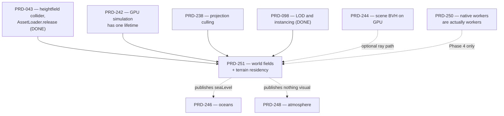

# PRD-251 — A world is queryable fields and resident tiles; what it looks like is the game's

**Status: PROPOSED, 2026-08-28. Nothing below has been executed.** Baseline HEAD
`b37bf30fb51527ac086a484893ad813ee0a2df0b`, branch `main`, remote
`https://github.com/ThreeNativeHQ/threenative.git`. Binding charter:
[`docs/architecture/CHARTER.md`](../../architecture/CHARTER.md).

Parent batch: [feature-mining](./README.md).

**Complexity:** +3 touches 10+ files, +2 new subsystem from scratch, +2 residency/GPU state
across frames, +2 multi-package (`world`, `core`, `physics`, `playtest`, an example), +1 new
public surface = **10 → HIGH mode. Mandatory automated checkpoint after every phase.**

---

## 0. Product context, and the correction this PRD exists to record

[PRD-043](../done/PRD-043-terrain-and-open-world.md) is **substrate and census, not a
procedural-world system**, and it never claimed otherwise. What it shipped and proved:

| PRD-043 delivered | Where it lives today |
| --- | --- |
| `CollisionShape3D.heightfield` | `packages/physics/src/CollisionShape3D.ts:140` |
| `AssetLoader.release` | `packages/core/src/assets.ts` |
| Three streamed chunks, load/unload by player X | `examples/abyss-framework/src/scenes/TerrainProbe.ts:153-170` |
| A 360-unit traversal with a `visibility` assertion | `examples/abyss-framework/playtests/terrain.playtest.json` |

And what that terrain **is**, read at HEAD (`TerrainProbe.ts:36-59`):

```ts
const geometry = new THREE.PlaneGeometry(CHUNK_SIZE, CHUNK_SIZE, 8, 8);   // 9×9 vertices
const height = Math.sin((localX + chunkX * CHUNK_SIZE) * 0.045) * 1.5
             + Math.cos(localZ * 0.08) * 0.75;
this.#material = new THREE.MeshBasicMaterial({ …, wireframe: true });
```

**A one-dimensional sinusoid on a 9×9 grid, drawn as green wireframe, streamed one tile
either side of the player along a single axis.** `STREAM_RADIUS = 1`, `CHUNK_RESOLUTION = 9`,
one axis of travel. It is a correct proof of two exports and a false floor for the phrase
"ThreeNative supports terrain". It is **not** comparable to
[`imsarah/threejs-world`](https://github.com/imsarah/threejs-world), and the earlier
equivalence between the two was wrong.

This PRD does not reopen PRD-043. It **consumes** its two exports, **replaces** its consumer
scene, and closes the gap between a substrate proof and world data a game can ship.

### The pinned reference, and what has and has not been read

Upstream is pinned as git objects at `/tmp/threejs-world-audit`, commit
`398320e9bcf74bf4c15532fafff4c565f7729b37`, MIT.

> **HONESTY NOTE — READ THIS BEFORE FILLING IN ANY LINE NUMBER.**
> The upstream working tree does not exist: the checkout failed when the disk filled, and in
> the authoring session for this PRD every `git -C /tmp/threejs-world-audit show HEAD:<path>`
> was refused by the sandbox (non-interactive, no approval path). **No upstream file content
> was read.** Every upstream reference below is therefore at **module granularity**, taken
> from the pinned path list, and carries no line numbers on purpose. Phase 0 gate 0.1 is to
> read them and fill the borrow map in. **A line number written into the borrow map from
> memory rather than from the pasted output of the command below is a fabrication and fails
> the phase.**

```sh
# Phase 0 gate 0.1 — paste each output into the borrow map before writing any code.
for f in README.md src/world/Heightfield.ts src/world/TerrainTiles.ts src/world/MacroMap.ts \
         src/gpu/passes/HeightSynthesis.ts src/gpu/passes/Erosion.ts \
         src/gpu/passes/FlowRivers.ts src/gpu/passes/BiomeSnow.ts \
         src/gpu/passes/Scatter.ts src/world/WorldConst.ts; do
  echo "=== $f ==="; git -C /tmp/threejs-world-audit show "HEAD:$f"; done
git -C /tmp/threejs-world-audit ls-tree -r --long HEAD | awk '{print $4, $5}' | sort -rn
git -C /tmp/threejs-world-audit show HEAD:LICENSE   # confirm MIT before mining anything
```

If `/tmp` has since been reclaimed, re-pin with
`git clone --filter=blob:none --no-checkout https://github.com/imsarah/threejs-world /tmp/threejs-world-audit`
followed by `git -C /tmp/threejs-world-audit fetch origin 398320e9bcf74bf4c15532fafff4c565f7729b37`,
and record the re-pin date. **The commit hash does not change.**

---

## 1. Executive summary

A game asked to build an open world on ThreeNative today gets `CollisionShape3D.heightfield`,
`AssetLoader.release`, and a blank page. It writes its own noise, its own tiling, its own LOD
seams, its own eviction, and its own CPU-side height query — and the two halves of that last
pair silently disagree, which is the defect class PRD-043 §3 already named.

This PRD proposes **one optional package, `@threenative/world`**, that owns exactly the parts
a game cannot write portably and cannot get right twice:

1. **Deterministic, queryable world fields.** `seed → height, normal, slope, flow, moisture,
   temperature, biomeIndex` at any world coordinate, identical on CPU and GPU, identical on
   web and native, identical across runs.
2. **Generation the game does not schedule.** Height synthesis, hydraulic erosion and flow
   routing as ordered GPU compute passes riding
   [PRD-242](../done/PRD-242-gpu-simulation-has-one-lifetime.md)'s `IComputeDriven` lifetime, with a
   per-frame dispatch budget so world generation cannot eat the frame.
3. **A crack-free residency lifecycle.** `TerrainTiles` decides which tiles are resident at
   which LOD, stitches their edges, evicts under a byte/count budget, and keeps the physics
   heightfield in lockstep with the rendered geometry.

And it owns **none** of the following, permanently: material, colour, texture, splat blend,
what a biome *means*, tree species, scatter density, art direction, water appearance, sky,
lighting, camera, post. The game gets numbers and a `THREE.BufferGeometry`; it decides
everything a screenshot shows.

**The one-line test this PRD must pass:** two games over the *same seed and the same
`@threenative/world` build* produce two completely different-looking worlds with no package
file edited.

**The kill switch is armed from the start.** §11 states the numbers that delete this package
rather than keep it because it was built.

---

## 2. The two questions (charter §11.1), answered

**(a) Could the game write this portably itself?**

| Capability | Game can write it? | Verdict |
| --- | --- | --- |
| fBm/domain-warped height synthesis | **Yes, ~40 lines**, and every line decides how the ground looks | **Game's.** PRD-043 row 3, unchanged. |
| Scatter placement | **Yes, ~25 lines** on `ctx.random` | **Game's.** PRD-043 row 5, unchanged. |
| LOD ladder, instancing | **Yes, 2 lines** of `THREE.LOD` | **Game's.** PRD-043 row 6 + PRD-098, unchanged. |
| Frustum culling | Zero lines; already default, and [PRD-238](./PRD-238-the-projection-culls-what-the-camera-cannot-see.md) owns the rest | **Nothing to build.** |
| **CPU/GPU field parity** — the same height on the render path and the query path | **No.** The GPU synthesises in a compute pass; the CPU must reproduce it bit-comparably for collision and raycast. Getting these to agree is the framework's job or it is nobody's | **FRAMEWORK** |
| **Crack-free LOD stitching across a tile boundary** | **No, not in 20 lines.** Neighbour-aware edge decimation plus skirts, recomputed on every residency change | **FRAMEWORK** |
| **Bounded GPU generation scheduling** | **No.** Requires the frame-budget seam and `IComputeDriven`'s lifetime; a game that dispatches erosion inline stalls the frame | **FRAMEWORK** |
| **Hydraulic erosion / flow routing** | Technically yes, practically no — it is a multi-pass ping-pong solve whose correctness is a *measurable topology property*, not a look | **FRAMEWORK, gated on §11.2** |
| **Residency budget + eviction with physics in lockstep** | **No.** Needs `AssetLoader.release`, collider lifetime and geometry disposal to move as one unit | **FRAMEWORK** |

**(b) Does it decide how anything looks?** **No, and that is enforced by grep** — see the
acceptance criteria. The package ships no `Material`, no `Color`, no colour literal, no
texture, no tonemap, no light, no camera, and no biome name. It ships `Float32Array`s,
`BufferGeometry`, and a sampler.

(b) is a veto over (a), and here (b) is satisfied by construction: the framework never
constructs a material.

---

## 3. Scope, and the non-goals stated as vetoes

### In scope

- `Heightfield` — a deterministic, CPU-queryable, GPU-resident scalar field bundle.
- `MacroMap` — the coarse, whole-world, seed-derived layer (landmass mask, base climate)
  that keeps tiles globally consistent without generating every tile.
- Ordered GPU passes: **height synthesis → hydraulic erosion → flow routing → derived
  moisture/biome index**, dispatched under a per-frame budget.
- `TerrainTiles` — residency, LOD selection, neighbour-aware stitching, skirts, eviction.
- CPU/physics query parity: `heightAt`, `normalAt`, `sample(channel, x, z)` agreeing with the
  rendered geometry and with the `CollisionShape3D.heightfield` collider.
- Optional authored-data import/export (`toBytes` / `fromBytes`) so a game can ship a fixed
  world instead of generating one — **only if Phase 5 shows a consumer needs it.**

### Out of scope — permanent vetoes, not deferrals

| Not ours | Why | Owner |
| --- | --- | --- |
| Terrain material, splat blending, triplanar, colour ramps | Charter "never own the look" | game `src/render/` |
| What a biome *is* — "snow", "desert", "tundra" | Naming a biome is art direction. We publish `moisture`, `temperature`, `slope`, `biomeIndex: number` | game |
| Tree/rock/grass models, species, density, orientation rules | PRD-043 row 5, declined under rule 1 and not reopened | game |
| Water surface, shoreline, foam, refraction | [PRD-246](./PRD-246-two-oceans-two-contracts.md). We publish `seaLevel: number` and nothing else | PRD-246 |
| Sky, aerial perspective, fog | [PRD-248](./PRD-248-the-atmosphere-is-luts-the-sky-is-the-games.md) | PRD-248 |
| A second renderer, a renderer abstraction, a scene format, an IR, an editor, a preset/genre system | Charter closes all of these with evidence, outranking rule 1 | — |
| **Quality presets** (`quality: "high"`) | A preset system is charter-closed. Tiers in this PRD are **measurement configurations**, never shipped defaults. The public surface takes explicit numbers | — |
| Floating origin / large-world coordinates | PRD-043 row 9, declined for vocabulary and evidence. This PRD stays inside the declared precision envelope and **states the envelope** rather than fixing it | PRD-043 §6.2 |
| Navmesh across tiles | PRD-043 row 10, trigger unmet | PRD-043 §6.3 |
| Persistent world save/load | PRD-036 | PRD-036 |

### Preserved upstream API — non-negotiable

Plain `three` / `three/webgpu` `WebGPURenderer`, TSL for compute. **No fork of three, no
WebView, no proprietary renderer abstraction, no platform-specific game source, no
raw-WGSL-only public contract.** A game imports `THREE` as it always did; `@threenative/world`
hands it geometry and numbers.

---

## 4. Where the package goes, and the charter rule 5 adjudication

Charter rule 5: *a package exists only when it carries a dependency the others must not
inherit.* Answer honestly, because the answer is not obviously yes:

- `@threenative/world` needs no new npm dependency beyond `three`.
- It **does** carry a worker-backed generation pool ([PRD-250](./PRD-250-native-workers-are-actually-workers.md))
  and a multi-megabyte compute/residency surface that every `@threenative/core` consumer would
  otherwise inherit in its bundle.

**Phase 0 gate 0.5 decides this, with a stated criterion, before any file is created:**

- **Package** (`packages/world/`) **if** the worker dependency from PRD-250 is a real import
  that `core` does not already carry, **or** measured bundle delta to a world-free game
  exceeds a stated byte threshold.
- **Otherwise: a subpath of core**, `@threenative/core/world`, tree-shaken and documented as
  optional. The mechanism, the API, and every gate in this PRD are unchanged either way.

Filing this as an open adjudication rather than assuming the package is deliberate. The name
`@threenative/world` is used throughout for readability; substitute
`@threenative/core/world` if 0.5 rules that way.

---

## 5. Borrow map — mined, adapted, and explicitly refused

Column "Read" is **empty of line numbers on purpose** — see §0's honesty note. Phase 0 fills
them from pasted output.

| Upstream module | Disposition | What we take, or why we do not |
| --- | --- | --- |
| `README.md` | **Read first** | The world model, units and pass order in the author's own words. Records what the reference target *is*, which §10's comparison scores against. |
| `src/world/WorldConst.ts` | **ADAPT, do not copy** | Upstream's fixed world constants become **our public config object** with no defaults that pick a look. The framework's one-metre-is-one-metre convention wins over any upstream unit choice; if they disagree, ours is authoritative and the divergence is recorded. |
| `src/world/MacroMap.ts` | **MINE** | Coarse seed→world layer. This is the mechanism that makes tiles globally consistent without generating the globe, and it is not something a game writes twice. |
| `src/world/Heightfield.ts` | **MINE — the core of the PRD** | Field storage, sampling, derivative computation, the CPU-side query. The one place where CPU/GPU parity is either designed in or lost forever. |
| `src/world/TerrainTiles.ts` | **MINE** | Residency, LOD selection, stitching, skirts. Adapted onto `THREE.LOD`/`InstancedMesh` (PRD-098) and PRD-238's culling — **we do not port a second culler or a second LOD system.** |
| `src/gpu/passes/HeightSynthesis.ts` | **MINE the pass structure, REFUSE the tuning** | We borrow *how* synthesis is dispatched and how octaves/warp feed the field. Every amplitude, frequency and warp constant is a game input with no framework default that produces a specific-looking world. |
| `src/gpu/passes/Erosion.ts` | **MINE, gated on §11.2** | Hydraulic erosion is the single mechanism that separates real terrain from noise, and its correctness is *measurable* (§10), not aesthetic. Ships only if the §11.2 numbers hold. |
| `src/gpu/passes/FlowRivers.ts` | **MINE, gated on §11.2** | Flow accumulation / drainage routing. Publishes `flow` as a number per texel. **Rivers as a rendered thing are the game's**; we publish where water would go. |
| `src/gpu/passes/BiomeSnow.ts` | **REFUSED — permanently** | "Snow" is art direction. Charter "never own the look". We publish `moisture`, `temperature`, `slope`, `biomeIndex`; the game decides that index 3 means snow and what snow looks like. |
| `src/gpu/passes/Scatter.ts` | **REFUSED — PRD-043 row 5** | Scatter is ~25 lines on `ctx.random` and was declined under rule 1. This PRD does not reopen it. `Heightfield.sample()` is what makes those 25 lines easy; that is the whole contribution. |
| Anything constructing a `Material`, `Color`, texture, light or camera | **REFUSED — permanently** | Charter veto (b). Enforced by the grep gate in §9. |
| The upstream renderer/app shell, whatever its shape | **REFUSED** | No second renderer. Plain `WebGPURenderer` only. |

**Deliberately not a wholesale port.** Upstream is a large single-purpose experiment; this PRD
lands a narrow vertical slice (§13 Phase 1) and adds erosion/flow only after they clear a
measured gate. Any phase whose diff approaches a wholesale transcription of upstream has
failed the intent and must be split.

---

## 6. Incumbent census — everything already live that touches this

| Existing thing | Where | Relationship |
| --- | --- | --- |
| `CollisionShape3D.heightfield` | `packages/physics/src/CollisionShape3D.ts:140` | **Depended on.** `TerrainTiles` feeds it; the `rows-1`/`columns-1` convention stays owned there. Not re-implemented. |
| Heightfield collider plumbing | `packages/physics/src/simulation.ts:441,593` | Depended on, untouched. |
| `AssetLoader.release` | `packages/core/src/assets.ts` | **Depended on** for the eviction path. PRD-043's second export finally gets a non-toy caller. |
| `TerrainProbe` scene | `examples/abyss-framework/src/scenes/TerrainProbe.ts` | **REPLACED.** The sinusoid, the 9×9 grid, the wireframe material and the hand-rolled `#stream()` are deleted in Phase 5. This is the integration requirement, not a showcase. |
| `terrain.playtest.json` (`terrain-streaming`) | `examples/abyss-framework/playtests/` | **UPGRADED in place.** Same scenario name, stronger assertions. A second parallel scenario would be the additive-migration anti-pattern. |
| `perf-signals-world.ts`, `world-gameplay.ts` | `packages/playtest/src/evaluators/` | Extended with the topology metrics of §10. Existing assertions keep working. |
| `templates/platformer/src/render/terrain.ts` | template | **Unrelated** — 29 lines of rounded slabs, named `terrain.ts`, not terrain (PRD-043 §1a). Untouched. |
| `IComputeDriven` (PRD-242) | `packages/core/src` | **Depended on** for dispatch order, ping-pong and release. No second lifetime. |
| PRD-238 projection culling | `packages/core/src/projection-*.ts` | **Depended on** for tile visibility. No second culler. |
| PRD-244 GPU BVH | | **Depended on** if a tile needs a ray query beyond the heightfield fast path. No second acceleration structure. |
| PRD-098 LOD/instancing | | **Depended on.** `TerrainTiles` composes `THREE.LOD`; it does not replace it. |
| PRD-246 oceans / PRD-248 atmosphere | | **Adjacent.** We publish `seaLevel`; they own every pixel of water and sky. |
| PRD-250 native workers | | **Depended on** for off-thread generation on native. Sequencing in §7. |

---

## 7. Dependencies and sequencing



**Hard blockers:** PRD-242 (Phase 2 cannot start without `IComputeDriven`), PRD-238 (Phase 3
tile visibility). **Soft:** PRD-250 — if native workers are not ready, Phase 4 records
generation as main-thread on native with the measured hitch, and says so; it does not fake a
worker.

**PRD-043 is not a blocker and is not reopened.** Its exports are inputs.

---

## 8. Consumer scenarios — what a game actually writes

**Scenario A — an agent is asked to add a walkable world.**

```ts
// src/scenes/Play.ts — the game's file
import { MacroMap, TerrainTiles } from "@threenative/world";
import { terrainMaterial } from "../render/terrain.js";   // the look: yours, always

const macro = new MacroMap({ seed: 1337 });
const tiles = new TerrainTiles({
  macro,
  tileSize: 256,          // world units — one metre is one metre
  tileResolution: 129,
  residentTileBudget: 25,
  erosionIterations: 40,
  material: terrainMaterial(),      // the game hands the framework a material; never the reverse
  physics: ctx.physics,
});
ctx.add(tiles);

// update()
tiles.follow(player.position);      // residency, LOD, stitching, eviction, colliders
```

**Scenario B — the query the game could not previously trust.**

```ts
const y = tiles.heightAt(x, z);        // agrees with the rendered mesh and the collider
const n = tiles.normalAt(x, z);
const wet = tiles.sample("moisture", x, z);
```

**Scenario C — biome meaning and scatter stay the game's (PRD-043 row 5, unchanged).**

```ts
// src/world/scatter.ts — the game's ~25 lines, unchanged in character
for (const p of ctx.random.points(area, 200)) {
  if (tiles.sample("slope", p.x, p.z) > 0.6) continue;
  const species = tiles.sample("moisture", p.x, p.z) > 0.5 ? pine : scrub;  // the game decides
  instances.add(species, p.x, tiles.heightAt(p.x, p.z), p.z);
}
```

**Scenario D — the charter test.** Two games, same seed, same package build, two
`src/render/terrain.ts` files → two worlds a player would not recognise as related. Zero
package edits.

---

## 9. Exact commands

```sh
# unit + type + lint
pnpm typecheck && pnpm lint && pnpm test
pnpm --filter @threenative/world test

# the game, headed browser WebGPU, real input
pnpm --filter @threenative/playtest build
node packages/playtest/dist/runner/cli.js \
  examples/abyss-framework/playtests/terrain.playtest.json \
  --url http://127.0.0.1:5173 \
  --server-command "pnpm --filter abyss-framework dev -- --host 127.0.0.1" \
  --browser-recipe webgpu

# native desktop
pnpm native:build
pnpm native:verify:desktop
pnpm parity
node packages/playtest/dist/runner/cli.js \
  examples/abyss-framework/playtests/terrain.playtest.json --target desktop

# device (Phase 4 only; check thermals first)
node packages/playtest/dist/runner/cli.js doctor --device <serial> --text
node packages/playtest/dist/runner/cli.js \
  examples/abyss-framework/playtests/terrain.playtest.json --target android --device <serial>

# frame meters without opening a log
node packages/playtest/dist/runner/cli.js perf --file <log>

# budgets, quality, kill switch, docs mirror
pnpm budgets && pnpm quality
pnpm tsx scripts/count-loc.ts
pnpm build && pnpm sync:agents

# the look-ownership gate (must return nothing under packages/world)
rg -n "Material|new THREE\.Color|0x[0-9a-fA-F]{6}|Texture\(|Light\(|snow|desert|tundra" packages/world/src

# caller census (must return a non-test consumer for every export)
rg -n "TerrainTiles|Heightfield|MacroMap" --glob '!**/__tests__/**' --glob '!**/*.spec.ts' packages examples

# free a dev server by port, never pkill -f vite
lsof -ti tcp:5173 | xargs -r kill
```

---

## 10. Quality comparison — the metrics that make a sine wave fail

Scored over an identical 4 km² region for all three subjects, from the height field alone —
no material, no lighting, no screenshot in the metric. Thresholds are filled by Phase 0/6
measurement; **the discrimination requirement is stated now.**

| # | Metric | What it measures | PRD-043 sine wireframe | `@threenative/world` | Upstream `398320e9` |
| --- | --- | --- | --- | --- | --- |
| 1 | **Directional anisotropy** — var(∂h/∂x) / var(∂h/∂z) | Is the field one-dimensional? | **Must fail.** PRD-043's height is `sin(x)` + `cos(z)` with a 2:1 amplitude split on a 9×9 grid | pass | pass |
| 2 | **Log-log power-spectrum slope β** | Fractal terrain sits in a stated band; a pure sinusoid is a delta spike | **Must fail** | pass | pass |
| 3 | **Height-histogram entropy** | Real terrain is multi-modal; a sinusoid is a fixed arcsine distribution | **Must fail** | pass | pass |
| 4 | **Endorheic sink count per km²** (D8) | Does water get anywhere? Parallel sine ridges trap it everywhere | **Must fail** | pass | pass |
| 5 | **Max Horton–Strahler stream order** | Is there a branching drainage network, or parallel grooves? | **Must fail** (order 1) | ≥ stated | ≥ stated |
| 6 | **Profile-curvature skewness** | Erosion carves concave valleys → negative skew. Sine curvature is symmetric | **Must fail** (≈ 0) | < 0 | < 0 |
| 7 | **Effective vertex density per km²** | 9×9 per 64 units is not terrain | **Must fail** | ≥ stated | ≥ stated |
| 8 | **Slope-distribution tail** (fraction above stated angle) | Is there anything to climb? | **Must fail** | pass | pass |

**Plus inspected visual proof**, which no metric replaces: three headed captures of the same
region, pasted side by side in `docs/verification/PRD-251-quality.md`, looked at with human
eyes. The metric table is the objective floor; the capture is the veto.

**Phase 0 exit condition, restated because it is easy to skip:** a metric that PRD-043 passes
*and* upstream passes does not discriminate and is replaced before Phase 1. A metric passed
only by our own build is a self-comparison and is likewise invalid.

---

## 11. Kill switch, rollback, and the conditions that delete this package

### 11.1 The rule-2 kill switch

`pnpm tsx scripts/count-loc.ts` scores `@threenative/world` against a game writing the same
capability portably (Phase 0's baseline, §13.0.6). **If the framework arm is not materially
smaller across every repetition — not one site — the package is deleted, however much work it
took.** "It was hard to build" is not a defence; the charter is explicit.

### 11.2 The erosion/flow gate

Erosion and flow are the largest, riskiest surface here. They ship **only if all three hold**:

1. They move at least three §10 metrics that synthesis alone does not move.
2. Their measured cost fits inside the per-frame dispatch budget on desktop native and headed
   browser, both.
3. A game cannot get equivalent §10 scores from a portable ~40-line synthesis function. If it
   can, erosion is the game's and this PRD ships fields + tiles only.

Failing any of the three, Phases 2's erosion/flow are **cut**, the PRD ships narrower, and
that is recorded as a result.

### 11.3 Device cost gate

If no configuration reaches a playable frame on the Pixel 8 lane, the honest outcome is
`capabilities.generation === "unsupported"` on that device class plus a **BLOCKED** row naming
the device and the limit. Shipping a default that quietly eats the mobile frame is the failure
this gate exists to prevent.

### 11.4 Rollback

Every phase is additive behind an optional import until Phase 5. Rollback at any point before
Phase 5 is `git rm -r packages/world` plus reverting `TerrainProbe.ts` — the example is the
only consumer. **After Phase 5, rollback means restoring PRD-043's sinusoid**, which is why
Phase 5 is last and why its captures are archived before the incumbent is deleted.

### 11.5 Scope-creep tripwires

Any of these means the PRD has drifted and must stop for re-scoping: a `Material` in
`packages/world/`; a biome *name* in package code; a second culler, LOD system or renderer; a
preset/genre object; a raw-WGSL public signature; a platform branch in example scene code; a
phase diff that reads as a wholesale transcription of upstream.

---

## 12. Integration Ledger

Every caller below is a named, non-test file that already exists or is created by the phase in
its cell; the `:line` is appended at delivery, when the line exists. A caller that is still
unnamed at phase end means the phase is incomplete.

| # | New thing | Live caller (`file:line`, non-test) | Replaces | Old path removed? | Negative control |
| --- | --- | --- | --- | --- | --- |
| 1 | `MacroMap` | `examples/abyss-framework/src/scenes/TerrainProbe.ts` (Phase 1) | nothing — no global seed layer exists | n/a | seed from wall clock → determinism test reds |
| 2 | `Heightfield` + `sample`/`heightAt`/`normalAt` | `examples/abyss-framework/src/scenes/TerrainProbe.ts` (Phase 1) | the inline `Math.sin`/`Math.cos` at `TerrainProbe.ts:48-49` | **Yes — deleted in Phase 1** | offset the field by one row → CPU/render parity test reds |
| 3 | `toColliderHeights` → `CollisionShape3D.heightfield` | `examples/abyss-framework/src/scenes/TerrainProbe.ts` (Phase 1) | the hand-built `heights` array at `TerrainProbe.ts:43-52` | **Yes — deleted in Phase 1** | drop the length check → collider silently offset, unit test reds |
| 4 | Erosion + flow passes on `IComputeDriven` | `packages/world/src/heightfield.ts` → PRD-242 scheduler | nothing | n/a | iterations = 0 → stream-order and sink metrics red |
| 5 | Per-frame dispatch budget | `packages/world/src/heightfield.ts`, dispatched from the frame loop via `IComputeDriven` | nothing | n/a | remove the budget → dispatch-count test reds |
| 6 | `TerrainTiles` residency + eviction | `examples/abyss-framework/src/scenes/TerrainProbe.ts` (Phase 3) | the hand-rolled `#stream()` at `TerrainProbe.ts:153-170` | **Yes — deleted in Phase 3** | disable eviction → resident-bytes cap test reds |
| 7 | Stitching + skirts | `packages/world/src/terrain-tiles.ts` | nothing | n/a | remove skirts → seam-gap test reds |
| 8 | `AssetLoader.release` consumer | `packages/world/src/terrain-tiles.ts` | PRD-043's toy caller | PRD-043's caller is deleted with `#stream()` | stub the loader with a counter → no-op release reds |
| 9 | Topology metrics | `packages/playtest/src/evaluators/world-gameplay.ts` | nothing | n/a | score PRD-043's field → must go red on metrics 1–8 |
| 10 | `world.capabilities` | `packages/world/src/index.ts`, read by the example | nothing | n/a | stub compute limits low → path switches; silently proceeding reds |
| 11 | Native conformance case | `packages/runtime-native/conformance/registry.json` | nothing | n/a | patch one platform by one constant → field-hash parity reds |
| 12 | Upgraded scenario | `examples/abyss-framework/playtests/terrain.playtest.json` (same `terrain-streaming` name) | its own weaker assertions | **Yes — edited in place, not duplicated** | run it against HEAD's sinusoid → must red |

**Row 12 is the anti-showcase guarantee.** The pre-existing PRD-043 consumer path is upgraded
in place. A new parallel scene or a second scenario would be the additive-migration
anti-pattern and fails the phase.

---

## 13. Execution Phases

Every phase edits at least one pre-existing file. Every phase ends with the
`prd-work-reviewer` automated checkpoint including the integration audit. Phases 1, 3 and 5
additionally take a manual checkpoint (visual/pixel outcome).

### Phase 0 — read the reference, adjudicate the package, and score the floor

**No implementation.** `docs/PRDs/feature-mining/README.md` is **not** edited by this PRD; the
batch index is the batch owner's.

**Files (2):**

- `docs/PRDs/feature-mining/PRD-251-procedural-world-fields-and-terrain-residency.md` — EDIT: the borrow map's line ranges filled from pasted upstream output.
- `docs/verification/PRD-251-phase0.md` — NEW: pasted upstream reads, the PRD-043 floor scores, the rule 5 adjudication, the LOC baseline.

- [ ] 0.1 Read all ten pinned upstream files with the §0 command; **paste every output** into
      the verification record and fill §5's line ranges. Confirm `LICENSE` is MIT.
- [ ] 0.2 Record what upstream's world actually is: extent, tile size, resolution, pass order,
      resident-tile budget, and what it costs. This becomes the §10 reference target.
- [ ] 0.3 Score **PRD-043's `TerrainProbe` terrain** on every §10 metric. This is the floor,
      and it must be recorded before any new code so it cannot be retro-fitted.
- [ ] 0.4 Confirm the erosion/flow gate numbers in §11.2 against 0.2's data; if upstream's own
      output fails a metric, the metric is wrong and gets fixed here, not later.
- [ ] 0.5 **Rule 5 adjudication** (§4): package or core subpath, with the measured bundle
      delta pasted. Decision recorded in the verification file.
- [ ] 0.6 `pnpm tsx scripts/count-loc.ts` baseline, so §11.1's kill switch has a before.

**Exit gate:** §10's metric table has a PRD-043 column and an upstream column, both filled
with measured numbers. **If PRD-043's terrain passes any §10 metric that upstream also
passes, that metric does not discriminate and must be replaced before Phase 1.**

### Phase 1 — one seed, one region, a player walks it, and collision agrees

**The narrow first vertical slice, and the only phase that must land before anything else is
worth building.**

**Proof subject:** a **4 km² multi-octave domain-warped field at production tile resolution**,
walked by real input, with the collider derived from the same field.
**Not** a 9×9 grid and **not** a single tile.
**Requirements this subject does NOT exercise:** erosion, flow routing, LOD transitions,
eviction, GPU compute scheduling, native.
**Phase that closes each gap:** Phase 2 (erosion, flow, GPU scheduling), Phase 3 (LOD,
stitching, eviction), Phase 4 (native + mobile).

**Files (5):**

- `packages/world/src/heightfield.ts` — NEW: `Heightfield`, CPU synthesis plus `sample`/`heightAt`/`normalAt`.
- `packages/world/src/macro-map.ts` — NEW: `MacroMap`, seed to coarse layer.
- `packages/world/src/index.ts` — NEW: public surface.
- `examples/abyss-framework/src/scenes/TerrainProbe.ts` — EDIT: the sinusoid at `:48-49` is deleted and the chunk mesh is built from `Heightfield`; `#stream()` stays hand-rolled until Phase 3.
- `packages/world/__tests__/heightfield.spec.ts` — NEW: determinism, parity and collider-convention tests.

**Implementation:**
- [ ] `MacroMap(seed)` → deterministic coarse landmass/climate. Pure function of the seed; no
      wall-clock, no `Math.random`, no module-level mutable state.
- [ ] `Heightfield` synthesises on CPU into `Float32Array` channels; `heightAt(x,z)` and
      `normalAt(x,z)` read the *same* storage the geometry was built from — **one owner, never
      two evaluations of "the same" function.**
- [ ] `toColliderHeights(tile)` returns the `Float32Array` in the exact row/column convention
      `CollisionShape3D.heightfield` expects. This is the drift surface; it gets its own test.
- [ ] No `Material`, `Color`, texture or light constructed anywhere in `packages/world/`.

**Wiring:**
- [ ] Caller edited: `TerrainProbe.ts` constructs `Heightfield` and feeds both the geometry and
      `CollisionShape3D.heightfield` from it.
- [ ] Old path: the inline `Math.sin`/`Math.cos` height expression is **deleted**, not wrapped.
- [ ] Ledger rows filled: #1, #2, #3.

| Test | Assertion | Negative control (must be observed red) |
| --- | --- | --- |
| `should produce an identical field for an identical seed` | hash equality over all channels, two constructions | seed the synthesis from `Date.now()` → hashes differ, reds |
| `should produce a materially different field for a different seed` | metric distance above threshold, not just `!==` | ignore the seed argument → distance ≈ 0, reds |
| `should agree between heightAt and the rendered vertex at the same coordinate` | max abs error below stated epsilon over N sampled points | offset the collider heights by one row → error explodes, reds |
| `should reject a heights buffer whose length is not rows*columns` | throws | remove the check → silently offset collider, test reds |
| `should construct no THREE.Material anywhere in packages/world` | static grep gate | add one `MeshStandardMaterial` → reds |

**Revert check:** delete `packages/world/` → `TerrainProbe.ts` fails to typecheck and
`terrain.playtest.json` fails. Not "a new test fails" — a **pre-existing** scenario fails.

**Manual checkpoint:** headed capture of the walked region, inspected. If it looks like noise
draped on a plane, Phase 2 is the answer and that is recorded, not glossed.

### Phase 2 — erosion and flow, judged as topology, not as a screenshot

**Files (5):**

- `packages/world/src/passes/height-synthesis.ts` — NEW: the synthesis dispatch, tuning taken from the game.
- `packages/world/src/passes/erosion.ts` — NEW: hydraulic erosion ping-pong, gated on §11.2.
- `packages/world/src/passes/flow.ts` — NEW: flow accumulation and drainage routing, gated on §11.2.
- `packages/world/src/heightfield.ts` — EDIT: GPU path and the `IComputeDriven` lifetime added to Phase 1's CPU owner.
- `packages/world/__tests__/erosion.spec.ts` — NEW: topology, parity and dispatch-budget tests.

- [ ] Passes dispatched **in a fixed order** through PRD-242's `IComputeDriven`: synthesis →
      erosion (N iterations) → flow accumulation → derived moisture. Order is physics, not
      preference, and is documented as such.
- [ ] **Bounded scheduling**: a per-frame dispatch budget. Generation may take many frames; it
      may not take one long one. Budget is an explicit number on the public surface.
- [ ] **CPU/GPU parity**: the GPU field read back matches the CPU field within a stated
      epsilon, and the epsilon is in the docs as a number.
- [ ] TSL only on the public path. Raw WGSL, if any exists internally, is never a public
      contract.

| Test | Assertion | Negative control |
| --- | --- | --- |
| `should raise max Horton-Strahler stream order above the flat-field floor` | measured order ≥ threshold | erosion iterations = 0 → order collapses, reds |
| `should reduce endorheic sink count per km² below threshold` | measured | flow routing disabled → sinks explode, reds |
| `should produce negatively skewed profile curvature after erosion` | skewness < 0 | erosion disabled → skew ≈ 0, reds |
| `should read back a GPU field matching the CPU field within epsilon` | max abs error | patch one pass on one side only → reds |
| `should not exceed the per-frame dispatch budget` | measured dispatch count/frame | remove the budget check → reds |

**Revert check:** disable erosion → the Phase 5 quality gate goes red on the topology metrics.

### Phase 3 — tiles: resident, stitched, evicted, and physics in lockstep

**Files (5):**

- `packages/world/src/terrain-tiles.ts` — NEW: residency, LOD selection, stitching, skirts, eviction.
- `packages/world/src/index.ts` — EDIT: `TerrainTiles` added to the public surface.
- `examples/abyss-framework/src/scenes/TerrainProbe.ts` — EDIT: `#stream()` deleted, `TerrainTiles` owns residency.
- `examples/abyss-framework/playtests/terrain.playtest.json` — EDIT: the `terrain-streaming` scenario gets residency and seam assertions, in place.
- `packages/world/__tests__/terrain-tiles.spec.ts` — NEW: residency cap, seam gap, collider lockstep, LOD pop.

- [ ] LOD selection per tile, composed over `THREE.LOD` (PRD-098) — not a new LOD system.
- [ ] Visibility via PRD-238's projection cull — not a new culler.
- [ ] **Crack-free**: neighbour-aware edge decimation plus skirts. A tile at LOD *n* adjacent
      to LOD *n+1* has no gap wider than the stated threshold.
- [ ] **Bounded residency**: resident tile count and resident bytes both capped; eviction runs
      `AssetLoader.release`, disposes geometry, and disposes the collider **as one unit**.
- [ ] Physics collider follows residency exactly: a resident tile always has a collider, an
      evicted tile never does, and no frame has one without the other.

| Test | Assertion | Negative control |
| --- | --- | --- |
| `should keep resident tile bytes under the configured cap during traversal` | measured peak | disable eviction → cap exceeded, reds |
| `should leave no gap wider than threshold across an LOD boundary` | max seam gap | remove skirts/stitching → reds |
| `should hold a collider for exactly the resident tile set` | set equality every frame | evict geometry without the collider → reds |
| `should not pop beyond the stated screen-space threshold on LOD change` | measured delta | force an instant LOD swap → reds |

**Manual checkpoint:** headed traversal video/frames inspected for visible cracks and pops.

### Phase 4 — native desktop, and an honest word about mobile

**Files (4):**

- `packages/runtime-native/conformance/registry.json` — EDIT: the world conformance case registered.
- `packages/world/src/capabilities.ts` — NEW: runtime report of compute availability and active generation path.
- `packages/world/src/index.ts` — EDIT: `capabilities` exported.
- `docs/verification/PRD-251-native.md` — NEW: native desktop and device evidence, including any recorded `unsupported`.

- [ ] **The same ordinary game source** builds and runs on headed browser WebGPU *and* native
      desktop WebGPU. No `#if native`, no platform branch in the example's scene code.
- [ ] `world.capabilities` reports, at runtime: is GPU compute available, at what workgroup
      limits, and which generation path is active (`gpu` | `cpu-fallback` | `unsupported`).
- [ ] **Mobile is decided by measurement, and every outcome is legitimate except a fake pass:**
      - GPU compute path runs on Pixel 8 → record the numbers.
      - It does not → the CPU fallback runs at a stated reduced iteration count, **and the
        docs say "reduced on mobile" with the number**.
      - Neither is viable → status is `unsupported` on that device class, this PRD closes with
        a **BLOCKED** row naming the device and the limit, and `capabilities` reports
        `unsupported` at runtime. **No path where mobile is claimed and untested.**
- [ ] Native evidence: `pnpm native:verify:desktop`, plus `pnpm parity` on the conformance
      case, plus the playtest CLI at `--target desktop`.

| Test | Assertion | Negative control |
| --- | --- | --- |
| `should report unsupported when compute limits are below requirement` | capability object | stub the limits low → path switches, reds if it silently proceeds |
| `should produce the same field hash on web and native for the same seed` | hash equality | patch one platform's synthesis by one constant → reds |

Recall the two false-result traps: never call `xvfb-run` (the runner provisions its own Xvfb);
and a WebGPU run that does not name its adapter may be SwiftShader — use
`--browser-recipe webgpu` and check `adapter.info`. Desktop A/Bs read `render.p50`, never fps.

### Phase 5 — the incumbent dies, and the quality comparison is scored

**This is the integration phase and the phase that decides whether the PRD was worth it.**

**Files (5):**

- `examples/abyss-framework/src/scenes/TerrainProbe.ts` — EDIT: final form, no hand-rolled height maths, no hand-rolled streaming, no `wireframe: true`.
- `examples/abyss-framework/playtests/terrain.playtest.json` — EDIT: the real-input traversal and the full assertion set.
- `packages/playtest/src/evaluators/world-gameplay.ts` — EDIT: §10's topology metrics added, existing assertions untouched.
- `packages/playtest/src/evaluators/perf-signals-world.ts` — EDIT: resident tiles and resident bytes reported.
- `docs/verification/PRD-251-quality.md` — NEW: the three-subject metric table and the three headed captures.

- [ ] `TerrainProbe.ts` contains **zero** hand-rolled height maths, **zero** hand-rolled
      streaming, and **zero** `wireframe: true`. Its material lives in the example's
      `src/render/` and is the example's.
- [ ] The **real-input traversal**: the player walks a stated distance across a stated number
      of tile boundaries and at least one LOD boundary, driven by the scenario's input stream.
      **Not an automated camera flythrough** — the scenario drives `move`, the character body
      moves, the tiles follow.
- [ ] §10's metric table filled for three subjects: PRD-043 (Phase 0 floor),
      `@threenative/world` (this build), pinned upstream (Phase 0 reference).
- [ ] Headed captures of all three, inspected side by side and pasted.
- [ ] Two `src/render/` materials over the **same** world produce two completely different
      looks with no package file edited — both captures pasted. **The charter test, executed.**

### Phase 6 — cost, tiers, and the kill-switch verdict

**Files (4):**

- `docs/verification/PRD-251-cost.md` — NEW: the three measurement configurations and their numbers.
- `packages/create-threenative/capabilities.json` — EDIT: regenerated by `pnpm build`, never hand-edited.
- `packages/world/AGENTS.md` — NEW: the package's own conventions and overrides.
- `packages/world/CLAUDE.md` — NEW: generated by `pnpm sync:agents`, never hand-written.

- [ ] Measure at three explicit configurations (tile resolution × erosion iterations ×
      resident-tile budget). **These are measurement configurations, not shipped presets.**
- [ ] Report per configuration: generation ms/tile, steady-state `render.p50`, peak resident
      bytes, peak resident tiles — on desktop native, headed browser, and Pixel 8 (or the
      recorded `unsupported`).
- [ ] **No number in this PRD is a budget until Phase 6 measures it.** Every threshold in §10
      and §13 is written as "stated threshold" precisely so it is filled from measurement.
- [ ] `pnpm tsx scripts/count-loc.ts` against the portable-app-code arm → §11.1 verdict.
- [ ] `pnpm budgets`, `pnpm quality`, and a manifest entry searchable by the plain-words
      situations *"generate a terrain a player can walk across"*, *"ask how high the ground is
      here"*, *"stream terrain without cracks"*.

---

## Negative Controls

Each control is observed red before its corresponding acceptance gate is reported green.

| Gate | Control | Expected red | Exact command/result |
|---|---|---|---|
| NC-1 | Replace generated fields with PRD-043's sinusoidal 9×9 wireframe floor. | The quality table fails erosion, hydrology, terrain-frequency, residency, and visual-complexity floors instead of declaring terrain equivalent. | command: pnpm playtest --project examples/abyss-framework --scenario terrain |
| NC-2 | Offset the CPU height query by one sample row or disable physics-heightfield refresh. | The input-driven traversal fails the rendered-height versus collision-height epsilon and names the first divergent coordinate. | command: pnpm --filter @threenative/world test |
| NC-3 | Pin every tile resident, disable eviction, or undercount resident bytes. | Peak resident tile/byte assertions fail and the traversal record identifies the over-budget frame. | command: pnpm playtest --project examples/abyss-framework --scenario terrain |
| NC-4 | Disable erosion/flow or reuse one seed for the different-seed arm. | River/flow topology and seed-distance invariants fail; screenshots alone cannot satisfy the gate. | command: pnpm --filter @threenative/world test |
| NC-5 | Add a terrain material, biome palette, species preset, or platform branch under `packages/world/src`. | The charter grep or same-source cross-platform check fails and blocks delivery. | command: pnpm quality |

## 15. Acceptance Criteria (consumer-scoped)

Every one is a command whose output is pasted. None may be reported green without it.
"Unverified" is an acceptable answer; a claimed gate that was not run is not.

- [ ] **Same source, two platforms.** The identical `examples/abyss-framework` scene source
      runs on headed browser WebGPU and native desktop WebGPU, with `adapter.info` named in
      the browser capture. No platform branch in the scene code — diff pasted.
- [ ] **Mobile is declared, never faked.** `world.capabilities` on a Pixel 8 reports `gpu`,
      `cpu-fallback` with the reduced iteration count, or `unsupported` with the limit that
      caused it — and the capability docs say the same thing.
- [ ] **A player walks a generated world under real input.** The scenario drives `move`; the
      character body traverses a stated distance across a stated number of tile boundaries and
      at least one LOD boundary. Not a camera flythrough.
- [ ] **The quality table is filled for three subjects** (PRD-043, this build, pinned upstream)
      and PRD-043's sine wireframe **fails metrics 1–8**. A build where it passes any of them
      means the metric is broken, not that the terrain is good.
- [ ] **Inspected visual proof:** three headed captures of the same region, side by side,
      looked at, pasted.
- [ ] **Determinism:** same seed → identical field hash on web and native. Different seed →
      metric distance above the stated threshold. Both pasted.
- [ ] **No cracks, no pops beyond threshold** across the traversal, measured and captured.
- [ ] **Bounded residency:** peak resident tiles and peak resident bytes both under their caps
      for the whole traversal, from the perf log.
- [ ] **Collision agrees with what is drawn:** max `heightAt` vs rendered-vertex error under
      the stated epsilon, over the whole traversed region.
- [ ] **Zero diagnostics** across the traversal.
- [ ] **The look is the game's, executed:** two `src/render/` materials over the same world →
      two unrecognisably different captures, no package file edited. Diff and both captures
      pasted.
- [ ] **Grep gate green:** §9's look-ownership `rg` over `packages/world/src` returns nothing.
- [ ] **Every export has a non-test consumer:** §9's caller census pasted.
- [ ] **Revert check:** deleting `packages/world/` breaks the pre-existing `terrain-streaming`
      scenario and `TerrainProbe.ts`'s typecheck — pasted failure.
- [ ] **Every incumbent path is gone:** `rg -n "Math.sin|wireframe" examples/abyss-framework/src/scenes/TerrainProbe.ts`
      returns nothing.
- [ ] **Every gate above was observed red at least once** with its stated mutation, and the red
      is pasted next to the green.
- [ ] `pnpm typecheck && pnpm lint && pnpm test` green.
- [ ] `pnpm budgets` green; `pnpm quality` recorded.
- [ ] `pnpm tsx scripts/count-loc.ts` verdict recorded, and §11.1 honoured whichever way it
      falls.
- [ ] The manifest answers *"generate a terrain a player can walk across"*, *"ask how high the
      ground is here"* and *"stream terrain without cracks"* — searched via
      `engine_search_capabilities`, results pasted.
- [ ] `pnpm sync:agents` run; `packages/world/CLAUDE.md` regenerated, not hand-written.

---

## Checkpoint Protocol

After every phase, record the exact baseline SHA, commands, exit codes, measured outputs, seeded-red
result, headed evidence class, and changed-file list under `docs/verification/PRD-251-*.md`. A phase
cannot close with a missing caller, an unfilled Integration Ledger cell, an unexecuted negative control,
a web-only claim presented as native/mobile proof, or thresholds chosen before measurement. Commit only
after the complete phase gate passes; an unsupported mobile capability is recorded honestly rather than
converted into a pass.

---

## 17. Risks

| # | Risk | Mitigation |
| --- | --- | --- |
| 1 | **CPU/GPU field divergence** — the silent killer. Collision drifts from what is drawn and no test notices | One storage owner (Phase 1), an explicit parity epsilon in the docs, and a negative control that offsets by one row |
| 2 | **The 21k-line port.** Mining becomes transcribing | §11.5 tripwire; ≤5 files per phase; erosion/flow gated on §11.2; Scatter and BiomeSnow refused up front |
| 3 | **Look creep.** One "sensible default" material and the charter is broken | §9 grep gate runs every phase; the game hands the framework a material, never the reverse |
| 4 | **Rule 5 violation** — a package that carries no exclusive dependency | Phase 0 gate 0.5 adjudicates before any file exists, with the core-subpath fallback named |
| 5 | **Reopening PRD-043's declines** by accident (scatter, LOD, culling, floating origin) | §6 census names each incumbent and the PRD that owns it; §3 lists them as vetoes |
| 6 | **Mobile fake pass.** The most likely dishonest outcome | §11.3 makes `unsupported` a legitimate, recordable result; capability object reports at runtime |
| 7 | **Invented budgets.** Numbers written before measurement | Every threshold is "stated threshold" until Phase 6 fills it; no phase may quote a budget it did not measure |
| 8 | **Precision envelope.** Float32 jitter past ~10 km (PRD-043 row 9, still declined) | Declare the envelope in the docs and keep the proof region inside it. Do not build floating origin here |
| 9 | **Upstream never gets read** and the borrow map stays speculative | Phase 0 exit gate requires the pasted output; the honesty note in §0 makes a memory-filled line number a phase failure |
| 10 | **Concurrent lanes.** Another agent is in this tree | Commit per phase; check `git branch --show-current` and mtimes before attributing any red |

---

## 18. Contract validation notes

- `prd_contract: v1` set in front matter, matching the batch's other files.
- **Complexity stated:** 10 → HIGH. Automated `prd-work-reviewer` checkpoint after every
  phase; manual checkpoints additionally on Phases 1, 3 and 5 (visual outcomes).
- **Every phase edits at least one pre-existing file** — Phase 0: this PRD + a verification
  record; Phase 1: `TerrainProbe.ts`; Phase 2: `heightfield.ts`; Phase 3: `TerrainProbe.ts` +
  `terrain.playtest.json`; Phase 4: `conformance/registry.json`; Phase 5: `TerrainProbe.ts`,
  the scenario, two evaluators; Phase 6: `capabilities.json` (generated), package AGENTS.
- **Every phase ≤5 files.**
- **Every acceptance criterion is consumer-scoped.** "A player walks a generated world"; not
  "the erosion pass compiles". "Two materials, two worlds, no package edit"; not "a material
  hook exists".
- **Every gate carries a stated mutation** that makes it red, per `docs/PRDs/AGENTS.md`.
- **Integration Ledger present**, 12 rows, four with a non-empty `Replaces` and all four
  deleted rather than left parallel.
- **Incumbent census present** (§6), naming every live owner.
- **Hardest-real-subject rule honoured:** Phase 1 proves on a 4 km² production-resolution
  field, with the un-exercised requirements and their closing phases declared inline.
- **No number in this document is presented as a measurement.** Everything quantitative is
  either read from HEAD source (cited by `file:line`) or written as a stated threshold that
  Phase 0/6 fills.
- **Linchpin contract validator: NOT RUN — recorded as unverified, not as passing.** The
  invocation is known from [PRD-250](./PRD-250-native-workers-are-actually-workers.md):

  ```sh
  sh ${LINCHPIN_PLUGIN_ROOT}/scripts/linchpin.sh contract \
    docs/PRDs/feature-mining/PRD-251-procedural-world-fields-and-terrain-residency.md
  # expected: CONFORMING
  ```

  In the authoring session `LINCHPIN_PLUGIN_ROOT` was unset and no `linchpin.sh` existed under
  `~/.claude` or on `PATH`, so the check could not be executed. Run it in a session where the
  plugin is loaded and paste `CONFORMING` (or the failure) into
  `docs/verification/PRD-251-phase0.md`. Until then §18 is the manual contract check only.
- **Not done here, deliberately:** no code, no commit, no branch, no worktree, and
  `docs/PRDs/feature-mining/README.md` is not edited — the batch index is the batch owner's.
