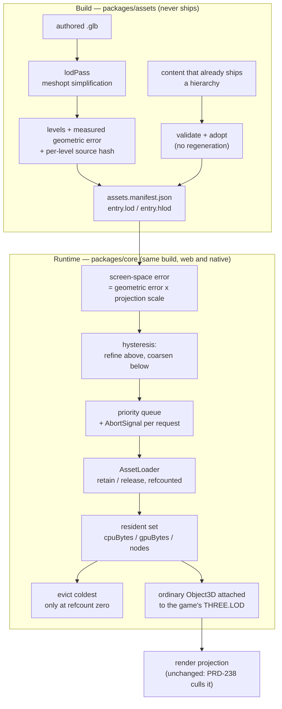

# PRD-253 — Content arrives because the camera needs it, and leaves because it does not

**Status: PROPOSED, 2026-08-28. Nothing below has been executed.**
Locked repository `/home/joao/projects/threenative/threenative-engine`, remote
`https://github.com/ThreeNativeHQ/threenative.git`, branch `main`, baseline HEAD
`b37bf30fb51527ac086a484893ad813ee0a2df0b`. Binding charter:
[`docs/architecture/CHARTER.md`](../../architecture/CHARTER.md).

Parent batch: [feature-mining](./README.md).

**Complexity:** +3 touches 10+ files, +2 new subsystem from scratch, +2 residency state carried
across frames with cancellation and eviction, +2 multi-package (`assets`, `core`, `playtest`,
`create-threenative`, an example), +1 external content integration (a real authored content set
that this repository does not contain today) = **10 → HIGH mode. Mandatory automated checkpoint
after every phase.**

---

## 0. The correction this PRD exists to record

An earlier triage of the feature-mining batch stated that LOD and instancing "already shipped."
**That is false**, and the falsehood is what makes this PRD necessary rather than redundant.

Read at HEAD:

| Claim in prior triage | What the source actually says |
| --- | --- |
| "LOD/instancing shipped in PRD-098" | [`docs/PRDs/done/PRD-098-lod-and-instancing.md:7-11`](../done/PRD-098-lod-and-instancing.md) — **"Status: DECLINED 2026-08-22 under its own Phase 0 exit… Nothing was built; nothing is stranded."** |
| "the framework generates LODs" | `packages/assets/src/passes/model.ts:511` — the pass chain is `dedup → prune → reorder → quantize → meshopt`. There is no simplification step. `meshoptimizer` is imported at `model.ts:12` for **`MeshoptDecoder` / `MeshoptEncoder` only**. |
| "the framework selects LODs" | `packages/core/src/projection-apply.ts:883-893` gives an `LOD` stand-in *the same levels at the same distances as the source*, and `projection-plan.ts:100,697` classifies an `LOD` on arrival and never descends into it. The projection **preserves** a game-authored `THREE.LOD`. It does not create one, does not compute error, and does not decide what is resident. |
| "terrain streaming shipped in PRD-043" | `examples/abyss-framework/src/scenes/TerrainProbe.ts` — `CHUNK_SIZE = 64`, `CHUNK_RESOLUTION = 9`, `STREAM_RADIUS = 1`: **three 9×9 wireframe tiles along one axis**, load/unload by player X in a hand-written `#stream` method. A correct proof of two exports; not a residency system. |
| "PRD-238 covers this" | [PRD-238](./PRD-238-the-projection-culls-what-the-camera-cannot-see.md) is **projection culling** — deciding what to *submit* from what is already in memory. It never decides what is in memory. The two are complementary and must not be conflated. |

### What is genuinely absent at HEAD

ThreeNative today accepts an ordinary `THREE.LOD` a game builds by hand and mirrors it faithfully
into the render projection. It does **not**:

- generate LOD or HLOD assets from authored content;
- compute or carry a measured geometric error;
- select or refine anything by screen-space error;
- declare or enforce a resident CPU/GPU byte budget;
- schedule, prioritise, prefetch, or **cancel** a load — `packages/core/src/assets.ts:190-201`
  calls bare `fetch` with no `AbortSignal`, and `cached()` at `assets.ts:301-325` has no notion of
  priority;
- evict safely — `release()` at `assets.ts:389-396` deletes the cache entry and
  `disposeEntry`/`disposeModel` at `assets.ts:428-443` **dispose geometry and material
  unconditionally**, with no reference count. A game that releases a model whose geometry is still
  attached to a visible node disposes a resource that is on screen. That is a live hazard today,
  not a hypothetical one.

### The honesty note on references — read this before believing any line number

This PRD was authored in a non-interactive session with no network fetch available.

**No file from `NASA-AMMOS/3DTilesRendererJS` and no file from `zeux/meshoptimizer` was read in
the authoring of this document.** Every reference to either project below is at **mechanism
granularity** — the shape of the idea, not a line, not a symbol, not an API signature. Both are
recorded in the borrow map (§9) as *unverified at proposal time*.

**Phase 0 must pin both repositories as git objects, record the commit SHA and licence file for
each, and only then may any line-level or symbol-level claim be written into this PRD.** A phase
that cites an upstream symbol without a pinned SHA in `docs/verification/` is incomplete. The
repository has been burned by exactly this before; see the equivalent note in
[PRD-251](./PRD-251-procedural-world-fields-and-terrain-residency.md).

---

## 1. Context

**Problem:** a ThreeNative game loads all of its content at startup and keeps all of it forever,
because the framework gives it no other option — so world size is capped by device memory rather
than by design, and the only escape is the hand-written chunk loop that
`TerrainProbe.ts` demonstrates and every game would otherwise rewrite.

**Files analysed (all read at `b37bf30f`):**

- `docs/PRDs/done/PRD-098-lod-and-instancing.md` — the declined predecessor and its Phase 0 exit
- `docs/verification/asset-cost-census-2026-08-22.md` — the census that declined it
- `packages/core/src/assets.ts` (507 lines) — `createAssetLoader`, the `kind:path` cache,
  `release`, `clear`, `disposeEntry`, `disposeModel`, `fetchModelBytes`, manifest resolution
- `packages/assets/src/compile.ts` (783 lines) — `IAssetPass`, `IAssetPassOutput` (extra manifest
  fields per entry, `compile.ts:41-43`), `IAssetManifestEntry` (`:110`), manifest v1 writer
  (`:601-614`), `MANIFEST_NAME` (`:146`)
- `packages/assets/src/passes/model.ts` (570 lines) — the fixed pass chain, `reachableStats`
  (`:287`), `assertNoDrift` (`:426`)
- `packages/core/src/projection-plan.ts`, `packages/core/src/projection-apply.ts` — LOD handling in
  the render projection
- `examples/abyss-framework/src/scenes/TerrainProbe.ts` — the incumbent manual chunk path
- `packages/playtest/src/assertion-schema.ts` — the assertion kinds that already exist
  (`performance`, `resources`, `visibility`, `visual`, `movement`, `diagnostics`, `deviceMetrics`,
  `framebufferCoverage`, `occluded`, `entities`, `world`, `states`, `components`)
- `packages/playtest/src/three/observations.ts:63` — `renderer.info?.render`, the triangle and
  draw-call meter

**Current behaviour:**

- Every `ctx.assets.*` call is cached forever by logical path; `clear()` is the only bulk exit.
- Nothing cancels an in-flight load; a scene transition leaves its fetches running.
- `release()` disposes shared GPU resources with no reference count.
- The only streaming in the repository is three tiles of 9×9 wireframe, hand-written in a game.
- The render projection faithfully mirrors a `THREE.LOD` the game built itself.

---

## 2. The kill gate, stated before the solution

**This PRD may be declined in Phase 0, and a decline is a complete outcome** — exactly as
PRD-098 was declined and correctly so.

Two independent conditions, either of which kills it:

**Kill condition A — no consumer is bound by memory, triangles, or hitches.**
The 2026-08-22 census measured the richest example in the repository at **183,855 triangles and
1.9–2.3 ms/frame**, with an 8× budget margin. If Phase 0's real content subject reproduces that
picture — nothing near a memory ceiling, no hitch attributable to loading, no triangle pressure —
then this is speculative optimisation and **nothing is built**.

**Kill condition B — the framework arm is not materially smaller or safer than portable app code.**
`pnpm tsx scripts/count-loc.ts` scores the framework mechanism against the plain-Three.js code a
game would write to get the same behaviour, **counting every repetition across the templates and
the two named consumers, not one site**. If the framework arm is not decisively smaller *or* does
not remove a class of error a game cannot avoid portably (unreferenced disposal, uncancellable
loads, unaccounted bytes), the mechanism does not enter a package. It ships as generated source in
a template's `src/` and this PRD closes as partially declined.

Condition B's "safer" half is the one worth naming precisely, because it is the charter Rule 1(a)
argument this PRD stands on: **a game cannot reference-count the asset loader's private cache, and
cannot cancel a fetch the loader owns.** Those two are framework-owned by construction. Screen-space
error arithmetic is not — it is portable, and if it is all that survives, it is 20 lines in
`src/render/` and not a package.

**A third kill exists and is smaller: the mechanism may not own the look.** If any phase finds
itself choosing a material, a fade, a dissolve, an impostor billboard's appearance, or a colour, the
phase is out of scope. The mechanism decides *which authored level is resident and attached*. What
that level looks like was decided by the game's glTF and the game's `src/render/`.

---

## 3. Solution

### The shape

One mechanism, two halves, no new package.

**Build half (`@threenative/assets`, build-time only, never shipped to a device):** a new pass emits
a bounded LOD/HLOD hierarchy with a **measured** geometric error per level and a **source identity
hash** per level, or — when the content already ships a hierarchy — consumes and validates the
prebuilt one instead of regenerating it. Levels are ordinary glTF nodes; the hierarchy is described
in the existing manifest entry through `IAssetPassOutput`'s extra-fields seam
(`packages/assets/src/compile.ts:41-43`), which already exists for exactly this.

**Runtime half (`@threenative/core`):** the frame loop walks the hierarchy roots present in the
scene, computes screen-space error per node from the *measured* geometric error and the live camera
projection, refines or coarsens with hysteresis, and hands the resulting want-set to a scheduler
that loads by priority with cancellation, enforces declared resident byte and node budgets, prefetches
a bounded horizon, and evicts only what nothing on screen still references.



### Key decisions

- [x] **No new package.** Charter Rule 5: a package exists only when it carries a dependency the
      others must not inherit. `meshoptimizer` is already a dependency of `@threenative/assets`
      (`packages/assets/src/passes/model.ts:12`). The runtime half needs no new dependency at all.
- [x] **No `TN.WorldStreamer`, no NASA types, no Cesium types, no 3D Tiles format, no
      backend-specific handles in the public surface.** Mechanisms are mined; vocabulary is not
      imported. The public surface is a **config block and a diagnostics record**, nothing more —
      see §6.
- [x] **Vocabulary is borrowed (Rule 4).** `LOD` and `levels` from Three.js. `visibilityRange` and
      `visibilityParent` from **Godot's `GeometryInstance3D`**, which is precisely Godot's HLOD
      mechanism and therefore the correct source for the hierarchy's node vocabulary. `error`,
      `bounds`, `extras` from glTF. Nothing is invented.
- [x] **The game's objects stay ordinary.** A resident level is a plain `Object3D` attached as a
      child of an ordinary `THREE.LOD` (or of the game's own node). The projection at
      `projection-apply.ts:883-893` already mirrors that correctly and is **not modified by this
      PRD**. WebGPURenderer, TSL and the same game source on both platforms are untouched.
- [x] **Reference counting lands in the loader, not in a wrapper.** `assets.ts` gains `retain` /
      refcounted `release`; the existing `release(kind, path)` signature is preserved and becomes
      a decrement. This is the one place the safety argument lives.
- [x] **Cancellation is an `AbortSignal` threaded through `fetchModelBytes`.** A cancelled load must
      leave no cache entry, no partial disposal, and no unhandled rejection.
- [x] **Discrete levels only in this PRD.** Continuous cluster LOD is Phase 7, behind a stop gate,
      and is *not* a requirement. **No meshlet renderer, no visibility-buffer rewrite, no change to
      how anything is drawn.** PRD-098 named this scope creep and it stays named.
- [x] **Cross-fading between levels is out of scope.** A dissolve is appearance; it belongs in
      `src/render/` if a game wants one. Hysteresis (a dead band, not a blend) is mechanism.
- [x] **Budgets are declared by the game and enforced by the framework, never guessed.** There is no
      default byte budget that the framework invents from device probing in this PRD; an undeclared
      budget means residency is off, and says so.

### Data changes

New optional fields on an existing manifest entry (manifest stays **version 1**; the fields are
additive and the runtime already reads the manifest structurally at `assets.ts:64-67`). Full
contract in §6. No database, no new file format, no IR.

---

## 4. Integration Ledger

Every `file:line` marked `→impl` is filled with a real non-test line during the named phase. A row
still reading `→impl` at that phase's checkpoint means the phase is incomplete.

| # | New thing | Live caller (`file:line`, non-test) | Replaces | Old path removed? | Negative control |
|---|---|---|---|---|---|
| 1 | Refcounted `retain`/`release` + `AbortSignal` in `createAssetLoader` | `packages/core/src/assets.ts:389→impl` (`release` becomes a decrement); first non-loader caller `examples/abyss-framework/src/scenes/TerrainProbe.ts:→impl` | unconditional `disposeEntry` at `assets.ts:428-433` | yes — dispose moves behind refcount zero, Phase 1 | retain twice, release once → geometry still alive; release to zero → disposed. Flip the refcount off → the "evict a visible resource" gate goes red |
| 2 | `lodPass` — `packages/assets/src/passes/lod.ts` | `packages/assets/src/compile.ts:→impl` pass registry | nothing generated LODs before | n/a — genuinely new | set the pixel-error budget to 0 → zero levels emitted **and the report says so**; assert the report line, not the absence |
| 3 | `hlod` hierarchy adoption/validation in the same pass | `packages/assets/src/passes/lod.ts:→impl` | nothing | n/a | feed a hierarchy whose child bounds escape the parent → pass throws `TN_ASSETS_HLOD_BOUNDS` |
| 4 | Manifest `lod` / `hlod` entry fields | `packages/assets/src/compile.ts:41-43` extra-fields seam, written at `compile.ts:601→impl` | nothing | n/a | emit a literal error value instead of the measured one → the drift spec (row 11) goes red |
| 5 | Residency scheduler — `packages/core/src/residency.ts` | the fixed-step loop, `packages/core/src/game.ts:→impl` (or the loop module the Phase 0 read names) | nothing automatic | n/a | disable the scheduler → the resident-bytes ceiling assertion goes red on the real subject |
| 6 | `residency` block on `defineGame` config | `packages/core/src/index.ts:→impl` export; consumer `examples/abyss-framework/src/terrain-main.tsx:→impl` | nothing | n/a | omit the block → residency is off and the diagnostics record says `disabled`, not `0` |
| 7 | Residency diagnostics record in `Registry.snapshot()` | `packages/core/src/residency.ts:→impl` registers; read by playtest through the existing `states`/`entities` observation | nothing | n/a | report a literal instead of a measurement → the "numbers move with the camera" spec goes red |
| 8 | Screen-space-error selection with hysteresis | `packages/core/src/residency.ts:→impl`, called from row 5 | hand-written distance thresholds in game code | n/a — no shipped game had any | force LOD0 → triangle-count assertion red; disable hysteresis → level-change-count assertion red |
| 9 | Terrain residency consumer | `examples/abyss-framework/src/scenes/TerrainProbe.ts:→impl` | **the hand-written `#stream` method and the `STREAM_RADIUS`/`chunks` map in the same file** | **yes — `#stream` deleted in Phase 4**, not left beside the new path | delete the residency call → the terrain playtest's `visibility` assertion goes red |
| 10 | PRD-251's terrain consumes this, inventing no second residency system | `packages/world/src/TerrainTiles.ts:→impl` | a second residency system that PRD-251 would otherwise have built | n/a — prevented, not removed | grep for a second scheduler in PRD-251's tree → must return nothing (§8 command 5) |
| 11 | Source-identity hash per level, checked at load | `packages/core/src/residency.ts:→impl` | nothing | n/a | rebuild one level's source and not the manifest → load throws `TN_RESIDENCY_STALE_HIERARCHY` |
| 12 | A/B measurement record `docs/verification/residency-2026-08-28.md` | `docs/verification/residency-2026-08-28.md` | the absence of any load-all baseline | n/a | delete the artifact and re-run → it must regenerate or fail loudly, never pass on the old copy |

### Reachability

**How is this reached?** The fixed-step loop. Every frame, with a hierarchy root in the scene and a
`residency` block declared, the scheduler runs; without either, it does not exist.

**Entry point:** `defineGame` → fixed-step loop → residency pass → `ctx.assets` (refcounted,
cancellable) → ordinary `Object3D` attached under the game's node → render projection (unchanged)
→ `renderer.info.render` moves.

**Pre-existing files edited to call it:** `packages/core/src/game.ts` (loop), `packages/core/src/index.ts`
(export), `packages/assets/src/compile.ts` (pass registry), `packages/core/src/assets.ts` (refcount
and abort), `examples/abyss-framework/src/scenes/TerrainProbe.ts` (consumer).

**Is this user-facing?** No UI. It is a runtime mechanism with a diagnostics record; the record is
its observable surface and playtest is its consumer.

**What does this replace?** `TerrainProbe.ts`'s hand-written `#stream` chunk loop — deleted in
Phase 4, not delegated — plus the load-all-forever default of `createAssetLoader` for any game that
declares a budget. Both are named, both are measured against in §8.

---

## 5. Dependencies and order

| Depends on | Why | Blocking? |
|---|---|---|
| [PRD-098](../done/PRD-098-lod-and-instancing.md) | Its Phase 0 census is the baseline this PRD's Phase 0 must beat or inherit. Its decline is a fact, not a dependency. | No |
| [PRD-043](../done/PRD-043-terrain-and-open-world.md) | Supplies `AssetLoader.release` and the terrain probe this PRD replaces. | No |
| [PRD-238](./PRD-238-the-projection-culls-what-the-camera-cannot-see.md) | Complementary and **independent**. Residency decides what is in memory; 238 decides what is submitted. If 238 lands first, Phase 4's A/B must hold its setting constant across both arms and say so. | No — but the A/B is invalid if 238's setting differs between arms |
| [PRD-242](./PRD-242-gpu-simulation-has-one-lifetime.md) | Shares the "one lifetime" discipline for GPU resources; its dispose ordering must not fight the refcount. | Check at Phase 1 |
| [PRD-250](./PRD-250-native-workers-are-actually-workers.md) | If native workers become real, decode moves off the main thread and the native hitch numbers change. Phase 5 must record which state of 250 was live. | No — record only |
| [PRD-251](./PRD-251-procedural-world-fields-and-terrain-residency.md) | **Consumes this.** 251 must not build a second residency system. | This PRD's Phase 6 blocks 251's residency half |

**Order:** 0 → 1 → 2 → 3 → 4 → 5 → 6 → (7 only if its stop gate opens).

---

## 6. Data and error contracts

### Manifest additions (manifest stays version 1; fields are optional and additive)

```jsonc
// assets.manifest.json — entries["world/district-a.glb"]
{
  "output": "world/district-a.<hash>.glb",
  "lod": {
    "sourceHash": "<sha256 of the pass inputs and options>",
    "levels": [
      { "output": "world/district-a.<hash>.l0.glb", "error": 0,      "triangles": 412031, "cpuBytes": 18442112, "gpuBytes": 24117248, "sourceHash": "<sha256>" },
      { "output": "world/district-a.<hash>.l1.glb", "error": 0.0041, "triangles": 118904, "cpuBytes":  5320704, "gpuBytes":  7012352, "sourceHash": "<sha256>" }
    ]
  },
  "hlod": {
    "adopted": false,                 // true when a prebuilt hierarchy was validated, not generated
    "root": "node-0",
    "nodes": [
      { "name": "node-0", "bounds": { "min": [0,0,0], "max": [128,32,128] },
        "error": 2.4, "visibilityParent": null, "children": ["node-1", "node-2"],
        "content": "world/district-a.<hash>.l1.glb", "cpuBytes": 5320704, "gpuBytes": 7012352 }
    ]
  }
}
```

Binding rules, all fail-closed (charter: malformed input throws, a missing observation fails):

1. `error` is **the value the simplifier returned**, never a hand-written distance and never a
   literal. A pass that cannot obtain a measured error emits **no level** and writes a report line
   saying which model and why.
2. `levels[].error` is strictly increasing. `hlod` child `error` is strictly less than its parent's.
3. A child node's `bounds` is contained in its parent's `bounds`. Violation throws
   `TN_ASSETS_HLOD_BOUNDS`.
4. `cpuBytes` and `gpuBytes` are **measured from the emitted bytes and the emitted attribute/texture
   footprint**, not estimated from triangle count.
5. `sourceHash` identifies the exact inputs and options that produced the level. Runtime compares it
   on load; a mismatch throws `TN_RESIDENCY_STALE_HIERARCHY`.
6. `adopted: true` means the hierarchy shipped with the content and the pass **validated but did not
   regenerate** it. Rules 2–4 still apply; a prebuilt hierarchy that fails them is rejected, not
   silently accepted.

### Public runtime surface — the whole of it

```ts
// packages/core/src/index.ts — one options interface, one report interface. Nothing else is exported.
export interface IResidencyOptions {
  /** Residency is off when this block is absent. There is no invented default budget. */
  readonly budgets: { readonly cpuBytes: number; readonly gpuBytes: number; readonly nodes: number };
  /** Screen-space error threshold in pixels. Refine above it, coarsen below it minus `hysteresis`. */
  readonly pixelError: number;
  /** Dead band in pixels. 0 disables hysteresis and is a supported (measured) negative control. */
  readonly hysteresis?: number;
  /** How far past the visible want-set to prefetch, in nodes. Bounded; 0 disables prefetch. */
  readonly prefetchHorizon?: number;
  /** Named override, per the conventions rule: turning residency off must not turn its measurement off. */
  readonly enabled?: boolean;
}

export interface IResidencyReport {
  readonly enabled: boolean;
  readonly residentCpuBytes: number;
  readonly residentGpuBytes: number;
  readonly residentNodes: number;
  readonly pending: number;
  readonly cancelled: number;
  readonly evicted: number;
  readonly refinements: number;
  readonly coarsenings: number;
  readonly deferredByBudget: number;
}
```

`defineGame({ residency })` accepts the first; `Registry.snapshot()` publishes the second. **No
streamer object, no tile handle, no tileset type, no backend handle is exported.** If Phase 3's
measurement shows the whole selection policy is under 20 lines and needs nothing loader-private,
charter Rule 1 and the LOC rule move it to `src/render/` and this public surface shrinks to nothing
but the refcount and the abort — that outcome is recorded, not avoided.

### Error codes (following the existing `TN_` convention, e.g. `TN_ASSETS_MANIFEST_INVALID`)

| Code | Raised when |
|---|---|
| `TN_ASSETS_HLOD_BOUNDS` | a child node's bounds escape its parent's |
| `TN_ASSETS_LOD_UNMEASURED` | a level would be emitted without a simplifier-returned error |
| `TN_ASSETS_HLOD_ERROR_ORDER` | error is not monotonic across levels or down the hierarchy |
| `TN_RESIDENCY_NO_BUDGET` | a hierarchy root is in the scene and no budget is declared |
| `TN_RESIDENCY_STALE_HIERARCHY` | a level's `sourceHash` does not match the manifest |
| `TN_RESIDENCY_BUDGET_EXCEEDED` | the resident set exceeds a declared budget after eviction — a hard failure, never a warning |
| `TN_RESIDENCY_EVICT_REFERENCED` | eviction was asked to dispose a resource whose refcount is above zero (must be unreachable; it exists so the negative control has something to catch) |

---

## 7. Execution Phases

### Phase 0 — Prove there is a problem on real content, or decline and build nothing

**This phase can end the PRD.** It is not preparation; it is the gate.

**Files (4):**

- `scripts/asset-cost-census.ts` — EDIT: extend the PRD-098 lineage with resident-bytes,
  hitch-max and load-time columns. Reuse the existing measurement; do not build a second instrument.
- `docs/verification/residency-census-<date>.md` — NEW: Phase 0 measurements and verdict.
- `docs/PRDs/feature-mining/PRD-253-content-residency-and-screen-space-hlod.md` — EDIT: record the
  verdict, the pinned upstream SHAs, and any decline
- `examples/abyss-framework/playtests/frame-budget.playtest.json` — EDIT: the load-all baseline run


**Implementation:**

- [ ] Pin the two references as git objects and record SHA + licence path:
      `NASA-AMMOS/3DTilesRendererJS` (Apache-2.0) and `zeux/meshoptimizer` (MIT). Write both into
      the verification file. **No line-level claim about either may exist in this PRD before this
      step lands.**
- [ ] Confirm which meshoptimizer simplification and clustering entry points exist at the pinned
      version, and whether the JS/WASM binding shipped in this repo exposes them. Record the answer.
      Phase 2's design depends on it and Phase 7's stop gate is decided by it.
- [ ] **Acquire a real content subject.** The repository contains no authored scene at residency
      scale — verified: `git ls-files "*.glb" "*.gltf" "*.ktx2"` returns 15 files, of which the only
      non-benchmark, non-fixture entry is `packages/create-threenative/templates/starter/assets/native-proof.glb`;
      `examples/abyss-framework/public` is **4 KB** and holds a favicon. The richest example is
      procedural. **Therefore the proof subject must be brought in**, as a sandbox game outside this
      repository per the working-outside-the-repo rule, using a permissively licensed authored scene
      of at least Sponza/Bistro class. Record the source, licence, byte size, triangle count and
      material count in the verification file. **A sphere, a tree, or a procedural grid is not an
      acceptable subject and a phase proved on one is rejected.**
- [ ] Measure the load-all incumbent on that subject, on browser WebGPU (headed, adapter named) and
      on native desktop: startup to first interactive frame, peak resident CPU bytes, peak resident
      GPU bytes, frame p50, frame p95, hitch max, network/disk bytes, visible triangles, draws.
- [ ] Measure the same eight numbers for `examples/abyss-framework` as the in-repo control.
- [ ] Run the Kill-condition-B estimate: sketch the portable-app-code arm and score both with
      `pnpm tsx scripts/count-loc.ts`, counting every repetition.

**Wiring:** none — this phase writes a measurement and a verdict.

**Exit — one of three, all complete outcomes:**

1. **DECLINE (A):** no subject is memory-, triangle-, or hitch-bound → write the census, mark this
   PRD DECLINED, build nothing.
2. **DECLINE (B) / PARTIAL:** the framework arm is not materially smaller or safer → the selection
   policy ships as generated source in a template's `src/`, only rows 1 and 12 of the ledger
   survive, and the PRD says so.
3. **PROCEED:** at least one real subject is bound, with the binding dimension named.

**Tests required:**

| Test file | Test name | Assertion | Negative control (must be observed red) |
|---|---|---|---|
| `scripts/__tests__/residency-census.spec.ts` | `should report resident bytes that change when a model is removed from the scene` | byte figure moves | run against an empty scene → the census must print "nothing to gain", not pass silently |
| `scripts/__tests__/residency-census.spec.ts` | `should fail when a measurement channel is unavailable` | throws | stub the channel present-but-empty → still red (fail closed) |

**Revert check:** n/a — no product code changes. This is the one phase exempt, and it is exempt
because it may delete the PRD.

---

### Phase 1 — Releasing an asset stops disposing something that is still on screen

**User-visible outcome:** a game can release a model while another node still uses its geometry, and
nothing turns invisible.

**Files (5):**

- `packages/core/src/assets.ts` — EDIT: refcount in `IAssetEntry`; `retain`; `release` becomes a
  decrement (signature preserved); `AbortSignal` threaded through `fetchModelBytes` (`:190-201`) and
  `cached` (`:301-325`); a cancelled load removes its cache entry and disposes nothing
- `packages/core/src/index.ts` — EDIT: export the widened `IAssetLoader`
- `packages/core/__tests__/assets.spec.ts` — EDIT: add refcount, cancellation, and disposal coverage.
- `examples/abyss-framework/src/scenes/LoadingLeakProbe.ts` — EDIT: first non-test consumer of
  `retain`
- `examples/abyss-framework/playtests/loading-leak.playtest.json` — EDIT: assert the shared resource
  survives one release

**Implementation:**

- [ ] `retain(kind, path)` increments; `release(kind, path)` decrements and disposes **only at zero**
- [ ] `clear()` disposes regardless, unchanged — it is the documented bulk exit
- [ ] Every request carries an `AbortSignal`; abort removes the entry, rejects the promise, and
      leaves no partially disposed resource and no unhandled rejection
- [ ] `TN_RESIDENCY_EVICT_REFERENCED` thrown if disposal is reached with a positive count

**Wiring:**

- [ ] Caller edited: `LoadingLeakProbe.ts:→impl` calls `retain`
- [ ] Old path: unconditional `disposeEntry` at `assets.ts:428-433` **removed**, replaced by the
      refcount check — not left beside it
- [ ] Ledger rows filled: #1

**Tests required:**

| Test file | Test name | Assertion | Negative control (must be observed red) |
|---|---|---|---|
| `assets.spec.ts` | `should not dispose geometry when one of two retainers releases` | `geometry.dispose` not called | remove the refcount → red |
| `assets.spec.ts` | `should dispose when the last retainer releases` | called exactly once | double-decrement → double dispose, red |
| `assets.spec.ts` | `should leave no cache entry when a load is aborted` | cache size 0, promise rejected | drop the abort handling → entry persists, red |
| `assets.spec.ts` | `should not dispose a partially loaded asset on abort` | no dispose call | dispose on abort → red |
| `loading-leak.playtest.json` | the shared mesh is still visible after one release | `visibility` | revert the refcount → red |

**Revert check:** revert the refcount → `loading-leak.playtest.json` fails on a scene that passed at
`b37bf30f`. **Run the new assertion at `b37bf30f` first: it must fail there.** If it passes at the
baseline it measures nothing.

**User verification:** load a model twice, release once, look at the screen — the mesh is there.

---

### Phase 2 — The pipeline emits levels whose error is measured, and refuses to guess

**Proof subject:** the highest-triangle authored model Phase 0 named. **Not a sphere. Not a tree.
Not `native-proof.glb`.**

**Files (5):**

- `packages/assets/src/passes/lod.ts` — NEW: measured-error LOD/HLOD compiler pass.
- `packages/assets/src/compile.ts` — EDIT: register the pass; declare the `lod`/`hlod` entry fields
  through the existing `IAssetPassOutput` extra-fields seam (`:41-43`)
- `packages/assets/src/report.ts` — EDIT: level rows, refusal rows, byte rows
- `packages/create-threenative/src/config.ts` — EDIT: the `assets.lod` config block
- `packages/assets/__tests__/lod-pass.spec.ts` — NEW: pass correctness and refusal coverage.

**Implementation:**

- [ ] One simplification step per level; record **the error the simplifier returned**
- [ ] Measure `cpuBytes` from emitted bytes and `gpuBytes` from emitted attribute and texture
      footprint; never derive either from triangle count
- [ ] Preserve UV seams and material boundaries — a simplifier that welds across a seam tears texture
- [ ] **Skinned meshes excluded by default** (PRD-098's rule, kept)
- [ ] Refuse rather than guess: a model whose first step exceeds the error budget emits **no level**
      and gets a report line naming it
- [ ] Adopt-and-validate path for content that already ships a hierarchy: rules §6.2–§6.4 applied,
      `adopted: true`, **nothing regenerated**
- [ ] `sourceHash` per level, hashing inputs and options

**Wiring:**

- [ ] Caller edited: `compile.ts:→impl` registers `lodPass`
- [ ] Registration: the pass runs in the existing compile chain; the manifest carries the fields
- [ ] Old path: n/a — nothing generated LODs
- [ ] Ledger rows filled: #2, #3, #4

**Tests required:**

| Test file | Test name | Assertion | Negative control (must be observed red) |
|---|---|---|---|
| `lod-pass.spec.ts` | `should emit levels with strictly increasing measured error` | monotonic | emit a constant error → red |
| `lod-pass.spec.ts` | `should throw when a level would be emitted without a measured error` | `TN_ASSETS_LOD_UNMEASURED` | substitute a literal → the drift spec red |
| `lod-pass.spec.ts` | `should not simplify across a material boundary` | material count preserved | disable the constraint → red |
| `lod-pass.spec.ts` | `should skip skinned meshes by default` | zero levels, report line present | enable → red |
| `lod-pass.spec.ts` | `should adopt a valid prebuilt hierarchy without regenerating it` | `adopted: true`, byte-identical content | regenerate anyway → hash differs, red |
| `lod-pass.spec.ts` | `should reject a prebuilt hierarchy whose child bounds escape its parent` | `TN_ASSETS_HLOD_BOUNDS` | relax the check → red |
| `lod-pass.spec.ts` | `should record byte counts measured from the emitted output` | bytes match `stat` of the emitted file | estimate from triangles → red |

**Revert check:** disable `lodPass` → the manifest lacks `lod`, and Phase 3's runtime gate cannot
run. Recorded here; enforced from Phase 3 on.

---

### Phase 3 — The camera decides what is resident, inside a declared budget

**User-visible outcome:** walking the real scene loads what is needed, keeps resident bytes under
the declared ceiling, and the triangle count moves with the camera.

**Files (5):**

- `packages/core/src/residency.ts` — NEW: screen-space error, hysteresis, priority queue,
  budget enforcement, eviction at refcount zero, the diagnostics record
- `packages/core/src/game.ts` — EDIT: call it from the fixed-step loop (the line Phase 0 named)
- `packages/core/src/index.ts` — EDIT: export `IResidencyOptions`, `IResidencyReport`
- `packages/core/__tests__/residency.spec.ts` — NEW: scheduler, budget, and eviction coverage.
- `examples/abyss-framework/src/scenes/TerrainProbe.ts` — EDIT: declare a residency block for the in-repo control.

**Implementation:**

- [ ] Screen-space error = geometric error × projection scale at the node's distance, from the live
      camera and the live drawing-buffer height. Never a distance literal, never FOV-independent.
- [ ] Refine above `pixelError`; coarsen below `pixelError - hysteresis`. A level that flips every
      frame at the boundary is a visible pop and a failure.
- [ ] Priority = screen-space error × screen coverage; visible before prefetch, near before far.
- [ ] Budget enforcement is a hard ceiling: when eviction cannot free enough, **defer the load and
      count it** in `deferredByBudget`; exceeding a declared budget throws
      `TN_RESIDENCY_BUDGET_EXCEEDED` rather than warning.
- [ ] Eviction picks the coldest node with refcount zero. Never a node whose content is attached to a
      visible object. Never a resource shared with a still-resident node.
- [ ] **No blank content:** a parent stays attached until every replacing child is resident. Refinement
      is a swap, not an unload-then-load.
- [ ] `sourceHash` checked at attach → `TN_RESIDENCY_STALE_HIERARCHY`.
- [ ] Record the implementation's line count and apply the LOC rule to the *selection policy only*,
      per §2 Kill condition B. Write the number into this PRD. **Do not decide the home first.**

**Wiring:**

- [ ] Caller edited: `game.ts:→impl` invokes the residency pass per frame
- [ ] Registration: the diagnostics record is added to `Registry.snapshot()`
- [ ] Old path: none yet — Phase 4 removes `#stream`
- [ ] Ledger rows filled: #5, #6, #7, #8, #11

**Tests required:**

| Test file | Test name | Assertion | Negative control (must be observed red) |
|---|---|---|---|
| `residency.spec.ts` | `should refine when screen-space error exceeds the pixel budget` | level index increases | pin LOD0 → red |
| `residency.spec.ts` | `should not flip levels within the hysteresis band` | zero changes across a slow dolly | `hysteresis: 0` → red |
| `residency.spec.ts` | `should defer a load that would exceed the declared byte budget` | `deferredByBudget > 0`, ceiling held | undercount bytes by 50% → ceiling breached, red |
| `residency.spec.ts` | `should throw when a hierarchy root is present and no budget is declared` | `TN_RESIDENCY_NO_BUDGET` | default a budget → red (fail closed) |
| `residency.spec.ts` | `should never evict a node whose content is attached to a visible object` | evicted set excludes it | force-evict the visible node → the visual gate red |
| `residency.spec.ts` | `should keep the parent attached until every replacing child is resident` | no frame with neither | swap eagerly → a blank-content frame, red |
| `residency.spec.ts` | `should throw when a level's sourceHash does not match the manifest` | `TN_RESIDENCY_STALE_HIERARCHY` | skip the check → stale content loads, red |
| `residency.spec.ts` | `should load higher-priority nodes before lower ones` | order recorded | reverse the comparator → red |

**Revert check:** rename `residency.ts`'s export → `game.ts` fails to build, and the Phase 3
playtest's resident-bytes ceiling fails. **Both must be observed.**

---

### Phase 4 — The manual chunk loop is deleted, and the A/B is on the record

**User-visible outcome:** the incumbent hand-written streaming path is gone, and one document shows
load-all versus residency on the real subject.

**Files (5):**

- `examples/abyss-framework/src/scenes/TerrainProbe.ts` — EDIT: **`#stream`, `STREAM_RADIUS` and the
  `#chunks` map deleted**; the scene declares a `residency` block instead
- `examples/abyss-framework/playtests/terrain.playtest.json` — EDIT: keep the existing `visibility`
  assertion (a chunk behind the player is absent, one ahead present) and add the resident-bytes
  ceiling and hitch-max assertions
- `packages/core/src/residency.ts` — EDIT: prefetch horizon and cancellation-on-coarsen
- `docs/verification/residency-<date>.md` — NEW: the A/B record
- `scripts/asset-cost-census.ts` — EDIT: run as a gate, not a one-off

**Implementation:**

- [ ] Prefetch a **bounded** horizon ahead of motion; an unbounded horizon is load-all with extra
      steps and fails its own budget assertion
- [ ] Coarsening cancels the in-flight refinement it supersedes; `cancelled` counts it
- [ ] The A/B holds constant: same scene, same camera path, same input script, same PRD-238 setting,
      same machine, same adapter. **Both arms in the same document, or the document is not evidence.**
- [ ] Thresholds are set **from Phase 0's numbers**, never invented before measuring

**Wiring:**

- [ ] Caller edited: `TerrainProbe.ts:→impl`
- [ ] Old path: `#stream` **deleted**. Two live implementations of streaming means the new one is
      dead by construction.
- [ ] Ledger rows filled: #9, #12

**Tests required:**

| Test file | Test name | Assertion | Negative control (must be observed red) |
|---|---|---|---|
| `terrain.playtest.json` | a tile behind the player is absent and one ahead is present | `visibility` (the PRD-043 assertion, preserved) | disable residency → red |
| `terrain.playtest.json` | resident bytes stay under the declared ceiling for the whole traverse | `states` on the residency record | remove the ceiling check → red |
| `terrain.playtest.json` | hitch max stays under the Phase 0-derived threshold | `performance` | disable cancellation → a coarsen-then-refine storm, red |
| `terrain.playtest.json` | the run ends with a clean diagnostics channel | `diagnostics` | force a load error → red |
| `residency.spec.ts` | `should bound the prefetch horizon` | queued ≤ horizon | unbounded horizon → budget breach, red |

**Revert check:** `git revert` the `TerrainProbe.ts` edit → the scene no longer compiles against the
deleted `#stream`, and the terrain playtest fails. The old path cannot come back quietly.

**User verification:** walk the real scene end to end; watch resident bytes rise, plateau, and fall.

---

### Phase 5 — Native desktop runs the same source through the same hierarchy

**User-visible outcome:** the same scene, the same hierarchy, the same input script, traversed on the
native host — and the evidence for it is filed separately from the browser's.

**Files (5):**

- `packages/runtime-native/conformance/registry.json` — EDIT: register the residency case
- `examples/abyss-framework/src/scenes/TerrainProbe.ts` — EDIT: native traversal consumer using the same hierarchy.
- `docs/verification/residency-native-<date>.md` — NEW: native evidence kept separate from browser evidence.
- `packages/playtest/src/assertion-schema.ts` — EDIT: only if Phase 3 proves an existing assertion
  kind cannot carry the resident-byte observation. Prefer `states` on the diagnostics record and add
  nothing.
- `packages/core/src/residency.ts` — EDIT: any native-only fix the run finds

**Implementation:**

- [ ] Same source, same hierarchy, same `residency` block, same input script on both platforms
- [ ] **Browser and native evidence are separate classes and separate files.** A native number never
      appears in a browser table and vice versa.
- [ ] Native frame-time reading uses the existing meters
      (`packages/playtest` CLI `perf --executable <bin> --host-arg …`), not a new instrument
- [ ] Desktop A/Bs read `render.p50`, **not fps** — the Xvfb present throttle makes desktop fps
      meaningless; the device lane owns FPS verdicts
- [ ] **Android and iOS:** state the capability honestly. If the arm is not executed in this PRD, the
      row reads **BLOCKED** with the missing lane named, and the PRD is filed under
      `docs/PRDs/BLOCKED/<reason>/` if that is the only gap left. **No result claims a platform it
      did not execute.**

**Wiring:**

- [ ] Registration: the conformance registry entry
- [ ] Ledger rows: all remaining `→impl` cells filled

**Tests required:**

| Test file | Test name | Assertion | Negative control (must be observed red) |
|---|---|---|---|
| `conformance/registry.json` | native traverses the hierarchy and holds the byte ceiling | conformance case | disable residency on native → red |
| `pnpm parity` | web and native select the same level at the same checkpoints | parity diff | perturb one platform's pixel-error → red |
| `pnpm native:verify:desktop` | 300 native frames, non-blank screenshot, no blank content | screenshot + `framebufferCoverage` | evict a visible node → red |

**Revert check:** disable residency on the native arm → the conformance case fails. A feature that
works on web only is unfinished.

---

### Phase 6 — PRD-251 consumes this and invents no second residency system

**User-visible outcome:** procedural terrain tiles arrive and leave through exactly the mechanism
this PRD built.

**Files (5):**

- `packages/world/src/TerrainTiles.ts` — EDIT: PRD-251's world consumer calls the residency mechanism
- `docs/PRDs/feature-mining/PRD-251-procedural-world-fields-and-terrain-residency.md` — EDIT: its
  residency half now depends on this PRD rather than owning one
- `packages/core/src/residency.ts` — EDIT: whatever the second consumer proves generic (a
  procedurally generated node has no `output` URL; its content is produced, not fetched — the
  scheduler must accept a producer, not only a fetcher)
- `packages/core/__tests__/residency.spec.ts` — EDIT: produced-node scheduling coverage.
- `examples/abyss-framework/playtests/terrain.playtest.json` — EDIT: cracks and blank-tile assertions

**Implementation:**

- [ ] A hierarchy node's content may be **fetched or produced**; the scheduler, budgets, priorities,
      cancellation and eviction are identical either way. This is the generality test, and it is why
      the mechanism is generic rather than an asset-loader feature.
- [ ] Terrain-specific concerns (skirts, crack-free edges between neighbouring resolutions) are
      **PRD-251's**, not this PRD's. This PRD asserts only that the residency mechanism does not
      cause a crack by evicting or refining at the wrong moment.

**Wiring:**

- [ ] Caller edited: the PRD-251 consumer
- [ ] Old path: prevented — PRD-251 builds no second scheduler
- [ ] Ledger rows filled: #10

**Tests required:**

| Test file | Test name | Assertion | Negative control (must be observed red) |
|---|---|---|---|
| `residency.spec.ts` | `should schedule a produced node with the same budget and priority rules as a fetched one` | identical ordering | special-case produced nodes → red |
| PRD-251's playtest | no crack and no blank tile across a full traverse | `visual` + `framebufferCoverage` | refine without waiting for the child → red |
| §8 command 5 | no second residency implementation exists | grep returns nothing | add one → red |

**Revert check:** remove the residency call from PRD-251's consumer → its traverse playtest fails.

---

### Phase 7 — Cluster LOD, only if the stop gate opens

**This phase is not a requirement. It is a measured option with a gate, and "we did not open it" is
the expected outcome.**

**Stop gate — all four must hold, in writing, before a line is written:**

1. Phase 4's A/B shows the remaining cost is **within-object** triangle density, not
   between-object residency — i.e. discrete levels already saturated the win.
2. Phase 0 recorded that the pinned meshoptimizer version exposes usable clustering entry points
   through the binding this repository actually ships.
3. The change fits inside the asset pass and the residency scheduler **without touching how anything
   is drawn**. **A meshlet renderer, a visibility buffer, or any change to the draw path closes this
   gate permanently** and becomes a separate PRD that must argue its own charter case.
4. `pnpm tsx scripts/count-loc.ts` still favours the framework arm with the addition included.

If any of the four fails, write the reason into `docs/verification/` and close Phase 7 unopened.

---

## 8. Verification strategy

Every command below is run from the repository root. Nothing is recorded as passing without pasted
output, and no gate is recorded as passing until it has been observed red.

```sh
# 0. The three gates, before anything else is believed
pnpm typecheck && pnpm lint && pnpm test
pnpm budgets && pnpm quality

# 1. Baseline control — every new gate must FAIL at b37bf30f
git stash && pnpm test; git stash pop
# Expected: the new specs are absent or failing. A new gate that passes at the baseline measures nothing.

# 2. Unit + pass proofs
pnpm --filter @threenative/core test -- residency assets
pnpm --filter @threenative/assets test -- lod-pass

# 3. Browser WebGPU, headed, adapter named — the real scene, input-driven
pnpm --filter @threenative/playtest build
node packages/playtest/dist/runner/cli.js <scene>.playtest.json \
  --url http://127.0.0.1:5173 \
  --server-command "<workspace dev command> --host 127.0.0.1" \
  --browser-recipe webgpu
# Expected: adapter.info names a real GPU. A run that cannot name its adapter may be SwiftShader
# and is not evidence.

# 4. Caller census — every new exported symbol has a non-test consumer
grep -rn "residency\|IResidencyOptions\|lodPass\|retain(" packages examples --include=*.ts \
  | grep -v __tests__ | grep -v "\.spec\." | grep -v "^packages/.*/dist/"
# Expected: a frame-loop consumer and a compile-registry consumer, not only definitions.

# 5. Second-system control — PRD-251 must not have its own scheduler
grep -rn "class .*Streamer\|priorityQueue\|residentBytes" packages examples --include=*.ts \
  | grep -v "packages/core/src/residency.ts" | grep -v __tests__
# Expected: no hits.

# 6. Incumbent control — the manual chunk loop is gone
grep -rn "STREAM_RADIUS\|#stream" examples/abyss-framework/src
# Expected: no hits after Phase 4.

# 7. Harness control — the playtest must not call selection directly
grep -rn "selectLevel\|updateResidency" packages/playtest/src examples/*/playtests
# Expected: no hits. The playtest observes the diagnostics record; it never invokes the mechanism.

# 8. Stale-artifact control
rm -f docs/verification/residency-<date>.md && <re-run the Phase 4 gate>
# Expected: it regenerates or fails loudly. It must never pass on the old copy.

# 9. Native
pnpm native:build && pnpm native:verify:desktop
pnpm parity
node packages/playtest/dist/runner/cli.js perf --executable <bin> --host-arg …

# 10. The kill-switch score
pnpm tsx scripts/count-loc.ts
# Expected: the framework arm is decisively smaller across every repetition, or §2 condition B fires.

# 11. Machine/project diagnosis when a gate fails for a reason that is not the game
node packages/playtest/dist/runner/cli.js doctor --text
node packages/playtest/dist/runner/cli.js doctor --url http://127.0.0.1:5173 --text
```

To free a dev server, kill by port (`lsof -ti tcp:5173 | xargs -r kill`) — `pkill -f vite` matches
your own shell. Never call `xvfb-run`; the runner provisions its own Xvfb.

### The A/B table — every row measured in both arms, at the same checkpoints

| Measurement | Load-all incumbent | Residency | Threshold |
|---|---|---|---|
| Startup to first interactive frame | Phase 0 | Phase 4 | set from Phase 0 |
| Peak resident CPU bytes | Phase 0 | Phase 4 | declared budget |
| Peak resident GPU bytes | Phase 0 | Phase 4 | declared budget |
| Frame p50 | Phase 0 | Phase 4 | no regression |
| Frame p95 | Phase 0 | Phase 4 | no regression |
| Hitch max | Phase 0 | Phase 4 | set from Phase 0 |
| Network / disk bytes over the traverse | Phase 0 | Phase 4 | strictly lower |
| Visible triangles at each checkpoint | Phase 0 | Phase 4 | lower at distance, equal up close |
| Draw calls at each checkpoint | Phase 0 | Phase 4 | no regression |
| Visual error at fixed checkpoints | Phase 0 baseline | Phase 4 | within the `visuals` threshold |

**Thresholds are written after Phase 0, never before.** A threshold invented ahead of the
measurement is a number chosen to be passed.

---

## 9. Borrow map

| Borrowed | From | Licence | What is taken | What is explicitly **not** taken | Verified? |
|---|---|---|---|---|---|
| Core traversal separated from the renderer adapter | `NASA-AMMOS/3DTilesRendererJS` | Apache-2.0 | the shape: selection logic knows nothing about Three; the adapter attaches ordinary objects | its class names, its plugin interface, its adapter packaging | **NO — mechanism-level only; Phase 0 must pin the SHA** |
| Hierarchical refinement (parent stays until children are resident) | same | Apache-2.0 | the rule that prevents blank content | its tile record type, its traversal API | **NO — Phase 0** |
| LRU cache + priority queue + abortable loading | same | Apache-2.0 | the three mechanisms, reimplemented against `createAssetLoader` | its cache class, its queue class, its `LRUCache`/`PriorityQueue` exports as a dependency | **NO — Phase 0** |
| Screen-space error from a geometric error | same, and the general literature | Apache-2.0 | error × projection scale, resolution- and FOV-correct | the 3D Tiles `geometricError` semantics, the tileset JSON format, `Cesium3DTileset`, any Cesium type | **NO — Phase 0** |
| Simplification with a returned geometric error | `zeux/meshoptimizer` | MIT | the returned error, carried into the manifest | a second copy of the library — it is **already** a dependency at `packages/assets/src/passes/model.ts:12` and is extended, not duplicated | **Dependency verified in-repo; the simplification entry point is NOT — Phase 0** |
| gltfpack tooling | same | MIT | prior art for pass ordering | shelling out to a binary the repo does not ship | **NO — Phase 0** |
| Clustered / continuous LOD | same | MIT | Phase 7 only, behind a stop gate | any meshlet renderer, visibility buffer, or draw-path change | **NO — and it stays out unless the gate opens** |
| `LOD`, `levels`, `Object3D` | Three.js | MIT | the node vocabulary and the existing projection support at `projection-apply.ts:883-893` | nothing — used as-is, unmodified | **YES, read at HEAD** |
| `visibilityRange`, `visibilityParent` | Godot `GeometryInstance3D` | — | the HLOD hierarchy vocabulary, in camelCase | Godot's implementation | **Vocabulary only** |

**Refused as dependencies:** `3d-tiles-renderer`, any Cesium package, any tileset-format library.
The formats and the public APIs are the parts that would leak a foreign vocabulary into a framework
whose vocabulary rule is "borrowed, never invented" — and Three.js and Godot already supply the
words this mechanism needs.

---

## 10. Consumer acceptance requirements

Written about the consumer, never about the artifact.

- [ ] Phase 0 named a **real authored content subject** — not a sphere, not a tree, not a procedural
      grid — and measured the load-all incumbent on it, **or this PRD is declined and nothing is
      built**
- [ ] Walking that real scene on **headed browser WebGPU with a named adapter**, resident CPU and GPU
      bytes stay under the declared budgets for the entire traverse, and the traverse completes with
      a clean diagnostics channel
- [ ] The **same game source and the same hierarchy** traverse the same scene on **native desktop**,
      with browser and native evidence in separate files
- [ ] Pulling the camera back lowers visible triangles; moving in restores them; the image at each
      fixed checkpoint matches the load-all baseline within the visual threshold
- [ ] No frame during the traverse shows blank content, a crack, or a thrash cycle
- [ ] `examples/abyss-framework/src/scenes/TerrainProbe.ts` **no longer contains `#stream` or
      `STREAM_RADIUS`**, and its PRD-043 `visibility` assertion still passes through the new
      mechanism
- [ ] Releasing a model whose geometry another visible node still uses **does not** make anything
      disappear — the hazard that exists at `assets.ts:428-443` today is gone
- [ ] PRD-251's terrain arrives and leaves through this mechanism, and §8 command 5 returns nothing
- [ ] The A/B document shows both arms, every row of §8's table, measured at the same checkpoints on
      the same machine with the same PRD-238 setting
- [ ] The selection policy's measured line count is written into this PRD and the LOC rule chose its
      home **after** the code existed
- [ ] Android and iOS rows state honestly what was executed; anything not executed reads **BLOCKED**
      with the missing lane named

**Integration gates (any unchecked → not done):**

- [ ] Ledger has zero `→impl` cells; every live caller is a real non-test `file:line`
- [ ] Caller census (§8 command 4) pasted, showing a frame-loop consumer and a compile-registry
      consumer
- [ ] Revert check passed: disabling residency fails a pre-existing gate, and the new gates were run
      at `b37bf30f` and observed failing there
- [ ] The `Replaces` rows' old paths are deleted, not delegating — `#stream` is gone and unconditional
      disposal is gone
- [ ] Every negative control in §11 was observed red, with the failure pasted
- [ ] `pnpm typecheck && pnpm lint && pnpm test`, `pnpm budgets`, `pnpm quality` all pasted
- [ ] The capability was proved on the real production subject, not a synthetic one
- [ ] A `CHARTER.md` line exists for the residency mechanism (core's closed capability list requires
      a PRD **and** a charter line), or the mechanism lives in `src/render/` and needs none

---

## 11. Negative Controls

| Gate | Control | Expected red | Exact command/result |
|---|---|---|---|
| NC-1 | Force LOD0/load-all, disable eviction, or undercount GPU bytes. | Visible triangles or resident-byte ceilings fail; the report names the first over-budget frame. | command: pnpm playtest --project examples/abyss-framework --scenario terrain |
| NC-2 | Emit a literal geometric error or set hysteresis to zero. | LOD drift or level-change-count assertions fail during the controlled dolly. | command: pnpm --filter @threenative/assets test |
| NC-3 | Remove abort handling, reverse priority, or evict a visible/shared resource. | Cancellation, load-order, hitch, or referenced-resource assertions fail by name. | command: pnpm --filter @threenative/core test |
| NC-4 | Rebuild one level without its manifest or point both A/B arms at one build. | Stale hierarchy throws, or the A/B self-comparison guard rejects identical provenance. | command: pnpm playtest --project examples/abyss-framework --scenario terrain |
| NC-5 | Delete verification evidence and seed one false assertion in every new spec/scenario. | Evidence regenerates or fails loudly, and every seeded failure is collected rather than skipped. | command: pnpm test |

---

## Acceptance Criteria

- [ ] Phase 0 names and measures a real authored-content consumer or declines the PRD with nothing built.
- [ ] The same source and hierarchy traverse on headed browser WebGPU and native desktop under declared
      resident CPU/GPU budgets, with no blank content, cracks, thrashing, or diagnostics.
- [ ] Camera retreat lowers visible triangles while fixed-checkpoint images stay within the measured visual
      error; approach restores detail with bounded hysteresis.
- [ ] The hand-written `TerrainProbe.#stream` / `STREAM_RADIUS` incumbent is deleted, and PRD-251 consumes
      this scheduler rather than creating another residency implementation.
- [ ] Every Integration Ledger caller is real, every negative control was observed red, the A/B record has
      distinct provenance, and unexecuted Android/iOS rows remain honestly BLOCKED.

## Checkpoint Protocol

After every phase, record baseline SHA, exact commands and exit codes, seeded-red results, measured memory,
bytes, hitch and visual-error outputs, evidence class, and the changed-file list under
`docs/verification/residency-*.md`. A phase cannot close with an unfilled ledger cell, an unexecuted negative
control, a synthetic-only proof subject, invented thresholds, or web evidence presented as native/mobile.
Commit only after the complete phase gate passes.

---

## 12. Risks and rollback

| Risk | Mitigation |
|---|---|
| **The repository has no real authored content, so the honest subject is outside it** — verified: 15 tracked model files, all benchmark sweeps, fixtures, or `native-proof.glb`; `examples/abyss-framework/public` is 4 KB | Phase 0 acquires a permissively licensed authored scene and runs the proof in a sandbox game outside the repo, per the working-outside-the-repo rule. The in-repo consumers (terrain probe, PRD-251) prove wiring, not scale. **If no such subject can be obtained, Phase 0 declines the PRD.** |
| This is PRD-098 again, and declines again | That is a designed outcome, not a failure. The difference is that PRD-098 asked "are we triangle-bound"; this asks "are we memory-, byte-, or hitch-bound", which the 2026-08-22 census never measured. If the answer is also no, it closes the same way. |
| The mechanism grows into a second renderer or scene graph | Hard boundaries: no draw-path change, no scene format, no IR, no new node type beyond ordinary `Object3D`/`THREE.LOD`. Phase 7's gate closes permanently on any draw-path change. |
| The mechanism starts owning the look | Cross-fade, dissolve and impostor appearance are out of scope by name. The mechanism only decides which authored level is attached. |
| A public seam appears that the charter does not justify | §6 caps the surface at one options interface and one report interface, and Phase 3 records the line count that decides whether even that survives. |
| Refcounting breaks an existing game's dispose expectations | `release`'s signature is preserved; `clear()` is unchanged. Phase 1 runs the full existing suite before anything else lands. |
| PRD-238 lands mid-flight and invalidates the A/B | Both arms hold its setting constant and the document names the setting. |
| Foreign vocabulary leaks in through the borrow | Borrow map §9 names every refused type and format; §8 command 4 is the grep that catches a leak. |
| Native diverges from web | Phase 5 is a gate, not a note. A feature that works on web only is unfinished. |
| Another agent's lane overwrites this work | Commit per phase as you go; `.worktrees/` is never searched or read. |

**Rollback:** each phase is independently revertible. Phase 1 (refcount + abort) has standalone
value and would survive a decline of everything after it. Phase 4 is the only phase that deletes an
incumbent; reverting it restores `#stream` from git and nothing else is entangled.

---

## 13. Validation notes

- **Contract:** `prd_contract: v1`. Sections present: context, summary/solution, scope via the kill
  gate, non-goals (§3 decisions and §7 Phase 7), dependencies and order (§5), evidence map (§8),
  detailed phases (§7), consumer scenarios (§7 Phases 4 and 6, §10), data and error contracts (§6),
  acceptance (§10), negative controls (§11), borrow map (§9), risks and rollback (§12), integration
  ledger (§4), validation notes (§13).
- **Claims verified in live source at `b37bf30f`:** PRD-098's DECLINED status and its "nothing was
  built" line; the absence of any simplification step in the model pass; the projection's LOD
  mirroring; `TerrainProbe.ts`'s three-tile 1D stream; the asset loader's unconditional disposal and
  its lack of cancellation, refcounting, priority and byte accounting; the manifest's extra-fields
  seam; the existing playtest assertion kinds; the absence of authored model content in the tree.
- **Claims NOT verified and marked as such:** every reference to `3DTilesRendererJS` and to
  `meshoptimizer`'s simplification and clustering entry points. §9 marks each **NO**, and Phase 0
  blocks any line-level claim until both repositories are pinned with recorded SHAs.
- **Not verified and deliberately deferred:** the exact fields of the playtest `resources` and
  `states` assertion kinds (Phase 0 reads them before Phase 3 depends on them); the precise loop line
  in `packages/core/src/game.ts` that Phase 3 hooks (Phase 0 names it).
- **Scope discipline:** this PRD adds no package, no scene format, no IR, no editor, no preset
  system, no ECS, and no CLI vocabulary. It adds one build pass, one runtime module, one options
  block, one diagnostics record, and it deletes a hand-written streaming loop.
- **Linchpin contract validator: NOT RUN — recorded as unverified, not as passing.** The invocation
  is known from [PRD-250](./PRD-250-native-workers-are-actually-workers.md) and
  [PRD-251](./PRD-251-procedural-world-fields-and-terrain-residency.md):

  ```sh
  sh ${LINCHPIN_PLUGIN_ROOT}/scripts/linchpin.sh contract \
    docs/PRDs/feature-mining/PRD-253-content-residency-and-screen-space-hlod.md
  # expected: CONFORMING
  ```

  In this authoring session `LINCHPIN_PLUGIN_ROOT` was unset, `linchpin.sh` was not on `PATH`, and
  the sandbox refused to search outside the repository, so the check could not be executed. Run it
  in a session where the plugin is loaded and paste `CONFORMING` (or the failure) into
  `docs/verification/PRD-253-phase0.md`. Until then this section is the manual contract check only.
- **Nothing in this document has been executed.** Every number is a placeholder for a measurement
  Phase 0 has not yet taken.
