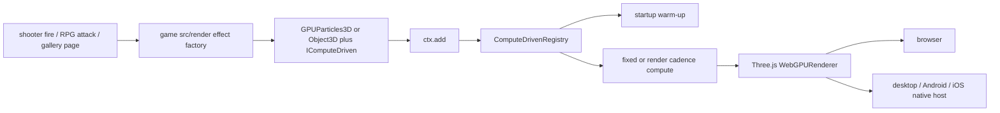

# PRD-316 — forty-six VFX are generated render source, not an engine inside the engine

**Status: PROPOSED, 2026-09-01.** Source artifact:
`/home/joao/Downloads/threenative-vfx-niagara-46-effects.zip`, SHA-256
`6554c40f862f0ab1b977417d1a01716f76dc3937a3ecb507bedfa230ab6cac0a`, 2.7 MiB.
The archive was inspected read-only at engine baseline `d6428f2e`; archive code has not been copied
into this repository.

**Complexity:** +3 touches 10+ files, +2 carries GPU particle lifecycle/state across frames, +2
crosses the example, scaffolder, playtest and native-proof surfaces = **7 → HIGH mode**. Run a
`prd-work-reviewer` checkpoint after every phase, including the integration audit and negative
controls from `prd-creator`.

**Decision:** do **not** add `@threenative/vfx`, do **not** import the archive's JSON asset schema,
compiler IR, module registry, CPU reference backend, WebGL2 backend or preset catalog, and do not
wrap TSL in a second rendering vocabulary. Absorb the useful result in three places:

1. Keep the portable mechanism on the public surfaces that already ship:
   `GPUParticles3D`, `IComputeDriven`, Three.js TSL, `ctx.add`, startup warm-up and scene disposal.
2. Port the 46 authored looks as ordinary TypeScript under a reference game's `src/render/`, then
   copy only effects with real gameplay callers into the relevant templates' `src/render/`.
3. Add a core abstraction only in a separate PRD if a real effect cannot be expressed portably
   with the current surface and the repeated plain-Three.js alternative wins the LOC kill switch.

This is an **engine capability intake**, not a package port. The current engine already owns the
portable compute lifecycle. The archive's valuable remainder is authored appearance and evidence.

## 1. Integration Ledger

`→impl` becomes a real non-test `file:line` during implementation. A test, registration row or
coverage declaration is not a caller.

| # | New thing | Live caller and reachability | Replaces or rejects | Negative control |
|---|---|---|---|---|
| 1 | 46-row donor/provenance coverage ledger | root `package.json` `budgets` command → `scripts/vfx-niagara-coverage.ts` | Archive reports/notices that cover 36 while code exports 46 | Delete one extra-donor row; `pnpm budgets` must fail with the missing effect id |
| 2 | `godotPortalVortex` direct TSL effect | `examples/vfx-gallery/src/scenes/Gallery.ts:→impl`, reached from the example's start scene | `VFXSystemAsset` → compiler → backend chain | Disable its update compute; the portal tile motion/occupancy gate must fail |
| 3 | Remaining 45 direct TypeScript effects | `Gallery.ts:→impl` builds every named effect and advances pages from one real scene | `createVFXPreset(id)` and `VFX_PRESET_CATALOG` | Remove one factory call; that named tile must be absent and the 46/46 gate red |
| 4 | Gallery visual/runtime gate | root `package.json` `test:vfx-gallery` → real browser build | Archive Python/Xvfb harness and self-reported counters | Force one known-visible tile's alpha to zero; its occupied-pixel assertion must fail |
| 5 | Shooter muzzle/impact effects | `templates/shooter/src/scenes/Play.ts:→impl` from existing fire and hit paths | `onFire: () => undefined` and hits with no visual feedback | Set burst count to zero; the fire/hit scenario must lose the labelled visible effect |
| 6 | Action-RPG attack/heal effects | `templates/action-rpg/src/scenes/Play.ts:→impl` from existing attack and Arcane Surge paths | attacks and surge with no VFX caller | Disconnect each event; the corresponding labelled capture must fail |
| 7 | Native compute/render parity scene | `runtime-native/conformance/registry.json:→impl`, run by `pnpm parity` | WebGL2-only evidence from the archive | Patch native entry to skip compute dispatch; browser/native comparison must fail |
| 8 | Four-target gallery proof | the same `vfx-gallery.playtest.json` run with `--target browser\|desktop\|android\|ios` | Browser-only gallery report | A target-specific no-dispatch mutation must fail on that target, not fall back to browser |

### Reachability



**Full user flow:** a gameplay event calls an effect object owned by `src/render/`; `ctx.add`
registers the existing compute lifecycle; the same TSL and Three.js surface renders on every
target; the playtest observes both the gameplay event and changed pixels.

**Incumbent census:**

- `packages/core/src/particles.ts` already owns sprite storage, renderer attachment, kernel warm-up,
  dispatch, restart and buffer disposal while requiring the game's material/start/process nodes.
- `packages/core/src/compute-driven.ts` already admits arbitrary game-owned mesh, ribbon, trail or
  other GPU simulations into the same lifecycle. It is public as `IComputeDriven`.
- `examples/abyss-framework/src/scenes/Abyss.ts` is a live 90,000-particle TSL consumer.
- Shooter already has exact fire, hitscan-hit, projectile-hit and radius-blast paths. Action-RPG
  already has attack and Arcane Surge paths. They are the callers; do not create demo-only events.
- The archive adds no runtime dependency. A new package would therefore violate the rule that a
  package exists only to isolate a dependency other packages must not inherit.

## 2. What the archive actually contains

The filename is correct; the archive's final report is stale.

| Source group | Code count | Archive documentation | Intake result |
|---|---:|---|---|
| `webgpu-vfx` parameter adaptations | 21 | Present in `provenance.json`, `THIRD_PARTY_NOTICES.md`, `PRESETS.md` | Verify upstream commit/license, then rewrite as game-owned TSL source |
| Effekseer EffectMaterials family recreations | 15 | Present in the same three files | Keep the “family recreation, not conversion” claim and verify CC0 source |
| Kenney / PixiJS / Godot extras | 10 | Present in `catalog.ts`; absent from provenance, notices and final report | **Uncleared until each source asset/parameter has pinned provenance and license evidence** |
| **Total** | **46** | Final report says 36 | Gate the code-derived count; never trust the prose total |

Archive implementation census:

| Archive area | Decision | Reason |
|---|---|---|
| `assets/`, `compiler/`, `modules/` | Reject | A serialized VFX format, IR and compiler are explicitly closed architecture |
| `runtime/fixedStep.ts`, `world.ts`, `instance.ts` | Reject | The engine already owns fixed step, scene lifecycle, warm-up and disposal |
| `backends/webgl2/` | Reject | ThreeNative's renderer is Three.js `WebGPURenderer`; a WebGL2 renderer/backend is the wrong seam and has no native proof |
| `backends/cpu/reference.ts` | Reject | It is a second implementation with no live product caller; tests cannot be its only consumer |
| `runtime/random.ts` | Reject duplicate | The live game receives seeded `ctx.random`; GPU effects use deterministic TSL hashes with explicit seed inputs |
| `budgets.ts` | Reject until measured | Capacity and GPU bytes are useful diagnostics, but a second VFX world is not; use existing frame/startup evidence first |
| sprite/ribbon/mesh rendering techniques | Re-express in game source | Geometry, material, texture, blend, curve and timing choose the screenshot |
| 46 effect recipes and procedural masks | Re-express in `src/render/` | They are appearance, not framework mechanism |

The upstream checks that must be pinned by commit during Phase 1 are
[`webgpu-vfx`](https://github.com/tigerabrodi/webgpu-vfx),
[`EffectMaterials`](https://github.com/effekseer/EffectMaterials),
[`Kenney Particle Pack`](https://kenney.nl/assets/particle-pack),
[`PixiJS particle-emitter`](https://github.com/pixijs-userland/particle-emitter), and
[`Godot VFX Library`](https://github.com/haowg/GODOT-VFX-LIBRARY). A repository-level license is
not evidence that a named visual/parameter was derived from that repository; each of the 46 rows
must name the donor file, commit, transformation and whether any pixels or binary assets were used.

## 3. Architecture and API decision

### Why there is no new package

The proposed package has zero dependencies beyond TypeScript/Three.js, both already in core. Its
separation would isolate concepts, not dependencies. That is not a package boundary here.

### Why there is no Niagara abstraction

The archive models appearance through strings such as `SpawnRate`, `CurlNoise`, `sprite`, `ribbon`,
`additive`, curve point arrays and texture ids. That is a smaller rendering language than TSL and
Three.js. It would force an agent to discover a bespoke vocabulary, and every unsupported look
would require an engine change. Direct generated TSL keeps the full Three.js surface editable.

### Existing mechanism to use

- Sprite effects use `GPUParticles3D` where its position/velocity buffers fit.
- Effects needing extra attributes allocate their own `instancedArray` buffers in `src/render/` and
  implement public `IComputeDriven` on an ordinary Three.js `Object3D`, `Sprite` or `InstancedMesh`.
- Burst counts, lifetimes, shapes, forces, curves, colours, textures, blend modes and cadence remain
  source constants in the game. They are not core options.
- `ctx.add` is mandatory so renderer attachment, warm-up, dispatch and cleanup stay automatic.
- Unsupported renderer/backend facts throw during construction; no effect silently downgrades.

### Core-change admission gate

This PRD authorizes **no new core export**. If the hardest real subject cannot be written with the
surface above, stop and file one narrow mechanism PRD. It must include:

1. the exact portable operation unavailable through Three.js/`IComputeDriven`;
2. at least three repetitions in one real game and the total plain-Three.js LOC;
3. an API where material, geometry, colour, texture, curves and timing all remain game-owned;
4. a native conformance case in the same change; and
5. deletion evidence showing the new core code breaks a pre-existing consumer when removed.

`VFXSystemAsset`, `CompiledVFXSystemIR`, `ModuleRegistry`, `VFXBackend`, `VFXWorld`,
`createVFXPreset` and a new package remain forbidden even if the gallery is difficult.

## 4. Execution phases

#### Phase 1: Make the intake count and provenance fail closed — every one of 46 names has an honest source row

**Proof subject:** all 46 exported catalog ids from the supplied archive, including the ten omitted
from its final report. This phase does not copy donor code or assets.

**Files (max 5):**

- `scripts/fixtures/vfx-niagara-46-effects.json` — NEW: effect id, donor file/commit, license,
  adaptation kind, target render source and implementation status.
- `scripts/vfx-niagara-coverage.ts` — NEW: parse/validate the fixture and render actionable gaps.
- `scripts/__tests__/vfx-niagara-coverage.spec.ts` — NEW: exact count, uniqueness, valid provenance,
  no unpinned URLs, and stale 36-count regression.
- `package.json` — EDIT: run the check from `budgets`, not an opt-in command.

**Implementation:**

- [ ] Derive the initial 46 ids from the archive code, not `FINAL_REPORT.md`.
- [ ] Pin every donor repository to a commit and record the exact source file/family inspected.
- [ ] For Kenney, PixiJS and Godot rows, prove the ten adaptations and their license scope; if a row
      cannot be proven, mark it `rejected` and replace its visual recipe independently rather than
      laundering it through an MIT repository label.
- [ ] Record `runtimeCodeCopied: false`, `binaryAssetCopied: false` only after source comparison.

**Wiring:** `package.json`'s existing `budgets` command invokes the validator. No manifest capability
entry is created for a visual recipe.

**Tests required:**

| Test | Assertion | Observed red required |
|---|---|---|
| `should account for exactly the 46 code-exported effects` | 21 + 15 + 10, unique ids | delete `godot-waterfall-mist` |
| `should reject unpinned or incomplete donor evidence` | commit, file, license and adaptation are required | remove one extra donor commit |
| `should not regress to the stale final-report total` | count 36 is explicitly rejected | substitute the report's first 36 rows |

**Revert check:** removing the validator from `budgets` makes `ci-structure.spec.ts` fail.

**User verification:** `pnpm budgets` names 46 accounted rows and zero unresolved provenance rows.

#### Phase 2: Prove the hardest real effect without an IR — the portal vortex renders from direct TSL

**Proof subject:** `godot-portal-vortex`, because it combines two emitters, a sprite ring, ribbons,
vortex motion, additive blending, curves and bounded lifetimes. A fire sprite is not an acceptable
substitute for this phase.

**Files (max 5):**

- `examples/vfx-gallery/package.json` — NEW: workspace example with normal dev/build/typecheck scripts.
- `examples/vfx-gallery/src/game.ts` — NEW: portable game entry and seeded start scene.
- `examples/vfx-gallery/src/scenes/Gallery.ts` — NEW: live scene caller and observable tile registry.
- `examples/vfx-gallery/src/render/portalVortex.ts` — NEW: direct TSL/Three.js implementation.
- `package.json` — EDIT: add `test:vfx-gallery` that builds and runs the real gallery scenario.

**Implementation:**

- [ ] Use `GPUParticles3D` for the sprite ring and a game-owned `IComputeDriven` object for ribbons.
- [ ] Keep every look choice in `portalVortex.ts`; import no effect schema/compiler/registry.
- [ ] Use seeded TSL hashing, fixed capacity and allocation-free dispatch after warm-up.
- [ ] Expose measured spawn commands and current GPU capacity through the gallery entity; do not
      manufacture `alive` counts without readback.

**Wiring:** `Gallery.enter` creates and `ctx.add`s the effect. The example's start scene is Gallery.

**Tests required:**

| Test | Assertion | Observed red required |
|---|---|---|
| portal visual occupancy | both ring and ribbon regions contain changed pixels | disable ribbon compute, then ring compute |
| deterministic restart | same seed/tick capture stays within the visual threshold | change the seed on restart |
| lifecycle | removing the scene stops dispatch and disposes owned buffers | omit `detach` for one buffer |

**Revert check:** deleting `portalVortex.ts` breaks the pre-existing root `test:vfx-gallery` path and
the Gallery start scene.

**User verification:** open the captured portal frame; both rotating ring and moving ribbons are
visible after a deterministic number of ticks.

#### Phase 3: Complete the 46-effect reference gallery — every archived look has direct source and a real caller

**Files (max 5):**

- `examples/vfx-gallery/src/render/fireSmokeWeather.ts` — NEW: fire, smoke and weather group.
- `examples/vfx-gallery/src/render/combat.ts` — NEW: impact, projectile and burst group.
- `examples/vfx-gallery/src/render/magic.ts` — NEW: Effekseer and other magic/elemental group.
- `examples/vfx-gallery/src/render/extras.ts` — NEW: cleared or independently recreated extra donors.
- `examples/vfx-gallery/src/scenes/Gallery.ts` — EDIT: invokes all 46 by named page/tile.

**Implementation:**

- [ ] Write direct effect factories, not a generic module interpreter or string-keyed preset API.
- [ ] Preserve meaningful multi-emitter composition; one generic particle cloud recoloured 46 times
      does not satisfy this phase.
- [ ] Share only source-local maths whose deletion demonstrably increases total gallery LOC.
- [ ] Update Phase 1 rows from `planned` to the exact source function and caller.

**Wiring:** every effect function has one non-test call in `Gallery.ts`; every page is reachable from
the start scene without a query-string-only back door.

**Tests required:** caller census for 46/46; deliberate missing caller fails; tile capture verifies
non-empty, distinguishable output; CPU/frame allocation probe stays flat after warm-up.

**Revert check:** remove any one effect call and the coverage/gallery gate names that id.

**User verification:** cycle all gallery pages; each tile is labelled and visually distinct from
the empty-cell baseline.

#### Phase 4: Replace the archive harness with engine-native evidence — 46/46 means rendered, not enumerated

**Files (max 5):**

- `examples/vfx-gallery/playtests/vfx-gallery.playtest.json` — NEW: deterministic page/tick/capture flow.
- `scripts/vfx-gallery-visual.ts` — NEW: per-tile occupancy, difference and repeatability metrics.
- `scripts/__tests__/vfx-gallery-visual.spec.ts` — NEW: fail-closed parser and metric tests.
- `examples/vfx-gallery/src/scenes/Gallery.ts` — EDIT: publish applied page/effect ids and burst commands.
- `package.json` — EDIT: wire the visual gate into `test:vfx-gallery`.

**Implementation:**

- [ ] Require a real WebGPU adapter identity; software runs may prove correctness, never performance.
- [ ] Measure pixels inside each tile after the named burst/update window; no screenshot-global
      non-blank assertion may stand in for 46 effects.
- [ ] Assert 46 unique applied ids, 46 evaluated tile metrics and zero missing observations.
- [ ] Keep raw captures and report in `artifacts/`; durable verdict goes to `docs/verification/`.

**Negative controls:** alpha zero, missing tile, misspelled assertion kind, stale capture deletion,
and identical baseline/candidate paths must each be observed red.

**User verification:** `pnpm test:vfx-gallery` reports `46 evaluated, 46 visible, 0 missing` and the
adapter name; it must not claim a performance result on SwiftShader.

#### Phase 5: Give the shooter real event-driven feedback — firing and impact visibly call generated source

**Files (max 5):**

- `packages/create-threenative/templates/shooter/src/render/vfx.ts` — NEW: authored muzzle flash,
  impact spark and impact dust implementations with no preset schema.
- `packages/create-threenative/templates/shooter/src/scenes/Play.ts` — EDIT: fire/hit callers.
- `packages/create-threenative/templates/shooter/playtests/combat.playtest.json` — EDIT: labelled fire
  and hit captures/assertions.
- `packages/create-threenative/templates/shooter/AGENTS.md` — EDIT: discoverable VFX ownership/use.
- `packages/create-threenative/templates/shooter/CLAUDE.md` — GENERATED by `pnpm sync:agents`.

**Implementation:**

- [ ] Muzzle flash follows the real muzzle transform; impact effects use the real hit point/normal.
- [ ] Pool/restart the effects; steady firing allocates no new GPU buffers after warm-up.
- [ ] Keep values and appearance in `vfx.ts`, not core options.

**Wiring:** existing `fireHitscan`, `resolveHitscanImpact` and projectile hit paths call the effects.
The old `onFire: () => undefined` path is removed or delegates to the same VFX owner.

**Negative controls:** zero burst, wrong hit point and disconnected fire event each fail a named
gameplay-plus-pixel assertion.

**User verification:** scaffold shooter, press F, and see a muzzle flash followed by an effect at
the measured collision point without changing hit/damage behavior.

#### Phase 6: Give the action RPG event-driven magic — attacks and Arcane Surge visibly call generated source

**Files (max 5):**

- `packages/create-threenative/templates/action-rpg/src/render/vfx.ts` — NEW: authored attack arc,
  hit and Arcane Surge effects.
- `packages/create-threenative/templates/action-rpg/src/scenes/Play.ts` — EDIT: existing event callers.
- `packages/create-threenative/templates/action-rpg/playtests/combat.playtest.json` — EDIT: labelled
  attack/surge visual assertions.
- `packages/create-threenative/templates/action-rpg/AGENTS.md` — EDIT: discoverable VFX ownership/use.
- `packages/create-threenative/templates/action-rpg/CLAUDE.md` — GENERATED by `pnpm sync:agents`.

**Wiring:** the existing attack and Arcane Surge branches trigger the render-owned objects. Damage,
range and cooldown remain gameplay-owned and unchanged.

**Negative controls:** disconnect attack or surge; the corresponding event can still occur, but its
pixel assertion must fail, proving the gate measures integration rather than gameplay alone.

**User verification:** scaffold action-RPG; Space/F shows an attack/hit effect and E shows Arcane
Surge at the player while the same combat assertions remain green.

#### Phase 7: Prove the mechanism crosses the native seam — one shared scene renders on all four targets

**Files (max 5):**

- `packages/runtime-native/conformance/scenes/shared/vfx-compute.js` — NEW: sprite, ribbon and
  instanced-mesh particle mechanisms using the same TSL source on both arms.
- `packages/runtime-native/conformance/registry.json` — EDIT: required VFX compute row.
- `packages/runtime-native/conformance/baselines/vfx-compute.json` — NEW: measured tolerance inputs,
  never a copied candidate result.
- `examples/vfx-gallery/playtests/vfx-gallery.playtest.json` — EDIT: target-neutral observations.
- `docs/verification/prd-316-vfx-native-2026-09-01.md` — NEW: commands, adapters/devices, raw results
  and explicitly unexecuted targets.

**Implementation:**

- [ ] Run browser reference and native desktop conformance for sprite/ribbon/mesh compute.
- [ ] Run the same gallery scenario on browser, desktop, physical Android and iOS simulator.
- [ ] Record physical iOS as unverified unless actually executed; do not translate simulator proof.
- [ ] Use device doctor/preflight before Android performance claims and name the exact package id.

**Negative controls:** skip native compute dispatch, patch one native seed, and run one scenario with
a false expected value. Each target must fail locally with no browser fallback.

**User verification:** the evidence file lists each target separately; every executed target shows
46 applied effects and non-empty per-page output. The PRD remains open for any required target not
executed.

#### Phase 8: Apply the kill switch and close — only integrated, cheaper mechanism survives

**Files (max 5):**

- `scripts/vfx-niagara-coverage.ts` — EDIT: require final live callers/evidence, zero `planned` rows.
- `scripts/__tests__/vfx-niagara-coverage.spec.ts` — EDIT: caller and evidence completeness.
- `packages/core/src/index.ts` — EDIT only if capability wording must name ribbon/mesh particle
  authoring through `IComputeDriven`; add no new export.
- `docs/PRDs/feature-mining/README.md` — EDIT: link the completed intake result.
- `docs/verification/prd-316-closeout-2026-09-01.md` — NEW: LOC, performance, caller census and reds.

**Implementation:**

- [ ] Run `pnpm tsx scripts/count-loc.ts` against the direct gallery/template source and any shared
      helper. Delete a helper that costs more than its repetitions.
- [ ] Grep every new exported symbol; expected count is zero unless a separately approved core PRD
      landed first.
- [ ] Verify no `VFXSystemAsset`, compiler, module registry, backend interface or preset catalog was
      introduced anywhere under `packages/`.
- [ ] Fill every integration-ledger line with real non-test callers and recorded red controls.

**User verification:** deleting the gallery effect source breaks the gallery gate; deleting shooter
or RPG VFX breaks their existing gameplay scenarios; deleting only the archive changes nothing,
proving the archive is input evidence rather than a runtime dependency.

## 5. Verification commands

Run phase-local tests first. Before completion, run and paste exact output into the evidence files:

```sh
pnpm test:vfx-gallery
pnpm test:templates
pnpm parity
pnpm typecheck && pnpm lint && pnpm test
pnpm budgets
pnpm quality
pnpm sync:agents && git diff --exit-code -- 'packages/create-threenative/templates/*/CLAUDE.md'
```

Native target commands use the built playtest CLI and the one scenario from Phase 4. Record the
actual executable/device arguments in evidence; placeholders are not a gate result.

Performance acceptance is relative to the current engine path, not the archive's SwiftShader
numbers. At steady state after warm-up:

- no per-frame JavaScript particle loop;
- no `readPixels`/synchronous readback in the production effect path;
- no new GPU buffer allocation while repeating shooter/RPG effects;
- gallery capacity remains bounded through the full scenario; and
- the template's existing platform frame budget does not regress beyond its asserted threshold.

## 6. Acceptance criteria

- [ ] **AC1 — honest census.** The gated intake has exactly 46 unique rows: 21 webgpu-vfx, 15
      Effekseer and 10 cleared-or-independently-recreated extras. The stale 36 count fails.
- [ ] **AC2 — no engine inside the engine.** No new package, serialized asset format, compiler IR,
      module registry, backend interface or package preset catalog lands.
- [ ] **AC3 — hardest subject first.** The direct-TSL portal vortex renders its ring and ribbons
      before simpler effects are accepted.
- [ ] **AC4 — 46 real callers.** Every gallery effect has a non-test caller and an evaluated visual
      tile. Removing any one names the missing id and fails.
- [ ] **AC5 — appearance stays editable.** Material, geometry, texture, colour, blend, curves,
      timing and capacity live under game/template `src/render/`, never package code.
- [ ] **AC6 — real template integration.** Shooter fire/hit and action-RPG attack/surge paths invoke
      the generated source; their existing playtests prove the user-visible result.
- [ ] **AC7 — portable mechanism.** Shared sprite, ribbon and mesh compute runs through Three.js
      WebGPURenderer on browser, desktop, physical Android and iOS simulator. Physical iOS is
      reported separately and never inferred.
- [ ] **AC8 — evidence is not self-report.** Per-effect pixels and applied gameplay events agree;
      zero-alpha, no-dispatch, stale-artifact and wrong-assertion controls were observed red.
- [ ] **AC9 — bounded performance.** No per-particle JavaScript loop, synchronous GPU readback or
      steady-state buffer allocation exists, and existing template frame gates remain green.
- [ ] **AC10 — kill switch.** Every shared helper beats direct Three.js across all repetitions;
      losing helpers are deleted before completion.
- [ ] **AC11 — discoverable.** Template AGENTS files state that VFX appearance lives in
      `src/render/vfx.ts`, uses `GPUParticles3D`/`IComputeDriven`, and must be added through `ctx.add`.
- [ ] **AC12 — integration complete.** The ledger has zero `TBD`/`→impl`, every new gate has a
      recorded red, and deleting the new source breaks a pre-existing live flow.

## 7. Out of scope

- A Niagara editor, node graph, serialized scene/effect format or hot-reload inspector.
- Loading `.efkefc`, Godot `.tscn`, Pixi configs or donor preset files at runtime.
- WebGL2 compatibility and CPU particle simulation.
- Claiming bit-identical donor visuals; the output is a source-guided adaptation or independent
  recreation, with provenance saying which.
- Shipping 46 frozen looks as package exports. The gallery is a reference and proof; templates
  receive only effects their existing gameplay actually calls.

## 8. Completion rule

This PRD is not complete when a library compiles or a gallery lists 46 names. It is complete when
real shooter/RPG events render game-owned effects, the 46 reference effects are visibly exercised,
the shared mechanism crosses the native seam, and removing the new source breaks those live flows.
Move it to `docs/PRDs/done/` only with all boxes checked and all target claims backed by a durable
verification record.
