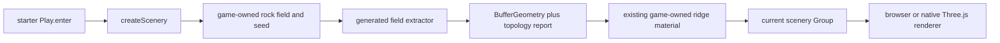

# PRD-317 — watertight rock masses are generated render source, not a geology API

**Status: PROPOSED, 2026-09-01.** Evaluated against engine `HEAD` and
[`maxliebscher/threejs-procedural-rocks-cliffs`](https://github.com/maxliebscher/threejs-procedural-rocks-cliffs)
at `647839c884456a4d1b6a1a7d520cbce331794538` (MIT). No upstream code or assets have been copied.

**Complexity:** +3 touches more than 10 files, +2 introduces a renderer-independent extraction
module in generated source, +2 coordinates progressive Worker replacement, +2 crosses the
scaffolder, playtest and native-proof surfaces = **9 → HIGH mode**. Run a `prd-work-reviewer`
checkpoint after every implementation phase, including the integration audit and negative controls
required by `prd-creator`.

**Decision: useful, with a narrow intake.** Mine the upstream repository's watertight extraction
invariants, topology audit, terrain contact and progressive replacement into the starter's ordinary
generated `src/render/` source. Do **not** add `Rock3D`, `Cliff3D`, geology presets, a landscaping
planner, a material catalog, a scene format or a core export. The game must continue to own the
scalar field, seed, shape, placement, material and quality tiers.

The first consumer is the default starter's existing scenery path. Its nine rounded horizon boxes
and four midground block spires become one deterministic fused ridge plus separate debris where
separate debris is structurally correct. Gameplay and collision stay unchanged because this file is
explicitly the non-collidable backdrop.

## 1. Integration Ledger

`→impl` becomes a real non-test `file:line` during implementation. A row still containing it at a
phase boundary fails that phase.

| # | New thing | Live caller and reachability | Replaces or rejects | Negative control |
|---|---|---|---|---|
| 1 | Renderer-independent field extraction in generated `src/render/` source | `templates/starter/src/render/scenery.ts:→impl`, called by `Play.enter` | Upstream `landscaping-field.js` is adapted, not exposed as an engine API | Restore independent block meshes; connected-component and silhouette gates fail |
| 2 | Game-owned granite ridge field | `createScenery(...):→impl` samples it with the existing fixed seed | Nine block ridges and four block spires at `scenery.ts:57-80` | Replace the field with a box SDF; the reference-view shape score fails |
| 3 | Topology report | The live ridge construction reads the report before attaching geometry | Upstream's `geometry.userData.audit`; no self-reported success literal | Duplicate one seam vertex; boundary-edge assertion fails |
| 4 | Preview-to-refined replacement | `Play.enter` attaches the scenery controller; its Worker result atomically replaces Preview | Upstream main-thread refinement | Delay generation A beyond B; stale A must never become visible |
| 5 | Updated starter visual scenario | Existing `starter-look` scenario drives the real scaffold and observes the ridge | Its current whole-frame nonblank check, which a block ridge satisfies | Restore the nine blocks; named ridge-region assertion fails |
| 6 | Generated-project authoring instruction | Starter `AGENTS.md` tells the game's agent where field, material and quality choices live | Vendoring the upstream Codex skill as an undiscoverable extra skill | Delete the instruction; template-doc test fails |
| 7 | Cross-target proof | The same generated starter source runs on browser and packed Linux desktop | Upstream WebGL2-only demo evidence | A target branch or missing Worker dispatch fails same-hash/topology proof |

### Reachability



**Full flow:** the existing start scene creates scenery with its existing deterministic random
source; generated render code builds a cheap preview, refines the same field off the main thread,
rejects stale work and swaps one closed geometry into the already-attached scenery group. The
player sees a fused ridge in the same start scene. No menu, opt-in flag or new engine vocabulary is
introduced.

**What this replaces:** only `templates/starter/src/render/scenery.ts:57-80`, the non-collidable
horizon and midground block loops. The three structural columns at `:42-50`, every gameplay body,
and the platformer template's collision-shaped `rockBox` are out of scope.

## 2. Context and incumbent census

**Problem:** the default scaffold can draw deterministic scenery but its rock horizon is a row of
rounded boxes; agents have no shipped example of a fused, closed natural mass or of checking that
generated topology is valid.

**Files analyzed:**

- `packages/create-threenative/capabilities.json`
- `packages/core/src/world.ts` and `packages/core/src/world-tiles.ts`
- `packages/create-threenative/templates/starter/src/render/scenery.ts`
- `packages/create-threenative/templates/starter/src/scenes/Play.ts`
- `packages/create-threenative/templates/platformer/src/render/palette.ts`
- `examples/quarry/src/quarry/bodies.ts`
- upstream `src/landscaping-{field,planner,compiler,materials}.js` and `tests/topology-smoke.mjs`

**Current behavior:**

- `Heightfield` and `TerrainTiles` cover sampled height terrain, queries, collision and residency;
  they do not extract a closed 3D implicit surface.
- Starter scenery is generated, deterministic and correctly game-owned, but its ridge is nine
  separate blocks and its spires are four more blocks.
- Platformer `rockBox` is coupled to box collision and must not gain a bumpy render/collider mismatch.
- Quarry deliberately generates a dense benchmark subject; changing its topology would invalidate
  its measurement baselines, so it is an oracle only, never the adoption caller.
- No capability-manifest entry matches a watertight implicit rock or cliff mass.

### What the upstream repository contributes

| Upstream area at `647839c` | Intake | Reason |
|---|---|---|
| `landscaping-field.js:198-274` shared-edge Marching Tetrahedra | **Adapt into generated source** | Consistent tetrahedra, cached lattice edges and gradient winding directly enforce one connected surface |
| `landscaping-field.js:279-354` smoothing/sliver collapse | **Adapt only if Phase 0 proves it** | Mechanism, but each pass must preserve the topology report and frame/build budgets |
| `landscaping-field.js:362-510` custom QEM reducer | **Do not port initially** | The asset pipeline already owns measured simplification; a second reducer is 149 lines of risk and is not needed for the first bounded ridge |
| `landscaping-field.js:516-548` topology audit | **Adapt and strengthen** | Boundary edges, degenerates, winding and signed volume are executable evidence, not a look |
| `landscaping-planner.js` | **Mine terrain-contact ideas only** | Its rockfield/cliff presets, density, burial and semantic members choose the scene and belong to this game |
| `landscaping-compiler.js:26-137` granite/sandstone/limestone grammars | **Rewrite one granite grammar in game source** | Geological form is appearance; no preset catalog or string vocabulary enters the engine |
| `landscaping-compiler.js:142-198` bounded lattice construction | **Adapt** | Fail-closed lattice caps and explicit cell size are required to make generation budgetable |
| `landscaping-materials.js` | **Reject** | `ShaderMaterial`, `onBeforeCompile`, textures, triplanar scale and strata decide the look and target the upstream WebGL path; starter keeps its own material |
| Upstream editor and UI | **Reject** | ThreeNative has no editor or scene format, and this repository must not grow one by intake |
| Upstream Codex skill | **Mine its concise invariants into starter `AGENTS.md`** | The template instruction is discoverable to every generated game's agent; silently vendoring a second skill is not |

The source is useful because the closed-surface invariants are concrete and tested. It is not
evidence that the complete 1,975-line planner/compiler/material stack belongs in the framework.

## 3. Ownership and API decision

### No new framework API

The source uses ordinary JavaScript plus Three.js and requires no browser-only renderer API,
platform seam or dependency that a game must not inherit. The game's appearance can only be changed
by editing its footprint, field, seed, geometry resolution or material. Moving any of those choices
behind `@threenative/core` would make the engine own the look and would teach a bespoke geology
vocabulary.

There is therefore no `ImplicitSurfaceGeometry` export in this PRD. The generated helper may use
that Three-shaped local name, but it stays under `templates/starter/src/render/` and is copied into
the user's project as editable source. `capabilities.json` is not extended: it is the public engine
surface, not a catalog of one template's authored visuals.

### Core admission gate for later work

If a later real game repeats the exact renderer-independent extraction, file a separate PRD only
after all of these are measured:

1. two non-template games each carry at least 150 identical code lines of extraction/audit;
2. the shared helper is shorter than the deleted copies under `scripts/count-loc.ts`;
3. every shape, material, seed, resolution, smoothing and timing input remains required game data;
4. a pre-existing non-test caller breaks when the proposed export is removed; and
5. browser and native desktop consume the same source and topology hash.

Until then, an engine export would be an orphan abstraction built from one visual example.

### Data and error contract

The local extractor receives explicit finite bounds, cell size, lattice cap and a game-owned scalar
sampler. It returns positions, indices and a report:

```ts
interface IImplicitSurfaceReport {
  readonly boundaryEdges: number;
  readonly degenerateTriangles: number;
  readonly windingConflicts: number;
  readonly signedVolume: number;
  readonly triangles: number;
  readonly vertices: number;
  readonly cellSize: number;
  readonly buildMs: number;
}
```

Malformed bounds, non-finite samples, empty surfaces, lattice overflow, invalid indices and a
closed surface with any topology defect throw named errors. Choosing an open boundary may suppress
the closed-surface throw, but never suppresses measurement; this starter uses closed mode.

## 4. Execution phases

### Phase 0 — prove the intake beats the current blocks before copying source

**User-visible outcome:** a recorded A/B establishes whether the fused ridge materially improves
the default starter without breaking startup or steady-state budgets. Failure closes this PRD as
DECLINED with no product code.

**Files (max 5):**

- `docs/PRDs/feature-mining/PRD-317-watertight-rock-masses-are-generated-render-source.md` — EDIT: pin measurements and the exact accepted upstream ranges.
- `docs/PRDs/feature-mining/README.md` — EDIT: record the measured verdict.
- `docs/verification/prd-317-rock-ridge-admission-2026-09-01.md` — NEW: commands, captures, timings, topology and source counts.
- `packages/create-threenative/templates/starter/src/render/scenery.ts` — EDIT TEMPORARILY: local challenger used only for the A/B; revert if declined.
- `packages/create-threenative/templates/starter/playtests/look.playtest.json` — EDIT: add a ridge-region observation that is red on the current blocks.

**Implementation:**

- [ ] Capture current `starter-look` at the fixed viewport and seed; record ridge-region connected
      components, silhouette edge variation, draw calls, triangles, startup time and steady-state FPS.
- [ ] Build the hardest real subject first: the full fused horizon ridge, terrain contact included.
      An isolated boulder or one SDF sphere cannot satisfy this phase.
- [ ] Count adapted source separately from geology/look source. Record all copied or rewritten
      upstream ranges and preserve the MIT notice if substantial source survives.
- [ ] Accept only if a blinded comparison chooses the challenger, topology is closed, and measured
      startup/steady-state thresholds derived below pass on the actual browser run.

**Wiring:** the challenger temporarily replaces the existing ridge loop in the same `createScenery`
call reached by `Play.enter`; no demo-only route is allowed.

**Tests and negative controls:**

| Gate | Pass condition | Observed red required |
|---|---|---|
| Ridge topology | `boundaryEdges=0`, degenerates/winding conflicts `=0`, positive non-trivial volume | duplicate a seam vertex |
| Fused mass | one main connected component; debris excluded from this count | restore independent blocks |
| Determinism | same seed produces byte-identical position/index hashes | change one seed input |
| Visual improvement | blinded A/B prefers challenger; ridge silhouette differs beyond a recorded floor | substitute box SDF |
| Budget | preview/startup and steady-state remain within thresholds derived from the control run | force showcase cell size on the startup path |

**Revert check:** the strengthened pre-existing `starter-look` scenario must fail when the current
block loop is restored. If it remains green, the gate does not measure this feature.

**Checkpoint:** automated reviewer plus manual inspection of both fixed-camera captures. Do not
continue until both pass.

### Phase 1 — ship one closed fused ridge from ordinary generated source

**User-visible outcome:** a freshly scaffolded starter shows a deterministic fused stone horizon
instead of nine disconnected boxes, with no new engine API.

**Files (max 5):**

- `packages/create-threenative/templates/starter/src/render/implicitSurface.ts` — NEW: bounded lattice, shared-edge extraction and fail-closed report; under the existing 200-line render-source smell cap.
- `packages/create-threenative/templates/starter/src/render/rockRidge.ts` — NEW: game-owned field, footprint, seed, bounds and Preview settings.
- `packages/create-threenative/templates/starter/src/render/scenery.ts` — EDIT: delete the ridge/spire block loops and attach the fused ridge.
- `packages/create-threenative/__tests__/looks.spec.ts` — EDIT: enforce framework-free ownership, deterministic inputs and a live `scenery.ts` caller.
- `packages/create-threenative/templates/starter/playtests/look.playtest.json` — EDIT: retain the Phase 0 ridge-region assertion.

**Implementation:**

- [ ] Adapt only the accepted extraction/audit ranges, as strict TypeScript ESM with `.js` imports.
- [ ] Require all field and look inputs from `rockRidge.ts`; the extractor contains no rock, cliff,
      granite, colour, material or quality default.
- [ ] Reuse the existing `ridgeMaterial` supplied to `createScenery`; do not port upstream shaders.
- [ ] Keep the three structural columns unchanged and keep all new scenery non-collidable.
- [ ] Attach the report to the returned controller and emit measured values through the existing
      playtest entity/state path; do not emit a literal `watertight: true`.

**Wiring:** `scenery.ts` imports and invokes `rockRidge`; `Play.ts:140` remains the pre-existing
entry point. The old horizon and midground loops are deleted in this phase.

**Tests required:**

| Test | Assertion | Observed red required |
|---|---|---|
| `should extract one closed ridge from the starter field` | report contains zero topology defects and positive volume | disable the protected outer shell |
| `should reject malformed or empty fields` | named errors for NaN, overflow and no triangles | return empty arrays |
| `should keep the ridge game-owned` | no `@threenative/` import and no material construction in extractor | add a core import or colour literal |
| `starter-look` | real scene shows the connected ridge in the named region | restore old block loop |

**Revert check:** delete `implicitSurface.ts`; the pre-existing starter build and `starter-look`
flow fail because live `scenery.ts` imports it.

**User verification:** scaffold starter, run its existing look scenario, and open the before/after
capture at 1280×720.

### Phase 2 — refinement cannot freeze input or let stale work win

**User-visible outcome:** the existing Preview scenery remains visible while a higher-quality ridge
build completes off-thread and replaces it atomically; movement continues during the build.

**Files (max 5):**

- `packages/create-threenative/templates/starter/src/render/rockRidge.worker.ts` — NEW: renderer-independent extraction entry that returns transferable arrays and the measured report.
- `packages/create-threenative/templates/starter/src/render/rockRidge.ts` — EDIT: generation token, Preview/refined settings, atomic swap and disposal.
- `packages/create-threenative/templates/starter/src/scenes/Play.ts` — EDIT: retains the scenery controller and disposes it from `exit`.
- `packages/create-threenative/templates/starter/playtests/look.playtest.json` — EDIT: movement and refinement-complete observations occur in the same run.
- `packages/create-threenative/__tests__/template.spec.ts` — EDIT: source-level Worker wiring, disposal and no browser-only fallback branch.

**Implementation:**

- [ ] Build Preview synchronously only if Phase 0 measured it inside the startup budget; otherwise
      keep the existing cheap blocks as a temporary placeholder until the first Worker result.
- [ ] Transfer typed-array buffers; never structured-clone per-vertex objects.
- [ ] Increment a generation token for rebuild/dispose; discard and dispose every stale result.
- [ ] Swap only after `BufferGeometry` attributes, normals and bounds are complete; dispose the old
      geometry after the new mesh is attached.
- [ ] Throw a named error if Worker construction/execution fails. Do not silently run Showcase on
      the main thread.

**Wiring:** `Play.enter` stores the already-attached scenery controller and starts work; `Play.exit`
disposes it and clears the reference. Registration without both live calls does not pass.

**Tests required:**

| Test | Assertion | Observed red required |
|---|---|---|
| stale result | delayed generation A cannot replace completed generation B | remove token comparison |
| atomic swap | one visible ridge exists before and after replacement | detach Preview before result |
| disposal | old/stale geometries and Worker terminate once | omit one disposal call |
| responsive play | player covers the existing minimum distance while refinement is pending | run refinement synchronously |

**Revert check:** removing Worker dispatch makes the strengthened existing look/movement flow fail
its refinement-complete or responsiveness observation.

### Phase 3 — the generated agent can find and safely change the recipe

**User-visible outcome:** a cold agent opening a scaffold knows which source changes geology and how
to verify topology without discovering a new engine vocabulary.

**Files (max 5):**

- `packages/create-threenative/templates/starter/AGENTS.md` — EDIT: describe field ownership, closed-surface report and Preview/refine rule.
- `packages/create-threenative/templates/starter/CLAUDE.md` — GENERATED by `pnpm sync:agents`.
- `packages/create-threenative/__tests__/looks.spec.ts` — EDIT: assert the instruction and its generated mirror.
- `packages/create-threenative/templates/starter/src/render/rockRidge.ts` — EDIT: final comments name the game-owned controls and no engine API.
- `docs/verification/prd-317-rock-ridge-authoring-2026-09-01.md` — NEW: cold-agent change and proof record.

**Implementation:**

- [ ] Tell agents: fused/intersecting natural masses use one implicit field; separate debris may be
      instanced; never hide holes with `DoubleSide` or a normal map.
- [ ] Name `rockRidge.ts` as the shape/look owner and `implicitSurface.ts` as local generated source.
- [ ] Require topology checks after changing bounds, field or resolution and visual checks across
      three seeds and the fixed starter camera.
- [ ] Run `pnpm sync:agents`; never hand-edit the generated mirror.

**Wiring:** the instruction names the exact live source imported by `scenery.ts`, not an upstream URL
or optional skill a generated project does not contain.

**Negative control:** delete the rock-ridge paragraph from `AGENTS.md`; `looks.spec.ts` must fail.

### Phase 4 — prove the same authored source on web and native desktop

**User-visible outcome:** a clean scaffold renders the same closed ridge and remains responsive on
browser WebGPU and packed Linux desktop native.

**Files (max 5):**

- `packages/create-threenative/templates/starter/native-playtests/render-chain.playtest.json` — EDIT: add measured ridge topology/hash/visibility observations to the existing native route.
- `packages/create-threenative/templates/starter/playtests/look.playtest.json` — EDIT: share the same observation names and thresholds.
- `packages/create-threenative/__tests__/scaffold.spec.ts` — EDIT: update the intentional starter tree hash and document why.
- `docs/verification/prd-317-rock-ridge-cross-target-2026-09-01.md` — NEW: exact commands, adapter/target identity, reports and captures.
- `docs/PRDs/feature-mining/PRD-317-watertight-rock-masses-are-generated-render-source.md` — EDIT: fill ledger lines and evidence.

**Implementation and proof:**

- [ ] Scaffold from freshly packed local tarballs; no workspace resolution may satisfy the proof.
- [ ] Run `starter-look` with `--browser-recipe webgpu`; record the named adapter.
- [ ] Run the existing starter native scenario with `--target desktop`; record the executable and
      prove that the observation came from native rather than a browser fallback.
- [ ] Compare topology counts and deterministic position/index hashes across targets; screenshots
      may use a visual threshold but data identity is exact.
- [ ] Report Android and iOS as `UNVERIFIED` unless those targets actually execute.

**Negative control:** skip Worker dispatch in the native bundle only; the native ridge completion
and hash observation must fail while the browser still passes.

**Revert check:** remove `rockRidge.ts`; both existing starter entry builds fail at their live caller.

## 5. Verification commands

```sh
pnpm exec vitest run packages/create-threenative/__tests__/looks.spec.ts \
  packages/create-threenative/__tests__/template.spec.ts
pnpm --filter @threenative/create-threenative build
pnpm test:templates
pnpm typecheck && pnpm lint && pnpm test
pnpm budgets
pnpm sync:agents --check
```

For the runtime proof, use the playtest runner commands documented in this repository at execution
time. Record the exact generated-project path, server command, adapter, target and artifact paths in
`docs/verification/`; do not paste a command here until its executable flags have been verified.

Every recorded pass must include its observed mutation red. A green full suite without the named
negative control remains **UNVERIFIED**.

## 6. Acceptance criteria

- [ ] **AC1 — the player sees a fused natural mass.** The default starter's live start scene renders
      one connected ridge where the block horizon used to be, and a blinded fixed-camera A/B prefers
      it over the incumbent.
- [ ] **AC2 — topology is measured, not asserted by label.** Three fixed seeds each report zero
      boundary edges, zero degenerate triangles, zero winding conflicts and positive non-trivial
      signed volume; every report is computed from the final attached indices/positions.
- [ ] **AC3 — terrain contact survives.** No background-colored gap appears between ridge and its
      authored ground/contact band in the fixed grazing and distance views.
- [ ] **AC4 — deterministic rebuild.** Same seed/settings yield byte-identical position and index
      hashes; changing the seed changes the silhouette beyond the recorded floor without changing
      topology validity.
- [ ] **AC5 — input stays responsive.** Existing starter movement succeeds while refinement is
      pending; the main-thread mutation fails it.
- [ ] **AC6 — stale work cannot win.** A deliberately delayed older generation is discarded,
      measured by the generation id attached to the visible result.
- [ ] **AC7 — the look remains game-owned.** All new runtime source lives in generated `src/render/`,
      imports no `@threenative/*`, constructs no hidden default material and adds no package export,
      config key, preset catalog or capability-manifest entry.
- [ ] **AC8 — the incumbent is gone.** The nine ridge blocks and four spire blocks are deleted from
      `scenery.ts`; there are not two live scenery implementations.
- [ ] **AC9 — source stays teachable.** Each generated render file remains under the existing
      200-line smell cap; `AGENTS.md` names the shape owner, audit and Preview/refine rule; its mirror
      is generated.
- [ ] **AC10 — real integration.** Removing the new render source breaks the pre-existing starter
      build and look flow at the live `Play.enter → createScenery` path.
- [ ] **AC11 — web and native desktop.** Clean-install browser WebGPU and packed Linux desktop run
      the same authored source and return exact topology/hash identity. Mobile targets are named
      `UNVERIFIED` unless executed.
- [ ] **AC12 — all gates are honest.** Integration Ledger has zero placeholders, every acceptance
      gate has its recorded red, all phase reviewers pass, and the verification files contain raw
      output rather than summaries.

## 7. Decline conditions

Close this PRD as **DECLINED with no product code** in Phase 0 if any one is true:

- the current block ridge passes the strengthened fused-mass or silhouette gate;
- the challenger is not preferred in the blinded fixed-camera comparison;
- Preview/refinement cannot meet measured startup and input budgets on the real starter;
- the protected-boundary pipeline still produces a topology defect on any required seed;
- the adapted source cannot stay renderer-independent and framework-free; or
- a framework export becomes necessary before a second real consumer exists.

The upstream repository remains a useful technical reference even if the starter adoption is
declined. A useful reference is not automatically a useful engine surface.
