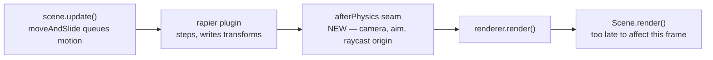

# PRD-325 — three sandbox games hand-wrote the same three seams

**Status: PROPOSED, 2026-09-01.** Mined read-only from three sandbox games at engine baseline
`b28cf543`:

| Game | Path | src LOC |
| --- | --- | --- |
| lumen-hall | `sandbox/lumen-hall/` | 7,452 |
| bayview | `sandbox/prd259-bayview-current-20260830/` | 13,406 |
| wildwood | `sandbox/wildwood/` | 6,680 |

**Goal: a game stops writing the three things it structurally cannot write correctly — where in
the frame it may read a solved body, how the world it drew becomes the world that stops it, and
whether one point can see another without paying for a raycast.**

**Complexity:** +2 for 6–10 files, +2 for a new core/physics module with cross-frame ordering
semantics, +2 for multi-package changes (core, physics, templates), +1 for a native lane =
**7 → HIGH mode.** Run a `prd-work-reviewer` checkpoint after every phase.

## 1. Context

**Problem.** Three independently built games converged on three hand-written seams. Each is
mechanism with no appearance decision in it, each needs a frame-order or platform fact the game
cannot portably obtain, and each shipped at least one real bug on the way to working.

**Files analyzed.**

- `sandbox/prd259-bayview-current-20260830/src/postPhysics.ts` (36), `src/game.ts:76-79`,
  `src/scenes/Play.ts:236,354,362`
- `sandbox/lumen-hall/src/collision.ts` (116), `src/scenes/Play.ts:262`,
  `src/first-person.ts:134`
- `sandbox/prd259-bayview-current-20260830/src/scenes/Play.ts:303-327` (`staticBody`),
  `src/render/occlusion.ts` (108), `src/scenes/Play.ts:506-520`
- `sandbox/wildwood/src/scenes/Valley.ts:416-423` (heightfield collider)
- `packages/core/src/index.ts`, `packages/core/src/frame-budget.ts`,
  `packages/physics/src/index.ts`, `packages/create-threenative/capabilities.json` (255 entries)

**Current behaviour.**

- `defineGame({ plugins: [...] })` has no documented point that runs **after** the physics step and
  **before** the draw. `Scene.render` is called after `renderer.render`.
- `@threenative/physics` ships bodies and shapes; nothing turns an authored scene graph into static
  bodies. Every game writes that walk itself.
- `ScenePicker` / `ctx.raycastAll` is the only shipped answer to "is the line from A to B clear",
  and it is priced per render mesh.

**Overlap check (every open PRD read; these were found and are deliberately excluded).**
PRD-203 (template `loading.ts` drift), PRD-288 (post-chain compile before readiness), PRD-290
(launch card hides a failed boot), PRD-276 (instanced batch assembly — already mined from
lumen-hall and COMPLETE), PRD-322 (quality-tier seam, mined from wildwood), PRD-321 (animal state
machine), PRD-316 (46 VFX stay generated render source), PRD-088 BLOCKED (physics ray queries —
adjacent, see §2 finding 3), PRD-324 (manifest cannot forget an export — see the note below).

**Not a phase here, filed as evidence for PRD-324:** `FrameBudget` is exported from
`packages/core/src/index.ts:268` and appears in **zero** of the 255 capability-manifest entries.
Bayview hand-wrote `src/perf.ts` (190 lines of ring-buffered percentiles and per-section peaks)
against an export it could not find. That is a manifest-coverage defect, not a missing capability,
and it belongs to PRD-324's ledger rather than this one.

## 2. The three findings

### Finding 1 — the frame has no after-physics seam, and getting it wrong is invisible on flat ground

`postPhysics.ts:1-23` is the whole argument, written by the game that hit it:

> The frame order is: `scene.update` (where `moveAndSlide` only *queues* motion), then the rapier
> plugin's `update` (which steps the world and writes the solved transforms), then the draw.
> `Scene.render` is no use for this — the engine calls it *after* `renderer.render`.

Bayview's answer is a 36-line module holding a mutable callback slot, registered as a bare plugin
listed immediately after `rapier()` (`game.ts:76-79`), with the ordering requirement preserved only
in a code comment. Lumen-hall hit the same wall and **accepted the bug**: `first-person.ts:134`
reads the camera position off last step's transform and documents the compromise. Wildwood's walker
never moves vertically fast enough to notice.

Two costs are already paid, in the tree, today:

1. **The gameplay cost.** Bayview measured it: on a staircase the body climbs up to 0.32 m per step,
   so a shot leaves from a third of a metre below where the player is looking and buries itself in
   the tread.
2. **The packaging cost.** The seam had to become its own leaf module because putting it in
   `game.ts` closed an import cycle with `Play`. Vite resolved it; **the packaged Android build
   presented zero frames and logged nothing at all, not even the scene's boot line**, while the
   engine's own proof app on the same device presented every frame. A frame-order seam the framework
   does not own becomes a native packaging failure with no error message.

This is rule 1(a) at its purest: the frame order belongs to the engine, so the question "when may I
read a solved body" is one no portable game can answer for itself.

### Finding 2 — every game writes its own walk from "what I drew" to "what stops me"

| Game | Shape | Cost |
| --- | --- | --- |
| lumen-hall | `buildStaticColliders(ctx, root)` — traverse, cull, trimesh per mesh, proxy carrier per instance | `collision.ts`, 116 lines |
| bayview | `staticBody(...)` over `town.colliders`, an AABB list the renderer publishes by hand | `Play.ts:303-327` |
| wildwood | heightfield collider built from the terrain's own height buffer | `Valley.ts:416-423` |

Three answers, no shared mechanism, and lumen-hall's file records two shipped bugs that are the
same bug — a box cannot represent a hole:

- the arcade and clerestory walls are pierced by arch openings, so one AABB per mesh **sealed every
  opening in the building**; that is where the invisible walls came from;
- the chancel stairs are three risers welded into one mesh, so their AABB was a 1.08 m block, well
  over the 0.6 m autostep limit — not a staircase, a wall.

The knowledge that makes the working version work is all mechanism and all reusable: trimesh not
AABB, a reachability cull (`REACHABLE_CEILING = 4.5`, `collision.ts:32`) so the vault and the
chandeliers never get a BVH, and — the one that silently stacks every collider at the origin if you
miss it — premultiplying an `InstancedMesh` instance matrix by the mesh's own `matrixWorld` onto a
proxy carrier. The only game-owned input is the skip predicate (`collision.ts:41` is a regex over
this cathedral's own part names). That predicate is the parameter; the walk is the mechanism.

### Finding 3 — "can A see B" is priced as a raycast, and no game can afford it

`occlusion.ts:9-11`, measured in the mined game:

> This started as `ctx.raycastAll` against every solid mesh in the town, run once per soldier per
> frame. Measured across five soldiers it cost **15.4 ms of a 16.3 ms frame** — the whole mid-round
> hitch, in one call.

Bayview replaced it with a segment-versus-AABB slab test over the same boxes that stop movement
(108 lines), which is both cheaper and **more correct**: sight is now blocked by exactly what blocks
walking, so a soldier cannot lose you behind a drainpipe and the `userData` exception list is gone.

**Relationship to PRD-088 (BLOCKED, requires ray measurement).** PRD-088 asks for physics *ray
queries*; `PhysicsDirectSpaceState3D` has since shipped. This finding is the opposite direction: the
query exists and is priced wrong for the caller that needs it most — N agents × 1 visibility bit ×
every frame. **Phase 0 measures the shipped export against bayview's hand-written tester. If
`PhysicsDirectSpaceState3D` already holds the budget, Finding 3 closes with no new surface and this
PRD ships two phases instead of three.** That branch is planned for, not hedged around.

## 3. Solution

- **Core owns the frame-order seam.** A first-class after-physics phase, ordered by the engine
  rather than by a plugin array's line order, so a game registers a callback and cannot mis-place it.
- **Physics owns the scene-graph walk.** One export takes an `Object3D` root and a game-supplied
  predicate and returns the static bodies, carrying the trimesh, reachability and instance-carrier
  knowledge that three games learned separately.
- **Visibility is measured before it is designed.** Phase 0 prices the shipped ray query; only a
  measured loss buys a new export.
- **Nothing here decides how anything looks.** Rule 1(b) is not engaged: no geometry, material,
  colour, curve or timing crosses the boundary. The skip predicate, the collider budget and the
  sight rules stay with the game.

**Key decisions.**

- [ ] The after-physics seam is engine-ordered, not array-ordered — a game that registers it must
      not be able to get the order wrong.
- [ ] `buildStaticColliders` lands in `@threenative/physics`, not core: it carries the Rapier
      dependency and cannot be inherited by games that do not want it.
- [ ] Errors are explicit. A zero-collider result throws or reports; lumen-hall logs the count
      precisely because *"a silent zero here is indistinguishable from working collision right up
      until a player walks through a wall"* (`collision.ts:72-76`).
- [ ] No new package. Both exports carry dependencies their host package already carries.

**Data changes:** None.

## 4. Integration Ledger

`→impl` becomes a real non-test `file:line` during implementation. A test, a registration row, or a
capability-manifest entry is **not** a caller.

| # | New thing | Live caller (non-test `file:line`) | Replaces | Old path removed? | Negative control |
| --- | --- | --- | --- | --- | --- |
| 1 | `afterPhysics` seam in `@threenative/core` | `templates/shooter/src/scenes/Play.ts:→impl` places the eye from the solved body | bayview's private `postPhysics.ts` plugin slot | sandbox game rewired to the export in Phase 1 | register nothing → the staircase eye-height scenario reports the pre-fix lag and goes red |
| 2 | `buildStaticColliders` in `@threenative/physics` | `templates/*/src/scenes/Play.ts:→impl`; sandbox `lumen-hall/src/scenes/Play.ts:262` | `lumen-hall/src/collision.ts` (116 lines) | lumen-hall's copy deleted in Phase 2 | force the AABB path instead of trimesh → the walk-through-the-arcade scenario fails, reproducing the sealed-opening bug |
| 3 | Instance-carrier handling inside #2 | same as #2, exercised by the cathedral's instanced piers | hand-written proxy loop | n/a | drop the `matrixWorld` premultiply → colliders stack at the origin and the arcade-opening scenario fails |
| 4 | Visibility answer (export **or** a measured "no new surface" finding) | `templates/shooter/src/scenes/Play.ts:→impl` per-enemy sight test | `occlusion.ts` `BoxOccluders`, or nothing if Phase 0 clears the shipped query | decided by Phase 0 evidence, recorded either way | zero the occluder set → enemies acquire through walls and the through-wall scenario fails |
| 5 | Capability-manifest entries for #1, #2 and (if any) #4 | `packages/create-threenative/capabilities.json` regenerated by `pnpm build` | the "no such capability" state that made three games write their own | n/a | remove one entry → the PRD-324 manifest gate goes red |
| 6 | `FrameBudget` manifest entry | filed to **PRD-324**, not implemented here | — | — | — |

### Reachability

**How is this reached?** Entry point: the fixed-step frame loop (#1) and scene construction (#2,
#4). Pre-existing files edited: the shooter template's `Play.ts` and `game.ts`, the physics package
index, the core package index. Registration: the after-physics phase is engine-ordered, so there is
no plugin-array row to place.

**User-facing?** No UI. The observable outcome is in the game: a shot lands where the crosshair is
on a staircase, a player walks through an arch instead of into an invisible wall, and enemies stop
seeing through walls without a frame hitch.

**Full flow.** Player climbs the stairs and fires → `scene.update` queues motion → rapier steps →
the after-physics seam places the eye at the solved position → the shot is cast from where the
player is looking → the round hits the plate, not the tread.

**Replaces:** bayview's `postPhysics.ts` and lumen-hall's `collision.ts`, both deleted in their
phase, in the sandbox repository, in the same commit as the export that replaces them.

## 5. Execution phases

Every phase edits at least one pre-existing file. Proving subject is stated per phase and is the
real game, never a fixture.

### Phase 0 — price the shipped visibility query before designing a new one

**Files (max 5):** `packages/physics/__tests__/direct-space-state.spec.ts` (EDIT),
`docs/verification/` note (NEW), `sandbox/prd259-bayview-current-20260830/src/render/occlusion.ts`
(read-only reference).

**Proof subject:** bayview's real round — five soldiers, ~200 town colliders, its own scene, not a
synthetic box grid.

**Implementation:**

- [ ] Measure `PhysicsDirectSpaceState3D` at five agents × one sight query × 60 Hz, in-scene.
- [ ] Measure `BoxOccluders` on the same scene and the same frames.
- [ ] Record both against the 16.3 ms frame in `docs/verification/`.

**Decision gate.** Shipped query within budget → Finding 3 closes, ledger row #4 records "no new
surface" with the numbers, and Phases 1 and 2 proceed. Over budget → Phase 3 ships the export.

**Negative control:** run the measurement with the query call removed; the harness must report a
missing observation, not a zero. (Fail closed: a missing observation is a failure.)

### Phase 1 — a shot from a staircase lands where the crosshair is

**Files:** `packages/core/src/loop.ts` (EDIT), `packages/core/src/index.ts` (EDIT),
`packages/core/__tests__/after-physics.spec.ts` (NEW),
`packages/create-threenative/templates/shooter/src/scenes/Play.ts` (EDIT),
`sandbox/prd259-bayview-current-20260830/src/postPhysics.ts` (DELETE, wired to the export).

**Proof subject:** bayview's staircase, the case that produced the 0.32 m error — not flat ground,
where the bug is invisible by construction.

**Wiring:**

- [ ] Caller edited: the shooter template's `Play.ts` places the eye through the seam.
- [ ] Registration: engine-ordered; no plugin-array row.
- [ ] Old path: `postPhysics.ts` deleted from the sandbox game, committed there.
- [ ] Ledger row #1 filled with a real `file:line`.

**Tests:**

| Test file | Test name | Assertion | Negative control (observed red) |
| --- | --- | --- | --- |
| `packages/core/__tests__/after-physics.spec.ts` | `should run after the solver has written transforms when a body moved this step` | the callback reads the post-step Y, not the pre-step Y | run it at the previous commit — it must fail; the seam does not exist |
| `<shooter>.playtest.json` | staircase eye-height scenario | camera-to-body gap ≤ 0.02 m across the climb | unregister the callback → gap reaches the measured 0.32 m and the scenario fails |

**Native lane:** a `--target desktop` playtest run of the same scenario, per the rule that a
web-only feature is unfinished. The Android packaging failure quoted in §2 is the reason this is not
optional.

**Revert check:** remove the seam → the staircase scenario fails and the core spec fails.

### Phase 2 — a player walks through the arch instead of into an invisible wall

**Files:** `packages/physics/src/static-colliders.ts` (NEW),
`packages/physics/src/index.ts` (EDIT), `packages/physics/__tests__/static-colliders.spec.ts` (NEW),
`sandbox/lumen-hall/src/scenes/Play.ts` (EDIT), `sandbox/lumen-hall/src/collision.ts` (DELETE).

**Proof subject:** lumen-hall's cathedral — pierced arcade walls, welded stair risers and instanced
piers, the three shapes that broke the naive version. A flat floor and a box would satisfy a weaker
criterion and prove nothing.

**Wiring:**

- [ ] Caller edited: `lumen-hall/src/scenes/Play.ts:262` calls the export, its local file deleted.
- [ ] A template calls it, so the capability ships where a cold agent will meet it.
- [ ] Ledger rows #2 and #3 filled.

**Tests:**

| Test file | Test name | Assertion | Negative control (observed red) |
| --- | --- | --- | --- |
| `static-colliders.spec.ts` | `should keep an arch opening passable when the wall mesh is pierced` | a ray through the opening finds no static body | swap trimesh for AABB → red, reproducing the sealed-opening bug |
| `static-colliders.spec.ts` | `should place one collider per instance when the root holds an InstancedMesh` | collider centres match the instance world transforms | drop the `matrixWorld` premultiply → all colliders at the origin, red |
| `static-colliders.spec.ts` | `should report zero colliders as a failure when the predicate excludes everything` | throws | make it return `[]` silently → red |
| `<lumen-hall>.playtest.json` | walk through the arcade opening | walker X passes ±8 m | run at the previous commit with the AABB path → fails |

**Revert check:** delete the export → lumen-hall does not compile and its arcade scenario fails.

### Phase 3 — enemies stop seeing through walls without costing the frame (conditional on Phase 0)

Runs **only** if Phase 0 measured the shipped query over budget. If it did not, this phase is struck
and the PRD closes at two, with Phase 0's numbers recorded as the reason.

**Files:** `packages/physics/src/visibility.ts` (NEW), `packages/physics/src/index.ts` (EDIT),
`packages/physics/__tests__/visibility.spec.ts` (NEW),
`packages/create-threenative/templates/shooter/src/scenes/Play.ts` (EDIT),
`sandbox/prd259-bayview-current-20260830/src/render/occlusion.ts` (DELETE).

**Proof subject:** five soldiers in bayview's town at 60 Hz — the configuration that measured
15.4 ms.

**Tests:**

| Test file | Test name | Assertion | Negative control (observed red) |
| --- | --- | --- | --- |
| `visibility.spec.ts` | `should report blocked when a solid box spans the segment` | `false` | remove the box → `true`; assert both directions so a constant-returning stub cannot pass |
| `visibility.spec.ts` | `should not occlude a body standing flush against a wall` | `true` | drop the end epsilon → red |
| `<shooter>.playtest.json` | five agents, sight cost | per-frame sight cost under the Phase 0 budget, and no through-wall acquisition | zero the occluder set → through-wall acquisition, red |

## 6. Acceptance criteria

Consumer-scoped. Each is written so a build a player could not tell apart from the previous one
cannot check it green.

- [ ] A shot fired while climbing bayview's staircase lands on the plate the crosshair is over, in a
      playtest scenario, on **web and desktop**.
- [ ] A player walks through lumen-hall's arcade openings and up its chancel stairs with the
      framework export doing the colliding and the game's own `collision.ts` deleted.
- [ ] Either soldiers acquire only what they can actually see, at a per-frame cost recorded against
      the 16.3 ms frame — or Phase 0's numbers are in `docs/verification/` explaining why no new
      export was needed.
- [ ] Both shipped exports are searchable by plain-words situation in the capability manifest
      (*"read a body after physics has moved it"*, *"make the level I built stop the player"*), so
      the fourth game does not write them a fourth time.
- [ ] No template's `src/render/` gained an import from a framework package.

**Integration gates.**

- [ ] Integration Ledger has zero `TBD` cells; every live caller is a real non-test `file:line`.
- [ ] Caller census pasted for every new exported symbol.
- [ ] Revert check passed for each phase.
- [ ] `postPhysics.ts` and `collision.ts` are deleted in the sandbox repository — no behaviour has
      two live implementations.
- [ ] Every gate has a negative control that was **observed red**, pasted, not summarized.
- [ ] `pnpm typecheck && pnpm lint && pnpm test`, `pnpm test:templates`, `pnpm budgets` all pasted.
- [ ] A `--target desktop` run exists for the after-physics seam; no result claims a platform it did
      not execute.

## 7. Risks

- **Rule 5 (a package exists only when it carries a dependency).** No new package here; both exports
  live where their dependency already is.
- **Kill switch.** `scripts/count-loc.ts` scores both exports against plain Three.js across all
  three mined call sites, not one. An abstraction that costs more lines than the games' own copies
  is deleted, however much work it took.
- **Rule 1(b).** The predicate, the collider budget and the sight rules stay in game code. If any of
  them starts deciding how something looks, that part goes back to `src/render/` as generated source.
