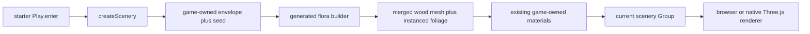

# PRD-363 — deterministic procedural flora is generated render source, not a vegetation package

**Status: PROPOSED, 2026-09-06.** Evaluated against engine `HEAD` and
[`owenyuwono/dryad`](https://github.com/owenyuwono/dryad)
at `e85729b779708c50b7d65ddd34d524f42da88705` (MIT, depth-1 clone at `/tmp/dryad`).
No upstream code or assets have been copied.

**Complexity:** +3 touches more than 10 files, +2 introduces a renderer-independent
generation module in generated source, +2 crosses the scaffolder, playtest and native-proof
surfaces = **7 → HIGH mode**. Run a `prd-work-reviewer` checkpoint after every implementation
phase, including the integration audit and negative controls required by `prd-creator`.

**Decision: useful, with a narrow intake.** Mine Dryad's deterministic generation pipeline,
physics-over-seed proportion rule, and one-merged-mesh plus one-instanced-mesh draw strategy
into ordinary generated `src/render/` source. Do **not** add `Flora3D`, `Tree3D`, a species
catalog, a preset system, a genome schema, a vegetation package, a core export, or a
capability-manifest entry. The game must continue to own the climate envelope, seed, shape,
placement, materials, leaf sprite, wind strength, and quality tiers.

The first consumer is the default starter's existing scenery path. Its nine rounded horizon
boxes and four midground block spires already have a claimant (PRD-317's fused ridge); flora
is the *second* scenery layer — foreground/background plantings that prove the pipeline on a
live gameplay-adjacent path without touching collision, terrain, or the rock-ridge work.

## 1. Integration Ledger

`→impl` becomes a real non-test `file:line` during implementation. A row still containing it
at a phase boundary fails that phase.

| # | New thing | Live caller and reachability | Replaces or rejects | Negative control |
|---|---|---|---|---|
| 1 | Renderer-independent flora generation in generated `src/render/` source | `templates/starter/src/render/flora.ts:→impl`, called by `Play.enter` via `createScenery` | Upstream generation stages adapted, never exposed as an engine API | Restore bare scenery; connected-flora and silhouette gates fail |
| 2 | Game-owned climate envelope plus integer seed | `createFlora(...):→impl` takes both as required arguments | Hard-coded species/preset selection | Swap two seeds; determinism-hash gate fails |
| 3 | Determinism report (hashes, counts) | The live flora construction reads the report before attaching geometry | Upstream golden-pin tests, which cannot run in a game | Change one seed input; hash assertion fails |
| 4 | Starter visual scenario with flora | Existing `starter-look` scenario drives the real scaffold and observes named flora regions | Its current whole-frame nonblank check, which bare ground satisfies | Remove flora call; named flora-region assertion fails |
| 5 | Generated-project authoring instruction | Starter `AGENTS.md` tells the game's agent where envelope, seed, material and density choices live | Vendoring the upstream CLAUDE.md norms as an undiscoverable extra skill | Delete the instruction; template-doc test fails |
| 6 | Cross-target proof | The same generated starter source runs on browser and packed Linux desktop | Upstream WebGL2-only demo evidence | A target branch or missing Worker dispatch fails same-hash proof |
| 7 | Wind toggle that is exactly static at zero | Existing quality/settings path owns the strength value | Upstream wind UI panel | Set strength to zero; vertex-displacement probe reports motion |

### Reachability



**Full flow:** the existing start scene creates scenery with its existing deterministic random
source; generated render code grows a small bounded stand of plants from an explicit envelope
and seed, attaches one merged wood geometry and one instanced foliage mesh per stand, and the
player sees plantings in the same start scene. No menu, opt-in flag, preset dropdown, or new
engine vocabulary is introduced.

**What this replaces:** nothing structural. Flora is additive scenery alongside the existing
ridge work. Gameplay bodies, collision, terrain queries, and platformer `rockBox` are out of
scope. If PRD-317 is still open when this lands, the two share `createScenery` but neither
may depend on the other's source files.

## 2. Context and incumbent census

**Problem:** a freshly scaffolded game has no shipped example of deterministic living scenery.
Agents reaching for vegetation today either hand-author low-poly cones (one more static prop
to place by hand) or import a species pack (binary assets with no seed control). Dryad proves
a third option exists: climate plus seed in, closed countable geometry out, with zero assets
on disk.

**Files analyzed:**

- `packages/create-threenative/capabilities.json`
- `packages/core/src/world.ts` and `packages/core/src/world-tiles.ts` (terrain/tiles)
- `packages/create-threenative/templates/starter/src/render/scenery.ts`
- Upstream `src/genome.js`, `src/genomeSchema.js`, `src/allometry.js`, `src/skeleton.js`,
  `src/proportions.js`, `src/foliage.js`, `src/branchMesh.js`, `src/leafMesh.js`,
  `src/leafTexture.js`, `src/barkMaterial.js`, `src/roots.js`, `src/windSolver.js`,
  `src/windSkinGlsl.js`, `src/rng.js`, `src/envelope.js`, `src/mutate.js`,
  `src/biosphere.js`, `src/presets.js`, `CLAUDE.md`, `WIND_HIERARCHICAL_PLAN.md`

**Current behavior:**

- `createRandom(seed)` ships deterministic RNG; games receive seeded `ctx.random`. No
  flora caller exists.
- `InstancedBatch` collapses repeated props into one draw but requires one game-authored
  shape; it does not grow anything.
- Starter scenery is generated and deterministic but contains no living forms.
- No capability-manifest entry matches procedural vegetation, wind sway, or climate-driven
  generation. The `engine_search_capabilities` request-scope query for this exact situation
  returned asset-loader, render-chain, and batching hits — mechanism neighbors, not owners.

### Borrow map — where to read what

Pinned to `e85729b`. MIT throughout; preserve the notice if substantial source survives.

| Upstream area | Intake | Reason |
|---|---|---|
| `rng.js` (12 lines, mulberry32) + fixed draw-order norm | **Adapt the rule, not the file** — use `createRandom`/game seed, keep "don't reorder draws" | Determinism is load-bearing; engine already owns the RNG primitive |
| `envelope.js` + env-biased `randomGenome` (`genome.js:44-774`) | **Mine the concept** — envelope biases a continuous vector; draw order fixed and documented | Climate-over-species is the intake's core idea; the 774-line gene list is not |
| `genomeSchema.js` tiers/ranges/distance metric | **Mine the shape of the contract** (ranges, identity defaults, append-last rule) at game scale | A 688-line schema is game data, not framework surface |
| `allometry.js` size-factor scaling laws | **Adapt** — one size driver → coupled girth/leaf/tier counts, identity at 1.0 | The one place a value is derived, and it is physical law, not identity |
| `skeleton.js` recursive branch graph, `parentIdx < ownIndex` invariant | **Adapt the invariants** (parents precede children, single origin, bone budget cap) | Executable correctness checks, not a look |
| `proportions.js` pipe-model radii, gravity droop, tip taper, ZERO rng | **Adapt the rule "seed never sets thickness"** | Topology is seeded; proportions are physics — directly portable |
| `foliage.js` grouped-cluster instance set, SoA layout, no-detached-leaves invariant | **Adapt** — one multi-leaf sprite per anchor as the shippable default | Draw-call strategy is mechanism |
| `branchMesh.js` one merged tapered-tube geometry | **Adapt the strategy** — one merged wood mesh per stand | One draw for all wood is mechanism |
| `leafMesh.js` ONE `InstancedMesh` of alpha-cutout cards | **Adapt the strategy** — one instanced mesh per stand | One draw for all foliage is mechanism |
| `leafTexture.js` Gielis superformula + space-colonization veins | **Rewrite one sprite generator in game source** | Procedural sprite with zero assets is the point; keep it small and game-owned |
| `roots.js` isolated-salt substream (`structuralSeed ^ ROOT_SALT`) | **Adapt the pattern** if roots ship — isolated substream so roots never perturb canopy determinism | Determinism hygiene, not a look |
| `windSolver.js` + `windSkinGlsl.js` hierarchical skeletal wind | **Mine the semantics only** (rotational bending, trunk rigid, strength 0 = exactly static) and re-express in TSL | GLSL `onBeforeCompile` does not cross the WebGPU seam; see §3 |
| `mutate.js` + `biosphere.js` (parked, tested family generation) | **Mine the concept** — one ancestral genome branch-mutated into a related family | How a stand of individuals stays coherent; port only if Phase 0 proves the need |
| `barkMaterial.js` furrow-guided FBM via `onBeforeCompile` | **Reject** — starter keeps its own materials | Chooses the look AND targets the WebGL2 path; upstream `main.js` already calls lenticels/shed genes inert |
| `presets.js` named gene-vector bookmarks | **Reject as catalog** — at most two or three inline envelope constants in game source | A preset dropdown is UI/editor scope; appearance stays in game source either way |
| `viewer.js`, `main.js`, `index.html`, `inspectorPanels.js`, debug UI | **Reject** | Demo harness and Sims-CAS sliders are not a game path |
| `renderModes.js`, debug furrow/normal views | **Reject** | Look-dev tooling, not shipped game code |
| `gridRenderer.js`, SDF shaders, `skin.js` packed bones | **Reject** | Parked legacy path superseded upstream by the mesh pivot |
| `weep` gene in current form | **Reject until fixed upstream** — known spiral/over-droop bug (tips to y≈−42) | Port a bounded blend-toward-down rewrite or omit droop past straight |
| HDRI binary (`public/env/`) | **Reject** | Starter owns its lighting; no binary asset enters the template |

The source is useful because the determinism norms and draw-call strategy are concrete and
tested. It is not evidence that a 17,952-line flora application belongs in the framework.

## 3. Ownership and API decision

### No new framework API

The generation half is ordinary JavaScript with no three.js import and no browser-only API —
a game can already write it. The display half is ordinary Three.js. Neither half needs a
platform seam or a dependency the game must not inherit, so the two-question test answers:
(a) the game *can* write this portably itself — framework owns nothing here; (b) every
remaining choice is appearance — so all of it ships as generated `src/render/` source.

There is therefore no `Flora3D`, no `Tree3D`, no genome export, no wind export in this PRD.
A later local helper may use Three-shaped names, but it stays under
`templates/starter/src/render/` and is copied into the user's project as editable source.
`capabilities.json` is not extended: it is the public engine surface, not a catalog of one
template's authored visuals.

### The TSL seam (binding constraint)

The engine renderer is Three.js `WebGPURenderer`; the language is TSL. Dryad is three r160
WebGL2 with `onBeforeCompile` GLSL injection (`barkMaterial`, `leafMesh`, `windSkinGlsl`),
which its own CLAUDE.md warns is invisible to build and tests. **No GLSL string is ported.**
Wind becomes a TSL position-node displacement (or a CPU update only if Phase 0 measures it
inside budget); bark/leaf surfacing uses the starter's existing materials plus a procedural
canvas sprite. Anything that cannot be expressed in TSL or plain Three.js is cut, not worked
around — the Phase 0 decline conditions enforce this.

### Core admission gate for later work

If a later real game repeats the exact renderer-independent generation, file a separate PRD
only after all of these are measured:

1. two non-template games each carry at least 150 identical code lines of generation/audit;
2. the shared helper is shorter than the deleted copies under `scripts/count-loc.ts`;
3. every climate value, seed, shape, material, sprite, density, and timing input remains
   required game data;
4. a pre-existing non-test caller breaks when the proposed export is removed; and
5. browser and native desktop consume the same source and determinism hash.

Until then, an engine export would be an orphan abstraction built from one visual example.

### Data and error contract

The local builder receives an explicit envelope (required numeric climate fields, finite),
an integer seed, countable budgets (max plants, max bones/segments, max leaf instances),
and spatial bounds. It returns group-ready geometry plus a report:

```ts
interface IFloraReport {
  readonly plants: number;
  readonly woodVertices: number;
  readonly woodTriangles: number;
  readonly leafInstances: number;
  readonly boundaryEdges: number;
  readonly detachedLeaves: number;
  readonly positionHash: string;
  readonly indexHash: string;
  readonly buildMs: number;
}
```

Malformed envelopes, non-finite samples, empty stands, budget overflow, and invalid indices
throw named errors. Choosing a low quality tier may reduce counts but never suppresses
measurement; determinism hashes are computed from the final attached arrays.

## 4. Execution phases

### Phase 0 — prove the intake beats bare scenery before copying source

**User-visible outcome:** a recorded A/B establishes whether a small deterministic planting
materially improves the default starter without breaking startup or steady-state budgets.
Failure closes this PRD as DECLINED with no product code.

**Files (max 5):**

- `docs/PRDs/feature-mining/PRD-363-deterministic-procedural-flora-is-generated-render-source.md` — EDIT: pin measurements and the exact accepted upstream ranges.
- `docs/PRDs/feature-mining/README.md` — EDIT: record the measured verdict.
- `docs/verification/prd-363-flora-admission-2026-09-06.md` — NEW: commands, captures, timings, determinism hashes, and source counts.
- `packages/create-threenative/templates/starter/src/render/scenery.ts` — EDIT TEMPORARILY: local challenger used only for the A/B; revert if declined.
- `packages/create-threenative/templates/starter/playtests/look.playtest.json` — EDIT: add a flora-region observation that is red on the current bare scenery.

**Implementation:**

- [ ] Capture current `starter-look` at the fixed viewport and seed; record flora-region
      occupancy, draw calls, triangles, startup time, and steady-state FPS.
- [ ] Build the hardest real subject first: a bounded multi-plant stand (not one hero tree)
      with envelope-driven variation across individuals. A single specimen cannot satisfy
      this phase — the stand proves the family-coherence and instancing story.
- [ ] Express wind in TSL from the start; if TSL displacement cannot be wired in the
      challenger, record that fact and let the decline conditions fire.
- [ ] Count adapted source separately from envelope/look source. Record all copied or
      rewritten upstream ranges and preserve the MIT notice if substantial source survives.
- [ ] Accept only if a blinded comparison chooses the challenger, determinism hashes are
      byte-identical across repeats, and measured startup/steady-state thresholds derived
      below pass on the actual browser run.

**Wiring:** the challenger grows inside the existing `createScenery` call reached by
`Play.enter`; no demo-only route is allowed.

**Tests and negative controls:**

| Gate | Pass condition | Observed red required |
|---|---|---|
| Determinism | same envelope+seed yields byte-identical position/index hashes | change one seed input |
| Bounded stand | plant/segment/leaf counts within declared budgets | force showcase density on the startup path |
| Closed geometry | `boundaryEdges=0`, `detachedLeaves=0` | duplicate a seam vertex / detach one anchor |
| Visual improvement | blinded A/B prefers challenger; flora region differs beyond a recorded floor | substitute cone-on-cylinder props |
| Budget | startup and steady-state remain within thresholds derived from the control run | force showcase cell size on the startup path |

**Revert check:** the strengthened pre-existing `starter-look` scenario must fail when the
bare scenery is restored. If it remains green, the gate does not measure this feature.

**Checkpoint:** automated reviewer plus manual inspection of both fixed-camera captures. Do
not continue until both pass.

### Phase 1 — ship one deterministic stand from ordinary generated source

**User-visible outcome:** a freshly scaffolded starter shows a small deterministic planting
in its live start scene, with no new engine API.

**Files (max 5):**

- `packages/create-threenative/templates/starter/src/render/floraField.ts` — NEW: bounded envelope→graph→proportion→foliage generation; renderer-independent, no three.js material construction. Under the existing 200-line render-source smell cap — split into `floraField.ts` + `floraMesh.ts` if it does not fit.
- `packages/create-threenative/templates/starter/src/render/floraStand.ts` — NEW: game-owned envelope constants, seeds, bounds, and Preview settings.
- `packages/create-threenative/templates/starter/src/render/scenery.ts` — EDIT: attach the stand; delete nothing from the ridge work.
- `packages/create-threenative/__tests__/looks.spec.ts` — EDIT: enforce framework-free ownership, deterministic inputs, and a live `scenery.ts` caller.
- `packages/create-threenative/templates/starter/playtests/look.playtest.json` — EDIT: retain the Phase 0 flora-region assertion.

**Implementation:**

- [ ] Adapt only the accepted generation/audit ranges, as strict TypeScript ESM with `.js`
      imports. No `Math.random` in the generation path; draws come from the game seed in
      fixed documented order.
- [ ] Require all climate, seed, and look inputs from `floraStand.ts`; the builder contains
      no species, preset, colour, material, or quality default.
- [ ] One merged wood `BufferGeometry` plus one `InstancedMesh` foliage per stand; grouped
      multi-leaf sprite per anchor as the shippable default.
- [ ] Reuse the starter's existing materials plus one procedural canvas sprite; port no
      upstream shader.
- [ ] Attach the report to the returned controller and emit measured values through the
      existing playtest entity/state path; do not emit a literal `deterministic: true`.

**Wiring:** `scenery.ts` imports and invokes the stand builder; `Play.ts` remains the
pre-existing entry point.

**Tests required:**

| Test | Assertion | Observed red required |
|---|---|---|
| `should grow one bounded stand from the starter envelope` | report within budgets, zero geometry defects, positive non-trivial volume of wood | disable the outer bound |
| `should reject malformed or empty fields` | named errors for NaN envelope, overflow, and zero plants | return empty arrays |
| `should keep the stand game-owned` | no `@threenative/` import and no colour literal in builder | add a core import or colour literal |
| `starter-look` | real scene shows the stand in the named region | remove flora call |

**Revert check:** delete `floraField.ts`; the pre-existing starter build and `starter-look`
flow fail because live `scenery.ts` imports it.

**User verification:** scaffold starter, run its existing look scenario, and open the
before/after capture at 1280×720.

### Phase 2 — wind moves and stops honestly

**User-visible outcome:** foliage and branch tips sway under a game-owned strength value;
setting it to zero yields exactly static geometry.

**Files (max 5):**

- `packages/create-threenative/templates/starter/src/render/floraWind.ts` — NEW: TSL wind displacement + strength input (or CPU update if Phase 0 measured it inside budget — one path, not both).
- `packages/create-threenative/templates/starter/src/render/floraStand.ts` — EDIT: wind strength plumbing from the existing quality/settings path.
- `packages/create-threenative/templates/starter/playtests/look.playtest.json` — EDIT: sway-present and sway-absent observations in the same run.
- `packages/create-threenative/__tests__/template.spec.ts` — EDIT: source-level wind wiring assertions.
- `docs/verification/prd-363-flora-wind-2026-09-06.md` — NEW: sway measurement and zero-static proof record.

**Implementation:**

- [ ] Rotational bending semantics (tips move most, trunk rigid); never translational shear.
- [ ] `strength=0` displaces zero vertices — measured, not asserted by label.
- [ ] No per-frame allocation after warm-up on the steady path.

**Tests required:**

| Test | Assertion | Observed red required |
|---|---|---|
| sway present | strength > 0 moves named tip vertices beyond a recorded floor | set strength to zero |
| sway absent | strength = 0 moves zero vertices | inject a constant offset |
| no per-frame alloc | allocation probe flat after warm-up | allocate per frame |

**Revert check:** removing wind dispatch makes the strengthened existing look flow fail its
sway-present observation.

### Phase 3 — the generated agent can find and safely change the recipe

**User-visible outcome:** a cold agent opening a scaffold knows which source changes flora
and how to verify determinism without discovering a new engine vocabulary.

**Files (max 5):**

- `packages/create-threenative/templates/starter/AGENTS.md` — EDIT: describe envelope ownership, draw-order rule, determinism hashes, and density budgets.
- `packages/create-threenative/templates/starter/CLAUDE.md` — GENERATED by `pnpm sync:agents`.
- `packages/create-threenative/__tests__/looks.spec.ts` — EDIT: assert the instruction and its generated mirror.
- `packages/create-threenative/templates/starter/src/render/floraStand.ts` — EDIT: final comments name the game-owned controls and no engine API.
- `docs/verification/prd-363-flora-authoring-2026-09-06.md` — NEW: cold-agent change and proof record.

**Implementation:**

- [ ] Tell agents: plantings come from one envelope plus seed; new individuals reroll the
      seed, new kinds change the envelope; never reorder RNG draws; never hide holes with
      `DoubleSide`.
- [ ] Name `floraStand.ts` as the shape/look owner and `floraField.ts` as local generated
      source.
- [ ] Require hash checks after changing envelope, bounds, or density, and visual checks
      across three seeds and the fixed starter camera.
- [ ] Run `pnpm sync:agents`; never hand-edit the generated mirror.

**Negative control:** delete the flora paragraph from `AGENTS.md`; `looks.spec.ts` must fail.

### Phase 4 — prove the same authored source on web and native desktop

**User-visible outcome:** a clean scaffold renders the same deterministic stand and remains
responsive on browser WebGPU and packed Linux desktop native.

**Files (max 5):**

- `packages/create-threenative/templates/starter/native-playtests/render-chain.playtest.json` — EDIT: add measured flora hash/visibility observations to the existing native route.
- `packages/create-threenative/templates/starter/playtests/look.playtest.json` — EDIT: share the same observation names and thresholds.
- `packages/create-threenative/__tests__/scaffold.spec.ts` — EDIT: update the intentional starter tree hash and document why.
- `docs/verification/prd-363-flora-cross-target-2026-09-06.md` — NEW: exact commands, adapter/target identity, reports, and captures.
- `docs/PRDs/feature-mining/PRD-363-deterministic-procedural-flora-is-generated-render-source.md` — EDIT: fill ledger lines and evidence.

**Implementation and proof:**

- [ ] Scaffold from freshly packed local tarballs; no workspace resolution may satisfy the proof.
- [ ] Run `starter-look` with `--browser-recipe webgpu`; record the named adapter.
- [ ] Run the existing starter native scenario with `--target desktop`; record the executable
      and prove that the observation came from native rather than a browser fallback.
- [ ] Compare counts and deterministic position/index hashes across targets; screenshots may
      use a visual threshold but data identity is exact.
- [ ] Report Android and iOS as `UNVERIFIED` unless those targets actually execute.

**Negative control:** skip flora construction in the native bundle only; the native flora
completion and hash observation must fail while the browser still passes.

**Revert check:** remove `floraStand.ts`; both existing starter entry builds fail at their
live caller.

## 5. Verification commands

```sh
pnpm exec vitest run packages/create-threenative/__tests__/looks.spec.ts \
  packages/create-threenative/__tests__/template.spec.ts
pnpm --filter @threenative/create-threenative build
pnpm test:templates
pnpm typecheck && pnpm lint && pnpm test
pnpm budgets
pnpm sync:agents --check
```

For the runtime proof, use the playtest runner commands documented in this repository at
execution time. Record the exact generated-project path, server command, adapter, target and
artifact paths in `docs/verification/`; do not paste a command here until its executable
flags have been verified.

Every recorded pass must include its observed mutation red. A green full suite without the
named negative control remains **UNVERIFIED**.

## 6. Acceptance criteria

- [ ] **AC1 — the player sees living scenery.** The default starter's live start scene renders
      a bounded multi-plant stand where bare ground used to be, and a blinded fixed-camera
      A/B prefers it over the incumbent.
- [ ] **AC2 — determinism is measured, not asserted by label.** Three fixed envelope+seed
      pairs each report byte-identical position/index hashes on repeat; changing one seed
      input changes the silhouette beyond the recorded floor without breaking validity.
- [ ] **AC3 — geometry is countable and closed.** Stand counts stay within declared budgets;
      zero boundary edges and zero detached leaves, every report computed from the final
      attached arrays.
- [ ] **AC4 — seed never sets thickness.** A proportions-only audit shows radii unchanged
      across seed rerolls at fixed envelope; topology varies, thickness does not.
- [ ] **AC5 — wind is honest.** Strength > 0 moves tips beyond the recorded floor with a
      rigid trunk; strength = 0 moves zero vertices; no per-frame allocation after warm-up.
- [ ] **AC6 — the look remains game-owned.** All new runtime source lives in generated
      `src/render/`, imports no `@threenative/*`, constructs no hidden default material,
      and adds no package export, config key, preset catalog, or capability-manifest entry.
- [ ] **AC7 — no GLSL crosses the seam.** Zero `onBeforeCompile` strings and zero
      WebGL2-only shader code in the new source; wind and surfacing run through TSL or
      plain Three.js on every target.
- [ ] **AC8 — source stays teachable.** Each generated render file remains under the
      existing 200-line smell cap; `AGENTS.md` names the envelope owner, draw-order rule,
      and density budgets; its mirror is generated.
- [ ] **AC9 — real integration.** Removing the new render source breaks the pre-existing
      starter build and look flow at the live `Play.enter → createScenery` path.
- [ ] **AC10 — web and native desktop.** Clean-install browser WebGPU and packed Linux
      desktop run the same authored source and return exact count/hash identity. Mobile
      targets are named `UNVERIFIED` unless executed.
- [ ] **AC11 — all gates are honest.** Integration Ledger has zero placeholders, every
      acceptance gate has its recorded red, all phase reviewers pass, and the verification
      files contain raw output rather than summaries.

## 7. Decline conditions

Close this PRD as **DECLINED with no product code** in Phase 0 if any one is true:

- the current bare scenery passes the strengthened flora-region or silhouette gate;
- the challenger is not preferred in the blinded fixed-camera comparison;
- the stand cannot meet measured startup and input budgets on the real starter;
- TSL wind cannot be wired and the CPU fallback exceeds budget;
- the adapted source cannot stay renderer-independent and framework-free; or
- a framework export becomes necessary before a second real consumer exists.

The upstream repository remains a useful technical reference even if the starter adoption is
declined. A useful reference is not automatically a useful engine surface.

## 8. Out of scope

- A vegetation package, species catalog, preset dropdown, genome schema, or editor UI.
- Fauna, grass-field simulation, or planet-wide ecology (upstream parked layers stay parked).
- Loading donor genome/preset files at runtime.
- WebGL2 `onBeforeCompile` shaders and EffectComposer post chains.
- Claiming botanical accuracy; the output is a game-owned stylization guided by the
  upstream pipeline, with the borrow map saying which ranges were adapted.
- Shipping frozen plant species as package exports. The stand is a reference and proof;
  templates receive only plantings their existing scenery actually calls.

## 9. Completion rule

This PRD is not complete when a builder compiles or a stand lists countable plants. It is
complete when the default starter renders a deterministic game-owned stand with honest wind,
the same source crosses the native seam with exact hash identity, and removing the new
source breaks those live flows. Move it to `docs/PRDs/done/` only with all boxes checked
and all target claims backed by a durable verification record.
