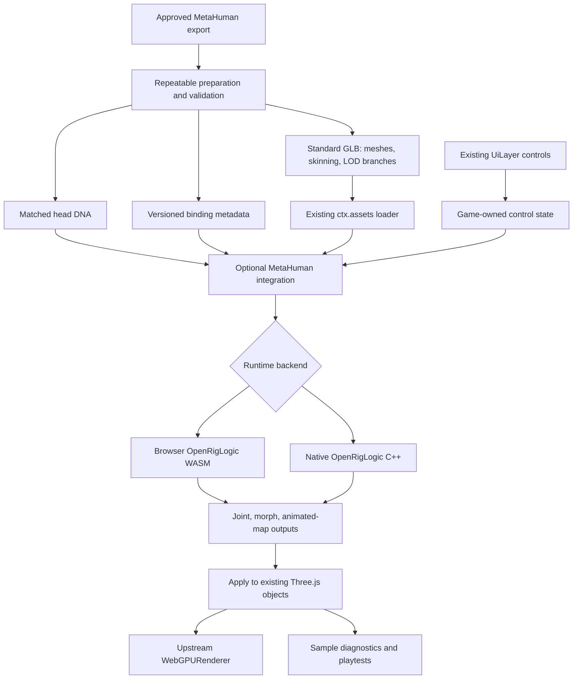

# PRD-465 — MetaHuman Expression Lab

**Status:** IN PROGRESS — lane `feat/prd-465-metahuman-expression-lab`; specimen acquired and prepared (§10), no box ticked yet.

**Date:** 2026-09-28.

**Requested by:** Joao.

**Engine baseline inspected:** `ThreeNativeHQ/threenative`, `develop`, commit `3788ce79e8d69175168b36f0ebd624d9e5e6b10a`; re-checked locally against `origin/develop` `9ca185022` (2 commits later: version bumps and a physics deprecation notice, no change to the cited seams).

**Sandbox baseline inspected:** `ThreeNativeHQ/examples`, `main`, commit `084faa7d0b9e929e60ecf8a20cd659906b0843c1`.

**Proposed sample:** `../sandbox/metahuman-lab/`, tracked as `metahuman-lab/` in `ThreeNativeHQ/examples`.

This is a delivery specification, not a claim that MetaHuman support or the sample already exists. New package names, APIs, tests, and scripts below are proposed.

## 1. Outcome

A developer launches a sandbox sample, sees a real MetaHuman in a head-and-shoulders inspection scene, and directly controls its face. Sliders change the visible jaw, lips, brows, eyelids, cheeks, and gaze. Presets blend smoothly; reset restores the reference neutral pose. The same game source and UI operate in browser WebGPU and the native Linux desktop host, with no running Unreal process and no streamed Unreal viewport.

The integration must evaluate the character's actual DNA rig through OpenRigLogic. A static model, a prerecorded facial clip, a synthetic face, or sliders that only change application state do not satisfy the outcome.

Initial scope is one approved specimen and its pinned export recipe, not compatibility with every historical MetaHuman. A head with a matching static shoulder/torso presentation is sufficient; full-body RigLogic is not required. Linux is the first native qualification target. Windows, macOS, Android, and iOS must not be advertised as verified by this PRD.

## 2. Findings that determine the design

### Existing ThreeNative capabilities

| Inspected source | What exists | Integration consequence |
| --- | --- | --- |
| `packages/core/src/assets.ts` | Cached upstream `GLTFLoader`, manifest resolution, conditional decoders, provenance, disposal, and `resolve()` for other asset types. | Load the prepared GLB through `ctx.assets`. Resolve DNA and bindings through the same logical asset paths; do not create a competing model cache. [R1] |
| `packages/core/src/skeletal-mesh.ts` | `SkeletalMesh3D` uses `SkeletonUtils.clone` and shared rig preparation. | Reuse skeleton-safe instancing, rather than inventing a character scene graph. Audit ownership of shared geometry and materials. [R2] |
| `packages/core/src/animation.ts` | `AnimationMixer` integration and automatic locomotion stride matching. | Facial evaluation needs a deliberate update position and must not be treated as a locomotion clip. [R3] |
| `packages/core/src/model-lod.ts` | Discrete LOD chains share vertex attributes and change indices. | This is not a ready-made controller for independently exported MetaHuman meshes. Preserve the current system; add only the specimen's mesh/rig coordination. [R4] |
| `packages/runtime-native/src/physics/native_bindings.cpp` | An engine-neutral `js::Engine` binding pattern, native resource ownership, and argument validation. | Follow that seam for OpenRigLogic rather than adding N-API, JSI, or a second host architecture. [R5] |
| `packages/runtime-native/AGENTS.md` | Upstream Three.js owns rendering; native mobile bundles refuse WASM-dependent paths and currently unsupported compressed assets. | Browser WASM and native C++ need separate build graphs. Do not relax mobile guards to make the import appear portable. [R6] |
| `packages/core/src/ui-layer.ts` | `game.ui`, `UiLayer`, intent/state transport, and native interactive hit regions. | Put sliders in the existing UI layer, not a DOM-only debug panel inside the portable game entry. [R7] |
| `packages/playtest/AGENTS.md` | Shared browser/native scenarios, screenshots, diagnostics, and presentation-aware performance tooling. | Extend sample observations, not the test framework. A missing observation must fail. [R8] |
| `scripts/make-sandbox.ts` and examples `AGENTS.md` | External consumer projects, packed dependencies, package validation, and content-hashed staging. `PACKAGES` derives from the workspace manifests, so a new package is staged automatically. `--genre` is mandatory and resolves `docs/benchmark/genres/<slug>/{brief.md,reference.png,proof/*.playtest.json}`. | Verify installed tarballs without workspace links; never patch the sample's `node_modules`. [R9], [R10] |
| `@threenative/physics` (`package.json` `exports`, `src/native/host.ts`), `runtime-native` `TN_ENABLE_NATIVE_PHYSICS`, `build-matrix.json` `tn-linux-contracts-physics`, `scripts/verify-desktop-physics.mjs` | **The exact precedent for this PRD**: a `threenative-native` export condition sends native bundles to `dist/native/index.js` so WASM never enters them; the host installs its ABI on `globalThis.__THREENATIVE_NATIVE__.physics` and `nativePhysicsHost()` fails closed with `TN_NATIVE_PHYSICS_MISSING`; an OFF-by-default CMake option; an on-demand build-matrix configuration; and a verify script that builds a bindings contract test, runs it, then runs a desktop playtest. | Copy that shape one-for-one: `threenative-native` condition, `__THREENATIVE_NATIVE__.metahuman`, `TN_NATIVE_METAHUMAN_MISSING`, `TN_ENABLE_METAHUMAN`, a `tn-linux-contracts-metahuman` configuration, `verify-desktop-metahuman.mjs`. No new detection mechanism. [R5], [R13] |
| `runtime-native/scripts/install-prebuilt.mjs`, GitHub releases | A sandbox game gets its C++ host only as a prebuilt from a `runtime-native-v*` release (latest `v0.3.3`, 2026-09-25); the packed package ships no C++ sources. `THREENATIVE_PREBUILT_MANIFEST` (plus `THREENATIVE_ALLOW_INSECURE_PREBUILT=1` for a loopback URL) points the install at a locally built manifest. | The installed native acceptance (A7) runs a workspace-built Linux prebuilt through that override, reported as such. Publishing a release carrying `TN_ENABLE_METAHUMAN` is out of scope. |
| `three@0.185.1` `GLTFLoader` | Reads only `JOINTS_0`/`WEIGHTS_0`: four skin influences per vertex. | The preparation step must report the specimen's per-LOD maximum influences and the weight lost by truncating to four; see §4. |
| `packages/raw-unreal`, `packages/ueformat`, `threenative-asset-mcp` `asset_import_unreal` | `raw-unreal` reads editor static meshes only and throws on skeletal data. `asset_import_unreal` (asset MCP 0.9.5) routes skeletal meshes through an external converter and preserves skinning; no morph-target handling was found in its source or tests. `ueformat` parses skeletal LODs, skin and sparse morph targets from CUE4Parse `.uemodel` exports. | Candidate preparation routes for a specimen that arrives as an Unreal package; §4 ranks them. |

These are findings from the named files at the inspected revisions, not an assertion that every branch and experimental PR was exhaustively audited. `engine_search_capabilities` for facial rigs, morph targets and blendshapes returns only `SkeletalMesh3D` (verdict `matched` on skeleton-safe instancing, nothing facial), so no installed system covers this. Repeat that search at the then-current `develop` head before writing package code.

### External constraints

Epic permits MetaHuman use with other engines. OpenRigLogic provides C++ DNA reading and rig evaluation; its repository identifies `5.8` as the stable line and `main` as experimental. Its source license is MIT, while sample assets are acquired separately under their content license. [E1], [E2]

Epic's DCC export contains head/body DNA, textures, and associated metadata; it is not a ready-to-load Three.js GLB or a port of Unreal's material system. [E3]

MetaHuman deformation combines joints and, at LOD0, per-vertex shapes. Its LODs have separate geometry and weights, using subsets of a joint hierarchy. Consequently, a generic “52 blendshape” adapter and independent mesh-only LOD changes are insufficient. [E4]

A MetaHuman head DNA carries its own geometry: "Each LOD has its own geometry set, with no meshes shared across LODs", with skin weights per LOD and blendshape deltas at LOD0. [E4] OpenRigLogic's DNA library reads and writes DNA from C++ and Python (SWIG bindings). [E2] So a DNA can produce the specimen's mesh, skinning and morph targets directly, with mesh and blendshape indices matching the rig by construction.

**Two qualifications to the initial integration idea:** OpenRigLogic supplies rig evaluation, not Unreal-equivalent skin, eyes, lighting, or hair. Its README documents no Emscripten/WASM build; building and validating ours is explicit implementation work, not an assumed dependency.

### OpenRigLogic Sample Content (acquired 2026-09-28)

The free Fab listing "OpenRigLogic Sample Content" (`27a81942-69bf-498e-a41f-004d0d2db37b`, Fab Standard License) is on this machine at `~/Downloads/openriglogicsamplecontent.zip`. It holds two files:

| File | Contents | Use in this PRD |
| --- | --- | --- |
| `Sample.dna` (1,354 B) | A minimal synthetic rig. Its layers are descriptor, definition, behavior, geometry, machine-learned behavior, RBF behavior and twist/swing. It has 2 raw controls, joints `spine_04`/`spine_05`, 4 blendshape channels (`brow_down_L/R`, `brow_lateral_L/R`), 4 animated maps, an RBF solver and twist/swing setups. There is no face mesh. | Reference-vector input for Phase 1–2. It exercises every behaviour module in a file small enough to reason about. It cannot satisfy A1/A2: it has no face. |
| `faceboard.json` (2.2 MB) | The MH.6 faceboard definition, version 4.2: 175 GUI controls (`CTRL_C_jaw`, `CTRL_L_eye_blink`, `CTRL_L_brow_raiseIn`, …), groups, shapes and 3 analog aim controls (`CTRL_C_eyesAim`, `CTRL_L/R_eyeAim`). | The canonical GUI control names for the §6 aliases. |

Both are licensed content. Read them from a gitignored local path (`TN_METAHUMAN_SAMPLE_DIR`) and never commit them. CI therefore needs its own redistributable DNA: write one with the OpenRigLogic DNA writer from a committed script, covering the same module set as `Sample.dna`.

## 3. Approach and boundaries

| Approach | Benefit | Limitation | Decision |
| --- | --- | --- | --- |
| Baked GLB expressions only | Small initial runtime; useful to inspect export quality. | Does not establish live DNA evaluation or preserve the rig's corrective behavior under arbitrary control combinations. | Allowed as a diagnostic reference, not the delivered integration. |
| OpenRigLogic with browser WASM and native C++ | One rig contract and sample API across both required runtimes. | Requires a bounded WASM build, native bridge, asset bindings, and parity tests. | Recommended for this PRD. |
| Native-only integration | Avoids the initial browser build problem. | Leaves the same-source browser goal unfinished. | May be an intermediate experiment, not completion. |

Create optional `@threenative/metahuman`, justified by the isolated OpenRigLogic dependency. Its `exports` copy `@threenative/physics`: a `threenative-native` condition to `dist/native/index.js` that never references the WASM, and a default `import` entry that does. Keep the C++ host implementation in `packages/runtime-native`; do not create another native-runtime tree. Applications that do not import the integration must not download its WASM or initialize a rig. Default repository verification must not acquire a new mandatory CMake build: `TN_ENABLE_METAHUMAN` defaults OFF like `TN_ENABLE_NATIVE_PHYSICS`. [R6], [R9], [R11], [R13]

A new package is listed by hand in several places. Use the most recent addition as the checklist, `rg -l raw-unreal --glob '!**/node_modules/**'`: `README.md`, `scripts/__tests__/make-sandbox.spec.ts`, the capability manifests and reference, `packages/engine-mcp`, `scripts/run-test-suite.sh`, `packages/create-threenative/__tests__/scaffold.spec.ts`. Also check `ci.yml`'s build step, `npm-release.yml`'s publish set, the root `playwright.config.ts` `localPackages` and `LOCAL_FRAMEWORK_PACKAGES` in `scripts/visual-gate.ts`. Keep it a `devDependency` of any published package until it is itself published: a published package that depends on an unpublished one cannot be installed.

The package owns asset validation, rig evaluation, backend selection, bindings, and resource lifetime. The sample owns colors, lights, skin/eye shaders, hair-card presentation, expression recipes, transition timing, camera composition, and UI. No universal character format, editor, rendering preset system, or new renderer is introduced.



## 4. Asset preparation and rights

### Supported v1 handoff

The runtime accepts a **prepared standard GLB, its matching original head DNA, and binding metadata**. It does not promise that a standalone `.dna` recreates a fully shaded character. Support one named, version-pinned export recipe first; arbitrary FBX conversions and historical DNA variants are outside the initial support envelope.

Preparing the first specimen is implementation work, not an undocumented task passed to the game author. The integration must supply a repeatable preparation script and instructions that generate and validate the final GLB/bindings. A route becomes supported only after the actual specimen passes the pose comparisons below. No hand-edited bone indices or manually repaired morph ordering may be required on each run.

**Route order.** Try the existing tools first and stop at the first route that passes the checks below.

1. **Specimen arrives as an Unreal package** (a MetaHuman in a UE project, or a Fab MetaHuman): run `asset_import_unreal` on the head skeletal mesh first. It already preserves skinning. Measure what it produced against the DNA: skin count, joint names against DNA joint names, morph-target count against DNA LOD0 blendshape count, and per-vertex maximum influences. A shortfall is an importer defect. Fix it in `threenative-asset-mcp` (the importer's own repo, then rebuild the MCP tools, which run from a prebuilt `sandbox/.mcp-tools/`), not in the sample.
2. **Morphs still missing, or the specimen is a DCC export (head DNA + textures)**: build the GLB from the DNA geometry layer with the OpenRigLogic DNA library's Python bindings. This covers positions, normals, UVs, skin weights and LOD0 blendshape deltas. The binding metadata's mesh/morph/joint mappings then come from DNA indices by construction, not by name matching.

Route 2 is scoped to the head meshes of one specimen, not a general DNA-to-glTF product. If neither route preserves the rig, do not conceal that with a neutral-only demo: repair the route before continuing.

**Skin influences.** `three@0.185.1` reads four influences per vertex (§2). The preparation report states the specimen's per-LOD maximum and the largest per-vertex weight dropped by renormalising to the top four. If the reference-pose comparison (§7 tolerances) fails because of truncation, stop and record an owner decision: a second influence set is an engine skinning change outside this PRD.

The prepared specimen contains head, eyes, teeth, tongue, and eyelash geometry needed by the chosen expressions. A matching shoulder/torso mesh and simple hair cards may be supplied separately. A deliberately bald specimen is acceptable; broken mouth interiors, absent eyes, or visible neck gaps are not.

### Binding metadata contract

Bindings are a narrow import sidecar, not a scene format. It must contain:

| Field group | Required information |
| --- | --- |
| Identity | Schema version; specimen ID; source/exporter versions; SHA-256 of DNA and final GLB; preparation-tool version. |
| Coordinates | Source units, axes, handedness, rotation conventions, and the single conversion applied to the GLB/bindings. |
| Joint mapping | Exact DNA joint identity to stable exported node identity, neutral local transform, parent identity, and facial/body ownership. |
| Morph mapping | DNA output channel to exact mesh/primitive and morph index for each applicable LOD. Do not equate global channel order with a mesh's local morph array. |
| LOD mapping | Exported LOD branch, source DNA LOD index, active mappings, mesh statistics, and declared missing features. |
| Controls | Verified sample aliases to raw input channels, legal domains, defaults, and sample-provided labels/groups. |
| Material outputs | Animated-map names/indices and the corresponding optional sample material inputs. |
| Provenance | Original acquisition/export source and license reference, kept distinct from code licensing. |

Validate hashes, finite values, index bounds, hierarchy, bind matrices, required meshes, and every active mapping before reporting ready. An optional output may be absent only when the profile declares it unsupported; missing mandatory facial bindings are fatal.

Export must preserve skinning, applicable morph deltas, normals, and UV seams. Disable generic simplification, welding, renaming, and morph pruning unless the preparation step also regenerates mappings and passes deformation checks. Never silently discard extra influences: the four-influence limit and its measured cost are reported as described under **Skin influences** above.

Use uncompressed GLB and PNG/JPEG for the first qualification fixture. This avoids making the sample depend on the native mobile decoder gaps, although mobile qualification remains outside this PRD. [R6] Route every generated file through normal asset staging; verify packaged native runs with network access disabled. DNA/binding downloads must be included in startup reporting, even though they are not separate GLB cache entries.

### Distribution policy

Commit sample code, the preparation recipe, and redistributable synthetic tests. Do **not** commit licensed character DNA, textures, or prepared GLBs to the public examples repository by default. Fab's published license summary permits use in projects but prohibits standalone redistribution; runtime-code licensing does not resolve asset distribution rights. A public hosted demo needs its own distribution review. [E5]

Provide an ignored local content directory and an actionable missing-content screen. That screen is useful behavior, **not successful sample acceptance**. At least one authorized real specimen must actually run before the product outcome is reported as achieved. Record package/fixture hashes and compact test results without copying licensed payloads into public test artifacts.

## 5. Runtime contract

### Backend selection

Public game code does not select C++ versus WASM. The adapter selects the declared compatible native capability in a native host, otherwise the browser backend in a browser build. A native host without that capability fails with an actionable error; it must not silently import WASM or switch to baked expressions. Diagnostics always expose the actual backend and upstream revision.

Pin OpenRigLogic to an immutable commit on the stable line, plus dependency checksums. At inspection, `5.8` was `7b9e7a88898f51f29aa308acb4877276f27e1507` (2026-07-29); re-read it at implementation time and record the pin you actually build. The inspected stable CMake source requires CMake 3.15 and identifies RigLogic 13.2.7; do not confuse that library version with MetaHuman 5.8 or a DNA format version. [E6]

**Browser:** build a single-threaded scalar/float reference first. Do not require cross-origin isolation, pthreads, or SIMD for the initial launch. Produce package-owned JS/WASM artifacts, a bounded memory policy, actionable initialization errors, and explicit cleanup. Generate binaries in an opt-in toolchain lane and package checksum-verified output; consumers must not compile C++/Emscripten or fetch a mutable CDN binary. A build failure is a technical task to solve; it is not evidence that browser integration is impossible.

**Native:** reconstruct upstream source through `runtime-native/scripts/download-deps.mjs`; add `TN_ENABLE_METAHUMAN` (default OFF) and a binding using `js::Engine`, installed as `globalThis.__THREENATIVE_NATIVE__.metahuman`. The TS side fails closed with `TN_NATIVE_METAHUMAN_MISSING`, as `nativePhysicsHost()` does. Declare `metahuman` next to `physics` in the one `__THREENATIVE_NATIVE__` global declaration. Validate the binding ABI, lengths, offsets, finite inputs, and handle lifetime. The JS scene and renderer stay in their current runtime. C++ evaluates the rig only. Update the host contract/inventory and bundler checks with the new capability. [R5], [R6]

Use one reusable input buffer and batched output buffers per character. No per-control or per-bone native callback loop. Copy into owned arrays when necessary for safety; zero-copy is not an acceptance requirement. Never retain a JS/WASM memory view across growth or destruction without an explicit lifetime guarantee. Reject stale handles, including reused handle slots.

### Evaluation and ownership

RigLogic's API distinguishes GUI inputs from raw inputs and provides a separate GUI-to-raw mapping operation. Its evaluator and per-instance mutable state also have distinct ownership. [E7] The sample's primary path drives **faceboard GUI controls** (the `CTRL_*` names in `faceboard.json`) and calls RigLogic's own GUI-to-raw mapping before evaluation, so the adapter never re-derives Epic's mapping. An advanced panel may drive raw controls directly, skipping that mapping, and must say so.

Inputs are not morph weights. Feed the effective control vector through the evaluator, then consume joint transforms, morph outputs, and animated-map outputs. Preserve all behavior modules required by the specimen. Do not disable corrective or newer rig behavior simply to make an unsupported DNA file load.

The internal ABI must declare its transform representation and configuration; upstream supports both Euler and quaternion output choices. [E8] Normalize the integration's final joint contract to local translation/quaternion/scale, with documented neutral-pose composition. Verify units, rotation order, signs, and absolute-versus-relative semantics against trusted poses. Never guess a nine-float stride or add quaternion components to a neutral rotation.

Update order is fixed: base/body animation, effective facial inputs, rig evaluation, facial output application, matrix/skeleton update, then rendering. A body mixer must not simultaneously own face-written tracks. Keep neck/body anchor ownership explicit. Do not run facial control timelines through locomotion stride matching. [R3]

Share immutable source resources where safe; never share mutable control vectors, evaluator instances, morph weights, or changed material uniforms between characters. Dispose rig instances before their owning evaluator. Borrowed `ctx.assets` resources remain alive until all dependent instances are gone; the adapter must not release the shared model underneath another consumer. [R1], [R2]

### LOD policy

This is deliberately a close-up inspection sample: default to **source LOD0, pinned and visibly reported as an inspection override**. Provide a manual LOD1 preview. Both are prepared authored meshes, not arbitrary decimation levels. Change geometry, active mappings, and evaluator LOD atomically; clear outputs that no longer apply, then evaluate the current controls before showing the replacement mesh.

LOD1 is not expected to reproduce LOD0's per-vertex detail. [E4] It must retain the intended expression without broken joints, stale morphs, or a neutral flash. Automatic MetaHuman LOD selection and crowd optimization are follow-up work; this PRD must not claim those are solved by the existing index-only LOD implementation.

### Proposed developer surface

Illustrative API; none of these MetaHuman exports exist in the inspected baseline:

```ts
import { loadMetaHuman } from "@threenative/metahuman";

const human = await loadMetaHuman({
  assets: ctx.assets,
  model: "metahuman/specimen.glb",
  dna: "metahuman/head.dna",
  bindings: "metahuman/bindings.json",
});
ctx.scene.add(human.root);

// These aliases must be declared and validated by this specimen's profile.
human.setControls({ jawOpen: 0.4, eyeBlinkLeft: 1 });

// In the owning scene update, after any base/body animation:
human.update(dt);

// On scene teardown:
human.dispose();
```

The handle exposes read-only control descriptors, actual diagnostics, reset, a validated LOD override, and idempotent disposal. It must accept ordinary Three.js objects/material overrides, rather than requiring a parallel entity model. Interface names follow the repository's `I` prefix convention. Unknown controls, invalid ranges, and updates after disposal fail explicitly.

## 6. Sample experience

### Layout and loading

Show a neutral-lit, readable head-and-shoulders viewport, an expression panel, and a collapsible diagnostics section. Orbit/pan/zoom and a “Frame face” action are sample-owned. Camera movement must not steal drag, wheel, or keyboard interaction from controls. The portable `src/game.ts` default-exports the game; browser mounting stays in `src/main.ts`, and UI stays in `src/ui/`.

Startup states are `loading`, `ready`, `missing-content`, `unsupported`, and `error`. Show the current asset or initialization stage, byte progress when known, and a retry action. Do not show 100% or enable expression controls before bindings and the neutral pose have been validated.

### Facial controls

The approved specimen must expose at least these **20 semantic channels**: jaw open, mouth close, lip pucker, lip funnel, smile left/right, frown left/right, inner-brow raise, outer-brow raise left/right, brow lower left/right, blink left/right, squint left/right, cheek raise, gaze horizontal, and gaze vertical. These are UI aliases, not an ARKit compatibility claim. Each resolves to MH.6 faceboard GUI controls. The candidates below come from `faceboard.json`; the translate axis and sign of each are confirmed against the specimen and recorded in the bindings file.

| Alias | Faceboard GUI control(s) |
| --- | --- |
| jaw open | `CTRL_C_jaw` |
| mouth close | `CTRL_L/R_mouth_pressU`, `CTRL_L/R_mouth_pressD` (to confirm; `CTRL_L/R_mouth_stretchLipsClose` is the alternative) |
| lip pucker · lip funnel | `CTRL_L/R_mouth_purseU/D` · `CTRL_L/R_mouth_funnelU/D` |
| smile L/R · frown L/R | `CTRL_L/R_mouth_cornerPull` · `CTRL_L/R_mouth_cornerDepress` |
| inner-brow raise · outer-brow raise L/R · brow lower L/R | `CTRL_L/R_brow_raiseIn` (linked) · `CTRL_L/R_brow_raiseOut` · `CTRL_L/R_brow_down` |
| blink L/R · squint L/R · cheek raise | `CTRL_L/R_eye_blink` · `CTRL_L/R_eye_squintInner` · `CTRL_L/R_eye_cheekRaise` (linked) |
| gaze horizontal/vertical | `CTRL_C_eye` (or the analog `CTRL_C_eyesAim`) |

Use grouped sliders with numeric entry, keyboard operation, clear neutral values, and optional left/right linking. UI slider input is bounded to the declared domain; malformed API or pose-file input is rejected rather than silently coerced. An advanced searchable panel may expose additional validated raw controls. A control without an implemented mapping must not appear as functioning.

Use the existing `UiLayer` intent/state path and mark interactive regions with `data-tn-interactive`. [R7] The game owns authoritative input state. Coalesce slider updates to at most one control submission per rendered frame; do not send the entire skeleton through the UI bridge.

### Presets, blink, and replay

Ship sample-owned Neutral, Smile, Frown, Surprise, and Anger recipes with an intensity control and transition duration. These labels describe visual recipes, not inferred emotions. Blend recipes in control space before evaluation. Define precedence: demo playback supplies a base vector; a manual edit stops playback; enabled blink/gaze automation overrides only its documented channels; a manual edit to those channels disables that automation. Reset disables automation/playback and restores the exact declared neutral vector.

Provide toggles for procedural blinking and gaze, a deterministic demonstration sequence, play/pause, and scrubbing. Save/load a pose through a UI text panel using versioned JSON with specimen/profile hashes and validated control values. Camera state is separate. No new native filesystem or clipboard shim is required. A pose for another specimen must fail with a clear mismatch message.

### Visual fidelity and diagnostics

Use sample-owned PBR skin and eye materials with deliberate texture color-space handling. Hair cards are optional. The UI must disclose that Unreal shading and strand grooming are not reproduced. Animated-map outputs must be available and observable; a production wrinkle shader is not required for v1. A diagnostic material can prove a mapped output changes without pretending it is finished skin shading.

Show actual backend/revision, DNA/profile identity, binding coverage, LOD, mesh/triangle/joint/morph counts, GPU adapter, and loading failures. Report evaluation, transfer/application, and rendering costs separately. Show genuine presented frame rate only where the existing harness can establish it; loop frequency or a software adapter is not hardware performance evidence. [R8]

## 7. Verification and performance

### Required observations

| ID | Acceptance property | Evidence |
| --- | --- | --- |
| A1 | A real approved specimen reaches ready in the installed consumer sample. | Fixture hash, artifact hash, nonblank neutral capture, required visible geometry, zero mandatory binding failures. |
| A2 | GUI controls cause visible deformation, including unilateral controls. | Drive real sliders; assert resulting controls and sampled joint/vertex changes; capture neutral, jaw-open, left blink, and combined smile/brow poses. A state-only assertion is insufficient. |
| A3 | Rig math agrees across backends. | Same pinned DNA, configuration, LOD, and deterministic control vectors; compare independent reference outputs and final Three-space transforms. |
| A4 | Reset, blending, and scrubbing are deterministic. | Verify neutral restoration after combined expressions, replay at a fixed time, and identical results independent of prior pose history. |
| A5 | LOD changes preserve current expression and identity. | Switch LOD0 to LOD1 and back under combined controls; assert correct active mappings and capture both transitions. |
| A6 | Lifecycle is safe. | Two characters do not cross-talk; removing one preserves the other; repeated create/dispose returns owned resource counts to baseline. |
| A7 | Browser and Linux native use the same sample behavior. | Browser WASM and native C++ runs exercise the shared scenario; native input tests also operate the actual UI hit regions. |
| A8 | Installed distribution is usable. | No workspace links; packed types/runtime/WASM present; source assets remain private; native packaged assets run offline; an unrelated app does not fetch the integration. |

Generate reference values using a standalone pinned upstream evaluator, not the adapter under test. Validate the source-to-Three transformation against exported DCC poses as well: two backends sharing the same mapping bug are not independent evidence. Include neutral, each required isolated control, asymmetric combinations, mixed presets, and deterministic bounded random vectors.

Proposed numeric tolerances: backend scalar values use `abs(error) <= 1e-5 + 1e-4 * abs(reference)`; converted joint positions differ by at most 0.1 mm and orientations by at most 0.1 degree. For the selected facial surface samples, permit at most 0.5 mm conversion error relative to the corresponding source-LOD pose. These are acceptance targets, not measured results. Changes require a recorded reason and new reference evidence, not wider tolerances chosen to hide incorrect axes or weights.

Reject corrupted/truncated DNA, mismatched hashes, unsupported versions, missing mappings, invalid buffer sizes, NaN/Infinity, bad LOD indices, asset path escapes, and stale native handles. Enforce configurable byte/count limits before allocating from untrusted counts, and use sanitizer tests for the native parser/bridge. Keep fixture paths local or within the approved packaged asset root; never execute asset-provided code.

Synthetic redistributable fixtures cover normal CI. The real licensed specimen has an explicit integration lane: absent content reports blocked/not executed, never passed, and cannot satisfy A1/A2/A7. Inspect actual captures for eyes, teeth, eyelid closure, and neck continuity. Store compact results and permitted attachments in the existing PR/workflow records; do not commit captures to paths the examples repository deliberately ignores. [R10]

### Proposed performance envelope

Measure one visible specimen at 1920×1080, pixel ratio 1, with documented lighting, texture resolutions, source LOD, browser/native versions, hardware, and adapter. Target responsive 60 Hz presentation on the nominated desktop qualification machine, facial evaluation plus output application p95 at or below 2 ms, and GUI-intent-to-applied-pose p95 at or below 50 ms. LOD0 and LOD1 results are reported separately; neither target is claimed until measured.

Use a bounded 5-second warmup and 30-second scripted control sweep per backend/LOD. Reuse the existing playtest/performance tools, and include package/asset hashes. Do not run a cross-engine benchmark suite. Resource counters must return to baseline over ten load/dispose cycles; report process memory separately because caches and allocator retention can prevent immediate RSS reduction.

Functional captures may use the prescribed private display/capture lock. Do not violate the sandbox's no-visible-desktop-capture instruction. If that lane cannot establish real presentation timing, report the performance qualification separately as unverified; do not relabel virtual-display loop timings as presented FPS. [R8], [R10]

## 8. Planned code placement

All additions below are proposed; existing paths are integration points, not instructions to refactor them wholesale.

| Location | Responsibility |
| --- | --- |
| **New** `packages/metahuman/src/` | Public handle, metadata validation, rig binding, controls, lifecycle, browser/native adapters. |
| **New** `packages/metahuman/scripts/` | Bounded preparation/validation tooling and browser-WASM build orchestration; authoring dependencies excluded from browser/runtime exports. |
| **New** `packages/metahuman/__tests__/` | Asset contract, reference vectors, Three binding, lifecycle, and package tests. |
| **New** `packages/runtime-native/src/metahuman/` and corresponding headers | Engine-neutral native rig bridge and owned evaluator resources. |
| **Existing** runtime-native CMake/dependency download/host initialization/bundler/inventory paths | Optional feature construction, capability installation, packaging, and guard coverage. |
| **Existing** capability and workspace package discovery | Discoverable optional integration and correct installed exports/tarball staging. |
| **Existing** core asset/animation/LOD/UI code | Reuse; change only when an integration test proves a generic missing mechanism. |
| **New sample** `metahuman-lab/src/game.ts`, `src/main.ts`, `src/ui/`, `src/render/`, `playtests/`, `tools/`, README | Portable specimen scene, GUI, appearance, preparation entry, scenarios, and launch instructions. |

Create the sample with `pnpm sandbox --genre metahuman-lab --name metahuman-lab --out ../sandbox`. That needs one narrow new input and no second generator: `docs/benchmark/genres/metahuman-lab/` with `brief.md`, `reference.png` and `proof/*.playtest.json`, in the shape of the existing genres. The genre is sealed input, so `scripts/__tests__/sealed-proof-tokens.spec.ts` reads it. Never overwrite a previous sandbox folder. `PACKAGES` picks up `@threenative/metahuman` from the workspace, so it is staged as a content-hashed tarball automatically. Commit and push the game in the `../sandbox` repository (`ThreeNativeHQ/examples`). [R9], [R10]

## 9. Delivery phases

There are three phases and nine progress boxes. Every box is currently open. Proof commands naming new files are **required deliverables**, not commands that already exist. Phases 1–2 are doable now with synthetic fixtures and the local OpenRigLogic Sample Content. Phase 3 needs the face specimen in “Blocked on.”

### Phase 1 — Validated asset and evaluator contracts

- [x] The asset-contract validator accepts a matched synthetic GLB/DNA/bindings set and rejects each corruption class in §7 (hash mismatch, truncated DNA, missing mapping, NaN, bad LOD index, path escape). proof: proposed `pnpm exec vitest run packages/metahuman/__tests__/asset-contract.spec.ts`. **Result 2026-09-28:** 28/28 pass, exit 0: the matched synthetic set passes, and every error code plus truncated DNA and path escapes fails with its exact code.
- [x] The browser WASM evaluator matches the standalone upstream evaluator on the committed synthetic DNA and, when `TN_METAHUMAN_SAMPLE_DIR` is set, on `Sample.dna`; the local run is reported as run or skipped, never as passed when skipped. proof: proposed `pnpm exec vitest run packages/metahuman/__tests__/wasm-reference.spec.ts`; include the WASM build result and pinned upstream revision. **Result 2026-09-28:** 6/6 pass, exit 0, with `TN_METAHUMAN_SAMPLE_DIR` set; without it the local lane reports 2 skipped. Worst error is 4.90e-10 against the 1e-5 + 1e-4·|ref| bound. Built from OpenRigLogic `7b9e7a8` with emcc 4.0.15: `riglogic.wasm` is 1.1 MB, checksum-verified before instantiation. Also run ad hoc: Ada's 4.8 MB DNA matches the native reference to 4.98e-10 (create 94 ms, 200 evaluations in 81 ms).

### Phase 2 — Portable runtime integration

- [x] The Linux native C++ backend matches the same reference vectors through the JS binding. proof: proposed `node packages/runtime-native/scripts/verify-desktop-metahuman.mjs`, modelled on `verify-desktop-physics.mjs`. It builds and runs the contract target `threenative-metahuman-bindings-test` in a `tn-linux-contracts-metahuman` configuration. The target needs the five registrations every contract target needs: `CMakeLists.txt` `tn_register_contract_test`, the discovered-target count in `tests/native-contract-lane.test.mjs`, a `passLine` in `scripts/verify-native-contracts.mjs`, a `build-matrix.json` configuration that claims it, and `pnpm census` in the same commit. **Result 2026-09-28 (re-run by the coordinator):** `node packages/runtime-native/scripts/verify-desktop-metahuman.mjs` exits 0 and prints `native metahuman bindings passed`; worst error 4.90e-10, the same as the WASM lane. The test runs JS through the runtime's own engine, then the binding, the C ABI and OpenRigLogic, over the committed synthetic rig. It also rejects stale ids, non-finite values and wrong-length buffers. OpenRigLogic is a pinned `download-deps.mjs --only openriglogic` payload (`7b9e7a8`, sha256-verified). `TN_ENABLE_METAHUMAN` defaults OFF; only `tn-linux-contracts-metahuman` enables it. Other checks: `native-contract-lane` + `dependency-provenance` 17/17; `vitest run packages/metahuman packages/physics` 226 passed, 2 skipped; `pnpm typecheck`, `pnpm budgets` exit 0; `pnpm lint` 0 errors.
- [x] The Three.js binding reproduces validated facial poses and synchronized LOD changes. proof: proposed `pnpm exec vitest run packages/metahuman/__tests__/binding.spec.ts` using source-LOD pose references. **Result 2026-09-28:** `binding.spec.ts` 9/9 checks every control's joints and morphs against upstream reference outputs after conversion, plus LOD1↔LOD0 under a live expression, reset, and the error codes. Ada's local `neutral-match.spec.ts` (with `TN_METAHUMAN_SPECIMEN_DIR`) passes: 869/870 DNA neutral joints converted to glTF match the GLB rest pose, worst `FACIAL_C_Chin` at 4.4e-7 mm / 0.023°. The 870th, root `spine_04`, is excluded: its DNA transform is absolute, while the GLB one is relative to 5 body joints above it. Coordinator review caught the arm composing `delta * rest`, the reverse of upstream's `bind * delta` (`examples/Advanced.cpp`); the spec had mirrored the bug. Red-green: corrected spec 6 red, fixed code green. Ada *expression* poses have no UE-evaluated reference here and are checked visually in Phase 3 (A2).
- [x] Per-instance resource lifetime is isolated and repeatable. proof: proposed `pnpm exec vitest run packages/metahuman/__tests__/lifecycle.spec.ts` and the same bindings target built with `TN_ENABLE_SANITIZERS=ON`. **Result 2026-09-28:** `lifecycle.spec.ts` 3/3 (no cross-talk between two handles, 10 create/dispose cycles return live rig handles and owned resources to baseline, borrowed assets left alone); `verify-desktop-metahuman.mjs --sanitize` exits 0 with `native metahuman bindings passed` under ASan + UBSan.

### Phase 3 — Installed sandbox acceptance

- [ ] The chosen §4 route turns the approved specimen into a GLB/DNA/bindings set that passes the asset contract, with its influence and morph-count report. proof: proposed `metahuman-lab/tools/prepare.mjs` validation output (hashes, route, counts).
- [ ] Installed browser sample satisfies the facial interaction contract and reports its measured performance. proof: proposed `metahuman-lab/tools/verify-browser.mjs`, invoking the existing playtest CLI against the real specimen, including actual GUI interaction and captures.
- [ ] Installed Linux native sample satisfies the same facial interaction contract and reports its measured performance. proof: proposed `metahuman-lab/tools/verify-native.mjs`, invoking the existing desktop runner and actual UI-input checks against a workspace-built Linux prebuilt installed through `THREENATIVE_PREBUILT_MANIFEST`; the report says it is not a released runtime.
- [ ] Consumer packaging satisfies the distribution contract. proof: proposed `pnpm exec vitest run packages/metahuman/__tests__/consumer-package.spec.ts`, including native offline asset staging and an unrelated consumer with no integration payload load.

The verification wrappers are bounded launch recipes around existing tooling, not new runners. Use the sample guidance's `holdTicks`/`waitTicks` for fixed-step actions, and preserve native UI input tests rather than replacing them with direct state injection. They must expose the actual commands, artifacts, exit codes, backend, fixture identity, and any unexecuted timing qualification. Functional success does not imply the performance targets were met. Report a remaining performance miss as partial completion or an explicitly approved scope change.

Follow `docs/PRDs/AGENTS.md`: open one draft engine PR from/against `develop` before implementation, keep these boxes and their actual proof current, and do not create a PR per phase. Link the necessary sample-repository change to that engine PR. No automatic merge or release is authorized by this document. [R12]

## 10. Blocked on

**Authorized real specimen — resolved 2026-09-28.** Joao claimed Epic's free "MetaHumans" sample (Fab `0281d63e-71f7-4e07-a344-5fa721ac4d35`, artifact `MetaHumanSample_5.5`). Its `Ada_FaceMesh` is the specimen, via §4 route 1. `asset_import_unreal` first refused the package with `UNREAL_EXPORT_EMPTY`: its skeletal hint did not know UE 5.5's `SkeletalMeshSourceModel`. That is fixed in threenative-asset-mcp PR #15. The fixed importer writes one skinned GLB: 34,615 vertices over 9 primitives (head, teeth, saliva, eyes L/R, eye occlusion, eyelashes, lacrimal, cartilage), 875 joints, and 821 morph targets named `head_lod0_mesh__<DNA channel>`. Only LOD0 is exported, and skin weights are `JOINTS_0` only. The CUE4Parse converter also writes the embedded `DNAAsset` as a 4,829,103-byte DNA v2.1 with behaviour layers and an empty geometry layer. Both stay local under `~/.cache/threenative/metahuman/ada-face/`. Still open for this specimen: LOD1 is not exported (needed by A5), and the converter writes the `.dna` into its working directory under a literal backslash path (an importer bug to fix in the same repo).

An editable MetaHuman (`.mhpkg`, e.g. `skotukeda3.mhpkg`: UE 5.8 `MetaHumanCharacter`, `lod0VertCount: 0`, ~420 MB of compressed character state and textures) is **not** a specimen: only UE's MetaHuman Creator assembles it into meshes and DNA. An `.mhpkg` importer is follow-up work outside this PRD (Joao, 2026-09-28).

The OpenRigLogic Sample Content does **not** satisfy this: `Sample.dna` has no face. Either form unblocks Phase 3: a MetaHuman Creator DCC export (head DNA with geometry, plus textures) or a MetaHuman as an Unreal package. §4 picks the route. Record the exact tool/export versions before declaring a route supported. This is not permission to substitute unrelated geometry.

**Public distribution:** The asset owner confirms the rights and permitted distribution form before any real character payload is published to the public examples repository or a hosted demo. Local sandbox qualification does not require public redistribution.

**Additional platforms:** Windows/macOS and mobile claims require their own executed build/device qualification. They are excluded from this initial acceptance scope, not counted as completed or silently skipped.

WASM compilation, mapping correctness, packaging, and native bridge implementation are technical work, not external blockers to hide under this heading.

## 11. Decisions

**2026-09-28 — proposed by this PRD, awaiting design review:** prioritize a real sandbox specimen over a universal importer; use OpenRigLogic for live rig behavior; retain Three.js rendering; isolate dependencies in an optional package; qualify browser and Linux native; pin inspection LOD0 with explicit LOD1 preview; keep appearance and expression recipes in the sample; keep content rights distinct from code rights.

**2026-09-28 — revision after local exploration (Claude, for Joao):** numbered PRD-465, the next free number. Native backend detection, packaging and proof copy `@threenative/physics` rather than inventing a mechanism. The invented `$TN_NATIVE_BUILD` ctest proof was replaced by a `verify-desktop-*.mjs` script. Specimen preparation tries `asset_import_unreal` first (Joao's suggestion) and falls back to the DNA geometry layer, which replaces the old "assembled mesh handoff" blocker. The primary UI path drives faceboard GUI controls through RigLogic's GUI-to-raw mapping. The specimen preparation box moved to Phase 3, so Phases 1–2 hold only work doable now.

**Not included:** MetaHuman Creator UI, full-body RigLogic, Unreal Control Rig execution, strand grooming, cloth simulation, production wrinkle/skin parity, audio-driven lip sync, webcam/iPhone capture, ARKit/Live Link compatibility, automatic character LOD, crowds, or multiplayer. Baked body animation may be added only when it does not displace the face acceptance work.

The illustrative `loadMetaHuman()` API and source paths are proposals, not previously shipped capabilities or owner-approved implementation decisions.

## 12. Research verification and completion boundary

Source inspection covered the engine's asset loading, skeleton instancing, animation entry points, LOD representation, native binding pattern and platform contract, UI seam, consumer sandbox setup, package manifest, and playtest instructions. Epic's license/export documentation and OpenRigLogic interfaces/build configuration were checked on the research date.

No repository build, WASM compilation, native build, licensed asset conversion, or rendered sample was executed for this PRD. The first draft was written from connected GitHub reads. The 2026-09-28 revision re-checked it against a local checkout: cited paths, the physics native precedent, the prebuilt release path, `make-sandbox` genre inputs, `GLTFLoader` skin attributes, the asset MCP importer source, the OpenRigLogic `5.8` head, and the contents of the downloaded Sample Content. `pnpm prd:progress` on this file reports `0/3 phases (0/9 boxes)`, label `prd:0%`.

Before landing the prose file, run `pnpm prd:progress` on its actual path and the repository's relevant document checks. Structural checks of the delivered Markdown do not replace those gates. Before declaring the integration delivered, require the executed real-specimen browser/native results above. A document, compiling adapter, or passing synthetic test suite alone is not the requested sample.

## Sources

Repository references are pinned to the inspected revision; upstream branch links were inspected on 2026-09-28 and must be converted to immutable pins during implementation.

[R1]: https://github.com/ThreeNativeHQ/threenative/blob/3788ce79e8d69175168b36f0ebd624d9e5e6b10a/packages/core/src/assets.ts
[R2]: https://github.com/ThreeNativeHQ/threenative/blob/3788ce79e8d69175168b36f0ebd624d9e5e6b10a/packages/core/src/skeletal-mesh.ts
[R3]: https://github.com/ThreeNativeHQ/threenative/blob/3788ce79e8d69175168b36f0ebd624d9e5e6b10a/packages/core/src/animation.ts
[R4]: https://github.com/ThreeNativeHQ/threenative/blob/3788ce79e8d69175168b36f0ebd624d9e5e6b10a/packages/core/src/model-lod.ts
[R5]: https://github.com/ThreeNativeHQ/threenative/blob/3788ce79e8d69175168b36f0ebd624d9e5e6b10a/packages/runtime-native/src/physics/native_bindings.cpp
[R6]: https://github.com/ThreeNativeHQ/threenative/blob/3788ce79e8d69175168b36f0ebd624d9e5e6b10a/packages/runtime-native/AGENTS.md
[R7]: https://github.com/ThreeNativeHQ/threenative/blob/3788ce79e8d69175168b36f0ebd624d9e5e6b10a/packages/core/src/ui-layer.ts
[R8]: https://github.com/ThreeNativeHQ/threenative/blob/3788ce79e8d69175168b36f0ebd624d9e5e6b10a/packages/playtest/AGENTS.md
[R9]: https://github.com/ThreeNativeHQ/threenative/blob/3788ce79e8d69175168b36f0ebd624d9e5e6b10a/scripts/make-sandbox.ts
[R10]: https://github.com/ThreeNativeHQ/examples/blob/084faa7d0b9e929e60ecf8a20cd659906b0843c1/AGENTS.md
[R11]: https://github.com/ThreeNativeHQ/threenative/blob/3788ce79e8d69175168b36f0ebd624d9e5e6b10a/packages/core/package.json
[R12]: https://github.com/ThreeNativeHQ/threenative/blob/3788ce79e8d69175168b36f0ebd624d9e5e6b10a/docs/PRDs/AGENTS.md
[R13]: https://github.com/ThreeNativeHQ/threenative/blob/3788ce79e8d69175168b36f0ebd624d9e5e6b10a/packages/physics/src/native/host.ts
[E1]: https://www.metahuman.com/license
[E2]: https://github.com/EpicGames/OpenRigLogic
[E3]: https://dev.epicgames.com/documentation/metahuman/metahuman-creator-export-tool-in-unreal-engine
[E4]: https://dev.epicgames.com/documentation/en-us/metahuman/metahuman-dna-rig-definition-and-rig-operation
[E5]: https://www.fab.com/eula
[E6]: https://github.com/EpicGames/OpenRigLogic/blob/5.8/CMakeLists.txt
[E7]: https://github.com/EpicGames/OpenRigLogic/blob/5.8/include/riglogic/riglogic/RigLogic.h
[E8]: https://github.com/EpicGames/OpenRigLogic/blob/5.8/include/riglogic/riglogic/Configuration.h
