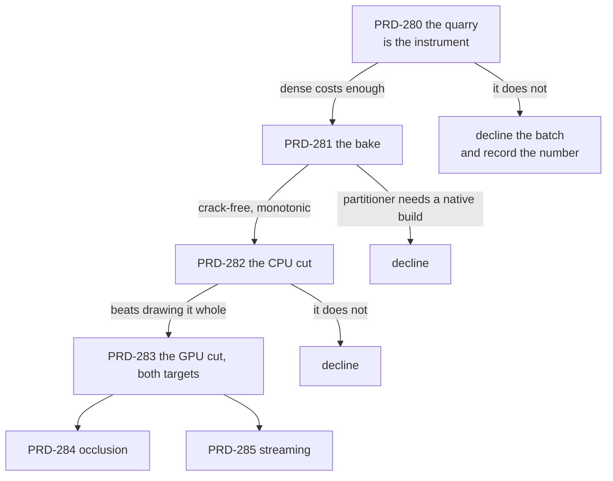

# Batch — virtual geometry ("nanite-like"), opened 2026-08-30

**Status: SCOPING. Nothing in this batch has been measured, and no code has been written.** The
batch opens only if [PRD-280](./PRD-280-the-quarry-is-the-instrument.md) produces a number that
justifies it, and every PRD below names the condition that closes the whole batch rather than just
itself.

**What it is.** A game imports a mesh far denser than the screen can resolve, and the frame submits
only the clusters that resolve — on web and on native, from the same source, **with the game's own
material still doing the shading**. The user-facing surface is one key in the asset config, set once
at bake time.

**What it is not.** Not a second renderer, not a scene format, not a preset, and not a visibility
buffer. The last one is the load-bearing decision and it is argued in full in
[PRD-279](./PRD-279-geometry-the-camera-cannot-resolve-is-never-submitted.md): every published
implementation this batch mines resolves materials in a full-screen pass, which means owning the
shading path, which this framework may not do. Dropping it costs performance and is the only reason
the feature is admissible here.

## The PRDs

| # | PRD | Phase | Status |
| --- | --- | --- | --- |
| 279 | [geometry the camera cannot resolve is never submitted](./PRD-279-geometry-the-camera-cannot-resolve-is-never-submitted.md) | the design, the charter argument, the verified state of this repository, the sources | SCOPING |
| 280 | [the quarry is the instrument](./PRD-280-the-quarry-is-the-instrument.md) | 0 — the game, and the price of the problem | NOT STARTED |
| 281 | [a dense mesh bakes to a crack-free cluster DAG](./PRD-281-a-dense-mesh-bakes-to-a-crack-free-cluster-dag.md) | 1 — the baker, offline | NOT STARTED |
| 282 | [the cut is chosen on the CPU first](./PRD-282-the-cut-is-chosen-on-the-cpu-first.md) | 2 — selection and one indirect draw | NOT STARTED |
| 283 | [the cut moves to the GPU and native runs it](./PRD-283-the-cut-moves-to-the-gpu-and-native-runs-it.md) | 3 — compute, and both targets | NOT STARTED |
| 284 | [the frame does not draw what the frame already hid](./PRD-284-the-frame-does-not-draw-what-the-frame-already-hid.md) | 4 — two-pass occlusion | NOT STARTED |
| 285 | [clusters arrive when the camera asks for them](./PRD-285-clusters-arrive-when-the-camera-asks-for-them.md) | 5 — streaming | NOT STARTED |

Read 279 first. It holds the charter argument, the table of what this repository already ships
(with file and line), the two facts that are actually blocking, and the licence rules for the
sources. The rest are execution.

## Decisions taken, so they are not re-argued

Each of these was a real fork. They are settled here; a PRD that wants to reopen one says so in its
Status and gives the measurement that changed the answer.

1. **No visibility buffer, in any phase.** Every source this batch mines resolves materials in a
   full-screen pass, which is the shading path. Taking it would mean the framework decides how a
   virtualized mesh is lit, and it may not. This costs most of the published speedups and buys the
   only thing that makes the feature admissible. Argued in full in PRD-279.
2. **The bake is a config key. There is no runtime flag.** Clustering is turned on under
   `assets.models` in `threenative.config.ts`, the pipeline writes the extension, and the loader
   returns a clustered mesh when it finds one. A game does not ask for this at run time, because a
   minutes-long bake cannot happen at run time and a second way to say the same thing is a second
   thing to get wrong.
3. **The partitioner is ported to TypeScript.** A WASM build of `meshoptimizer` exporting its own
   partitioner is the documented escape if simplification quality measurably suffers, and METIS is
   not on the table for one function. A worse partition costs quality, which is measured; it does
   not cost correctness, which is not negotiable.
4. **Native gets no indirect-dispatch binding.** The dispatch is a fixed size over the cluster table
   and only the *draw* count comes from the GPU. Adding `dispatchWorkgroupsIndirect` means one
   binding on two native paths, the five registrations a new native surface needs, and a census run
   — to save nothing measurable at this scale.
5. **Shadows use one coarse cut, fixed at load.** Selecting a cut per shadow camera doubles the
   selection cost for detail nobody resolves in a shadow, and telling the game to keep its own proxy
   pushes back exactly the work this batch promised to take. It is a known quality limit and the
   visual comparison measures it rather than assuming it away.
6. **The comparison is at equal quality, or it is not a comparison.** Decimating to 5% is cheaper
   *because* it looks worse, so a frame-time race against it is rigged. `dense` is the visual
   reference: `virtual` must beat `decimated` on `render.p50` **and** be closer to `dense` than
   `decimated` is, on the same route frames. Both, or the phase fails.
7. **The instrument is an in-repo example, cross-checked once in a sandbox.** CI and other agents
   have to be able to re-run the number, which a sandbox game outside this repository cannot give.
   But the framework's customer is a cold agent installing tarballs on a clean machine, so the
   `virtual` arm is built once that way before Phase 3 closes.
8. **The opening threshold is 2.0 ms of `render.p50` at 1080p, and it is a floor on the batch, not
   on the phase.** A 60 fps frame is 16.7 ms; 2 ms is 12% of it. A subsystem this size that cannot
   find 12% of a frame on a scene built to flatter it will not find it in a real game.

Left open on purpose, because the answer is not knowable yet: how much of three.js's render pipeline
a depth pyramid can reach without a fork (PRD-284), and whether any game here will ever hold an
asset that does not fit in memory (PRD-285).

## The rules this batch is held to

1. **The game's material draws the clusters.** No framework shader participates. If a phase can only
   be made to work by shading it ourselves, that phase declines.
2. **No new package.** The baker lands in `packages/assets`, which already carries `meshoptimizer`;
   the runtime lands in `packages/core` and imports nothing but `three`. A runtime dependency on
   `meshoptimizer` is a signal to stop and re-scope.
3. **No new file type.** The payload rides inside the `.glb` the pipeline already emits, as the
   `TN_virtual_geometry` glTF extension, read through the seam that already detects meshopt and
   Draco off `extensionsUsed`.
4. **Every phase runs on native in its own commit**, or says `UNVERIFIED` in its Status and means it.
5. **Unity's `com.unity.virtualmesh` is read-only.** Unity Companion License: architecture may be
   read, no code, shader, constant or structure copied. Anyone who opens it says so in the commit
   message. Every other source is MIT and keeps its copyright header when vendored.
6. **A number, or it did not happen.** Each phase writes one file in `docs/verification/` naming
   what executed and what did not.
