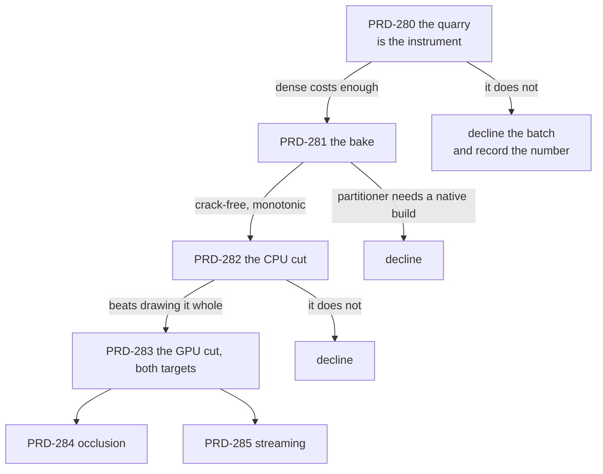

# Batch — virtual geometry ("nanite-like"), opened 2026-08-30

**Status: SCOPING. Nothing in this batch has been measured, and no code has been written.** The
batch opens only if [PRD-280](./PRD-280-the-quarry-is-the-instrument.md) produces a number that
justifies it, and every PRD below names the condition that closes the whole batch rather than just
itself.

**What it is.** A game imports a mesh far denser than the screen can resolve, and the frame submits
only the clusters that resolve — on web and on native, from the same source, **with the game's own
material still doing the shading**. The user-facing surface is one flag on geometry the asset
pipeline already compiles.

**What it is not.** Not a second renderer, not a scene format, not a preset, and not a visibility
buffer. The last one is the load-bearing decision and it is argued in full in
[PRD-279](./PRD-279-geometry-the-camera-cannot-resolve-is-never-submitted.md): every published
implementation this batch mines resolves materials in a full-screen pass, which means owning the
shading path, which this framework may not do. Dropping it costs performance and is the only reason
the feature is admissible here.

## The PRDs

| # | PRD | Phase | Status |
| --- | --- | --- | --- |
| 279 | [geometry the camera cannot resolve is never submitted](./PRD-279-geometry-the-camera-cannot-resolve-is-never-submitted.md) | the design, the charter argument, the verified state of this repository, the sources | SCOPING |
| 280 | [the quarry is the instrument](./PRD-280-the-quarry-is-the-instrument.md) | 0 — the game, and the price of the problem | NOT STARTED |
| 281 | [a dense mesh bakes to a crack-free cluster DAG](./PRD-281-a-dense-mesh-bakes-to-a-crack-free-cluster-dag.md) | 1 — the baker, offline | NOT STARTED |
| 282 | [the cut is chosen on the CPU first](./PRD-282-the-cut-is-chosen-on-the-cpu-first.md) | 2 — selection and one indirect draw | NOT STARTED |
| 283 | [the cut moves to the GPU and native runs it](./PRD-283-the-cut-moves-to-the-gpu-and-native-runs-it.md) | 3 — compute, and both targets | NOT STARTED |
| 284 | [the frame does not draw what the frame already hid](./PRD-284-the-frame-does-not-draw-what-the-frame-already-hid.md) | 4 — two-pass occlusion | NOT STARTED |
| 285 | [clusters arrive when the camera asks for them](./PRD-285-clusters-arrive-when-the-camera-asks-for-them.md) | 5 — streaming | NOT STARTED |

Read 279 first. It holds the charter argument, the table of what this repository already ships
(with file and line), the two facts that are actually blocking, and the licence rules for the
sources. The rest are execution.

## The rules this batch is held to

1. **The game's material draws the clusters.** No framework shader participates. If a phase can only
   be made to work by shading it ourselves, that phase declines.
2. **No new package.** The baker lands in `packages/assets`, which already carries `meshoptimizer`;
   the runtime lands in `packages/core` and imports nothing but `three`. A runtime dependency on
   `meshoptimizer` is a signal to stop and re-scope.
3. **No new file type.** The payload rides inside the `.glb` the pipeline already emits, as the
   `TN_virtual_geometry` glTF extension, read through the seam that already detects meshopt and
   Draco off `extensionsUsed`.
4. **Every phase runs on native in its own commit**, or says `UNVERIFIED` in its Status and means it.
5. **Unity's `com.unity.virtualmesh` is read-only.** Unity Companion License: architecture may be
   read, no code, shader, constant or structure copied. Anyone who opens it says so in the commit
   message. Every other source is MIT and keeps its copyright header when vendored.
6. **A number, or it did not happen.** Each phase writes one file in `docs/verification/` naming
   what executed and what did not.
