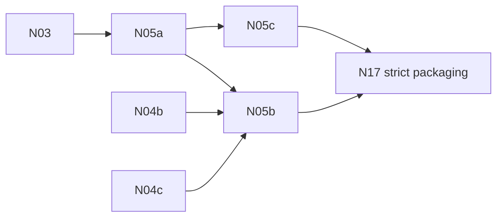

# N05 — Native TypeScript compiler qualification

**Status:** PROPOSED — early risk gate (§16, §17). Children carry the boxes; this file has none.

N05 decides whether gate **T** (§1) is reachable before the engine rewrite widens. It must show one
Three-shaped TypeScript fixture, written against the familiar `three`, `three/webgpu` and
`three/tsl` imports, compiled ahead of time by a pinned TypeScriptCompiler and running natively on
Linux x64 and Android arm64, with a proven rooting/reclamation path for callbacks that capture
engine wrappers (§7.1, §8.4). If the agreed corpus needs a broad compiler or runtime redesign, the
stop rule in [PRD-505](PRD-505-n05a-the-language-corpus-compiles-on-linux-x64.md#decisions) applies.

| Key | PRD | Depends on |
| --- | --- | --- |
| N05a | [PRD-505 — The language corpus compiles on Linux x64](PRD-505-n05a-the-language-corpus-compiles-on-linux-x64.md) | [N03](../PRD-500-n03-api-catalog-binding-abi-and-version-protocol.md) |
| N05b | [PRD-506 — Three imports bind natively and callbacks are reclaimed](PRD-506-n05b-three-imports-bind-natively-and-callbacks-are-reclaimed.md) | N05a, [N04b](../N04-lifetime-and-numerics/PRD-502-n04b-handles-keep-identity-and-aliases.md), [N04c](../N04-lifetime-and-numerics/PRD-503-n04c-unreachable-cycles-are-reclaimed.md) |
| N05c | [PRD-507 — The same corpus runs on Android arm64](PRD-507-n05c-the-same-corpus-runs-on-android-arm64.md) | N05a |

Back to the [native-engine batch](../README.md).
