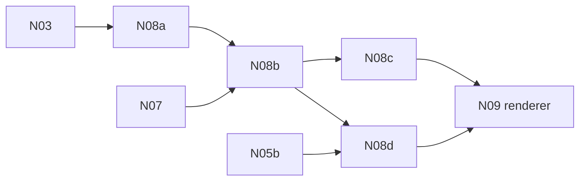

# N08 — Native TSL and shader packages

**Status:** PROPOSED — early risk gate (§9, §16, §17). Children carry the boxes; this file has none.

N08 proves TSL does not stay runtime JavaScript (§18). The application must render, with no
upstream `three` inside it: standard lit PBR; a TSL vertex deformation whose shadow follows the
deformed shape; storage-buffer compute feeding a draw; and a multi-pass effect through a render
target — with at least one graph built dynamically by compiled game code (§9.4). Each material
executes from a complete shader package, not WGSL text alone (§9.2).

| Key | PRD | Depends on |
| --- | --- | --- |
| N08a | [PRD-510 — A typed shader IR with ordered effects](PRD-510-n08a-a-typed-shader-ir-with-ordered-effects.md) | [N03](../PRD-500-n03-api-catalog-binding-abi-and-version-protocol.md) |
| N08b | [PRD-511 — Shader packages, not WGSL text](PRD-511-n08b-shader-packages-not-wgsl-text.md) | N08a, [N07](../PRD-509-n07-gpu-resources-presentation-and-device-loss.md) |
| N08c | [PRD-512 — Standard PBR and deformation that shadows](PRD-512-n08c-standard-pbr-and-deformation-that-shadows.md) | N08b |
| N08d | [PRD-513 — Compute, multipass and a dynamic graph](PRD-513-n08d-compute-multipass-and-a-dynamic-graph.md) | N08b, [N05b](../N05-native-typescript-qualification/PRD-506-n05b-three-imports-bind-natively-and-callbacks-are-reclaimed.md) |

Back to the [native-engine batch](../README.md).
