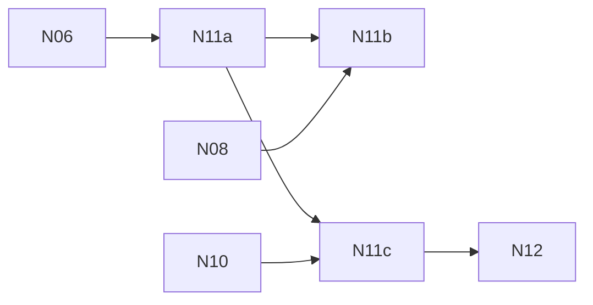

# N11 — Native animation, morphs and skinning

**Status:** PROPOSED — umbrella for PRD-516 … PRD-518; the boxes live in the child PRDs.

**Gate:** no child PRD here starts until [PRD-534 (CP1)](../PRD-534-cp1-the-native-engine-earns-the-port.md) passes (owner decision 3, 2026-10-04).

The work package must prove the supported `AnimationMixer` semantics running natively (§11.2): pose parity with the pinned reference, event ordering, morph targets and non-skeletal property tracks, and skinning palettes with previous-pose history for motion vectors. Animation update frequency is verified separately from render-pass frequency. An explicitly updated mixer is never evaluated a second time by engine scheduling (§6.4).

| Key | PRD | Depends on |
| --- | --- | --- |
| N11a | [PRD-516 — AnimationMixer semantics in native](../../done/native-engine/N11-native-animation/PRD-516-n11a-animation-mixer-semantics-in-native.md) | [PRD-508 (N06)](../../done/native-engine/PRD-508-n06-native-scene-graph-transforms-cameras-geometry.md) |
| N11b | [PRD-517 — Morph targets and property tracks](../../done/native-engine/N11-native-animation/PRD-517-n11b-morph-targets-and-property-tracks.md) | N11a, [N08](../N08-native-tsl-and-shader-packages/README.md) |
| N11c | [PRD-518 — Skinning palettes and pose history](../../done/native-engine/N11-native-animation/PRD-518-n11c-skinning-palettes-and-pose-history.md) | N11a, [PRD-515 (N10)](../../done/native-engine/PRD-515-n10-native-gltf-cooked-assets-and-decoders.md) |

ozz-animation is a later, measured option for packed skeletal workloads (§11.2). It is not scheduled here: it gets its own PRD only when a physical-device profile shows the exact evaluator is the bottleneck, and it must pass the same pose and time tests.

Back to the [native-engine batch](../README.md).
