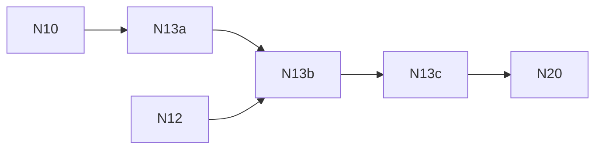

# N13 — Native streaming and world systems

**Status:** PROPOSED — umbrella for PRD-520 … PRD-522; the boxes live in the child PRDs.

The work package must prove that a streamed world loads, walks and unloads on the native host with no TypeScript engine implementation behind it (§11.3). Streaming admission stays inside a per-frame budget. Failures and recovery are visible. Repeated bounded load/unload cycles show no sustained memory growth (§15.4). Today's systems are `packages/core/src/streaming.ts`, `world-cells.ts`, `world-tiles.ts`, `world-gpu-scene.ts`, `world-package.ts` and `world.ts`. Their baseline record is the Machinefall entry in `docs/verification/runtime-perf-state.md` (§3 R4).

| Key | PRD | Depends on |
| --- | --- | --- |
| N13a | [PRD-520 — Bounded streaming admission and IO events](PRD-520-n13a-bounded-streaming-admission-and-io-events.md) | [PRD-515 (N10)](../PRD-515-n10-native-gltf-cooked-assets-and-decoders.md) |
| N13b | [PRD-521 — WorldCells and WorldTiles run native](PRD-521-n13b-worldcells-and-worldtiles-run-native.md) | N13a, [PRD-519 (N12)](../PRD-519-n12-native-batching-visibility-lod-gpu-scene.md) |
| N13c | [PRD-522 — A world loads, walks and unloads without growth](PRD-522-n13c-a-world-loads-walks-and-unloads-without-growth.md) | N13b |

Back to the [native-engine batch](../README.md).
