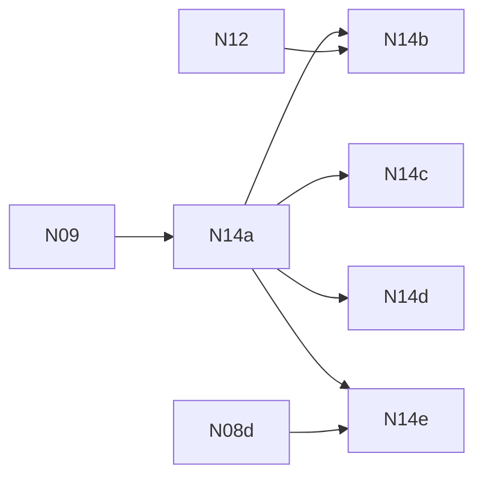

# N14 — Native render chain and advanced visuals

**Status:** PROPOSED — sliced 2026-10-04 from the [native-engine batch](../README.md) (§10, §11.3, §16).

The work package is done when every advanced visual system a representative game needs — virtual
shadows, probes, the render chain's post effects, particles and fluids — runs in the native renderer
with no TypeScript engine implementation behind it, and every temporal effect keeps correct history
across camera cuts, resize, new objects, skeleton reuse and LOD transitions (§16 N14 evidence:
"required VSM/probe/temporal/effect fixtures with history correctness").

The render graph (N14a) lands first; every other child declares its passes and history through it.
The look stays game-owned: templates keep authoring post, lighting and materials in `src/render/` as
TSL, compiled through N08. The engine owns only the mechanism.

| Key | PRD | Depends on |
| --- | --- | --- |
| N14a | [PRD-523 — The render graph owns passes and history](PRD-523-n14a-the-render-graph-owns-passes-and-history.md) | N09 |
| N14b | [PRD-524 — Virtual shadows run native](PRD-524-n14b-virtual-shadows-run-native.md) | N14a, N12 |
| N14c | [PRD-525 — Probes run native](PRD-525-n14c-probes-run-native.md) | N14a |
| N14d | [PRD-526 — Post effects and render chains run native](PRD-526-n14d-post-effects-and-render-chains-run-native.md) | N14a |
| N14e | [PRD-527 — Particles and fluids run native](PRD-527-n14e-particles-and-fluids-run-native.md) | N14a, N08d |

